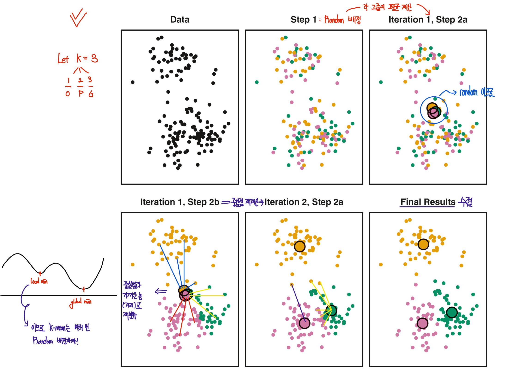
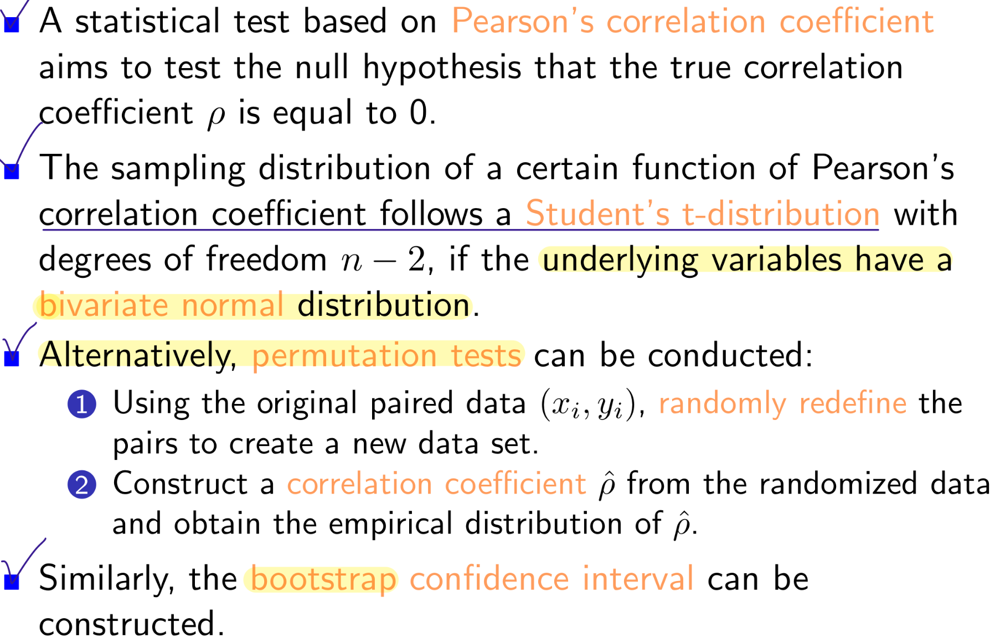

## 05. Cluster Analysis

```{r}
library(multtest)
library(genefilter)
library(ALL)
library(gplots)
library(ISLR2)
```

### Introduction

-   Cluster analysis consists of several methods for discovering a subset of genes which form a group under some obervable **similarity criteria.**

-   These methods are based on **distiance function** and an algorithm to join data points into clusters based on their relative distances to each other.

#### Distance

-   The concept of distance plays a crucial role in cluster analysis.

-   The following **properties are satisfied.**


-   When analyzing gene expression values for several patients, it' s important to define a **distance between vectors of gene expressions**, such as the distance between $a = (a_1,...,a_n)^T$ and $b = (b_1,...,b_n)^T$ .

-   We wii focus mainly on the **Euclidean distance**.

$$
d(a, b ) = \sqrt{\sum^n_{i=1}(a_i-b_i)^2}
$$

### Example of Euclidean Distance

-   Example : Distances betwwen Cyclin gene expressions.

    -   We select the genes related to the biological term "Cyclin" and then compute the Euclidean distance between their expresssion values in the **Golub** data.

```{r}
data(golub, package= "multtest")
cyclins = grep("Cyclin", golub.gnames[,2]) # cyclins과 관련된 이름 뽑!
golub.gnames[cyclins,2]
golub[cyclins,]
dim(golub[cyclins,])
dist.cyclin = dist(golub[cyclins, ], method = "euclidean")
dist.cyclin
```

```{r}
distanceMatrix = as.matrix(dist.cyclin)
rownames(distanceMatrix) = golub.gnames[cyclins, 3]
colnames(distanceMatrix) = golub.gnames[cyclins, 3]
distanceMatrix[1:5, 1:5]
```

### Example of Euclidean Distance

-   Example: Finding the ten genes with expression patterns most similar to the MME gene.

    -   `genefinder()` : 지정한 유전자의 발현 패턴과 가장 유사한 유전자들을 거리 기준으로 찾아줌.

```{r}
library(genefilter)
library(ALL)
data(ALL)
closeto1389_at <- genefinder(ALL, "1389_at", 10, method="euc")
#  "1389_at" 유전자와 유클리드 거리 기준으로 가장 가까운 10개의 유전자를 찾아줘.
closeto1389_at
```

-   index 번호하고 거리하고 넘겨줌

```{r}
w <- featureNames(ALL)[closeto1389_at[[1]]$indices] 
data.frame(genes=w, distance=closeto1389_at[[1]]$dists)
```

### Clustering

-   We seek a partition of the data into distinct groups so that the observations within each group are quite similar to each other.

-   There is two differnet clustering methods.

    -   K-means clustering

    -   Hierarchical clustering

### K - means Clustering

-   Let $C_1, C_2, ..., C_k$ (\$k\$ is hyperparameter) denote sets containing the indices of the observations in each cluster.

-   If the $i$th observation is in the $k$th cluster, then $i \in C_K$.

-   Property 1 : 각 관측치는 무조건 K개 group 중 하나에는 들어가야한다.

-   Property 2 : 각 그룹의 교집한은 존재 하지 않는다. (관측치가 동시에 다른 그룹에 속하지 x)

-   The idea behinde K-means clustering is that a good clustering is one for which the WCV is as small as possible.

> WCV (Within - Cluster Variation)이란?
>
> WCV는 하나의 군집 안에 있는 데이터들이 서로 얼마나 흩어져 있는지를 측정하는 값.
>
> 즉, 같은 군집 안에 있는 데이터들이 서로 얼마나 비슷한가 를 수치로 나타냄.

-   Typically, we us **Euclidean distance**

{width="500"}

### K - Means Cluster Algorithm




-   This algorithm is guaranteed to decrease the value of Total within-cluster variation, however it is not guaranteed to give **global minimun**.

### Example of the K-means Clustering

-   Example : K - means cluster analysis for 2 patients and 50 genes.

```{r}
set.seed(111)
x1 <- matrix(rnorm(100, 0, 0.5), ncol=2)
x2 <- matrix(rnorm(100, 2, 0.5), ncol=2)
data <- rbind(x1, x2)
data
```

-   데이터 구조 확인하기

-   `nstart` : 몇 번 반복할 것인가..?

```{r}
cl <- kmeans(data, centers = 2, nstart=20)

cl
```

-   분산 설명 비율 -\> 79.2%

-   전체 데이터의 분산 중에서 , **군집 간의 차이**로 설명 가능한 비율!! -\> 높을수록 굿!

```{r}
plot(data, col=cl$cluster, pch=19, xlab="X1", ylab="X2",
main="K-Means Clustering Results with K=2")
points(cl$centers, col=1:2, pch=8, cex=4)
```

```{r}
cl <- kmeans(data, 3, nstart=20)
plot(data, col=cl$cluster, pch=19, xlab="X1", ylab="X2",
main="K-Means Clustering Results with K=3")
points(cl$centers, col=1:2, pch=8, cex=4)
```

```{r}
set.seed(111)
par(mfrow=c(1, 2))
cl <- kmeans(data, 3, nstart=1)

tv <- round(cl$tot.withinss, 3)
plot(data, col=cl$cluster, pch=19, xlab="X1", ylab="X2",
main=paste("(", tv, ")"))
points(cl$centers, col=1:2, pch=8, cex=4)

cl <- kmeans(data, 3, nstart=20) # 여러번 반복하니깐 TWV가 역시 줄어든다!
tv <- round(cl$tot.withinss, 3)
plot(data, col=cl$cluster, pch=19, xlab="X1", ylab="X2",
main=paste("(", tv, ")"))
points(cl$centers, col=1:2, pch=8, cex=4)
```

-   Example of Application to the Golub data.

    -   We found that the expression values of the genes CCND3 and Zyxin are closely related to the distinction between ALL and AML.

```{r}
data(golub, package="multtest")
zyxin <- grep("Zyxin", golub.gnames[ ,2])
ccnd3 <- grep("CCND3", golub.gnames[ ,2])
data <- data.frame(golub[ccnd3, ], golub[zyxin, ])
colnames(data) <- c("CCND3 (Cyclin D3)", "Zyxin")
```

```{r}
cl <- kmeans(data, 2, nstart=20)
cbind(cl$cluster, golub.cl) # -> clustering 잘되었노!
```

```{r}
cl
```

```{r}
plot(data, col=cl$cluster, pch=19, xlab="CCND3", ylab="Zyxin")
points(cl$centers, col=1:2, pch=8, cex=4)
```

```{r}
par(mfrow=c(1, 3))
cl <- kmeans(data, 2, nstart=20)
plot(data, col=cl$cluster, pch=19, xlab="CCND3", ylab="Zyxin",
main="K = 2")
points(cl$centers, col=1:2, pch=8, cex=4)
cl <- kmeans(data, 3, nstart=20)
plot(data, col=cl$cluster, pch=19, xlab="CCND3", ylab="Zyxin",
main="K = 3")
points(cl$centers, col=1:3, pch=8, cex=4)
cl <- kmeans(data, 4, nstart=20)
plot(data, col=cl$cluster, pch=19, xlab="CCND3", ylab="Zyxin",
main="K = 4")
points(cl$centers, col=1:4, pch=8, cex=4)
```

### Hierarchical Clustering

-   K-means clustering requires us to pre-specify the number of clusters $K$. This can be a disadvantage.

-   Hierarchical Clustering is an alternative approach which does not require that \*\*we commit to a particular choice of $K$.\*\*

-   HC results in an attractive tree-based representation of the observations, called a dendrogram.

-   We describe bottom-up or agglomerative clustering. This is the most common type of hierarchical clustering, and refers to the fact that a dendrogram is built starting from the leaves and combining clusters up to the trunk.

-   Hierarchical clustering starts with each point in its own cluster, and identify the closest two clusters and merge them, until all points are in a single cluster.


-   덴드로그랩에서 가로축 상의 가까운 위치만 보고 두 개체가 유사하다고 판단하면 안된다.

-   두 관측치가 유사한지는, 각각이 속한 가지가 수직축의 어느 높이에서 처음으로 합쳐지는지를 보고 판단해야 한다.

### Dissimilarity of Clusters

-   계층적 군집 알고리즘은 덴드로그램의 맨 아래에서 시작하며, 각 관측치를 독립적인 군집으로 취급한다.

-   그 후 가장 유사한 두 군집을 계속 합쳐가며, 결국 하나의 큰 군집이 될 때까지 반복한다.

-   관측치 간의 dissimilarity는 유클리드 거리로 측정할 수 있다.

-   그럼 군집은??? -\> by Linkage!

### Type of Linkage


### Example of Single Linkage

-   Example : Single linkage with 5 genes.

```{r}
names <- list(c("g1", "g2", "g3", "g4", "g5"),
c("patient 1", "patient 2"))
sl <- matrix(c(1, 1, 1, 1.3, 3, 2, 3, 2.4, 5, 5), ncol=2, 
             byrow=TRUE, dimnames=names)
```

```{r}
rr <- c(0, 6)
plot(sl, pch=19, col="blue", cex=1.4, xlim=rr, ylim=rr)
text(sl, labels=row.names(sl), pos=4, col="red", cex=1.2)
print(dist(sl, method="euclidean"), digits=3)
```

```{r}
ds <- dist(sl, method="euclidean")
sl.out <- hclust(ds, method="single")
sl.out
```

```{r}
plot(sl.out, lwd=3, col="blue", col.axis = "brown",
hang=-1, main=NA, sub=NA, axes=FALSE, ylab="Distance",
xlab="Clustering of the expression of 5 genes")
axis(side=2, at=seq(0,3.5,.5), col="brown", labels=TRUE, lwd=4)
```

-   Example of Random Data

```{r}
set.seed(12345)
x <- rnorm(20)
out <- hclust(dist(x, method="euclidean"), method="single")
plot(out, lwd=3, col="blue", hang=-1, main=NA, sub=NA,
axes=FALSE, ylab="Distance",
xlab="20 genes with normal random distances")
axis(side=2, at=seq(0,1.4,.2), col="brown", labels=TRUE, lwd=4)
```

> This example highlights an important caveat about clustering
>
> -   clustering will always produce clusters in your data even if all the data is sampled from identical distributions.

```{r}
set.seed(4321)
x <- c(rnorm(10, 0, 0.1), rnorm(10, 3, 0.5),
rnorm(10, 10, 1.0))
out <- hclust(dist(x, method="euclidean"), method="single")
out
```

-   분산이 작다 -\> 옹기종기 모여있다 -\> 그럼 빨리 군집화된다-\> 군집화되는 height가 작다!

```{r}
plot(out, lwd=3, col="blue", hang=-1, main=NA, sub=NA,
axes=FALSE, ylab="Distance",
xlab="3 clusters of 10 genes each")
axis(side=2, at=seq(0, 5, 1), col="brown", labels=TRUE, lwd=4)
abline(h=1, lty=2, lwd=2, col="gray")
```

### Example of Hierarchical Clustering

-   Example : Application to the Golub data.

```{r}
data(golub, package="multtest")
zyxin <- grep("Zyxin", golub.gnames[ ,2])
ccnd3 <- grep("CCND3", golub.gnames[ ,2])
```

```{r}
clusdata <- data.frame(golub[ccnd3, ], golub[zyxin, ])
colnames(clusdata) <- c("CCND3 Cyclin D3", "Zyxin")
gfactor <- factor(golub.cl, levels=0:1, labels=c("ALL", "AML"))
```

```{r}
gf <- as.numeric(gfactor)
plot(clusdata, pch=gf+15, col=gf+1)
legend("topright", legend=c("ALL", "AML"), pch=16:17, col=c(2,3))
```

```{r}
dist.cl <- dist(clusdata, method="euclidean")
gcl <- hclust(dist.cl, method="single")
```

```{r}
plot(gcl, lwd=3, col="blue", hang=-1, main=NA, sub=NA,
axes=FALSE, ylab="Distance",
xlab="Clustering of patients by gene expression")
axis(side=2, at=seq(0,1.2,.2), col="brown", labels=TRUE, lwd=4)
abline(h=0.6, lty=2, lwd=2, col="gray")
```

-   Apart from three misplaced patients, the tree contains two main clusters that correctly corresponed to the two groups.

```{r}
# 실제 VS cluster 된거 check
sort(rev(gcl$order)[1:9]) # 제일 오른쪽 cluster의 원소들 9개! -> AML로 판명된것들
which(gfactor == "AML")
```

-   Complete, average, centroid

```{r}
par(mfrow=c(2, 2))
hc1 <- hclust(dist.cl, method="single")
plot(hc1, main="Single Linkage", xlab="", sub="", hang=-1)
abline(h=0.6, lty=2, col="blue")
hc2 <- hclust(dist.cl, method="complete")
plot(hc2, main="Complete Linkage", xlab="", sub="", hang=-1)
abline(h=3, lty=2, col="orange")
hc3 <- hclust(dist.cl, method="average")
plot(hc3, main="Average Linkage", xlab="", sub="", hang=-1)
abline(h=2.0, lty=2, col="green")
hc4 <- hclust(dist.cl, method="centroid")
plot(hc4, main="Centroid Linkage", xlab="", sub="", hang=-1)
abline(h=1, lty=2, col="purple")
```

### Heatmap

-   Let's generate a heatmap using just the top 50 most differentially expressed genes between ALL and AML patients.

```{r}
data(golub, package="multtest")
gFactor <- factor(golub.cl, levels=0:1, labels=c("ALL","AML"))
meanALL <- apply(golub[ ,gFactor=="ALL"], 1, mean)
meanAML <- apply(golub[ ,gFactor=="AML"], 1, mean)
o <- order(abs(meanALL - meanAML), decreasing=TRUE)
DE50 <- golub[o[1:50], ]
hist(DE50, nclass=50, col="orange")
```

```{r}
library(gplots)
heatmap.2(DE50, Rowv=NA, Colv=NA, scale="row", cexRow=0.5,
col=greenred(75), dendrogram="none", key=TRUE,
symkey=FALSE, density.info="none", trace="none")
```

```{r}
heatmap.2(DE50, scale="row", col=greenred(75),
dendrogram="both", key=TRUE, symkey=FALSE,
density.info="none", trace="none", cexRow=0.5)
```

### The Correlation Coefficient

-   A correlation coefficient measures the degree of linear relationship between two sets of gene expression values/

     

### Example of The Correlation Coefficient

-   Example : MCM3 gene expression.

```{r}
data(golub, package="multtest")
mcm3 <- grep("MCM3", golub.gnames[, 2])
```

```{r}
golub.gnames[mcm3, ]
x <- golub[mcm3[1], ]
y <- golub[mcm3[2], ]

cor(x,y)
cov(scale(x), scale(y))

plot(x,y, pch=19, col="blue3")
abline(lm(y~x)$coef, col=2, lty=2, lwd=2)
cor.test(x,y)
```

```{r}
B = 10000
per.cor = NULL
```

```{r}
set.seed(1010)
for (i in 1:B){
  index1 = sample(1:length(x))
  index2 = sample(1:length(y))
  per.cor[i] = cor(x[index1], y[index2])
}
```

-   귀무가설 x ,y 상관없음 하에서 얻을 수 있는 상관계수의 분포

```{r}
hist(per.cor, nclass = 50, col= "orange")
c0 = cor(x, y)
abline(v = c(-c0, c0), lty = 2, lwd = 2, col = "blue")
```

```{r}
(sum(abs(per.cor) > abs(c0)) + 1) / (B + 1)
```

> 파란 선이 분포의 끝에 있다는 건, 관측된 상관계수가 귀무분포에서 매우 희귀한 값이란 뜻 → H₀ 기각 → 상관 있음

```{r}
B = 10000
boot.cor = rep(0 ,B)
data = cbind(x, y)
```

```{r}
set.seed(1)
for (i in 1:B){
  index = sample(1:nrow(data), replace = TRUE)
  dat.star = data[index, ]
  boot.cor[i] = cor(dat.star)[1, 2]
}
```

```{r}
hist(boot.cor, nclass=50, col="orange")
CI <- quantile(boot.cor, c(0.025, 0.975))
abline(v=CI, lty=2, lwd=2, col="blue")
```

> 이 그래프는 "데이터의 두 변수는 부트스트랩 상관계수 기준으로 **약 0.2\~0.9 사이의 신뢰구간**을 가지며,
>
> **명백히 양의 상관관계를 가진다**"는 것을 보여준다.

```{r}
mean(boot.cor)
CI
```

-   Example : Application to the Golub data.

```{r}
y = golub.cl
y
```

```{r}
corgol = apply(golub, 1, function(x) cor(x, y))
```

```{r}
top <- 10
ot <- o[1:top]
data.frame(genes=golub.gnames[ot, 3], cor=corgol[ot])
```

```{r}
fun <- function(x) summary(lm(x ~ y))$fstat[1]
fstat <- apply(golub, 1, fun)
o2 <- order(fstat, decreasing=TRUE)
```

-   두 방법 모두 유전자 발현과 두 환자 그룹(ALL/AML) 간의 연관성 강도를 측정한다.

```{r}
top <- 10
ot2 <- o2[1:top]
data.frame(genes=golub.gnames[ot2, 3], f.stat=fstat[ot2])
# corr이랑 ranking이랑 같다!
par(mfrow=c(1, 2))
hist(abs(corgol), nclass=20, col="orange", xlab="",
main="Absolute values of PCC")
hist(fstat, nclass=20, col="lightblue", xlab="",
main="F test statistics")
```

### PCA

### Example of PCA

-   Example: Application to thee Golub data

```{r}
data(golub, package="multtest")
cgolub <- cor(golub)
dim(cgolub)
e <- eigen(cgolub)
dim(e$vector)
e$values
plot(e$values, type="b", pch=19, col=2, ylab="eigenvalues",
xlab="the number of components")
```

-   We apply the previous bootstrap method th estimate 95% CI for the eigenvalues.

-    기존 데이터에서 boostrap으로 p개의 행을 중복을 허용해서 새로운 데이터 세트를 만들고 p x n
    사이즈의 데이터를 그리고 그걸로 eigen을 구한다 -\> 10000번 반복 ㄱㄱㅎ

```{r}
n = ncol(golub)
p = nrow(golub)
B = 10000
```

```{r}
set.seed(10101)
eval = matrix(0, B, n)
for (i in 1:B){
  index = sample(1:p, replace = TRUE)
  boot = golub[index,]
  eval[i,] = eigen(cor(boot))$values
}

CI = apply(eval ,2, function(t) quantile(t, c(0.025, 0.975)))
```

```{r}
t(CI)
```

### 
