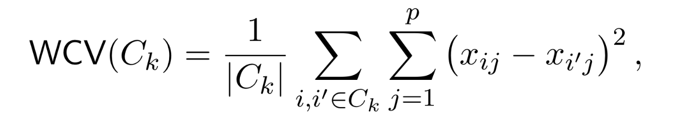

## 05. Cluster Analysis

```{r}
library(multtest)
library(genefilter)
library(ALL)
library(gplots)
library(ISLR2)
```

### Introduction

-   Cluster analysis consists of several methods for discovering a subset of genes which form a group under some obervable **similarity criteria.**

-   These methods are based on **distiance function** and an algorithm to join data points into clusters based on their relative distances to each other.

#### Distance

-   The concept of distance plays a crucial role in cluster analysis.

-   The following **properties are satisfied.**


-   When analyzing gene expression values for several patients, it' s important to define a **distance between vectors of gene expressions**, such as the distance between $a = (a_1,...,a_n)^T$ and $b = (b_1,...,b_n)^T$ .

-   We wii focus mainly on the **Euclidean distance**.

$$
d(a, b ) = \sqrt{\sum^n_{i=1}(a_i-b_i)^2}
$$

### Example of Euclidean Distance

-   Example : Distances betwwen Cyclin gene expressions.

    -   We select the genes related to the biological term "Cyclin" and then compute the Euclidean distance between their expresssion values in the **Golub** data.

```{r}
data(golub, package= "multtest")
cyclins = grep("Cyclin", golub.gnames[,2]) # cyclins과 관련된 이름 뽑!
golub.gnames[cyclins,2]
golub[cyclins,]
dim(golub[cyclins,])
dist.cyclin = dist(golub[cyclins, ], method = "euclidean")
dist.cyclin
```

```{r}
distanceMatrix = as.matrix(dist.cyclin)
rownames(distanceMatrix) = golub.gnames[cyclins, 3]
colnames(distanceMatrix) = golub.gnames[cyclins, 3]
distanceMatrix[1:5, 1:5]
```

### Example of Euclidean Distance

-   Example: Finding the ten genes with expression patterns most similar to the MME gene.

    -   `genefinder()` : 지정한 유전자의 발현 패턴과 가장 유사한 유전자들을 거리 기준으로 찾아줌.

```{r}
library(genefilter)
library(ALL)
data(ALL)
closeto1389_at <- genefinder(ALL, "1389_at", 10, method="euc")
#  "1389_at" 유전자와 유클리드 거리 기준으로 가장 가까운 10개의 유전자를 찾아줘.
closeto1389_at
```

-   index 번호하고 거리하고 넘겨줌

```{r}
w <- featureNames(ALL)[closeto1389_at[[1]]$indices] 
data.frame(genes=w, distance=closeto1389_at[[1]]$dists)
```

### Clustering 

-   We seek a partition of the data into distinct groups so that the observations within each group are quite similar to each other.

-   There is two differnet clustering methods.

    -   K-means clustering

    -   Hierarchical clustering

### K - means Clustering

-   Let $C_1, C_2, ..., C_k$ (\$k\$ is hyperparameter) denote sets containing the indices of the observations in each cluster.

-   If the $i$th observation is in the $k$th cluster, then $i \in C_K$.

-   Property 1 : 각 관측치는 무조건 K개 group 중 하나에는 들어가야한다.

-   Property 2 : 각 그룹의 교집한은 존재 하지 않는다. (관측치가 동시에 다른 그룹에 속하지 x)

-   The idea behinde K-means clustering is that a good clustering is one for which the WCV is as small as possible.

> WCV (Within - Cluster Variation)이란?
>
> WCV는 하나의 군집 안에 있는 데이터들이 서로 얼마나 흩어져 있는지를 측정하는 값.
>
> 즉, 같은 군집 안에 있는 데이터들이 서로 얼마나 비슷한가 를 수치로 나타냄.

-   Typically, we us **Euclidean distance**

{width="500"}

### K - Means Cluster Algorithm


-   This algorithm is guaranteed to decrease the value of Total within-cluster variation, however it is not guaranteed to give **global minimun**.

### Example of the K-means Clustering

-   Example : K - means cluster analysis for 2 patients and 50 genes.

-   

```{r}
set.seed(111)
x1 <- matrix(rnorm(100, 0, 0.5), ncol=2)
x2 <- matrix(rnorm(100, 2, 0.5), ncol=2)
data <- rbind(x1, x2)
```

-   데이터 구조 확인하기

-   `nstart` : 몇 번 반복할 것인가..?

```{r}
cl <- kmeans(data, 2, nstart=20)
cl
```

```{r}
plot(data, col=cl$cluster, pch=19, xlab="X1", ylab="X2",
main="K-Means Clustering Results with K=2")
points(cl$centers, col=1:2, pch=8, cex=4)
```

```{r}
cl <- kmeans(data, 3, nstart=20)
plot(data, col=cl$cluster, pch=19, xlab="X1", ylab="X2",
main="K-Means Clustering Results with K=3")
points(cl$centers, col=1:2, pch=8, cex=4)
```

```{r}
set.seed(111)
par(mfrow=c(1, 2))
cl <- kmeans(data, 3, nstart=1)

tv <- round(cl$tot.withinss, 3)
plot(data, col=cl$cluster, pch=19, xlab="X1", ylab="X2",
main=paste("(", tv, ")"))
points(cl$centers, col=1:2, pch=8, cex=4)
cl <- kmeans(data, 3, nstart=20)
tv <- round(cl$tot.withinss, 3)
plot(data, col=cl$cluster, pch=19, xlab="X1", ylab="X2",
main=paste("(", tv, ")"))
points(cl$centers, col=1:2, pch=8, cex=4)
```

```{r}
data(golub, package="multtest")
zyxin <- grep("Zyxin", golub.gnames[ ,2])
ccnd3 <- grep("CCND3", golub.gnames[ ,2])
data <- data.frame(golub[ccnd3, ], golub[zyxin, ])
colnames(data) <- c("CCND3 (Cyclin D3)", "Zyxin")
```

```{r}
cl <- kmeans(data, 2, nstart=20)
cbind(cl$cluster, golub.cl)
```

```{r}
cl
```

```{r}
plot(data, col=cl$cluster, pch=19, xlab="CCND3", ylab="Zyxin")
points(cl$centers, col=1:2, pch=8, cex=4)
```

```{r}
par(mfrow=c(1, 3))
cl <- kmeans(data, 2, nstart=20)
plot(data, col=cl$cluster, pch=19, xlab="CCND3", ylab="Zyxin",
main="K = 2")
points(cl$centers, col=1:2, pch=8, cex=4)
cl <- kmeans(data, 3, nstart=20)
plot(data, col=cl$cluster, pch=19, xlab="CCND3", ylab="Zyxin",
main="K = 3")
points(cl$centers, col=1:3, pch=8, cex=4)
cl <- kmeans(data, 4, nstart=20)
plot(data, col=cl$cluster, pch=19, xlab="CCND3", ylab="Zyxin",
main="K = 4")
points(cl$centers, col=1:4, pch=8, cex=4)
```
