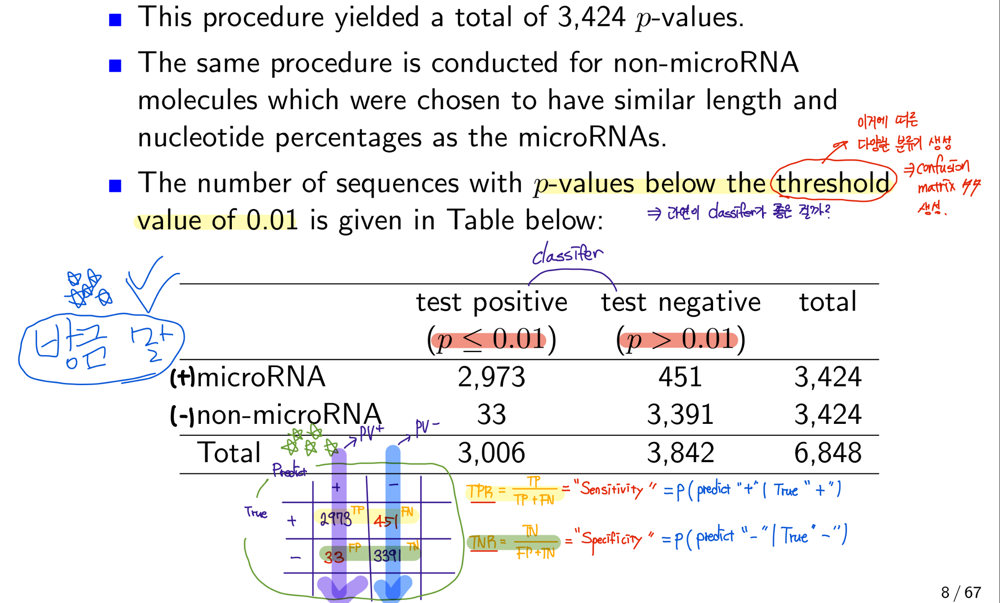
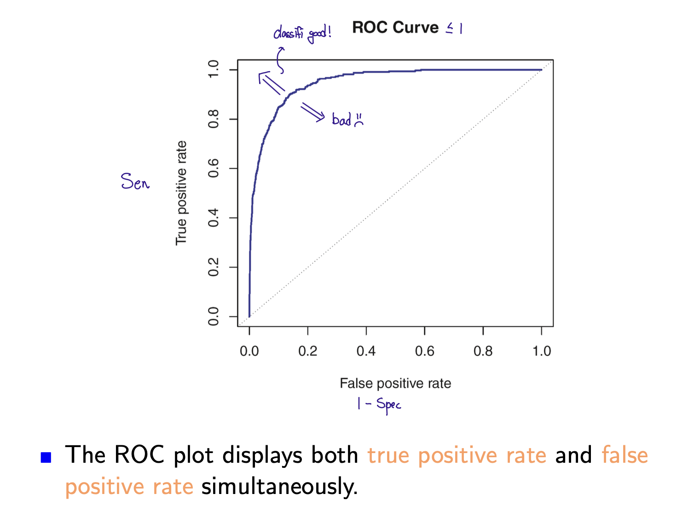
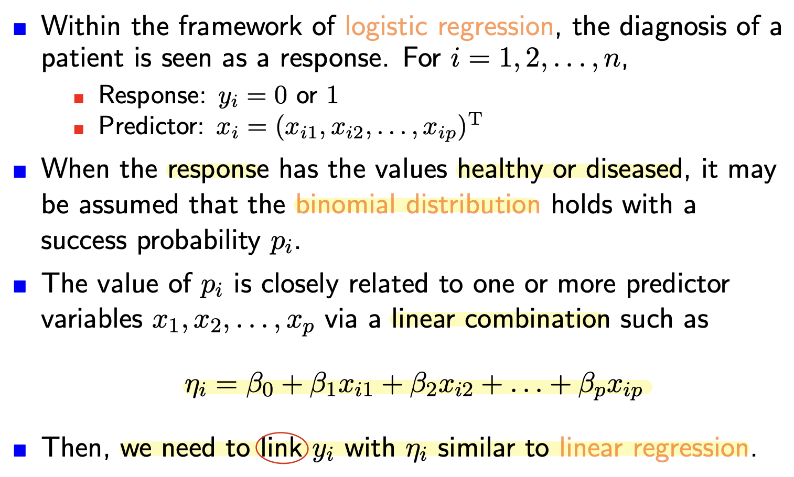
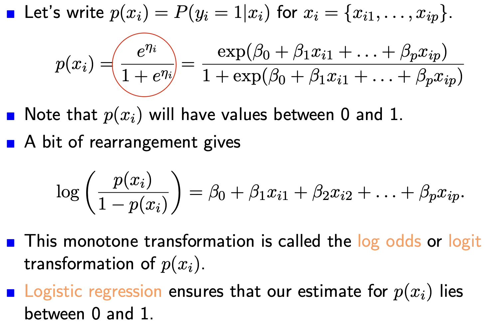
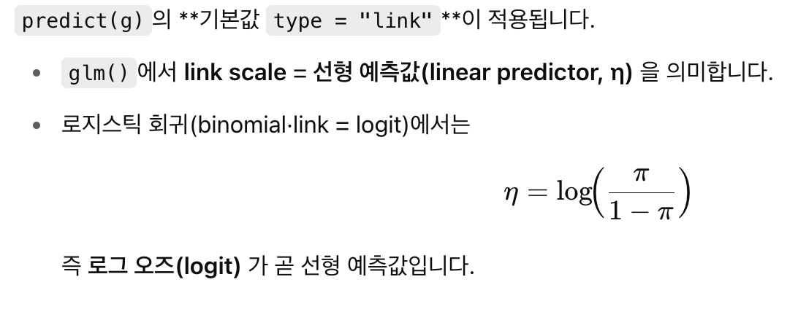
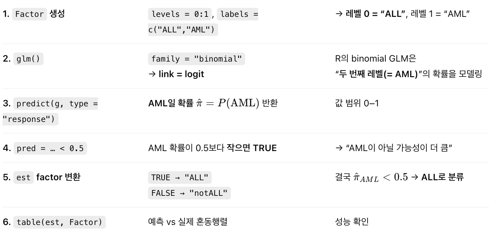
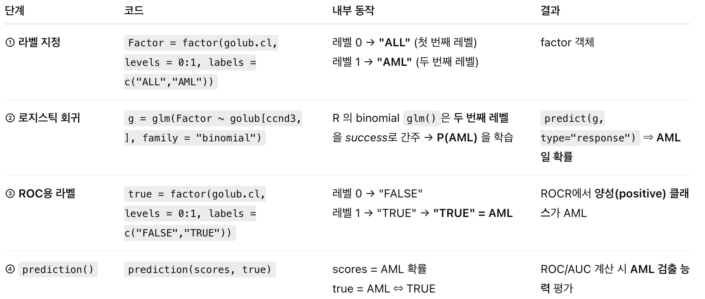
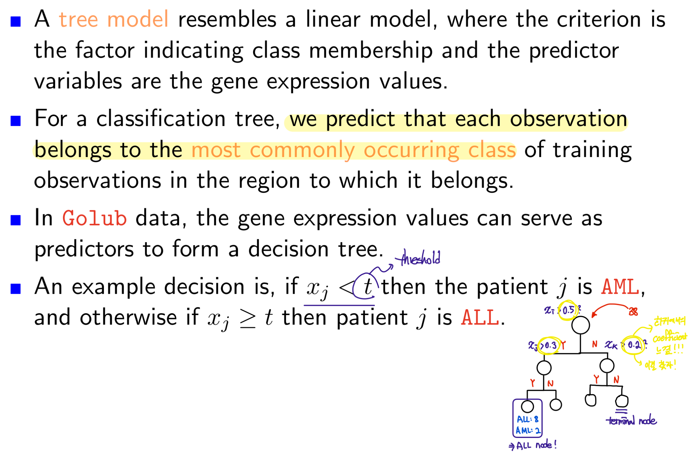
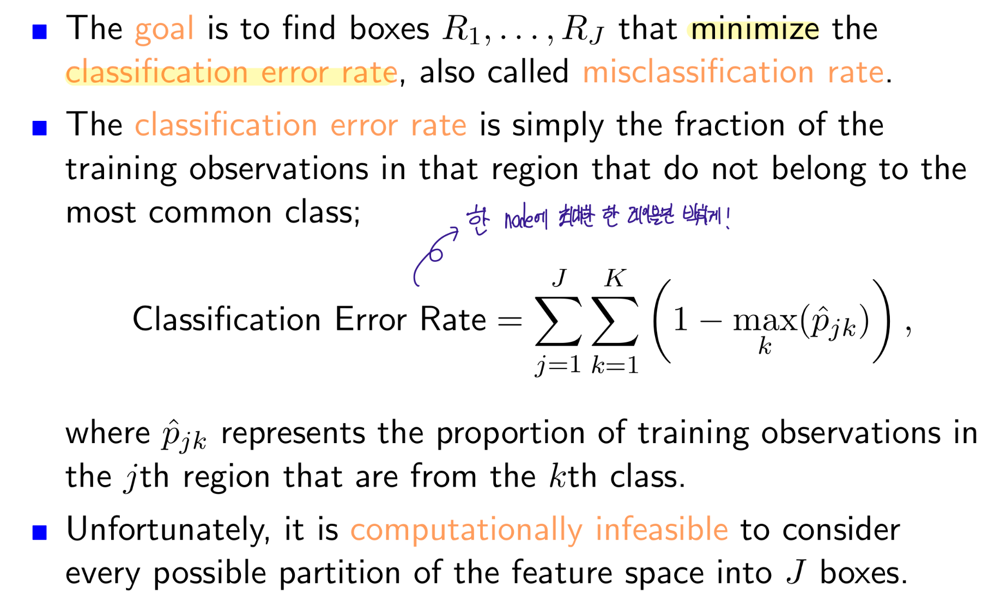
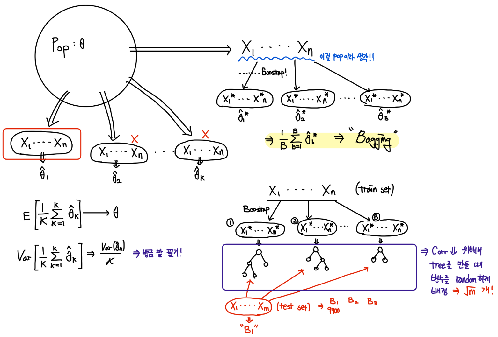

```{r setup, include=FALSE}
knitr::opts_chunk$set(
  warning = FALSE,
  message = FALSE,
  echo    = TRUE     # 코드만 보이게 하고 싶다면 TRUE/ FALSE 조정
)
```

```{r}
#if (!requireNamespace("BiocManager", quietly = TRUE))
#install.packages("BiocManager")
#BiocManager::install("multtest")
#BiocManager::install("ALL")
#BiocManager::install("hgu95av2.db")
#install.packages("ROCR")
#install.packages("rpart")
#install.packages("rpart.plot")
#install.packages("randomForest")
#install.packages("e1071")
```

```{r}
library(multtest)
library(ALL)
library(hgu95av2.db)
library(ROCR)
library(rpart)
library(rpart.plot)
library(randomForest)
library(e1071)
```

## Introduction

-   In, bioinformatics, an importanr question is whether or not the diagnosis of a patient can be predicted by gene expression.

-   A related question is which of the thousands of genes play on important role in the prediction of class membership.

-   These important genes are often called biomarkers.

-   To evaluate the quality of any predictions, the fundamental concepts of **sensitivity** and **specificity** are frequently used.

-   The prediction performance can be summarized in a single number by the **AUC** (ROC curve).

## Classification of micro RNA

-   Based on gene expression measurements, we need to classify microRNA vs non-microRNA.

-   지금 여기에선 permutation p-values를 classifer로 이용한다.

> 일단 내가 이해한 바로는 microRNA 3424에서 rkr microRNA를 1000번 섞어서 순열 pvalue 계산을 진행. 그럼 총 3424개의 p value가 나오고 이걸 non microRNA도 동일하게 해서 총 6848개의 p value를 구해서 0.01이라는 classifier로 분류 진행. -\> 근데 교수님이 일단은 그냥 결과 해석에 초점을 맞추라고 하심.



## Assessment of the Performance of Classifiers

-   The ROC curve is a popular graphic for sum displaying the two types of errors for all possible thresholds.

-   The overall performance of a classifier, summarized over all possible thresholds, is given by AUC.



## ROC curve

-   We have observed that the expression values of the gene CCND3 tend to be greater for ALL patients.

-   We may us CCND3 expression data as a test for predicting ALL using a certain CCND3 cutoff value for classification.

-   For gene expression values larger than a certain cutoff we declare the the positive in the sense of indicating ALL.

-   Suppose that $x_i$ is a gene expression value of the $i$-th individual and $t$ is some threshold.

-   The true and fales positives can be computed for each possible cutoff value - which is how a ROC curve is calculated.

> 아!!!!
>
> AUC 값는 하나의 cutoff에 대한 예측 성능을 평가 하는 것이 아니다!!
>
> 특정 gene(CCND3)이 ALL, AML을 잘 예측 하는 지를 평가하는 것!
>
> 특정 gene이 가질 수 있는 모든 cutoff를 이용해서 그림을 그린 것이 ROC curve이다!

### Example of Classification

```{r}
data(golub, package = "multtest")

Labels = factor(golub.cl, levels = 0:1, labels = c("ALL", "AML"))

ccnd3 = grep("CCND3", golub.gnames[,2], ignore.case = TRUE)

sort(golub[ccnd3, ])

decision = golub[ccnd3, ] >= 1.27 # 

decision # TRUE = positive(ALL), FALSE = negative(AML)

Pred = factor(decision, levels = c("TRUE", "FALSE"),
                        labels = c("ALL", "notALL"))

data.frame(predict = Pred, labels = Labels)

table(Pred, Labels)
```

```{r}
perf <- function(pred, label) {
  tab <- table(pred, label)
  sensitivity <- tab[1, 1]/sum(tab[ ,1])
  specificity <- tab[2, 2]/sum(tab[ ,2])
  PV.positive <- tab[1, 1]/sum(tab[1, ])
  PV.negative <- tab[2, 2]/sum(tab[2, ])
  c(sensitivity, specificity, PV.positive, PV.negative)
}
perf(Pred, Labels)
```

```{r}
decision2 = golub[ccnd3, ] >= 2.18
Pred2 = factor(decision2, levels = c("TRUE", "FALSE"), labels = c("ALL", "notALL"))
perf(Pred2, Labels)
```

-   지금 cutoff 값을 높혔다.

-   그럼 True보다 false가 많아질 것이다.

-   즉, false라고 예측한 비율이 높아질거다.

-   그럼 spec (= 진짜 false 중에서 false라고 예측한 ratio)는 당연히 높아질것이다.

```{r}
decision3 = golub[ccnd3, ] >= 0.8
Pred3 = factor(decision3, levels = c("TRUE", "FALSE"), labels = c("ALL", "notALL"))
perf(Pred3, Labels)
```

-   이제 이 gene에서 가능한 모든 cutoff를 이용해서 이 gene ALL, not ALL를 예측하기 좋은 classifier인지 검증해보자.

```{r}
cutoff = sort(golub[ccnd3, ])
cutoff = c(cutoff, Inf)
cutoff
```

```{r}
res = matrix(0, length(cutoff), 4) # 4 -> sen, spec ,pv+, pv-
rownames(res) = round(cutoff, 3)
colnames(res) = c("sensitivity", "specificity", "PV.positive", "PV.negative")

for (i in 1:length(cutoff)){
  decision = golub[ccnd3, ] > cutoff[i]
  Pred = factor(decision, levels = c("TRUE", "FALSE"), labels = c("ALL", "notALL"))
  res[i, ] = perf(Pred, Labels)
}

head(res);tail(res)
```

```{r}
plot(1-res[,2], res[,1], type="l", xlab="False postive rate",
ylab="True postive rate", col="blue", lwd=3)
```

-   이제 이 곡선의 아래 면적을 구하면 CCND라는 gene이 classifier로 얼마나 좋은 성능을 보여주는지 알 수 있다.

### Example of ROC Curve.

```{r}
library(ROCR)

true = factor(golub.cl , levels = 0:1, labels = c("TRUE", "FALSE"))

predccnd3 = prediction(golub[ccnd3,], true)
```

-   `prediction()` 함수(ROCR 패키지)는 **예측 점수(혹은 확률, 연속형 값)와 실제 라벨**을 받아서,\

    ROC, PR 곡선, AUC 등 각종 성능평가 지표를 \*\*만들기 위한 내부 데이터 구조(객체)\*\*를 생성하는 역할을 한다.

-   **입력**

    -   첫 번째 인자: **예측 점수**\

        (여기서는 `golub[ccnd3, ]`, 즉 각 샘플의 CCND3 유전자 발현값)

    -   두 번째 인자: **정답 라벨**\

        (`true` = ALL/AML 클래스, TRUE/FALSE로 인코딩됨)

    **출력**

    -   ROCR 내부에서 이후 `performance()` 함수로 ROC 곡선, AUC, PR curve 등 다양한 성능 곡선을 계산할 수 있는 **prediction 객체**를 만듭니다.

        이 객체는 모든 threshold를 시뮬레이션 할 수 있도록 점수와 라벨을 잘 정렬해 저장합니다.

```{r}
perfccnd3 = performance(predccnd3, "tpr", "fpr")
plot(perfccnd3, lwd = 3, col = 'blue')
```

```{r}
slotNames(perfccnd3)

# Cut off
list(perfccnd3@alpha.name, perfccnd3@alpha.values)
sort(cutoff, decreasing=TRUE)

# False postive rate
list(perfccnd3@x.name, perfccnd3@x.values)
sort(as.numeric(1-res[,2])) # 1 -fpr = spec

# True postive rate(sen)
list(perfccnd3@y.name, perfccnd3@y.values)
sort(as.numeric(res[,1]))
```

### 이게 중요!!!!

```{r}
# value of AUC
performance(predccnd3, "auc")@y.values
```

-   0.956으로 1에 매우 가까운 값!

-   즉, CCND3 gene은 ALL, not ALL를 나눈데 큰 역할을 하는 classifier이다..!

-   이번에는 Gdf5 gene으로 해볼까??

```{r}
gdf5 = grep('GDF5', golub.gnames[, 2], ignore.case = TRUE)
true = factor(golub.cl , levels = 0:1, labels = c("TRUE", "FALSE"))
predgdf5 = prediction(golub[gdf5, ], true)
perfgdf5 = performance(predgdf5, "tpr", "fpr")
plot(perfgdf5, lwd = 4, col = 'magenta')
performance(predgdf5, "auc")@y.values
```

-   In fact, this GDF5 expression classifer is performing worse than random guessing.

```{r}
true2 <- factor(golub.cl, levels=0:1, labels=c("FALSE", "TRUE"))
predgdf5 <- prediction(golub[gdf5, ], true2)
perfgdf5 <- performance(predgdf5, "tpr", "fpr" )
performance(predgdf5, "auc")@y.values
```

-   그럼 Gdf5 gene은 AML(not ALL)의 biomarker라고 할 수 있다..!!

## Classification Probability

-   Given a feature vector $X$ and qualitative response $Y$ (label : 1, 2, 3, 4..) taking values in the set $C$, the classification task is to build a function $C(X)$ that takes as input feature vector $X$ and predicts it values for $Y$.

-   Often we are more interested in estimating the prob that $X$ belongs to each category in $C$/

-   Suppose that we have only 2 classes such as "Positive" and "Negative".

-   Then, we just need to compare two probs,

$$
P(Y = +, |  X = x) \quad P(Y = - ,|X = X)
$$

-   Equivalently, we just need to know if

$$
P(Y =  +, |X=x) > 0.5
$$

-   In general, $Y$ is a "Positive if

$$
P(Y = +, | X = x) > \alpha
$$

## Logisitc Regression





### Example of Logistic Regression

```{r}
data(golub, package = "multtest")
Factor = factor(golub.cl, levels = 0:1, labels = c("ALL", "AML"))
ccnd3 = grep("ccnd3", golub.gnames[,2], ignore.case = TRUE)

head(data.frame(x = golub[ccnd3, ], y = Factor));tail(data.frame(x = golub[ccnd3, ], y = Factor))
```

```{r}
g = glm(Factor ~ golub[ccnd3, ], family = 'binomial')
summary(g)
```

```{r}
predict(g) # value of linear predictors,  # η = logit(π̂)
```




```{r}
eta = cbind(1, golub[ccnd3, ]) %*% g$coef
head(data.frame(pred = predict(g), eta))
```

```{r}
prob1 = predict(g, type = "response") # # π̂ = expit(η)
prob1
```

```{r}
prob2 = exp(eta) / (1 + exp(eta))
prob3 = exp(predict(g)) / (1 + exp(predict(g)))

head(data.frame(x = golub[ccnd3, ], pred1 = prob1, pred2 = prob2, pred3 = prob3))
```

```{r}
tail(data.frame(x = golub[ccnd3, ], pred1 = prob1, pred2 = prob2, pred3 = prob3))
```

-   현재 데이터 프레임에서 보이는 확률 값은 AML (level = 1)일 확률을 말하고 있다.

```{r}
pred = predict(g, type = "response") < 0.5 # 0.5 보다 작으면 ALL, 크면 AML!!

est = factor(pred, levels = c(TRUE, FALSE), labels = c("ALL", "notALL"))

head(data.frame(pred = est, Labele = Factor));tail(data.frame(pred = est, Labele = Factor))
```

```{r}
table(est, Factor)
```

```{r}
perf(est, Factor)
```

```{r}
# 정리
data(golub, package = "multtest")

Factor = factor(golub.cl, levels = 0:1, labels = c("ALL", "AML"))

ccnd3 = grep("ccnd3", golub.gnames[,2], ignore.case = TRUE)

g = glm(Factor ~ golub[ccnd3, ], family = 'binomial')

pred = predict(g, type = "response") < 0.5

est = factor(pred, levels = c(TRUE, FALSE), labels = c("ALL", "notALL"))

table(est, Factor)
```



### ROC Curve rr

```{r}
library(ROCR)
true = factor(golub.cl, levels = 0:1, labels = c("FALSE", "TRUE"))
yprob = predict(g, type = "response")

pred = prediction(yprob, true)
perf_ = performance(pred, "tpr", "fpr")
plot(perf_, lwd = 2, col= "blue")
```



```{r}
performance(pred, "auc")@y.values
```

## Training Sets and Test Sets


### Example of Test Errors

```{r}
set.seed(1234)

train = sample(1:ncol(golub), 19) # train data로 19개 샘플을 쓰겠다!

test = setdiff(1:ncol(golub), train)
```

```{r}
Data = data.frame(x = golub[ccnd3, ], y = Factor)
head(Data); tail(Data)
```

```{r}
g = glm(y ~ x, data = Data, family = 'binomial', subset = train)
p = predict(g, Data, type = "response")
```

`predict(~, Data,)` : Data 넣는 이유

-   **Train 데이터만 평가**할 거면 생략해도 OK.

-   **Test 데이터까지 포함하거나, 모델 학습에 쓰지 않은 새 표본**을 예측하려면 **반드시 `Data` (또는 `newdata = ...`)를 명시**해야 한다.

```{r}
# p => AML일 확률
pred.train = p[train] > 0.5 # 0.5 보다 크면 AML(TRUE) , 작으면 ALL(FALSE)
pred.test = p[test] > 0.5
```

```{r}
t1 = table(pred.train, Factor[train])
t1
```

```{r}
1 - sum(diag(t1)) / sum(t1) # training error
```

```{r}
t2 = table(pred.test, Factor[test])
1 - sum(diag(t2)) / sum(t2) # test error
```

```{r}
set.seed(12345)

K = 100

miss = matrix(0 , K, 2)

colnames(miss) = c("training", "test")

Data = data.frame(x = golub[ccnd3, ], y = Factor)

for(k in 1:K){
  
  # split test train
  train = sample(1:ncol(golub), 19)
  test = setdiff(1:ncol(golub), train)
  
  # make model
  g = glm(y ~ x, data = Data , family = binomial, subset = train)
  
  # est probs
  p = predict(g, Data, type = "response")
  pred.train = p[train] > 0.5
  pred.test = p[test] > 0.5
  
  t1 = table(pred.train, Factor[train])
  t2 = table(pred.test, Factor[test])
  
  miss[k, 1] = 1 - sum(diag(t1)) / sum(t1)
  miss[k, 2] = 1 - sum(diag(t2)) / sum(t2)
}

apply(miss , 2, summary)
```

## Classification Trees



-   A training set is used to estimate the threshold values that construct the tree.



-   When many predictor variables are involved, say 3051, then we have a teemendous gene(variable) selection problem.

> `rpart()` -\> 자동으로 해줌!

### Example of Classification Trees

```{r}
library(rpart)
library(rpart.plot)
```

```{r}
n = 10
factor = factor(c(rep(1, n), rep(2, n), rep(3, n)))
levels(factor) = c("ALL", "ALL2", "AML")
factor
```

```{r}
set.seed(123)
geneA <- c(rnorm(n, 0, 0.5), rnorm(n, 2, 0.5),
            rnorm(n, 4, 0.5))
```

```{r}
tapply(geneA, factor, range)
```

```{r}
boxplot(geneA ~ factor, cex.lab=1.5, main=NULL, boxwex=0.3,
col=c("lightblue", "orange", "lightgreen"),
xlab="Type of leukemia", ylab="Gene expression")
```

```{r}
data = data.frame(factor, geneA)

rpartfit = rpart(factor ~ geneA, method = "class", data = data)

prp(rpartfit, branch.lwd=4, branch.col="darkgreen", extra=101)
```

```{r}
rpartfit
```

### Example of Classification Trees : Gene Selection

```{r}
set.seed(123)
geneA <- c(rnorm(20, 0, 0.5), rnorm(10, 2, 0.5))
geneB <- c(rnorm(10, 0, 0.5), rnorm(20, 2, 0.5))
geneC <- c(rnorm(30, 1, 0.5))
data <- data.frame(factor, geneA, geneB, geneC)
data
```

```{r}
par(mfrow=c(1,3))
boxplot(geneA ~ factor, main="Gene A", boxwex=0.3, ylab="",
col=c("lightblue", "orange", "lightgreen"), xlab="")
boxplot(geneB ~ factor, main="Gene B", boxwex=0.3, ylab="",
col=c("lightblue", "orange", "lightgreen"), xlab="")
boxplot(geneC ~ factor, main="Gene C", boxwex=0.3, ylab="",
col=c("lightblue", "orange", "lightgreen"), xlab="")
```

```{r}
tapply(geneA, factor, range)
tapply(geneB, factor, range)
tapply(geneC, factor, range)
```

```{r}
rpartFit = rpart(factor ~ geneA + geneB + geneC, method = 'class', data = data)

prp(rpartFit, branch.lwd=4, branch.col="blue", extra=101)
```

-   Gene C는 분류를 할 때 전혀 이용되지 않았다!

### Example of Classification Trees : Classification by CCND3

```{r}
data(golub, package = 'multtest')
golubFactor = factor(golub.cl, levels = 0:1, labels = c("ALL", "AML"))
ccnd3 = grep("CCND3", golub.gnames[, 2], ignore.case = TRUE)
```

```{r}
boxplot(golub[ccnd3, ] ~ golubFactor, main="", boxwex=0.3,
col=c("lightblue", "orange"), xlab="Type of patients",
      ylab="Cyclin D3 gene expression")
```

-   대충 boxplot를 보면 CCND3는 ALL과 AML를 잘 classification 해주는 classifier가 될 듯??!?!

```{r}
tapply (golub[ccnd3, ], golubFactor, range)
```

```{r}
gene = golub[ccnd3, ]

tree = rpart(golubFactor ~ gene, method = "class")

prp(tree, branch.lwd=4, branch.col="blue", extra=101)
```

-   Note that $(25 + 10) / 38 = 0.921$ of the ALL, AML patients are correctly classified by CCND3 gene expression.

```{r}
predict(tree, type = 'prob')
```

```{r}
predict(tree, type = "class")
```

```{r}
# 내가 만든 모델에 새로운 테스트값 넣는 방법!
# new_data의 컬럼명이 반드시 모델을 만들때 정의 했던 
# 컬럼명이랑  같아야한다.
new_data = data.frame(gene = c(1 ,2 ,3, 4))

predict(tree, new_data, type = 'class')
predict(tree, new_data, type = 'prob')
```

```{r}
pred = predict(tree, type = "class")
data.frame(pred = pred, golub=golubFactor)[c(17, 21, 29),]
```

-   Hence, patients 17 and 21 are erroneously predicted as AML and patient 29 is erroneously predicted to be in the ALL class.

```{r}
table(pred, golubFactor)
```

```{r}
perf(pred, golubFactor)
```

```{r}
library(ROCR)
true <- factor(golub.cl, levels=0:1, labels=c("TRUE","FALSE")) # ALL을 TRUE로
pred_ALL = predict(tree, type = 'prob')[,1] # ALL의 확률을 들고와야한다.

# prediction에 확률값 들어가야한다!
pred <- prediction(pred_ALL, true)

perf <- performance(pred, "tpr", "fpr" )
plot(perf, lwd=2, col="blue")
```

```{r}
performance(pred, "auc")@y.values
```

### Example of Classification Trees : leukemia data

```{r}
library(ALL)
data(ALL)
```

-   The ALL data consists of microarray assays for 12,625 genes from 128 different individuals with either B-cell or T-cell acute lymphoblastic leukemia.

-   We predict the diagnosis of B-cell state B1, B2 or B3 from gene expressions.

```{r}
ALLB123 <- ALL[ ,ALL$BT %in% c("B1","B2","B3")]

ALLB123$BT

table(ALLB123$BT) # B1, B2, B3만 뽑은거 sample 128 -> 78

table(ALL$BT)

names = featureNames(ALL)
```

```{r}
library(hgu95av2.db)

symb <- mget(names, env=hgu95av2SYMBOL)

#unlist(symb)
#unlist(symb)[1:100]

ALLBTnames <- ALLB123[names, ]

dim(ALLBTnames) # B1, B2, B3만 뽑은거 sample 128 -> 78 

dim(ALL)

probeData <- as.matrix(exprs(ALLBTnames))

dim(probeData)

row.names(probeData) <- unlist(symb)
probeData[1:20, 1:5]
```

#### Select the gene with an ANOVA $p$-value smaller than 0.00001

```{r}
dim(ALL)

fun = function(x) anova(lm(x ~ ALLB123$BT))$Pr[1]

dim(exprs(ALLB123))

anova.pValue = apply(exprs(ALLB123), 1, fun)

length(anova.pValue) # 12625개의 pv 계산 

ww = anova.pValue < 0.00001

sum(ww) # 82개의 gene이 selected
```

-   이제 선택된 82개의 gene들이 diagnoesed를 얼마나 잘분류하는지 보자!

```{r}
diagnosed = factor(ALLBTnames$BT)
```

```{r}
Data = data.frame(t(probeData[ww,]))
dim(Data)
```

```{r}
fit = rpart(diagnosed ~ ., data = Data) # ~. -> 다 쓰겠다!
prp(fit, branch.lwd=4, branch.col="blue", extra=101)
```

```{r}
fit
```

-   모델 평가 ㄱㄱ

```{r}
pred = predict(fit, type = 'class')
table(pred, diagnosed)
```

```{r}
library(caret)

confusionMatrix(pred, diagnosed)
```


```{r}
library(caret)

# 혼동행렬 직접 입력
mat = matrix(c(17,2,0,
               1,33,5,
               1,1,18), nrow=3, byrow=TRUE)

# factor 레벨 지정
rownames(mat) = colnames(mat) = c("B1", "B2", "B3")

# confusionMatrix 계산
confusionMatrix(as.table(mat))
```

```{r}
prob = predict(fit, tpye = 'prob')

out = data.frame(prob, predicted = pred, diagnosis = diagnosed)

out[1:10, ]

out[pred != diagnosed, ] # 오분류된 놈들 출력.
```

```{r}
#B1 vs (B2 + B3)로 ROC 커브 그리기

library(ROCR)
diagnosed_binary <- factor(diagnosed == "B1", levels = c(FALSE, TRUE), labels = c(FALSE, TRUE))


pred_B1 = predict(fit, type = 'prob')[,1] # B1의 확률을 들고와야한다.

# prediction에 확률값 들어가야한다!
pred <- prediction(pred_B1, diagnosed_binary)

perf <- performance(pred, "tpr", "fpr" )
plot(perf, lwd=2, col="blue")
performance(pred, "auc")@y.values
```

## Classification Trees for Test Sets

### Example: Separate training and test sets.

-   당연히 트리 모델을 구축하고 그걸 test하는 데이터의 변수는 같아야겠지?

-   그러니깐 sample (factor)을 split하는 거고.,,

```{r}
set.seed(123)

train = sample(1:78, 39, replace = TRUE)

test = setdiff(1:78, train)

table(diagnosed[train])

table(diagnosed[test])
```

#### Train Model

```{r}
fit.tr = rpart(diagnosed ~ . , data = Data, subset = train)
prp(fit.tr, branch.lwd=4, branch.col="blue", extra=101)
```

```{r}
train_pred = predict(fit.tr, Data[train, ], type = "class")
confusionMatrix(train_pred, diagnosed[train])
```

```{r}
table(train_pred, diagnosed[train])
mean(train_pred != diagnosed[train])
1-0.9744
```

#### Test Model

```{r}
test_pred = predict(fit.tr, Data[test, ], type = 'class')
confusionMatrix(test_pred, diagnosed[test])
```

```{r}
table(test_pred, diagnosed[test])
mean(test_pred != diagnosed[test])
1 - 0.5686
```

## Bagging



### Example of Random Forest

```{r}
library(ALL)
data(ALL)
```

```{r}
ALLB123 <- ALL[ ,ALL$BT %in% c("B1","B2","B3")]
names <- featureNames(ALL)
ALLBTnames <- ALLB123[names, ]
probeData <- as.matrix(exprs(ALLBTnames))
fun <- function(x) anova(lm(x ~ ALLB123$BT))$Pr[1]
anova.pValue <- apply(exprs(ALLB123), 1, fun)
ww <- anova.pValue < 0.00001
diagnosed <- factor(ALLBTnames$BT)
Data <- data.frame(t(probeData[ww, ]))
set.seed(123)
train <- sample(1:78, 39, replace=FALSE)
test <- setdiff(1:78, train)
```

```{r}
library(randomForest)

x_train = Data[train, ]
x_test = Data[test, ]
y_train = diagnosed[train]
y_test = diagnosed[test]
```

```{r}
randF_1 = randomForest(x = x_train, y = y_train , xtest = x_test, ytest = y_test,
                       ntree = 1000, mtry = 1)

randF_1$test$confusion

rf1.conf = randF_1$test$confusion[1:3, 1:3]

1 - sum(diag(rf1.conf)) / sum(rf1.conf)
```

```{r}
1 - 0.8462
confusionMatrix(randF_1$test$predicted, diagnosed[test])
```

```{r}
rf2 <- randomForest(x=x_train, y=y_train, xtest=x_test, ytest=y_test,
ntree=1000, mtry=3)
rf2.conf <- rf2$test$confusion[1:3, 1:3]
1- sum(diag(rf2.conf))/sum(rf2.conf)
```

```{r}
rf3 <- randomForest(x=x_train, y=y_train, xtest=x_test, ytest=y_test,
ntree=1000, mtry=5)
rf3.conf <- rf3$test$confusion[1:3, 1:3]
1- sum(diag(rf3.conf))/sum(rf3.conf)
```

```{r}
rf4 <- randomForest(x=x_train, y=y_train, xtest=x_test, ytest=y_test,
ntree=1000, mtry=10)
rf4.conf <- rf4$test$confusion[1:3, 1:3]
1- sum(diag(rf4.conf))/sum(rf4.conf)
```

## Support Vector Machine


```{r}
library(e1071)

Data = data.frame(t(probeData[ww, ]), y = diagnosed)

dim(Data)
```

```{r}
svmfit = svm(y ~ . , data = Data[train, ], kernel = "linear")
summary(svmfit)
```


```{r}
pred.tr = predict(svmfit, Data[train, ])
confusionMatrix(pred.tr, Data[train, "y"])
```

```{r}
pred.te = predict(svmfit, Data[test , ])
confusionMatrix(pred.te, Data[test, "y"])
```

```{r}
1 - 0.7949
mean(pred.te != Data[test, "y"])
```

```{r}
fit1 <- svm(y~., data=Data[train, ], cost=0.001, kernel="linear")
fit2 <- svm(y~., data=Data[train, ], cost=0.01, kernel="linear")
fit3 <- svm(y~., data=Data[train, ], cost=0.1, kernel="linear")
fit4 <- svm(y~., data=Data[train, ], cost=10, kernel="linear")
```

```{r}
pred.te <- predict(fit1, Data[test, ])
table(pred.te, Data[test, "y"])
mean(pred.te != Data[test, "y"])
pred.te <- predict(fit2, Data[test, ])
table(pred.te, Data[test, "y"])
mean(pred.te != Data[test, "y"])
pred.te <- predict(fit3, Data[test, ])
table(pred.te, Data[test, "y"])
mean(pred.te != Data[test, "y"])
pred.te <- predict(fit4, Data[test, ])
table(pred.te, Data[test, "y"])
mean(pred.te != Data[test, "y"])
```

```{r}
fit5 <- svm(y~., data=Data[train, ], cost=10, degree=3,
kernel="polynomial")
pred.te <- predict(fit5, Data[test, ])
table(pred.te, Data[test, "y"])
mean(pred.te != Data[test, "y"])
fit6 <- svm(y~., data=Data[train, ], cost=1, kernel="radial")
pred.te <- predict(fit6, Data[test, ])
table(pred.te, Data[test, "y"])
mean(pred.te != Data[test, "y"])
fit7 <- svm(y~., data=Data[train, ], cost=1, kernel="sigmoid") # best model
pred.te <- predict(fit7, Data[test, ])
table(pred.te, Data[test, "y"])
mean(pred.te != Data[test, "y"])
```
