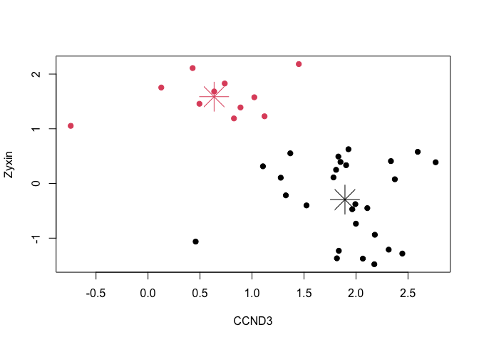
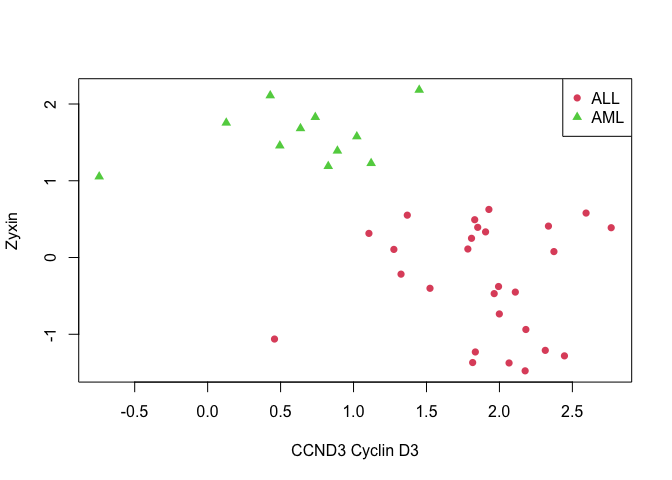

Lecture5 : Cluster Analysis
================
KIM SANG HYUN(202211545)
2025-05-08

- [05. Cluster Analysis](#05-cluster-analysis)
  - [Introduction](#introduction)
  - [Example of Euclidean Distance](#example-of-euclidean-distance)
  - [Example of Euclidean Distance](#example-of-euclidean-distance-1)
  - [Clustering](#clustering)
  - [K - means Clustering](#k---means-clustering)
  - [K - Means Cluster Algorithm](#k---means-cluster-algorithm)
  - [Example of the K-means
    Clustering](#example-of-the-k-means-clustering)
  - [Hierarchical Clustering](#hierarchical-clustering)
  - [Dissimilarity of Clusters](#dissimilarity-of-clusters)
  - [Type of Linkage](#type-of-linkage)
  - [Example of Single Linkage](#example-of-single-linkage)
  - [Example of Hierarchical
    Clustering](#example-of-hierarchical-clustering)
  - [Heatmap](#heatmap)
  - [The Correlation Coefficient](#the-correlation-coefficient)
  - [Example of The Correlation
    Coefficient](#example-of-the-correlation-coefficient)
  - [PCA](#pca)
  - [Example of PCA](#example-of-pca)
  - [](#section)

## 05. Cluster Analysis

``` r
library(multtest)
```

    ## Loading required package: BiocGenerics

    ## 
    ## Attaching package: 'BiocGenerics'

    ## The following objects are masked from 'package:stats':
    ## 
    ##     IQR, mad, sd, var, xtabs

    ## The following objects are masked from 'package:base':
    ## 
    ##     anyDuplicated, aperm, append, as.data.frame, basename, cbind,
    ##     colnames, dirname, do.call, duplicated, eval, evalq, Filter, Find,
    ##     get, grep, grepl, intersect, is.unsorted, lapply, Map, mapply,
    ##     match, mget, order, paste, pmax, pmax.int, pmin, pmin.int,
    ##     Position, rank, rbind, Reduce, rownames, sapply, saveRDS, setdiff,
    ##     table, tapply, union, unique, unsplit, which.max, which.min

    ## Loading required package: Biobase

    ## Welcome to Bioconductor
    ## 
    ##     Vignettes contain introductory material; view with
    ##     'browseVignettes()'. To cite Bioconductor, see
    ##     'citation("Biobase")', and for packages 'citation("pkgname")'.

``` r
library(genefilter)
library(ALL)
library(gplots)
```

    ## 
    ## Attaching package: 'gplots'

    ## The following object is masked from 'package:multtest':
    ## 
    ##     wapply

    ## The following object is masked from 'package:stats':
    ## 
    ##     lowess

``` r
library(ISLR2)
```

### Introduction

- Cluster analysis consists of several methods for discovering a subset
  of genes which form a group under some obervable **similarity
  criteria.**

- These methods are based on **distiance function** and an algorithm to
  join data points into clusters based on their relative distances to
  each other.

#### Distance

- The concept of distance plays a crucial role in cluster analysis.

- The following **properties are satisfied.**


- When analyzing gene expression values for several patients, it’ s
  important to define a **distance between vectors of gene
  expressions**, such as the distance between $a = (a_1,...,a_n)^T$ and
  $b = (b_1,...,b_n)^T$ .

- We wii focus mainly on the **Euclidean distance**.

$$
d(a, b ) = \sqrt{\sum^n_{i=1}(a_i-b_i)^2}
$$

### Example of Euclidean Distance

- Example : Distances betwwen Cyclin gene expressions.

  - We select the genes related to the biological term “Cyclin” and then
    compute the Euclidean distance between their expresssion values in
    the **Golub** data.

``` r
data(golub, package= "multtest")
cyclins = grep("Cyclin", golub.gnames[,2]) # cyclins과 관련된 이름 뽑!
golub.gnames[cyclins,2]
```

    ##  [1] "CCND2 Cyclin D2"                                        
    ##  [2] "CDK2 Cyclin-dependent kinase 2"                         
    ##  [3] "CCND3 Cyclin D3"                                        
    ##  [4] "CDKN1A Cyclin-dependent kinase inhibitor 1A (p21, Cip1)"
    ##  [5] "CCNH Cyclin H"                                          
    ##  [6] "Cyclin-dependent kinase 4 (CDK4) gene"                  
    ##  [7] "Cyclin G2 mRNA"                                         
    ##  [8] "Cyclin A1 mRNA"                                         
    ##  [9] "Cyclin-selective ubiquitin carrier protein mRNA"        
    ## [10] "CDK6 Cyclin-dependent kinase 6"                         
    ## [11] "Cyclin G1 mRNA"                                         
    ## [12] "CCNF Cyclin F"

``` r
golub[cyclins,]
```

    ##           [,1]     [,2]     [,3]     [,4]     [,5]     [,6]     [,7]     [,8]
    ##  [1,]  2.09511  1.71953 -1.46227 -1.39781  0.93232 -1.21719 -0.97062  1.49964
    ##  [2,]  0.14612  0.12644 -0.26346 -0.27286  0.21770 -0.39297 -1.05299 -1.36832
    ##  [3,]  2.10892  1.52405  1.96403  2.33597  1.85111  1.99391  2.06597  1.81649
    ##  [4,]  0.03240 -0.23576 -1.46227  0.40235  0.63329 -0.26141  0.42316 -1.02341
    ##  [5,] -0.11439 -0.72887 -0.39674 -0.08790 -0.01087 -0.65621 -0.30232 -0.17343
    ##  [6,]  0.09957 -0.21682 -0.02299  0.17161  0.57857  0.13683 -0.10047  0.16190
    ##  [7,] -0.13615 -0.00161 -1.01140 -0.16954 -0.15637 -1.18079 -0.95857 -0.46984
    ##  [8,] -1.45769 -1.39420 -0.30962  1.78240  2.19905 -1.14575  1.00702  0.17541
    ##  [9,]  1.11692  0.44479  1.21778  1.79176  1.20949  1.33367  1.47602  1.05818
    ## [10,]  0.58733  0.24527 -0.12249  0.39137  0.34923  0.28239  0.27259 -0.08456
    ## [11,]  0.43113 -0.31585 -0.50522 -0.11118  0.73660 -1.21719 -0.41901 -0.40108
    ## [12,] -1.45769 -1.39420 -1.46227 -1.40715 -1.42668 -1.21719 -1.37386 -1.36832
    ##           [,9]    [,10]    [,11]    [,12]    [,13]    [,14]    [,15]    [,16]
    ##  [1,]  1.00476 -1.09527 -1.28137  1.61853  1.94526 -1.39979 -0.55575  1.62000
    ##  [2,]  0.06740  0.36937  0.24716 -0.58772  0.34700  0.40403  0.13681  0.09645
    ##  [3,]  2.17622  1.80861  2.44562  1.90496  2.76610  1.32551  2.59385  1.92776
    ##  [4,] -0.18756  0.21011 -0.29579  0.79964  0.99168 -0.82168  0.63829 -1.40095
    ##  [5,] -0.60975 -0.27834 -0.32051 -0.43446 -0.61766 -0.03770 -0.05882  0.05855
    ##  [6,]  0.62386  0.19831 -1.03689 -0.12272  0.22366  0.39613  0.53585 -0.37826
    ##  [7,] -0.64742 -0.27834 -0.30498 -1.03209  0.44611 -0.34299 -0.06270  0.29507
    ##  [8,] -0.47118 -0.57345 -0.42324  0.45252 -0.82736 -0.11022  1.05838 -0.58264
    ##  [9,]  1.21855  1.69765  1.72681  0.75900  1.05475  1.18884  1.50242  0.65821
    ## [10,]  0.23647  0.51636 -1.28137 -0.24863 -0.54457  0.35700  0.43111 -1.40095
    ## [11,]  0.51815  0.55744  1.15955  0.16245  0.60859  0.37879  1.04462  0.80239
    ## [12,] -1.47649 -1.21583 -1.28137 -1.03209 -0.91887 -1.39979 -0.96414 -1.40095
    ##          [,17]    [,18]    [,19]    [,20]    [,21]    [,22]    [,23]    [,24]
    ##  [1,]  2.09998  0.39541  2.34015  1.48474 -1.06221 -1.12665 -0.97802 -0.46516
    ##  [2,]  0.08133  0.39541  0.18293  0.22879 -0.00600 -1.12665 -0.21536  0.32753
    ##  [3,]  1.10546  1.27645  1.83051  1.78352  0.45827  2.18119  2.31428  1.99927
    ##  [4,] -0.94851  0.31148  0.09991 -1.60767 -0.12362  1.07293 -1.20963  0.56981
    ##  [5,]  0.01635  0.03916  0.11156  0.07364  0.34465 -0.52194 -0.13860 -0.04340
    ##  [6,]  0.54402 -0.08487 -0.08862  0.72341 -1.06221 -1.12665  0.15292  0.19933
    ##  [7,] -0.27733 -0.27007 -0.88947 -0.14609  0.84323 -0.61148 -0.61875 -0.02538
    ##  [8,] -0.25555 -0.06110 -0.50391 -0.66659 -0.19930 -1.02751 -0.23643  1.37091
    ##  [9,]  0.77202  1.69373  0.97527  0.35976  0.54830  0.69710  1.94421  0.93038
    ## [10,]  0.74940  0.06525 -0.18464 -0.54780 -0.84280 -0.13845  0.25857  0.36752
    ## [11,]  0.84676  1.15081  0.88168  0.83613  2.41495  0.06611 -0.59277  0.35702
    ## [12,] -1.56783  0.58394 -1.24482 -1.60767 -1.06221 -1.12665 -1.20963 -1.48332
    ##          [,25]    [,26]    [,27]    [,28]    [,29]    [,30]    [,31]    [,32]
    ##  [1,]  1.65274  2.48394 -0.10468  1.57575  1.25281 -1.29865  1.17196  1.11774
    ##  [2,] -0.01234  0.22479 -0.36271  0.36102  0.01228 -0.41132 -1.26183 -0.19108
    ##  [3,]  1.36844  2.37351  1.83485  0.88941  1.45014  0.42904  0.82667  0.63637
    ##  [4,]  0.78679  0.59194 -1.23051  0.79059 -0.26926  0.73013 -1.26183  0.37673
    ##  [5,] -0.25271 -0.32204 -0.46583  0.64512  0.46695 -0.56577 -0.34375 -0.04133
    ##  [6,] -0.03700 -0.14332 -0.09615  0.10337 -0.55165  0.01482  0.18184 -0.45577
    ##  [7,] -0.50901 -0.51506 -0.76403 -0.45484 -0.43840 -0.23905 -1.13677 -0.52662
    ##  [8,] -0.01967 -0.49503 -0.86722  0.08810  1.01395  0.72872  1.78061 -0.16717
    ##  [9,]  0.73500  0.74160  1.09842  1.13752  0.82650  0.50761  1.10338  0.54543
    ## [10,] -1.25268 -0.19626  0.98945 -0.30877 -1.08902  0.32504  0.65517  0.59800
    ## [11,]  0.29722  0.32137  0.17087  0.55137  1.04467  0.01482  0.28127  0.13255
    ## [12,] -1.25268 -0.42999 -1.23051 -1.43337 -1.08902 -1.29865 -1.26183 -1.44434
    ##          [,33]    [,34]    [,35]    [,36]    [,37]    [,38]
    ##  [1,]  1.41598  0.57499  0.63894 -0.92935 -0.11091  1.15591
    ##  [2,] -0.63535 -0.06385 -0.27960 -1.39906 -0.15272 -0.52682
    ##  [3,]  1.02250  0.12758 -0.74333  0.73784  0.49470  1.12058
    ##  [4,]  0.89123 -1.34158 -0.32442  0.99461  0.04026 -1.18952
    ##  [5,] -0.14150 -0.34850 -0.35946 -0.94364  0.05047  0.05905
    ##  [6,] -0.97706 -0.12714  0.15231 -0.26400 -0.56900 -0.67788
    ##  [7,] -1.47218 -1.34158 -1.22961 -0.30751 -0.94202 -0.06085
    ##  [8,]  1.12599  1.04696  0.26068 -0.05190  1.14579  0.13462
    ##  [9,]  0.96416  0.78906  1.79809  1.34705  1.26351  1.28030
    ## [10,] -1.47218  0.56365  0.43808 -0.14566 -0.99747 -1.32403
    ## [11,] -0.84745  0.08816  0.18679 -0.83992  0.01243  0.51648
    ## [12,] -1.47218 -1.34158 -1.22961 -1.39906 -1.34579 -1.32403

``` r
dim(golub[cyclins,])
```

    ## [1] 12 38

``` r
dist.cyclin = dist(golub[cyclins, ], method = "euclidean")
dist.cyclin
```

    ##            1         2         3         4         5         6         7
    ## 2   8.821806                                                            
    ## 3  11.553494 11.701562                                                  
    ## 4  10.056814  5.931260 11.991333                                        
    ## 5   8.669112  2.934802 11.900558  5.698232                              
    ## 6   8.645304  3.659086 11.096932  6.203383  3.663108                    
    ## 7  10.157110  3.835045 13.277355  6.098316  3.633005  4.791643          
    ## 8  10.489737  7.042724 11.987659  7.000343  5.647533  6.079844  7.684192
    ## 9  10.195595  8.788053  5.643753  9.261528  8.600662  8.013563 10.560682
    ## 10 10.138835  5.286497 11.818444  6.763858  5.136055  3.388280  6.011730
    ## 11  8.298177  4.581139  9.852140  7.080173  4.573236  5.646905  5.814536
    ## 12 13.137183  7.429024 17.786151  8.628085  7.080438  8.118248  5.943200
    ##            8         9        10        11
    ## 2                                         
    ## 3                                         
    ## 4                                         
    ## 5                                         
    ## 6                                         
    ## 7                                         
    ## 8                                         
    ## 9   8.359383                              
    ## 10  6.941314  8.552852                    
    ## 11  7.053795  7.130024  6.838069          
    ## 12 10.253758 14.684560  8.526896 10.328346

``` r
distanceMatrix = as.matrix(dist.cyclin)
rownames(distanceMatrix) = golub.gnames[cyclins, 3]
colnames(distanceMatrix) = golub.gnames[cyclins, 3]
distanceMatrix[1:5, 1:5]
```

    ##           D13639_at M68520_at M92287_at U09579_at U11791_at
    ## D13639_at  0.000000  8.821806  11.55349 10.056814  8.669112
    ## M68520_at  8.821806  0.000000  11.70156  5.931260  2.934802
    ## M92287_at 11.553494 11.701562   0.00000 11.991333 11.900558
    ## U09579_at 10.056814  5.931260  11.99133  0.000000  5.698232
    ## U11791_at  8.669112  2.934802  11.90056  5.698232  0.000000

### Example of Euclidean Distance

- Example: Finding the ten genes with expression patterns most similar
  to the MME gene.

  - `genefinder()` : 지정한 유전자의 발현 패턴과 가장 유사한 유전자들을
    거리 기준으로 찾아줌.

``` r
library(genefilter)
library(ALL)
data(ALL)
closeto1389_at <- genefinder(ALL, "1389_at", 10, method="euc")
#  "1389_at" 유전자와 유클리드 거리 기준으로 가장 가까운 10개의 유전자를 찾아줘.
closeto1389_at
```

    ## $`1389_at`
    ## $`1389_at`$indices
    ##  [1]  2653  1096  6634  9255  6639 11402  9849  2274  8518 10736
    ## 
    ## $`1389_at`$dists
    ##  [1] 12.62895 12.75164 12.77534 12.78678 12.95589 13.03828 13.09785 13.20989
    ##  [9] 13.32321 13.38972

- index 번호하고 거리하고 넘겨줌

``` r
w <- featureNames(ALL)[closeto1389_at[[1]]$indices] 
data.frame(genes=w, distance=closeto1389_at[[1]]$dists)
```

    ##         genes distance
    ## 1  32629_f_at 12.62895
    ## 2     1988_at 12.75164
    ## 3    36571_at 12.77534
    ## 4    39168_at 12.78678
    ## 5    36576_at 12.95589
    ## 6    41295_at 13.03828
    ## 7  39756_g_at 13.09785
    ## 8    32254_at 13.20989
    ## 9    38438_at 13.32321
    ## 10   40635_at 13.38972

### Clustering

- We seek a partition of the data into distinct groups so that the
  observations within each group are quite similar to each other.

- There is two differnet clustering methods.

  - K-means clustering

  - Hierarchical clustering

### K - means Clustering

- Let $C_1, C_2, ..., C_k$ (\$k\$ is hyperparameter) denote sets
  containing the indices of the observations in each cluster.

- If the $i$th observation is in the $k$th cluster, then $i \in C_K$.

- Property 1 : 각 관측치는 무조건 K개 group 중 하나에는 들어가야한다.

- Property 2 : 각 그룹의 교집한은 존재 하지 않는다. (관측치가 동시에
  다른 그룹에 속하지 x)

- The idea behinde K-means clustering is that a good clustering is one
  for which the WCV is as small as possible.

> WCV (Within - Cluster Variation)이란?
>
> WCV는 하나의 군집 안에 있는 데이터들이 서로 얼마나 흩어져 있는지를
> 측정하는 값.
>
> 즉, 같은 군집 안에 있는 데이터들이 서로 얼마나 비슷한가 를 수치로
> 나타냄.

- Typically, we us **Euclidean distance**


### K - Means Cluster Algorithm


- This algorithm is guaranteed to decrease the value of Total
  within-cluster variation, however it is not guaranteed to give
  **global minimun**.

### Example of the K-means Clustering

- Example : K - means cluster analysis for 2 patients and 50 genes.

``` r
set.seed(111)
x1 <- matrix(rnorm(100, 0, 0.5), ncol=2)
x2 <- matrix(rnorm(100, 2, 0.5), ncol=2)
data <- rbind(x1, x2)
data
```

    ##               [,1]         [,2]
    ##   [1,]  0.11761036  0.095831692
    ##   [2,] -0.16536794  0.776272136
    ##   [3,] -0.15581191  0.457121143
    ##   [4,] -1.15117283  0.179312687
    ##   [5,] -0.08543802  0.087547818
    ##   [6,]  0.07013911 -0.423633884
    ##   [7,] -0.74871333  0.489115829
    ##   [8,] -0.50509421  0.902934130
    ##   [9,] -0.47423780  0.061457401
    ##  [10,] -0.24698111 -0.064886013
    ##  [11,] -0.08683706 -0.108214330
    ##  [12,] -0.20329939  0.723239084
    ##  [13,]  0.92281813  0.204854901
    ##  [14,]  0.19702705  0.455458286
    ##  [15,]  0.39876425  0.715179083
    ##  [16,] -0.78333268 -0.190645978
    ##  [17,] -0.04292550  0.101153588
    ##  [18,] -0.17956974 -0.403099597
    ##  [19,] -0.59680448  0.147317092
    ##  [20,]  0.18209337  0.702441542
    ##  [21,]  0.18083123  0.511883423
    ##  [22,]  0.17348219  0.238063032
    ##  [23,]  0.09486826 -0.335165165
    ##  [24,] -0.07978840  0.079617161
    ##  [25,]  0.16327462 -0.191357692
    ##  [26,]  0.29912710  0.467881297
    ##  [27,] -0.92076715 -0.315766134
    ##  [28,]  1.35902780 -0.049153039
    ##  [29,]  0.09562220  0.515992492
    ##  [30,] -0.65064803  0.193904215
    ##  [31,] -1.55660865 -0.628064657
    ##  [32,] -0.47067870 -0.393476365
    ##  [33,]  0.70012939  0.214905774
    ##  [34,] -0.81023501 -0.188208110
    ##  [35,] -1.13299798 -0.608114533
    ##  [36,]  0.58149679  0.514639257
    ##  [37,] -0.05807752  0.215198500
    ##  [38,]  0.16712800 -0.622787010
    ##  [39,] -0.31042905 -0.301364243
    ##  [40,] -0.65492245  0.330034694
    ##  [41,] -0.58786302  1.025374763
    ##  [42,] -0.56060777  0.245404089
    ##  [43,] -0.68095224 -0.865739709
    ##  [44,]  0.24056229  0.355441830
    ##  [45,]  0.37098581  0.006911456
    ##  [46,]  0.01391231 -0.700520799
    ##  [47,]  0.16568986  0.629561833
    ##  [48,]  0.32205707 -0.063738759
    ##  [49,]  1.24283078 -0.364693257
    ##  [50,]  0.97999085 -0.605680680
    ##  [51,]  2.29980987  1.954239870
    ##  [52,]  1.41983524  1.062847095
    ##  [53,]  2.21954672  1.667918991
    ##  [54,]  2.10242687  2.101706409
    ##  [55,]  1.65040933  0.702778303
    ##  [56,]  1.53668716  1.953133034
    ##  [57,]  1.49325881  1.786340041
    ##  [58,]  2.30249353  2.221489639
    ##  [59,]  2.86720007  1.406096037
    ##  [60,]  1.82507473  2.313212737
    ##  [61,]  2.59959275  2.180823301
    ##  [62,]  2.51195050  1.763519710
    ##  [63,]  1.97686243  2.472446851
    ##  [64,]  2.69325421  2.453201124
    ##  [65,]  0.90236364  2.235886852
    ##  [66,]  1.93622154  2.194749965
    ##  [67,]  1.34150158  2.260970134
    ##  [68,]  1.28653243  2.452226420
    ##  [69,]  2.43972082  2.848395463
    ##  [70,]  2.19699579  1.557831282
    ##  [71,]  2.34446274  2.428244851
    ##  [72,]  3.17685825  2.087471225
    ##  [73,]  1.49245116  1.800747519
    ##  [74,]  2.14548876  2.137601281
    ##  [75,]  2.78266304  1.365640600
    ##  [76,]  1.57644082  1.994959336
    ##  [77,]  2.66383008  2.326700862
    ##  [78,]  2.23852317  2.049289990
    ##  [79,]  2.09262547  2.451308471
    ##  [80,]  2.12664744  1.740051252
    ##  [81,]  3.29611368  1.353254510
    ##  [82,]  2.53717350  1.976551145
    ##  [83,]  1.20154905  1.682501867
    ##  [84,]  1.95620570  1.891148864
    ##  [85,]  2.18038380  1.212579168
    ##  [86,]  1.56002001  1.861248424
    ##  [87,]  0.33833252  2.275146104
    ##  [88,]  1.76624227  1.694526691
    ##  [89,]  2.21577013  0.932567274
    ##  [90,]  1.69800527  2.349638719
    ##  [91,]  2.33722335  2.538597983
    ##  [92,]  2.31796027  2.433959079
    ##  [93,]  1.69351481  1.604630311
    ##  [94,]  2.20744567  1.945334913
    ##  [95,]  2.43867169  1.534824969
    ##  [96,]  2.01057879  1.816439368
    ##  [97,]  2.90519165  1.553542846
    ##  [98,]  1.77395215  1.821113596
    ##  [99,]  1.93743801  1.866268938
    ## [100,]  2.38340021  1.844040251

- 데이터 구조 확인하기

- `nstart` : 몇 번 반복할 것인가..?

``` r
cl <- kmeans(data, centers = 2, nstart=20)

cl
```

    ## K-means clustering with 2 clusters of sizes 50, 50
    ## 
    ## Cluster means:
    ##          [,1]       [,2]
    ## 1 -0.09721386 0.08439481
    ## 2  2.05993803 1.92319487
    ## 
    ## Clustering vector:
    ##   [1] 1 1 1 1 1 1 1 1 1 1 1 1 1 1 1 1 1 1 1 1 1 1 1 1 1 1 1 1 1 1 1 1 1 1 1 1 1
    ##  [38] 1 1 1 1 1 1 1 1 1 1 1 1 1 2 2 2 2 2 2 2 2 2 2 2 2 2 2 2 2 2 2 2 2 2 2 2 2
    ##  [75] 2 2 2 2 2 2 2 2 2 2 2 2 2 2 2 2 2 2 2 2 2 2 2 2 2 2
    ## 
    ## Within cluster sum of squares by cluster:
    ## [1] 27.55703 25.24015
    ##  (between_SS / total_SS =  79.2 %)
    ## 
    ## Available components:
    ## 
    ## [1] "cluster"      "centers"      "totss"        "withinss"     "tot.withinss"
    ## [6] "betweenss"    "size"         "iter"         "ifault"

- 분산 설명 비율 -\> 79.2%

- 전체 데이터의 분산 중에서 , **군집 간의 차이**로 설명 가능한 비율!!
  -\> 높을수록 굿!

``` r
plot(data, col=cl$cluster, pch=19, xlab="X1", ylab="X2",
main="K-Means Clustering Results with K=2")
points(cl$centers, col=1:2, pch=8, cex=4)
```

<!-- -->

``` r
cl <- kmeans(data, 3, nstart=20)
plot(data, col=cl$cluster, pch=19, xlab="X1", ylab="X2",
main="K-Means Clustering Results with K=3")
points(cl$centers, col=1:2, pch=8, cex=4)
```

<!-- -->

``` r
set.seed(111)
par(mfrow=c(1, 2))
cl <- kmeans(data, 3, nstart=1)

tv <- round(cl$tot.withinss, 3)
plot(data, col=cl$cluster, pch=19, xlab="X1", ylab="X2",
main=paste("(", tv, ")"))
points(cl$centers, col=1:2, pch=8, cex=4)

cl <- kmeans(data, 3, nstart=20) # 여러번 반복하니깐 TWV가 역시 줄어든다!
tv <- round(cl$tot.withinss, 3)
plot(data, col=cl$cluster, pch=19, xlab="X1", ylab="X2",
main=paste("(", tv, ")"))
points(cl$centers, col=1:2, pch=8, cex=4)
```

<!-- -->

- Example of Application to the Golub data.

  - We found that the expression values of the genes CCND3 and Zyxin are
    closely related to the distinction between ALL and AML.

``` r
data(golub, package="multtest")
zyxin <- grep("Zyxin", golub.gnames[ ,2])
ccnd3 <- grep("CCND3", golub.gnames[ ,2])
data <- data.frame(golub[ccnd3, ], golub[zyxin, ])
colnames(data) <- c("CCND3 (Cyclin D3)", "Zyxin")
```

``` r
cl <- kmeans(data, 2, nstart=20)
cbind(cl$cluster, golub.cl) # -> clustering 잘되었노!
```

    ##         golub.cl
    ##  [1,] 1        0
    ##  [2,] 1        0
    ##  [3,] 1        0
    ##  [4,] 1        0
    ##  [5,] 1        0
    ##  [6,] 1        0
    ##  [7,] 1        0
    ##  [8,] 1        0
    ##  [9,] 1        0
    ## [10,] 1        0
    ## [11,] 1        0
    ## [12,] 1        0
    ## [13,] 1        0
    ## [14,] 1        0
    ## [15,] 1        0
    ## [16,] 1        0
    ## [17,] 1        0
    ## [18,] 1        0
    ## [19,] 1        0
    ## [20,] 1        0
    ## [21,] 1        0
    ## [22,] 1        0
    ## [23,] 1        0
    ## [24,] 1        0
    ## [25,] 1        0
    ## [26,] 1        0
    ## [27,] 1        0
    ## [28,] 2        1
    ## [29,] 2        1
    ## [30,] 2        1
    ## [31,] 2        1
    ## [32,] 2        1
    ## [33,] 2        1
    ## [34,] 2        1
    ## [35,] 2        1
    ## [36,] 2        1
    ## [37,] 2        1
    ## [38,] 2        1

``` r
cl
```

    ## K-means clustering with 2 clusters of sizes 27, 11
    ## 
    ## Cluster means:
    ##   CCND3 (Cyclin D3)      Zyxin
    ## 1         1.8938826 -0.2947926
    ## 2         0.6355909  1.5866682
    ## 
    ## Clustering vector:
    ##  [1] 1 1 1 1 1 1 1 1 1 1 1 1 1 1 1 1 1 1 1 1 1 1 1 1 1 1 1 2 2 2 2 2 2 2 2 2 2 2
    ## 
    ## Within cluster sum of squares by cluster:
    ## [1] 19.842225  4.733248
    ##  (between_SS / total_SS =  62.0 %)
    ## 
    ## Available components:
    ## 
    ## [1] "cluster"      "centers"      "totss"        "withinss"     "tot.withinss"
    ## [6] "betweenss"    "size"         "iter"         "ifault"

``` r
plot(data, col=cl$cluster, pch=19, xlab="CCND3", ylab="Zyxin")
points(cl$centers, col=1:2, pch=8, cex=4)
```

<!-- -->

``` r
par(mfrow=c(1, 3))
cl <- kmeans(data, 2, nstart=20)
plot(data, col=cl$cluster, pch=19, xlab="CCND3", ylab="Zyxin",
main="K = 2")
points(cl$centers, col=1:2, pch=8, cex=4)
cl <- kmeans(data, 3, nstart=20)
plot(data, col=cl$cluster, pch=19, xlab="CCND3", ylab="Zyxin",
main="K = 3")
points(cl$centers, col=1:3, pch=8, cex=4)
cl <- kmeans(data, 4, nstart=20)
plot(data, col=cl$cluster, pch=19, xlab="CCND3", ylab="Zyxin",
main="K = 4")
points(cl$centers, col=1:4, pch=8, cex=4)
```

<!-- -->

### Hierarchical Clustering

- K-means clustering requires us to pre-specify the number of clusters
  $K$. This can be a disadvantage.

- Hierarchical Clustering is an alternative approach which does not
  require that \*\*we commit to a particular choice of $K$.\*\*

- HC results in an attractive tree-based representation of the
  observations, called a dendrogram.

- We describe bottom-up or agglomerative clustering. This is the most
  common type of hierarchical clustering, and refers to the fact that a
  dendrogram is built starting from the leaves and combining clusters up
  to the trunk.

- Hierarchical clustering starts with each point in its own cluster, and
  identify the closest two clusters and merge them, until all points are
  in a single cluster.


- 덴드로그랩에서 가로축 상의 가까운 위치만 보고 두 개체가 유사하다고
  판단하면 안된다.

- 두 관측치가 유사한지는, 각각이 속한 가지가 수직축의 어느 높이에서
  처음으로 합쳐지는지를 보고 판단해야 한다.

### Dissimilarity of Clusters

- 계층적 군집 알고리즘은 덴드로그램의 맨 아래에서 시작하며, 각 관측치를
  독립적인 군집으로 취급한다.

- 그 후 가장 유사한 두 군집을 계속 합쳐가며, 결국 하나의 큰 군집이 될
  때까지 반복한다.

- 관측치 간의 dissimilarity는 유클리드 거리로 측정할 수 있다.

- 그럼 군집은??? -\> by Linkage!

### Type of Linkage


### Example of Single Linkage

- Example : Single linkage with 5 genes.

``` r
names <- list(c("g1", "g2", "g3", "g4", "g5"),
c("patient 1", "patient 2"))
sl <- matrix(c(1, 1, 1, 1.3, 3, 2, 3, 2.4, 5, 5), ncol=2, 
             byrow=TRUE, dimnames=names)
```

``` r
rr <- c(0, 6)
plot(sl, pch=19, col="blue", cex=1.4, xlim=rr, ylim=rr)
text(sl, labels=row.names(sl), pos=4, col="red", cex=1.2)
```

<!-- -->

``` r
print(dist(sl, method="euclidean"), digits=3)
```

    ##      g1   g2   g3   g4
    ## g2 0.30               
    ## g3 2.24 2.12          
    ## g4 2.44 2.28 0.40     
    ## g5 5.66 5.45 3.61 3.28

``` r
ds <- dist(sl, method="euclidean")
sl.out <- hclust(ds, method="single")
sl.out
```

    ## 
    ## Call:
    ## hclust(d = ds, method = "single")
    ## 
    ## Cluster method   : single 
    ## Distance         : euclidean 
    ## Number of objects: 5

``` r
plot(sl.out, lwd=3, col="blue", col.axis = "brown",
hang=-1, main=NA, sub=NA, axes=FALSE, ylab="Distance",
xlab="Clustering of the expression of 5 genes")
axis(side=2, at=seq(0,3.5,.5), col="brown", labels=TRUE, lwd=4)
```

<!-- -->

- Example of Random Data

``` r
set.seed(12345)
x <- rnorm(20)
out <- hclust(dist(x, method="euclidean"), method="single")
plot(out, lwd=3, col="blue", hang=-1, main=NA, sub=NA,
axes=FALSE, ylab="Distance",
xlab="20 genes with normal random distances")
axis(side=2, at=seq(0,1.4,.2), col="brown", labels=TRUE, lwd=4)
```

<!-- -->

> This example highlights an important caveat about clustering
>
> - clustering will always produce clusters in your data even if all the
>   data is sampled from identical distributions.

``` r
set.seed(4321)
x <- c(rnorm(10, 0, 0.1), rnorm(10, 3, 0.5),
rnorm(10, 10, 1.0))
out <- hclust(dist(x, method="euclidean"), method="single")
out
```

    ## 
    ## Call:
    ## hclust(d = dist(x, method = "euclidean"), method = "single")
    ## 
    ## Cluster method   : single 
    ## Distance         : euclidean 
    ## Number of objects: 30

- 분산이 작다 -\> 옹기종기 모여있다 -\> 그럼 빨리 군집화된다-\>
  군집화되는 height가 작다!

``` r
plot(out, lwd=3, col="blue", hang=-1, main=NA, sub=NA,
axes=FALSE, ylab="Distance",
xlab="3 clusters of 10 genes each")
axis(side=2, at=seq(0, 5, 1), col="brown", labels=TRUE, lwd=4)
abline(h=1, lty=2, lwd=2, col="gray")
```

<!-- -->

### Example of Hierarchical Clustering

- Example : Application to the Golub data.

``` r
data(golub, package="multtest")
zyxin <- grep("Zyxin", golub.gnames[ ,2])
ccnd3 <- grep("CCND3", golub.gnames[ ,2])
```

``` r
clusdata <- data.frame(golub[ccnd3, ], golub[zyxin, ])
colnames(clusdata) <- c("CCND3 Cyclin D3", "Zyxin")
gfactor <- factor(golub.cl, levels=0:1, labels=c("ALL", "AML"))
```

``` r
gf <- as.numeric(gfactor)
plot(clusdata, pch=gf+15, col=gf+1)
legend("topright", legend=c("ALL", "AML"), pch=16:17, col=c(2,3))
```

<!-- -->

``` r
dist.cl <- dist(clusdata, method="euclidean")
gcl <- hclust(dist.cl, method="single")
```

``` r
plot(gcl, lwd=3, col="blue", hang=-1, main=NA, sub=NA,
axes=FALSE, ylab="Distance",
xlab="Clustering of patients by gene expression")
axis(side=2, at=seq(0,1.2,.2), col="brown", labels=TRUE, lwd=4)
abline(h=0.6, lty=2, lwd=2, col="gray")
```

<!-- -->

- Apart from three misplaced patients, the tree contains two main
  clusters that correctly corresponed to the two groups.

``` r
# 실제 VS cluster 된거 check
sort(rev(gcl$order)[1:9]) # 제일 오른쪽 cluster의 원소들 9개! -> AML로 판명된것들
```

    ## [1] 28 30 31 32 33 34 36 37 38

``` r
which(gfactor == "AML")
```

    ##  [1] 28 29 30 31 32 33 34 35 36 37 38

- Complete, average, centroid

``` r
par(mfrow=c(2, 2))
hc1 <- hclust(dist.cl, method="single")
plot(hc1, main="Single Linkage", xlab="", sub="", hang=-1)
abline(h=0.6, lty=2, col="blue")
hc2 <- hclust(dist.cl, method="complete")
plot(hc2, main="Complete Linkage", xlab="", sub="", hang=-1)
abline(h=3, lty=2, col="orange")
hc3 <- hclust(dist.cl, method="average")
plot(hc3, main="Average Linkage", xlab="", sub="", hang=-1)
abline(h=2.0, lty=2, col="green")
hc4 <- hclust(dist.cl, method="centroid")
plot(hc4, main="Centroid Linkage", xlab="", sub="", hang=-1)
abline(h=1, lty=2, col="purple")
```

<!-- -->

### Heatmap

- Let’s generate a heatmap using just the top 50 most differentially
  expressed genes between ALL and AML patients.

``` r
data(golub, package="multtest")
gFactor <- factor(golub.cl, levels=0:1, labels=c("ALL","AML"))
meanALL <- apply(golub[ ,gFactor=="ALL"], 1, mean)
meanAML <- apply(golub[ ,gFactor=="AML"], 1, mean)
o <- order(abs(meanALL - meanAML), decreasing=TRUE)
DE50 <- golub[o[1:50], ]
hist(DE50, nclass=50, col="orange")
```

<!-- -->

``` r
library(gplots)
heatmap.2(DE50, Rowv=NA, Colv=NA, scale="row", cexRow=0.5,
col=greenred(75), dendrogram="none", key=TRUE,
symkey=FALSE, density.info="none", trace="none")
```

<!-- -->

``` r
heatmap.2(DE50, scale="row", col=greenred(75),
dendrogram="both", key=TRUE, symkey=FALSE,
density.info="none", trace="none", cexRow=0.5)
```

<!-- -->

### The Correlation Coefficient

- A correlation coefficient measures the degree of linear relationship
  between two sets of gene expression values/

  
  

### Example of The Correlation Coefficient

- Example : MCM3 gene expression.

``` r
data(golub, package="multtest")
mcm3 <- grep("MCM3", golub.gnames[, 2])
```

``` r
golub.gnames[mcm3, ]
```

    ##      [,1]   [,2]                                                         
    ## [1,] "5254" "MCM3 Minichromosome maintenance deficient (S. cerevisiae) 3"
    ## [2,] "5625" "MCM3 Minichromosome maintenance deficient (S. cerevisiae) 3"
    ##      [,3]         
    ## [1,] "D38073_at"  
    ## [2,] "X62153_s_at"

``` r
x <- golub[mcm3[1], ]
y <- golub[mcm3[2], ]

cor(x,y)
```

    ## [1] 0.6376217

``` r
cov(scale(x), scale(y))
```

    ##           [,1]
    ## [1,] 0.6376217

``` r
plot(x,y, pch=19, col="blue3")
abline(lm(y~x)$coef, col=2, lty=2, lwd=2)
```

<!-- -->

``` r
cor.test(x,y)
```

    ## 
    ##  Pearson's product-moment correlation
    ## 
    ## data:  x and y
    ## t = 4.9662, df = 36, p-value = 1.666e-05
    ## alternative hypothesis: true correlation is not equal to 0
    ## 95 percent confidence interval:
    ##  0.3993383 0.7952115
    ## sample estimates:
    ##       cor 
    ## 0.6376217

``` r
B = 10000
per.cor = NULL
```

``` r
set.seed(1010)
for (i in 1:B){
  index1 = sample(1:length(x))
  index2 = sample(1:length(y))
  per.cor[i] = cor(x[index1], y[index2])
}
```

- 귀무가설 x ,y 상관없음 하에서 얻을 수 있는 상관계수의 분포

``` r
hist(per.cor, nclass = 50, col= "orange")
c0 = cor(x, y)
abline(v = c(-c0, c0), lty = 2, lwd = 2, col = "blue")
```

<!-- -->

``` r
(sum(abs(per.cor) > abs(c0)) + 1) / (B + 1)
```

    ## [1] 0.00019998

> 파란 선이 분포의 끝에 있다는 건, 관측된 상관계수가 귀무분포에서 매우
> 희귀한 값이란 뜻 → H₀ 기각 → 상관 있음

``` r
B = 10000
boot.cor = rep(0 ,B)
data = cbind(x, y)
```

``` r
set.seed(1)
for (i in 1:B){
  index = sample(1:nrow(data), replace = TRUE)
  dat.star = data[index, ]
  boot.cor[i] = cor(dat.star)[1, 2]
}
```

``` r
hist(boot.cor, nclass=50, col="orange")
CI <- quantile(boot.cor, c(0.025, 0.975))
abline(v=CI, lty=2, lwd=2, col="blue")
```

<!-- -->

> 이 그래프는 “데이터의 두 변수는 부트스트랩 상관계수 기준으로 **약
> 0.2~0.9 사이의 신뢰구간**을 가지며,
>
> **명백히 양의 상관관계를 가진다**”는 것을 보여준다.

``` r
mean(boot.cor)
```

    ## [1] 0.6511411

``` r
CI
```

    ##      2.5%     97.5% 
    ## 0.2204652 0.9205734

- Example : Application to the Golub data.

``` r
y = golub.cl
y
```

    ##  [1] 0 0 0 0 0 0 0 0 0 0 0 0 0 0 0 0 0 0 0 0 0 0 0 0 0 0 0 1 1 1 1 1 1 1 1 1 1 1

``` r
corgol = apply(golub, 1, function(x) cor(x, y))
```

``` r
top <- 10
ot <- o[1:top]
data.frame(genes=golub.gnames[ot, 3], cor=corgol[ot])
```

    ##               genes        cor
    ## 1         M27891_at  0.8631427
    ## 2       Y00787_s_at  0.7356337
    ## 3  M28130_rna1_s_at  0.7551832
    ## 4         M84526_at  0.7905760
    ## 5         M19507_at  0.6705210
    ## 6    X82240_rna1_at -0.5399031
    ## 7    M96326_rna1_at  0.6926718
    ## 8         D88422_at  0.8153174
    ## 9    U05259_rna1_at -0.6270897
    ## 10      M63438_s_at  0.5760259

``` r
fun <- function(x) summary(lm(x ~ y))$fstat[1]
fstat <- apply(golub, 1, fun)
o2 <- order(fstat, decreasing=TRUE)
```

- 두 방법 모두 유전자 발현과 두 환자 그룹(ALL/AML) 간의 연관성 강도를
  측정한다.

``` r
top <- 10
ot2 <- o2[1:top]
data.frame(genes=golub.gnames[ot2, 3], f.stat=fstat[ot2])
```

    ##               genes    f.stat
    ## 1         M27891_at 105.18500
    ## 2         D88422_at  71.38012
    ## 3         X95735_at  66.68372
    ## 4         M23197_at  63.70090
    ## 5  U22376_cds2_s_at  61.70403
    ## 6  HG1612-HT1612_at  61.41398
    ## 7       M27783_s_at  60.09061
    ## 8         M84526_at  60.00266
    ## 9         X74262_at  58.31000
    ## 10        M63138_at  50.53058

``` r
# corr이랑 ranking이랑 같다!
par(mfrow=c(1, 2))
hist(abs(corgol), nclass=20, col="orange", xlab="",
main="Absolute values of PCC")
hist(fstat, nclass=20, col="lightblue", xlab="",
main="F test statistics")
```

<!-- -->

### PCA

### Example of PCA

- Example: Application to thee Golub data

``` r
data(golub, package="multtest")
cgolub <- cor(golub)
dim(cgolub)
```

    ## [1] 38 38

``` r
e <- eigen(cgolub)
dim(e$vector)
```

    ## [1] 38 38

``` r
e$values
```

    ##  [1] 25.43826289  2.07571577  1.24844111  1.07133729  0.73652316  0.55352401
    ##  [7]  0.51989272  0.47930972  0.40729024  0.40488328  0.32148354  0.30539897
    ## [13]  0.29017757  0.27051931  0.24569473  0.23427321  0.22771204  0.22153717
    ## [19]  0.20630739  0.19179737  0.18844218  0.18041023  0.17290705  0.16579519
    ## [25]  0.16053089  0.15584871  0.15000959  0.14758770  0.14350528  0.13782128
    ## [31]  0.13658502  0.12932904  0.12907685  0.12443678  0.11708536  0.11041217
    ## [37]  0.10609040  0.09404478

``` r
plot(e$values, type="b", pch=19, col=2, ylab="eigenvalues",
xlab="the number of components")
```

<!-- -->

- We apply the previous bootstrap method th estimate 95% CI for the
  eigenvalues.

- 기존 데이터에서 boostrap으로 p개의 행을 중복을 허용해서 새로운 데이터
  세트를 만들고 p x n 사이즈의 데이터를 그리고 그걸로 eigen을 구한다 -\>
  10000번 반복 ㄱㄱㅎ

``` r
n = ncol(golub)
p = nrow(golub)
B = 10000
```

``` r
set.seed(10101)
eval = matrix(0, B, n)
for (i in 1:B){
  index = sample(1:p, replace = TRUE)
  boot = golub[index,]
  eval[i,] = eigen(cor(boot))$values
}

CI = apply(eval ,2, function(t) quantile(t, c(0.025, 0.975)))
```

``` r
t(CI)
```

    ##              2.5%       97.5%
    ##  [1,] 24.84196952 26.01610814
    ##  [2,]  1.93069081  2.24617656
    ##  [3,]  1.14548949  1.39624608
    ##  [4,]  0.99083223  1.14958093
    ##  [5,]  0.68565401  0.80213245
    ##  [6,]  0.52477519  0.60727899
    ##  [7,]  0.48819676  0.55839480
    ##  [8,]  0.44323871  0.51550699
    ##  [9,]  0.39064479  0.45053631
    ## [10,]  0.36679151  0.42336103
    ## [11,]  0.30719862  0.35073755
    ## [12,]  0.28736011  0.33034276
    ## [13,]  0.27136992  0.30986015
    ## [14,]  0.25289316  0.28876354
    ## [15,]  0.23494336  0.26685934
    ## [16,]  0.22454092  0.25295953
    ## [17,]  0.21435654  0.24251764
    ## [18,]  0.20480100  0.23194542
    ## [19,]  0.19332686  0.21969302
    ## [20,]  0.18335874  0.20770280
    ## [21,]  0.17592208  0.19868780
    ## [22,]  0.16875535  0.19042171
    ## [23,]  0.16184542  0.18235458
    ## [24,]  0.15605025  0.17519482
    ## [25,]  0.15051842  0.16868552
    ## [26,]  0.14550910  0.16305487
    ## [27,]  0.14067301  0.15756471
    ## [28,]  0.13634324  0.15256153
    ## [29,]  0.13218505  0.14783863
    ## [30,]  0.12792640  0.14324794
    ## [31,]  0.12368346  0.13880419
    ## [32,]  0.11937311  0.13422567
    ## [33,]  0.11513771  0.12972337
    ## [34,]  0.11041735  0.12517493
    ## [35,]  0.10448490  0.11938152
    ## [36,]  0.09882637  0.11311811
    ## [37,]  0.09324591  0.10752260
    ## [38,]  0.08270835  0.09732998

### 
