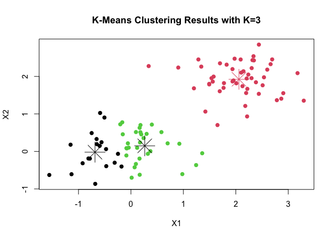

Lecture5 : Cluster Analysis
================
KIM SANG HYUN(202211545)
2025-05-08

- [05. Cluster Analysis](#05-cluster-analysis)
  - [Introduction](#introduction)
  - [Example of Euclidean Distance](#example-of-euclidean-distance)
  - [Example of Euclidean Distance](#example-of-euclidean-distance-1)
  - [Clustering](#clustering)
  - [K - means Clustering](#k---means-clustering)
  - [K - Means Cluster Algorithm](#k---means-cluster-algorithm)
  - [Example of the K-means
    Clustering](#example-of-the-k-means-clustering)

## 05. Cluster Analysis

``` r
library(multtest)
```

    ## Loading required package: BiocGenerics

    ## 
    ## Attaching package: 'BiocGenerics'

    ## The following objects are masked from 'package:stats':
    ## 
    ##     IQR, mad, sd, var, xtabs

    ## The following objects are masked from 'package:base':
    ## 
    ##     anyDuplicated, aperm, append, as.data.frame, basename, cbind,
    ##     colnames, dirname, do.call, duplicated, eval, evalq, Filter, Find,
    ##     get, grep, grepl, intersect, is.unsorted, lapply, Map, mapply,
    ##     match, mget, order, paste, pmax, pmax.int, pmin, pmin.int,
    ##     Position, rank, rbind, Reduce, rownames, sapply, saveRDS, setdiff,
    ##     table, tapply, union, unique, unsplit, which.max, which.min

    ## Loading required package: Biobase

    ## Welcome to Bioconductor
    ## 
    ##     Vignettes contain introductory material; view with
    ##     'browseVignettes()'. To cite Bioconductor, see
    ##     'citation("Biobase")', and for packages 'citation("pkgname")'.

``` r
library(genefilter)
library(ALL)
library(gplots)
```

    ## 
    ## Attaching package: 'gplots'

    ## The following object is masked from 'package:multtest':
    ## 
    ##     wapply

    ## The following object is masked from 'package:stats':
    ## 
    ##     lowess

``` r
library(ISLR2)
```

### Introduction

- Cluster analysis consists of several methods for discovering a subset
  of genes which form a group under some obervable **similarity
  criteria.**

- These methods are based on **distiance function** and an algorithm to
  join data points into clusters based on their relative distances to
  each other.

#### Distance

- The concept of distance plays a crucial role in cluster analysis.

- The following **properties are satisfied.**


- When analyzing gene expression values for several patients, it’ s
  important to define a **distance between vectors of gene
  expressions**, such as the distance between $a = (a_1,...,a_n)^T$ and
  $b = (b_1,...,b_n)^T$ .

- We wii focus mainly on the **Euclidean distance**.

$$
d(a, b ) = \sqrt{\sum^n_{i=1}(a_i-b_i)^2}
$$

### Example of Euclidean Distance

- Example : Distances betwwen Cyclin gene expressions.

  - We select the genes related to the biological term “Cyclin” and then
    compute the Euclidean distance between their expresssion values in
    the **Golub** data.

``` r
data(golub, package= "multtest")
cyclins = grep("Cyclin", golub.gnames[,2]) # cyclins과 관련된 이름 뽑!
golub.gnames[cyclins,2]
```

    ##  [1] "CCND2 Cyclin D2"                                        
    ##  [2] "CDK2 Cyclin-dependent kinase 2"                         
    ##  [3] "CCND3 Cyclin D3"                                        
    ##  [4] "CDKN1A Cyclin-dependent kinase inhibitor 1A (p21, Cip1)"
    ##  [5] "CCNH Cyclin H"                                          
    ##  [6] "Cyclin-dependent kinase 4 (CDK4) gene"                  
    ##  [7] "Cyclin G2 mRNA"                                         
    ##  [8] "Cyclin A1 mRNA"                                         
    ##  [9] "Cyclin-selective ubiquitin carrier protein mRNA"        
    ## [10] "CDK6 Cyclin-dependent kinase 6"                         
    ## [11] "Cyclin G1 mRNA"                                         
    ## [12] "CCNF Cyclin F"

``` r
golub[cyclins,]
```

    ##           [,1]     [,2]     [,3]     [,4]     [,5]     [,6]     [,7]     [,8]
    ##  [1,]  2.09511  1.71953 -1.46227 -1.39781  0.93232 -1.21719 -0.97062  1.49964
    ##  [2,]  0.14612  0.12644 -0.26346 -0.27286  0.21770 -0.39297 -1.05299 -1.36832
    ##  [3,]  2.10892  1.52405  1.96403  2.33597  1.85111  1.99391  2.06597  1.81649
    ##  [4,]  0.03240 -0.23576 -1.46227  0.40235  0.63329 -0.26141  0.42316 -1.02341
    ##  [5,] -0.11439 -0.72887 -0.39674 -0.08790 -0.01087 -0.65621 -0.30232 -0.17343
    ##  [6,]  0.09957 -0.21682 -0.02299  0.17161  0.57857  0.13683 -0.10047  0.16190
    ##  [7,] -0.13615 -0.00161 -1.01140 -0.16954 -0.15637 -1.18079 -0.95857 -0.46984
    ##  [8,] -1.45769 -1.39420 -0.30962  1.78240  2.19905 -1.14575  1.00702  0.17541
    ##  [9,]  1.11692  0.44479  1.21778  1.79176  1.20949  1.33367  1.47602  1.05818
    ## [10,]  0.58733  0.24527 -0.12249  0.39137  0.34923  0.28239  0.27259 -0.08456
    ## [11,]  0.43113 -0.31585 -0.50522 -0.11118  0.73660 -1.21719 -0.41901 -0.40108
    ## [12,] -1.45769 -1.39420 -1.46227 -1.40715 -1.42668 -1.21719 -1.37386 -1.36832
    ##           [,9]    [,10]    [,11]    [,12]    [,13]    [,14]    [,15]    [,16]
    ##  [1,]  1.00476 -1.09527 -1.28137  1.61853  1.94526 -1.39979 -0.55575  1.62000
    ##  [2,]  0.06740  0.36937  0.24716 -0.58772  0.34700  0.40403  0.13681  0.09645
    ##  [3,]  2.17622  1.80861  2.44562  1.90496  2.76610  1.32551  2.59385  1.92776
    ##  [4,] -0.18756  0.21011 -0.29579  0.79964  0.99168 -0.82168  0.63829 -1.40095
    ##  [5,] -0.60975 -0.27834 -0.32051 -0.43446 -0.61766 -0.03770 -0.05882  0.05855
    ##  [6,]  0.62386  0.19831 -1.03689 -0.12272  0.22366  0.39613  0.53585 -0.37826
    ##  [7,] -0.64742 -0.27834 -0.30498 -1.03209  0.44611 -0.34299 -0.06270  0.29507
    ##  [8,] -0.47118 -0.57345 -0.42324  0.45252 -0.82736 -0.11022  1.05838 -0.58264
    ##  [9,]  1.21855  1.69765  1.72681  0.75900  1.05475  1.18884  1.50242  0.65821
    ## [10,]  0.23647  0.51636 -1.28137 -0.24863 -0.54457  0.35700  0.43111 -1.40095
    ## [11,]  0.51815  0.55744  1.15955  0.16245  0.60859  0.37879  1.04462  0.80239
    ## [12,] -1.47649 -1.21583 -1.28137 -1.03209 -0.91887 -1.39979 -0.96414 -1.40095
    ##          [,17]    [,18]    [,19]    [,20]    [,21]    [,22]    [,23]    [,24]
    ##  [1,]  2.09998  0.39541  2.34015  1.48474 -1.06221 -1.12665 -0.97802 -0.46516
    ##  [2,]  0.08133  0.39541  0.18293  0.22879 -0.00600 -1.12665 -0.21536  0.32753
    ##  [3,]  1.10546  1.27645  1.83051  1.78352  0.45827  2.18119  2.31428  1.99927
    ##  [4,] -0.94851  0.31148  0.09991 -1.60767 -0.12362  1.07293 -1.20963  0.56981
    ##  [5,]  0.01635  0.03916  0.11156  0.07364  0.34465 -0.52194 -0.13860 -0.04340
    ##  [6,]  0.54402 -0.08487 -0.08862  0.72341 -1.06221 -1.12665  0.15292  0.19933
    ##  [7,] -0.27733 -0.27007 -0.88947 -0.14609  0.84323 -0.61148 -0.61875 -0.02538
    ##  [8,] -0.25555 -0.06110 -0.50391 -0.66659 -0.19930 -1.02751 -0.23643  1.37091
    ##  [9,]  0.77202  1.69373  0.97527  0.35976  0.54830  0.69710  1.94421  0.93038
    ## [10,]  0.74940  0.06525 -0.18464 -0.54780 -0.84280 -0.13845  0.25857  0.36752
    ## [11,]  0.84676  1.15081  0.88168  0.83613  2.41495  0.06611 -0.59277  0.35702
    ## [12,] -1.56783  0.58394 -1.24482 -1.60767 -1.06221 -1.12665 -1.20963 -1.48332
    ##          [,25]    [,26]    [,27]    [,28]    [,29]    [,30]    [,31]    [,32]
    ##  [1,]  1.65274  2.48394 -0.10468  1.57575  1.25281 -1.29865  1.17196  1.11774
    ##  [2,] -0.01234  0.22479 -0.36271  0.36102  0.01228 -0.41132 -1.26183 -0.19108
    ##  [3,]  1.36844  2.37351  1.83485  0.88941  1.45014  0.42904  0.82667  0.63637
    ##  [4,]  0.78679  0.59194 -1.23051  0.79059 -0.26926  0.73013 -1.26183  0.37673
    ##  [5,] -0.25271 -0.32204 -0.46583  0.64512  0.46695 -0.56577 -0.34375 -0.04133
    ##  [6,] -0.03700 -0.14332 -0.09615  0.10337 -0.55165  0.01482  0.18184 -0.45577
    ##  [7,] -0.50901 -0.51506 -0.76403 -0.45484 -0.43840 -0.23905 -1.13677 -0.52662
    ##  [8,] -0.01967 -0.49503 -0.86722  0.08810  1.01395  0.72872  1.78061 -0.16717
    ##  [9,]  0.73500  0.74160  1.09842  1.13752  0.82650  0.50761  1.10338  0.54543
    ## [10,] -1.25268 -0.19626  0.98945 -0.30877 -1.08902  0.32504  0.65517  0.59800
    ## [11,]  0.29722  0.32137  0.17087  0.55137  1.04467  0.01482  0.28127  0.13255
    ## [12,] -1.25268 -0.42999 -1.23051 -1.43337 -1.08902 -1.29865 -1.26183 -1.44434
    ##          [,33]    [,34]    [,35]    [,36]    [,37]    [,38]
    ##  [1,]  1.41598  0.57499  0.63894 -0.92935 -0.11091  1.15591
    ##  [2,] -0.63535 -0.06385 -0.27960 -1.39906 -0.15272 -0.52682
    ##  [3,]  1.02250  0.12758 -0.74333  0.73784  0.49470  1.12058
    ##  [4,]  0.89123 -1.34158 -0.32442  0.99461  0.04026 -1.18952
    ##  [5,] -0.14150 -0.34850 -0.35946 -0.94364  0.05047  0.05905
    ##  [6,] -0.97706 -0.12714  0.15231 -0.26400 -0.56900 -0.67788
    ##  [7,] -1.47218 -1.34158 -1.22961 -0.30751 -0.94202 -0.06085
    ##  [8,]  1.12599  1.04696  0.26068 -0.05190  1.14579  0.13462
    ##  [9,]  0.96416  0.78906  1.79809  1.34705  1.26351  1.28030
    ## [10,] -1.47218  0.56365  0.43808 -0.14566 -0.99747 -1.32403
    ## [11,] -0.84745  0.08816  0.18679 -0.83992  0.01243  0.51648
    ## [12,] -1.47218 -1.34158 -1.22961 -1.39906 -1.34579 -1.32403

``` r
dim(golub[cyclins,])
```

    ## [1] 12 38

``` r
dist.cyclin = dist(golub[cyclins, ], method = "euclidean")
dist.cyclin
```

    ##            1         2         3         4         5         6         7
    ## 2   8.821806                                                            
    ## 3  11.553494 11.701562                                                  
    ## 4  10.056814  5.931260 11.991333                                        
    ## 5   8.669112  2.934802 11.900558  5.698232                              
    ## 6   8.645304  3.659086 11.096932  6.203383  3.663108                    
    ## 7  10.157110  3.835045 13.277355  6.098316  3.633005  4.791643          
    ## 8  10.489737  7.042724 11.987659  7.000343  5.647533  6.079844  7.684192
    ## 9  10.195595  8.788053  5.643753  9.261528  8.600662  8.013563 10.560682
    ## 10 10.138835  5.286497 11.818444  6.763858  5.136055  3.388280  6.011730
    ## 11  8.298177  4.581139  9.852140  7.080173  4.573236  5.646905  5.814536
    ## 12 13.137183  7.429024 17.786151  8.628085  7.080438  8.118248  5.943200
    ##            8         9        10        11
    ## 2                                         
    ## 3                                         
    ## 4                                         
    ## 5                                         
    ## 6                                         
    ## 7                                         
    ## 8                                         
    ## 9   8.359383                              
    ## 10  6.941314  8.552852                    
    ## 11  7.053795  7.130024  6.838069          
    ## 12 10.253758 14.684560  8.526896 10.328346

``` r
distanceMatrix = as.matrix(dist.cyclin)
rownames(distanceMatrix) = golub.gnames[cyclins, 3]
colnames(distanceMatrix) = golub.gnames[cyclins, 3]
distanceMatrix[1:5, 1:5]
```

    ##           D13639_at M68520_at M92287_at U09579_at U11791_at
    ## D13639_at  0.000000  8.821806  11.55349 10.056814  8.669112
    ## M68520_at  8.821806  0.000000  11.70156  5.931260  2.934802
    ## M92287_at 11.553494 11.701562   0.00000 11.991333 11.900558
    ## U09579_at 10.056814  5.931260  11.99133  0.000000  5.698232
    ## U11791_at  8.669112  2.934802  11.90056  5.698232  0.000000

### Example of Euclidean Distance

- Example: Finding the ten genes with expression patterns most similar
  to the MME gene.

  - `genefinder()` : 지정한 유전자의 발현 패턴과 가장 유사한 유전자들을
    거리 기준으로 찾아줌.

``` r
library(genefilter)
library(ALL)
data(ALL)
closeto1389_at <- genefinder(ALL, "1389_at", 10, method="euc")
#  "1389_at" 유전자와 유클리드 거리 기준으로 가장 가까운 10개의 유전자를 찾아줘.
closeto1389_at
```

    ## $`1389_at`
    ## $`1389_at`$indices
    ##  [1]  2653  1096  6634  9255  6639 11402  9849  2274  8518 10736
    ## 
    ## $`1389_at`$dists
    ##  [1] 12.62895 12.75164 12.77534 12.78678 12.95589 13.03828 13.09785 13.20989
    ##  [9] 13.32321 13.38972

- index 번호하고 거리하고 넘겨줌

``` r
w <- featureNames(ALL)[closeto1389_at[[1]]$indices] 
data.frame(genes=w, distance=closeto1389_at[[1]]$dists)
```

    ##         genes distance
    ## 1  32629_f_at 12.62895
    ## 2     1988_at 12.75164
    ## 3    36571_at 12.77534
    ## 4    39168_at 12.78678
    ## 5    36576_at 12.95589
    ## 6    41295_at 13.03828
    ## 7  39756_g_at 13.09785
    ## 8    32254_at 13.20989
    ## 9    38438_at 13.32321
    ## 10   40635_at 13.38972

### Clustering

- We seek a partition of the data into distinct groups so that the
  observations within each group are quite similar to each other.

- There is two differnet clustering methods.

  - K-means clustering

  - Hierarchical clustering

### K - means Clustering

- Let $C_1, C_2, ..., C_k$ (\$k\$ is hyperparameter) denote sets
  containing the indices of the observations in each cluster.

- If the $i$th observation is in the $k$th cluster, then $i \in C_K$.

- Property 1 : 각 관측치는 무조건 K개 group 중 하나에는 들어가야한다.

- Property 2 : 각 그룹의 교집한은 존재 하지 않는다. (관측치가 동시에
  다른 그룹에 속하지 x)

- The idea behinde K-means clustering is that a good clustering is one
  for which the WCV is as small as possible.

> WCV (Within - Cluster Variation)이란?
>
> WCV는 하나의 군집 안에 있는 데이터들이 서로 얼마나 흩어져 있는지를
> 측정하는 값.
>
> 즉, 같은 군집 안에 있는 데이터들이 서로 얼마나 비슷한가 를 수치로
> 나타냄.

- Typically, we us **Euclidean distance**


### K - Means Cluster Algorithm


- This algorithm is guaranteed to decrease the value of Total
  within-cluster variation, however it is not guaranteed to give
  **global minimun**.

### Example of the K-means Clustering

- Example : K - means cluster analysis for 2 patients and 50 genes.

- 

``` r
set.seed(111)
x1 <- matrix(rnorm(100, 0, 0.5), ncol=2)
x2 <- matrix(rnorm(100, 2, 0.5), ncol=2)
data <- rbind(x1, x2)
```

- 데이터 구조 확인하기

- `nstart` : 몇 번 반복할 것인가..?

``` r
cl <- kmeans(data, 2, nstart=20)
cl
```

    ## K-means clustering with 2 clusters of sizes 50, 50
    ## 
    ## Cluster means:
    ##          [,1]       [,2]
    ## 1 -0.09721386 0.08439481
    ## 2  2.05993803 1.92319487
    ## 
    ## Clustering vector:
    ##   [1] 1 1 1 1 1 1 1 1 1 1 1 1 1 1 1 1 1 1 1 1 1 1 1 1 1 1 1 1 1 1 1 1 1 1 1 1 1
    ##  [38] 1 1 1 1 1 1 1 1 1 1 1 1 1 2 2 2 2 2 2 2 2 2 2 2 2 2 2 2 2 2 2 2 2 2 2 2 2
    ##  [75] 2 2 2 2 2 2 2 2 2 2 2 2 2 2 2 2 2 2 2 2 2 2 2 2 2 2
    ## 
    ## Within cluster sum of squares by cluster:
    ## [1] 27.55703 25.24015
    ##  (between_SS / total_SS =  79.2 %)
    ## 
    ## Available components:
    ## 
    ## [1] "cluster"      "centers"      "totss"        "withinss"     "tot.withinss"
    ## [6] "betweenss"    "size"         "iter"         "ifault"

``` r
plot(data, col=cl$cluster, pch=19, xlab="X1", ylab="X2",
main="K-Means Clustering Results with K=2")
points(cl$centers, col=1:2, pch=8, cex=4)
```

<!-- -->

``` r
cl <- kmeans(data, 3, nstart=20)
plot(data, col=cl$cluster, pch=19, xlab="X1", ylab="X2",
main="K-Means Clustering Results with K=3")
points(cl$centers, col=1:2, pch=8, cex=4)
```

<!-- -->

``` r
set.seed(111)
par(mfrow=c(1, 2))
cl <- kmeans(data, 3, nstart=1)

tv <- round(cl$tot.withinss, 3)
plot(data, col=cl$cluster, pch=19, xlab="X1", ylab="X2",
main=paste("(", tv, ")"))
points(cl$centers, col=1:2, pch=8, cex=4)
cl <- kmeans(data, 3, nstart=20)
tv <- round(cl$tot.withinss, 3)
plot(data, col=cl$cluster, pch=19, xlab="X1", ylab="X2",
main=paste("(", tv, ")"))
points(cl$centers, col=1:2, pch=8, cex=4)
```

<!-- -->

``` r
data(golub, package="multtest")
zyxin <- grep("Zyxin", golub.gnames[ ,2])
ccnd3 <- grep("CCND3", golub.gnames[ ,2])
data <- data.frame(golub[ccnd3, ], golub[zyxin, ])
colnames(data) <- c("CCND3 (Cyclin D3)", "Zyxin")
```

``` r
cl <- kmeans(data, 2, nstart=20)
cbind(cl$cluster, golub.cl)
```

    ##         golub.cl
    ##  [1,] 1        0
    ##  [2,] 1        0
    ##  [3,] 1        0
    ##  [4,] 1        0
    ##  [5,] 1        0
    ##  [6,] 1        0
    ##  [7,] 1        0
    ##  [8,] 1        0
    ##  [9,] 1        0
    ## [10,] 1        0
    ## [11,] 1        0
    ## [12,] 1        0
    ## [13,] 1        0
    ## [14,] 1        0
    ## [15,] 1        0
    ## [16,] 1        0
    ## [17,] 1        0
    ## [18,] 1        0
    ## [19,] 1        0
    ## [20,] 1        0
    ## [21,] 1        0
    ## [22,] 1        0
    ## [23,] 1        0
    ## [24,] 1        0
    ## [25,] 1        0
    ## [26,] 1        0
    ## [27,] 1        0
    ## [28,] 2        1
    ## [29,] 2        1
    ## [30,] 2        1
    ## [31,] 2        1
    ## [32,] 2        1
    ## [33,] 2        1
    ## [34,] 2        1
    ## [35,] 2        1
    ## [36,] 2        1
    ## [37,] 2        1
    ## [38,] 2        1

``` r
cl
```

    ## K-means clustering with 2 clusters of sizes 27, 11
    ## 
    ## Cluster means:
    ##   CCND3 (Cyclin D3)      Zyxin
    ## 1         1.8938826 -0.2947926
    ## 2         0.6355909  1.5866682
    ## 
    ## Clustering vector:
    ##  [1] 1 1 1 1 1 1 1 1 1 1 1 1 1 1 1 1 1 1 1 1 1 1 1 1 1 1 1 2 2 2 2 2 2 2 2 2 2 2
    ## 
    ## Within cluster sum of squares by cluster:
    ## [1] 19.842225  4.733248
    ##  (between_SS / total_SS =  62.0 %)
    ## 
    ## Available components:
    ## 
    ## [1] "cluster"      "centers"      "totss"        "withinss"     "tot.withinss"
    ## [6] "betweenss"    "size"         "iter"         "ifault"

``` r
plot(data, col=cl$cluster, pch=19, xlab="CCND3", ylab="Zyxin")
points(cl$centers, col=1:2, pch=8, cex=4)
```

<!-- -->

``` r
par(mfrow=c(1, 3))
cl <- kmeans(data, 2, nstart=20)
plot(data, col=cl$cluster, pch=19, xlab="CCND3", ylab="Zyxin",
main="K = 2")
points(cl$centers, col=1:2, pch=8, cex=4)
cl <- kmeans(data, 3, nstart=20)
plot(data, col=cl$cluster, pch=19, xlab="CCND3", ylab="Zyxin",
main="K = 3")
points(cl$centers, col=1:3, pch=8, cex=4)
cl <- kmeans(data, 4, nstart=20)
plot(data, col=cl$cluster, pch=19, xlab="CCND3", ylab="Zyxin",
main="K = 4")
points(cl$centers, col=1:4, pch=8, cex=4)
```

<!-- -->
