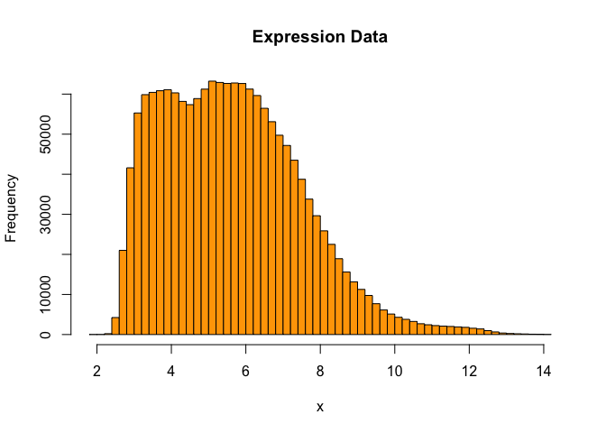
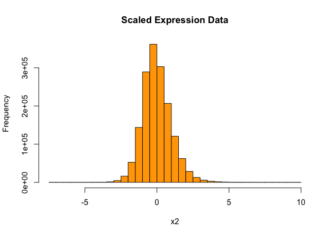
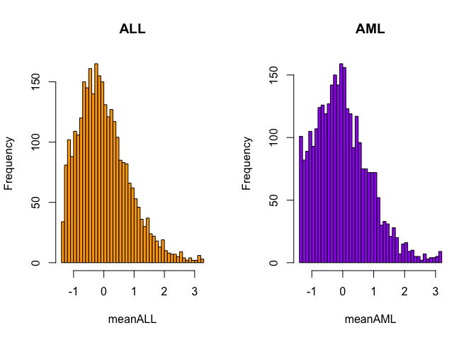
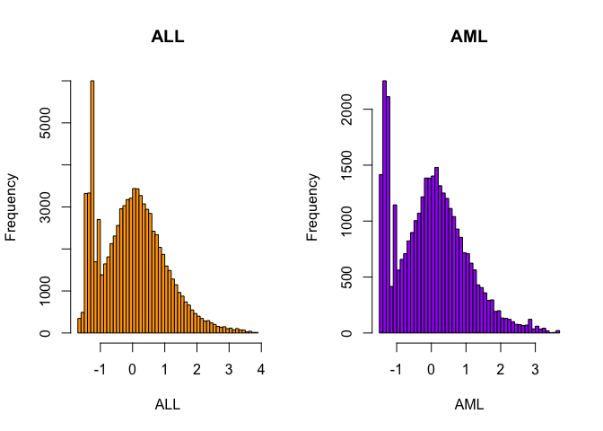

Lecture1: Introduction to Statistical Genetics with R
================

- [Computing on a data matrix](#computing-on-a-data-matrix)
- [Constructing a data frame](#constructing-a-data-frame)
- [Referencing column vectors in a data
  frame](#referencing-column-vectors-in-a-data-frame)
- [Constructing a list](#constructing-a-list)
- [Data path attachment](#data-path-attachment)
- [Generating factor](#generating-factor)
- [Functions](#functions)
- [Introduction to Bioconductor](#introduction-to-bioconductor)
- [ALL Data Example](#all-data-example)
- [golub Data example](#golub-data-example)
- [`grep()`](#grep)

- 2025-03-11

### Computing on a data matrix

- In bioinformatics, gene expression values (from several groups of
  patients) are stored as rows such that each row contains the
  expression values of all the patients for a particular gene and each
  column contains all the gene expression values for a particular person

> 열이 각 gene이고 행이 각 sample, value는 gene expression.

``` r
gene1 = c(1.00, 1.50, 1.25)
gene1
```

    ## [1] 1.00 1.50 1.25

``` r
gene2 = c(1.35, 1.55, 1.00)
gene3 = c(-1.10, -1.50, -1.25)
gene4 = c(-1.20, -1.30, -1.00)
genes = c(gene1, gene2, gene3, gene4)
genes
```

    ##  [1]  1.00  1.50  1.25  1.35  1.55  1.00 -1.10 -1.50 -1.25 -1.20 -1.30 -1.00

``` r
geneData = matrix(genes, nrow=4, ncol=3, byrow=TRUE) # !byrow! -> 벡터를 행으로 박기
geneData
```

    ##       [,1]  [,2]  [,3]
    ## [1,]  1.00  1.50  1.25
    ## [2,]  1.35  1.55  1.00
    ## [3,] -1.10 -1.50 -1.25
    ## [4,] -1.20 -1.30 -1.00

``` r
rownames(geneData) = c("gene1", "gene2", "gene3", "gene4")
colnames(geneData) = c("Eric", "Peter", "Anna")
geneData
```

    ##        Eric Peter  Anna
    ## gene1  1.00  1.50  1.25
    ## gene2  1.35  1.55  1.00
    ## gene3 -1.10 -1.50 -1.25
    ## gene4 -1.20 -1.30 -1.00

``` r
# t(geneData)
```

> 여기에선 각 col이 sample이 되고 각 row는 gene name이 된다.

``` r
# data를 받고 제일 처음 해야할 것.
nrow(geneData) # # of gene
```

    ## [1] 4

``` r
ncol(geneData) # # of sample
```

    ## [1] 3

``` r
class(geneData)
```

    ## [1] "matrix" "array"

``` r
geneData[3,] # third row (gene) data
```

    ##  Eric Peter  Anna 
    ## -1.10 -1.50 -1.25

``` r
geneData[c(1,2), ] # first and second row(gene) data
```

    ##       Eric Peter Anna
    ## gene1 1.00  1.50 1.25
    ## gene2 1.35  1.55 1.00

``` r
geneData[c("gene1", "gene2"), ] # can indexing with names
```

    ##       Eric Peter Anna
    ## gene1 1.00  1.50 1.25
    ## gene2 1.35  1.55 1.00

``` r
apply(geneData, 1, mean) # 1 means mean of each row(gene) == row by row
```

    ##     gene1     gene2     gene3     gene4 
    ##  1.250000  1.300000 -1.283333 -1.166667

``` r
apply(geneData, 2, mean) # 2 means mean of each column(sample) == col by col
```

    ##   Eric  Peter   Anna 
    ## 0.0125 0.0625 0.0000

### Constructing a data frame

- Matrix must have same data type init.
- But Data frame do not need it
- 하나의 컬럼에서는 똑같은 tpye이 들어가야함.
- 각 행의 열 수가 같아야함.
- It consists of a list of column vectors of equal length, where the
  data in each column must be of the same type.

``` r
patients.df = data.frame(
  patientID = c("101", "102", "103", "104"),
  treatment = c("drug", "placebo", "drug", "placebo"),
  age = c(20, 30, 24, 22) 
)

patients.df
```

    ##   patientID treatment age
    ## 1       101      drug  20
    ## 2       102   placebo  30
    ## 3       103      drug  24
    ## 4       104   placebo  22

``` r
nrow(patients.df)
```

    ## [1] 4

``` r
ncol(patients.df)
```

    ## [1] 3

``` r
class(patients.df)
```

    ## [1] "data.frame"

### Referencing column vectors in a data frame

``` r
patients.df[, 2]
```

    ## [1] "drug"    "placebo" "drug"    "placebo"

``` r
patients.df[[2]]
```

    ## [1] "drug"    "placebo" "drug"    "placebo"

``` r
patients.df[["treatment"]]
```

    ## [1] "drug"    "placebo" "drug"    "placebo"

``` r
patients.df$treatment # 이걸 제일 많이 사용함
```

    ## [1] "drug"    "placebo" "drug"    "placebo"

``` r
patients.df[, 2]
```

    ## [1] "drug"    "placebo" "drug"    "placebo"

``` r
patients.df[c(1,3), ]
```

    ##   patientID treatment age
    ## 1       101      drug  20
    ## 3       103      drug  24

``` r
patients.df$treatment=="drug"
```

    ## [1]  TRUE FALSE  TRUE FALSE

``` r
patients.df[patients.df$treatment=="drug", ] # [, (모든 열)]
```

    ##   patientID treatment age
    ## 1       101      drug  20
    ## 3       103      drug  24

``` r
subset(patients.df, treatment=="drug")
```

    ##   patientID treatment age
    ## 1       101      drug  20
    ## 3       103      drug  24

``` r
row.names(patients.df) = patients.df$patientID
patients.df[c("101", "103"),]
```

    ##     patientID treatment age
    ## 101       101      drug  20
    ## 103       103      drug  24

``` r
patients.df[2] # series
```

    ##     treatment
    ## 101      drug
    ## 102   placebo
    ## 103      drug
    ## 104   placebo

``` r
patients.df[[2]] # values
```

    ## [1] "drug"    "placebo" "drug"    "placebo"

``` r
patients.df["treatment"]
```

    ##     treatment
    ## 101      drug
    ## 102   placebo
    ## 103      drug
    ## 104   placebo

``` r
patients.df[["treatment"]]
```

    ## [1] "drug"    "placebo" "drug"    "placebo"

### Constructing a list

- list는 매우 자유로움!

``` r
list1 <- list(
  c("p53", "p63", "p73"),
  matrix(rnorm(10), nrow=2),
  c(TRUE, FALSE, TRUE, FALSE, FALSE)
)
list1
```

    ## [[1]]
    ## [1] "p53" "p63" "p73"
    ## 
    ## [[2]]
    ##            [,1]       [,2]       [,3]       [,4]      [,5]
    ## [1,] -1.7907138 -0.4335810  0.4650249 -1.6288863 0.4887212
    ## [2,] -0.9675878 -0.6466939 -1.4194271 -0.6574175 1.6158467
    ## 
    ## [[3]]
    ## [1]  TRUE FALSE  TRUE FALSE FALSE

``` r
p53FamilyGenes <- c("p53", "p63", "p73")
list2 <- list(
  genes = p53FamilyGenes,
  geneExpression = matrix(rnorm(10), nrow=2),
  remission = c(TRUE, FALSE, TRUE, FALSE, FALSE)
)
list2
```

    ## $genes
    ## [1] "p53" "p63" "p73"
    ## 
    ## $geneExpression
    ##            [,1]        [,2]       [,3]      [,4]       [,5]
    ## [1,] -0.1509777 -0.04028335  1.0480371 -1.321044  0.3424449
    ## [2,] -1.5599150 -1.64002314 -0.3868222  1.557600 -0.5661659
    ## 
    ## $remission
    ## [1]  TRUE FALSE  TRUE FALSE FALSE

``` r
list2[1]
```

    ## $genes
    ## [1] "p53" "p63" "p73"

``` r
list2[[1]]
```

    ## [1] "p53" "p63" "p73"

``` r
list2[["genes"]]
```

    ## [1] "p53" "p63" "p73"

``` r
list2$genes
```

    ## [1] "p53" "p63" "p73"

``` r
list2[[1]][1] <- "her2"
list2$genes
```

    ## [1] "her2" "p63"  "p73"

``` r
list2
```

    ## $genes
    ## [1] "her2" "p63"  "p73" 
    ## 
    ## $geneExpression
    ##            [,1]        [,2]       [,3]      [,4]       [,5]
    ## [1,] -0.1509777 -0.04028335  1.0480371 -1.321044  0.3424449
    ## [2,] -1.5599150 -1.64002314 -0.3868222  1.557600 -0.5661659
    ## 
    ## $remission
    ## [1]  TRUE FALSE  TRUE FALSE FALSE

``` r
list2[[2]]
```

    ##            [,1]        [,2]       [,3]      [,4]       [,5]
    ## [1,] -0.1509777 -0.04028335  1.0480371 -1.321044  0.3424449
    ## [2,] -1.5599150 -1.64002314 -0.3868222  1.557600 -0.5661659

``` r
list2$geneExpression
```

    ##            [,1]        [,2]       [,3]      [,4]       [,5]
    ## [1,] -0.1509777 -0.04028335  1.0480371 -1.321044  0.3424449
    ## [2,] -1.5599150 -1.64002314 -0.3868222  1.557600 -0.5661659

``` r
list2[[3]]
```

    ## [1]  TRUE FALSE  TRUE FALSE FALSE

``` r
list2$remission
```

    ## [1]  TRUE FALSE  TRUE FALSE FALSE

### Data path attachment

``` r
# remission # error
attach(list2) # 데이터 이름 생략하기 위해서..!
```

    ## The following object is masked _by_ .GlobalEnv:
    ## 
    ##     genes

``` r
remission
```

    ## [1]  TRUE FALSE  TRUE FALSE FALSE

``` r
detach(list2)
# remission # error
```

``` r
genes <- c("p53", "p63", "p73")
attach(list2)
```

    ## The following object is masked _by_ .GlobalEnv:
    ## 
    ##     genes

``` r
genes # 우선순위는 기존 객체..
```

    ## [1] "p53" "p63" "p73"

``` r
list2$genes
```

    ## [1] "her2" "p63"  "p73"

``` r
patients.df$treatment
```

    ## [1] "drug"    "placebo" "drug"    "placebo"

``` r
attach(patients.df)

treatment
```

    ## [1] "drug"    "placebo" "drug"    "placebo"

``` r
detach(patients.df)
```

### Generating factor

- For plotting and testing of hypo we need to generate a **factor**.

``` r
?gl
gl(3, 5) # gl( # of group, # of element of each group) # factor
```

    ##  [1] 1 1 1 1 1 2 2 2 2 2 3 3 3 3 3
    ## Levels: 1 2 3

``` r
rep(1:3, each = 5) # vector
```

    ##  [1] 1 1 1 1 1 2 2 2 2 2 3 3 3 3 3

- factor type은 범주형 자료라 연산 안됨. (확인해보기)

``` r
class(gl(3, 5))
```

    ## [1] "factor"

``` r
class(rep(1:3, each = 5))
```

    ## [1] "integer"

``` r
factor(rep(1:3, each=5)) # same as gl()
```

    ##  [1] 1 1 1 1 1 2 2 2 2 2 3 3 3 3 3
    ## Levels: 1 2 3

``` r
A <- factor(rep(1:3, each = 5))
class(A)
```

    ## [1] "factor"

### Functions

``` r
set.seed(123)

A <- matrix(sample(1:100, 12), nrow=3, ncol=4)

A
```

    ##      [,1] [,2] [,3] [,4]
    ## [1,]   31   14   50   25
    ## [2,]   79   67   43   90
    ## [3,]   51   42   97   69

``` r
apply(A, 2, var)
```

    ## [1]  581.3333  703.0000  862.3333 1100.3333

``` r
fun <- function(x) {
  sum((x-mean(x))^2)/(length(x)-1)
}

apply(A, 2, fun)
```

    ## [1]  581.3333  703.0000  862.3333 1100.3333

``` r
apply(A, 2, function(x) sum((x-mean(x))^2)/(length(x) - 1))
```

    ## [1]  581.3333  703.0000  862.3333 1100.3333

- case : more than one argment

``` r
fun1 <- function(x, a) sum(x-a)^2/(length(x)-1)
apply(A, 2, fun1, a=40)
```

    ## [1]  840.5    4.5 2450.0 2048.0

``` r
fun2 <- function(x, a, b) sum(x - a)^2 / b
apply(A, 2, fun2, a = 40, b = 10)
```

    ## [1] 168.1   0.9 490.0 409.6

``` r
list(a=2, b=3)
```

    ## $a
    ## [1] 2
    ## 
    ## $b
    ## [1] 3

``` r
lapply(list(a=2, b=3), sqrt) # 각각의 원소마다 적용하라..
```

    ## $a
    ## [1] 1.414214
    ## 
    ## $b
    ## [1] 1.732051

``` r
matrix(1:6, 2, 3)
```

    ##      [,1] [,2] [,3]
    ## [1,]    1    3    5
    ## [2,]    2    4    6

``` r
lapply(matrix(1:6, 2, 3), function(x) x^2) # 각 원소가 함수로 들어가서 lapply이므로 output으로 list로 출력된다.
```

    ## [[1]]
    ## [1] 1
    ## 
    ## [[2]]
    ## [1] 4
    ## 
    ## [[3]]
    ## [1] 9
    ## 
    ## [[4]]
    ## [1] 16
    ## 
    ## [[5]]
    ## [1] 25
    ## 
    ## [[6]]
    ## [1] 36

``` r
mylapply <- function(lst, fun) {
  lst <- as.list(lst)
  ans <- vector("list", length(lst))
  names(ans) <- names(lst)
  for(i in 1:length(lst))
    ans[i] <- list(fun(lst[[i]]))
  ans
  }
mylapply(list(a=2, b = 3), sqrt)
```

    ## $a
    ## [1] 1.414214
    ## 
    ## $b
    ## [1] 1.732051

### Introduction to Bioconductor

``` r
#if (!requireNamespace("BiocManager", quietly = TRUE))
#  install.packages("BiocManager")
#BiocManager::install()
```

``` r
#BiocManager::install("ALL")
library(ALL)
```

    ## Loading required package: Biobase

    ## Loading required package: BiocGenerics

    ## 
    ## Attaching package: 'BiocGenerics'

    ## The following objects are masked from 'package:stats':
    ## 
    ##     IQR, mad, sd, var, xtabs

    ## The following objects are masked from 'package:base':
    ## 
    ##     anyDuplicated, aperm, append, as.data.frame, basename, cbind,
    ##     colnames, dirname, do.call, duplicated, eval, evalq, Filter, Find,
    ##     get, grep, grepl, intersect, is.unsorted, lapply, Map, mapply,
    ##     match, mget, order, paste, pmax, pmax.int, pmin, pmin.int,
    ##     Position, rank, rbind, Reduce, rownames, sapply, saveRDS, setdiff,
    ##     table, tapply, union, unique, unsplit, which.max, which.min

    ## Welcome to Bioconductor
    ## 
    ##     Vignettes contain introductory material; view with
    ##     'browseVignettes()'. To cite Bioconductor, see
    ##     'citation("Biobase")', and for packages 'citation("pkgname")'.

``` r
data(ALL)
#?ALL
ALL
```

    ## ExpressionSet (storageMode: lockedEnvironment)
    ## assayData: 12625 features, 128 samples 
    ##   element names: exprs 
    ## protocolData: none
    ## phenoData
    ##   sampleNames: 01005 01010 ... LAL4 (128 total)
    ##   varLabels: cod diagnosis ... date last seen (21 total)
    ##   varMetadata: labelDescription
    ## featureData: none
    ## experimentData: use 'experimentData(object)'
    ##   pubMedIds: 14684422 16243790 
    ## Annotation: hgu95av2

``` r
str(ALL)
```

    ## Formal class 'ExpressionSet' [package "Biobase"] with 7 slots
    ##   ..@ experimentData   :Formal class 'MIAME' [package "Biobase"] with 13 slots
    ##   .. .. ..@ name             : chr "Chiaretti et al."
    ##   .. .. ..@ lab              : chr "Department of Medical Oncology, Dana-Farber Cancer Institute, Department of Medicine, Brigham and Women's Hospi"| __truncated__
    ##   .. .. ..@ contact          : chr ""
    ##   .. .. ..@ title            : chr "Gene expression profile of adult T-cell acute lymphocytic leukemia identifies distinct subsets of patients with"| __truncated__
    ##   .. .. ..@ abstract         : chr "Gene expression profiles were examined in 33 adult patients with T-cell acute lymphocytic leukemia (T-ALL). Non"| __truncated__
    ##   .. .. ..@ url              : chr ""
    ##   .. .. ..@ pubMedIds        : chr [1:2] "14684422" "16243790"
    ##   .. .. ..@ samples          : list()
    ##   .. .. ..@ hybridizations   : list()
    ##   .. .. ..@ normControls     : list()
    ##   .. .. ..@ preprocessing    : list()
    ##   .. .. ..@ other            : list()
    ##   .. .. ..@ .__classVersion__:Formal class 'Versions' [package "Biobase"] with 1 slot
    ##   .. .. .. .. ..@ .Data:List of 1
    ##   .. .. .. .. .. ..$ : int [1:3] 1 0 0
    ##   .. .. .. .. ..$ names: chr "MIAME"
    ##   ..@ assayData        :<environment: 0x1380dd1f0> 
    ##   ..@ phenoData        :Formal class 'AnnotatedDataFrame' [package "Biobase"] with 4 slots
    ##   .. .. ..@ varMetadata      :'data.frame':  21 obs. of  1 variable:
    ##   .. .. .. ..$ labelDescription: chr [1:21] " Patient ID" " Date of diagnosis" " Gender of the patient" " Age of the patient at entry" ...
    ##   .. .. ..@ data             :'data.frame':  128 obs. of  21 variables:
    ##   .. .. .. ..$ cod           : chr [1:128] "1005" "1010" "3002" "4006" ...
    ##   .. .. .. ..$ diagnosis     : chr [1:128] "5/21/1997" "3/29/2000" "6/24/1998" "7/17/1997" ...
    ##   .. .. .. ..$ sex           : Factor w/ 2 levels "F","M": 2 2 1 2 2 2 1 2 2 2 ...
    ##   .. .. .. ..$ age           : int [1:128] 53 19 52 38 57 17 18 16 15 40 ...
    ##   .. .. .. ..$ BT            : Factor w/ 10 levels "B","B1","B2",..: 3 3 5 2 3 2 2 2 3 3 ...
    ##   .. .. .. ..$ remission     : Factor w/ 2 levels "CR","REF": 1 1 1 1 1 1 1 1 1 1 ...
    ##   .. .. .. ..$ CR            : chr [1:128] "CR" "CR" "CR" "CR" ...
    ##   .. .. .. ..$ date.cr       : chr [1:128] "8/6/1997" "6/27/2000" "8/17/1998" "9/8/1997" ...
    ##   .. .. .. ..$ t(4;11)       : logi [1:128] FALSE FALSE NA TRUE FALSE FALSE ...
    ##   .. .. .. ..$ t(9;22)       : logi [1:128] TRUE FALSE NA FALSE FALSE FALSE ...
    ##   .. .. .. ..$ cyto.normal   : logi [1:128] FALSE FALSE NA FALSE FALSE FALSE ...
    ##   .. .. .. ..$ citog         : chr [1:128] "t(9;22)" "simple alt." NA "t(4;11)" ...
    ##   .. .. .. ..$ mol.biol      : Factor w/ 6 levels "ALL1/AF4","BCR/ABL",..: 2 4 2 1 4 4 4 4 4 2 ...
    ##   .. .. .. ..$ fusion protein: Factor w/ 3 levels "p190","p190/p210",..: 3 NA 1 NA NA NA NA NA NA 1 ...
    ##   .. .. .. ..$ mdr           : Factor w/ 2 levels "NEG","POS": 1 2 1 1 1 1 2 1 1 1 ...
    ##   .. .. .. ..$ kinet         : Factor w/ 2 levels "dyploid","hyperd.": 1 1 1 1 1 2 2 1 1 NA ...
    ##   .. .. .. ..$ ccr           : logi [1:128] FALSE FALSE FALSE FALSE FALSE FALSE ...
    ##   .. .. .. ..$ relapse       : logi [1:128] FALSE TRUE TRUE TRUE TRUE TRUE ...
    ##   .. .. .. ..$ transplant    : logi [1:128] TRUE FALSE FALSE FALSE FALSE FALSE ...
    ##   .. .. .. ..$ f.u           : chr [1:128] "BMT / DEATH IN CR" "REL" "REL" "REL" ...
    ##   .. .. .. ..$ date last seen: chr [1:128] NA "8/28/2000" "10/15/1999" "1/23/1998" ...
    ##   .. .. ..@ dimLabels        : chr [1:2] "sampleNames" "sampleColumns"
    ##   .. .. ..@ .__classVersion__:Formal class 'Versions' [package "Biobase"] with 1 slot
    ##   .. .. .. .. ..@ .Data:List of 1
    ##   .. .. .. .. .. ..$ : int [1:3] 1 1 0
    ##   .. .. .. .. ..$ names: chr "AnnotatedDataFrame"
    ##   ..@ featureData      :Formal class 'AnnotatedDataFrame' [package "Biobase"] with 4 slots
    ##   .. .. ..@ varMetadata      :'data.frame':  0 obs. of  1 variable:
    ##   .. .. .. ..$ labelDescription: logi(0) 
    ##   .. .. ..@ data             :'data.frame':  12625 obs. of  0 variables
    ##   .. .. ..@ dimLabels        : chr [1:2] "featureNames" "featureColumns"
    ##   .. .. ..@ .__classVersion__:Formal class 'Versions' [package "Biobase"] with 1 slot
    ##   .. .. .. .. ..@ .Data:List of 1
    ##   .. .. .. .. .. ..$ : int [1:3] 1 1 0
    ##   .. .. .. .. ..$ names: chr "AnnotatedDataFrame"
    ##   ..@ annotation       : chr "hgu95av2"
    ##   ..@ protocolData     :Formal class 'AnnotatedDataFrame' [package "Biobase"] with 4 slots
    ##   .. .. ..@ varMetadata      :'data.frame':  0 obs. of  1 variable:
    ##   .. .. .. ..$ labelDescription: chr(0) 
    ##   .. .. ..@ data             :'data.frame':  128 obs. of  0 variables
    ##   .. .. ..@ dimLabels        : chr [1:2] "sampleNames" "sampleColumns"
    ##   .. .. ..@ .__classVersion__:Formal class 'Versions' [package "Biobase"] with 1 slot
    ##   .. .. .. .. ..@ .Data:List of 1
    ##   .. .. .. .. .. ..$ : int [1:3] 1 1 0
    ##   .. .. .. .. ..$ names: chr "AnnotatedDataFrame"
    ##   ..@ .__classVersion__:Formal class 'Versions' [package "Biobase"] with 1 slot
    ##   .. .. ..@ .Data:List of 4
    ##   .. .. .. ..$ : int [1:3] 2 10 0
    ##   .. .. .. ..$ : int [1:3] 2 5 5
    ##   .. .. .. ..$ : int [1:3] 1 3 0
    ##   .. .. .. ..$ : int [1:3] 1 0 0
    ##   .. .. ..$ names: chr [1:4] "R" "Biobase" "eSet" "ExpressionSet"

``` r
class(ALL)
```

    ## [1] "ExpressionSet"
    ## attr(,"package")
    ## [1] "Biobase"

``` r
experimentData(ALL)
```

    ## Experiment data
    ##   Experimenter name: Chiaretti et al. 
    ##   Laboratory: Department of Medical Oncology, Dana-Farber Cancer Institute, Department of Medicine, Brigham and Women's Hospital, Harvard Medical School, Boston, MA 02115, USA. 
    ##   Contact information:  
    ##   Title: Gene expression profile of adult T-cell acute lymphocytic leukemia identifies distinct subsets of patients with different response to therapy and survival. 
    ##   URL:  
    ##   PMIDs: 14684422 16243790 
    ## 
    ##   Abstract: A 187 word abstract is available. Use 'abstract' method.

``` r
#sampleNames(ALL)
#featureNames(ALL)
```

``` r
dim(exprs(ALL))
```

    ## [1] 12625   128

``` r
exprs(ALL)[1:10, 1:5]
```

    ##              01005     01010    03002    04006    04007
    ## 1000_at   7.597323  7.479445 7.567593 7.384684 7.905312
    ## 1001_at   5.046194  4.932537 4.799294 4.922627 4.844565
    ## 1002_f_at 3.900466  4.208155 3.886169 4.206798 3.416923
    ## 1003_s_at 5.903856  6.169024 5.860459 6.116890 5.687997
    ## 1004_at   5.925260  5.912780 5.893209 6.170245 5.615210
    ## 1005_at   8.570990 10.428299 9.616713 9.937155 9.983809
    ## 1006_at   3.656143  3.853979 3.646808 3.874289 3.547361
    ## 1007_s_at 7.623562  7.543604 7.916954 6.816397 7.516981
    ## 1008_f_at 8.903547  9.903953 8.494499 9.533983 8.871669
    ## 1009_at   9.371888  9.322177 9.304982 9.135370 9.627175

``` r
varLabels(ALL)
```

    ##  [1] "cod"            "diagnosis"      "sex"            "age"           
    ##  [5] "BT"             "remission"      "CR"             "date.cr"       
    ##  [9] "t(4;11)"        "t(9;22)"        "cyto.normal"    "citog"         
    ## [13] "mol.biol"       "fusion protein" "mdr"            "kinet"         
    ## [17] "ccr"            "relapse"        "transplant"     "f.u"           
    ## [21] "date last seen"

``` r
ALL$sex
```

    ##   [1] M    M    F    M    M    M    F    M    M    M    M    M    M    M    M   
    ##  [16] F    M    M    M    F    M    M    M    M    M    M    F    F    F    F   
    ##  [31] F    F    M    M    F    F    F    F    F    M    F    M    F    M    <NA>
    ##  [46] M    F    M    F    F    F    M    M    M    M    F    M    F    M    F   
    ##  [61] M    M    F    M    M    M    M    M    M    M    F    M    M    F    F   
    ##  [76] M    M    M    F    M    M    M    F    F    F    M    M    M    M    F   
    ##  [91] M    M    F    M    <NA> M    F    F    M    F    M    M    M    M    M   
    ## [106] M    F    F    M    F    M    M    M    F    M    M    F    M    M    M   
    ## [121] M    M    M    M    M    M    M    <NA>
    ## Levels: F M

``` r
ALL$age
```

    ##   [1] 53 19 52 38 57 17 18 16 15 40 33 55  5 18 41 27 27 46 37 36 53 39 53 20 44
    ##  [26] 28 58 43 48 58 19 26 19 32 17 45 20 16 51 57 29 16 32 15 NA 21 49 38 17 26
    ##  [51] 48 16 18 17 22 47 21 54 26 19 47 18 52 27 52 18 18 23 16 NA 54 25 31 19 24
    ##  [76] 23 NA 41 37 54 18 19 43 53 50 54 53 49 20 26 22 36 27 50 NA 31 16 48 17 40
    ## [101] 22 30 18 22 50 41 40 28 25 16 31 14 24 19 37 23 30 48 22 41 52 32 24 37 19
    ## [126] 30 29 NA

``` r
ALL$mol.biol
```

    ##   [1] BCR/ABL  NEG      BCR/ABL  ALL1/AF4 NEG      NEG      NEG      NEG     
    ##   [9] NEG      BCR/ABL  BCR/ABL  NEG      E2A/PBX1 NEG      BCR/ABL  NEG     
    ##  [17] BCR/ABL  BCR/ABL  BCR/ABL  BCR/ABL  NEG      BCR/ABL  BCR/ABL  NEG     
    ##  [25] ALL1/AF4 BCR/ABL  ALL1/AF4 NEG      ALL1/AF4 BCR/ABL  NEG      BCR/ABL 
    ##  [33] NEG      BCR/ABL  BCR/ABL  ALL1/AF4 NEG      BCR/ABL  BCR/ABL  BCR/ABL 
    ##  [41] NEG      E2A/PBX1 BCR/ABL  NEG      NEG      NEG      BCR/ABL  p15/p16 
    ##  [49] ALL1/AF4 BCR/ABL  BCR/ABL  NEG      E2A/PBX1 NEG      NEG      NEG     
    ##  [57] BCR/ABL  BCR/ABL  NEG      NEG      ALL1/AF4 NEG      ALL1/AF4 NEG     
    ##  [65] BCR/ABL  NEG      NEG      NEG      NEG      NEG      BCR/ABL  ALL1/AF4
    ##  [73] BCR/ABL  NEG      E2A/PBX1 NEG      BCR/ABL  BCR/ABL  NEG      NEG     
    ##  [81] NEG      NEG      BCR/ABL  NEG      BCR/ABL  BCR/ABL  BCR/ABL  ALL1/AF4
    ##  [89] NEG      NEG      BCR/ABL  NEG      BCR/ABL  BCR/ABL  E2A/PBX1 NEG     
    ##  [97] NUP-98   NEG      NEG      NEG      NEG      NEG      NEG      NEG     
    ## [105] NEG      NEG      NEG      NEG      NEG      NEG      NEG      NEG     
    ## [113] NEG      NEG      NEG      NEG      NEG      NEG      NEG      NEG     
    ## [121] NEG      NEG      NEG      NEG      NEG      NEG      NEG      NEG     
    ## Levels: ALL1/AF4 BCR/ABL E2A/PBX1 NEG NUP-98 p15/p16

### ALL Data Example

``` r
ALL$BT
```

    ##   [1] B2 B2 B4 B1 B2 B1 B1 B1 B2 B2 B3 B3 B3 B2 B3 B  B2 B3 B2 B3 B2 B2 B2 B1 B1
    ##  [26] B2 B1 B2 B1 B2 B  B  B2 B2 B2 B1 B2 B2 B2 B2 B2 B4 B4 B2 B2 B2 B4 B2 B1 B2
    ##  [51] B2 B3 B4 B3 B3 B3 B4 B3 B3 B1 B1 B1 B1 B3 B3 B3 B3 B3 B3 B3 B3 B1 B3 B1 B4
    ##  [76] B2 B2 B1 B3 B4 B4 B2 B2 B3 B4 B4 B4 B1 B2 B2 B2 B1 B2 B  B  T  T3 T2 T2 T3
    ## [101] T2 T  T4 T2 T3 T3 T  T2 T3 T2 T2 T2 T1 T4 T  T2 T3 T2 T2 T2 T2 T3 T3 T3 T2
    ## [126] T3 T2 T 
    ## Levels: B B1 B2 B3 B4 T T1 T2 T3 T4

``` r
table(ALL$BT)
```

    ## 
    ##  B B1 B2 B3 B4  T T1 T2 T3 T4 
    ##  5 19 36 23 12  5  1 15 10  2

``` r
#' ALL$BT에서 T0_4까지를 BT로 변환을 위한 작업
#' 다음 코드를 실행하면 T/F의 Logical vector가 생성된다.
BT <- ALL$BT %in% c("T", "T1", "T2", "T3", "T4")

#' as.numeric(BT)를 해서 T/F 값을 0, 1로 변환
#' 그 다음 label을 설정해서 0 -> B 1 -> T로 factor 변환
y <- factor(as.numeric(BT), labels=c("B", "T")) # logical로 처리
table(y)
```

    ## y
    ##  B  T 
    ## 95 33

``` r
x <- t(exprs(ALL))
dim(x)
```

    ## [1]   128 12625

``` r
summary(as.numeric(x)) # 이거 체크 vs summary(x)
```

    ##    Min. 1st Qu.  Median    Mean 3rd Qu.    Max. 
    ##   1.985   4.130   5.469   5.625   6.827  14.127

``` r
hist(x, col="orange", nclass=50, main="Expression Data")
```

<!-- -->

- scaling 할 때 행은 sample 열은 variable로 설정하기!!!!!!!

``` r
x2 <- scale(x)
dim(x2)
```

    ## [1]   128 12625

``` r
summary(as.numeric(x2))
```

    ##     Min.  1st Qu.   Median     Mean  3rd Qu.     Max. 
    ## -7.12853 -0.65463 -0.08759  0.00000  0.57845  9.73045

``` r
hist(x2, col="orange", nclass=50, main="Scaled Expression Data")
```

<!-- -->

### golub Data example

``` r
#BiocManager::install("multtest")
library(multtest)
data(golub)
class(golub)
```

    ## [1] "matrix" "array"

``` r
class(golub.cl)
```

    ## [1] "numeric"

``` r
length(golub.cl)
```

    ## [1] 38

``` r
golub.cl
```

    ##  [1] 0 0 0 0 0 0 0 0 0 0 0 0 0 0 0 0 0 0 0 0 0 0 0 0 0 0 0 1 1 1 1 1 1 1 1 1 1 1

``` r
class(golub.gnames)
```

    ## [1] "matrix" "array"

``` r
dim(golub.gnames)
```

    ## [1] 3051    3

``` r
head(golub.gnames)
```

    ##      [,1] [,2]                                              
    ## [1,] "36" "AFFX-HUMISGF3A/M97935_MA_at (endogenous control)"
    ## [2,] "37" "AFFX-HUMISGF3A/M97935_MB_at (endogenous control)"
    ## [3,] "38" "AFFX-HUMISGF3A/M97935_3_at (endogenous control)" 
    ## [4,] "39" "AFFX-HUMRGE/M10098_5_at (endogenous control)"    
    ## [5,] "40" "AFFX-HUMRGE/M10098_M_at (endogenous control)"    
    ## [6,] "41" "AFFX-HUMRGE/M10098_3_at (endogenous control)"    
    ##      [,3]                         
    ## [1,] "AFFX-HUMISGF3A/M97935_MA_at"
    ## [2,] "AFFX-HUMISGF3A/M97935_MB_at"
    ## [3,] "AFFX-HUMISGF3A/M97935_3_at" 
    ## [4,] "AFFX-HUMRGE/M10098_5_at"    
    ## [5,] "AFFX-HUMRGE/M10098_M_at"    
    ## [6,] "AFFX-HUMRGE/M10098_3_at"

``` r
dim(golub)
```

    ## [1] 3051   38

``` r
golub[1:10, 1:5] # row -> samples , col = genes
```

    ##           [,1]     [,2]     [,3]     [,4]     [,5]
    ##  [1,] -1.45769 -1.39420 -1.42779 -1.40715 -1.42668
    ##  [2,] -0.75161 -1.26278 -0.09052 -0.99596 -1.24245
    ##  [3,]  0.45695 -0.09654  0.90325 -0.07194  0.03232
    ##  [4,]  3.13533  0.21415  2.08754  2.23467  0.93811
    ##  [5,]  2.76569 -1.27045  1.60433  1.53182  1.63728
    ##  [6,]  2.64342  1.01416  1.70477  1.63845 -0.36075
    ##  [7,]  3.16885  3.09954  2.99977  3.28898  3.19368
    ##  [8,]  2.88860  2.95355  2.99977  3.03972  3.21721
    ##  [9,]  3.22372  3.09954  2.99977  3.34097  3.27515
    ## [10,]  3.22372  3.09954  2.99977  3.35455  3.27515

``` r
golub.gnames[1042, ]
```

    ## [1] "2354"            "CCND3 Cyclin D3" "M92287_at"

``` r
golub[1042, ]
```

    ##  [1]  2.10892  1.52405  1.96403  2.33597  1.85111  1.99391  2.06597  1.81649
    ##  [9]  2.17622  1.80861  2.44562  1.90496  2.76610  1.32551  2.59385  1.92776
    ## [17]  1.10546  1.27645  1.83051  1.78352  0.45827  2.18119  2.31428  1.99927
    ## [25]  1.36844  2.37351  1.83485  0.88941  1.45014  0.42904  0.82667  0.63637
    ## [33]  1.02250  0.12758 -0.74333  0.73784  0.49470  1.12058

``` r
golubFactor <- factor(golub.cl, levels=0:1,
                        labels = c("ALL","AML")) # 이런 식으로 factor로 치환하는게 좋다..!
golubFactor
```

    ##  [1] ALL ALL ALL ALL ALL ALL ALL ALL ALL ALL ALL ALL ALL ALL ALL ALL ALL ALL ALL
    ## [20] ALL ALL ALL ALL ALL ALL ALL ALL AML AML AML AML AML AML AML AML AML AML AML
    ## Levels: ALL AML

``` r
table(golubFactor)
```

    ## golubFactor
    ## ALL AML 
    ##  27  11

``` r
golubFactor=="ALL" 
```

    ##  [1]  TRUE  TRUE  TRUE  TRUE  TRUE  TRUE  TRUE  TRUE  TRUE  TRUE  TRUE  TRUE
    ## [13]  TRUE  TRUE  TRUE  TRUE  TRUE  TRUE  TRUE  TRUE  TRUE  TRUE  TRUE  TRUE
    ## [25]  TRUE  TRUE  TRUE FALSE FALSE FALSE FALSE FALSE FALSE FALSE FALSE FALSE
    ## [37] FALSE FALSE

``` r
golub[1042, golubFactor == "ALL"]
```

    ##  [1] 2.10892 1.52405 1.96403 2.33597 1.85111 1.99391 2.06597 1.81649 2.17622
    ## [10] 1.80861 2.44562 1.90496 2.76610 1.32551 2.59385 1.92776 1.10546 1.27645
    ## [19] 1.83051 1.78352 0.45827 2.18119 2.31428 1.99927 1.36844 2.37351 1.83485

``` r
# 각 sample(row)에 대한 ALL gene expression value의 mean
meanALL <- apply(golub[ ,golubFactor=="ALL"], 1, mean)
length(meanALL)
```

    ## [1] 3051

``` r
summary(meanALL)
```

    ##    Min. 1st Qu.  Median    Mean 3rd Qu.    Max. 
    ## -1.3310 -0.6143 -0.1210  0.0000  0.4836  3.2786

``` r
meanAML <- apply(golub[ ,golubFactor=="AML"], 1, mean)
summary(meanAML)
```

    ##     Min.  1st Qu.   Median     Mean  3rd Qu.     Max. 
    ## -1.33086 -0.64593 -0.08616  0.00000  0.51627  3.18971

``` r
par(mfrow=c(1,2))
hist(meanALL, col="orange", nclass=50, main="ALL")
hist(meanAML, col="purple", nclass=50, main="AML")
```

<!-- -->

``` r
ALL <- as.numeric(golub[ ,golubFactor=="ALL"])
AML <- as.numeric(golub[ ,golubFactor=="AML"])
```

``` r
par(mfrow=c(1,2))
hist(ALL, col="orange", nclass=50, main="ALL")
hist(AML, col="purple", nclass=50, main = "AML")
```

<!-- -->

### `grep()`

- We are interested in the properties of certain genes.

- For instance, **gene CD33** plays an important role in distinguishing
  lymphoid from myeloid lineage cells.

- To perform computations on the expressions of this gene **we need to
  know its row index**.

> grep 함수는 지정한 문자열(“CD33”)이 포함된 요소를 찾기 위해 사용, 이
> 코드는 golub.gnames 객체의 두 번째 열에서 “CD33”이라는 문자열을
> (대소문자 구분 없이) 검색하고, 그 문자열이 포함된 행의 인덱스를
> 반환하여 변수 cd33에 저장.

``` r
#' grep function
#' ignore.case: TRUE로 설정하면 대소문자 구분 없이 검색
cd33 <- grep("CD33", golub.gnames[ ,2], ignore.case=TRUE)
cd33
```

    ## [1] 808

``` r
golub[cd33, ]
```

    ##  [1] -0.57277 -1.38539 -0.47039 -0.41469 -0.15402 -1.21719 -1.37386 -0.52956
    ##  [9] -1.10366 -0.74396 -0.97673 -0.00787 -0.99141 -1.05662 -1.39503 -0.73418
    ## [17] -0.67921 -0.87388 -0.82569 -1.12953 -0.75991 -0.92231 -1.13505 -1.46474
    ## [25] -0.59614 -1.04821 -1.23051 -0.38605  0.50814  0.70283  1.05902  0.38602
    ## [33] -0.19413  1.10560  0.76630  0.48881 -0.13785 -0.40721

``` r
golub.gnames[cd33, ]
```

    ## [1] "1834"                                       
    ## [2] "CD33 CD33 antigen (differentiation antigen)"
    ## [3] "M23197_at"

``` r
ccnd3 <- grep("CCND3", golub.gnames[ ,2], ignore.case=TRUE)
ccnd3
```

    ## [1] 1042

``` r
golub.gnames[ccnd3,]
```

    ## [1] "2354"            "CCND3 Cyclin D3" "M92287_at"

> 즉 조건을 만족하지 않는 행의 인덱스를 찾고 싶다면, grep 함수의 invert
> 옵션을 사용

``` r
not_cd33 <- grep("CD33", golub.gnames[,2], ignore.case=TRUE, invert=TRUE)
```

> \`\`\` in python df\[df\[‘column’\].str.contains(“CD33”, case=False)\]


    # Rcode 정리본


    ``` r
    # Computing on a data matrix ----------------------------------------------

    gene1 = c(1.00, 1.50, 1.25)
    gene1

    ## [1] 1.00 1.50 1.25

``` r
gene2 = c(1.35, 1.55, 1.00)
gene3 = c(-1.10, -1.50, -1.25)
gene4 = c(-1.20, -1.30, -1.00)

# 한 줄로 다들어 간다..!
genes = c(gene1, gene2, gene3, gene4)
genes
```

    ##  [1]  1.00  1.50  1.25  1.35  1.55  1.00 -1.10 -1.50 -1.25 -1.20 -1.30 -1.00

``` r
# byrow = TRUE -> 데이터가 row 방향으로 쑥쑥 들어간다.
# gene을 행으로 만들고 sample을 col로 만들고 싶어!
geneData = matrix(genes, nrow = 4, ncol = 3, byrow = TRUE)
geneData
```

    ##       [,1]  [,2]  [,3]
    ## [1,]  1.00  1.50  1.25
    ## [2,]  1.35  1.55  1.00
    ## [3,] -1.10 -1.50 -1.25
    ## [4,] -1.20 -1.30 -1.00

``` r
# gene을 열로 sample을 Col로
testData_ = matrix(genes, nrow = 3, ncol = 4)
testData_
```

    ##      [,1] [,2]  [,3] [,4]
    ## [1,] 1.00 1.35 -1.10 -1.2
    ## [2,] 1.50 1.55 -1.50 -1.3
    ## [3,] 1.25 1.00 -1.25 -1.0

``` r
t(geneData)
```

    ##      [,1] [,2]  [,3] [,4]
    ## [1,] 1.00 1.35 -1.10 -1.2
    ## [2,] 1.50 1.55 -1.50 -1.3
    ## [3,] 1.25 1.00 -1.25 -1.0

``` r
# 이상하쥬..?
testData = matrix(genes, nrow = 4, ncol = 3, byrow = FALSE)
testData
```

    ##      [,1]  [,2]  [,3]
    ## [1,] 1.00  1.55 -1.25
    ## [2,] 1.50  1.00 -1.20
    ## [3,] 1.25 -1.10 -1.30
    ## [4,] 1.35 -1.50 -1.00

``` r
rownames(geneData) = c("gene1", "gene2", "gene3", "gene4")
colnames(geneData) = c("Eric", "Peter", "Anna")
geneData
```

    ##        Eric Peter  Anna
    ## gene1  1.00  1.50  1.25
    ## gene2  1.35  1.55  1.00
    ## gene3 -1.10 -1.50 -1.25
    ## gene4 -1.20 -1.30 -1.00

``` r
class(geneData)
```

    ## [1] "matrix" "array"

``` r
# indexing matrix ---------------------------------------------------------

geneData[3,]
```

    ##  Eric Peter  Anna 
    ## -1.10 -1.50 -1.25

``` r
geneData[c(1, 2), ]
```

    ##       Eric Peter Anna
    ## gene1 1.00  1.50 1.25
    ## gene2 1.35  1.55 1.00

``` r
# 이름으로도 indexing이 가능하다..!
geneData[c('gene1', 'gene2'),]
```

    ##       Eric Peter Anna
    ## gene1 1.00  1.50 1.25
    ## gene2 1.35  1.55 1.00

``` r
#' 행 열을 가진 데이터에서 단순 정수로 indexing을하면
#' row 방향 즉 위에서 아래로 내려가면서 순서대로
#' 4행 3열짜리 행렬을 백터처럼 다뤄서, 5번째 원소를 pick!
geneData[5]
```

    ## [1] 1.5

``` r
# apply -------------------------------------------------------------------

apply(geneData, 1, mean) # 각 행을 가지고 놀자!
```

    ##     gene1     gene2     gene3     gene4 
    ##  1.250000  1.300000 -1.283333 -1.166667

``` r
apply(geneData, 2, mean) # 각 열을 가지고 놀자!
```

    ##   Eric  Peter   Anna 
    ## 0.0125 0.0625 0.0000

``` r
#' 이게 R에서는 Matrix로 반환할때
#' 열로 쌓이게 되어있음 ㅇㅇ
apply(geneData, 1, function(x) x ** 2)
```

    ##        gene1  gene2  gene3 gene4
    ## Eric  1.0000 1.8225 1.2100  1.44
    ## Peter 2.2500 2.4025 2.2500  1.69
    ## Anna  1.5625 1.0000 1.5625  1.00

``` r
apply(apply(geneData, 1, function(x) x ** 2), 2, mean)
```

    ##    gene1    gene2    gene3    gene4 
    ## 1.604167 1.741667 1.674167 1.376667

``` r
apply(geneData ** 2, 1, mean)
```

    ##    gene1    gene2    gene3    gene4 
    ## 1.604167 1.741667 1.674167 1.376667

``` r
# lapply ------------------------------------------------------------------

# 리스틑 또는 벡터의 각 요소에 함수를 적용!
# 결과를 리스트로 반환
my_list = list(a = 1:5, b = 6:10)
my_list
```

    ## $a
    ## [1] 1 2 3 4 5
    ## 
    ## $b
    ## [1]  6  7  8  9 10

``` r
#apply(my_list, 2, mean)-> error!

lapply(my_list, mean)
```

    ## $a
    ## [1] 3
    ## 
    ## $b
    ## [1] 8

``` r
# my_list ** 2 -> error!
lapply(my_list, function(x) x ** 2)
```

    ## $a
    ## [1]  1  4  9 16 25
    ## 
    ## $b
    ## [1]  36  49  64  81 100

``` r
lapply(lapply(my_list, function(x) x ** 2), mean)
```

    ## $a
    ## [1] 11
    ## 
    ## $b
    ## [1] 66

``` r
# sapply ------------------------------------------------------------------

#lapply와 동일하지만 결과가 리스트가 아니라 벡터/행렬로 나옴

sapply(my_list, mean)
```

    ## a b 
    ## 3 8

``` r
sapply(sapply(my_list, function(x) x ** 2, simplify = FALSE), mean)
```

    ##  a  b 
    ## 11 66

``` r
# tapply ------------------------------------------------------------------

# 벡터의 값을 그룹 별로 나눠서 함수 적용
scores <- c(80, 90, 70, 95, 88, 92)
group <- factor(c("A", "A", "B", "B", "C", "C"))
tapply(scores, group, mean)
```

    ##    A    B    C 
    ## 85.0 82.5 90.0

``` r
# ++ aggregate ------------------------------------------------------------

geneData
```

    ##        Eric Peter  Anna
    ## gene1  1.00  1.50  1.25
    ## gene2  1.35  1.55  1.00
    ## gene3 -1.10 -1.50 -1.25
    ## gene4 -1.20 -1.30 -1.00

``` r
geneType = factor(c("ALL",'ALL', 'AML', 'AML'))
df = data.frame(geneData, geneType)
aggregate(geneData ~ geneType, data = df, mean)
```

    ##   geneType   Eric  Peter   Anna
    ## 1      ALL  1.175  1.525  1.125
    ## 2      AML -1.150 -1.400 -1.125

``` r
# df indexing -------------------------------------------------------------

patients.df = data.frame(
  patientID = c("101", "102", "103", "104"),
  treatment = c("drug", "placebo", "drug", "placebo"),
  age = c(20, 30, 24, 22) 
)

patients.df
```

    ##   patientID treatment age
    ## 1       101      drug  20
    ## 2       102   placebo  30
    ## 3       103      drug  24
    ## 4       104   placebo  22

``` r
patients.df[patients.df$treatment == "drug", ]
```

    ##   patientID treatment age
    ## 1       101      drug  20
    ## 3       103      drug  24

``` r
# 행렬에선 rownames지만 df에선 row.names
row.names(patients.df) = patients.df$patientID

# 하나의 정수만 넣으면 해당 열!!!을 뽑는다.
list(patients.df[2],
      patients.df[[2]])
```

    ## [[1]]
    ##     treatment
    ## 101      drug
    ## 102   placebo
    ## 103      drug
    ## 104   placebo
    ## 
    ## [[2]]
    ## [1] "drug"    "placebo" "drug"    "placebo"

``` r
# Generating factor -------------------------------------------------------

# gl( # of group, # of element of each group)
gl(3, 5)
```

    ##  [1] 1 1 1 1 1 2 2 2 2 2 3 3 3 3 3
    ## Levels: 1 2 3

``` r
gl(2, 3, labels = c('ALL', 'AML'))
```

    ## [1] ALL ALL ALL AML AML AML
    ## Levels: ALL AML

``` r
vector = c(1, 1, 0, 1, 1, 0)
factor(vector, levels = c(1, 0), labels = c("ALL", 'AML'))
```

    ## [1] ALL ALL AML ALL ALL AML
    ## Levels: ALL AML

``` r
factor(vector, levels = c(0, 1), labels = c("ALL", 'AML'))
```

    ## [1] AML AML ALL AML AML ALL
    ## Levels: ALL AML

``` r
# Functions ---------------------------------------------------------------

set.seed(123)

A = matrix(sample(1:100, 12), nrow = 3, ncol = 4)
A
```

    ##      [,1] [,2] [,3] [,4]
    ## [1,]   31   14   50   25
    ## [2,]   79   67   43   90
    ## [3,]   51   42   97   69

``` r
apply(A, 2, function(x) sum((x - mean(x))^2) / (length(x) - 1))  
```

    ## [1]  581.3333  703.0000  862.3333 1100.3333

``` r
# 추가적인 arguments를 넣고 싶을 때
fun1 = function(x, a) sum(x - a)^2/ (length(x) - 1)
apply(A, 2, fun1, a = 40)
```

    ## [1]  840.5    4.5 2450.0 2048.0

``` r
data = matrix(1:6, 2, 3)
data
```

    ##      [,1] [,2] [,3]
    ## [1,]    1    3    5
    ## [2,]    2    4    6

``` r
lapply(data, function(x) x^2) # 굳이..?
```

    ## [[1]]
    ## [1] 1
    ## 
    ## [[2]]
    ## [1] 4
    ## 
    ## [[3]]
    ## [1] 9
    ## 
    ## [[4]]
    ## [1] 16
    ## 
    ## [[5]]
    ## [1] 25
    ## 
    ## [[6]]
    ## [1] 36

``` r
# ALL data ----------------------------------------------------------------

library(ALL)
data(ALL)
str(ALL)
```

    ## Formal class 'ExpressionSet' [package "Biobase"] with 7 slots
    ##   ..@ experimentData   :Formal class 'MIAME' [package "Biobase"] with 13 slots
    ##   .. .. ..@ name             : chr "Chiaretti et al."
    ##   .. .. ..@ lab              : chr "Department of Medical Oncology, Dana-Farber Cancer Institute, Department of Medicine, Brigham and Women's Hospi"| __truncated__
    ##   .. .. ..@ contact          : chr ""
    ##   .. .. ..@ title            : chr "Gene expression profile of adult T-cell acute lymphocytic leukemia identifies distinct subsets of patients with"| __truncated__
    ##   .. .. ..@ abstract         : chr "Gene expression profiles were examined in 33 adult patients with T-cell acute lymphocytic leukemia (T-ALL). Non"| __truncated__
    ##   .. .. ..@ url              : chr ""
    ##   .. .. ..@ pubMedIds        : chr [1:2] "14684422" "16243790"
    ##   .. .. ..@ samples          : list()
    ##   .. .. ..@ hybridizations   : list()
    ##   .. .. ..@ normControls     : list()
    ##   .. .. ..@ preprocessing    : list()
    ##   .. .. ..@ other            : list()
    ##   .. .. ..@ .__classVersion__:Formal class 'Versions' [package "Biobase"] with 1 slot
    ##   .. .. .. .. ..@ .Data:List of 1
    ##   .. .. .. .. .. ..$ : int [1:3] 1 0 0
    ##   .. .. .. .. ..$ names: chr "MIAME"
    ##   ..@ assayData        :<environment: 0x14b1f20a8> 
    ##   ..@ phenoData        :Formal class 'AnnotatedDataFrame' [package "Biobase"] with 4 slots
    ##   .. .. ..@ varMetadata      :'data.frame':  21 obs. of  1 variable:
    ##   .. .. .. ..$ labelDescription: chr [1:21] " Patient ID" " Date of diagnosis" " Gender of the patient" " Age of the patient at entry" ...
    ##   .. .. ..@ data             :'data.frame':  128 obs. of  21 variables:
    ##   .. .. .. ..$ cod           : chr [1:128] "1005" "1010" "3002" "4006" ...
    ##   .. .. .. ..$ diagnosis     : chr [1:128] "5/21/1997" "3/29/2000" "6/24/1998" "7/17/1997" ...
    ##   .. .. .. ..$ sex           : Factor w/ 2 levels "F","M": 2 2 1 2 2 2 1 2 2 2 ...
    ##   .. .. .. ..$ age           : int [1:128] 53 19 52 38 57 17 18 16 15 40 ...
    ##   .. .. .. ..$ BT            : Factor w/ 10 levels "B","B1","B2",..: 3 3 5 2 3 2 2 2 3 3 ...
    ##   .. .. .. ..$ remission     : Factor w/ 2 levels "CR","REF": 1 1 1 1 1 1 1 1 1 1 ...
    ##   .. .. .. ..$ CR            : chr [1:128] "CR" "CR" "CR" "CR" ...
    ##   .. .. .. ..$ date.cr       : chr [1:128] "8/6/1997" "6/27/2000" "8/17/1998" "9/8/1997" ...
    ##   .. .. .. ..$ t(4;11)       : logi [1:128] FALSE FALSE NA TRUE FALSE FALSE ...
    ##   .. .. .. ..$ t(9;22)       : logi [1:128] TRUE FALSE NA FALSE FALSE FALSE ...
    ##   .. .. .. ..$ cyto.normal   : logi [1:128] FALSE FALSE NA FALSE FALSE FALSE ...
    ##   .. .. .. ..$ citog         : chr [1:128] "t(9;22)" "simple alt." NA "t(4;11)" ...
    ##   .. .. .. ..$ mol.biol      : Factor w/ 6 levels "ALL1/AF4","BCR/ABL",..: 2 4 2 1 4 4 4 4 4 2 ...
    ##   .. .. .. ..$ fusion protein: Factor w/ 3 levels "p190","p190/p210",..: 3 NA 1 NA NA NA NA NA NA 1 ...
    ##   .. .. .. ..$ mdr           : Factor w/ 2 levels "NEG","POS": 1 2 1 1 1 1 2 1 1 1 ...
    ##   .. .. .. ..$ kinet         : Factor w/ 2 levels "dyploid","hyperd.": 1 1 1 1 1 2 2 1 1 NA ...
    ##   .. .. .. ..$ ccr           : logi [1:128] FALSE FALSE FALSE FALSE FALSE FALSE ...
    ##   .. .. .. ..$ relapse       : logi [1:128] FALSE TRUE TRUE TRUE TRUE TRUE ...
    ##   .. .. .. ..$ transplant    : logi [1:128] TRUE FALSE FALSE FALSE FALSE FALSE ...
    ##   .. .. .. ..$ f.u           : chr [1:128] "BMT / DEATH IN CR" "REL" "REL" "REL" ...
    ##   .. .. .. ..$ date last seen: chr [1:128] NA "8/28/2000" "10/15/1999" "1/23/1998" ...
    ##   .. .. ..@ dimLabels        : chr [1:2] "sampleNames" "sampleColumns"
    ##   .. .. ..@ .__classVersion__:Formal class 'Versions' [package "Biobase"] with 1 slot
    ##   .. .. .. .. ..@ .Data:List of 1
    ##   .. .. .. .. .. ..$ : int [1:3] 1 1 0
    ##   .. .. .. .. ..$ names: chr "AnnotatedDataFrame"
    ##   ..@ featureData      :Formal class 'AnnotatedDataFrame' [package "Biobase"] with 4 slots
    ##   .. .. ..@ varMetadata      :'data.frame':  0 obs. of  1 variable:
    ##   .. .. .. ..$ labelDescription: logi(0) 
    ##   .. .. ..@ data             :'data.frame':  12625 obs. of  0 variables
    ##   .. .. ..@ dimLabels        : chr [1:2] "featureNames" "featureColumns"
    ##   .. .. ..@ .__classVersion__:Formal class 'Versions' [package "Biobase"] with 1 slot
    ##   .. .. .. .. ..@ .Data:List of 1
    ##   .. .. .. .. .. ..$ : int [1:3] 1 1 0
    ##   .. .. .. .. ..$ names: chr "AnnotatedDataFrame"
    ##   ..@ annotation       : chr "hgu95av2"
    ##   ..@ protocolData     :Formal class 'AnnotatedDataFrame' [package "Biobase"] with 4 slots
    ##   .. .. ..@ varMetadata      :'data.frame':  0 obs. of  1 variable:
    ##   .. .. .. ..$ labelDescription: chr(0) 
    ##   .. .. ..@ data             :'data.frame':  128 obs. of  0 variables
    ##   .. .. ..@ dimLabels        : chr [1:2] "sampleNames" "sampleColumns"
    ##   .. .. ..@ .__classVersion__:Formal class 'Versions' [package "Biobase"] with 1 slot
    ##   .. .. .. .. ..@ .Data:List of 1
    ##   .. .. .. .. .. ..$ : int [1:3] 1 1 0
    ##   .. .. .. .. ..$ names: chr "AnnotatedDataFrame"
    ##   ..@ .__classVersion__:Formal class 'Versions' [package "Biobase"] with 1 slot
    ##   .. .. ..@ .Data:List of 4
    ##   .. .. .. ..$ : int [1:3] 2 10 0
    ##   .. .. .. ..$ : int [1:3] 2 5 5
    ##   .. .. .. ..$ : int [1:3] 1 3 0
    ##   .. .. .. ..$ : int [1:3] 1 0 0
    ##   .. .. ..$ names: chr [1:4] "R" "Biobase" "eSet" "ExpressionSet"

``` r
sampleNames(ALL) # 환자 이름
```

    ##   [1] "01005" "01010" "03002" "04006" "04007" "04008" "04010" "04016" "06002"
    ##  [10] "08001" "08011" "08012" "08018" "08024" "09008" "09017" "11005" "12006"
    ##  [19] "12007" "12012" "12019" "12026" "14016" "15001" "15004" "15005" "16004"
    ##  [28] "16009" "19005" "20002" "22009" "22010" "22011" "22013" "24001" "24005"
    ##  [37] "24008" "24010" "24011" "24017" "24018" "24019" "24022" "25003" "25006"
    ##  [46] "26001" "26003" "26005" "26008" "27003" "27004" "28001" "28003" "28005"
    ##  [55] "28006" "28007" "28019" "28021" "28023" "28024" "28028" "28031" "28032"
    ##  [64] "28035" "28036" "28037" "28042" "28043" "28044" "28047" "30001" "31007"
    ##  [73] "31011" "33005" "36001" "36002" "37013" "43001" "43004" "43007" "43012"
    ##  [82] "48001" "49006" "57001" "62001" "62002" "62003" "63001" "64001" "64002"
    ##  [91] "65005" "68001" "68003" "84004" "LAL5"  "01003" "01007" "02020" "04018"
    ## [100] "09002" "10005" "11002" "12008" "15006" "16002" "16007" "17003" "18001"
    ## [109] "19002" "19008" "19014" "19017" "20005" "24006" "26009" "28008" "28009"
    ## [118] "31015" "37001" "43006" "43015" "44001" "49004" "56007" "64005" "65003"
    ## [127] "83001" "LAL4"

``` r
featureNames(ALL) # 각 환자가 가지고 있는 gene이름
```

    ##     [1] "1000_at"                     "1001_at"                    
    ##     [3] "1002_f_at"                   "1003_s_at"                  
    ##     [5] "1004_at"                     "1005_at"                    
    ##     [7] "1006_at"                     "1007_s_at"                  
    ##     [9] "1008_f_at"                   "1009_at"                    
    ##    [11] "100_g_at"                    "1010_at"                    
    ##    [13] "1011_s_at"                   "1012_at"                    
    ##    [15] "1013_at"                     "1014_at"                    
    ##    [17] "1015_s_at"                   "1016_s_at"                  
    ##    [19] "1017_at"                     "1018_at"                    
    ##    [21] "1019_g_at"                   "101_at"                     
    ##    [23] "1020_s_at"                   "1021_at"                    
    ##    [25] "1022_f_at"                   "1023_at"                    
    ##    [27] "1024_at"                     "1025_g_at"                  
    ##    [29] "1026_s_at"                   "1027_at"                    
    ##    [31] "1028_at"                     "1029_s_at"                  
    ##    [33] "102_at"                      "1030_s_at"                  
    ##    [35] "1031_at"                     "1032_at"                    
    ##    [37] "1033_g_at"                   "1034_at"                    
    ##    [39] "1035_g_at"                   "1036_at"                    
    ##    [41] "1037_at"                     "1038_s_at"                  
    ##    [43] "1039_s_at"                   "103_at"                     
    ##    [45] "1040_s_at"                   "1041_at"                    
    ##    [47] "1042_at"                     "1043_s_at"                  
    ##    [49] "1044_s_at"                   "1045_s_at"                  
    ##    [51] "1046_at"                     "1047_s_at"                  
    ##    [53] "1048_at"                     "1049_g_at"                  
    ##    [55] "104_at"                      "1050_at"                    
    ##    [57] "1051_g_at"                   "1052_s_at"                  
    ##    [59] "1053_at"                     "1054_at"                    
    ##    [61] "1055_g_at"                   "1056_s_at"                  
    ##    [63] "1057_at"                     "1058_at"                    
    ##    [65] "1059_at"                     "105_at"                     
    ##    [67] "1060_g_at"                   "1061_at"                    
    ##    [69] "1062_g_at"                   "1063_s_at"                  
    ##    [71] "1064_at"                     "1065_at"                    
    ##    [73] "1066_at"                     "1067_at"                    
    ##    [75] "1068_g_at"                   "1069_at"                    
    ##    [77] "106_at"                      "1070_at"                    
    ##    [79] "1071_at"                     "1072_g_at"                  
    ##    [81] "1073_at"                     "1074_at"                    
    ##    [83] "1075_f_at"                   "1076_at"                    
    ##    [85] "1077_at"                     "1078_at"                    
    ##    [87] "1079_g_at"                   "107_at"                     
    ##    [89] "1080_s_at"                   "1081_at"                    
    ##    [91] "1082_at"                     "1083_s_at"                  
    ##    [93] "1084_at"                     "1085_s_at"                  
    ##    [95] "1086_at"                     "1087_at"                    
    ##    [97] "1088_at"                     "1089_i_at"                  
    ##    [99] "108_g_at"                    "1090_f_at"                  
    ##   [101] "1091_at"                     "1092_at"                    
    ##   [103] "1093_at"                     "1094_g_at"                  
    ##   [105] "1095_s_at"                   "1096_g_at"                  
    ##   [107] "1097_s_at"                   "1098_at"                    
    ##   [109] "1099_s_at"                   "109_at"                     
    ##   [111] "1100_at"                     "1101_at"                    
    ##   [113] "1102_s_at"                   "1103_at"                    
    ##   [115] "1104_s_at"                   "1105_s_at"                  
    ##   [117] "1106_s_at"                   "1107_s_at"                  
    ##   [119] "1108_s_at"                   "1109_s_at"                  
    ##   [121] "110_at"                      "1110_at"                    
    ##   [123] "1111_at"                     "1112_g_at"                  
    ##   [125] "1113_at"                     "1114_at"                    
    ##   [127] "1115_at"                     "1116_at"                    
    ##   [129] "1117_at"                     "1118_at"                    
    ##   [131] "1119_at"                     "111_at"                     
    ##   [133] "1120_at"                     "1121_g_at"                  
    ##   [135] "1122_f_at"                   "1123_at"                    
    ##   [137] "1124_at"                     "1125_s_at"                  
    ##   [139] "1126_s_at"                   "1127_at"                    
    ##   [141] "1128_s_at"                   "1129_at"                    
    ##   [143] "112_g_at"                    "1130_at"                    
    ##   [145] "1131_at"                     "1132_s_at"                  
    ##   [147] "1133_at"                     "1134_at"                    
    ##   [149] "1135_at"                     "1136_at"                    
    ##   [151] "1137_at"                     "1138_at"                    
    ##   [153] "1139_at"                     "113_i_at"                   
    ##   [155] "1140_at"                     "1141_at"                    
    ##   [157] "1142_at"                     "1143_s_at"                  
    ##   [159] "1144_at"                     "1145_g_at"                  
    ##   [161] "1146_at"                     "1147_at"                    
    ##   [163] "1148_s_at"                   "1149_at"                    
    ##   [165] "114_r_at"                    "1150_at"                    
    ##   [167] "1151_at"                     "1152_i_at"                  
    ##   [169] "1153_f_at"                   "1154_at"                    
    ##   [171] "1155_at"                     "1156_at"                    
    ##   [173] "1157_s_at"                   "1158_s_at"                  
    ##   [175] "1159_at"                     "115_at"                     
    ##   [177] "1160_at"                     "1161_at"                    
    ##   [179] "1162_g_at"                   "1163_at"                    
    ##   [181] "1164_at"                     "1165_at"                    
    ##   [183] "1166_at"                     "1167_s_at"                  
    ##   [185] "1168_at"                     "1169_at"                    
    ##   [187] "116_at"                      "1170_at"                    
    ##   [189] "1171_s_at"                   "1172_at"                    
    ##   [191] "1173_g_at"                   "1174_at"                    
    ##   [193] "1175_s_at"                   "1176_at"                    
    ##   [195] "1177_at"                     "1178_at"                    
    ##   [197] "1179_at"                     "117_at"                     
    ##   [199] "1180_g_at"                   "1181_at"                    
    ##   [201] "1182_at"                     "1183_at"                    
    ##   [203] "1184_at"                     "1185_at"                    
    ##   [205] "1186_at"                     "1187_at"                    
    ##   [207] "1188_g_at"                   "1189_at"                    
    ##   [209] "118_at"                      "1190_at"                    
    ##   [211] "1191_s_at"                   "1192_at"                    
    ##   [213] "1193_at"                     "1194_g_at"                  
    ##   [215] "1195_s_at"                   "1196_at"                    
    ##   [217] "1197_at"                     "1198_at"                    
    ##   [219] "1199_at"                     "1200_at"                    
    ##   [221] "1201_at"                     "1202_g_at"                  
    ##   [223] "1203_at"                     "1204_at"                    
    ##   [225] "1205_at"                     "1206_at"                    
    ##   [227] "1207_at"                     "1208_at"                    
    ##   [229] "1209_at"                     "120_at"                     
    ##   [231] "1210_s_at"                   "1211_s_at"                  
    ##   [233] "1212_at"                     "1213_at"                    
    ##   [235] "1214_s_at"                   "1217_g_at"                  
    ##   [237] "1218_at"                     "1219_at"                    
    ##   [239] "121_at"                      "1220_g_at"                  
    ##   [241] "1221_at"                     "1222_at"                    
    ##   [243] "1223_at"                     "1224_at"                    
    ##   [245] "1225_g_at"                   "1226_at"                    
    ##   [247] "1227_g_at"                   "1228_s_at"                  
    ##   [249] "1229_at"                     "122_at"                     
    ##   [251] "1230_g_at"                   "1231_at"                    
    ##   [253] "1232_s_at"                   "1233_s_at"                  
    ##   [255] "1234_at"                     "1235_at"                    
    ##   [257] "1236_s_at"                   "1237_at"                    
    ##   [259] "1238_at"                     "1239_s_at"                  
    ##   [261] "123_at"                      "1240_at"                    
    ##   [263] "1241_at"                     "1242_at"                    
    ##   [265] "1243_at"                     "1244_at"                    
    ##   [267] "1245_i_at"                   "1246_at"                    
    ##   [269] "1247_g_at"                   "1248_at"                    
    ##   [271] "1249_at"                     "1250_at"                    
    ##   [273] "1251_g_at"                   "1252_at"                    
    ##   [275] "1253_at"                     "1254_at"                    
    ##   [277] "1255_g_at"                   "1256_at"                    
    ##   [279] "1257_s_at"                   "1258_s_at"                  
    ##   [281] "1259_at"                     "1260_s_at"                  
    ##   [283] "1261_i_at"                   "1262_s_at"                  
    ##   [285] "1263_at"                     "1264_at"                    
    ##   [287] "1265_g_at"                   "1266_s_at"                  
    ##   [289] "1267_at"                     "1268_at"                    
    ##   [291] "1269_at"                     "126_s_at"                   
    ##   [293] "1270_at"                     "1271_g_at"                  
    ##   [295] "1272_at"                     "1273_r_at"                  
    ##   [297] "1274_s_at"                   "1275_at"                    
    ##   [299] "1276_g_at"                   "1277_at"                    
    ##   [301] "1278_at"                     "1279_s_at"                  
    ##   [303] "1280_i_at"                   "1281_f_at"                  
    ##   [305] "1282_s_at"                   "1283_at"                    
    ##   [307] "1284_at"                     "1285_at"                    
    ##   [309] "1286_s_at"                   "1287_at"                    
    ##   [311] "1288_s_at"                   "1289_at"                    
    ##   [313] "128_at"                      "1290_g_at"                  
    ##   [315] "1291_s_at"                   "1292_at"                    
    ##   [317] "1293_s_at"                   "1294_at"                    
    ##   [319] "1295_at"                     "1296_at"                    
    ##   [321] "1297_at"                     "1298_at"                    
    ##   [323] "1299_at"                     "129_g_at"                   
    ##   [325] "1300_at"                     "1303_at"                    
    ##   [327] "1304_at"                     "1305_s_at"                  
    ##   [329] "1306_at"                     "1307_at"                    
    ##   [331] "1308_g_at"                   "1309_at"                    
    ##   [333] "130_s_at"                    "1310_at"                    
    ##   [335] "1311_at"                     "1312_at"                    
    ##   [337] "1313_at"                     "1314_at"                    
    ##   [339] "1315_at"                     "1316_at"                    
    ##   [341] "1317_at"                     "1318_at"                    
    ##   [343] "1319_at"                     "131_at"                     
    ##   [345] "1320_at"                     "1321_s_at"                  
    ##   [347] "1322_at"                     "1323_at"                    
    ##   [349] "1324_at"                     "1325_at"                    
    ##   [351] "1326_at"                     "1327_s_at"                  
    ##   [353] "1328_at"                     "1329_s_at"                  
    ##   [355] "1330_at"                     "1331_s_at"                  
    ##   [357] "1332_f_at"                   "1333_f_at"                  
    ##   [359] "1334_s_at"                   "1335_at"                    
    ##   [361] "1336_s_at"                   "1337_s_at"                  
    ##   [363] "1338_s_at"                   "1339_s_at"                  
    ##   [365] "133_at"                      "1340_s_at"                  
    ##   [367] "1341_at"                     "1342_g_at"                  
    ##   [369] "1343_s_at"                   "1344_at"                    
    ##   [371] "1345_s_at"                   "1346_at"                    
    ##   [373] "1347_at"                     "1348_s_at"                  
    ##   [375] "1349_at"                     "134_at"                     
    ##   [377] "1350_at"                     "1351_at"                    
    ##   [379] "1352_at"                     "1353_g_at"                  
    ##   [381] "1354_at"                     "1355_g_at"                  
    ##   [383] "1356_at"                     "1357_at"                    
    ##   [385] "1358_s_at"                   "1359_at"                    
    ##   [387] "135_g_at"                    "1360_at"                    
    ##   [389] "1361_at"                     "1362_s_at"                  
    ##   [391] "1363_at"                     "1364_at"                    
    ##   [393] "1365_at"                     "1366_i_at"                  
    ##   [395] "1367_f_at"                   "1368_at"                    
    ##   [397] "1369_s_at"                   "136_at"                     
    ##   [399] "1370_at"                     "1371_s_at"                  
    ##   [401] "1372_at"                     "1373_at"                    
    ##   [403] "1374_g_at"                   "1375_s_at"                  
    ##   [405] "1376_at"                     "1377_at"                    
    ##   [407] "1378_g_at"                   "1379_at"                    
    ##   [409] "137_at"                      "1380_at"                    
    ##   [411] "1381_at"                     "1382_at"                    
    ##   [413] "1383_at"                     "1384_at"                    
    ##   [415] "1385_at"                     "1386_at"                    
    ##   [417] "1387_at"                     "1388_g_at"                  
    ##   [419] "1389_at"                     "138_at"                     
    ##   [421] "1390_s_at"                   "1391_s_at"                  
    ##   [423] "1392_at"                     "1393_at"                    
    ##   [425] "1394_at"                     "1395_at"                    
    ##   [427] "1396_at"                     "1397_at"                    
    ##   [429] "1398_g_at"                   "1399_at"                    
    ##   [431] "139_at"                      "1400_at"                    
    ##   [433] "1401_g_at"                   "1402_at"                    
    ##   [435] "1403_s_at"                   "1404_r_at"                  
    ##   [437] "1405_i_at"                   "1406_at"                    
    ##   [439] "1407_g_at"                   "1408_at"                    
    ##   [441] "1409_at"                     "140_s_at"                   
    ##   [443] "1410_at"                     "1411_at"                    
    ##   [445] "1412_g_at"                   "1413_at"                    
    ##   [447] "1414_at"                     "1415_at"                    
    ##   [449] "1416_g_at"                   "1417_at"                    
    ##   [451] "1418_at"                     "1419_g_at"                  
    ##   [453] "141_s_at"                    "1420_s_at"                  
    ##   [455] "1421_at"                     "1422_g_at"                  
    ##   [457] "1423_at"                     "1424_s_at"                  
    ##   [459] "1425_at"                     "1426_at"                    
    ##   [461] "1427_g_at"                   "1428_at"                    
    ##   [463] "142_at"                      "1430_at"                    
    ##   [465] "1431_at"                     "1432_s_at"                  
    ##   [467] "1433_g_at"                   "1434_at"                    
    ##   [469] "1435_f_at"                   "1436_at"                    
    ##   [471] "1437_at"                     "1438_at"                    
    ##   [473] "1439_s_at"                   "143_s_at"                   
    ##   [475] "1440_s_at"                   "1441_s_at"                  
    ##   [477] "1442_at"                     "1443_at"                    
    ##   [479] "1444_at"                     "1445_at"                    
    ##   [481] "1446_at"                     "1447_at"                    
    ##   [483] "1448_at"                     "1449_at"                    
    ##   [485] "144_at"                      "1450_g_at"                  
    ##   [487] "1451_s_at"                   "1452_at"                    
    ##   [489] "1453_at"                     "1454_at"                    
    ##   [491] "1455_f_at"                   "1456_s_at"                  
    ##   [493] "1457_at"                     "1458_at"                    
    ##   [495] "1459_at"                     "145_s_at"                   
    ##   [497] "1460_g_at"                   "1461_at"                    
    ##   [499] "1462_s_at"                   "1463_at"                    
    ##   [501] "1464_at"                     "1465_s_at"                  
    ##   [503] "1466_s_at"                   "1467_at"                    
    ##   [505] "1468_at"                     "1469_at"                    
    ##   [507] "146_at"                      "1470_at"                    
    ##   [509] "1471_at"                     "1472_g_at"                  
    ##   [511] "1473_s_at"                   "1474_s_at"                  
    ##   [513] "1475_s_at"                   "1476_s_at"                  
    ##   [515] "1477_s_at"                   "1478_at"                    
    ##   [517] "1479_g_at"                   "147_at"                     
    ##   [519] "1480_at"                     "1481_at"                    
    ##   [521] "1482_g_at"                   "1483_at"                    
    ##   [523] "1484_at"                     "1485_at"                    
    ##   [525] "1486_at"                     "1487_at"                    
    ##   [527] "1488_at"                     "1489_s_at"                  
    ##   [529] "148_at"                      "1490_at"                    
    ##   [531] "1491_at"                     "1492_f_at"                  
    ##   [533] "1493_r_at"                   "1494_f_at"                  
    ##   [535] "1495_at"                     "1496_at"                    
    ##   [537] "1497_at"                     "1498_at"                    
    ##   [539] "1499_at"                     "149_at"                     
    ##   [541] "1500_at"                     "1501_at"                    
    ##   [543] "1503_at"                     "1504_s_at"                  
    ##   [545] "1505_at"                     "1506_at"                    
    ##   [547] "1507_s_at"                   "1508_at"                    
    ##   [549] "1509_at"                     "150_at"                     
    ##   [551] "1510_g_at"                   "1511_at"                    
    ##   [553] "1512_at"                     "1513_at"                    
    ##   [555] "1514_g_at"                   "1515_at"                    
    ##   [557] "1516_g_at"                   "1517_at"                    
    ##   [559] "1518_at"                     "1519_at"                    
    ##   [561] "151_s_at"                    "1520_s_at"                  
    ##   [563] "1521_at"                     "1522_at"                    
    ##   [565] "1523_g_at"                   "1524_at"                    
    ##   [567] "1525_s_at"                   "1526_i_at"                  
    ##   [569] "1527_s_at"                   "1528_at"                    
    ##   [571] "1529_at"                     "152_f_at"                   
    ##   [573] "1530_g_at"                   "1531_at"                    
    ##   [575] "1532_g_at"                   "1533_at"                    
    ##   [577] "1534_at"                     "1535_at"                    
    ##   [579] "1536_at"                     "1537_at"                    
    ##   [581] "1538_s_at"                   "1539_at"                    
    ##   [583] "153_f_at"                    "1540_f_at"                  
    ##   [585] "1541_f_at"                   "1542_at"                    
    ##   [587] "1543_at"                     "1544_at"                    
    ##   [589] "1545_g_at"                   "1546_at"                    
    ##   [591] "1547_at"                     "1548_s_at"                  
    ##   [593] "1549_s_at"                   "154_at"                     
    ##   [595] "1550_at"                     "1551_g_at"                  
    ##   [597] "1552_i_at"                   "1553_r_at"                  
    ##   [599] "1554_f_at"                   "1555_f_at"                  
    ##   [601] "1556_at"                     "1557_at"                    
    ##   [603] "1558_g_at"                   "1559_at"                    
    ##   [605] "155_s_at"                    "1560_g_at"                  
    ##   [607] "1561_at"                     "1562_g_at"                  
    ##   [609] "1563_s_at"                   "1564_at"                    
    ##   [611] "1565_s_at"                   "1566_at"                    
    ##   [613] "1567_at"                     "1568_s_at"                  
    ##   [615] "1569_r_at"                   "156_s_at"                   
    ##   [617] "1570_f_at"                   "1571_f_at"                  
    ##   [619] "1572_s_at"                   "1573_at"                    
    ##   [621] "1574_s_at"                   "1575_at"                    
    ##   [623] "1576_g_at"                   "1577_at"                    
    ##   [625] "1578_g_at"                   "1579_at"                    
    ##   [627] "157_at"                      "1580_f_at"                  
    ##   [629] "1581_s_at"                   "1582_at"                    
    ##   [631] "1583_at"                     "1584_at"                    
    ##   [633] "1585_at"                     "1586_at"                    
    ##   [635] "1587_at"                     "1588_at"                    
    ##   [637] "1589_s_at"                   "158_at"                     
    ##   [639] "1590_s_at"                   "1591_s_at"                  
    ##   [641] "1592_at"                     "1593_at"                    
    ##   [643] "1594_at"                     "1595_at"                    
    ##   [645] "1596_g_at"                   "1597_at"                    
    ##   [647] "1598_g_at"                   "1599_at"                    
    ##   [649] "159_at"                      "160020_at"                  
    ##   [651] "160021_r_at"                 "160022_at"                  
    ##   [653] "160023_at"                   "160024_at"                  
    ##   [655] "160025_at"                   "160026_at"                  
    ##   [657] "160027_s_at"                 "160028_s_at"                
    ##   [659] "160029_at"                   "160030_at"                  
    ##   [661] "160031_at"                   "160032_at"                  
    ##   [663] "160033_s_at"                 "160034_s_at"                
    ##   [665] "160035_at"                   "160036_at"                  
    ##   [667] "160037_at"                   "160038_s_at"                
    ##   [669] "160039_at"                   "160040_at"                  
    ##   [671] "160041_at"                   "160042_s_at"                
    ##   [673] "160043_at"                   "160044_g_at"                
    ##   [675] "1600_at"                     "1601_s_at"                  
    ##   [677] "1602_at"                     "1603_g_at"                  
    ##   [679] "1604_at"                     "1605_g_at"                  
    ##   [681] "1606_at"                     "1607_at"                    
    ##   [683] "1608_at"                     "1609_g_at"                  
    ##   [685] "160_at"                      "1610_s_at"                  
    ##   [687] "1611_s_at"                   "1612_s_at"                  
    ##   [689] "1613_s_at"                   "1614_s_at"                  
    ##   [691] "1615_at"                     "1616_at"                    
    ##   [693] "1617_at"                     "1618_at"                    
    ##   [695] "1619_g_at"                   "161_at"                     
    ##   [697] "1620_at"                     "1621_at"                    
    ##   [699] "1622_at"                     "1623_s_at"                  
    ##   [701] "1624_at"                     "1625_at"                    
    ##   [703] "1626_at"                     "1627_at"                    
    ##   [705] "1628_at"                     "1629_s_at"                  
    ##   [707] "162_at"                      "1630_s_at"                  
    ##   [709] "1631_at"                     "1632_at"                    
    ##   [711] "1633_g_at"                   "1634_s_at"                  
    ##   [713] "1635_at"                     "1636_g_at"                  
    ##   [715] "1637_at"                     "1638_at"                    
    ##   [717] "1639_s_at"                   "163_at"                     
    ##   [719] "1640_at"                     "1641_s_at"                  
    ##   [721] "1642_at"                     "1643_g_at"                  
    ##   [723] "1644_at"                     "1645_at"                    
    ##   [725] "1646_at"                     "1647_at"                    
    ##   [727] "1648_at"                     "1649_at"                    
    ##   [729] "164_at"                      "1650_g_at"                  
    ##   [731] "1651_at"                     "1652_at"                    
    ##   [733] "1653_at"                     "1654_at"                    
    ##   [735] "1655_s_at"                   "1656_s_at"                  
    ##   [737] "1657_at"                     "1658_g_at"                  
    ##   [739] "1659_s_at"                   "165_g_at"                   
    ##   [741] "1660_at"                     "1661_i_at"                  
    ##   [743] "1662_r_at"                   "1663_at"                    
    ##   [745] "1664_at"                     "1665_s_at"                  
    ##   [747] "1666_at"                     "1667_s_at"                  
    ##   [749] "1668_s_at"                   "1669_at"                    
    ##   [751] "166_at"                      "1670_at"                    
    ##   [753] "1671_s_at"                   "1672_f_at"                  
    ##   [755] "1673_at"                     "1674_at"                    
    ##   [757] "1675_at"                     "1676_s_at"                  
    ##   [759] "1677_at"                     "1678_g_at"                  
    ##   [761] "1679_at"                     "167_at"                     
    ##   [763] "1680_at"                     "1681_at"                    
    ##   [765] "1682_s_at"                   "1683_at"                    
    ##   [767] "1684_s_at"                   "1685_at"                    
    ##   [769] "1686_g_at"                   "1687_s_at"                  
    ##   [771] "1688_s_at"                   "1689_at"                    
    ##   [773] "168_at"                      "1690_at"                    
    ##   [775] "1691_at"                     "1692_s_at"                  
    ##   [777] "1693_s_at"                   "1694_s_at"                  
    ##   [779] "1695_at"                     "1696_at"                    
    ##   [781] "1697_s_at"                   "1698_g_at"                  
    ##   [783] "1699_at"                     "169_at"                     
    ##   [785] "1700_at"                     "1701_at"                    
    ##   [787] "1702_at"                     "1703_g_at"                  
    ##   [789] "1704_at"                     "1705_s_at"                  
    ##   [791] "1706_at"                     "1707_g_at"                  
    ##   [793] "1708_at"                     "1709_g_at"                  
    ##   [795] "170_at"                      "1710_s_at"                  
    ##   [797] "1711_at"                     "1712_s_at"                  
    ##   [799] "1713_s_at"                   "1714_at"                    
    ##   [801] "1715_at"                     "1716_at"                    
    ##   [803] "1717_s_at"                   "1718_at"                    
    ##   [805] "1719_at"                     "171_at"                     
    ##   [807] "1720_at"                     "1721_g_at"                  
    ##   [809] "1722_at"                     "1723_g_at"                  
    ##   [811] "1724_at"                     "1725_s_at"                  
    ##   [813] "1726_at"                     "1727_at"                    
    ##   [815] "1728_at"                     "1729_at"                    
    ##   [817] "172_at"                      "1730_s_at"                  
    ##   [819] "1731_at"                     "1732_at"                    
    ##   [821] "1733_at"                     "1734_at"                    
    ##   [823] "1735_g_at"                   "1736_at"                    
    ##   [825] "1737_s_at"                   "1738_at"                    
    ##   [827] "1739_at"                     "173_at"                     
    ##   [829] "1740_g_at"                   "1741_s_at"                  
    ##   [831] "1742_at"                     "1743_s_at"                  
    ##   [833] "1744_at"                     "1745_at"                    
    ##   [835] "1746_s_at"                   "1747_at"                    
    ##   [837] "1748_s_at"                   "1749_at"                    
    ##   [839] "174_s_at"                    "1750_at"                    
    ##   [841] "1751_g_at"                   "1752_at"                    
    ##   [843] "1753_s_at"                   "1754_at"                    
    ##   [845] "1755_i_at"                   "1756_f_at"                  
    ##   [847] "1757_i_at"                   "1758_r_at"                  
    ##   [849] "1759_f_at"                   "175_s_at"                   
    ##   [851] "1760_s_at"                   "1761_at"                    
    ##   [853] "1762_at"                     "1763_at"                    
    ##   [855] "1764_s_at"                   "1765_at"                    
    ##   [857] "1766_g_at"                   "1767_s_at"                  
    ##   [859] "1768_s_at"                   "1769_at"                    
    ##   [861] "176_at"                      "1770_at"                    
    ##   [863] "1771_s_at"                   "1772_s_at"                  
    ##   [865] "1773_at"                     "1774_at"                    
    ##   [867] "1775_at"                     "1776_at"                    
    ##   [869] "1777_at"                     "1778_g_at"                  
    ##   [871] "1779_s_at"                   "177_at"                     
    ##   [873] "1780_at"                     "1781_at"                    
    ##   [875] "1782_s_at"                   "1783_at"                    
    ##   [877] "1784_s_at"                   "1785_at"                    
    ##   [879] "1786_at"                     "1787_at"                    
    ##   [881] "1788_s_at"                   "1789_at"                    
    ##   [883] "178_f_at"                    "1790_s_at"                  
    ##   [885] "1791_s_at"                   "1792_g_at"                  
    ##   [887] "1793_at"                     "1794_at"                    
    ##   [889] "1795_g_at"                   "1796_s_at"                  
    ##   [891] "1797_at"                     "1798_at"                    
    ##   [893] "1799_at"                     "179_at"                     
    ##   [895] "1800_g_at"                   "1801_at"                    
    ##   [897] "1802_s_at"                   "1803_at"                    
    ##   [899] "1804_at"                     "1805_g_at"                  
    ##   [901] "1806_at"                     "1807_g_at"                  
    ##   [903] "1808_s_at"                   "1809_at"                    
    ##   [905] "180_at"                      "1810_s_at"                  
    ##   [907] "1811_at"                     "1812_s_at"                  
    ##   [909] "1813_at"                     "1814_at"                    
    ##   [911] "1815_g_at"                   "1816_at"                    
    ##   [913] "1817_at"                     "1818_at"                    
    ##   [915] "1819_at"                     "181_g_at"                   
    ##   [917] "1820_g_at"                   "1821_at"                    
    ##   [919] "1822_at"                     "1823_g_at"                  
    ##   [921] "1824_s_at"                   "1825_at"                    
    ##   [923] "1826_at"                     "1827_s_at"                  
    ##   [925] "1828_s_at"                   "182_at"                     
    ##   [927] "1830_s_at"                   "1831_at"                    
    ##   [929] "1832_at"                     "1833_at"                    
    ##   [931] "1834_at"                     "1836_at"                    
    ##   [933] "1837_at"                     "1838_g_at"                  
    ##   [935] "1839_at"                     "183_at"                     
    ##   [937] "1840_g_at"                   "1841_s_at"                  
    ##   [939] "1842_at"                     "1843_at"                    
    ##   [941] "1844_s_at"                   "1845_at"                    
    ##   [943] "1846_at"                     "1847_s_at"                  
    ##   [945] "1848_at"                     "1849_s_at"                  
    ##   [947] "184_at"                      "1850_at"                    
    ##   [949] "1851_s_at"                   "1852_at"                    
    ##   [951] "1853_at"                     "1854_at"                    
    ##   [953] "1855_at"                     "1856_at"                    
    ##   [955] "1857_at"                     "1858_at"                    
    ##   [957] "1859_s_at"                   "185_at"                     
    ##   [959] "1860_at"                     "1861_at"                    
    ##   [961] "1862_at"                     "1863_s_at"                  
    ##   [963] "1865_at"                     "1866_g_at"                  
    ##   [965] "1867_at"                     "1868_g_at"                  
    ##   [967] "1869_at"                     "186_at"                     
    ##   [969] "1870_at"                     "1871_g_at"                  
    ##   [971] "1872_at"                     "1873_at"                    
    ##   [973] "1874_at"                     "1875_f_at"                  
    ##   [975] "1876_at"                     "1877_g_at"                  
    ##   [977] "1878_g_at"                   "1879_at"                    
    ##   [979] "187_at"                      "1880_at"                    
    ##   [981] "1881_at"                     "1882_g_at"                  
    ##   [983] "1883_s_at"                   "1884_s_at"                  
    ##   [985] "1885_at"                     "1886_at"                    
    ##   [987] "1887_g_at"                   "1888_s_at"                  
    ##   [989] "188_at"                      "1890_at"                    
    ##   [991] "1891_at"                     "1892_s_at"                  
    ##   [993] "1893_s_at"                   "1894_f_at"                  
    ##   [995] "1895_at"                     "1896_s_at"                  
    ##   [997] "1897_at"                     "1898_at"                    
    ##   [999] "1899_s_at"                   "189_s_at"                   
    ##  [1001] "1900_at"                     "1901_s_at"                  
    ##  [1003] "1902_at"                     "1903_at"                    
    ##  [1005] "1904_at"                     "1905_s_at"                  
    ##  [1007] "1906_at"                     "1907_at"                    
    ##  [1009] "1908_at"                     "1909_at"                    
    ##  [1011] "190_at"                      "1910_s_at"                  
    ##  [1013] "1911_s_at"                   "1912_s_at"                  
    ##  [1015] "1913_at"                     "1914_at"                    
    ##  [1017] "1915_s_at"                   "1916_s_at"                  
    ##  [1019] "1917_at"                     "1918_at"                    
    ##  [1021] "1919_at"                     "191_at"                     
    ##  [1023] "1920_s_at"                   "1921_at"                    
    ##  [1025] "1922_g_at"                   "1923_at"                    
    ##  [1027] "1924_at"                     "1925_at"                    
    ##  [1029] "1926_at"                     "1927_s_at"                  
    ##  [1031] "1928_s_at"                   "1929_at"                    
    ##  [1033] "192_at"                      "1930_at"                    
    ##  [1035] "1931_at"                     "1932_at"                    
    ##  [1037] "1933_g_at"                   "1934_s_at"                  
    ##  [1039] "1935_at"                     "1936_s_at"                  
    ##  [1041] "1937_at"                     "1938_at"                    
    ##  [1043] "1939_at"                     "193_at"                     
    ##  [1045] "1940_at"                     "1941_at"                    
    ##  [1047] "1942_s_at"                   "1943_at"                    
    ##  [1049] "1944_f_at"                   "1945_at"                    
    ##  [1051] "1946_at"                     "1947_g_at"                  
    ##  [1053] "1948_f_at"                   "1949_at"                    
    ##  [1055] "194_at"                      "1950_s_at"                  
    ##  [1057] "1951_at"                     "1952_s_at"                  
    ##  [1059] "1953_at"                     "1954_at"                    
    ##  [1061] "1955_s_at"                   "1956_s_at"                  
    ##  [1063] "1957_s_at"                   "1958_at"                    
    ##  [1065] "1959_at"                     "195_s_at"                   
    ##  [1067] "1960_at"                     "1961_f_at"                  
    ##  [1069] "1962_at"                     "1963_at"                    
    ##  [1071] "1964_g_at"                   "1965_s_at"                  
    ##  [1073] "1966_i_at"                   "1967_f_at"                  
    ##  [1075] "1968_g_at"                   "1969_s_at"                  
    ##  [1077] "196_s_at"                    "1970_s_at"                  
    ##  [1079] "1971_g_at"                   "1972_s_at"                  
    ##  [1081] "1973_s_at"                   "1974_s_at"                  
    ##  [1083] "1975_s_at"                   "1976_s_at"                  
    ##  [1085] "1977_s_at"                   "1978_at"                    
    ##  [1087] "1979_s_at"                   "197_at"                     
    ##  [1089] "1980_s_at"                   "1981_s_at"                  
    ##  [1091] "1983_at"                     "1984_s_at"                  
    ##  [1093] "1985_s_at"                   "1986_at"                    
    ##  [1095] "1987_at"                     "1988_at"                    
    ##  [1097] "1989_at"                     "198_g_at"                   
    ##  [1099] "1990_g_at"                   "1991_s_at"                  
    ##  [1101] "1992_at"                     "1993_s_at"                  
    ##  [1103] "1994_at"                     "1995_at"                    
    ##  [1105] "1996_s_at"                   "1997_s_at"                  
    ##  [1107] "1998_i_at"                   "1999_s_at"                  
    ##  [1109] "199_s_at"                    "2000_at"                    
    ##  [1111] "2001_g_at"                   "2002_s_at"                  
    ##  [1113] "2003_s_at"                   "2004_at"                    
    ##  [1115] "2005_s_at"                   "2006_at"                    
    ##  [1117] "2007_g_at"                   "2008_s_at"                  
    ##  [1119] "2009_at"                     "200_at"                     
    ##  [1121] "2010_at"                     "2011_s_at"                  
    ##  [1123] "2012_s_at"                   "2013_at"                    
    ##  [1125] "2014_s_at"                   "2015_s_at"                  
    ##  [1127] "2016_s_at"                   "2017_s_at"                  
    ##  [1129] "2018_at"                     "2019_s_at"                  
    ##  [1131] "201_s_at"                    "2020_at"                    
    ##  [1133] "2021_s_at"                   "2022_at"                    
    ##  [1135] "2023_g_at"                   "2024_s_at"                  
    ##  [1137] "2025_s_at"                   "2026_at"                    
    ##  [1139] "2027_at"                     "2028_s_at"                  
    ##  [1141] "2029_at"                     "202_at"                     
    ##  [1143] "2030_at"                     "2031_s_at"                  
    ##  [1145] "2032_s_at"                   "2033_s_at"                  
    ##  [1147] "2034_s_at"                   "2035_s_at"                  
    ##  [1149] "2036_s_at"                   "2037_s_at"                  
    ##  [1151] "2038_g_at"                   "2039_s_at"                  
    ##  [1153] "203_at"                      "2040_s_at"                  
    ##  [1155] "2041_i_at"                   "2042_s_at"                  
    ##  [1157] "2043_s_at"                   "2044_s_at"                  
    ##  [1159] "2045_s_at"                   "2046_at"                    
    ##  [1161] "2047_s_at"                   "2048_s_at"                  
    ##  [1163] "2049_s_at"                   "204_at"                     
    ##  [1165] "2050_s_at"                   "2051_at"                    
    ##  [1167] "2052_g_at"                   "2053_at"                    
    ##  [1169] "2054_g_at"                   "2055_s_at"                  
    ##  [1171] "2056_at"                     "2057_g_at"                  
    ##  [1173] "2058_s_at"                   "2059_s_at"                  
    ##  [1175] "205_g_at"                    "2060_at"                    
    ##  [1177] "2061_at"                     "2062_at"                    
    ##  [1179] "2063_at"                     "2064_g_at"                  
    ##  [1181] "2065_s_at"                   "2066_at"                    
    ##  [1183] "2067_f_at"                   "2068_s_at"                  
    ##  [1185] "2069_s_at"                   "206_at"                     
    ##  [1187] "2070_i_at"                   "2071_s_at"                  
    ##  [1189] "2072_at"                     "2073_s_at"                  
    ##  [1191] "2074_at"                     "2075_s_at"                  
    ##  [1193] "2076_s_at"                   "2077_at"                    
    ##  [1195] "2078_s_at"                   "2079_s_at"                  
    ##  [1197] "207_at"                      "2080_s_at"                  
    ##  [1199] "2081_s_at"                   "2082_s_at"                  
    ##  [1201] "2083_at"                     "2084_s_at"                  
    ##  [1203] "2085_s_at"                   "2086_s_at"                  
    ##  [1205] "2087_s_at"                   "2088_s_at"                  
    ##  [1207] "2089_s_at"                   "208_at"                     
    ##  [1209] "2090_i_at"                   "2091_at"                    
    ##  [1211] "2092_s_at"                   "2093_s_at"                  
    ##  [1213] "2094_s_at"                   "209_at"                     
    ##  [1215] "210_at"                      "211_at"                     
    ##  [1217] "212_at"                      "213_at"                     
    ##  [1219] "214_at"                      "215_g_at"                   
    ##  [1221] "216_at"                      "217_at"                     
    ##  [1223] "218_at"                      "219_i_at"                   
    ##  [1225] "220_r_at"                    "221_s_at"                   
    ##  [1227] "222_at"                      "223_at"                     
    ##  [1229] "224_at"                      "225_at"                     
    ##  [1231] "226_at"                      "227_g_at"                   
    ##  [1233] "228_at"                      "229_at"                     
    ##  [1235] "230_s_at"                    "231_at"                     
    ##  [1237] "232_at"                      "233_s_at"                   
    ##  [1239] "234_s_at"                    "235_at"                     
    ##  [1241] "236_at"                      "237_s_at"                   
    ##  [1243] "238_at"                      "239_at"                     
    ##  [1245] "240_at"                      "241_g_at"                   
    ##  [1247] "242_at"                      "243_g_at"                   
    ##  [1249] "244_at"                      "245_at"                     
    ##  [1251] "246_at"                      "247_s_at"                   
    ##  [1253] "248_at"                      "249_at"                     
    ##  [1255] "250_at"                      "251_at"                     
    ##  [1257] "252_at"                      "253_g_at"                   
    ##  [1259] "254_at"                      "255_s_at"                   
    ##  [1261] "256_s_at"                    "257_at"                     
    ##  [1263] "258_at"                      "259_s_at"                   
    ##  [1265] "260_at"                      "261_s_at"                   
    ##  [1267] "262_at"                      "263_g_at"                   
    ##  [1269] "264_at"                      "265_s_at"                   
    ##  [1271] "266_s_at"                    "267_at"                     
    ##  [1273] "268_at"                      "269_at"                     
    ##  [1275] "270_at"                      "271_s_at"                   
    ##  [1277] "272_at"                      "273_g_at"                   
    ##  [1279] "274_at"                      "275_at"                     
    ##  [1281] "276_at"                      "277_at"                     
    ##  [1283] "278_at"                      "279_at"                     
    ##  [1285] "280_g_at"                    "281_s_at"                   
    ##  [1287] "282_at"                      "283_at"                     
    ##  [1289] "284_at"                      "285_g_at"                   
    ##  [1291] "286_at"                      "287_at"                     
    ##  [1293] "288_s_at"                    "289_at"                     
    ##  [1295] "290_s_at"                    "291_s_at"                   
    ##  [1297] "292_s_at"                    "293_at"                     
    ##  [1299] "294_s_at"                    "295_s_at"                   
    ##  [1301] "296_at"                      "297_g_at"                   
    ##  [1303] "298_at"                      "299_i_at"                   
    ##  [1305] "300_f_at"                    "301_at"                     
    ##  [1307] "302_at"                      "303_at"                     
    ##  [1309] "304_at"                      "305_g_at"                   
    ##  [1311] "306_s_at"                    "307_at"                     
    ##  [1313] "308_f_at"                    "309_f_at"                   
    ##  [1315] "310_s_at"                    "311_s_at"                   
    ##  [1317] "312_s_at"                    "31307_at"                   
    ##  [1319] "31308_at"                    "31309_r_at"                 
    ##  [1321] "31310_at"                    "31311_at"                   
    ##  [1323] "31312_at"                    "31313_at"                   
    ##  [1325] "31314_at"                    "31315_at"                   
    ##  [1327] "31316_at"                    "31317_r_at"                 
    ##  [1329] "31318_at"                    "31319_at"                   
    ##  [1331] "31320_at"                    "31321_at"                   
    ##  [1333] "31322_at"                    "31323_r_at"                 
    ##  [1335] "31324_at"                    "31325_at"                   
    ##  [1337] "31326_at"                    "31327_at"                   
    ##  [1339] "31328_at"                    "31329_at"                   
    ##  [1341] "31330_at"                    "31331_at"                   
    ##  [1343] "31332_at"                    "31333_at"                   
    ##  [1345] "31334_at"                    "31335_at"                   
    ##  [1347] "31336_at"                    "31337_at"                   
    ##  [1349] "31338_at"                    "31339_at"                   
    ##  [1351] "31340_at"                    "31341_at"                   
    ##  [1353] "31342_at"                    "31343_at"                   
    ##  [1355] "31344_at"                    "31345_at"                   
    ##  [1357] "31346_at"                    "31347_at"                   
    ##  [1359] "31348_at"                    "31349_at"                   
    ##  [1361] "31350_at"                    "31351_at"                   
    ##  [1363] "31352_at"                    "31353_f_at"                 
    ##  [1365] "31354_r_at"                  "31355_at"                   
    ##  [1367] "31356_at"                    "31357_at"                   
    ##  [1369] "31358_at"                    "31359_at"                   
    ##  [1371] "31360_at"                    "31361_at"                   
    ##  [1373] "31362_at"                    "31363_at"                   
    ##  [1375] "31364_i_at"                  "31365_f_at"                 
    ##  [1377] "31366_at"                    "31367_at"                   
    ##  [1379] "31368_at"                    "31369_at"                   
    ##  [1381] "31370_at"                    "31371_at"                   
    ##  [1383] "31372_at"                    "31373_at"                   
    ##  [1385] "31374_at"                    "31375_at"                   
    ##  [1387] "31376_at"                    "31377_r_at"                 
    ##  [1389] "31378_at"                    "31379_at"                   
    ##  [1391] "31380_at"                    "31381_at"                   
    ##  [1393] "31382_f_at"                  "31383_at"                   
    ##  [1395] "31384_at"                    "31385_at"                   
    ##  [1397] "31386_at"                    "31387_at"                   
    ##  [1399] "31388_at"                    "31389_at"                   
    ##  [1401] "31390_at"                    "31391_at"                   
    ##  [1403] "31392_r_at"                  "31393_r_at"                 
    ##  [1405] "31394_at"                    "31395_i_at"                 
    ##  [1407] "31396_r_at"                  "31397_at"                   
    ##  [1409] "31398_at"                    "31399_at"                   
    ##  [1411] "313_at"                      "31400_at"                   
    ##  [1413] "31401_r_at"                  "31402_at"                   
    ##  [1415] "31403_at"                    "31404_at"                   
    ##  [1417] "31405_at"                    "31406_at"                   
    ##  [1419] "31407_at"                    "31408_at"                   
    ##  [1421] "31409_at"                    "31410_at"                   
    ##  [1423] "31411_at"                    "31412_at"                   
    ##  [1425] "31413_at"                    "31414_at"                   
    ##  [1427] "31415_at"                    "31416_at"                   
    ##  [1429] "31417_at"                    "31418_at"                   
    ##  [1431] "31419_r_at"                  "31420_at"                   
    ##  [1433] "31421_at"                    "31422_at"                   
    ##  [1435] "31423_at"                    "31424_at"                   
    ##  [1437] "31425_g_at"                  "31426_at"                   
    ##  [1439] "31427_at"                    "31428_at"                   
    ##  [1441] "31429_at"                    "31430_at"                   
    ##  [1443] "31431_at"                    "31432_g_at"                 
    ##  [1445] "31433_at"                    "31434_at"                   
    ##  [1447] "31435_at"                    "31436_s_at"                 
    ##  [1449] "31437_r_at"                  "31438_s_at"                 
    ##  [1451] "31439_f_at"                  "31440_at"                   
    ##  [1453] "31441_at"                    "31442_at"                   
    ##  [1455] "31443_at"                    "31444_s_at"                 
    ##  [1457] "31445_at"                    "31446_s_at"                 
    ##  [1459] "31447_at"                    "31448_s_at"                 
    ##  [1461] "31449_at"                    "31450_s_at"                 
    ##  [1463] "31451_at"                    "31452_at"                   
    ##  [1465] "31453_s_at"                  "31454_f_at"                 
    ##  [1467] "31455_r_at"                  "31456_at"                   
    ##  [1469] "31457_at"                    "31458_at"                   
    ##  [1471] "31459_i_at"                  "31460_f_at"                 
    ##  [1473] "31461_at"                    "31462_f_at"                 
    ##  [1475] "31463_s_at"                  "31464_at"                   
    ##  [1477] "31465_g_at"                  "31466_at"                   
    ##  [1479] "31467_at"                    "31468_f_at"                 
    ##  [1481] "31469_s_at"                  "31470_at"                   
    ##  [1483] "31471_at"                    "31472_s_at"                 
    ##  [1485] "31473_s_at"                  "31474_r_at"                 
    ##  [1487] "31475_at"                    "31476_g_at"                 
    ##  [1489] "31477_at"                    "31478_at"                   
    ##  [1491] "31479_f_at"                  "31480_f_at"                 
    ##  [1493] "31481_s_at"                  "31482_at"                   
    ##  [1495] "31483_g_at"                  "31484_at"                   
    ##  [1497] "31485_at"                    "31486_s_at"                 
    ##  [1499] "31487_at"                    "31488_s_at"                 
    ##  [1501] "31489_at"                    "31490_at"                   
    ##  [1503] "31491_s_at"                  "31492_at"                   
    ##  [1505] "31493_s_at"                  "31494_at"                   
    ##  [1507] "31495_at"                    "31496_g_at"                 
    ##  [1509] "31497_at"                    "31498_f_at"                 
    ##  [1511] "31499_s_at"                  "314_at"                     
    ##  [1513] "31500_at"                    "31501_at"                   
    ##  [1515] "31502_at"                    "31503_at"                   
    ##  [1517] "31504_at"                    "31505_at"                   
    ##  [1519] "31506_s_at"                  "31507_at"                   
    ##  [1521] "31508_at"                    "31509_at"                   
    ##  [1523] "31510_s_at"                  "31511_at"                   
    ##  [1525] "31512_at"                    "31513_at"                   
    ##  [1527] "31514_at"                    "31515_at"                   
    ##  [1529] "31516_f_at"                  "31517_f_at"                 
    ##  [1531] "31518_i_at"                  "31519_f_at"                 
    ##  [1533] "31520_at"                    "31521_f_at"                 
    ##  [1535] "31522_f_at"                  "31523_f_at"                 
    ##  [1537] "31524_f_at"                  "31525_s_at"                 
    ##  [1539] "31526_f_at"                  "31527_at"                   
    ##  [1541] "31528_f_at"                  "31529_at"                   
    ##  [1543] "31530_at"                    "31531_g_at"                 
    ##  [1545] "31532_at"                    "31533_s_at"                 
    ##  [1547] "31534_at"                    "31535_i_at"                 
    ##  [1549] "31536_at"                    "31537_at"                   
    ##  [1551] "31538_at"                    "31539_r_at"                 
    ##  [1553] "31540_at"                    "31541_at"                   
    ##  [1555] "31542_at"                    "31543_at"                   
    ##  [1557] "31544_at"                    "31545_at"                   
    ##  [1559] "31546_at"                    "31547_at"                   
    ##  [1561] "31548_at"                    "31549_at"                   
    ##  [1563] "31550_at"                    "31551_at"                   
    ##  [1565] "31552_at"                    "31553_at"                   
    ##  [1567] "31554_at"                    "31555_at"                   
    ##  [1569] "31556_at"                    "31557_at"                   
    ##  [1571] "31558_at"                    "31559_at"                   
    ##  [1573] "31560_at"                    "31561_at"                   
    ##  [1575] "31562_at"                    "31563_at"                   
    ##  [1577] "31564_at"                    "31565_at"                   
    ##  [1579] "31566_at"                    "31567_at"                   
    ##  [1581] "31568_at"                    "31569_at"                   
    ##  [1583] "31570_at"                    "31571_at"                   
    ##  [1585] "31572_at"                    "31573_at"                   
    ##  [1587] "31574_i_at"                  "31575_f_at"                 
    ##  [1589] "31576_at"                    "31577_at"                   
    ##  [1591] "31578_at"                    "31579_at"                   
    ##  [1593] "31580_at"                    "31581_at"                   
    ##  [1595] "31582_at"                    "31583_at"                   
    ##  [1597] "31584_at"                    "31585_at"                   
    ##  [1599] "31586_f_at"                  "31587_at"                   
    ##  [1601] "31588_at"                    "31589_at"                   
    ##  [1603] "31590_g_at"                  "31591_s_at"                 
    ##  [1605] "31592_at"                    "31593_at"                   
    ##  [1607] "31594_at"                    "31595_at"                   
    ##  [1609] "31596_f_at"                  "31597_r_at"                 
    ##  [1611] "31598_s_at"                  "31599_f_at"                 
    ##  [1613] "315_at"                      "31600_s_at"                 
    ##  [1615] "31601_s_at"                  "31602_at"                   
    ##  [1617] "31603_at"                    "31604_at"                   
    ##  [1619] "31605_at"                    "31606_at"                   
    ##  [1621] "31607_at"                    "31608_g_at"                 
    ##  [1623] "31609_s_at"                  "31610_at"                   
    ##  [1625] "31611_s_at"                  "31612_at"                   
    ##  [1627] "31613_at"                    "31614_at"                   
    ##  [1629] "31615_i_at"                  "31616_r_at"                 
    ##  [1631] "31617_at"                    "31618_at"                   
    ##  [1633] "31619_at"                    "31620_at"                   
    ##  [1635] "31621_s_at"                  "31622_f_at"                 
    ##  [1637] "31623_f_at"                  "31624_at"                   
    ##  [1639] "31625_at"                    "31626_i_at"                 
    ##  [1641] "31627_f_at"                  "31628_at"                   
    ##  [1643] "31629_at"                    "31630_at"                   
    ##  [1645] "31631_f_at"                  "31632_at"                   
    ##  [1647] "31633_g_at"                  "31634_at"                   
    ##  [1649] "31635_g_at"                  "31636_s_at"                 
    ##  [1651] "31637_s_at"                  "31638_at"                   
    ##  [1653] "31639_f_at"                  "31640_r_at"                 
    ##  [1655] "31641_s_at"                  "31642_at"                   
    ##  [1657] "31643_at"                    "31644_at"                   
    ##  [1659] "31645_at"                    "31646_at"                   
    ##  [1661] "31647_at"                    "31648_at"                   
    ##  [1663] "31649_at"                    "31650_g_at"                 
    ##  [1665] "31651_at"                    "31652_at"                   
    ##  [1667] "31653_at"                    "31654_at"                   
    ##  [1669] "31655_at"                    "31656_at"                   
    ##  [1671] "31657_at"                    "31658_at"                   
    ##  [1673] "31659_at"                    "31660_at"                   
    ##  [1675] "31661_at"                    "31662_at"                   
    ##  [1677] "31663_at"                    "31664_at"                   
    ##  [1679] "31665_s_at"                  "31666_f_at"                 
    ##  [1681] "31667_r_at"                  "31668_f_at"                 
    ##  [1683] "31669_s_at"                  "31670_s_at"                 
    ##  [1685] "31671_at"                    "31672_g_at"                 
    ##  [1687] "31673_s_at"                  "31674_s_at"                 
    ##  [1689] "31675_s_at"                  "31676_at"                   
    ##  [1691] "31677_at"                    "31678_at"                   
    ##  [1693] "31679_at"                    "31680_at"                   
    ##  [1695] "31681_at"                    "31682_s_at"                 
    ##  [1697] "31683_at"                    "31684_at"                   
    ##  [1699] "31685_at"                    "31686_at"                   
    ##  [1701] "31687_f_at"                  "31688_at"                   
    ##  [1703] "31689_at"                    "31690_at"                   
    ##  [1705] "31691_g_at"                  "31692_at"                   
    ##  [1707] "31693_f_at"                  "31694_at"                   
    ##  [1709] "31695_g_at"                  "31696_at"                   
    ##  [1711] "31697_s_at"                  "31698_at"                   
    ##  [1713] "31699_at"                    "316_g_at"                   
    ##  [1715] "31700_at"                    "31701_r_at"                 
    ##  [1717] "31702_at"                    "31703_at"                   
    ##  [1719] "31704_at"                    "31705_at"                   
    ##  [1721] "31706_at"                    "31707_at"                   
    ##  [1723] "31708_at"                    "31709_at"                   
    ##  [1725] "31710_at"                    "31711_at"                   
    ##  [1727] "31712_at"                    "31713_s_at"                 
    ##  [1729] "31714_at"                    "31715_at"                   
    ##  [1731] "31716_at"                    "31717_at"                   
    ##  [1733] "31718_at"                    "31719_at"                   
    ##  [1735] "31720_s_at"                  "31721_at"                   
    ##  [1737] "31722_at"                    "31723_at"                   
    ##  [1739] "31724_at"                    "31725_s_at"                 
    ##  [1741] "31726_at"                    "31727_at"                   
    ##  [1743] "31728_at"                    "31729_at"                   
    ##  [1745] "31730_at"                    "31731_at"                   
    ##  [1747] "31732_at"                    "31733_at"                   
    ##  [1749] "31734_at"                    "31735_at"                   
    ##  [1751] "31736_at"                    "31737_at"                   
    ##  [1753] "31738_at"                    "31739_at"                   
    ##  [1755] "31740_s_at"                  "31741_at"                   
    ##  [1757] "31742_at"                    "31743_at"                   
    ##  [1759] "31744_at"                    "31745_at"                   
    ##  [1761] "31746_at"                    "31747_g_at"                 
    ##  [1763] "31748_at"                    "31749_f_at"                 
    ##  [1765] "31750_at"                    "31751_f_at"                 
    ##  [1767] "31752_at"                    "31753_at"                   
    ##  [1769] "31754_at"                    "31755_at"                   
    ##  [1771] "31756_at"                    "31757_at"                   
    ##  [1773] "31758_at"                    "31759_at"                   
    ##  [1775] "31760_at"                    "31761_at"                   
    ##  [1777] "31762_at"                    "31763_at"                   
    ##  [1779] "31764_at"                    "31765_at"                   
    ##  [1781] "31766_s_at"                  "31767_at"                   
    ##  [1783] "31768_at"                    "31769_at"                   
    ##  [1785] "31770_at"                    "31771_at"                   
    ##  [1787] "31772_at"                    "31773_at"                   
    ##  [1789] "31774_at"                    "31775_at"                   
    ##  [1791] "31776_at"                    "31777_at"                   
    ##  [1793] "31778_at"                    "31779_s_at"                 
    ##  [1795] "31780_f_at"                  "31781_at"                   
    ##  [1797] "31782_at"                    "31783_at"                   
    ##  [1799] "31784_at"                    "31785_f_at"                 
    ##  [1801] "31786_at"                    "31787_at"                   
    ##  [1803] "31788_at"                    "31789_at"                   
    ##  [1805] "31790_at"                    "31791_at"                   
    ##  [1807] "31792_at"                    "31793_at"                   
    ##  [1809] "31794_at"                    "31795_at"                   
    ##  [1811] "31796_at"                    "31797_at"                   
    ##  [1813] "31798_at"                    "31799_at"                   
    ##  [1815] "317_at"                      "31800_at"                   
    ##  [1817] "31801_at"                    "31802_at"                   
    ##  [1819] "31803_at"                    "31804_f_at"                 
    ##  [1821] "31805_at"                    "31806_at"                   
    ##  [1823] "31807_at"                    "31808_at"                   
    ##  [1825] "31809_at"                    "31810_g_at"                 
    ##  [1827] "31811_r_at"                  "31812_at"                   
    ##  [1829] "31813_at"                    "31814_i_at"                 
    ##  [1831] "31815_r_at"                  "31816_at"                   
    ##  [1833] "31817_at"                    "31818_at"                   
    ##  [1835] "31819_at"                    "31820_at"                   
    ##  [1837] "31821_at"                    "31822_at"                   
    ##  [1839] "31823_at"                    "31824_at"                   
    ##  [1841] "31825_at"                    "31826_at"                   
    ##  [1843] "31827_s_at"                  "31828_r_at"                 
    ##  [1845] "31829_r_at"                  "31830_s_at"                 
    ##  [1847] "31831_at"                    "31832_at"                   
    ##  [1849] "31833_at"                    "31834_r_at"                 
    ##  [1851] "31835_at"                    "31836_at"                   
    ##  [1853] "31837_at"                    "31838_at"                   
    ##  [1855] "31839_at"                    "31840_at"                   
    ##  [1857] "31841_at"                    "31842_at"                   
    ##  [1859] "31843_at"                    "31844_at"                   
    ##  [1861] "31845_at"                    "31846_at"                   
    ##  [1863] "31847_at"                    "31848_at"                   
    ##  [1865] "31849_at"                    "31850_at"                   
    ##  [1867] "31851_at"                    "31852_at"                   
    ##  [1869] "31853_at"                    "31854_at"                   
    ##  [1871] "31855_at"                    "31856_at"                   
    ##  [1873] "31857_r_at"                  "31858_at"                   
    ##  [1875] "31859_at"                    "31860_at"                   
    ##  [1877] "31861_at"                    "31862_at"                   
    ##  [1879] "31863_at"                    "31864_at"                   
    ##  [1881] "31865_at"                    "31866_at"                   
    ##  [1883] "31867_at"                    "31868_at"                   
    ##  [1885] "31869_at"                    "31870_at"                   
    ##  [1887] "31871_r_at"                  "31872_at"                   
    ##  [1889] "31873_at"                    "31874_at"                   
    ##  [1891] "31875_at"                    "31876_r_at"                 
    ##  [1893] "31877_at"                    "31878_at"                   
    ##  [1895] "31879_at"                    "31880_at"                   
    ##  [1897] "31881_at"                    "31882_at"                   
    ##  [1899] "31883_at"                    "31884_at"                   
    ##  [1901] "31885_at"                    "31886_at"                   
    ##  [1903] "31887_at"                    "31888_s_at"                 
    ##  [1905] "31889_at"                    "31890_s_at"                 
    ##  [1907] "31891_at"                    "31892_at"                   
    ##  [1909] "31893_at"                    "31894_at"                   
    ##  [1911] "31895_at"                    "31896_at"                   
    ##  [1913] "31897_at"                    "31898_at"                   
    ##  [1915] "31899_at"                    "318_at"                     
    ##  [1917] "31900_at"                    "31901_at"                   
    ##  [1919] "31902_at"                    "31903_at"                   
    ##  [1921] "31904_at"                    "31905_at"                   
    ##  [1923] "31906_at"                    "31907_at"                   
    ##  [1925] "31908_at"                    "31909_at"                   
    ##  [1927] "31910_at"                    "31911_at"                   
    ##  [1929] "31912_at"                    "31913_at"                   
    ##  [1931] "31914_at"                    "31915_at"                   
    ##  [1933] "31916_at"                    "31917_at"                   
    ##  [1935] "31918_at"                    "31919_at"                   
    ##  [1937] "31920_at"                    "31921_at"                   
    ##  [1939] "31922_i_at"                  "31923_f_at"                 
    ##  [1941] "31924_at"                    "31925_s_at"                 
    ##  [1943] "31926_at"                    "31927_s_at"                 
    ##  [1945] "31928_at"                    "31929_at"                   
    ##  [1947] "31930_f_at"                  "31931_f_at"                 
    ##  [1949] "31932_f_at"                  "31933_r_at"                 
    ##  [1951] "31934_at"                    "31935_s_at"                 
    ##  [1953] "31936_s_at"                  "31937_at"                   
    ##  [1955] "31938_g_at"                  "31939_at"                   
    ##  [1957] "31940_s_at"                  "31941_s_at"                 
    ##  [1959] "31942_at"                    "31943_g_at"                 
    ##  [1961] "31944_at"                    "31945_s_at"                 
    ##  [1963] "31946_s_at"                  "31947_r_at"                 
    ##  [1965] "31948_at"                    "31949_at"                   
    ##  [1967] "31950_at"                    "31951_s_at"                 
    ##  [1969] "31952_at"                    "31953_f_at"                 
    ##  [1971] "31954_f_at"                  "31955_at"                   
    ##  [1973] "31956_f_at"                  "31957_r_at"                 
    ##  [1975] "31958_i_at"                  "31959_at"                   
    ##  [1977] "31960_f_at"                  "31961_r_at"                 
    ##  [1979] "31962_at"                    "31963_at"                   
    ##  [1981] "31964_at"                    "31965_at"                   
    ##  [1983] "31966_at"                    "31967_at"                   
    ##  [1985] "31968_at"                    "31969_i_at"                 
    ##  [1987] "31970_r_at"                  "31971_at"                   
    ##  [1989] "31972_at"                    "31973_at"                   
    ##  [1991] "31974_at"                    "31975_at"                   
    ##  [1993] "31976_at"                    "31977_at"                   
    ##  [1995] "31978_at"                    "31979_at"                   
    ##  [1997] "31980_at"                    "31981_at"                   
    ##  [1999] "31982_at"                    "31983_at"                   
    ##  [2001] "31984_at"                    "31985_at"                   
    ##  [2003] "31986_at"                    "31987_at"                   
    ##  [2005] "31988_at"                    "31989_s_at"                 
    ##  [2007] "31990_at"                    "31991_at"                   
    ##  [2009] "31992_f_at"                  "31993_f_at"                 
    ##  [2011] "31994_at"                    "31995_g_at"                 
    ##  [2013] "31996_at"                    "31997_at"                   
    ##  [2015] "31998_at"                    "31999_at"                   
    ##  [2017] "319_g_at"                    "32000_g_at"                 
    ##  [2019] "32001_s_at"                  "32002_at"                   
    ##  [2021] "32003_at"                    "32004_s_at"                 
    ##  [2023] "32005_at"                    "32006_r_at"                 
    ##  [2025] "32007_at"                    "32008_at"                   
    ##  [2027] "32009_at"                    "32010_at"                   
    ##  [2029] "32011_g_at"                  "32012_at"                   
    ##  [2031] "32013_at"                    "32014_at"                   
    ##  [2033] "32015_at"                    "32016_at"                   
    ##  [2035] "32017_at"                    "32018_at"                   
    ##  [2037] "32019_at"                    "32020_at"                   
    ##  [2039] "32021_at"                    "32022_at"                   
    ##  [2041] "32023_at"                    "32024_at"                   
    ##  [2043] "32025_at"                    "32026_s_at"                 
    ##  [2045] "32027_at"                    "32028_at"                   
    ##  [2047] "32029_at"                    "32030_at"                   
    ##  [2049] "32031_at"                    "32032_at"                   
    ##  [2051] "32033_at"                    "32034_at"                   
    ##  [2053] "32035_at"                    "32036_i_at"                 
    ##  [2055] "32037_r_at"                  "32038_s_at"                 
    ##  [2057] "32039_at"                    "32040_i_at"                 
    ##  [2059] "32041_r_at"                  "32042_at"                   
    ##  [2061] "32043_at"                    "32044_at"                   
    ##  [2063] "32045_at"                    "32046_at"                   
    ##  [2065] "32047_at"                    "32048_at"                   
    ##  [2067] "32049_f_at"                  "32050_r_at"                 
    ##  [2069] "32051_at"                    "32052_at"                   
    ##  [2071] "32053_at"                    "32054_at"                   
    ##  [2073] "32055_g_at"                  "32056_at"                   
    ##  [2075] "32057_at"                    "32058_at"                   
    ##  [2077] "32059_at"                    "32060_at"                   
    ##  [2079] "32061_at"                    "32062_at"                   
    ##  [2081] "32063_at"                    "32064_at"                   
    ##  [2083] "32065_at"                    "32066_g_at"                 
    ##  [2085] "32067_at"                    "32068_at"                   
    ##  [2087] "32069_at"                    "32070_at"                   
    ##  [2089] "32071_at"                    "32072_at"                   
    ##  [2091] "32073_at"                    "32074_at"                   
    ##  [2093] "32075_at"                    "32076_at"                   
    ##  [2095] "32077_s_at"                  "32078_at"                   
    ##  [2097] "32079_at"                    "32080_at"                   
    ##  [2099] "32081_at"                    "32082_at"                   
    ##  [2101] "32083_at"                    "32084_at"                   
    ##  [2103] "32085_at"                    "32086_at"                   
    ##  [2105] "32087_at"                    "32088_at"                   
    ##  [2107] "32089_at"                    "32090_at"                   
    ##  [2109] "32091_at"                    "32092_at"                   
    ##  [2111] "32093_at"                    "32094_at"                   
    ##  [2113] "32095_at"                    "32096_at"                   
    ##  [2115] "32097_at"                    "32098_at"                   
    ##  [2117] "32099_at"                    "320_at"                     
    ##  [2119] "32100_r_at"                  "32101_at"                   
    ##  [2121] "32102_at"                    "32103_at"                   
    ##  [2123] "32104_i_at"                  "32105_f_at"                 
    ##  [2125] "32106_at"                    "32107_at"                   
    ##  [2127] "32108_at"                    "32109_at"                   
    ##  [2129] "32110_at"                    "32111_at"                   
    ##  [2131] "32112_s_at"                  "32113_at"                   
    ##  [2133] "32114_s_at"                  "32115_r_at"                 
    ##  [2135] "32116_at"                    "32117_at"                   
    ##  [2137] "32118_at"                    "32119_at"                   
    ##  [2139] "32120_at"                    "32121_at"                   
    ##  [2141] "32122_at"                    "32123_at"                   
    ##  [2143] "32124_at"                    "32125_at"                   
    ##  [2145] "32126_at"                    "32127_at"                   
    ##  [2147] "32128_at"                    "32129_at"                   
    ##  [2149] "32130_at"                    "32131_at"                   
    ##  [2151] "32132_at"                    "32133_at"                   
    ##  [2153] "32134_at"                    "32135_at"                   
    ##  [2155] "32136_r_at"                  "32137_at"                   
    ##  [2157] "32138_at"                    "32139_at"                   
    ##  [2159] "32140_at"                    "32141_at"                   
    ##  [2161] "32142_at"                    "32143_at"                   
    ##  [2163] "32144_at"                    "32145_at"                   
    ##  [2165] "32146_s_at"                  "32147_at"                   
    ##  [2167] "32148_at"                    "32149_at"                   
    ##  [2169] "32150_at"                    "32151_at"                   
    ##  [2171] "32152_at"                    "32153_s_at"                 
    ##  [2173] "32154_at"                    "32155_at"                   
    ##  [2175] "32156_at"                    "32157_at"                   
    ##  [2177] "32158_at"                    "32159_at"                   
    ##  [2179] "32160_at"                    "32161_at"                   
    ##  [2181] "32162_r_at"                  "32163_f_at"                 
    ##  [2183] "32164_at"                    "32165_at"                   
    ##  [2185] "32166_at"                    "32167_at"                   
    ##  [2187] "32168_s_at"                  "32169_at"                   
    ##  [2189] "32170_g_at"                  "32171_at"                   
    ##  [2191] "32172_at"                    "32173_at"                   
    ##  [2193] "32174_at"                    "32175_at"                   
    ##  [2195] "32176_at"                    "32177_s_at"                 
    ##  [2197] "32178_r_at"                  "32179_s_at"                 
    ##  [2199] "32180_s_at"                  "32181_at"                   
    ##  [2201] "32182_at"                    "32183_at"                   
    ##  [2203] "32184_at"                    "32185_at"                   
    ##  [2205] "32186_at"                    "32187_at"                   
    ##  [2207] "32188_at"                    "32189_g_at"                 
    ##  [2209] "32190_at"                    "32191_at"                   
    ##  [2211] "32192_g_at"                  "32193_at"                   
    ##  [2213] "32194_at"                    "32195_at"                   
    ##  [2215] "32196_at"                    "32197_at"                   
    ##  [2217] "32198_at"                    "32199_at"                   
    ##  [2219] "321_at"                      "32200_at"                   
    ##  [2221] "32201_at"                    "32202_at"                   
    ##  [2223] "32203_at"                    "32204_at"                   
    ##  [2225] "32205_at"                    "32206_at"                   
    ##  [2227] "32207_at"                    "32208_at"                   
    ##  [2229] "32209_at"                    "32210_at"                   
    ##  [2231] "32211_at"                    "32212_at"                   
    ##  [2233] "32213_at"                    "32214_at"                   
    ##  [2235] "32215_i_at"                  "32216_r_at"                 
    ##  [2237] "32217_at"                    "32218_at"                   
    ##  [2239] "32219_at"                    "32220_at"                   
    ##  [2241] "32221_at"                    "32222_at"                   
    ##  [2243] "32223_at"                    "32224_at"                   
    ##  [2245] "32225_at"                    "32226_at"                   
    ##  [2247] "32227_at"                    "32228_at"                   
    ##  [2249] "32229_at"                    "32230_at"                   
    ##  [2251] "32231_at"                    "32232_at"                   
    ##  [2253] "32233_at"                    "32234_at"                   
    ##  [2255] "32235_at"                    "32236_at"                   
    ##  [2257] "32237_at"                    "32238_at"                   
    ##  [2259] "32239_at"                    "32240_at"                   
    ##  [2261] "32241_at"                    "32242_at"                   
    ##  [2263] "32243_g_at"                  "32244_at"                   
    ##  [2265] "32245_at"                    "32246_g_at"                 
    ##  [2267] "32247_at"                    "32248_at"                   
    ##  [2269] "32249_at"                    "32250_at"                   
    ##  [2271] "32251_at"                    "32252_at"                   
    ##  [2273] "32253_at"                    "32254_at"                   
    ##  [2275] "32255_i_at"                  "32256_r_at"                 
    ##  [2277] "32257_f_at"                  "32258_r_at"                 
    ##  [2279] "32259_at"                    "32260_at"                   
    ##  [2281] "32261_at"                    "32262_at"                   
    ##  [2283] "32263_at"                    "32264_at"                   
    ##  [2285] "32265_at"                    "32266_at"                   
    ##  [2287] "32267_at"                    "32268_at"                   
    ##  [2289] "32269_at"                    "32270_g_at"                 
    ##  [2291] "32271_at"                    "32272_at"                   
    ##  [2293] "32273_at"                    "32274_r_at"                 
    ##  [2295] "32275_at"                    "32276_at"                   
    ##  [2297] "32277_at"                    "32278_at"                   
    ##  [2299] "32279_at"                    "32280_at"                   
    ##  [2301] "32281_at"                    "32282_at"                   
    ##  [2303] "32283_at"                    "32284_at"                   
    ##  [2305] "32285_g_at"                  "32286_at"                   
    ##  [2307] "32287_s_at"                  "32288_r_at"                 
    ##  [2309] "32289_at"                    "32290_at"                   
    ##  [2311] "32291_at"                    "32292_at"                   
    ##  [2313] "32293_at"                    "32294_g_at"                 
    ##  [2315] "32295_at"                    "32296_at"                   
    ##  [2317] "32297_s_at"                  "32298_at"                   
    ##  [2319] "32299_at"                    "322_at"                     
    ##  [2321] "32300_s_at"                  "32301_at"                   
    ##  [2323] "32302_g_at"                  "32303_at"                   
    ##  [2325] "32304_at"                    "32305_at"                   
    ##  [2327] "32306_g_at"                  "32307_s_at"                 
    ##  [2329] "32308_r_at"                  "32309_at"                   
    ##  [2331] "32310_f_at"                  "32311_r_at"                 
    ##  [2333] "32312_at"                    "32313_at"                   
    ##  [2335] "32314_g_at"                  "32315_at"                   
    ##  [2337] "32316_s_at"                  "32317_s_at"                 
    ##  [2339] "32318_s_at"                  "32319_at"                   
    ##  [2341] "32320_at"                    "32321_at"                   
    ##  [2343] "32322_at"                    "32323_at"                   
    ##  [2345] "32324_at"                    "32325_at"                   
    ##  [2347] "32326_at"                    "32327_at"                   
    ##  [2349] "32328_at"                    "32329_at"                   
    ##  [2351] "32330_at"                    "32331_at"                   
    ##  [2353] "32332_at"                    "32333_at"                   
    ##  [2355] "32334_f_at"                  "32335_r_at"                 
    ##  [2357] "32336_at"                    "32337_at"                   
    ##  [2359] "32338_at"                    "32339_at"                   
    ##  [2361] "32340_s_at"                  "32341_f_at"                 
    ##  [2363] "32342_at"                    "32343_at"                   
    ##  [2365] "32344_r_at"                  "32345_at"                   
    ##  [2367] "32346_at"                    "32347_at"                   
    ##  [2369] "32348_at"                    "32349_at"                   
    ##  [2371] "32350_at"                    "32351_at"                   
    ##  [2373] "32352_at"                    "32353_at"                   
    ##  [2375] "32354_at"                    "32355_at"                   
    ##  [2377] "32356_at"                    "32357_at"                   
    ##  [2379] "32358_at"                    "32359_at"                   
    ##  [2381] "32360_s_at"                  "32361_s_at"                 
    ##  [2383] "32362_r_at"                  "32363_at"                   
    ##  [2385] "32364_at"                    "32365_at"                   
    ##  [2387] "32366_at"                    "32367_at"                   
    ##  [2389] "32368_at"                    "32369_at"                   
    ##  [2391] "32370_at"                    "32371_at"                   
    ##  [2393] "32372_at"                    "32373_at"                   
    ##  [2395] "32374_at"                    "32375_at"                   
    ##  [2397] "32376_at"                    "32377_at"                   
    ##  [2399] "32378_at"                    "32379_f_at"                 
    ##  [2401] "32380_at"                    "32381_at"                   
    ##  [2403] "32382_at"                    "32383_at"                   
    ##  [2405] "32384_g_at"                  "32385_at"                   
    ##  [2407] "32386_at"                    "32387_at"                   
    ##  [2409] "32388_at"                    "32389_at"                   
    ##  [2411] "32390_at"                    "32391_g_at"                 
    ##  [2413] "32392_s_at"                  "32393_s_at"                 
    ##  [2415] "32394_s_at"                  "32395_r_at"                 
    ##  [2417] "32396_f_at"                  "32397_r_at"                 
    ##  [2419] "32398_s_at"                  "32399_at"                   
    ##  [2421] "323_at"                      "32400_at"                   
    ##  [2423] "32401_at"                    "32402_s_at"                 
    ##  [2425] "32403_at"                    "32404_at"                   
    ##  [2427] "32405_at"                    "32406_at"                   
    ##  [2429] "32407_f_at"                  "32408_s_at"                 
    ##  [2431] "32409_at"                    "32410_at"                   
    ##  [2433] "32411_at"                    "32412_at"                   
    ##  [2435] "32413_at"                    "32414_at"                   
    ##  [2437] "32415_at"                    "32416_at"                   
    ##  [2439] "32417_at"                    "32418_at"                   
    ##  [2441] "32419_at"                    "32420_at"                   
    ##  [2443] "32421_at"                    "32422_at"                   
    ##  [2445] "32423_at"                    "32424_at"                   
    ##  [2447] "32425_at"                    "32426_f_at"                 
    ##  [2449] "32427_at"                    "32428_at"                   
    ##  [2451] "32429_f_at"                  "32430_at"                   
    ##  [2453] "32431_at"                    "32432_f_at"                 
    ##  [2455] "32433_at"                    "32434_at"                   
    ##  [2457] "32435_at"                    "32436_at"                   
    ##  [2459] "32437_at"                    "32438_at"                   
    ##  [2461] "32439_at"                    "32440_at"                   
    ##  [2463] "32441_at"                    "32442_at"                   
    ##  [2465] "32443_at"                    "32444_at"                   
    ##  [2467] "32445_at"                    "32446_at"                   
    ##  [2469] "32447_at"                    "32448_at"                   
    ##  [2471] "32449_at"                    "32450_at"                   
    ##  [2473] "32451_at"                    "32452_at"                   
    ##  [2475] "32453_at"                    "32454_at"                   
    ##  [2477] "32455_s_at"                  "32456_s_at"                 
    ##  [2479] "32457_f_at"                  "32458_f_at"                 
    ##  [2481] "32459_at"                    "32460_at"                   
    ##  [2483] "32461_f_at"                  "32462_s_at"                 
    ##  [2485] "32463_at"                    "32464_at"                   
    ##  [2487] "32465_at"                    "32466_at"                   
    ##  [2489] "32467_at"                    "32468_f_at"                 
    ##  [2491] "32469_at"                    "32470_at"                   
    ##  [2493] "32471_at"                    "32472_at"                   
    ##  [2495] "32473_at"                    "32474_at"                   
    ##  [2497] "32475_at"                    "32476_at"                   
    ##  [2499] "32477_at"                    "32478_f_at"                 
    ##  [2501] "32479_at"                    "32480_at"                   
    ##  [2503] "32481_at"                    "32482_at"                   
    ##  [2505] "32483_at"                    "32484_at"                   
    ##  [2507] "32485_at"                    "32486_at"                   
    ##  [2509] "32487_s_at"                  "32488_at"                   
    ##  [2511] "32489_at"                    "32490_at"                   
    ##  [2513] "32491_at"                    "32492_g_at"                 
    ##  [2515] "32493_at"                    "32494_at"                   
    ##  [2517] "32495_at"                    "32496_at"                   
    ##  [2519] "32497_s_at"                  "32498_at"                   
    ##  [2521] "32499_at"                    "324_f_at"                   
    ##  [2523] "32500_at"                    "32501_at"                   
    ##  [2525] "32502_at"                    "32503_at"                   
    ##  [2527] "32504_at"                    "32505_at"                   
    ##  [2529] "32506_at"                    "32507_at"                   
    ##  [2531] "32508_at"                    "32509_at"                   
    ##  [2533] "32510_at"                    "32511_at"                   
    ##  [2535] "32512_at"                    "32513_at"                   
    ##  [2537] "32514_s_at"                  "32515_s_at"                 
    ##  [2539] "32516_at"                    "32517_at"                   
    ##  [2541] "32518_at"                    "32519_at"                   
    ##  [2543] "32520_at"                    "32521_at"                   
    ##  [2545] "32522_f_at"                  "32523_at"                   
    ##  [2547] "32524_s_at"                  "32525_r_at"                 
    ##  [2549] "32526_at"                    "32527_at"                   
    ##  [2551] "32528_at"                    "32529_at"                   
    ##  [2553] "32530_at"                    "32531_at"                   
    ##  [2555] "32532_at"                    "32533_s_at"                 
    ##  [2557] "32534_f_at"                  "32535_at"                   
    ##  [2559] "32536_at"                    "32537_at"                   
    ##  [2561] "32538_at"                    "32539_at"                   
    ##  [2563] "32540_at"                    "32541_at"                   
    ##  [2565] "32542_at"                    "32543_at"                   
    ##  [2567] "32544_s_at"                  "32545_r_at"                 
    ##  [2569] "32546_at"                    "32547_at"                   
    ##  [2571] "32548_at"                    "32549_at"                   
    ##  [2573] "32550_r_at"                  "32551_at"                   
    ##  [2575] "32552_at"                    "32553_at"                   
    ##  [2577] "32554_s_at"                  "32555_at"                   
    ##  [2579] "32556_at"                    "32557_at"                   
    ##  [2581] "32558_at"                    "32559_s_at"                 
    ##  [2583] "32560_s_at"                  "32561_at"                   
    ##  [2585] "32562_at"                    "32563_at"                   
    ##  [2587] "32564_at"                    "32565_at"                   
    ##  [2589] "32566_at"                    "32567_at"                   
    ##  [2591] "32568_at"                    "32569_at"                   
    ##  [2593] "32570_at"                    "32571_at"                   
    ##  [2595] "32572_at"                    "32573_at"                   
    ##  [2597] "32574_at"                    "32575_at"                   
    ##  [2599] "32576_at"                    "32577_s_at"                 
    ##  [2601] "32578_at"                    "32579_at"                   
    ##  [2603] "32580_at"                    "32581_at"                   
    ##  [2605] "32582_at"                    "32583_at"                   
    ##  [2607] "32584_at"                    "32585_at"                   
    ##  [2609] "32586_at"                    "32587_at"                   
    ##  [2611] "32588_s_at"                  "32589_at"                   
    ##  [2613] "32590_at"                    "32591_at"                   
    ##  [2615] "32592_at"                    "32593_at"                   
    ##  [2617] "32594_at"                    "32595_at"                   
    ##  [2619] "32596_at"                    "32597_at"                   
    ##  [2621] "32598_at"                    "32599_at"                   
    ##  [2623] "325_s_at"                    "32600_at"                   
    ##  [2625] "32601_s_at"                  "32602_at"                   
    ##  [2627] "32603_at"                    "32604_s_at"                 
    ##  [2629] "32605_r_at"                  "32606_at"                   
    ##  [2631] "32607_at"                    "32608_at"                   
    ##  [2633] "32609_at"                    "32610_at"                   
    ##  [2635] "32611_at"                    "32612_at"                   
    ##  [2637] "32613_at"                    "32614_at"                   
    ##  [2639] "32615_at"                    "32616_at"                   
    ##  [2641] "32617_at"                    "32618_at"                   
    ##  [2643] "32619_at"                    "32620_at"                   
    ##  [2645] "32621_at"                    "32622_at"                   
    ##  [2647] "32623_at"                    "32624_at"                   
    ##  [2649] "32625_at"                    "32626_at"                   
    ##  [2651] "32627_at"                    "32628_at"                   
    ##  [2653] "32629_f_at"                  "32630_f_at"                 
    ##  [2655] "32631_at"                    "32632_g_at"                 
    ##  [2657] "32633_at"                    "32634_s_at"                 
    ##  [2659] "32635_at"                    "32636_f_at"                 
    ##  [2661] "32637_r_at"                  "32638_s_at"                 
    ##  [2663] "32639_at"                    "32640_at"                   
    ##  [2665] "32641_at"                    "32642_at"                   
    ##  [2667] "32643_at"                    "32644_at"                   
    ##  [2669] "32645_at"                    "32646_at"                   
    ##  [2671] "32647_at"                    "32648_at"                   
    ##  [2673] "32649_at"                    "32650_at"                   
    ##  [2675] "32651_at"                    "32652_g_at"                 
    ##  [2677] "32653_at"                    "32654_g_at"                 
    ##  [2679] "32655_s_at"                  "32656_at"                   
    ##  [2681] "32657_at"                    "32658_at"                   
    ##  [2683] "32659_at"                    "32660_at"                   
    ##  [2685] "32661_s_at"                  "32662_at"                   
    ##  [2687] "32663_at"                    "32664_at"                   
    ##  [2689] "32665_at"                    "32666_at"                   
    ##  [2691] "32667_at"                    "32668_at"                   
    ##  [2693] "32669_at"                    "32670_at"                   
    ##  [2695] "32671_at"                    "32672_at"                   
    ##  [2697] "32673_at"                    "32674_at"                   
    ##  [2699] "32675_at"                    "32676_at"                   
    ##  [2701] "32677_at"                    "32678_at"                   
    ##  [2703] "32679_at"                    "32680_at"                   
    ##  [2705] "32681_at"                    "32682_at"                   
    ##  [2707] "32683_at"                    "32684_at"                   
    ##  [2709] "32685_at"                    "32686_at"                   
    ##  [2711] "32687_s_at"                  "32688_at"                   
    ##  [2713] "32689_s_at"                  "32690_s_at"                 
    ##  [2715] "32691_s_at"                  "32692_at"                   
    ##  [2717] "32693_at"                    "32694_at"                   
    ##  [2719] "32695_at"                    "32696_at"                   
    ##  [2721] "32697_at"                    "32698_at"                   
    ##  [2723] "32699_s_at"                  "326_i_at"                   
    ##  [2725] "32700_at"                    "32701_at"                   
    ##  [2727] "32702_at"                    "32703_at"                   
    ##  [2729] "32704_at"                    "32705_at"                   
    ##  [2731] "32706_at"                    "32707_at"                   
    ##  [2733] "32708_g_at"                  "32709_at"                   
    ##  [2735] "32710_at"                    "32711_g_at"                 
    ##  [2737] "32712_at"                    "32713_at"                   
    ##  [2739] "32714_s_at"                  "32715_at"                   
    ##  [2741] "32716_at"                    "32717_at"                   
    ##  [2743] "32718_at"                    "32719_at"                   
    ##  [2745] "32720_at"                    "32721_at"                   
    ##  [2747] "32722_at"                    "32723_at"                   
    ##  [2749] "32724_at"                    "32725_at"                   
    ##  [2751] "32726_g_at"                  "32727_at"                   
    ##  [2753] "32728_at"                    "32729_at"                   
    ##  [2755] "32730_at"                    "32731_at"                   
    ##  [2757] "32732_at"                    "32733_at"                   
    ##  [2759] "32734_at"                    "32735_at"                   
    ##  [2761] "32736_at"                    "32737_at"                   
    ##  [2763] "32738_at"                    "32739_at"                   
    ##  [2765] "32740_at"                    "32741_at"                   
    ##  [2767] "32742_s_at"                  "32743_at"                   
    ##  [2769] "32744_at"                    "32745_at"                   
    ##  [2771] "32746_at"                    "32747_at"                   
    ##  [2773] "32748_at"                    "32749_s_at"                 
    ##  [2775] "32750_r_at"                  "32751_at"                   
    ##  [2777] "32752_at"                    "32753_at"                   
    ##  [2779] "32754_at"                    "32755_at"                   
    ##  [2781] "32756_at"                    "32757_at"                   
    ##  [2783] "32758_g_at"                  "32759_at"                   
    ##  [2785] "32760_at"                    "32761_at"                   
    ##  [2787] "32762_i_at"                  "32763_r_at"                 
    ##  [2789] "32764_at"                    "32765_f_at"                 
    ##  [2791] "32766_at"                    "32767_at"                   
    ##  [2793] "32768_at"                    "32769_at"                   
    ##  [2795] "32770_at"                    "32771_at"                   
    ##  [2797] "32772_s_at"                  "32773_at"                   
    ##  [2799] "32774_at"                    "32775_r_at"                 
    ##  [2801] "32776_at"                    "32777_at"                   
    ##  [2803] "32778_at"                    "32779_s_at"                 
    ##  [2805] "32780_at"                    "32781_f_at"                 
    ##  [2807] "32782_r_at"                  "32783_at"                   
    ##  [2809] "32784_at"                    "32785_at"                   
    ##  [2811] "32786_at"                    "32787_at"                   
    ##  [2813] "32788_at"                    "32789_at"                   
    ##  [2815] "32790_at"                    "32791_at"                   
    ##  [2817] "32792_at"                    "32793_at"                   
    ##  [2819] "32794_g_at"                  "32795_at"                   
    ##  [2821] "32796_f_at"                  "32797_at"                   
    ##  [2823] "32798_at"                    "32799_at"                   
    ##  [2825] "327_f_at"                    "32800_at"                   
    ##  [2827] "32801_at"                    "32802_at"                   
    ##  [2829] "32803_at"                    "32804_at"                   
    ##  [2831] "32805_at"                    "32806_at"                   
    ##  [2833] "32807_at"                    "32808_at"                   
    ##  [2835] "32809_at"                    "32810_at"                   
    ##  [2837] "32811_at"                    "32812_at"                   
    ##  [2839] "32813_s_at"                  "32814_at"                   
    ##  [2841] "32815_at"                    "32816_at"                   
    ##  [2843] "32817_at"                    "32818_at"                   
    ##  [2845] "32819_at"                    "32820_at"                   
    ##  [2847] "32821_at"                    "32822_at"                   
    ##  [2849] "32823_at"                    "32824_at"                   
    ##  [2851] "32825_at"                    "32826_at"                   
    ##  [2853] "32827_at"                    "32828_at"                   
    ##  [2855] "32829_at"                    "32830_g_at"                 
    ##  [2857] "32831_at"                    "32832_at"                   
    ##  [2859] "32833_at"                    "32834_r_at"                 
    ##  [2861] "32835_at"                    "32836_at"                   
    ##  [2863] "32837_at"                    "32838_at"                   
    ##  [2865] "32839_at"                    "32840_at"                   
    ##  [2867] "32841_at"                    "32842_at"                   
    ##  [2869] "32843_s_at"                  "32844_at"                   
    ##  [2871] "32845_at"                    "32846_s_at"                 
    ##  [2873] "32847_at"                    "32848_at"                   
    ##  [2875] "32849_at"                    "32850_at"                   
    ##  [2877] "32851_at"                    "32852_at"                   
    ##  [2879] "32853_at"                    "32854_at"                   
    ##  [2881] "32855_at"                    "32856_at"                   
    ##  [2883] "32857_at"                    "32858_at"                   
    ##  [2885] "32859_at"                    "32860_g_at"                 
    ##  [2887] "32861_s_at"                  "32862_at"                   
    ##  [2889] "32863_at"                    "32864_at"                   
    ##  [2891] "32865_at"                    "32866_at"                   
    ##  [2893] "32867_at"                    "32868_at"                   
    ##  [2895] "32869_at"                    "32870_g_at"                 
    ##  [2897] "32871_at"                    "32872_at"                   
    ##  [2899] "32873_at"                    "32874_at"                   
    ##  [2901] "32875_at"                    "32876_s_at"                 
    ##  [2903] "32877_i_at"                  "32878_f_at"                 
    ##  [2905] "32879_at"                    "32880_at"                   
    ##  [2907] "32881_at"                    "32882_at"                   
    ##  [2909] "32883_at"                    "32884_at"                   
    ##  [2911] "32885_f_at"                  "32886_at"                   
    ##  [2913] "32887_at"                    "32888_at"                   
    ##  [2915] "32889_at"                    "32890_at"                   
    ##  [2917] "32891_at"                    "32892_at"                   
    ##  [2919] "32893_s_at"                  "32894_at"                   
    ##  [2921] "32895_f_at"                  "32896_at"                   
    ##  [2923] "32897_at"                    "32898_at"                   
    ##  [2925] "32899_s_at"                  "328_at"                     
    ##  [2927] "32900_at"                    "32901_s_at"                 
    ##  [2929] "32902_at"                    "32903_at"                   
    ##  [2931] "32904_at"                    "32905_s_at"                 
    ##  [2933] "32906_at"                    "32907_at"                   
    ##  [2935] "32908_at"                    "32909_at"                   
    ##  [2937] "32910_at"                    "32911_s_at"                 
    ##  [2939] "32912_at"                    "32913_i_at"                 
    ##  [2941] "32914_f_at"                  "32915_at"                   
    ##  [2943] "32916_at"                    "32917_at"                   
    ##  [2945] "32918_at"                    "32919_at"                   
    ##  [2947] "32920_at"                    "32921_at"                   
    ##  [2949] "32922_at"                    "32923_r_at"                 
    ##  [2951] "32924_at"                    "32925_at"                   
    ##  [2953] "32926_at"                    "32927_at"                   
    ##  [2955] "32928_at"                    "32929_at"                   
    ##  [2957] "32930_f_at"                  "32931_at"                   
    ##  [2959] "32932_at"                    "32933_r_at"                 
    ##  [2961] "32934_i_at"                  "32935_at"                   
    ##  [2963] "32936_at"                    "32937_at"                   
    ##  [2965] "32938_at"                    "32939_g_at"                 
    ##  [2967] "32940_at"                    "32941_at"                   
    ##  [2969] "32942_at"                    "32943_at"                   
    ##  [2971] "32944_at"                    "32945_i_at"                 
    ##  [2973] "32946_r_at"                  "32947_at"                   
    ##  [2975] "32948_at"                    "32949_at"                   
    ##  [2977] "32950_at"                    "32951_g_at"                 
    ##  [2979] "32952_at"                    "32953_at"                   
    ##  [2981] "32954_at"                    "32955_at"                   
    ##  [2983] "32956_at"                    "32957_g_at"                 
    ##  [2985] "32958_at"                    "32959_at"                   
    ##  [2987] "32960_at"                    "32961_at"                   
    ##  [2989] "32962_at"                    "32963_s_at"                 
    ##  [2991] "32964_at"                    "32965_f_at"                 
    ##  [2993] "32966_at"                    "32967_at"                   
    ##  [2995] "32968_s_at"                  "32969_r_at"                 
    ##  [2997] "32970_f_at"                  "32971_at"                   
    ##  [2999] "32972_at"                    "32973_s_at"                 
    ##  [3001] "32974_at"                    "32975_g_at"                 
    ##  [3003] "32976_s_at"                  "32977_at"                   
    ##  [3005] "32978_g_at"                  "32979_at"                   
    ##  [3007] "32980_f_at"                  "32981_at"                   
    ##  [3009] "32982_at"                    "32983_at"                   
    ##  [3011] "32984_s_at"                  "32985_at"                   
    ##  [3013] "32986_s_at"                  "32987_at"                   
    ##  [3015] "32988_at"                    "32989_at"                   
    ##  [3017] "32990_at"                    "32991_f_at"                 
    ##  [3019] "32992_at"                    "32993_s_at"                 
    ##  [3021] "32994_at"                    "32995_at"                   
    ##  [3023] "32996_g_at"                  "32997_at"                   
    ##  [3025] "32998_at"                    "32999_at"                   
    ##  [3027] "329_s_at"                    "33000_at"                   
    ##  [3029] "33001_s_at"                  "33002_at"                   
    ##  [3031] "33003_at"                    "33004_g_at"                 
    ##  [3033] "33005_at"                    "33006_at"                   
    ##  [3035] "33007_at"                    "33008_at"                   
    ##  [3037] "33009_at"                    "33010_at"                   
    ##  [3039] "33011_at"                    "33012_at"                   
    ##  [3041] "33013_at"                    "33014_at"                   
    ##  [3043] "33015_at"                    "33016_at"                   
    ##  [3045] "33017_at"                    "33018_at"                   
    ##  [3047] "33019_at"                    "33020_at"                   
    ##  [3049] "33021_at"                    "33022_at"                   
    ##  [3051] "33023_at"                    "33024_at"                   
    ##  [3053] "33025_at"                    "33026_at"                   
    ##  [3055] "33027_at"                    "33028_at"                   
    ##  [3057] "33029_at"                    "33030_at"                   
    ##  [3059] "33031_at"                    "33032_r_at"                 
    ##  [3061] "33033_at"                    "33034_at"                   
    ##  [3063] "33035_at"                    "33036_at"                   
    ##  [3065] "33037_at"                    "33038_at"                   
    ##  [3067] "33039_at"                    "33040_at"                   
    ##  [3069] "33041_at"                    "33042_r_at"                 
    ##  [3071] "33043_at"                    "33044_f_at"                 
    ##  [3073] "33045_r_at"                  "33046_f_at"                 
    ##  [3075] "33047_at"                    "33048_at"                   
    ##  [3077] "33049_at"                    "33050_at"                   
    ##  [3079] "33051_at"                    "33052_at"                   
    ##  [3081] "33053_at"                    "33054_at"                   
    ##  [3083] "33055_at"                    "33056_at"                   
    ##  [3085] "33057_g_at"                  "33058_at"                   
    ##  [3087] "33059_at"                    "33060_g_at"                 
    ##  [3089] "33061_at"                    "33062_at"                   
    ##  [3091] "33063_at"                    "33064_at"                   
    ##  [3093] "33065_at"                    "33066_at"                   
    ##  [3095] "33067_at"                    "33068_f_at"                 
    ##  [3097] "33069_f_at"                  "33070_at"                   
    ##  [3099] "33071_at"                    "33072_at"                   
    ##  [3101] "33073_at"                    "33074_g_at"                 
    ##  [3103] "33075_at"                    "33076_at"                   
    ##  [3105] "33077_at"                    "33078_at"                   
    ##  [3107] "33079_at"                    "33080_s_at"                 
    ##  [3109] "33081_at"                    "33082_at"                   
    ##  [3111] "33083_at"                    "33084_at"                   
    ##  [3113] "33085_at"                    "33086_at"                   
    ##  [3115] "33087_s_at"                  "33088_at"                   
    ##  [3117] "33089_s_at"                  "33090_at"                   
    ##  [3119] "33091_at"                    "33092_at"                   
    ##  [3121] "33093_at"                    "33094_s_at"                 
    ##  [3123] "33095_i_at"                  "33096_r_at"                 
    ##  [3125] "33097_at"                    "33098_at"                   
    ##  [3127] "33099_at"                    "330_s_at"                   
    ##  [3129] "33100_at"                    "33101_g_at"                 
    ##  [3131] "33102_at"                    "33103_s_at"                 
    ##  [3133] "33104_at"                    "33105_at"                   
    ##  [3135] "33106_at"                    "33107_at"                   
    ##  [3137] "33108_i_at"                  "33109_f_at"                 
    ##  [3139] "33110_at"                    "33111_at"                   
    ##  [3141] "33112_at"                    "33113_at"                   
    ##  [3143] "33114_f_at"                  "33115_at"                   
    ##  [3145] "33116_f_at"                  "33117_r_at"                 
    ##  [3147] "33118_at"                    "33119_at"                   
    ##  [3149] "33120_at"                    "33121_g_at"                 
    ##  [3151] "33122_at"                    "33123_at"                   
    ##  [3153] "33124_at"                    "33125_at"                   
    ##  [3155] "33126_at"                    "33127_at"                   
    ##  [3157] "33128_s_at"                  "33129_at"                   
    ##  [3159] "33130_at"                    "33131_at"                   
    ##  [3161] "33132_at"                    "33133_at"                   
    ##  [3163] "33134_at"                    "33135_at"                   
    ##  [3165] "33136_at"                    "33137_at"                   
    ##  [3167] "33138_at"                    "33139_s_at"                 
    ##  [3169] "33140_at"                    "33141_at"                   
    ##  [3171] "33142_at"                    "33143_s_at"                 
    ##  [3173] "33144_at"                    "33145_at"                   
    ##  [3175] "33146_at"                    "33147_at"                   
    ##  [3177] "33148_at"                    "33149_at"                   
    ##  [3179] "33150_at"                    "33151_s_at"                 
    ##  [3181] "33152_at"                    "33153_at"                   
    ##  [3183] "33154_at"                    "33155_at"                   
    ##  [3185] "33156_at"                    "33157_at"                   
    ##  [3187] "33158_at"                    "33159_at"                   
    ##  [3189] "33160_at"                    "33161_at"                   
    ##  [3191] "33162_at"                    "33163_r_at"                 
    ##  [3193] "33164_at"                    "33165_at"                   
    ##  [3195] "33166_at"                    "33167_r_at"                 
    ##  [3197] "33168_at"                    "33169_at"                   
    ##  [3199] "33170_at"                    "33171_s_at"                 
    ##  [3201] "33172_at"                    "33173_g_at"                 
    ##  [3203] "33174_s_at"                  "33175_at"                   
    ##  [3205] "33176_at"                    "33177_at"                   
    ##  [3207] "33178_at"                    "33179_at"                   
    ##  [3209] "33180_at"                    "33181_at"                   
    ##  [3211] "33182_at"                    "33183_at"                   
    ##  [3213] "33184_at"                    "33185_at"                   
    ##  [3215] "33186_i_at"                  "33187_r_at"                 
    ##  [3217] "33188_at"                    "33189_at"                   
    ##  [3219] "33190_g_at"                  "33191_at"                   
    ##  [3221] "33192_g_at"                  "33193_at"                   
    ##  [3223] "33194_at"                    "33195_at"                   
    ##  [3225] "33196_at"                    "33197_at"                   
    ##  [3227] "33198_at"                    "33199_at"                   
    ##  [3229] "331_at"                      "33200_at"                   
    ##  [3231] "33201_at"                    "33202_f_at"                 
    ##  [3233] "33203_s_at"                  "33204_at"                   
    ##  [3235] "33205_at"                    "33206_at"                   
    ##  [3237] "33207_at"                    "33208_at"                   
    ##  [3239] "33209_at"                    "33210_at"                   
    ##  [3241] "33211_at"                    "33212_at"                   
    ##  [3243] "33213_g_at"                  "33214_at"                   
    ##  [3245] "33215_g_at"                  "33216_at"                   
    ##  [3247] "33217_at"                    "33218_at"                   
    ##  [3249] "33219_at"                    "33220_at"                   
    ##  [3251] "33221_at"                    "33222_at"                   
    ##  [3253] "33223_at"                    "33224_at"                   
    ##  [3255] "33225_at"                    "33226_at"                   
    ##  [3257] "33227_at"                    "33228_g_at"                 
    ##  [3259] "33229_at"                    "33230_at"                   
    ##  [3261] "33231_at"                    "33232_at"                   
    ##  [3263] "33233_at"                    "33234_at"                   
    ##  [3265] "33235_at"                    "33236_at"                   
    ##  [3267] "33237_at"                    "33238_at"                   
    ##  [3269] "33239_at"                    "33240_at"                   
    ##  [3271] "33241_at"                    "33242_at"                   
    ##  [3273] "33243_at"                    "33244_at"                   
    ##  [3275] "33245_at"                    "33246_at"                   
    ##  [3277] "33247_at"                    "33248_at"                   
    ##  [3279] "33249_at"                    "33250_at"                   
    ##  [3281] "33251_at"                    "33252_at"                   
    ##  [3283] "33253_at"                    "33254_at"                   
    ##  [3285] "33255_at"                    "33256_at"                   
    ##  [3287] "33257_at"                    "33258_g_at"                 
    ##  [3289] "33259_at"                    "33260_at"                   
    ##  [3291] "33261_at"                    "33262_at"                   
    ##  [3293] "33263_at"                    "33264_at"                   
    ##  [3295] "33265_at"                    "33266_at"                   
    ##  [3297] "33267_at"                    "33268_at"                   
    ##  [3299] "33269_at"                    "33270_i_at"                 
    ##  [3301] "33271_r_at"                  "33272_at"                   
    ##  [3303] "33273_f_at"                  "33274_f_at"                 
    ##  [3305] "33275_at"                    "33276_at"                   
    ##  [3307] "33277_at"                    "33278_at"                   
    ##  [3309] "33279_s_at"                  "33280_r_at"                 
    ##  [3311] "33281_at"                    "33282_at"                   
    ##  [3313] "33283_at"                    "33284_at"                   
    ##  [3315] "33285_i_at"                  "33286_at"                   
    ##  [3317] "33287_at"                    "33288_i_at"                 
    ##  [3319] "33289_f_at"                  "33290_at"                   
    ##  [3321] "33291_at"                    "33292_at"                   
    ##  [3323] "33293_at"                    "33294_at"                   
    ##  [3325] "33295_at"                    "33296_at"                   
    ##  [3327] "33297_at"                    "33298_at"                   
    ##  [3329] "33299_at"                    "332_at"                     
    ##  [3331] "33300_at"                    "33301_g_at"                 
    ##  [3333] "33302_at"                    "33303_at"                   
    ##  [3335] "33304_at"                    "33305_at"                   
    ##  [3337] "33306_at"                    "33307_at"                   
    ##  [3339] "33308_at"                    "33309_at"                   
    ##  [3341] "33310_at"                    "33311_at"                   
    ##  [3343] "33312_at"                    "33313_g_at"                 
    ##  [3345] "33314_at"                    "33315_at"                   
    ##  [3347] "33316_at"                    "33317_at"                   
    ##  [3349] "33318_at"                    "33319_at"                   
    ##  [3351] "33320_at"                    "33321_r_at"                 
    ##  [3353] "33322_i_at"                  "33323_r_at"                 
    ##  [3355] "33324_s_at"                  "33325_at"                   
    ##  [3357] "33326_at"                    "33327_at"                   
    ##  [3359] "33328_at"                    "33329_at"                   
    ##  [3361] "33330_at"                    "33331_at"                   
    ##  [3363] "33332_at"                    "33333_at"                   
    ##  [3365] "33334_at"                    "33335_at"                   
    ##  [3367] "33336_at"                    "33337_at"                   
    ##  [3369] "33338_at"                    "33339_g_at"                 
    ##  [3371] "33340_at"                    "33341_at"                   
    ##  [3373] "33342_at"                    "33343_at"                   
    ##  [3375] "33344_at"                    "33345_at"                   
    ##  [3377] "33346_r_at"                  "33347_at"                   
    ##  [3379] "33348_at"                    "33349_at"                   
    ##  [3381] "33350_s_at"                  "33351_at"                   
    ##  [3383] "33352_at"                    "33353_at"                   
    ##  [3385] "33354_at"                    "33355_at"                   
    ##  [3387] "33356_at"                    "33357_at"                   
    ##  [3389] "33358_at"                    "33359_at"                   
    ##  [3391] "33360_at"                    "33361_at"                   
    ##  [3393] "33362_at"                    "33363_at"                   
    ##  [3395] "33364_at"                    "33365_at"                   
    ##  [3397] "33366_at"                    "33367_s_at"                 
    ##  [3399] "33368_at"                    "33369_at"                   
    ##  [3401] "33370_r_at"                  "33371_s_at"                 
    ##  [3403] "33372_at"                    "33373_at"                   
    ##  [3405] "33374_at"                    "33375_at"                   
    ##  [3407] "33376_at"                    "33377_at"                   
    ##  [3409] "33378_at"                    "33379_at"                   
    ##  [3411] "33380_at"                    "33381_at"                   
    ##  [3413] "33382_at"                    "33383_f_at"                 
    ##  [3415] "33384_at"                    "33385_g_at"                 
    ##  [3417] "33386_at"                    "33387_at"                   
    ##  [3419] "33388_at"                    "33389_at"                   
    ##  [3421] "33390_at"                    "33391_r_at"                 
    ##  [3423] "33392_at"                    "33393_at"                   
    ##  [3425] "33394_at"                    "33395_at"                   
    ##  [3427] "33396_at"                    "33397_at"                   
    ##  [3429] "33398_at"                    "33399_at"                   
    ##  [3431] "333_s_at"                    "33400_r_at"                 
    ##  [3433] "33401_at"                    "33402_at"                   
    ##  [3435] "33403_at"                    "33404_at"                   
    ##  [3437] "33405_at"                    "33406_at"                   
    ##  [3439] "33407_at"                    "33408_at"                   
    ##  [3441] "33409_at"                    "33410_at"                   
    ##  [3443] "33411_g_at"                  "33412_at"                   
    ##  [3445] "33413_at"                    "33414_at"                   
    ##  [3447] "33415_at"                    "33416_at"                   
    ##  [3449] "33417_at"                    "33418_at"                   
    ##  [3451] "33419_at"                    "33420_g_at"                 
    ##  [3453] "33421_s_at"                  "33422_at"                   
    ##  [3455] "33423_g_at"                  "33424_at"                   
    ##  [3457] "33425_at"                    "33426_at"                   
    ##  [3459] "33427_s_at"                  "33428_s_at"                 
    ##  [3461] "33429_at"                    "33430_at"                   
    ##  [3463] "33431_at"                    "33432_at"                   
    ##  [3465] "33433_at"                    "33434_at"                   
    ##  [3467] "33435_r_at"                  "33436_at"                   
    ##  [3469] "33437_at"                    "33438_at"                   
    ##  [3471] "33439_at"                    "33440_at"                   
    ##  [3473] "33441_at"                    "33442_at"                   
    ##  [3475] "33443_at"                    "33444_at"                   
    ##  [3477] "33445_at"                    "33446_at"                   
    ##  [3479] "33447_at"                    "33448_at"                   
    ##  [3481] "33449_at"                    "33450_at"                   
    ##  [3483] "33451_s_at"                  "33452_at"                   
    ##  [3485] "33453_at"                    "33454_at"                   
    ##  [3487] "33455_at"                    "33456_at"                   
    ##  [3489] "33457_at"                    "33458_r_at"                 
    ##  [3491] "33459_at"                    "33460_at"                   
    ##  [3493] "33461_at"                    "33462_at"                   
    ##  [3495] "33463_at"                    "33464_at"                   
    ##  [3497] "33465_at"                    "33466_at"                   
    ##  [3499] "33467_at"                    "33468_at"                   
    ##  [3501] "33469_r_at"                  "33470_at"                   
    ##  [3503] "33471_g_at"                  "33472_at"                   
    ##  [3505] "33473_at"                    "33474_at"                   
    ##  [3507] "33475_at"                    "33476_at"                   
    ##  [3509] "33477_at"                    "33478_at"                   
    ##  [3511] "33479_g_at"                  "33480_at"                   
    ##  [3513] "33481_at"                    "33482_at"                   
    ##  [3515] "33483_at"                    "33484_at"                   
    ##  [3517] "33485_at"                    "33486_at"                   
    ##  [3519] "33487_at"                    "33488_at"                   
    ##  [3521] "33489_at"                    "33490_at"                   
    ##  [3523] "33491_at"                    "33492_at"                   
    ##  [3525] "33493_at"                    "33494_at"                   
    ##  [3527] "33495_at"                    "33496_at"                   
    ##  [3529] "33497_at"                    "33498_at"                   
    ##  [3531] "33499_s_at"                  "334_s_at"                   
    ##  [3533] "33500_i_at"                  "33501_r_at"                 
    ##  [3535] "33502_at"                    "33503_at"                   
    ##  [3537] "33504_at"                    "33505_at"                   
    ##  [3539] "33506_at"                    "33507_g_at"                 
    ##  [3541] "33508_at"                    "33509_at"                   
    ##  [3543] "33510_s_at"                  "33511_at"                   
    ##  [3545] "33512_at"                    "33513_at"                   
    ##  [3547] "33514_at"                    "33515_at"                   
    ##  [3549] "33516_at"                    "33517_f_at"                 
    ##  [3551] "33518_f_at"                  "33519_at"                   
    ##  [3553] "33520_at"                    "33521_at"                   
    ##  [3555] "33522_at"                    "33523_at"                   
    ##  [3557] "33524_at"                    "33525_at"                   
    ##  [3559] "33526_at"                    "33527_at"                   
    ##  [3561] "33528_at"                    "33529_at"                   
    ##  [3563] "33530_at"                    "33531_at"                   
    ##  [3565] "33532_at"                    "33533_at"                   
    ##  [3567] "33534_at"                    "33535_at"                   
    ##  [3569] "33536_at"                    "33537_at"                   
    ##  [3571] "33538_at"                    "33539_at"                   
    ##  [3573] "33540_at"                    "33541_s_at"                 
    ##  [3575] "33542_at"                    "33543_s_at"                 
    ##  [3577] "33544_at"                    "33545_at"                   
    ##  [3579] "33546_at"                    "33547_i_at"                 
    ##  [3581] "33548_f_at"                  "33549_at"                   
    ##  [3583] "33550_at"                    "33551_s_at"                 
    ##  [3585] "33552_at"                    "33553_r_at"                 
    ##  [3587] "33554_at"                    "33555_at"                   
    ##  [3589] "33556_at"                    "33557_at"                   
    ##  [3591] "33558_at"                    "33559_at"                   
    ##  [3593] "33560_at"                    "33561_at"                   
    ##  [3595] "33562_g_at"                  "33563_s_at"                 
    ##  [3597] "33564_at"                    "33565_at"                   
    ##  [3599] "33566_at"                    "33567_at"                   
    ##  [3601] "33568_at"                    "33569_at"                   
    ##  [3603] "33570_at"                    "33571_at"                   
    ##  [3605] "33572_at"                    "33573_at"                   
    ##  [3607] "33574_at"                    "33575_at"                   
    ##  [3609] "33576_at"                    "33577_at"                   
    ##  [3611] "33578_at"                    "33579_i_at"                 
    ##  [3613] "33580_r_at"                  "33581_at"                   
    ##  [3615] "33582_s_at"                  "33583_r_at"                 
    ##  [3617] "33584_at"                    "33585_at"                   
    ##  [3619] "33586_at"                    "33587_f_at"                 
    ##  [3621] "33588_at"                    "33589_at"                   
    ##  [3623] "33590_at"                    "33591_at"                   
    ##  [3625] "33592_at"                    "33593_at"                   
    ##  [3627] "33594_at"                    "33595_r_at"                 
    ##  [3629] "33596_at"                    "33597_at"                   
    ##  [3631] "33598_r_at"                  "33599_at"                   
    ##  [3633] "335_r_at"                    "33600_at"                   
    ##  [3635] "33601_at"                    "33602_at"                   
    ##  [3637] "33603_at"                    "33604_at"                   
    ##  [3639] "33605_at"                    "33606_g_at"                 
    ##  [3641] "33607_at"                    "33608_at"                   
    ##  [3643] "33609_at"                    "33610_at"                   
    ##  [3645] "33611_g_at"                  "33612_at"                   
    ##  [3647] "33613_at"                    "33614_at"                   
    ##  [3649] "33615_at"                    "33616_at"                   
    ##  [3651] "33617_s_at"                  "33618_at"                   
    ##  [3653] "33619_at"                    "33620_at"                   
    ##  [3655] "33621_at"                    "33622_at"                   
    ##  [3657] "33623_g_at"                  "33624_at"                   
    ##  [3659] "33625_g_at"                  "33626_at"                   
    ##  [3661] "33627_at"                    "33628_g_at"                 
    ##  [3663] "33629_at"                    "33630_s_at"                 
    ##  [3665] "33631_at"                    "33632_g_at"                 
    ##  [3667] "33633_at"                    "33634_at"                   
    ##  [3669] "33635_at"                    "33636_at"                   
    ##  [3671] "33637_g_at"                  "33638_at"                   
    ##  [3673] "33639_g_at"                  "33640_at"                   
    ##  [3675] "33641_g_at"                  "33642_s_at"                 
    ##  [3677] "33643_at"                    "33644_at"                   
    ##  [3679] "33645_at"                    "33646_g_at"                 
    ##  [3681] "33647_s_at"                  "33648_at"                   
    ##  [3683] "33649_at"                    "33650_at"                   
    ##  [3685] "33651_at"                    "33652_at"                   
    ##  [3687] "33653_at"                    "33654_at"                   
    ##  [3689] "33655_f_at"                  "33656_at"                   
    ##  [3691] "33657_at"                    "33658_at"                   
    ##  [3693] "33659_at"                    "33660_at"                   
    ##  [3695] "33661_at"                    "33662_at"                   
    ##  [3697] "33663_at"                    "33664_g_at"                 
    ##  [3699] "33665_s_at"                  "33666_at"                   
    ##  [3701] "33667_at"                    "33668_at"                   
    ##  [3703] "33669_at"                    "33670_at"                   
    ##  [3705] "33671_f_at"                  "33672_f_at"                 
    ##  [3707] "33673_r_at"                  "33674_at"                   
    ##  [3709] "33675_at"                    "33676_at"                   
    ##  [3711] "33677_at"                    "33678_i_at"                 
    ##  [3713] "33679_f_at"                  "33680_f_at"                 
    ##  [3715] "33681_at"                    "33682_at"                   
    ##  [3717] "33683_at"                    "33684_at"                   
    ##  [3719] "33685_at"                    "33686_at"                   
    ##  [3721] "33687_at"                    "33688_at"                   
    ##  [3723] "33689_s_at"                  "33690_at"                   
    ##  [3725] "33691_at"                    "33692_at"                   
    ##  [3727] "33693_at"                    "33694_at"                   
    ##  [3729] "33695_at"                    "33696_at"                   
    ##  [3731] "33697_at"                    "33698_at"                   
    ##  [3733] "33699_at"                    "336_at"                     
    ##  [3735] "33700_at"                    "33701_at"                   
    ##  [3737] "33702_f_at"                  "33703_f_at"                 
    ##  [3739] "33704_at"                    "33705_at"                   
    ##  [3741] "33706_at"                    "33707_at"                   
    ##  [3743] "33708_at"                    "33709_at"                   
    ##  [3745] "33710_at"                    "33711_at"                   
    ##  [3747] "33712_at"                    "33713_at"                   
    ##  [3749] "33714_at"                    "33715_r_at"                 
    ##  [3751] "33716_at"                    "33717_at"                   
    ##  [3753] "33718_at"                    "33719_at"                   
    ##  [3755] "33720_at"                    "33721_at"                   
    ##  [3757] "33722_at"                    "33723_at"                   
    ##  [3759] "33724_at"                    "33725_at"                   
    ##  [3761] "33726_at"                    "33727_r_at"                 
    ##  [3763] "33728_at"                    "33729_at"                   
    ##  [3765] "33730_at"                    "33731_at"                   
    ##  [3767] "33732_at"                    "33733_at"                   
    ##  [3769] "33734_at"                    "33735_at"                   
    ##  [3771] "33736_at"                    "33737_f_at"                 
    ##  [3773] "33738_r_at"                  "33739_at"                   
    ##  [3775] "33740_at"                    "33741_at"                   
    ##  [3777] "33742_f_at"                  "33743_at"                   
    ##  [3779] "33744_at"                    "33745_at"                   
    ##  [3781] "33746_at"                    "33747_s_at"                 
    ##  [3783] "33748_at"                    "33749_at"                   
    ##  [3785] "33750_at"                    "33751_at"                   
    ##  [3787] "33752_at"                    "33753_at"                   
    ##  [3789] "33754_at"                    "33755_at"                   
    ##  [3791] "33756_at"                    "33757_f_at"                 
    ##  [3793] "33758_f_at"                  "33759_at"                   
    ##  [3795] "33760_at"                    "33761_s_at"                 
    ##  [3797] "33762_r_at"                  "33763_at"                   
    ##  [3799] "33764_at"                    "33765_at"                   
    ##  [3801] "33766_at"                    "33767_at"                   
    ##  [3803] "33768_at"                    "33769_at"                   
    ##  [3805] "33770_at"                    "33771_at"                   
    ##  [3807] "33772_at"                    "33773_at"                   
    ##  [3809] "33774_at"                    "33775_s_at"                 
    ##  [3811] "33776_at"                    "33777_at"                   
    ##  [3813] "33778_at"                    "33779_at"                   
    ##  [3815] "33780_at"                    "33781_s_at"                 
    ##  [3817] "33782_r_at"                  "33783_at"                   
    ##  [3819] "33784_at"                    "33785_at"                   
    ##  [3821] "33786_r_at"                  "33787_at"                   
    ##  [3823] "33788_at"                    "33789_at"                   
    ##  [3825] "33790_at"                    "33791_at"                   
    ##  [3827] "33792_at"                    "33793_at"                   
    ##  [3829] "33794_g_at"                  "33795_at"                   
    ##  [3831] "33796_at"                    "33797_at"                   
    ##  [3833] "33798_at"                    "33799_at"                   
    ##  [3835] "337_at"                      "33800_at"                   
    ##  [3837] "33801_at"                    "33802_at"                   
    ##  [3839] "33803_at"                    "33804_at"                   
    ##  [3841] "33805_at"                    "33806_at"                   
    ##  [3843] "33807_at"                    "33808_at"                   
    ##  [3845] "33809_at"                    "33810_at"                   
    ##  [3847] "33811_at"                    "33812_at"                   
    ##  [3849] "33813_at"                    "33814_at"                   
    ##  [3851] "33815_at"                    "33816_at"                   
    ##  [3853] "33817_at"                    "33818_at"                   
    ##  [3855] "33819_at"                    "33820_g_at"                 
    ##  [3857] "33821_at"                    "33822_at"                   
    ##  [3859] "33823_at"                    "33824_at"                   
    ##  [3861] "33825_at"                    "33826_at"                   
    ##  [3863] "33827_at"                    "33828_at"                   
    ##  [3865] "33829_at"                    "33830_at"                   
    ##  [3867] "33831_at"                    "33832_at"                   
    ##  [3869] "33833_at"                    "33834_at"                   
    ##  [3871] "33835_at"                    "33836_at"                   
    ##  [3873] "33837_at"                    "33838_at"                   
    ##  [3875] "33839_at"                    "33840_at"                   
    ##  [3877] "33841_at"                    "33842_at"                   
    ##  [3879] "33843_g_at"                  "33844_at"                   
    ##  [3881] "33845_at"                    "33846_at"                   
    ##  [3883] "33847_s_at"                  "33848_r_at"                 
    ##  [3885] "33849_at"                    "33850_at"                   
    ##  [3887] "33851_at"                    "33852_at"                   
    ##  [3889] "33853_s_at"                  "33854_at"                   
    ##  [3891] "33855_at"                    "33856_at"                   
    ##  [3893] "33857_at"                    "33858_at"                   
    ##  [3895] "33859_at"                    "33860_at"                   
    ##  [3897] "33861_at"                    "33862_at"                   
    ##  [3899] "33863_at"                    "33864_at"                   
    ##  [3901] "33865_at"                    "33866_at"                   
    ##  [3903] "33867_s_at"                  "33868_at"                   
    ##  [3905] "33869_at"                    "33870_at"                   
    ##  [3907] "33871_s_at"                  "33872_at"                   
    ##  [3909] "33873_at"                    "33874_at"                   
    ##  [3911] "33875_at"                    "33876_at"                   
    ##  [3913] "33877_s_at"                  "33878_at"                   
    ##  [3915] "33879_at"                    "33880_at"                   
    ##  [3917] "33881_at"                    "33882_at"                   
    ##  [3919] "33883_at"                    "33884_s_at"                 
    ##  [3921] "33885_at"                    "33886_at"                   
    ##  [3923] "33887_at"                    "33888_at"                   
    ##  [3925] "33889_s_at"                  "33890_at"                   
    ##  [3927] "33891_at"                    "33892_at"                   
    ##  [3929] "33893_r_at"                  "33894_at"                   
    ##  [3931] "33895_at"                    "33896_at"                   
    ##  [3933] "33897_at"                    "33898_at"                   
    ##  [3935] "33899_at"                    "338_at"                     
    ##  [3937] "33900_at"                    "33901_at"                   
    ##  [3939] "33902_at"                    "33903_at"                   
    ##  [3941] "33904_at"                    "33905_at"                   
    ##  [3943] "33906_at"                    "33907_at"                   
    ##  [3945] "33908_at"                    "33909_at"                   
    ##  [3947] "33910_at"                    "33911_at"                   
    ##  [3949] "33912_at"                    "33913_at"                   
    ##  [3951] "33914_r_at"                  "33915_at"                   
    ##  [3953] "33916_at"                    "33917_at"                   
    ##  [3955] "33918_s_at"                  "33919_at"                   
    ##  [3957] "33920_at"                    "33921_at"                   
    ##  [3959] "33922_at"                    "33923_s_at"                 
    ##  [3961] "33924_at"                    "33925_at"                   
    ##  [3963] "33926_at"                    "33927_i_at"                 
    ##  [3965] "33928_r_at"                  "33929_at"                   
    ##  [3967] "33930_at"                    "33931_at"                   
    ##  [3969] "33932_at"                    "33933_at"                   
    ##  [3971] "33934_at"                    "33935_at"                   
    ##  [3973] "33936_at"                    "33937_at"                   
    ##  [3975] "33938_g_at"                  "33939_at"                   
    ##  [3977] "33940_at"                    "33941_at"                   
    ##  [3979] "33942_s_at"                  "33943_at"                   
    ##  [3981] "33944_at"                    "33945_at"                   
    ##  [3983] "33946_at"                    "33947_at"                   
    ##  [3985] "33948_at"                    "33949_at"                   
    ##  [3987] "33950_g_at"                  "33951_at"                   
    ##  [3989] "33952_at"                    "33953_at"                   
    ##  [3991] "33954_at"                    "33955_at"                   
    ##  [3993] "33956_at"                    "33957_at"                   
    ##  [3995] "33958_at"                    "33959_at"                   
    ##  [3997] "33960_s_at"                  "33961_at"                   
    ##  [3999] "33962_at"                    "33963_at"                   
    ##  [4001] "33964_at"                    "33965_at"                   
    ##  [4003] "33966_at"                    "33967_at"                   
    ##  [4005] "33968_at"                    "33969_at"                   
    ##  [4007] "33970_at"                    "33971_f_at"                 
    ##  [4009] "33972_r_at"                  "33973_at"                   
    ##  [4011] "33974_at"                    "33975_at"                   
    ##  [4013] "33976_at"                    "33977_at"                   
    ##  [4015] "33978_at"                    "33979_at"                   
    ##  [4017] "33980_at"                    "33981_at"                   
    ##  [4019] "33982_f_at"                  "33983_at"                   
    ##  [4021] "33984_at"                    "33985_s_at"                 
    ##  [4023] "33986_r_at"                  "33987_at"                   
    ##  [4025] "33988_at"                    "33989_f_at"                 
    ##  [4027] "33990_at"                    "33991_g_at"                 
    ##  [4029] "33992_at"                    "33993_at"                   
    ##  [4031] "33994_g_at"                  "33995_at"                   
    ##  [4033] "33996_at"                    "33997_at"                   
    ##  [4035] "33998_at"                    "33999_f_at"                 
    ##  [4037] "339_at"                      "34000_r_at"                 
    ##  [4039] "34001_at"                    "34002_at"                   
    ##  [4041] "34003_at"                    "34004_at"                   
    ##  [4043] "34005_at"                    "34006_s_at"                 
    ##  [4045] "34007_at"                    "34008_at"                   
    ##  [4047] "34009_at"                    "34010_at"                   
    ##  [4049] "34011_at"                    "34012_at"                   
    ##  [4051] "34013_f_at"                  "34014_f_at"                 
    ##  [4053] "34015_at"                    "34016_s_at"                 
    ##  [4055] "34017_s_at"                  "34018_at"                   
    ##  [4057] "34019_at"                    "34020_at"                   
    ##  [4059] "34021_at"                    "34022_at"                   
    ##  [4061] "34023_at"                    "34024_at"                   
    ##  [4063] "34025_at"                    "34026_at"                   
    ##  [4065] "34027_f_at"                  "34028_at"                   
    ##  [4067] "34029_at"                    "34030_at"                   
    ##  [4069] "34031_i_at"                  "34032_at"                   
    ##  [4071] "34033_s_at"                  "34034_at"                   
    ##  [4073] "34035_at"                    "34036_at"                   
    ##  [4075] "34037_at"                    "34038_at"                   
    ##  [4077] "34039_at"                    "34040_s_at"                 
    ##  [4079] "34041_at"                    "34042_at"                   
    ##  [4081] "34043_at"                    "34044_at"                   
    ##  [4083] "34045_at"                    "34046_at"                   
    ##  [4085] "34047_at"                    "34048_at"                   
    ##  [4087] "34049_at"                    "34050_at"                   
    ##  [4089] "34051_at"                    "34052_at"                   
    ##  [4091] "34053_at"                    "34054_at"                   
    ##  [4093] "34055_at"                    "34056_g_at"                 
    ##  [4095] "34057_at"                    "34058_at"                   
    ##  [4097] "34059_at"                    "34060_g_at"                 
    ##  [4099] "34061_at"                    "34062_at"                   
    ##  [4101] "34063_at"                    "34064_s_at"                 
    ##  [4103] "34065_at"                    "34066_at"                   
    ##  [4105] "34067_at"                    "34068_f_at"                 
    ##  [4107] "34069_s_at"                  "34070_s_at"                 
    ##  [4109] "34071_at"                    "34072_s_at"                 
    ##  [4111] "34073_s_at"                  "34074_s_at"                 
    ##  [4113] "34075_at"                    "34076_at"                   
    ##  [4115] "34077_at"                    "34078_s_at"                 
    ##  [4117] "34079_at"                    "34080_at"                   
    ##  [4119] "34081_at"                    "34082_at"                   
    ##  [4121] "34083_at"                    "34084_at"                   
    ##  [4123] "34085_at"                    "34086_at"                   
    ##  [4125] "34087_at"                    "34088_at"                   
    ##  [4127] "34089_at"                    "34090_at"                   
    ##  [4129] "34091_s_at"                  "34092_at"                   
    ##  [4131] "34093_at"                    "34094_i_at"                 
    ##  [4133] "34095_f_at"                  "34096_at"                   
    ##  [4135] "34097_at"                    "34098_f_at"                 
    ##  [4137] "34099_f_at"                  "340_at"                     
    ##  [4139] "34100_at"                    "34101_at"                   
    ##  [4141] "34102_at"                    "34103_at"                   
    ##  [4143] "34104_i_at"                  "34105_f_at"                 
    ##  [4145] "34106_at"                    "34107_at"                   
    ##  [4147] "34108_g_at"                  "34109_at"                   
    ##  [4149] "34110_g_at"                  "34111_s_at"                 
    ##  [4151] "34112_r_at"                  "34113_at"                   
    ##  [4153] "34114_at"                    "34115_at"                   
    ##  [4155] "34116_at"                    "34117_at"                   
    ##  [4157] "34118_at"                    "34119_at"                   
    ##  [4159] "34120_r_at"                  "34121_at"                   
    ##  [4161] "34122_at"                    "34123_at"                   
    ##  [4163] "34124_at"                    "34125_at"                   
    ##  [4165] "34126_at"                    "34127_at"                   
    ##  [4167] "34128_at"                    "34129_at"                   
    ##  [4169] "34130_at"                    "34131_at"                   
    ##  [4171] "34132_at"                    "34133_at"                   
    ##  [4173] "34134_at"                    "34135_at"                   
    ##  [4175] "34136_s_at"                  "34137_at"                   
    ##  [4177] "34138_at"                    "34139_at"                   
    ##  [4179] "34140_at"                    "34141_at"                   
    ##  [4181] "34142_at"                    "34143_at"                   
    ##  [4183] "34144_at"                    "34145_at"                   
    ##  [4185] "34146_at"                    "34147_g_at"                 
    ##  [4187] "34148_at"                    "34149_at"                   
    ##  [4189] "34150_at"                    "34151_at"                   
    ##  [4191] "34152_at"                    "34153_at"                   
    ##  [4193] "34154_at"                    "34155_s_at"                 
    ##  [4195] "34156_i_at"                  "34157_f_at"                 
    ##  [4197] "34158_s_at"                  "34159_at"                   
    ##  [4199] "34160_at"                    "34161_at"                   
    ##  [4201] "34162_at"                    "34163_g_at"                 
    ##  [4203] "34164_at"                    "34165_at"                   
    ##  [4205] "34166_at"                    "34167_s_at"                 
    ##  [4207] "34168_at"                    "34169_s_at"                 
    ##  [4209] "34170_s_at"                  "34171_at"                   
    ##  [4211] "34172_s_at"                  "34173_s_at"                 
    ##  [4213] "34174_s_at"                  "34175_r_at"                 
    ##  [4215] "34176_at"                    "34177_at"                   
    ##  [4217] "34178_at"                    "34179_at"                   
    ##  [4219] "34180_at"                    "34181_at"                   
    ##  [4221] "34182_at"                    "34183_at"                   
    ##  [4223] "34184_at"                    "34185_at"                   
    ##  [4225] "34186_at"                    "34187_at"                   
    ##  [4227] "34188_at"                    "34189_at"                   
    ##  [4229] "34190_at"                    "34191_at"                   
    ##  [4231] "34192_at"                    "34193_at"                   
    ##  [4233] "34194_at"                    "34195_at"                   
    ##  [4235] "34196_at"                    "34197_at"                   
    ##  [4237] "34198_at"                    "34199_at"                   
    ##  [4239] "341_at"                      "34200_at"                   
    ##  [4241] "34201_at"                    "34202_at"                   
    ##  [4243] "34203_at"                    "34204_at"                   
    ##  [4245] "34205_at"                    "34206_at"                   
    ##  [4247] "34207_at"                    "34208_at"                   
    ##  [4249] "34209_at"                    "34210_at"                   
    ##  [4251] "34211_at"                    "34212_at"                   
    ##  [4253] "34213_at"                    "34214_at"                   
    ##  [4255] "34215_at"                    "34216_at"                   
    ##  [4257] "34217_at"                    "34218_at"                   
    ##  [4259] "34219_at"                    "34220_at"                   
    ##  [4261] "34221_at"                    "34222_at"                   
    ##  [4263] "34223_at"                    "34224_at"                   
    ##  [4265] "34225_at"                    "34226_at"                   
    ##  [4267] "34227_i_at"                  "34228_r_at"                 
    ##  [4269] "34229_s_at"                  "34230_r_at"                 
    ##  [4271] "34231_at"                    "34232_at"                   
    ##  [4273] "34233_i_at"                  "34234_f_at"                 
    ##  [4275] "34235_at"                    "34236_at"                   
    ##  [4277] "34237_at"                    "34238_at"                   
    ##  [4279] "34239_at"                    "34240_s_at"                 
    ##  [4281] "34241_at"                    "34242_at"                   
    ##  [4283] "34243_i_at"                  "34244_r_at"                 
    ##  [4285] "34245_at"                    "34246_at"                   
    ##  [4287] "34247_at"                    "34248_at"                   
    ##  [4289] "34249_at"                    "34250_at"                   
    ##  [4291] "34251_at"                    "34252_at"                   
    ##  [4293] "34253_at"                    "34254_at"                   
    ##  [4295] "34255_at"                    "34256_at"                   
    ##  [4297] "34257_at"                    "34258_at"                   
    ##  [4299] "34259_at"                    "34260_at"                   
    ##  [4301] "34261_at"                    "34262_at"                   
    ##  [4303] "34263_s_at"                  "34264_at"                   
    ##  [4305] "34265_at"                    "34266_at"                   
    ##  [4307] "34267_r_at"                  "34268_at"                   
    ##  [4309] "34269_at"                    "34270_at"                   
    ##  [4311] "34271_at"                    "34272_at"                   
    ##  [4313] "34273_at"                    "34274_at"                   
    ##  [4315] "34275_s_at"                  "34276_at"                   
    ##  [4317] "34277_at"                    "34278_at"                   
    ##  [4319] "34279_at"                    "34280_at"                   
    ##  [4321] "34281_at"                    "34282_at"                   
    ##  [4323] "34283_at"                    "34284_at"                   
    ##  [4325] "34285_at"                    "34286_at"                   
    ##  [4327] "34287_at"                    "34288_at"                   
    ##  [4329] "34289_f_at"                  "34290_f_at"                 
    ##  [4331] "34291_at"                    "34292_at"                   
    ##  [4333] "34293_at"                    "34294_at"                   
    ##  [4335] "34295_at"                    "34296_at"                   
    ##  [4337] "34297_at"                    "34298_at"                   
    ##  [4339] "34299_at"                    "342_at"                     
    ##  [4341] "34300_at"                    "34301_r_at"                 
    ##  [4343] "34302_at"                    "34303_at"                   
    ##  [4345] "34304_s_at"                  "34305_at"                   
    ##  [4347] "34306_at"                    "34307_at"                   
    ##  [4349] "34308_at"                    "34309_at"                   
    ##  [4351] "34310_at"                    "34311_at"                   
    ##  [4353] "34312_at"                    "34313_at"                   
    ##  [4355] "34314_at"                    "34315_at"                   
    ##  [4357] "34316_at"                    "34317_g_at"                 
    ##  [4359] "34318_at"                    "34319_at"                   
    ##  [4361] "34320_at"                    "34321_i_at"                 
    ##  [4363] "34322_r_at"                  "34323_at"                   
    ##  [4365] "34324_at"                    "34325_at"                   
    ##  [4367] "34326_at"                    "34327_at"                   
    ##  [4369] "34328_s_at"                  "34329_at"                   
    ##  [4371] "34330_at"                    "34331_at"                   
    ##  [4373] "34332_at"                    "34333_at"                   
    ##  [4375] "34334_at"                    "34335_at"                   
    ##  [4377] "34336_at"                    "34337_s_at"                 
    ##  [4379] "34338_at"                    "34339_at"                   
    ##  [4381] "34340_at"                    "34341_at"                   
    ##  [4383] "34342_s_at"                  "34343_at"                   
    ##  [4385] "34344_at"                    "34345_at"                   
    ##  [4387] "34346_at"                    "34347_at"                   
    ##  [4389] "34348_at"                    "34349_at"                   
    ##  [4391] "34350_at"                    "34351_at"                   
    ##  [4393] "34352_at"                    "34353_at"                   
    ##  [4395] "34354_at"                    "34355_at"                   
    ##  [4397] "34356_at"                    "34357_g_at"                 
    ##  [4399] "34358_at"                    "34359_at"                   
    ##  [4401] "34360_s_at"                  "34361_at"                   
    ##  [4403] "34362_at"                    "34363_at"                   
    ##  [4405] "34364_at"                    "34365_at"                   
    ##  [4407] "34366_g_at"                  "34367_at"                   
    ##  [4409] "34368_at"                    "34369_at"                   
    ##  [4411] "34370_at"                    "34371_at"                   
    ##  [4413] "34372_at"                    "34373_at"                   
    ##  [4415] "34374_g_at"                  "34375_at"                   
    ##  [4417] "34376_at"                    "34377_at"                   
    ##  [4419] "34378_at"                    "34379_at"                   
    ##  [4421] "34380_at"                    "34381_at"                   
    ##  [4423] "34382_at"                    "34383_at"                   
    ##  [4425] "34384_at"                    "34385_at"                   
    ##  [4427] "34386_at"                    "34387_at"                   
    ##  [4429] "34388_at"                    "34389_at"                   
    ##  [4431] "34390_at"                    "34391_at"                   
    ##  [4433] "34392_s_at"                  "34393_r_at"                 
    ##  [4435] "34394_at"                    "34395_at"                   
    ##  [4437] "34396_at"                    "34397_at"                   
    ##  [4439] "34398_at"                    "34399_at"                   
    ##  [4441] "343_s_at"                    "34400_at"                   
    ##  [4443] "34401_at"                    "34402_at"                   
    ##  [4445] "34403_at"                    "34404_at"                   
    ##  [4447] "34405_at"                    "34406_at"                   
    ##  [4449] "34407_at"                    "34408_at"                   
    ##  [4451] "34409_at"                    "34410_at"                   
    ##  [4453] "34411_at"                    "34412_s_at"                 
    ##  [4455] "34413_at"                    "34414_at"                   
    ##  [4457] "34415_at"                    "34416_at"                   
    ##  [4459] "34417_at"                    "34418_at"                   
    ##  [4461] "34419_at"                    "34420_at"                   
    ##  [4463] "34421_g_at"                  "34422_r_at"                 
    ##  [4465] "34423_at"                    "34424_at"                   
    ##  [4467] "34425_at"                    "34426_at"                   
    ##  [4469] "34427_g_at"                  "34428_at"                   
    ##  [4471] "34429_at"                    "34430_at"                   
    ##  [4473] "34431_at"                    "34432_at"                   
    ##  [4475] "34433_at"                    "34434_at"                   
    ##  [4477] "34435_at"                    "34436_at"                   
    ##  [4479] "34437_at"                    "34438_at"                   
    ##  [4481] "34439_at"                    "34440_at"                   
    ##  [4483] "34441_at"                    "34442_at"                   
    ##  [4485] "34443_at"                    "34444_at"                   
    ##  [4487] "34445_at"                    "34446_at"                   
    ##  [4489] "34447_at"                    "34448_s_at"                 
    ##  [4491] "34449_at"                    "34450_at"                   
    ##  [4493] "34451_at"                    "34452_at"                   
    ##  [4495] "34453_at"                    "34454_r_at"                 
    ##  [4497] "34455_at"                    "34456_s_at"                 
    ##  [4499] "34457_at"                    "34458_at"                   
    ##  [4501] "34459_at"                    "34460_at"                   
    ##  [4503] "34461_at"                    "34462_at"                   
    ##  [4505] "34463_at"                    "34464_at"                   
    ##  [4507] "34465_at"                    "34466_at"                   
    ##  [4509] "34467_g_at"                  "34468_at"                   
    ##  [4511] "34469_at"                    "34470_at"                   
    ##  [4513] "34471_at"                    "34472_at"                   
    ##  [4515] "34473_at"                    "34474_at"                   
    ##  [4517] "34475_at"                    "34476_r_at"                 
    ##  [4519] "34477_at"                    "34478_at"                   
    ##  [4521] "34479_at"                    "34480_at"                   
    ##  [4523] "34481_at"                    "34482_at"                   
    ##  [4525] "34483_at"                    "34484_at"                   
    ##  [4527] "34485_r_at"                  "34486_at"                   
    ##  [4529] "34487_at"                    "34488_i_at"                 
    ##  [4531] "34489_f_at"                  "34490_f_at"                 
    ##  [4533] "34491_at"                    "34492_at"                   
    ##  [4535] "34493_at"                    "34494_at"                   
    ##  [4537] "34495_r_at"                  "34496_at"                   
    ##  [4539] "34497_at"                    "34498_at"                   
    ##  [4541] "34499_at"                    "344_s_at"                   
    ##  [4543] "34500_at"                    "34501_at"                   
    ##  [4545] "34502_g_at"                  "34503_at"                   
    ##  [4547] "34504_at"                    "34505_at"                   
    ##  [4549] "34506_at"                    "34507_s_at"                 
    ##  [4551] "34508_r_at"                  "34509_at"                   
    ##  [4553] "34510_at"                    "34511_s_at"                 
    ##  [4555] "34512_at"                    "34513_at"                   
    ##  [4557] "34514_at"                    "34515_g_at"                 
    ##  [4559] "34516_at"                    "34517_at"                   
    ##  [4561] "34518_at"                    "34519_at"                   
    ##  [4563] "34520_at"                    "34521_at"                   
    ##  [4565] "34522_at"                    "34523_at"                   
    ##  [4567] "34524_at"                    "34525_at"                   
    ##  [4569] "34526_s_at"                  "34527_r_at"                 
    ##  [4571] "34528_at"                    "34529_at"                   
    ##  [4573] "34530_at"                    "34531_at"                   
    ##  [4575] "34532_at"                    "34533_at"                   
    ##  [4577] "34534_at"                    "34535_at"                   
    ##  [4579] "34536_g_at"                  "34537_at"                   
    ##  [4581] "34538_at"                    "34539_at"                   
    ##  [4583] "34540_at"                    "34541_at"                   
    ##  [4585] "34542_at"                    "34543_at"                   
    ##  [4587] "34544_at"                    "34545_at"                   
    ##  [4589] "34546_at"                    "34547_at"                   
    ##  [4591] "34548_at"                    "34549_g_at"                 
    ##  [4593] "34550_at"                    "34551_at"                   
    ##  [4595] "34552_at"                    "34553_at"                   
    ##  [4597] "34554_at"                    "34555_at"                   
    ##  [4599] "34556_at"                    "34557_at"                   
    ##  [4601] "34558_at"                    "34559_at"                   
    ##  [4603] "34560_at"                    "34561_at"                   
    ##  [4605] "34562_at"                    "34563_at"                   
    ##  [4607] "34564_at"                    "34565_at"                   
    ##  [4609] "34566_at"                    "34567_at"                   
    ##  [4611] "34568_at"                    "34569_at"                   
    ##  [4613] "34570_at"                    "34571_at"                   
    ##  [4615] "34572_at"                    "34573_at"                   
    ##  [4617] "34574_at"                    "34575_f_at"                 
    ##  [4619] "34576_at"                    "34577_at"                   
    ##  [4621] "34578_at"                    "34579_r_at"                 
    ##  [4623] "34580_at"                    "34581_s_at"                 
    ##  [4625] "34582_at"                    "34583_at"                   
    ##  [4627] "34584_at"                    "34585_at"                   
    ##  [4629] "34586_s_at"                  "34587_at"                   
    ##  [4631] "34588_i_at"                  "34589_f_at"                 
    ##  [4633] "34590_at"                    "34591_at"                   
    ##  [4635] "34592_at"                    "34593_g_at"                 
    ##  [4637] "34594_at"                    "34595_at"                   
    ##  [4639] "34596_at"                    "34597_at"                   
    ##  [4641] "34598_at"                    "34599_at"                   
    ##  [4643] "345_at"                      "34600_s_at"                 
    ##  [4645] "34601_at"                    "34602_at"                   
    ##  [4647] "34603_at"                    "34604_at"                   
    ##  [4649] "34605_at"                    "34606_s_at"                 
    ##  [4651] "34607_at"                    "34608_at"                   
    ##  [4653] "34609_g_at"                  "34610_at"                   
    ##  [4655] "34611_at"                    "34612_at"                   
    ##  [4657] "34613_at"                    "34614_at"                   
    ##  [4659] "34615_at"                    "34616_at"                   
    ##  [4661] "34617_at"                    "34618_at"                   
    ##  [4663] "34619_at"                    "34620_at"                   
    ##  [4665] "34621_at"                    "34622_at"                   
    ##  [4667] "34623_at"                    "34624_at"                   
    ##  [4669] "34625_at"                    "34626_at"                   
    ##  [4671] "34627_at"                    "34628_at"                   
    ##  [4673] "34629_at"                    "34630_s_at"                 
    ##  [4675] "34631_at"                    "34632_r_at"                 
    ##  [4677] "34633_s_at"                  "34634_s_at"                 
    ##  [4679] "34635_at"                    "34636_at"                   
    ##  [4681] "34637_f_at"                  "34638_r_at"                 
    ##  [4683] "34639_at"                    "34640_at"                   
    ##  [4685] "34641_at"                    "34642_at"                   
    ##  [4687] "34643_at"                    "34644_at"                   
    ##  [4689] "34645_at"                    "34646_at"                   
    ##  [4691] "34647_at"                    "34648_at"                   
    ##  [4693] "34649_at"                    "34650_at"                   
    ##  [4695] "34651_at"                    "34652_at"                   
    ##  [4697] "34653_at"                    "34654_at"                   
    ##  [4699] "34655_at"                    "34656_at"                   
    ##  [4701] "34657_at"                    "34658_at"                   
    ##  [4703] "34659_at"                    "34660_at"                   
    ##  [4705] "34661_at"                    "34662_at"                   
    ##  [4707] "34663_at"                    "34664_at"                   
    ##  [4709] "34665_g_at"                  "34666_at"                   
    ##  [4711] "34667_at"                    "34668_at"                   
    ##  [4713] "34669_at"                    "34670_at"                   
    ##  [4715] "34671_at"                    "34672_at"                   
    ##  [4717] "34673_r_at"                  "34674_at"                   
    ##  [4719] "34675_at"                    "34676_at"                   
    ##  [4721] "34677_f_at"                  "34678_at"                   
    ##  [4723] "34679_at"                    "34680_s_at"                 
    ##  [4725] "34681_at"                    "34682_at"                   
    ##  [4727] "34683_at"                    "34684_at"                   
    ##  [4729] "34685_at"                    "34686_at"                   
    ##  [4731] "34687_at"                    "34688_at"                   
    ##  [4733] "34689_at"                    "34690_at"                   
    ##  [4735] "34691_f_at"                  "34692_r_at"                 
    ##  [4737] "34693_at"                    "34694_at"                   
    ##  [4739] "34695_at"                    "34696_at"                   
    ##  [4741] "34697_at"                    "34698_at"                   
    ##  [4743] "34699_at"                    "346_s_at"                   
    ##  [4745] "34700_at"                    "34701_at"                   
    ##  [4747] "34702_f_at"                  "34703_f_at"                 
    ##  [4749] "34704_r_at"                  "34705_at"                   
    ##  [4751] "34706_at"                    "34707_at"                   
    ##  [4753] "34708_at"                    "34709_r_at"                 
    ##  [4755] "34710_r_at"                  "34711_at"                   
    ##  [4757] "34712_at"                    "34713_at"                   
    ##  [4759] "34714_at"                    "34715_at"                   
    ##  [4761] "34716_at"                    "34717_s_at"                 
    ##  [4763] "34718_at"                    "34719_at"                   
    ##  [4765] "34720_at"                    "34721_at"                   
    ##  [4767] "34722_at"                    "34723_at"                   
    ##  [4769] "34724_at"                    "34725_at"                   
    ##  [4771] "34726_at"                    "34727_at"                   
    ##  [4773] "34728_g_at"                  "34729_at"                   
    ##  [4775] "34730_g_at"                  "34731_at"                   
    ##  [4777] "34732_at"                    "34733_at"                   
    ##  [4779] "34734_at"                    "34735_at"                   
    ##  [4781] "34736_at"                    "34737_at"                   
    ##  [4783] "34738_at"                    "34739_at"                   
    ##  [4785] "34740_at"                    "34741_at"                   
    ##  [4787] "34742_at"                    "34743_at"                   
    ##  [4789] "34744_at"                    "34745_at"                   
    ##  [4791] "34746_at"                    "34747_at"                   
    ##  [4793] "34748_at"                    "34749_at"                   
    ##  [4795] "34750_r_at"                  "34751_at"                   
    ##  [4797] "34752_at"                    "34753_at"                   
    ##  [4799] "34754_at"                    "34755_at"                   
    ##  [4801] "34756_g_at"                  "34757_at"                   
    ##  [4803] "34758_at"                    "34759_at"                   
    ##  [4805] "34760_at"                    "34761_r_at"                 
    ##  [4807] "34762_at"                    "34763_at"                   
    ##  [4809] "34764_at"                    "34765_at"                   
    ##  [4811] "34766_r_at"                  "34767_at"                   
    ##  [4813] "34768_at"                    "34769_at"                   
    ##  [4815] "34770_at"                    "34771_at"                   
    ##  [4817] "34772_at"                    "34773_at"                   
    ##  [4819] "34774_at"                    "34775_at"                   
    ##  [4821] "34776_at"                    "34777_at"                   
    ##  [4823] "34778_at"                    "34779_at"                   
    ##  [4825] "34780_at"                    "34781_at"                   
    ##  [4827] "34782_at"                    "34783_s_at"                 
    ##  [4829] "34784_at"                    "34785_at"                   
    ##  [4831] "34786_at"                    "34787_at"                   
    ##  [4833] "34788_at"                    "34789_at"                   
    ##  [4835] "34790_at"                    "34791_at"                   
    ##  [4837] "34792_at"                    "34793_s_at"                 
    ##  [4839] "34794_r_at"                  "34795_at"                   
    ##  [4841] "34796_at"                    "34797_at"                   
    ##  [4843] "34798_at"                    "34799_at"                   
    ##  [4845] "347_s_at"                    "34800_at"                   
    ##  [4847] "34801_at"                    "34802_at"                   
    ##  [4849] "34803_at"                    "34804_at"                   
    ##  [4851] "34805_at"                    "34806_at"                   
    ##  [4853] "34807_at"                    "34808_at"                   
    ##  [4855] "34809_at"                    "34810_at"                   
    ##  [4857] "34811_at"                    "34812_at"                   
    ##  [4859] "34813_at"                    "34814_at"                   
    ##  [4861] "34815_at"                    "34816_at"                   
    ##  [4863] "34817_s_at"                  "34818_at"                   
    ##  [4865] "34819_at"                    "34820_at"                   
    ##  [4867] "34821_at"                    "34822_at"                   
    ##  [4869] "34823_at"                    "34824_at"                   
    ##  [4871] "34825_at"                    "34826_at"                   
    ##  [4873] "34827_at"                    "34828_at"                   
    ##  [4875] "34829_at"                    "34830_at"                   
    ##  [4877] "34831_at"                    "34832_s_at"                 
    ##  [4879] "34833_at"                    "34834_at"                   
    ##  [4881] "34835_at"                    "34836_at"                   
    ##  [4883] "34837_at"                    "34838_at"                   
    ##  [4885] "34839_at"                    "34840_at"                   
    ##  [4887] "34841_at"                    "34842_at"                   
    ##  [4889] "34843_at"                    "34844_at"                   
    ##  [4891] "34845_at"                    "34846_at"                   
    ##  [4893] "34847_s_at"                  "34848_at"                   
    ##  [4895] "34849_at"                    "34850_at"                   
    ##  [4897] "34851_at"                    "34852_g_at"                 
    ##  [4899] "34853_at"                    "34854_at"                   
    ##  [4901] "34855_at"                    "34856_at"                   
    ##  [4903] "34857_at"                    "34858_at"                   
    ##  [4905] "34859_at"                    "34860_g_at"                 
    ##  [4907] "34861_at"                    "34862_at"                   
    ##  [4909] "34863_s_at"                  "34864_at"                   
    ##  [4911] "34865_at"                    "34866_at"                   
    ##  [4913] "34867_at"                    "34868_at"                   
    ##  [4915] "34869_at"                    "34870_at"                   
    ##  [4917] "34871_at"                    "34872_at"                   
    ##  [4919] "34873_at"                    "34874_at"                   
    ##  [4921] "34875_r_at"                  "34876_at"                   
    ##  [4923] "34877_at"                    "34878_at"                   
    ##  [4925] "34879_at"                    "34880_at"                   
    ##  [4927] "34881_at"                    "34882_at"                   
    ##  [4929] "34883_at"                    "34884_at"                   
    ##  [4931] "34885_at"                    "34886_at"                   
    ##  [4933] "34887_at"                    "34888_at"                   
    ##  [4935] "34889_at"                    "34890_at"                   
    ##  [4937] "34891_at"                    "34892_at"                   
    ##  [4939] "34893_at"                    "34894_r_at"                 
    ##  [4941] "34895_at"                    "34896_at"                   
    ##  [4943] "34897_at"                    "34898_at"                   
    ##  [4945] "34899_at"                    "348_at"                     
    ##  [4947] "34900_at"                    "34901_at"                   
    ##  [4949] "34902_at"                    "34903_at"                   
    ##  [4951] "34904_at"                    "34905_at"                   
    ##  [4953] "34906_g_at"                  "34907_at"                   
    ##  [4955] "34908_at"                    "34909_at"                   
    ##  [4957] "34910_s_at"                  "34911_r_at"                 
    ##  [4959] "34912_at"                    "34913_at"                   
    ##  [4961] "34914_at"                    "34915_at"                   
    ##  [4963] "34916_s_at"                  "34917_at"                   
    ##  [4965] "34918_at"                    "34919_at"                   
    ##  [4967] "34920_at"                    "34921_at"                   
    ##  [4969] "34922_at"                    "34923_at"                   
    ##  [4971] "34924_at"                    "34925_at"                   
    ##  [4973] "34926_at"                    "34927_at"                   
    ##  [4975] "34928_at"                    "34929_at"                   
    ##  [4977] "34930_at"                    "34931_at"                   
    ##  [4979] "34932_at"                    "34933_at"                   
    ##  [4981] "34934_at"                    "34935_at"                   
    ##  [4983] "34936_at"                    "34937_at"                   
    ##  [4985] "34938_i_at"                  "34939_r_at"                 
    ##  [4987] "34940_at"                    "34941_at"                   
    ##  [4989] "34942_at"                    "34943_at"                   
    ##  [4991] "34944_at"                    "34945_at"                   
    ##  [4993] "34946_at"                    "34947_at"                   
    ##  [4995] "34948_at"                    "34949_at"                   
    ##  [4997] "34950_at"                    "34951_at"                   
    ##  [4999] "34952_at"                    "34953_i_at"                 
    ##  [5001] "34954_r_at"                  "34955_at"                   
    ##  [5003] "34956_at"                    "34957_at"                   
    ##  [5005] "34958_at"                    "34959_at"                   
    ##  [5007] "34960_g_at"                  "34961_at"                   
    ##  [5009] "34962_at"                    "34963_at"                   
    ##  [5011] "34964_at"                    "34965_at"                   
    ##  [5013] "34966_at"                    "34967_at"                   
    ##  [5015] "34968_at"                    "34969_s_at"                 
    ##  [5017] "34970_r_at"                  "34971_at"                   
    ##  [5019] "34972_s_at"                  "34973_at"                   
    ##  [5021] "34974_at"                    "34975_at"                   
    ##  [5023] "34976_at"                    "34977_at"                   
    ##  [5025] "34978_g_at"                  "34979_at"                   
    ##  [5027] "34980_at"                    "34981_at"                   
    ##  [5029] "34982_at"                    "34983_at"                   
    ##  [5031] "34984_at"                    "34985_at"                   
    ##  [5033] "34986_at"                    "34987_s_at"                 
    ##  [5035] "34988_at"                    "34989_at"                   
    ##  [5037] "34990_at"                    "34991_at"                   
    ##  [5039] "34992_g_at"                  "34993_at"                   
    ##  [5041] "34994_at"                    "34995_at"                   
    ##  [5043] "34996_at"                    "34997_r_at"                 
    ##  [5045] "34998_at"                    "34999_at"                   
    ##  [5047] "349_g_at"                    "35000_at"                   
    ##  [5049] "35001_at"                    "35002_g_at"                 
    ##  [5051] "35003_at"                    "35004_at"                   
    ##  [5053] "35005_at"                    "35006_at"                   
    ##  [5055] "35007_at"                    "35008_at"                   
    ##  [5057] "35009_at"                    "35010_at"                   
    ##  [5059] "35011_at"                    "35012_at"                   
    ##  [5061] "35013_at"                    "35014_at"                   
    ##  [5063] "35015_at"                    "35016_at"                   
    ##  [5065] "35017_f_at"                  "35018_at"                   
    ##  [5067] "35019_at"                    "35020_at"                   
    ##  [5069] "35021_at"                    "35022_at"                   
    ##  [5071] "35023_at"                    "35024_at"                   
    ##  [5073] "35025_at"                    "35026_f_at"                 
    ##  [5075] "35027_at"                    "35028_at"                   
    ##  [5077] "35029_at"                    "35030_i_at"                 
    ##  [5079] "35031_r_at"                  "35032_at"                   
    ##  [5081] "35033_at"                    "35034_at"                   
    ##  [5083] "35035_at"                    "35036_at"                   
    ##  [5085] "35037_at"                    "35038_at"                   
    ##  [5087] "35039_at"                    "35040_at"                   
    ##  [5089] "35041_at"                    "35042_at"                   
    ##  [5091] "35043_at"                    "35044_i_at"                 
    ##  [5093] "35045_r_at"                  "35046_at"                   
    ##  [5095] "35047_at"                    "35048_at"                   
    ##  [5097] "35049_g_at"                  "35050_at"                   
    ##  [5099] "35051_at"                    "35052_r_at"                 
    ##  [5101] "35053_at"                    "35054_at"                   
    ##  [5103] "35055_at"                    "35056_at"                   
    ##  [5105] "35057_at"                    "35058_at"                   
    ##  [5107] "35059_at"                    "35060_at"                   
    ##  [5109] "35061_at"                    "35062_at"                   
    ##  [5111] "35063_at"                    "35064_at"                   
    ##  [5113] "35065_at"                    "35066_g_at"                 
    ##  [5115] "35067_at"                    "35068_at"                   
    ##  [5117] "35069_at"                    "35070_at"                   
    ##  [5119] "35071_s_at"                  "35072_at"                   
    ##  [5121] "35073_at"                    "35074_at"                   
    ##  [5123] "35075_at"                    "35076_at"                   
    ##  [5125] "35077_at"                    "35078_at"                   
    ##  [5127] "35079_at"                    "35080_at"                   
    ##  [5129] "35081_at"                    "35082_at"                   
    ##  [5131] "35083_at"                    "35084_at"                   
    ##  [5133] "35085_r_at"                  "35086_at"                   
    ##  [5135] "35087_at"                    "35088_at"                   
    ##  [5137] "35089_at"                    "35090_g_at"                 
    ##  [5139] "35091_at"                    "35092_at"                   
    ##  [5141] "35093_at"                    "35094_f_at"                 
    ##  [5143] "35095_r_at"                  "35096_at"                   
    ##  [5145] "35097_at"                    "35098_at"                   
    ##  [5147] "35099_at"                    "350_at"                     
    ##  [5149] "35100_at"                    "35101_at"                   
    ##  [5151] "35102_at"                    "35103_i_at"                 
    ##  [5153] "35104_r_at"                  "35105_at"                   
    ##  [5155] "35106_at"                    "35107_at"                   
    ##  [5157] "35108_at"                    "35109_at"                   
    ##  [5159] "35110_at"                    "35111_at"                   
    ##  [5161] "35112_at"                    "35113_at"                   
    ##  [5163] "35114_at"                    "35115_at"                   
    ##  [5165] "35116_at"                    "35117_at"                   
    ##  [5167] "35118_at"                    "35119_at"                   
    ##  [5169] "35120_at"                    "35121_at"                   
    ##  [5171] "35122_at"                    "35123_at"                   
    ##  [5173] "35124_at"                    "35125_at"                   
    ##  [5175] "35126_at"                    "35127_at"                   
    ##  [5177] "35128_at"                    "35129_at"                   
    ##  [5179] "35130_at"                    "35131_at"                   
    ##  [5181] "35132_at"                    "35133_at"                   
    ##  [5183] "35134_at"                    "35135_at"                   
    ##  [5185] "35136_at"                    "35137_at"                   
    ##  [5187] "35138_at"                    "35139_at"                   
    ##  [5189] "35140_at"                    "35141_at"                   
    ##  [5191] "35142_at"                    "35143_at"                   
    ##  [5193] "35144_at"                    "35145_at"                   
    ##  [5195] "35146_at"                    "35147_at"                   
    ##  [5197] "35148_at"                    "35149_at"                   
    ##  [5199] "35150_at"                    "35151_at"                   
    ##  [5201] "35152_at"                    "35153_at"                   
    ##  [5203] "35154_at"                    "35155_at"                   
    ##  [5205] "35156_at"                    "35157_at"                   
    ##  [5207] "35158_at"                    "35159_at"                   
    ##  [5209] "35160_at"                    "35161_at"                   
    ##  [5211] "35162_s_at"                  "35163_at"                   
    ##  [5213] "35164_at"                    "35165_at"                   
    ##  [5215] "35166_at"                    "35167_at"                   
    ##  [5217] "35168_f_at"                  "35169_at"                   
    ##  [5219] "35170_at"                    "35171_at"                   
    ##  [5221] "35172_at"                    "35173_at"                   
    ##  [5223] "35174_i_at"                  "35175_f_at"                 
    ##  [5225] "35176_at"                    "35177_at"                   
    ##  [5227] "35178_at"                    "35179_at"                   
    ##  [5229] "35180_at"                    "35181_at"                   
    ##  [5231] "35182_f_at"                  "35183_at"                   
    ##  [5233] "35184_at"                    "35185_at"                   
    ##  [5235] "35186_at"                    "35187_at"                   
    ##  [5237] "35188_at"                    "35189_at"                   
    ##  [5239] "35190_at"                    "35191_at"                   
    ##  [5241] "35192_at"                    "35193_at"                   
    ##  [5243] "35194_at"                    "35195_at"                   
    ##  [5245] "35196_at"                    "35197_at"                   
    ##  [5247] "35198_at"                    "35199_at"                   
    ##  [5249] "351_f_at"                    "35200_at"                   
    ##  [5251] "35201_at"                    "35202_at"                   
    ##  [5253] "35203_at"                    "35204_at"                   
    ##  [5255] "35205_at"                    "35206_at"                   
    ##  [5257] "35207_at"                    "35208_at"                   
    ##  [5259] "35209_at"                    "35210_at"                   
    ##  [5261] "35211_at"                    "35212_at"                   
    ##  [5263] "35213_at"                    "35214_at"                   
    ##  [5265] "35215_at"                    "35216_at"                   
    ##  [5267] "35217_at"                    "35218_at"                   
    ##  [5269] "35219_at"                    "35220_at"                   
    ##  [5271] "35221_at"                    "35222_at"                   
    ##  [5273] "35223_at"                    "35224_at"                   
    ##  [5275] "35225_at"                    "35226_at"                   
    ##  [5277] "35227_at"                    "35228_at"                   
    ##  [5279] "35229_at"                    "35230_at"                   
    ##  [5281] "35231_at"                    "35232_f_at"                 
    ##  [5283] "35233_r_at"                  "35234_at"                   
    ##  [5285] "35235_at"                    "35236_g_at"                 
    ##  [5287] "35237_at"                    "35238_at"                   
    ##  [5289] "35239_at"                    "35240_at"                   
    ##  [5291] "35241_at"                    "35242_at"                   
    ##  [5293] "35243_at"                    "35244_at"                   
    ##  [5295] "35245_at"                    "35246_at"                   
    ##  [5297] "35247_at"                    "35248_at"                   
    ##  [5299] "35249_at"                    "35250_at"                   
    ##  [5301] "35251_at"                    "35252_at"                   
    ##  [5303] "35253_at"                    "35254_at"                   
    ##  [5305] "35255_at"                    "35256_at"                   
    ##  [5307] "35257_at"                    "35258_f_at"                 
    ##  [5309] "35259_s_at"                  "35260_at"                   
    ##  [5311] "35261_at"                    "35262_at"                   
    ##  [5313] "35263_at"                    "35264_at"                   
    ##  [5315] "35265_at"                    "35266_at"                   
    ##  [5317] "35267_g_at"                  "35268_at"                   
    ##  [5319] "35269_at"                    "35270_at"                   
    ##  [5321] "35271_at"                    "35272_at"                   
    ##  [5323] "35273_at"                    "35274_at"                   
    ##  [5325] "35275_at"                    "35276_at"                   
    ##  [5327] "35277_at"                    "35278_at"                   
    ##  [5329] "35279_at"                    "35280_at"                   
    ##  [5331] "35281_at"                    "35282_r_at"                 
    ##  [5333] "35283_at"                    "35284_f_at"                 
    ##  [5335] "35285_at"                    "35286_r_at"                 
    ##  [5337] "35287_at"                    "35288_at"                   
    ##  [5339] "35289_at"                    "35290_at"                   
    ##  [5341] "35291_at"                    "35292_at"                   
    ##  [5343] "35293_at"                    "35294_at"                   
    ##  [5345] "35295_g_at"                  "35296_at"                   
    ##  [5347] "35297_at"                    "35298_at"                   
    ##  [5349] "35299_at"                    "352_at"                     
    ##  [5351] "35300_at"                    "35301_at"                   
    ##  [5353] "35302_at"                    "35303_at"                   
    ##  [5355] "35304_at"                    "35305_at"                   
    ##  [5357] "35306_at"                    "35307_at"                   
    ##  [5359] "35308_at"                    "35309_at"                   
    ##  [5361] "35310_at"                    "35311_at"                   
    ##  [5363] "35312_at"                    "35313_at"                   
    ##  [5365] "35314_at"                    "35315_at"                   
    ##  [5367] "35316_at"                    "35317_at"                   
    ##  [5369] "35318_at"                    "35319_at"                   
    ##  [5371] "35320_at"                    "35321_at"                   
    ##  [5373] "35322_at"                    "35323_at"                   
    ##  [5375] "35324_at"                    "35325_at"                   
    ##  [5377] "35326_at"                    "35327_at"                   
    ##  [5379] "35328_at"                    "35329_at"                   
    ##  [5381] "35330_at"                    "35331_at"                   
    ##  [5383] "35332_at"                    "35333_r_at"                 
    ##  [5385] "35334_at"                    "35335_at"                   
    ##  [5387] "35336_at"                    "35337_at"                   
    ##  [5389] "35338_at"                    "35339_at"                   
    ##  [5391] "35340_at"                    "35341_at"                   
    ##  [5393] "35342_at"                    "35343_at"                   
    ##  [5395] "35344_at"                    "35345_at"                   
    ##  [5397] "35346_at"                    "35347_at"                   
    ##  [5399] "35348_at"                    "35349_at"                   
    ##  [5401] "35350_at"                    "35351_at"                   
    ##  [5403] "35352_at"                    "35353_at"                   
    ##  [5405] "35354_at"                    "35355_at"                   
    ##  [5407] "35356_at"                    "35357_at"                   
    ##  [5409] "35358_at"                    "35359_at"                   
    ##  [5411] "35360_at"                    "35361_at"                   
    ##  [5413] "35362_at"                    "35363_at"                   
    ##  [5415] "35364_at"                    "35365_at"                   
    ##  [5417] "35366_at"                    "35367_at"                   
    ##  [5419] "35368_at"                    "35369_at"                   
    ##  [5421] "35370_at"                    "35371_at"                   
    ##  [5423] "35372_r_at"                  "35373_at"                   
    ##  [5425] "35374_at"                    "35375_at"                   
    ##  [5427] "35376_f_at"                  "35377_at"                   
    ##  [5429] "35378_at"                    "35379_at"                   
    ##  [5431] "35380_at"                    "35381_at"                   
    ##  [5433] "35382_at"                    "35383_at"                   
    ##  [5435] "35384_at"                    "35385_at"                   
    ##  [5437] "35386_at"                    "35387_r_at"                 
    ##  [5439] "35388_at"                    "35389_s_at"                 
    ##  [5441] "35390_at"                    "35391_at"                   
    ##  [5443] "35392_g_at"                  "35393_at"                   
    ##  [5445] "35394_at"                    "35395_at"                   
    ##  [5447] "35396_at"                    "35397_at"                   
    ##  [5449] "35398_at"                    "35399_at"                   
    ##  [5451] "353_at"                      "35400_at"                   
    ##  [5453] "35401_s_at"                  "35402_at"                   
    ##  [5455] "35403_at"                    "35404_at"                   
    ##  [5457] "35405_at"                    "35406_at"                   
    ##  [5459] "35407_at"                    "35408_i_at"                 
    ##  [5461] "35409_r_at"                  "35410_at"                   
    ##  [5463] "35411_at"                    "35412_at"                   
    ##  [5465] "35413_s_at"                  "35414_s_at"                 
    ##  [5467] "35415_at"                    "35416_at"                   
    ##  [5469] "35417_at"                    "35418_at"                   
    ##  [5471] "35419_g_at"                  "35420_r_at"                 
    ##  [5473] "35421_at"                    "35422_at"                   
    ##  [5475] "35423_at"                    "35424_g_at"                 
    ##  [5477] "35425_at"                    "35426_at"                   
    ##  [5479] "35427_at"                    "35428_g_at"                 
    ##  [5481] "35429_at"                    "35430_at"                   
    ##  [5483] "35431_g_at"                  "35432_at"                   
    ##  [5485] "35433_s_at"                  "35434_at"                   
    ##  [5487] "35435_s_at"                  "35436_at"                   
    ##  [5489] "35437_at"                    "35438_at"                   
    ##  [5491] "35439_at"                    "35440_g_at"                 
    ##  [5493] "35441_at"                    "35442_at"                   
    ##  [5495] "35443_at"                    "35444_at"                   
    ##  [5497] "35445_at"                    "35446_at"                   
    ##  [5499] "35447_s_at"                  "35448_at"                   
    ##  [5501] "35449_at"                    "35450_s_at"                 
    ##  [5503] "35451_s_at"                  "35452_at"                   
    ##  [5505] "35453_at"                    "35454_at"                   
    ##  [5507] "35455_i_at"                  "35456_r_at"                 
    ##  [5509] "35457_at"                    "35458_r_at"                 
    ##  [5511] "35459_at"                    "35460_at"                   
    ##  [5513] "35461_at"                    "35462_at"                   
    ##  [5515] "35463_at"                    "35464_at"                   
    ##  [5517] "35465_at"                    "35466_at"                   
    ##  [5519] "35467_g_at"                  "35468_at"                   
    ##  [5521] "35469_at"                    "35470_at"                   
    ##  [5523] "35471_g_at"                  "35472_at"                   
    ##  [5525] "35473_at"                    "35474_s_at"                 
    ##  [5527] "35475_at"                    "35476_at"                   
    ##  [5529] "35477_at"                    "35478_at"                   
    ##  [5531] "35479_at"                    "35480_at"                   
    ##  [5533] "35481_at"                    "35482_at"                   
    ##  [5535] "35483_at"                    "35484_at"                   
    ##  [5537] "35485_at"                    "35486_at"                   
    ##  [5539] "35487_at"                    "35488_at"                   
    ##  [5541] "35489_at"                    "35490_at"                   
    ##  [5543] "35491_at"                    "35492_at"                   
    ##  [5545] "35493_at"                    "35494_at"                   
    ##  [5547] "35495_at"                    "35496_at"                   
    ##  [5549] "35497_at"                    "35498_at"                   
    ##  [5551] "35499_at"                    "354_s_at"                   
    ##  [5553] "35500_at"                    "35501_at"                   
    ##  [5555] "35502_at"                    "35503_at"                   
    ##  [5557] "35504_at"                    "35505_at"                   
    ##  [5559] "35506_s_at"                  "35507_at"                   
    ##  [5561] "35508_at"                    "35509_at"                   
    ##  [5563] "35510_at"                    "35511_at"                   
    ##  [5565] "35512_at"                    "35513_r_at"                 
    ##  [5567] "35514_at"                    "35515_at"                   
    ##  [5569] "35516_at"                    "35517_at"                   
    ##  [5571] "35518_at"                    "35519_at"                   
    ##  [5573] "35520_at"                    "35521_at"                   
    ##  [5575] "35522_at"                    "35523_at"                   
    ##  [5577] "35524_at"                    "35525_at"                   
    ##  [5579] "35526_at"                    "35527_at"                   
    ##  [5581] "35528_at"                    "35529_at"                   
    ##  [5583] "35530_f_at"                  "35531_at"                   
    ##  [5585] "35532_i_at"                  "35533_f_at"                 
    ##  [5587] "35534_at"                    "35535_f_at"                 
    ##  [5589] "35536_at"                    "35537_at"                   
    ##  [5591] "35538_at"                    "35539_at"                   
    ##  [5593] "35540_at"                    "35541_r_at"                 
    ##  [5595] "35542_at"                    "35543_at"                   
    ##  [5597] "35544_at"                    "35545_at"                   
    ##  [5599] "35546_at"                    "35547_at"                   
    ##  [5601] "35548_at"                    "35549_at"                   
    ##  [5603] "35550_at"                    "35551_g_at"                 
    ##  [5605] "35552_at"                    "35553_at"                   
    ##  [5607] "35554_f_at"                  "35555_r_at"                 
    ##  [5609] "35556_at"                    "35557_at"                   
    ##  [5611] "35558_at"                    "35559_at"                   
    ##  [5613] "35560_at"                    "35561_at"                   
    ##  [5615] "35562_at"                    "35563_at"                   
    ##  [5617] "35564_at"                    "35565_at"                   
    ##  [5619] "35566_f_at"                  "35567_at"                   
    ##  [5621] "35568_at"                    "35569_at"                   
    ##  [5623] "35570_at"                    "35571_at"                   
    ##  [5625] "35572_f_at"                  "35573_r_at"                 
    ##  [5627] "35574_i_at"                  "35575_f_at"                 
    ##  [5629] "35576_f_at"                  "35577_at"                   
    ##  [5631] "35578_at"                    "35579_at"                   
    ##  [5633] "35580_at"                    "35581_at"                   
    ##  [5635] "35582_at"                    "35583_at"                   
    ##  [5637] "35584_s_at"                  "35585_at"                   
    ##  [5639] "35586_at"                    "35587_at"                   
    ##  [5641] "35588_at"                    "35589_at"                   
    ##  [5643] "35590_s_at"                  "35591_at"                   
    ##  [5645] "35592_at"                    "35593_at"                   
    ##  [5647] "35594_at"                    "35595_at"                   
    ##  [5649] "35596_at"                    "35597_at"                   
    ##  [5651] "35598_at"                    "35599_at"                   
    ##  [5653] "355_s_at"                    "35600_at"                   
    ##  [5655] "35601_at"                    "35602_at"                   
    ##  [5657] "35603_at"                    "35604_at"                   
    ##  [5659] "35605_at"                    "35606_at"                   
    ##  [5661] "35607_at"                    "35608_at"                   
    ##  [5663] "35609_at"                    "35610_at"                   
    ##  [5665] "35611_at"                    "35612_at"                   
    ##  [5667] "35613_at"                    "35614_at"                   
    ##  [5669] "35615_at"                    "35616_at"                   
    ##  [5671] "35617_at"                    "35618_at"                   
    ##  [5673] "35619_at"                    "35620_at"                   
    ##  [5675] "35621_at"                    "35622_at"                   
    ##  [5677] "35623_at"                    "35624_at"                   
    ##  [5679] "35625_at"                    "35626_at"                   
    ##  [5681] "35627_at"                    "35628_at"                   
    ##  [5683] "35629_at"                    "35630_at"                   
    ##  [5685] "35631_at"                    "35632_at"                   
    ##  [5687] "35633_at"                    "35634_at"                   
    ##  [5689] "35635_at"                    "35636_at"                   
    ##  [5691] "35637_at"                    "35638_at"                   
    ##  [5693] "35639_at"                    "35640_at"                   
    ##  [5695] "35641_g_at"                  "35642_at"                   
    ##  [5697] "35643_at"                    "35644_at"                   
    ##  [5699] "35645_at"                    "35646_at"                   
    ##  [5701] "35647_at"                    "35648_at"                   
    ##  [5703] "35649_at"                    "35650_at"                   
    ##  [5705] "35651_at"                    "35652_g_at"                 
    ##  [5707] "35653_at"                    "35654_at"                   
    ##  [5709] "35655_at"                    "35656_at"                   
    ##  [5711] "35657_at"                    "35658_at"                   
    ##  [5713] "35659_at"                    "35660_at"                   
    ##  [5715] "35661_g_at"                  "35662_at"                   
    ##  [5717] "35663_at"                    "35664_at"                   
    ##  [5719] "35665_at"                    "35666_at"                   
    ##  [5721] "35667_at"                    "35668_at"                   
    ##  [5723] "35669_at"                    "35670_at"                   
    ##  [5725] "35671_at"                    "35672_at"                   
    ##  [5727] "35673_at"                    "35674_at"                   
    ##  [5729] "35675_at"                    "35676_at"                   
    ##  [5731] "35677_at"                    "35678_at"                   
    ##  [5733] "35679_s_at"                  "35680_r_at"                 
    ##  [5735] "35681_r_at"                  "35682_at"                   
    ##  [5737] "35683_at"                    "35684_at"                   
    ##  [5739] "35685_at"                    "35686_s_at"                 
    ##  [5741] "35687_at"                    "35688_g_at"                 
    ##  [5743] "35689_at"                    "35690_s_at"                 
    ##  [5745] "35691_r_at"                  "35692_at"                   
    ##  [5747] "35693_at"                    "35694_at"                   
    ##  [5749] "35695_at"                    "35696_s_at"                 
    ##  [5751] "35697_at"                    "35698_at"                   
    ##  [5753] "35699_at"                    "356_at"                     
    ##  [5755] "35700_at"                    "35701_at"                   
    ##  [5757] "35702_at"                    "35703_at"                   
    ##  [5759] "35704_at"                    "35705_at"                   
    ##  [5761] "35706_at"                    "35707_at"                   
    ##  [5763] "35708_at"                    "35709_at"                   
    ##  [5765] "35710_s_at"                  "35711_at"                   
    ##  [5767] "35712_at"                    "35713_at"                   
    ##  [5769] "35714_at"                    "35715_at"                   
    ##  [5771] "35716_at"                    "35717_at"                   
    ##  [5773] "35718_at"                    "35719_at"                   
    ##  [5775] "35720_at"                    "35721_at"                   
    ##  [5777] "35722_at"                    "35723_at"                   
    ##  [5779] "35724_at"                    "35725_at"                   
    ##  [5781] "35726_at"                    "35727_at"                   
    ##  [5783] "35728_at"                    "35729_at"                   
    ##  [5785] "35730_at"                    "35731_at"                   
    ##  [5787] "35732_at"                    "35733_at"                   
    ##  [5789] "35734_at"                    "35735_at"                   
    ##  [5791] "35736_at"                    "35737_at"                   
    ##  [5793] "35738_at"                    "35739_at"                   
    ##  [5795] "35740_at"                    "35741_at"                   
    ##  [5797] "35742_at"                    "35743_at"                   
    ##  [5799] "35744_at"                    "35745_f_at"                 
    ##  [5801] "35746_r_at"                  "35747_at"                   
    ##  [5803] "35748_at"                    "35749_at"                   
    ##  [5805] "35750_at"                    "35751_at"                   
    ##  [5807] "35752_s_at"                  "35753_at"                   
    ##  [5809] "35754_at"                    "35755_at"                   
    ##  [5811] "35756_at"                    "35757_at"                   
    ##  [5813] "35758_at"                    "35759_at"                   
    ##  [5815] "35760_at"                    "35761_at"                   
    ##  [5817] "35762_at"                    "35763_at"                   
    ##  [5819] "35764_at"                    "35765_at"                   
    ##  [5821] "35766_at"                    "35767_at"                   
    ##  [5823] "35768_at"                    "35769_at"                   
    ##  [5825] "35770_at"                    "35771_at"                   
    ##  [5827] "35772_at"                    "35773_i_at"                 
    ##  [5829] "35774_r_at"                  "35775_at"                   
    ##  [5831] "35776_at"                    "35777_at"                   
    ##  [5833] "35778_at"                    "35779_at"                   
    ##  [5835] "35780_at"                    "35781_g_at"                 
    ##  [5837] "35782_at"                    "35783_at"                   
    ##  [5839] "35784_at"                    "35785_at"                   
    ##  [5841] "35786_at"                    "35787_at"                   
    ##  [5843] "35788_at"                    "35789_at"                   
    ##  [5845] "35790_at"                    "35791_at"                   
    ##  [5847] "35792_at"                    "35793_at"                   
    ##  [5849] "35794_at"                    "35795_at"                   
    ##  [5851] "35796_at"                    "35797_at"                   
    ##  [5853] "35798_at"                    "35799_at"                   
    ##  [5855] "357_at"                      "35800_at"                   
    ##  [5857] "35801_at"                    "35802_at"                   
    ##  [5859] "35803_at"                    "35804_at"                   
    ##  [5861] "35805_at"                    "35806_at"                   
    ##  [5863] "35807_at"                    "35808_at"                   
    ##  [5865] "35809_g_at"                  "35810_at"                   
    ##  [5867] "35811_at"                    "35812_at"                   
    ##  [5869] "35813_at"                    "35814_at"                   
    ##  [5871] "35815_at"                    "35816_at"                   
    ##  [5873] "35817_at"                    "35818_at"                   
    ##  [5875] "35819_at"                    "35820_at"                   
    ##  [5877] "35821_at"                    "35822_at"                   
    ##  [5879] "35823_at"                    "35824_at"                   
    ##  [5881] "35825_s_at"                  "35826_at"                   
    ##  [5883] "35827_at"                    "35828_at"                   
    ##  [5885] "35829_at"                    "35830_at"                   
    ##  [5887] "35831_at"                    "35832_at"                   
    ##  [5889] "35833_at"                    "35834_at"                   
    ##  [5891] "35835_at"                    "35836_at"                   
    ##  [5893] "35837_at"                    "35838_at"                   
    ##  [5895] "35839_at"                    "35840_at"                   
    ##  [5897] "35841_at"                    "35842_at"                   
    ##  [5899] "35843_at"                    "35844_at"                   
    ##  [5901] "35845_at"                    "35846_at"                   
    ##  [5903] "35847_at"                    "35848_at"                   
    ##  [5905] "35849_at"                    "35850_at"                   
    ##  [5907] "35851_g_at"                  "35852_at"                   
    ##  [5909] "35853_at"                    "35854_at"                   
    ##  [5911] "35855_s_at"                  "35856_r_at"                 
    ##  [5913] "35857_at"                    "35858_at"                   
    ##  [5915] "35859_f_at"                  "35860_r_at"                 
    ##  [5917] "35861_at"                    "35862_at"                   
    ##  [5919] "35863_g_at"                  "35864_at"                   
    ##  [5921] "35865_at"                    "35866_at"                   
    ##  [5923] "35867_at"                    "35868_at"                   
    ##  [5925] "35869_at"                    "35870_at"                   
    ##  [5927] "35871_s_at"                  "35872_at"                   
    ##  [5929] "35873_at"                    "35874_at"                   
    ##  [5931] "35875_at"                    "35876_s_at"                 
    ##  [5933] "35877_at"                    "35878_at"                   
    ##  [5935] "35879_at"                    "35880_at"                   
    ##  [5937] "35881_at"                    "35882_at"                   
    ##  [5939] "35883_at"                    "35884_at"                   
    ##  [5941] "35885_at"                    "35886_at"                   
    ##  [5943] "35887_at"                    "35888_at"                   
    ##  [5945] "35889_at"                    "35890_at"                   
    ##  [5947] "35891_at"                    "35892_at"                   
    ##  [5949] "35893_s_at"                  "35894_at"                   
    ##  [5951] "35895_at"                    "35896_at"                   
    ##  [5953] "35897_r_at"                  "35898_at"                   
    ##  [5955] "35899_at"                    "358_at"                     
    ##  [5957] "35900_at"                    "35901_at"                   
    ##  [5959] "35902_at"                    "35903_at"                   
    ##  [5961] "35904_at"                    "35905_s_at"                 
    ##  [5963] "35906_at"                    "35907_at"                   
    ##  [5965] "35908_at"                    "35909_at"                   
    ##  [5967] "35910_f_at"                  "35911_r_at"                 
    ##  [5969] "35912_at"                    "35913_at"                   
    ##  [5971] "35914_r_at"                  "35915_at"                   
    ##  [5973] "35916_s_at"                  "35917_at"                   
    ##  [5975] "35918_at"                    "35919_at"                   
    ##  [5977] "35920_at"                    "35921_at"                   
    ##  [5979] "35922_at"                    "35923_at"                   
    ##  [5981] "35924_at"                    "35925_at"                   
    ##  [5983] "35926_s_at"                  "35927_r_at"                 
    ##  [5985] "35928_at"                    "35929_s_at"                 
    ##  [5987] "35930_at"                    "35931_at"                   
    ##  [5989] "35932_at"                    "35933_f_at"                 
    ##  [5991] "35934_at"                    "35935_at"                   
    ##  [5993] "35936_g_at"                  "35937_at"                   
    ##  [5995] "35938_at"                    "35939_s_at"                 
    ##  [5997] "35940_at"                    "35941_f_at"                 
    ##  [5999] "35942_at"                    "35943_s_at"                 
    ##  [6001] "35944_at"                    "35945_at"                   
    ##  [6003] "35946_at"                    "35947_at"                   
    ##  [6005] "35948_at"                    "35949_at"                   
    ##  [6007] "35950_at"                    "35951_at"                   
    ##  [6009] "35952_at"                    "35953_at"                   
    ##  [6011] "35954_at"                    "35955_at"                   
    ##  [6013] "35956_s_at"                  "35957_at"                   
    ##  [6015] "35958_at"                    "35959_at"                   
    ##  [6017] "35960_at"                    "35961_at"                   
    ##  [6019] "35962_at"                    "35963_at"                   
    ##  [6021] "35964_at"                    "35965_at"                   
    ##  [6023] "35966_at"                    "35967_at"                   
    ##  [6025] "35968_s_at"                  "35969_at"                   
    ##  [6027] "35970_g_at"                  "35971_at"                   
    ##  [6029] "35972_at"                    "35973_at"                   
    ##  [6031] "35974_at"                    "35975_at"                   
    ##  [6033] "35976_at"                    "35977_at"                   
    ##  [6035] "35978_at"                    "35979_at"                   
    ##  [6037] "35980_at"                    "35981_at"                   
    ##  [6039] "35982_at"                    "35983_at"                   
    ##  [6041] "35984_at"                    "35985_at"                   
    ##  [6043] "35986_at"                    "35987_g_at"                 
    ##  [6045] "35988_i_at"                  "35989_at"                   
    ##  [6047] "35990_at"                    "35991_at"                   
    ##  [6049] "35992_at"                    "35993_s_at"                 
    ##  [6051] "35994_at"                    "35995_at"                   
    ##  [6053] "35996_at"                    "35997_g_at"                 
    ##  [6055] "35998_at"                    "35999_r_at"                 
    ##  [6057] "359_at"                      "36000_at"                   
    ##  [6059] "36001_at"                    "36002_at"                   
    ##  [6061] "36003_at"                    "36004_at"                   
    ##  [6063] "36005_at"                    "36006_at"                   
    ##  [6065] "36007_at"                    "36008_at"                   
    ##  [6067] "36009_at"                    "36010_at"                   
    ##  [6069] "36011_at"                    "36012_at"                   
    ##  [6071] "36013_at"                    "36014_at"                   
    ##  [6073] "36015_at"                    "36016_at"                   
    ##  [6075] "36017_at"                    "36018_at"                   
    ##  [6077] "36019_at"                    "36020_at"                   
    ##  [6079] "36021_at"                    "36022_at"                   
    ##  [6081] "36023_at"                    "36024_at"                   
    ##  [6083] "36025_at"                    "36026_at"                   
    ##  [6085] "36027_at"                    "36028_at"                   
    ##  [6087] "36029_at"                    "36030_at"                   
    ##  [6089] "36031_at"                    "36032_at"                   
    ##  [6091] "36033_at"                    "36034_at"                   
    ##  [6093] "36035_at"                    "36036_at"                   
    ##  [6095] "36037_g_at"                  "36038_r_at"                 
    ##  [6097] "36039_s_at"                  "36040_at"                   
    ##  [6099] "36041_at"                    "36042_at"                   
    ##  [6101] "36043_at"                    "36044_at"                   
    ##  [6103] "36045_at"                    "36046_at"                   
    ##  [6105] "36047_at"                    "36048_at"                   
    ##  [6107] "36049_at"                    "36050_at"                   
    ##  [6109] "36051_s_at"                  "36052_at"                   
    ##  [6111] "36053_at"                    "36054_at"                   
    ##  [6113] "36055_at"                    "36056_g_at"                 
    ##  [6115] "36057_at"                    "36058_at"                   
    ##  [6117] "36059_at"                    "36060_at"                   
    ##  [6119] "36061_at"                    "36062_at"                   
    ##  [6121] "36063_at"                    "36064_at"                   
    ##  [6123] "36065_at"                    "36066_at"                   
    ##  [6125] "36067_at"                    "36068_at"                   
    ##  [6127] "36069_at"                    "36070_at"                   
    ##  [6129] "36071_at"                    "36072_at"                   
    ##  [6131] "36073_at"                    "36074_at"                   
    ##  [6133] "36075_at"                    "36076_g_at"                 
    ##  [6135] "36077_at"                    "36078_at"                   
    ##  [6137] "36079_at"                    "36080_at"                   
    ##  [6139] "36081_s_at"                  "36082_at"                   
    ##  [6141] "36083_at"                    "36084_at"                   
    ##  [6143] "36085_at"                    "36086_at"                   
    ##  [6145] "36087_at"                    "36088_at"                   
    ##  [6147] "36089_at"                    "36090_at"                   
    ##  [6149] "36091_at"                    "36092_at"                   
    ##  [6151] "36093_at"                    "36094_at"                   
    ##  [6153] "36095_at"                    "36096_at"                   
    ##  [6155] "36097_at"                    "36098_at"                   
    ##  [6157] "36099_at"                    "360_at"                     
    ##  [6159] "36100_at"                    "36101_s_at"                 
    ##  [6161] "36102_at"                    "36103_at"                   
    ##  [6163] "36104_at"                    "36105_at"                   
    ##  [6165] "36106_at"                    "36107_at"                   
    ##  [6167] "36108_at"                    "36109_at"                   
    ##  [6169] "36110_at"                    "36111_s_at"                 
    ##  [6171] "36112_r_at"                  "36113_s_at"                 
    ##  [6173] "36114_r_at"                  "36115_at"                   
    ##  [6175] "36116_at"                    "36117_at"                   
    ##  [6177] "36118_at"                    "36119_at"                   
    ##  [6179] "36120_at"                    "36121_at"                   
    ##  [6181] "36122_at"                    "36123_at"                   
    ##  [6183] "36124_at"                    "36125_s_at"                 
    ##  [6185] "36126_at"                    "36127_g_at"                 
    ##  [6187] "36128_at"                    "36129_at"                   
    ##  [6189] "36130_f_at"                  "36131_at"                   
    ##  [6191] "36132_at"                    "36133_at"                   
    ##  [6193] "36134_at"                    "36135_at"                   
    ##  [6195] "36136_at"                    "36137_at"                   
    ##  [6197] "36138_at"                    "36139_at"                   
    ##  [6199] "36140_at"                    "36141_at"                   
    ##  [6201] "36142_at"                    "36143_at"                   
    ##  [6203] "36144_at"                    "36145_at"                   
    ##  [6205] "36146_at"                    "36147_at"                   
    ##  [6207] "36148_at"                    "36149_at"                   
    ##  [6209] "36150_at"                    "36151_at"                   
    ##  [6211] "36152_at"                    "36153_at"                   
    ##  [6213] "36154_at"                    "36155_at"                   
    ##  [6215] "36156_at"                    "36157_at"                   
    ##  [6217] "36158_at"                    "36159_s_at"                 
    ##  [6219] "36160_s_at"                  "36161_at"                   
    ##  [6221] "36162_at"                    "36163_at"                   
    ##  [6223] "36164_at"                    "36165_at"                   
    ##  [6225] "36166_at"                    "36167_at"                   
    ##  [6227] "36168_at"                    "36169_at"                   
    ##  [6229] "36170_at"                    "36171_at"                   
    ##  [6231] "36172_s_at"                  "36173_r_at"                 
    ##  [6233] "36174_at"                    "36175_s_at"                 
    ##  [6235] "36176_at"                    "36177_at"                   
    ##  [6237] "36178_at"                    "36179_at"                   
    ##  [6239] "36180_s_at"                  "36181_at"                   
    ##  [6241] "36182_at"                    "36183_at"                   
    ##  [6243] "36184_at"                    "36185_at"                   
    ##  [6245] "36186_at"                    "36187_at"                   
    ##  [6247] "36188_at"                    "36189_at"                   
    ##  [6249] "36190_at"                    "36191_at"                   
    ##  [6251] "36192_at"                    "36193_at"                   
    ##  [6253] "36194_at"                    "36195_at"                   
    ##  [6255] "36196_at"                    "36197_at"                   
    ##  [6257] "36198_at"                    "36199_at"                   
    ##  [6259] "361_at"                      "36200_at"                   
    ##  [6261] "36201_at"                    "36202_at"                   
    ##  [6263] "36203_at"                    "36204_at"                   
    ##  [6265] "36205_at"                    "36206_at"                   
    ##  [6267] "36207_at"                    "36208_at"                   
    ##  [6269] "36209_at"                    "36210_g_at"                 
    ##  [6271] "36211_at"                    "36212_at"                   
    ##  [6273] "36213_at"                    "36214_at"                   
    ##  [6275] "36215_at"                    "36216_at"                   
    ##  [6277] "36217_at"                    "36218_g_at"                 
    ##  [6279] "36219_at"                    "36220_at"                   
    ##  [6281] "36221_at"                    "36222_at"                   
    ##  [6283] "36223_at"                    "36224_g_at"                 
    ##  [6285] "36225_s_at"                  "36226_r_at"                 
    ##  [6287] "36227_at"                    "36228_at"                   
    ##  [6289] "36229_at"                    "36230_at"                   
    ##  [6291] "36231_at"                    "36232_at"                   
    ##  [6293] "36233_at"                    "36234_at"                   
    ##  [6295] "36235_at"                    "36236_at"                   
    ##  [6297] "36237_at"                    "36238_at"                   
    ##  [6299] "36239_at"                    "36240_at"                   
    ##  [6301] "36241_r_at"                  "36242_at"                   
    ##  [6303] "36243_at"                    "36244_at"                   
    ##  [6305] "36245_at"                    "36246_at"                   
    ##  [6307] "36247_f_at"                  "36248_at"                   
    ##  [6309] "36249_at"                    "36250_at"                   
    ##  [6311] "36251_at"                    "36252_at"                   
    ##  [6313] "36253_at"                    "36254_at"                   
    ##  [6315] "36255_at"                    "36256_at"                   
    ##  [6317] "36257_at"                    "36258_at"                   
    ##  [6319] "36259_at"                    "36260_at"                   
    ##  [6321] "36261_at"                    "36262_at"                   
    ##  [6323] "36263_g_at"                  "36264_at"                   
    ##  [6325] "36265_at"                    "36266_at"                   
    ##  [6327] "36267_at"                    "36268_at"                   
    ##  [6329] "36269_at"                    "36270_at"                   
    ##  [6331] "36271_at"                    "36272_r_at"                 
    ##  [6333] "36273_at"                    "36274_at"                   
    ##  [6335] "36275_at"                    "36276_at"                   
    ##  [6337] "36277_at"                    "36278_at"                   
    ##  [6339] "36279_at"                    "36280_at"                   
    ##  [6341] "36281_at"                    "36282_at"                   
    ##  [6343] "36283_at"                    "36284_at"                   
    ##  [6345] "36285_at"                    "36286_at"                   
    ##  [6347] "36287_at"                    "36288_at"                   
    ##  [6349] "36289_f_at"                  "36290_s_at"                 
    ##  [6351] "36291_at"                    "36292_at"                   
    ##  [6353] "36293_at"                    "36294_at"                   
    ##  [6355] "36295_at"                    "36296_at"                   
    ##  [6357] "36297_at"                    "36298_at"                   
    ##  [6359] "36299_at"                    "362_at"                     
    ##  [6361] "36300_at"                    "36301_at"                   
    ##  [6363] "36302_f_at"                  "36303_f_at"                 
    ##  [6365] "36304_at"                    "36305_at"                   
    ##  [6367] "36306_at"                    "36307_at"                   
    ##  [6369] "36308_at"                    "36309_at"                   
    ##  [6371] "36310_at"                    "36311_at"                   
    ##  [6373] "36312_at"                    "36313_at"                   
    ##  [6375] "36314_at"                    "36315_i_at"                 
    ##  [6377] "36316_r_at"                  "36317_at"                   
    ##  [6379] "36318_at"                    "36319_at"                   
    ##  [6381] "36320_at"                    "36321_at"                   
    ##  [6383] "36322_at"                    "36323_at"                   
    ##  [6385] "36324_at"                    "36325_at"                   
    ##  [6387] "36326_at"                    "36327_at"                   
    ##  [6389] "36328_at"                    "36329_at"                   
    ##  [6391] "36330_at"                    "36331_at"                   
    ##  [6393] "36332_at"                    "36333_at"                   
    ##  [6395] "36334_at"                    "36335_at"                   
    ##  [6397] "36336_s_at"                  "36337_at"                   
    ##  [6399] "36338_at"                    "36339_at"                   
    ##  [6401] "36340_at"                    "36341_s_at"                 
    ##  [6403] "36342_r_at"                  "36343_at"                   
    ##  [6405] "36344_at"                    "36345_g_at"                 
    ##  [6407] "36346_at"                    "36347_f_at"                 
    ##  [6409] "36348_r_at"                  "36349_at"                   
    ##  [6411] "36350_at"                    "36351_at"                   
    ##  [6413] "36352_at"                    "36353_at"                   
    ##  [6415] "36354_at"                    "36355_at"                   
    ##  [6417] "36356_at"                    "36357_at"                   
    ##  [6419] "36358_at"                    "36359_at"                   
    ##  [6421] "36360_at"                    "36361_at"                   
    ##  [6423] "36362_at"                    "36363_at"                   
    ##  [6425] "36364_at"                    "36365_at"                   
    ##  [6427] "36366_at"                    "36367_at"                   
    ##  [6429] "36368_at"                    "36369_at"                   
    ##  [6431] "36370_at"                    "36371_at"                   
    ##  [6433] "36372_at"                    "36373_at"                   
    ##  [6435] "36374_at"                    "36375_at"                   
    ##  [6437] "36376_at"                    "36377_at"                   
    ##  [6439] "36378_at"                    "36379_at"                   
    ##  [6441] "36380_at"                    "36381_at"                   
    ##  [6443] "36382_at"                    "36383_at"                   
    ##  [6445] "36384_at"                    "36385_at"                   
    ##  [6447] "36386_at"                    "36387_at"                   
    ##  [6449] "36388_at"                    "36389_at"                   
    ##  [6451] "36390_at"                    "36391_at"                   
    ##  [6453] "36392_at"                    "36393_at"                   
    ##  [6455] "36394_at"                    "36395_at"                   
    ##  [6457] "36396_at"                    "36397_at"                   
    ##  [6459] "36398_at"                    "36399_at"                   
    ##  [6461] "363_at"                      "36400_at"                   
    ##  [6463] "36401_at"                    "36402_at"                   
    ##  [6465] "36403_s_at"                  "36404_at"                   
    ##  [6467] "36405_s_at"                  "36406_at"                   
    ##  [6469] "36407_at"                    "36408_at"                   
    ##  [6471] "36409_f_at"                  "36410_f_at"                 
    ##  [6473] "36411_s_at"                  "36412_s_at"                 
    ##  [6475] "36413_at"                    "36414_s_at"                 
    ##  [6477] "36415_at"                    "36416_g_at"                 
    ##  [6479] "36417_s_at"                  "36418_at"                   
    ##  [6481] "36419_at"                    "36420_at"                   
    ##  [6483] "36421_at"                    "36422_s_at"                 
    ##  [6485] "36423_at"                    "36424_at"                   
    ##  [6487] "36425_at"                    "36426_g_at"                 
    ##  [6489] "36427_at"                    "36428_at"                   
    ##  [6491] "36429_at"                    "36430_at"                   
    ##  [6493] "36431_at"                    "36432_at"                   
    ##  [6495] "36433_at"                    "36434_r_at"                 
    ##  [6497] "36435_at"                    "36436_at"                   
    ##  [6499] "36437_s_at"                  "36438_at"                   
    ##  [6501] "36439_at"                    "36440_at"                   
    ##  [6503] "36441_at"                    "36442_g_at"                 
    ##  [6505] "36443_at"                    "36444_s_at"                 
    ##  [6507] "36445_at"                    "36446_s_at"                 
    ##  [6509] "36447_at"                    "36448_at"                   
    ##  [6511] "36449_s_at"                  "36450_at"                   
    ##  [6513] "36451_at"                    "36452_at"                   
    ##  [6515] "36453_at"                    "36454_at"                   
    ##  [6517] "36455_at"                    "36456_at"                   
    ##  [6519] "36457_at"                    "36458_at"                   
    ##  [6521] "36459_at"                    "36460_at"                   
    ##  [6523] "36461_at"                    "36462_at"                   
    ##  [6525] "36463_at"                    "36464_at"                   
    ##  [6527] "36465_at"                    "36466_at"                   
    ##  [6529] "36467_g_at"                  "36468_at"                   
    ##  [6531] "36469_at"                    "36470_s_at"                 
    ##  [6533] "36471_f_at"                  "36472_at"                   
    ##  [6535] "36473_at"                    "36474_at"                   
    ##  [6537] "36475_at"                    "36476_at"                   
    ##  [6539] "36477_at"                    "36478_at"                   
    ##  [6541] "36479_at"                    "36480_at"                   
    ##  [6543] "36481_at"                    "36482_s_at"                 
    ##  [6545] "36483_at"                    "36484_at"                   
    ##  [6547] "36485_at"                    "36486_at"                   
    ##  [6549] "36487_at"                    "36488_at"                   
    ##  [6551] "36489_at"                    "36490_s_at"                 
    ##  [6553] "36491_at"                    "36492_at"                   
    ##  [6555] "36493_at"                    "36494_at"                   
    ##  [6557] "36495_at"                    "36496_at"                   
    ##  [6559] "36497_at"                    "36498_at"                   
    ##  [6561] "36499_at"                    "364_s_at"                   
    ##  [6563] "36500_at"                    "36501_at"                   
    ##  [6565] "36502_at"                    "36503_at"                   
    ##  [6567] "36504_at"                    "36505_at"                   
    ##  [6569] "36506_at"                    "36507_at"                   
    ##  [6571] "36508_at"                    "36509_at"                   
    ##  [6573] "36510_at"                    "36511_at"                   
    ##  [6575] "36512_at"                    "36513_at"                   
    ##  [6577] "36514_at"                    "36515_at"                   
    ##  [6579] "36516_at"                    "36517_at"                   
    ##  [6581] "36518_at"                    "36519_at"                   
    ##  [6583] "36520_at"                    "36521_at"                   
    ##  [6585] "36522_at"                    "36523_at"                   
    ##  [6587] "36524_at"                    "36525_at"                   
    ##  [6589] "36526_at"                    "36527_at"                   
    ##  [6591] "36528_at"                    "36529_at"                   
    ##  [6593] "36530_g_at"                  "36531_r_at"                 
    ##  [6595] "36532_at"                    "36533_at"                   
    ##  [6597] "36534_at"                    "36535_at"                   
    ##  [6599] "36536_at"                    "36537_at"                   
    ##  [6601] "36538_at"                    "36539_at"                   
    ##  [6603] "36540_at"                    "36541_at"                   
    ##  [6605] "36542_at"                    "36543_at"                   
    ##  [6607] "36544_at"                    "36545_s_at"                 
    ##  [6609] "36546_r_at"                  "36547_r_at"                 
    ##  [6611] "36548_at"                    "36549_at"                   
    ##  [6613] "36550_at"                    "36551_at"                   
    ##  [6615] "36552_at"                    "36553_at"                   
    ##  [6617] "36554_at"                    "36555_at"                   
    ##  [6619] "36556_at"                    "36557_at"                   
    ##  [6621] "36558_at"                    "36559_g_at"                 
    ##  [6623] "36560_at"                    "36561_at"                   
    ##  [6625] "36562_at"                    "36563_at"                   
    ##  [6627] "36564_at"                    "36565_at"                   
    ##  [6629] "36566_at"                    "36567_at"                   
    ##  [6631] "36568_at"                    "36569_at"                   
    ##  [6633] "36570_at"                    "36571_at"                   
    ##  [6635] "36572_r_at"                  "36573_at"                   
    ##  [6637] "36574_at"                    "36575_at"                   
    ##  [6639] "36576_at"                    "36577_at"                   
    ##  [6641] "36578_at"                    "36579_at"                   
    ##  [6643] "36580_at"                    "36581_at"                   
    ##  [6645] "36582_g_at"                  "36583_at"                   
    ##  [6647] "36584_at"                    "36585_at"                   
    ##  [6649] "36586_at"                    "36587_at"                   
    ##  [6651] "36588_at"                    "36589_at"                   
    ##  [6653] "36590_at"                    "36591_at"                   
    ##  [6655] "36592_at"                    "36593_at"                   
    ##  [6657] "36594_s_at"                  "36595_s_at"                 
    ##  [6659] "36596_r_at"                  "36597_at"                   
    ##  [6661] "36598_s_at"                  "36599_at"                   
    ##  [6663] "365_at"                      "36600_at"                   
    ##  [6665] "36601_at"                    "36602_at"                   
    ##  [6667] "36603_at"                    "36604_at"                   
    ##  [6669] "36605_at"                    "36606_at"                   
    ##  [6671] "36607_at"                    "36608_at"                   
    ##  [6673] "36609_at"                    "36610_at"                   
    ##  [6675] "36611_at"                    "36612_at"                   
    ##  [6677] "36613_at"                    "36614_at"                   
    ##  [6679] "36615_at"                    "36616_at"                   
    ##  [6681] "36617_at"                    "36618_g_at"                 
    ##  [6683] "36619_r_at"                  "36620_at"                   
    ##  [6685] "36621_at"                    "36622_at"                   
    ##  [6687] "36623_at"                    "36624_at"                   
    ##  [6689] "36625_at"                    "36626_at"                   
    ##  [6691] "36627_at"                    "36628_at"                   
    ##  [6693] "36629_at"                    "36630_at"                   
    ##  [6695] "36631_at"                    "36632_at"                   
    ##  [6697] "36633_at"                    "36634_at"                   
    ##  [6699] "36635_at"                    "36636_at"                   
    ##  [6701] "36637_at"                    "36638_at"                   
    ##  [6703] "36639_at"                    "36640_at"                   
    ##  [6705] "36641_at"                    "36642_at"                   
    ##  [6707] "36643_at"                    "36644_at"                   
    ##  [6709] "36645_at"                    "36646_at"                   
    ##  [6711] "36647_at"                    "36648_at"                   
    ##  [6713] "36649_at"                    "36650_at"                   
    ##  [6715] "36651_at"                    "36652_at"                   
    ##  [6717] "36653_g_at"                  "36654_s_at"                 
    ##  [6719] "36655_at"                    "36656_at"                   
    ##  [6721] "36657_at"                    "36658_at"                   
    ##  [6723] "36659_at"                    "36660_at"                   
    ##  [6725] "36661_s_at"                  "36662_at"                   
    ##  [6727] "36663_at"                    "36664_at"                   
    ##  [6729] "36665_at"                    "36666_at"                   
    ##  [6731] "36667_at"                    "36668_at"                   
    ##  [6733] "36669_at"                    "36670_at"                   
    ##  [6735] "36671_at"                    "36672_at"                   
    ##  [6737] "36673_at"                    "36674_at"                   
    ##  [6739] "36675_r_at"                  "36676_at"                   
    ##  [6741] "36677_at"                    "36678_at"                   
    ##  [6743] "36679_at"                    "36680_at"                   
    ##  [6745] "36681_at"                    "36682_at"                   
    ##  [6747] "36683_at"                    "36684_at"                   
    ##  [6749] "36685_at"                    "36686_at"                   
    ##  [6751] "36687_at"                    "36688_at"                   
    ##  [6753] "36689_at"                    "36690_at"                   
    ##  [6755] "36691_at"                    "36692_at"                   
    ##  [6757] "36693_at"                    "36694_at"                   
    ##  [6759] "36695_at"                    "36696_at"                   
    ##  [6761] "36697_g_at"                  "36698_at"                   
    ##  [6763] "36699_at"                    "366_s_at"                   
    ##  [6765] "36700_at"                    "36701_at"                   
    ##  [6767] "36702_at"                    "36703_at"                   
    ##  [6769] "36704_at"                    "36705_at"                   
    ##  [6771] "36706_at"                    "36707_s_at"                 
    ##  [6773] "36708_at"                    "36709_at"                   
    ##  [6775] "36710_at"                    "36711_at"                   
    ##  [6777] "36712_at"                    "36713_at"                   
    ##  [6779] "36714_at"                    "36715_at"                   
    ##  [6781] "36716_at"                    "36717_at"                   
    ##  [6783] "36718_s_at"                  "36719_r_at"                 
    ##  [6785] "36720_at"                    "36721_s_at"                 
    ##  [6787] "36722_s_at"                  "36723_at"                   
    ##  [6789] "36724_s_at"                  "36725_at"                   
    ##  [6791] "36726_at"                    "36727_at"                   
    ##  [6793] "36728_at"                    "36729_g_at"                 
    ##  [6795] "36730_at"                    "36731_g_at"                 
    ##  [6797] "36732_at"                    "36733_at"                   
    ##  [6799] "36734_at"                    "36735_f_at"                 
    ##  [6801] "36736_f_at"                  "36737_at"                   
    ##  [6803] "36738_at"                    "36739_at"                   
    ##  [6805] "36740_at"                    "36741_at"                   
    ##  [6807] "36742_at"                    "36743_at"                   
    ##  [6809] "36744_at"                    "36745_at"                   
    ##  [6811] "36746_s_at"                  "36747_at"                   
    ##  [6813] "36748_at"                    "36749_at"                   
    ##  [6815] "36750_at"                    "36751_at"                   
    ##  [6817] "36752_at"                    "36753_at"                   
    ##  [6819] "36754_at"                    "36755_s_at"                 
    ##  [6821] "36756_at"                    "36757_at"                   
    ##  [6823] "36758_at"                    "36759_at"                   
    ##  [6825] "36760_at"                    "36761_at"                   
    ##  [6827] "36762_at"                    "36763_at"                   
    ##  [6829] "36764_at"                    "36765_at"                   
    ##  [6831] "36766_at"                    "36767_at"                   
    ##  [6833] "36768_at"                    "36769_at"                   
    ##  [6835] "36770_at"                    "36771_at"                   
    ##  [6837] "36772_at"                    "36773_f_at"                 
    ##  [6839] "36774_f_at"                  "36775_f_at"                 
    ##  [6841] "36776_at"                    "36777_at"                   
    ##  [6843] "36778_at"                    "36779_at"                   
    ##  [6845] "36780_at"                    "36781_at"                   
    ##  [6847] "36782_s_at"                  "36783_f_at"                 
    ##  [6849] "36784_at"                    "36785_at"                   
    ##  [6851] "36786_at"                    "36787_at"                   
    ##  [6853] "36788_at"                    "36789_f_at"                 
    ##  [6855] "36790_at"                    "36791_g_at"                 
    ##  [6857] "36792_at"                    "36793_at"                   
    ##  [6859] "36794_at"                    "36795_at"                   
    ##  [6861] "36796_at"                    "36797_at"                   
    ##  [6863] "36798_g_at"                  "36799_at"                   
    ##  [6865] "367_at"                      "36800_at"                   
    ##  [6867] "36801_at"                    "36802_at"                   
    ##  [6869] "36803_at"                    "36804_at"                   
    ##  [6871] "36805_s_at"                  "36806_at"                   
    ##  [6873] "36807_at"                    "36808_at"                   
    ##  [6875] "36809_at"                    "36810_at"                   
    ##  [6877] "36811_at"                    "36812_at"                   
    ##  [6879] "36813_at"                    "36814_at"                   
    ##  [6881] "36815_at"                    "36816_s_at"                 
    ##  [6883] "36817_at"                    "36818_at"                   
    ##  [6885] "36819_at"                    "36820_r_at"                 
    ##  [6887] "36821_at"                    "36822_at"                   
    ##  [6889] "36823_at"                    "36824_at"                   
    ##  [6891] "36825_at"                    "36826_at"                   
    ##  [6893] "36827_at"                    "36828_at"                   
    ##  [6895] "36829_at"                    "36830_at"                   
    ##  [6897] "36831_at"                    "36832_at"                   
    ##  [6899] "36833_at"                    "36834_at"                   
    ##  [6901] "36835_at"                    "36836_at"                   
    ##  [6903] "36837_at"                    "36838_at"                   
    ##  [6905] "36839_at"                    "36840_at"                   
    ##  [6907] "36841_at"                    "36842_at"                   
    ##  [6909] "36843_at"                    "36844_at"                   
    ##  [6911] "36845_at"                    "36846_s_at"                 
    ##  [6913] "36847_r_at"                  "36848_r_at"                 
    ##  [6915] "36849_at"                    "36850_at"                   
    ##  [6917] "36851_g_at"                  "36852_at"                   
    ##  [6919] "36853_at"                    "36854_s_at"                 
    ##  [6921] "36855_r_at"                  "36856_at"                   
    ##  [6923] "36857_at"                    "36858_at"                   
    ##  [6925] "36859_at"                    "36860_at"                   
    ##  [6927] "36861_at"                    "36862_at"                   
    ##  [6929] "36863_at"                    "36864_at"                   
    ##  [6931] "36865_at"                    "36866_at"                   
    ##  [6933] "36867_at"                    "36868_at"                   
    ##  [6935] "36869_at"                    "36870_at"                   
    ##  [6937] "36871_at"                    "36872_at"                   
    ##  [6939] "36873_at"                    "36874_at"                   
    ##  [6941] "36875_at"                    "36876_at"                   
    ##  [6943] "36877_at"                    "36878_f_at"                 
    ##  [6945] "36879_at"                    "36880_at"                   
    ##  [6947] "36881_at"                    "36882_at"                   
    ##  [6949] "36883_at"                    "36884_at"                   
    ##  [6951] "36885_at"                    "36886_f_at"                 
    ##  [6953] "36887_f_at"                  "36888_at"                   
    ##  [6955] "36889_at"                    "36890_at"                   
    ##  [6957] "36891_at"                    "36892_at"                   
    ##  [6959] "36893_at"                    "36894_at"                   
    ##  [6961] "36895_at"                    "36896_s_at"                 
    ##  [6963] "36897_at"                    "36898_r_at"                 
    ##  [6965] "36899_at"                    "368_at"                     
    ##  [6967] "36900_at"                    "36901_at"                   
    ##  [6969] "36902_at"                    "36903_at"                   
    ##  [6971] "36904_at"                    "36905_at"                   
    ##  [6973] "36906_at"                    "36907_at"                   
    ##  [6975] "36908_at"                    "36909_at"                   
    ##  [6977] "36910_at"                    "36911_at"                   
    ##  [6979] "36912_at"                    "36913_at"                   
    ##  [6981] "36914_at"                    "36915_at"                   
    ##  [6983] "36916_at"                    "36917_at"                   
    ##  [6985] "36918_at"                    "36919_r_at"                 
    ##  [6987] "36920_at"                    "36921_at"                   
    ##  [6989] "36922_at"                    "36923_at"                   
    ##  [6991] "36924_r_at"                  "36925_at"                   
    ##  [6993] "36926_at"                    "36927_at"                   
    ##  [6995] "36928_at"                    "36929_at"                   
    ##  [6997] "36930_at"                    "36931_at"                   
    ##  [6999] "36932_at"                    "36933_at"                   
    ##  [7001] "36934_at"                    "36935_at"                   
    ##  [7003] "36936_at"                    "36937_s_at"                 
    ##  [7005] "36938_at"                    "36939_at"                   
    ##  [7007] "36940_at"                    "36941_at"                   
    ##  [7009] "36942_at"                    "36943_r_at"                 
    ##  [7011] "36944_f_at"                  "36945_at"                   
    ##  [7013] "36946_at"                    "36947_s_at"                 
    ##  [7015] "36948_at"                    "36949_at"                   
    ##  [7017] "36950_at"                    "36951_at"                   
    ##  [7019] "36952_at"                    "36953_at"                   
    ##  [7021] "36954_at"                    "36955_at"                   
    ##  [7023] "36956_at"                    "36957_at"                   
    ##  [7025] "36958_at"                    "36959_at"                   
    ##  [7027] "36960_at"                    "36961_at"                   
    ##  [7029] "36962_at"                    "36963_at"                   
    ##  [7031] "36964_at"                    "36965_at"                   
    ##  [7033] "36966_at"                    "36967_g_at"                 
    ##  [7035] "36968_s_at"                  "36970_at"                   
    ##  [7037] "36971_at"                    "36972_at"                   
    ##  [7039] "36973_at"                    "36974_at"                   
    ##  [7041] "36975_at"                    "36976_at"                   
    ##  [7043] "36977_at"                    "36978_at"                   
    ##  [7045] "36979_at"                    "36980_at"                   
    ##  [7047] "36981_at"                    "36982_at"                   
    ##  [7049] "36983_f_at"                  "36984_f_at"                 
    ##  [7051] "36985_at"                    "36986_at"                   
    ##  [7053] "36987_at"                    "36988_at"                   
    ##  [7055] "36989_at"                    "36990_at"                   
    ##  [7057] "36991_at"                    "36992_at"                   
    ##  [7059] "36993_at"                    "36994_at"                   
    ##  [7061] "36995_at"                    "36996_at"                   
    ##  [7063] "36997_at"                    "36998_s_at"                 
    ##  [7065] "36999_at"                    "369_s_at"                   
    ##  [7067] "37000_at"                    "37001_at"                   
    ##  [7069] "37002_at"                    "37003_at"                   
    ##  [7071] "37004_at"                    "37005_at"                   
    ##  [7073] "37006_at"                    "37007_at"                   
    ##  [7075] "37008_r_at"                  "37009_at"                   
    ##  [7077] "37010_at"                    "37011_at"                   
    ##  [7079] "37012_at"                    "37013_at"                   
    ##  [7081] "37014_at"                    "37015_at"                   
    ##  [7083] "37016_at"                    "37017_at"                   
    ##  [7085] "37018_at"                    "37019_at"                   
    ##  [7087] "37020_at"                    "37021_at"                   
    ##  [7089] "37022_at"                    "37023_at"                   
    ##  [7091] "37024_at"                    "37025_at"                   
    ##  [7093] "37026_at"                    "37027_at"                   
    ##  [7095] "37028_at"                    "37029_at"                   
    ##  [7097] "37030_at"                    "37031_at"                   
    ##  [7099] "37032_at"                    "37033_s_at"                 
    ##  [7101] "37034_at"                    "37035_at"                   
    ##  [7103] "37036_at"                    "37037_at"                   
    ##  [7105] "37038_at"                    "37039_at"                   
    ##  [7107] "37040_at"                    "37041_at"                   
    ##  [7109] "37042_at"                    "37043_at"                   
    ##  [7111] "37044_at"                    "37045_at"                   
    ##  [7113] "37046_at"                    "37047_at"                   
    ##  [7115] "37048_at"                    "37049_g_at"                 
    ##  [7117] "37050_r_at"                  "37051_at"                   
    ##  [7119] "37052_at"                    "37053_at"                   
    ##  [7121] "37054_at"                    "37055_at"                   
    ##  [7123] "37056_at"                    "37057_s_at"                 
    ##  [7125] "37058_at"                    "37059_at"                   
    ##  [7127] "37060_at"                    "37061_at"                   
    ##  [7129] "37062_at"                    "37063_r_at"                 
    ##  [7131] "37064_at"                    "37065_f_at"                 
    ##  [7133] "37066_at"                    "37067_at"                   
    ##  [7135] "37068_at"                    "37069_at"                   
    ##  [7137] "37070_at"                    "37071_at"                   
    ##  [7139] "37072_at"                    "37073_at"                   
    ##  [7141] "37074_at"                    "37075_at"                   
    ##  [7143] "37076_at"                    "37077_at"                   
    ##  [7145] "37078_at"                    "37079_at"                   
    ##  [7147] "37080_at"                    "37081_at"                   
    ##  [7149] "37082_at"                    "37083_s_at"                 
    ##  [7151] "37084_at"                    "37085_g_at"                 
    ##  [7153] "37086_at"                    "37087_at"                   
    ##  [7155] "37088_at"                    "37089_at"                   
    ##  [7157] "37090_at"                    "37091_g_at"                 
    ##  [7159] "37092_at"                    "37093_at"                   
    ##  [7161] "37094_at"                    "37095_r_at"                 
    ##  [7163] "37096_at"                    "37097_at"                   
    ##  [7165] "37098_at"                    "37099_at"                   
    ##  [7167] "370_at"                      "37100_at"                   
    ##  [7169] "37101_at"                    "37102_at"                   
    ##  [7171] "37103_at"                    "37104_at"                   
    ##  [7173] "37105_at"                    "37106_at"                   
    ##  [7175] "37107_at"                    "37108_at"                   
    ##  [7177] "37109_at"                    "37110_at"                   
    ##  [7179] "37111_g_at"                  "37112_at"                   
    ##  [7181] "37113_at"                    "37114_at"                   
    ##  [7183] "37115_at"                    "37116_at"                   
    ##  [7185] "37117_at"                    "37118_at"                   
    ##  [7187] "37119_at"                    "37120_at"                   
    ##  [7189] "37121_at"                    "37122_at"                   
    ##  [7191] "37123_at"                    "37124_i_at"                 
    ##  [7193] "37125_f_at"                  "37126_at"                   
    ##  [7195] "37127_at"                    "37128_at"                   
    ##  [7197] "37129_at"                    "37130_g_at"                 
    ##  [7199] "37131_at"                    "37132_at"                   
    ##  [7201] "37133_at"                    "37134_f_at"                 
    ##  [7203] "37135_f_at"                  "37136_at"                   
    ##  [7205] "37137_at"                    "37138_at"                   
    ##  [7207] "37139_at"                    "37140_s_at"                 
    ##  [7209] "37141_at"                    "37142_at"                   
    ##  [7211] "37143_s_at"                  "37144_at"                   
    ##  [7213] "37145_at"                    "37146_at"                   
    ##  [7215] "37147_at"                    "37148_at"                   
    ##  [7217] "37149_s_at"                  "37150_at"                   
    ##  [7219] "37151_at"                    "37152_at"                   
    ##  [7221] "37153_at"                    "37154_at"                   
    ##  [7223] "37155_at"                    "37156_at"                   
    ##  [7225] "37157_at"                    "37158_at"                   
    ##  [7227] "37159_at"                    "37160_at"                   
    ##  [7229] "37161_at"                    "37162_at"                   
    ##  [7231] "37163_at"                    "37164_at"                   
    ##  [7233] "37165_f_at"                  "37166_at"                   
    ##  [7235] "37167_at"                    "37168_at"                   
    ##  [7237] "37169_at"                    "37170_at"                   
    ##  [7239] "37171_at"                    "37172_at"                   
    ##  [7241] "37173_at"                    "37174_at"                   
    ##  [7243] "37175_at"                    "37176_at"                   
    ##  [7245] "37177_at"                    "37178_at"                   
    ##  [7247] "37179_at"                    "37180_at"                   
    ##  [7249] "37181_at"                    "37182_at"                   
    ##  [7251] "37183_at"                    "37184_at"                   
    ##  [7253] "37185_at"                    "37186_s_at"                 
    ##  [7255] "37187_at"                    "37188_at"                   
    ##  [7257] "37189_at"                    "37190_at"                   
    ##  [7259] "37191_at"                    "37192_at"                   
    ##  [7261] "37193_at"                    "37194_at"                   
    ##  [7263] "37195_at"                    "37196_at"                   
    ##  [7265] "37197_s_at"                  "37198_r_at"                 
    ##  [7267] "37199_at"                    "371_at"                     
    ##  [7269] "37200_at"                    "37201_at"                   
    ##  [7271] "37202_at"                    "37203_at"                   
    ##  [7273] "37204_at"                    "37205_at"                   
    ##  [7275] "37206_at"                    "37207_at"                   
    ##  [7277] "37208_at"                    "37209_g_at"                 
    ##  [7279] "37210_at"                    "37211_at"                   
    ##  [7281] "37212_at"                    "37213_at"                   
    ##  [7283] "37214_g_at"                  "37215_at"                   
    ##  [7285] "37216_at"                    "37217_at"                   
    ##  [7287] "37218_at"                    "37219_at"                   
    ##  [7289] "37220_at"                    "37221_at"                   
    ##  [7291] "37222_at"                    "37223_at"                   
    ##  [7293] "37224_at"                    "37225_at"                   
    ##  [7295] "37226_at"                    "37227_at"                   
    ##  [7297] "37228_at"                    "37229_at"                   
    ##  [7299] "37230_at"                    "37231_at"                   
    ##  [7301] "37232_at"                    "37233_at"                   
    ##  [7303] "37234_at"                    "37235_g_at"                 
    ##  [7305] "37236_at"                    "37237_at"                   
    ##  [7307] "37238_s_at"                  "37239_r_at"                 
    ##  [7309] "37240_at"                    "37241_at"                   
    ##  [7311] "37242_at"                    "37243_at"                   
    ##  [7313] "37244_at"                    "37245_at"                   
    ##  [7315] "37246_at"                    "37247_at"                   
    ##  [7317] "37248_at"                    "37249_at"                   
    ##  [7319] "37250_at"                    "37251_s_at"                 
    ##  [7321] "37252_at"                    "37253_at"                   
    ##  [7323] "37254_at"                    "37255_at"                   
    ##  [7325] "37256_at"                    "37257_at"                   
    ##  [7327] "37258_at"                    "37259_at"                   
    ##  [7329] "37260_at"                    "37261_g_at"                 
    ##  [7331] "37262_at"                    "37263_at"                   
    ##  [7333] "37264_at"                    "37265_at"                   
    ##  [7335] "37266_at"                    "37267_at"                   
    ##  [7337] "37268_at"                    "37269_at"                   
    ##  [7339] "37270_at"                    "37271_at"                   
    ##  [7341] "37272_at"                    "37273_at"                   
    ##  [7343] "37274_at"                    "37275_at"                   
    ##  [7345] "37276_at"                    "37277_at"                   
    ##  [7347] "37278_at"                    "37279_at"                   
    ##  [7349] "37280_at"                    "37281_at"                   
    ##  [7351] "37282_at"                    "37283_at"                   
    ##  [7353] "37284_at"                    "37285_at"                   
    ##  [7355] "37286_at"                    "37287_at"                   
    ##  [7357] "37288_g_at"                  "37289_at"                   
    ##  [7359] "37290_at"                    "37291_r_at"                 
    ##  [7361] "37292_at"                    "37293_at"                   
    ##  [7363] "37294_at"                    "37295_at"                   
    ##  [7365] "37296_at"                    "37297_at"                   
    ##  [7367] "37298_at"                    "37299_at"                   
    ##  [7369] "372_f_at"                    "37300_at"                   
    ##  [7371] "37301_at"                    "37302_at"                   
    ##  [7373] "37303_at"                    "37304_at"                   
    ##  [7375] "37305_at"                    "37306_at"                   
    ##  [7377] "37307_at"                    "37308_at"                   
    ##  [7379] "37309_at"                    "37310_at"                   
    ##  [7381] "37311_at"                    "37312_at"                   
    ##  [7383] "37313_at"                    "37314_at"                   
    ##  [7385] "37315_f_at"                  "37316_r_at"                 
    ##  [7387] "37317_at"                    "37318_at"                   
    ##  [7389] "37319_at"                    "37320_at"                   
    ##  [7391] "37321_at"                    "37322_s_at"                 
    ##  [7393] "37323_r_at"                  "37324_at"                   
    ##  [7395] "37325_at"                    "37326_at"                   
    ##  [7397] "37327_at"                    "37328_at"                   
    ##  [7399] "37329_at"                    "37330_at"                   
    ##  [7401] "37331_g_at"                  "37332_r_at"                 
    ##  [7403] "37333_at"                    "37334_at"                   
    ##  [7405] "37335_at"                    "37336_at"                   
    ##  [7407] "37337_at"                    "37338_at"                   
    ##  [7409] "37339_at"                    "37340_at"                   
    ##  [7411] "37341_at"                    "37342_s_at"                 
    ##  [7413] "37343_at"                    "37344_at"                   
    ##  [7415] "37345_at"                    "37346_at"                   
    ##  [7417] "37347_at"                    "37348_s_at"                 
    ##  [7419] "37349_r_at"                  "37350_at"                   
    ##  [7421] "37351_at"                    "37352_at"                   
    ##  [7423] "37353_g_at"                  "37354_at"                   
    ##  [7425] "37355_at"                    "37356_r_at"                 
    ##  [7427] "37357_at"                    "37358_at"                   
    ##  [7429] "37359_at"                    "37360_at"                   
    ##  [7431] "37361_at"                    "37362_at"                   
    ##  [7433] "37363_at"                    "37364_at"                   
    ##  [7435] "37365_at"                    "37366_at"                   
    ##  [7437] "37367_at"                    "37368_at"                   
    ##  [7439] "37369_s_at"                  "37370_i_at"                 
    ##  [7441] "37371_at"                    "37372_at"                   
    ##  [7443] "37373_at"                    "37374_at"                   
    ##  [7445] "37375_at"                    "37376_at"                   
    ##  [7447] "37377_i_at"                  "37378_r_at"                 
    ##  [7449] "37379_at"                    "37380_at"                   
    ##  [7451] "37381_g_at"                  "37382_at"                   
    ##  [7453] "37383_f_at"                  "37384_at"                   
    ##  [7455] "37385_at"                    "37386_i_at"                 
    ##  [7457] "37387_r_at"                  "37388_at"                   
    ##  [7459] "37389_at"                    "37390_at"                   
    ##  [7461] "37391_at"                    "37392_at"                   
    ##  [7463] "37393_at"                    "37394_at"                   
    ##  [7465] "37395_at"                    "37396_at"                   
    ##  [7467] "37397_at"                    "37398_at"                   
    ##  [7469] "37399_at"                    "373_at"                     
    ##  [7471] "37400_at"                    "37401_g_at"                 
    ##  [7473] "37402_at"                    "37403_at"                   
    ##  [7475] "37404_at"                    "37405_at"                   
    ##  [7477] "37406_at"                    "37407_s_at"                 
    ##  [7479] "37408_at"                    "37409_at"                   
    ##  [7481] "37410_at"                    "37411_at"                   
    ##  [7483] "37412_at"                    "37413_at"                   
    ##  [7485] "37414_at"                    "37415_at"                   
    ##  [7487] "37416_at"                    "37417_at"                   
    ##  [7489] "37418_at"                    "37419_g_at"                 
    ##  [7491] "37420_i_at"                  "37421_f_at"                 
    ##  [7493] "37422_at"                    "37423_at"                   
    ##  [7495] "37424_at"                    "37425_g_at"                 
    ##  [7497] "37426_at"                    "37427_at"                   
    ##  [7499] "37428_at"                    "37429_g_at"                 
    ##  [7501] "37430_at"                    "37431_at"                   
    ##  [7503] "37432_g_at"                  "37433_at"                   
    ##  [7505] "37434_at"                    "37435_s_at"                 
    ##  [7507] "37436_at"                    "37437_at"                   
    ##  [7509] "37438_at"                    "37439_at"                   
    ##  [7511] "37440_at"                    "37441_at"                   
    ##  [7513] "37442_at"                    "37443_at"                   
    ##  [7515] "37444_at"                    "37445_at"                   
    ##  [7517] "37446_at"                    "37447_at"                   
    ##  [7519] "37448_s_at"                  "37449_i_at"                 
    ##  [7521] "37450_r_at"                  "37451_at"                   
    ##  [7523] "37452_at"                    "37453_at"                   
    ##  [7525] "37454_at"                    "37455_at"                   
    ##  [7527] "37456_at"                    "37457_at"                   
    ##  [7529] "37458_at"                    "37459_at"                   
    ##  [7531] "37460_at"                    "37461_at"                   
    ##  [7533] "37462_i_at"                  "37463_r_at"                 
    ##  [7535] "37464_at"                    "37465_at"                   
    ##  [7537] "37466_at"                    "37467_at"                   
    ##  [7539] "37468_at"                    "37469_at"                   
    ##  [7541] "37470_at"                    "37471_at"                   
    ##  [7543] "37472_at"                    "37473_at"                   
    ##  [7545] "37474_at"                    "37475_at"                   
    ##  [7547] "37476_at"                    "37477_at"                   
    ##  [7549] "37478_at"                    "37479_at"                   
    ##  [7551] "37480_at"                    "37481_at"                   
    ##  [7553] "37482_at"                    "37483_at"                   
    ##  [7555] "37484_at"                    "37485_at"                   
    ##  [7557] "37486_f_at"                  "37487_at"                   
    ##  [7559] "37488_at"                    "37489_s_at"                 
    ##  [7561] "37490_at"                    "37491_at"                   
    ##  [7563] "37492_at"                    "37493_at"                   
    ##  [7565] "37494_at"                    "37495_at"                   
    ##  [7567] "37496_at"                    "37497_at"                   
    ##  [7569] "37498_at"                    "37499_at"                   
    ##  [7571] "374_f_at"                    "37500_at"                   
    ##  [7573] "37501_at"                    "37502_at"                   
    ##  [7575] "37503_at"                    "37504_at"                   
    ##  [7577] "37505_at"                    "37506_at"                   
    ##  [7579] "37507_i_at"                  "37508_f_at"                 
    ##  [7581] "37509_at"                    "37510_at"                   
    ##  [7583] "37511_at"                    "37512_at"                   
    ##  [7585] "37513_at"                    "37514_s_at"                 
    ##  [7587] "37515_at"                    "37516_at"                   
    ##  [7589] "37517_at"                    "37518_at"                   
    ##  [7591] "37519_at"                    "37520_at"                   
    ##  [7593] "37521_s_at"                  "37522_r_at"                 
    ##  [7595] "37523_at"                    "37524_at"                   
    ##  [7597] "37525_at"                    "37526_at"                   
    ##  [7599] "37527_at"                    "37528_at"                   
    ##  [7601] "37529_at"                    "37530_s_at"                 
    ##  [7603] "37531_at"                    "37532_at"                   
    ##  [7605] "37533_r_at"                  "37534_at"                   
    ##  [7607] "37535_at"                    "37536_at"                   
    ##  [7609] "37537_at"                    "37538_at"                   
    ##  [7611] "37539_at"                    "37540_at"                   
    ##  [7613] "37541_at"                    "37542_at"                   
    ##  [7615] "37543_at"                    "37544_at"                   
    ##  [7617] "37545_at"                    "37546_r_at"                 
    ##  [7619] "37547_at"                    "37548_at"                   
    ##  [7621] "37549_g_at"                  "37550_at"                   
    ##  [7623] "37551_at"                    "37552_at"                   
    ##  [7625] "37553_at"                    "37554_at"                   
    ##  [7627] "37555_at"                    "37556_at"                   
    ##  [7629] "37557_at"                    "37558_at"                   
    ##  [7631] "37559_at"                    "37560_at"                   
    ##  [7633] "37561_at"                    "37562_at"                   
    ##  [7635] "37563_at"                    "37564_at"                   
    ##  [7637] "37565_at"                    "37566_at"                   
    ##  [7639] "37567_at"                    "37568_at"                   
    ##  [7641] "37569_at"                    "37570_at"                   
    ##  [7643] "37571_at"                    "37572_at"                   
    ##  [7645] "37573_at"                    "37574_at"                   
    ##  [7647] "37575_at"                    "37576_at"                   
    ##  [7649] "37577_at"                    "37578_at"                   
    ##  [7651] "37579_at"                    "37580_at"                   
    ##  [7653] "37581_at"                    "37582_at"                   
    ##  [7655] "37583_at"                    "37584_at"                   
    ##  [7657] "37585_at"                    "37586_at"                   
    ##  [7659] "37587_at"                    "37588_s_at"                 
    ##  [7661] "37589_at"                    "37590_g_at"                 
    ##  [7663] "37591_at"                    "37592_at"                   
    ##  [7665] "37593_at"                    "37594_at"                   
    ##  [7667] "37595_at"                    "37596_at"                   
    ##  [7669] "37597_s_at"                  "37598_at"                   
    ##  [7671] "37599_at"                    "375_at"                     
    ##  [7673] "37600_at"                    "37601_at"                   
    ##  [7675] "37602_at"                    "37603_at"                   
    ##  [7677] "37604_at"                    "37605_at"                   
    ##  [7679] "37606_at"                    "37607_at"                   
    ##  [7681] "37608_g_at"                  "37609_at"                   
    ##  [7683] "37610_at"                    "37611_at"                   
    ##  [7685] "37612_at"                    "37613_at"                   
    ##  [7687] "37614_g_at"                  "37615_at"                   
    ##  [7689] "37616_at"                    "37617_at"                   
    ##  [7691] "37618_at"                    "37619_at"                   
    ##  [7693] "37620_at"                    "37621_at"                   
    ##  [7695] "37622_r_at"                  "37623_at"                   
    ##  [7697] "37624_at"                    "37625_at"                   
    ##  [7699] "37626_at"                    "37627_g_at"                 
    ##  [7701] "37628_at"                    "37629_at"                   
    ##  [7703] "37630_at"                    "37631_at"                   
    ##  [7705] "37632_s_at"                  "37633_s_at"                 
    ##  [7707] "37634_at"                    "37635_at"                   
    ##  [7709] "37636_at"                    "37637_at"                   
    ##  [7711] "37638_at"                    "37639_at"                   
    ##  [7713] "37640_at"                    "37641_at"                   
    ##  [7715] "37642_at"                    "37643_at"                   
    ##  [7717] "37644_s_at"                  "37645_at"                   
    ##  [7719] "37646_at"                    "37647_at"                   
    ##  [7721] "37648_at"                    "37649_at"                   
    ##  [7723] "37650_at"                    "37651_at"                   
    ##  [7725] "37652_at"                    "37653_at"                   
    ##  [7727] "37654_at"                    "37655_at"                   
    ##  [7729] "37656_at"                    "37657_at"                   
    ##  [7731] "37658_at"                    "37659_at"                   
    ##  [7733] "37660_at"                    "37661_at"                   
    ##  [7735] "37662_at"                    "37663_at"                   
    ##  [7737] "37664_at"                    "37665_at"                   
    ##  [7739] "37666_at"                    "37667_at"                   
    ##  [7741] "37668_at"                    "37669_s_at"                 
    ##  [7743] "37670_at"                    "37671_at"                   
    ##  [7745] "37672_at"                    "37673_at"                   
    ##  [7747] "37674_at"                    "37675_at"                   
    ##  [7749] "37676_at"                    "37677_at"                   
    ##  [7751] "37678_at"                    "37679_at"                   
    ##  [7753] "37680_at"                    "37681_i_at"                 
    ##  [7755] "37682_r_at"                  "37683_at"                   
    ##  [7757] "37684_at"                    "37685_at"                   
    ##  [7759] "37686_s_at"                  "37687_i_at"                 
    ##  [7761] "37688_f_at"                  "37689_s_at"                 
    ##  [7763] "37690_at"                    "37691_at"                   
    ##  [7765] "37692_at"                    "37693_at"                   
    ##  [7767] "37694_at"                    "37695_at"                   
    ##  [7769] "37696_at"                    "37697_s_at"                 
    ##  [7771] "37698_at"                    "37699_at"                   
    ##  [7773] "376_at"                      "37700_at"                   
    ##  [7775] "37701_at"                    "37702_at"                   
    ##  [7777] "37703_at"                    "37704_at"                   
    ##  [7779] "37705_at"                    "37706_at"                   
    ##  [7781] "37707_i_at"                  "37708_r_at"                 
    ##  [7783] "37709_at"                    "37710_at"                   
    ##  [7785] "37711_at"                    "37712_g_at"                 
    ##  [7787] "37713_at"                    "37714_at"                   
    ##  [7789] "37715_at"                    "37716_at"                   
    ##  [7791] "37717_at"                    "37718_at"                   
    ##  [7793] "37719_at"                    "37720_at"                   
    ##  [7795] "37721_at"                    "37722_s_at"                 
    ##  [7797] "37723_at"                    "37724_at"                   
    ##  [7799] "37725_at"                    "37726_at"                   
    ##  [7801] "37727_i_at"                  "37728_r_at"                 
    ##  [7803] "37729_at"                    "37730_at"                   
    ##  [7805] "37731_at"                    "37732_at"                   
    ##  [7807] "37733_at"                    "37734_at"                   
    ##  [7809] "37735_at"                    "37736_at"                   
    ##  [7811] "37737_at"                    "37738_g_at"                 
    ##  [7813] "37739_at"                    "37740_r_at"                 
    ##  [7815] "37741_at"                    "37742_at"                   
    ##  [7817] "37743_at"                    "37744_r_at"                 
    ##  [7819] "37745_s_at"                  "37746_r_at"                 
    ##  [7821] "37747_at"                    "37748_at"                   
    ##  [7823] "37749_at"                    "37750_at"                   
    ##  [7825] "37751_at"                    "37752_at"                   
    ##  [7827] "37753_at"                    "37754_at"                   
    ##  [7829] "37755_at"                    "37756_at"                   
    ##  [7831] "37757_at"                    "37758_s_at"                 
    ##  [7833] "37759_at"                    "37760_at"                   
    ##  [7835] "37761_at"                    "37762_at"                   
    ##  [7837] "37763_at"                    "37764_at"                   
    ##  [7839] "37765_at"                    "37766_s_at"                 
    ##  [7841] "37767_at"                    "37768_at"                   
    ##  [7843] "37769_at"                    "37770_at"                   
    ##  [7845] "37771_at"                    "37772_at"                   
    ##  [7847] "37773_at"                    "37774_at"                   
    ##  [7849] "37775_at"                    "37776_at"                   
    ##  [7851] "37777_at"                    "37778_at"                   
    ##  [7853] "37779_at"                    "37780_at"                   
    ##  [7855] "37781_at"                    "37782_at"                   
    ##  [7857] "37783_at"                    "37784_at"                   
    ##  [7859] "37785_at"                    "37786_at"                   
    ##  [7861] "37787_at"                    "37788_at"                   
    ##  [7863] "37789_at"                    "37790_at"                   
    ##  [7865] "37791_at"                    "37792_s_at"                 
    ##  [7867] "37793_r_at"                  "37794_at"                   
    ##  [7869] "37795_at"                    "37796_at"                   
    ##  [7871] "37797_at"                    "37798_at"                   
    ##  [7873] "37799_at"                    "377_g_at"                   
    ##  [7875] "37800_r_at"                  "37801_at"                   
    ##  [7877] "37802_r_at"                  "37803_at"                   
    ##  [7879] "37804_at"                    "37805_at"                   
    ##  [7881] "37806_at"                    "37807_at"                   
    ##  [7883] "37808_at"                    "37809_at"                   
    ##  [7885] "37810_at"                    "37811_at"                   
    ##  [7887] "37812_at"                    "37813_at"                   
    ##  [7889] "37814_g_at"                  "37815_at"                   
    ##  [7891] "37816_at"                    "37817_at"                   
    ##  [7893] "37818_at"                    "37819_at"                   
    ##  [7895] "37820_at"                    "37821_at"                   
    ##  [7897] "37822_at"                    "37823_at"                   
    ##  [7899] "37824_at"                    "37825_at"                   
    ##  [7901] "37826_at"                    "37827_r_at"                 
    ##  [7903] "37828_at"                    "37829_at"                   
    ##  [7905] "37830_at"                    "37831_at"                   
    ##  [7907] "37832_at"                    "37833_at"                   
    ##  [7909] "37834_at"                    "37835_at"                   
    ##  [7911] "37836_at"                    "37837_at"                   
    ##  [7913] "37838_at"                    "37839_at"                   
    ##  [7915] "37840_at"                    "37841_at"                   
    ##  [7917] "37842_at"                    "37843_i_at"                 
    ##  [7919] "37844_at"                    "37845_at"                   
    ##  [7921] "37846_at"                    "37847_at"                   
    ##  [7923] "37848_at"                    "37849_at"                   
    ##  [7925] "37850_at"                    "37851_at"                   
    ##  [7927] "37852_at"                    "37853_at"                   
    ##  [7929] "37854_at"                    "37855_at"                   
    ##  [7931] "37856_at"                    "37857_at"                   
    ##  [7933] "37858_at"                    "37859_r_at"                 
    ##  [7935] "37860_at"                    "37861_at"                   
    ##  [7937] "37862_at"                    "37863_at"                   
    ##  [7939] "37864_s_at"                  "37865_at"                   
    ##  [7941] "37866_at"                    "37867_at"                   
    ##  [7943] "37868_s_at"                  "37869_at"                   
    ##  [7945] "37870_at"                    "37871_at"                   
    ##  [7947] "37872_at"                    "37873_g_at"                 
    ##  [7949] "37874_at"                    "37875_at"                   
    ##  [7951] "37876_at"                    "37877_at"                   
    ##  [7953] "37878_at"                    "37879_r_at"                 
    ##  [7955] "37880_at"                    "37881_at"                   
    ##  [7957] "37882_at"                    "37883_i_at"                 
    ##  [7959] "37884_f_at"                  "37885_at"                   
    ##  [7961] "37886_at"                    "37887_at"                   
    ##  [7963] "37888_at"                    "37889_at"                   
    ##  [7965] "37890_at"                    "37891_at"                   
    ##  [7967] "37892_at"                    "37893_at"                   
    ##  [7969] "37894_at"                    "37895_at"                   
    ##  [7971] "37896_at"                    "37897_s_at"                 
    ##  [7973] "37898_r_at"                  "37899_at"                   
    ##  [7975] "378_s_at"                    "37900_at"                   
    ##  [7977] "37901_at"                    "37902_at"                   
    ##  [7979] "37903_at"                    "37904_s_at"                 
    ##  [7981] "37905_r_at"                  "37906_at"                   
    ##  [7983] "37907_at"                    "37908_at"                   
    ##  [7985] "37909_at"                    "37910_at"                   
    ##  [7987] "37911_at"                    "37912_at"                   
    ##  [7989] "37913_at"                    "37914_at"                   
    ##  [7991] "37915_at"                    "37916_at"                   
    ##  [7993] "37917_at"                    "37918_at"                   
    ##  [7995] "37919_at"                    "37920_at"                   
    ##  [7997] "37921_at"                    "37922_at"                   
    ##  [7999] "37923_at"                    "37924_g_at"                 
    ##  [8001] "37925_r_at"                  "37926_at"                   
    ##  [8003] "37927_at"                    "37928_at"                   
    ##  [8005] "37929_at"                    "37930_at"                   
    ##  [8007] "37931_at"                    "37932_at"                   
    ##  [8009] "37933_at"                    "37934_at"                   
    ##  [8011] "37935_at"                    "37936_at"                   
    ##  [8013] "37937_at"                    "37938_at"                   
    ##  [8015] "37939_at"                    "37940_f_at"                 
    ##  [8017] "37941_at"                    "37942_at"                   
    ##  [8019] "37943_at"                    "37944_at"                   
    ##  [8021] "37945_at"                    "37946_at"                   
    ##  [8023] "37947_at"                    "37948_at"                   
    ##  [8025] "37949_at"                    "37950_at"                   
    ##  [8027] "37951_at"                    "37952_at"                   
    ##  [8029] "37953_s_at"                  "37954_at"                   
    ##  [8031] "37955_at"                    "37956_at"                   
    ##  [8033] "37957_at"                    "37958_at"                   
    ##  [8035] "37959_at"                    "37960_at"                   
    ##  [8037] "37961_at"                    "37962_r_at"                 
    ##  [8039] "37963_at"                    "37964_at"                   
    ##  [8041] "37965_at"                    "37966_at"                   
    ##  [8043] "37967_at"                    "37968_at"                   
    ##  [8045] "37969_at"                    "37970_at"                   
    ##  [8047] "37971_at"                    "37972_at"                   
    ##  [8049] "37973_at"                    "37974_at"                   
    ##  [8051] "37975_at"                    "37976_at"                   
    ##  [8053] "37977_at"                    "37978_at"                   
    ##  [8055] "37979_at"                    "37980_at"                   
    ##  [8057] "37981_at"                    "37982_at"                   
    ##  [8059] "37983_at"                    "37984_s_at"                 
    ##  [8061] "37985_at"                    "37986_at"                   
    ##  [8063] "37987_at"                    "37988_at"                   
    ##  [8065] "37989_at"                    "37990_at"                   
    ##  [8067] "37991_at"                    "37992_s_at"                 
    ##  [8069] "37993_at"                    "37994_at"                   
    ##  [8071] "37995_s_at"                  "37996_s_at"                 
    ##  [8073] "37997_r_at"                  "37998_at"                   
    ##  [8075] "37999_at"                    "379_at"                     
    ##  [8077] "38000_at"                    "38001_at"                   
    ##  [8079] "38002_s_at"                  "38003_s_at"                 
    ##  [8081] "38004_at"                    "38005_at"                   
    ##  [8083] "38006_at"                    "38007_at"                   
    ##  [8085] "38008_at"                    "38009_at"                   
    ##  [8087] "38010_at"                    "38011_at"                   
    ##  [8089] "38012_at"                    "38013_at"                   
    ##  [8091] "38014_at"                    "38015_at"                   
    ##  [8093] "38016_at"                    "38017_at"                   
    ##  [8095] "38018_g_at"                  "38019_at"                   
    ##  [8097] "38020_at"                    "38021_at"                   
    ##  [8099] "38022_s_at"                  "38023_at"                   
    ##  [8101] "38024_at"                    "38025_r_at"                 
    ##  [8103] "38026_at"                    "38027_at"                   
    ##  [8105] "38028_at"                    "38029_at"                   
    ##  [8107] "38030_at"                    "38031_at"                   
    ##  [8109] "38032_at"                    "38033_at"                   
    ##  [8111] "38034_at"                    "38035_at"                   
    ##  [8113] "38036_at"                    "38037_at"                   
    ##  [8115] "38038_at"                    "38039_at"                   
    ##  [8117] "38040_at"                    "38041_at"                   
    ##  [8119] "38042_at"                    "38043_at"                   
    ##  [8121] "38044_at"                    "38045_at"                   
    ##  [8123] "38046_at"                    "38047_at"                   
    ##  [8125] "38048_at"                    "38049_g_at"                 
    ##  [8127] "38050_at"                    "38051_at"                   
    ##  [8129] "38052_at"                    "38053_s_at"                 
    ##  [8131] "38054_at"                    "38055_at"                   
    ##  [8133] "38056_at"                    "38057_at"                   
    ##  [8135] "38058_at"                    "38059_g_at"                 
    ##  [8137] "38060_at"                    "38061_at"                   
    ##  [8139] "38062_at"                    "38063_at"                   
    ##  [8141] "38064_at"                    "38065_at"                   
    ##  [8143] "38066_at"                    "38067_at"                   
    ##  [8145] "38068_at"                    "38069_at"                   
    ##  [8147] "38070_at"                    "38071_at"                   
    ##  [8149] "38072_at"                    "38073_at"                   
    ##  [8151] "38074_at"                    "38075_at"                   
    ##  [8153] "38076_at"                    "38077_at"                   
    ##  [8155] "38078_at"                    "38079_at"                   
    ##  [8157] "38080_at"                    "38081_at"                   
    ##  [8159] "38082_at"                    "38083_at"                   
    ##  [8161] "38084_at"                    "38085_at"                   
    ##  [8163] "38086_at"                    "38087_s_at"                 
    ##  [8165] "38088_r_at"                  "38089_at"                   
    ##  [8167] "38090_at"                    "38091_at"                   
    ##  [8169] "38092_at"                    "38093_at"                   
    ##  [8171] "38094_at"                    "38095_i_at"                 
    ##  [8173] "38096_f_at"                  "38097_at"                   
    ##  [8175] "38098_at"                    "38099_r_at"                 
    ##  [8177] "380_at"                      "38100_at"                   
    ##  [8179] "38101_at"                    "38102_at"                   
    ##  [8181] "38103_at"                    "38104_at"                   
    ##  [8183] "38105_at"                    "38106_at"                   
    ##  [8185] "38107_at"                    "38108_at"                   
    ##  [8187] "38109_at"                    "38110_at"                   
    ##  [8189] "38111_at"                    "38112_g_at"                 
    ##  [8191] "38113_at"                    "38114_at"                   
    ##  [8193] "38115_at"                    "38116_at"                   
    ##  [8195] "38117_at"                    "38118_at"                   
    ##  [8197] "38119_at"                    "38120_at"                   
    ##  [8199] "38121_at"                    "38122_at"                   
    ##  [8201] "38123_at"                    "38124_at"                   
    ##  [8203] "38125_at"                    "38126_at"                   
    ##  [8205] "38127_at"                    "38128_at"                   
    ##  [8207] "38129_at"                    "38130_s_at"                 
    ##  [8209] "38131_at"                    "38132_at"                   
    ##  [8211] "38133_at"                    "38134_at"                   
    ##  [8213] "38135_at"                    "38136_at"                   
    ##  [8215] "38137_at"                    "38138_at"                   
    ##  [8217] "38139_at"                    "38140_at"                   
    ##  [8219] "38141_at"                    "38142_at"                   
    ##  [8221] "38143_at"                    "38144_at"                   
    ##  [8223] "38145_at"                    "38146_at"                   
    ##  [8225] "38147_at"                    "38148_at"                   
    ##  [8227] "38149_at"                    "38150_at"                   
    ##  [8229] "38151_at"                    "38152_at"                   
    ##  [8231] "38153_at"                    "38154_at"                   
    ##  [8233] "38155_at"                    "38156_at"                   
    ##  [8235] "38157_at"                    "38158_at"                   
    ##  [8237] "38159_at"                    "38160_at"                   
    ##  [8239] "38161_at"                    "38162_at"                   
    ##  [8241] "38163_at"                    "38164_at"                   
    ##  [8243] "38165_s_at"                  "38166_r_at"                 
    ##  [8245] "38167_at"                    "38168_at"                   
    ##  [8247] "38169_s_at"                  "38170_at"                   
    ##  [8249] "38171_at"                    "38172_at"                   
    ##  [8251] "38173_at"                    "38174_at"                   
    ##  [8253] "38175_at"                    "38176_at"                   
    ##  [8255] "38177_at"                    "38178_at"                   
    ##  [8257] "38179_at"                    "38180_f_at"                 
    ##  [8259] "38181_at"                    "38182_at"                   
    ##  [8261] "38183_at"                    "38184_at"                   
    ##  [8263] "38185_at"                    "38186_g_at"                 
    ##  [8265] "38187_at"                    "38188_s_at"                 
    ##  [8267] "38189_s_at"                  "38190_r_at"                 
    ##  [8269] "38191_at"                    "38192_at"                   
    ##  [8271] "38193_at"                    "38194_s_at"                 
    ##  [8273] "38195_at"                    "38196_at"                   
    ##  [8275] "38197_at"                    "38198_at"                   
    ##  [8277] "38199_at"                    "381_s_at"                   
    ##  [8279] "38200_at"                    "38201_at"                   
    ##  [8281] "38202_at"                    "38203_at"                   
    ##  [8283] "38204_at"                    "38205_at"                   
    ##  [8285] "38206_at"                    "38207_at"                   
    ##  [8287] "38208_at"                    "38209_at"                   
    ##  [8289] "38210_at"                    "38211_at"                   
    ##  [8291] "38212_at"                    "38213_at"                   
    ##  [8293] "38214_at"                    "38215_at"                   
    ##  [8295] "38216_at"                    "38217_at"                   
    ##  [8297] "38218_at"                    "38219_at"                   
    ##  [8299] "38220_at"                    "38221_at"                   
    ##  [8301] "38222_at"                    "38223_at"                   
    ##  [8303] "38224_at"                    "38225_at"                   
    ##  [8305] "38226_at"                    "38227_at"                   
    ##  [8307] "38228_g_at"                  "38229_at"                   
    ##  [8309] "38230_at"                    "38231_f_at"                 
    ##  [8311] "38232_f_at"                  "38233_at"                   
    ##  [8313] "38234_at"                    "38235_at"                   
    ##  [8315] "38236_at"                    "38237_at"                   
    ##  [8317] "38238_at"                    "38239_at"                   
    ##  [8319] "38240_at"                    "38241_at"                   
    ##  [8321] "38242_at"                    "38243_at"                   
    ##  [8323] "38244_at"                    "38245_i_at"                 
    ##  [8325] "38246_r_at"                  "38247_at"                   
    ##  [8327] "38248_at"                    "38249_at"                   
    ##  [8329] "38250_at"                    "38251_at"                   
    ##  [8331] "38252_s_at"                  "38253_at"                   
    ##  [8333] "38254_at"                    "38255_at"                   
    ##  [8335] "38256_s_at"                  "38257_at"                   
    ##  [8337] "38258_at"                    "38259_at"                   
    ##  [8339] "38260_at"                    "38261_at"                   
    ##  [8341] "38262_at"                    "38263_at"                   
    ##  [8343] "38264_at"                    "38265_at"                   
    ##  [8345] "38266_at"                    "38267_at"                   
    ##  [8347] "38268_at"                    "38269_at"                   
    ##  [8349] "38270_at"                    "38271_at"                   
    ##  [8351] "38272_at"                    "38273_at"                   
    ##  [8353] "38274_at"                    "38275_at"                   
    ##  [8355] "38276_at"                    "38277_at"                   
    ##  [8357] "38278_at"                    "38279_at"                   
    ##  [8359] "38280_s_at"                  "38281_at"                   
    ##  [8361] "38282_at"                    "38283_at"                   
    ##  [8363] "38284_at"                    "38285_at"                   
    ##  [8365] "38286_at"                    "38287_at"                   
    ##  [8367] "38288_at"                    "38289_r_at"                 
    ##  [8369] "38290_at"                    "38291_at"                   
    ##  [8371] "38292_at"                    "38293_s_at"                 
    ##  [8373] "38294_at"                    "38295_at"                   
    ##  [8375] "38296_at"                    "38297_at"                   
    ##  [8377] "38298_at"                    "38299_at"                   
    ##  [8379] "382_at"                      "38300_at"                   
    ##  [8381] "38301_at"                    "38302_at"                   
    ##  [8383] "38303_at"                    "38304_r_at"                 
    ##  [8385] "38305_at"                    "38306_at"                   
    ##  [8387] "38307_at"                    "38308_g_at"                 
    ##  [8389] "38309_r_at"                  "38310_at"                   
    ##  [8391] "38311_at"                    "38312_at"                   
    ##  [8393] "38313_at"                    "38314_at"                   
    ##  [8395] "38315_at"                    "38316_at"                   
    ##  [8397] "38317_at"                    "38318_at"                   
    ##  [8399] "38319_at"                    "38320_s_at"                 
    ##  [8401] "38321_r_at"                  "38322_at"                   
    ##  [8403] "38323_at"                    "38324_at"                   
    ##  [8405] "38325_at"                    "38326_at"                   
    ##  [8407] "38327_at"                    "38328_at"                   
    ##  [8409] "38329_at"                    "38330_at"                   
    ##  [8411] "38331_at"                    "38332_at"                   
    ##  [8413] "38333_at"                    "38334_g_at"                 
    ##  [8415] "38335_at"                    "38336_at"                   
    ##  [8417] "38337_at"                    "38338_at"                   
    ##  [8419] "38339_at"                    "38340_at"                   
    ##  [8421] "38341_at"                    "38342_at"                   
    ##  [8423] "38343_at"                    "38344_at"                   
    ##  [8425] "38345_at"                    "38346_at"                   
    ##  [8427] "38347_at"                    "38348_at"                   
    ##  [8429] "38349_at"                    "38350_f_at"                 
    ##  [8431] "38351_at"                    "38352_at"                   
    ##  [8433] "38353_at"                    "38354_at"                   
    ##  [8435] "38355_at"                    "38356_at"                   
    ##  [8437] "38357_at"                    "38358_at"                   
    ##  [8439] "38359_at"                    "38360_at"                   
    ##  [8441] "38361_g_at"                  "38362_at"                   
    ##  [8443] "38363_at"                    "38364_at"                   
    ##  [8445] "38365_at"                    "38366_g_at"                 
    ##  [8447] "38367_s_at"                  "38368_at"                   
    ##  [8449] "38369_at"                    "38370_at"                   
    ##  [8451] "38371_at"                    "38372_at"                   
    ##  [8453] "38373_g_at"                  "38374_at"                   
    ##  [8455] "38375_at"                    "38376_at"                   
    ##  [8457] "38377_at"                    "38378_at"                   
    ##  [8459] "38379_at"                    "38380_at"                   
    ##  [8461] "38381_at"                    "38382_at"                   
    ##  [8463] "38383_at"                    "38384_at"                   
    ##  [8465] "38385_at"                    "38386_r_at"                 
    ##  [8467] "38387_at"                    "38388_at"                   
    ##  [8469] "38389_at"                    "38390_at"                   
    ##  [8471] "38391_at"                    "38392_at"                   
    ##  [8473] "38393_at"                    "38394_at"                   
    ##  [8475] "38395_at"                    "38396_at"                   
    ##  [8477] "38397_at"                    "38398_at"                   
    ##  [8479] "38399_at"                    "38400_at"                   
    ##  [8481] "38401_s_at"                  "38402_at"                   
    ##  [8483] "38403_at"                    "38404_at"                   
    ##  [8485] "38405_at"                    "38406_f_at"                 
    ##  [8487] "38407_r_at"                  "38408_at"                   
    ##  [8489] "38409_at"                    "38410_at"                   
    ##  [8491] "38411_at"                    "38412_at"                   
    ##  [8493] "38413_at"                    "38414_at"                   
    ##  [8495] "38415_at"                    "38416_at"                   
    ##  [8497] "38417_at"                    "38418_at"                   
    ##  [8499] "38419_at"                    "38420_at"                   
    ##  [8501] "38421_at"                    "38422_s_at"                 
    ##  [8503] "38423_at"                    "38424_at"                   
    ##  [8505] "38425_at"                    "38426_at"                   
    ##  [8507] "38427_at"                    "38428_at"                   
    ##  [8509] "38429_at"                    "38430_at"                   
    ##  [8511] "38431_at"                    "38432_at"                   
    ##  [8513] "38433_at"                    "38434_at"                   
    ##  [8515] "38435_at"                    "38436_at"                   
    ##  [8517] "38437_at"                    "38438_at"                   
    ##  [8519] "38439_at"                    "38440_s_at"                 
    ##  [8521] "38441_s_at"                  "38442_at"                   
    ##  [8523] "38443_at"                    "38444_at"                   
    ##  [8525] "38445_at"                    "38446_at"                   
    ##  [8527] "38447_at"                    "38448_at"                   
    ##  [8529] "38449_at"                    "38450_at"                   
    ##  [8531] "38451_at"                    "38452_at"                   
    ##  [8533] "38453_at"                    "38454_g_at"                 
    ##  [8535] "38455_at"                    "38456_s_at"                 
    ##  [8537] "38457_at"                    "38458_at"                   
    ##  [8539] "38459_g_at"                  "38460_at"                   
    ##  [8541] "38461_at"                    "38462_at"                   
    ##  [8543] "38463_s_at"                  "38464_at"                   
    ##  [8545] "38465_at"                    "38466_at"                   
    ##  [8547] "38467_at"                    "38468_at"                   
    ##  [8549] "38469_at"                    "38470_i_at"                 
    ##  [8551] "38471_r_at"                  "38472_at"                   
    ##  [8553] "38473_at"                    "38474_at"                   
    ##  [8555] "38475_at"                    "38476_at"                   
    ##  [8557] "38477_at"                    "38478_at"                   
    ##  [8559] "38479_at"                    "38480_s_at"                 
    ##  [8561] "38481_at"                    "38482_at"                   
    ##  [8563] "38483_at"                    "38484_at"                   
    ##  [8565] "38485_at"                    "38486_at"                   
    ##  [8567] "38487_at"                    "38488_s_at"                 
    ##  [8569] "38489_at"                    "38490_r_at"                 
    ##  [8571] "38491_at"                    "38492_at"                   
    ##  [8573] "38493_at"                    "38494_at"                   
    ##  [8575] "38495_s_at"                  "38496_at"                   
    ##  [8577] "38497_at"                    "38498_at"                   
    ##  [8579] "38499_s_at"                  "384_at"                     
    ##  [8581] "38500_at"                    "38501_s_at"                 
    ##  [8583] "38502_at"                    "38503_at"                   
    ##  [8585] "38504_at"                    "38505_at"                   
    ##  [8587] "38506_at"                    "38507_at"                   
    ##  [8589] "38508_s_at"                  "38509_at"                   
    ##  [8591] "38510_at"                    "38511_at"                   
    ##  [8593] "38512_r_at"                  "38513_at"                   
    ##  [8595] "38514_at"                    "38515_at"                   
    ##  [8597] "38516_at"                    "38517_at"                   
    ##  [8599] "38518_at"                    "38519_at"                   
    ##  [8601] "38520_r_at"                  "38521_at"                   
    ##  [8603] "38522_s_at"                  "38523_f_at"                 
    ##  [8605] "38524_at"                    "38525_at"                   
    ##  [8607] "38526_at"                    "38527_at"                   
    ##  [8609] "38528_at"                    "38529_at"                   
    ##  [8611] "38530_at"                    "38531_at"                   
    ##  [8613] "38532_at"                    "38533_s_at"                 
    ##  [8615] "38534_at"                    "38535_at"                   
    ##  [8617] "38536_at"                    "38537_at"                   
    ##  [8619] "38538_at"                    "38539_at"                   
    ##  [8621] "38540_at"                    "38541_at"                   
    ##  [8623] "38542_at"                    "38543_at"                   
    ##  [8625] "38544_at"                    "38545_at"                   
    ##  [8627] "38546_at"                    "38547_at"                   
    ##  [8629] "38548_at"                    "38549_at"                   
    ##  [8631] "38550_at"                    "38551_at"                   
    ##  [8633] "38552_f_at"                  "38553_r_at"                 
    ##  [8635] "38554_at"                    "38555_at"                   
    ##  [8637] "38556_at"                    "38557_at"                   
    ##  [8639] "38558_at"                    "38559_at"                   
    ##  [8641] "38560_at"                    "38561_at"                   
    ##  [8643] "38562_g_at"                  "38563_at"                   
    ##  [8645] "38564_at"                    "38565_at"                   
    ##  [8647] "38566_at"                    "38567_at"                   
    ##  [8649] "38568_at"                    "38569_at"                   
    ##  [8651] "38570_at"                    "38571_at"                   
    ##  [8653] "38572_at"                    "38573_at"                   
    ##  [8655] "38574_at"                    "38575_at"                   
    ##  [8657] "38576_at"                    "38577_at"                   
    ##  [8659] "38578_at"                    "38579_at"                   
    ##  [8661] "38580_at"                    "38581_at"                   
    ##  [8663] "38582_at"                    "38583_at"                   
    ##  [8665] "38584_at"                    "38585_at"                   
    ##  [8667] "38586_at"                    "38587_at"                   
    ##  [8669] "38588_at"                    "38589_i_at"                 
    ##  [8671] "38590_r_at"                  "38591_at"                   
    ##  [8673] "38592_s_at"                  "38593_r_at"                 
    ##  [8675] "38594_i_at"                  "38595_r_at"                 
    ##  [8677] "38596_i_at"                  "38597_f_at"                 
    ##  [8679] "38598_at"                    "38599_s_at"                 
    ##  [8681] "385_at"                      "38600_r_at"                 
    ##  [8683] "38601_at"                    "38602_at"                   
    ##  [8685] "38603_at"                    "38604_at"                   
    ##  [8687] "38605_at"                    "38606_at"                   
    ##  [8689] "38607_at"                    "38608_at"                   
    ##  [8691] "38609_at"                    "38610_s_at"                 
    ##  [8693] "38611_at"                    "38612_at"                   
    ##  [8695] "38613_at"                    "38614_s_at"                 
    ##  [8697] "38615_at"                    "38616_at"                   
    ##  [8699] "38617_at"                    "38618_at"                   
    ##  [8701] "38619_at"                    "38620_at"                   
    ##  [8703] "38621_at"                    "38622_at"                   
    ##  [8705] "38623_at"                    "38624_at"                   
    ##  [8707] "38625_g_at"                  "38626_at"                   
    ##  [8709] "38627_at"                    "38628_at"                   
    ##  [8711] "38629_at"                    "38630_at"                   
    ##  [8713] "38631_at"                    "38632_at"                   
    ##  [8715] "38633_at"                    "38634_at"                   
    ##  [8717] "38635_at"                    "38636_at"                   
    ##  [8719] "38637_at"                    "38638_at"                   
    ##  [8721] "38639_at"                    "38640_at"                   
    ##  [8723] "38641_at"                    "38642_at"                   
    ##  [8725] "38643_at"                    "38644_at"                   
    ##  [8727] "38645_at"                    "38646_s_at"                 
    ##  [8729] "38647_at"                    "38648_at"                   
    ##  [8731] "38649_at"                    "38650_at"                   
    ##  [8733] "38651_at"                    "38652_at"                   
    ##  [8735] "38653_at"                    "38654_at"                   
    ##  [8737] "38655_at"                    "38656_s_at"                 
    ##  [8739] "38657_s_at"                  "38658_at"                   
    ##  [8741] "38659_at"                    "38660_at"                   
    ##  [8743] "38661_at"                    "38662_at"                   
    ##  [8745] "38663_at"                    "38664_at"                   
    ##  [8747] "38665_at"                    "38666_at"                   
    ##  [8749] "38667_at"                    "38668_at"                   
    ##  [8751] "38669_at"                    "38670_at"                   
    ##  [8753] "38671_at"                    "38672_at"                   
    ##  [8755] "38673_s_at"                  "38674_at"                   
    ##  [8757] "38675_at"                    "38676_at"                   
    ##  [8759] "38677_at"                    "38678_at"                   
    ##  [8761] "38679_g_at"                  "38680_at"                   
    ##  [8763] "38681_at"                    "38682_at"                   
    ##  [8765] "38683_s_at"                  "38684_at"                   
    ##  [8767] "38685_at"                    "38686_at"                   
    ##  [8769] "38687_at"                    "38688_at"                   
    ##  [8771] "38689_at"                    "38690_at"                   
    ##  [8773] "38691_s_at"                  "38692_at"                   
    ##  [8775] "38693_at"                    "38694_at"                   
    ##  [8777] "38695_at"                    "38696_at"                   
    ##  [8779] "38697_at"                    "38698_at"                   
    ##  [8781] "38699_at"                    "386_g_at"                   
    ##  [8783] "38700_at"                    "38701_at"                   
    ##  [8785] "38702_at"                    "38703_at"                   
    ##  [8787] "38704_at"                    "38705_at"                   
    ##  [8789] "38706_at"                    "38707_r_at"                 
    ##  [8791] "38708_at"                    "38709_at"                   
    ##  [8793] "38710_at"                    "38711_at"                   
    ##  [8795] "38712_at"                    "38713_at"                   
    ##  [8797] "38714_at"                    "38715_at"                   
    ##  [8799] "38716_at"                    "38717_at"                   
    ##  [8801] "38718_at"                    "38719_at"                   
    ##  [8803] "38720_at"                    "38721_at"                   
    ##  [8805] "38722_at"                    "38723_at"                   
    ##  [8807] "38724_at"                    "38725_s_at"                 
    ##  [8809] "38726_at"                    "38727_at"                   
    ##  [8811] "38728_at"                    "38729_at"                   
    ##  [8813] "38730_at"                    "38731_at"                   
    ##  [8815] "38732_at"                    "38733_at"                   
    ##  [8817] "38734_at"                    "38735_at"                   
    ##  [8819] "38736_at"                    "38737_at"                   
    ##  [8821] "38738_at"                    "38739_at"                   
    ##  [8823] "38740_at"                    "38741_at"                   
    ##  [8825] "38742_s_at"                  "38743_f_at"                 
    ##  [8827] "38744_at"                    "38745_at"                   
    ##  [8829] "38746_at"                    "38747_at"                   
    ##  [8831] "38748_at"                    "38749_at"                   
    ##  [8833] "38750_at"                    "38751_i_at"                 
    ##  [8835] "38752_r_at"                  "38753_at"                   
    ##  [8837] "38754_at"                    "38755_at"                   
    ##  [8839] "38756_at"                    "38757_at"                   
    ##  [8841] "38758_at"                    "38759_at"                   
    ##  [8843] "38760_f_at"                  "38761_s_at"                 
    ##  [8845] "38762_at"                    "38763_at"                   
    ##  [8847] "38764_at"                    "38765_at"                   
    ##  [8849] "38766_at"                    "38767_at"                   
    ##  [8851] "38768_at"                    "38769_at"                   
    ##  [8853] "38770_at"                    "38771_at"                   
    ##  [8855] "38772_at"                    "38773_at"                   
    ##  [8857] "38774_at"                    "38775_at"                   
    ##  [8859] "38776_at"                    "38777_at"                   
    ##  [8861] "38778_at"                    "38779_r_at"                 
    ##  [8863] "38780_at"                    "38781_at"                   
    ##  [8865] "38782_at"                    "38783_at"                   
    ##  [8867] "38784_g_at"                  "38785_at"                   
    ##  [8869] "38786_at"                    "38787_at"                   
    ##  [8871] "38788_at"                    "38789_at"                   
    ##  [8873] "38790_at"                    "38791_at"                   
    ##  [8875] "38792_at"                    "38793_at"                   
    ##  [8877] "38794_at"                    "38795_s_at"                 
    ##  [8879] "38796_at"                    "38797_at"                   
    ##  [8881] "38798_s_at"                  "38799_at"                   
    ##  [8883] "387_at"                      "38800_at"                   
    ##  [8885] "38801_at"                    "38802_at"                   
    ##  [8887] "38803_at"                    "38804_at"                   
    ##  [8889] "38805_at"                    "38806_at"                   
    ##  [8891] "38807_at"                    "38808_at"                   
    ##  [8893] "38809_s_at"                  "38810_at"                   
    ##  [8895] "38811_at"                    "38812_at"                   
    ##  [8897] "38813_at"                    "38814_at"                   
    ##  [8899] "38815_at"                    "38816_at"                   
    ##  [8901] "38817_at"                    "38818_at"                   
    ##  [8903] "38819_at"                    "38820_at"                   
    ##  [8905] "38821_at"                    "38822_at"                   
    ##  [8907] "38823_s_at"                  "38824_at"                   
    ##  [8909] "38825_at"                    "38826_at"                   
    ##  [8911] "38827_at"                    "38828_s_at"                 
    ##  [8913] "38829_r_at"                  "38830_at"                   
    ##  [8915] "38831_f_at"                  "38832_r_at"                 
    ##  [8917] "38833_at"                    "38834_at"                   
    ##  [8919] "38835_at"                    "38836_at"                   
    ##  [8921] "38837_at"                    "38838_at"                   
    ##  [8923] "38839_at"                    "38840_s_at"                 
    ##  [8925] "38841_at"                    "38842_at"                   
    ##  [8927] "38843_at"                    "38844_at"                   
    ##  [8929] "38845_at"                    "38846_at"                   
    ##  [8931] "38847_at"                    "38848_at"                   
    ##  [8933] "38849_at"                    "38850_at"                   
    ##  [8935] "38851_at"                    "38852_at"                   
    ##  [8937] "38853_at"                    "38854_at"                   
    ##  [8939] "38855_s_at"                  "38856_at"                   
    ##  [8941] "38857_r_at"                  "38858_at"                   
    ##  [8943] "38859_at"                    "38860_at"                   
    ##  [8945] "38861_at"                    "38862_at"                   
    ##  [8947] "38863_at"                    "38864_at"                   
    ##  [8949] "38865_at"                    "38866_at"                   
    ##  [8951] "38867_g_at"                  "38868_at"                   
    ##  [8953] "38869_at"                    "38870_at"                   
    ##  [8955] "38871_at"                    "38872_at"                   
    ##  [8957] "38873_at"                    "38874_s_at"                 
    ##  [8959] "38875_r_at"                  "38876_at"                   
    ##  [8961] "38877_s_at"                  "38878_at"                   
    ##  [8963] "38879_at"                    "38880_at"                   
    ##  [8965] "38881_i_at"                  "38882_r_at"                 
    ##  [8967] "38883_at"                    "38884_at"                   
    ##  [8969] "38885_at"                    "38886_i_at"                 
    ##  [8971] "38887_r_at"                  "38888_at"                   
    ##  [8973] "38889_at"                    "38890_at"                   
    ##  [8975] "38891_at"                    "38892_at"                   
    ##  [8977] "38893_at"                    "38894_g_at"                 
    ##  [8979] "38895_i_at"                  "38896_at"                   
    ##  [8981] "38897_at"                    "38898_at"                   
    ##  [8983] "38899_s_at"                  "388_at"                     
    ##  [8985] "38900_at"                    "38901_at"                   
    ##  [8987] "38902_r_at"                  "38903_at"                   
    ##  [8989] "38904_at"                    "38905_at"                   
    ##  [8991] "38906_at"                    "38907_at"                   
    ##  [8993] "38908_s_at"                  "38909_at"                   
    ##  [8995] "38910_at"                    "38911_at"                   
    ##  [8997] "38912_at"                    "38913_at"                   
    ##  [8999] "38914_at"                    "38915_at"                   
    ##  [9001] "38916_at"                    "38917_at"                   
    ##  [9003] "38918_at"                    "38919_at"                   
    ##  [9005] "38920_at"                    "38921_at"                   
    ##  [9007] "38922_at"                    "38923_at"                   
    ##  [9009] "38924_s_at"                  "38925_at"                   
    ##  [9011] "38926_at"                    "38927_i_at"                 
    ##  [9013] "38928_r_at"                  "38929_at"                   
    ##  [9015] "38930_at"                    "38931_at"                   
    ##  [9017] "38932_at"                    "38933_at"                   
    ##  [9019] "38934_at"                    "38935_at"                   
    ##  [9021] "38936_at"                    "38937_at"                   
    ##  [9023] "38938_at"                    "38939_r_at"                 
    ##  [9025] "38940_at"                    "38941_s_at"                 
    ##  [9027] "38942_r_at"                  "38943_at"                   
    ##  [9029] "38944_at"                    "38945_at"                   
    ##  [9031] "38946_at"                    "38947_at"                   
    ##  [9033] "38948_at"                    "38949_at"                   
    ##  [9035] "38950_r_at"                  "38951_at"                   
    ##  [9037] "38952_s_at"                  "38953_at"                   
    ##  [9039] "38954_at"                    "38955_at"                   
    ##  [9041] "38956_at"                    "38957_at"                   
    ##  [9043] "38958_at"                    "38959_s_at"                 
    ##  [9045] "38960_at"                    "38961_at"                   
    ##  [9047] "38962_at"                    "38963_i_at"                 
    ##  [9049] "38964_r_at"                  "38965_at"                   
    ##  [9051] "38966_at"                    "38967_at"                   
    ##  [9053] "38968_at"                    "38969_at"                   
    ##  [9055] "38970_s_at"                  "38971_r_at"                 
    ##  [9057] "38972_at"                    "38973_at"                   
    ##  [9059] "38974_at"                    "38975_at"                   
    ##  [9061] "38976_at"                    "38977_at"                   
    ##  [9063] "38978_at"                    "38979_at"                   
    ##  [9065] "38980_at"                    "38981_at"                   
    ##  [9067] "38982_at"                    "38983_at"                   
    ##  [9069] "38984_at"                    "38985_at"                   
    ##  [9071] "38986_at"                    "38987_at"                   
    ##  [9073] "38988_at"                    "38989_at"                   
    ##  [9075] "38990_at"                    "38991_at"                   
    ##  [9077] "38992_at"                    "38993_r_at"                 
    ##  [9079] "38994_at"                    "38995_at"                   
    ##  [9081] "38996_at"                    "38997_at"                   
    ##  [9083] "38998_g_at"                  "38999_s_at"                 
    ##  [9085] "389_s_at"                    "39000_at"                   
    ##  [9087] "39001_at"                    "39002_at"                   
    ##  [9089] "39003_at"                    "39004_at"                   
    ##  [9091] "39005_s_at"                  "39006_r_at"                 
    ##  [9093] "39007_at"                    "39008_at"                   
    ##  [9095] "39009_at"                    "39010_at"                   
    ##  [9097] "39011_at"                    "39012_g_at"                 
    ##  [9099] "39013_at"                    "39014_at"                   
    ##  [9101] "39015_f_at"                  "39016_r_at"                 
    ##  [9103] "39017_at"                    "39018_at"                   
    ##  [9105] "39019_at"                    "39020_at"                   
    ##  [9107] "39021_at"                    "39022_at"                   
    ##  [9109] "39023_at"                    "39024_at"                   
    ##  [9111] "39025_at"                    "39026_r_at"                 
    ##  [9113] "39027_at"                    "39028_at"                   
    ##  [9115] "39029_at"                    "39030_at"                   
    ##  [9117] "39031_at"                    "39032_at"                   
    ##  [9119] "39033_at"                    "39034_at"                   
    ##  [9121] "39035_at"                    "39036_g_at"                 
    ##  [9123] "39037_at"                    "39038_at"                   
    ##  [9125] "39039_s_at"                  "39040_at"                   
    ##  [9127] "39041_at"                    "39042_at"                   
    ##  [9129] "39043_at"                    "39044_s_at"                 
    ##  [9131] "39045_at"                    "39046_at"                   
    ##  [9133] "39047_at"                    "39048_at"                   
    ##  [9135] "39049_at"                    "39050_at"                   
    ##  [9137] "39051_at"                    "39052_at"                   
    ##  [9139] "39053_at"                    "39054_at"                   
    ##  [9141] "39055_at"                    "39056_at"                   
    ##  [9143] "39057_at"                    "39058_at"                   
    ##  [9145] "39059_at"                    "39060_at"                   
    ##  [9147] "39061_at"                    "39062_at"                   
    ##  [9149] "39063_at"                    "39064_at"                   
    ##  [9151] "39065_s_at"                  "39066_at"                   
    ##  [9153] "39067_at"                    "39068_at"                   
    ##  [9155] "39069_at"                    "39070_at"                   
    ##  [9157] "39071_at"                    "39072_at"                   
    ##  [9159] "39073_at"                    "39074_at"                   
    ##  [9161] "39075_at"                    "39076_s_at"                 
    ##  [9163] "39077_at"                    "39078_at"                   
    ##  [9165] "39079_at"                    "39080_at"                   
    ##  [9167] "39081_at"                    "39082_at"                   
    ##  [9169] "39083_at"                    "39084_at"                   
    ##  [9171] "39085_at"                    "39086_g_at"                 
    ##  [9173] "39087_at"                    "39088_at"                   
    ##  [9175] "39089_at"                    "39090_at"                   
    ##  [9177] "39091_at"                    "39092_at"                   
    ##  [9179] "39093_s_at"                  "39094_at"                   
    ##  [9181] "39095_at"                    "39096_at"                   
    ##  [9183] "39097_at"                    "39098_at"                   
    ##  [9185] "39099_at"                    "390_at"                     
    ##  [9187] "39100_at"                    "39101_at"                   
    ##  [9189] "39102_at"                    "39103_s_at"                 
    ##  [9191] "39104_at"                    "39105_at"                   
    ##  [9193] "39106_at"                    "39107_at"                   
    ##  [9195] "39108_at"                    "39109_at"                   
    ##  [9197] "39110_at"                    "39111_s_at"                 
    ##  [9199] "39112_at"                    "39113_at"                   
    ##  [9201] "39114_at"                    "39115_at"                   
    ##  [9203] "39116_at"                    "39117_at"                   
    ##  [9205] "39118_at"                    "39119_s_at"                 
    ##  [9207] "39120_at"                    "39121_at"                   
    ##  [9209] "39122_at"                    "39123_s_at"                 
    ##  [9211] "39124_r_at"                  "39125_at"                   
    ##  [9213] "39126_at"                    "39127_f_at"                 
    ##  [9215] "39128_r_at"                  "39129_at"                   
    ##  [9217] "39130_at"                    "39131_at"                   
    ##  [9219] "39132_at"                    "39133_at"                   
    ##  [9221] "39134_at"                    "39135_at"                   
    ##  [9223] "39136_at"                    "39137_at"                   
    ##  [9225] "39138_g_at"                  "39139_at"                   
    ##  [9227] "39140_at"                    "39141_at"                   
    ##  [9229] "39142_at"                    "39143_at"                   
    ##  [9231] "39144_at"                    "39145_at"                   
    ##  [9233] "39146_at"                    "39147_g_at"                 
    ##  [9235] "39148_s_at"                  "39149_at"                   
    ##  [9237] "39150_at"                    "39151_at"                   
    ##  [9239] "39152_f_at"                  "39153_r_at"                 
    ##  [9241] "39154_at"                    "39155_at"                   
    ##  [9243] "39156_at"                    "39157_at"                   
    ##  [9245] "39158_at"                    "39159_at"                   
    ##  [9247] "39160_at"                    "39161_at"                   
    ##  [9249] "39162_at"                    "39163_at"                   
    ##  [9251] "39164_at"                    "39165_at"                   
    ##  [9253] "39166_s_at"                  "39167_r_at"                 
    ##  [9255] "39168_at"                    "39169_at"                   
    ##  [9257] "39170_at"                    "39171_at"                   
    ##  [9259] "39172_at"                    "39173_at"                   
    ##  [9261] "39174_at"                    "39175_at"                   
    ##  [9263] "39176_f_at"                  "39177_r_at"                 
    ##  [9265] "39178_at"                    "39179_at"                   
    ##  [9267] "39180_at"                    "39181_at"                   
    ##  [9269] "39182_at"                    "39183_at"                   
    ##  [9271] "39184_at"                    "39185_at"                   
    ##  [9273] "39186_s_at"                  "39187_at"                   
    ##  [9275] "39188_at"                    "39189_at"                   
    ##  [9277] "39190_s_at"                  "39191_at"                   
    ##  [9279] "39192_at"                    "39193_at"                   
    ##  [9281] "39194_at"                    "39195_s_at"                 
    ##  [9283] "39196_i_at"                  "39197_s_at"                 
    ##  [9285] "39198_s_at"                  "39199_at"                   
    ##  [9287] "391_at"                      "39200_s_at"                 
    ##  [9289] "39201_r_at"                  "39202_at"                   
    ##  [9291] "39203_at"                    "39204_at"                   
    ##  [9293] "39205_at"                    "39206_s_at"                 
    ##  [9295] "39207_r_at"                  "39208_i_at"                 
    ##  [9297] "39209_r_at"                  "39210_at"                   
    ##  [9299] "39211_at"                    "39212_at"                   
    ##  [9301] "39213_at"                    "39214_at"                   
    ##  [9303] "39215_at"                    "39216_at"                   
    ##  [9305] "39217_at"                    "39218_at"                   
    ##  [9307] "39219_at"                    "39220_at"                   
    ##  [9309] "39221_at"                    "39222_at"                   
    ##  [9311] "39223_at"                    "39224_at"                   
    ##  [9313] "39225_at"                    "39226_at"                   
    ##  [9315] "39227_at"                    "39228_at"                   
    ##  [9317] "39229_at"                    "39230_at"                   
    ##  [9319] "39231_at"                    "39232_at"                   
    ##  [9321] "39233_at"                    "39234_at"                   
    ##  [9323] "39235_at"                    "39236_s_at"                 
    ##  [9325] "39237_at"                    "39238_at"                   
    ##  [9327] "39239_at"                    "39240_at"                   
    ##  [9329] "39241_at"                    "39242_at"                   
    ##  [9331] "39243_s_at"                  "39244_at"                   
    ##  [9333] "39245_at"                    "39246_at"                   
    ##  [9335] "39247_at"                    "39248_at"                   
    ##  [9337] "39249_at"                    "39250_at"                   
    ##  [9339] "39251_at"                    "39252_at"                   
    ##  [9341] "39253_s_at"                  "39254_at"                   
    ##  [9343] "39255_at"                    "39256_at"                   
    ##  [9345] "39257_at"                    "39258_at"                   
    ##  [9347] "39259_at"                    "39260_at"                   
    ##  [9349] "39261_at"                    "39262_at"                   
    ##  [9351] "39263_at"                    "39264_at"                   
    ##  [9353] "39265_at"                    "39266_at"                   
    ##  [9355] "39267_at"                    "39268_at"                   
    ##  [9357] "39269_at"                    "39270_at"                   
    ##  [9359] "39271_at"                    "39272_g_at"                 
    ##  [9361] "39273_at"                    "39274_at"                   
    ##  [9363] "39275_at"                    "39276_g_at"                 
    ##  [9365] "39277_at"                    "39278_at"                   
    ##  [9367] "39279_at"                    "39280_at"                   
    ##  [9369] "39281_at"                    "39282_at"                   
    ##  [9371] "39283_at"                    "39284_at"                   
    ##  [9373] "39285_at"                    "39286_at"                   
    ##  [9375] "39287_at"                    "39288_at"                   
    ##  [9377] "39289_at"                    "39290_f_at"                 
    ##  [9379] "39291_at"                    "39292_r_at"                 
    ##  [9381] "39293_at"                    "39294_at"                   
    ##  [9383] "39295_s_at"                  "39296_at"                   
    ##  [9385] "39297_at"                    "39298_at"                   
    ##  [9387] "39299_at"                    "392_g_at"                   
    ##  [9389] "39300_at"                    "39301_at"                   
    ##  [9391] "39302_at"                    "39303_at"                   
    ##  [9393] "39304_g_at"                  "39305_at"                   
    ##  [9395] "39306_at"                    "39307_s_at"                 
    ##  [9397] "39308_r_at"                  "39309_at"                   
    ##  [9399] "39310_at"                    "39311_at"                   
    ##  [9401] "39312_r_at"                  "39313_at"                   
    ##  [9403] "39314_at"                    "39315_at"                   
    ##  [9405] "39316_at"                    "39317_at"                   
    ##  [9407] "39318_at"                    "39319_at"                   
    ##  [9409] "39320_at"                    "39321_at"                   
    ##  [9411] "39322_at"                    "39323_at"                   
    ##  [9413] "39324_at"                    "39325_at"                   
    ##  [9415] "39326_at"                    "39327_at"                   
    ##  [9417] "39328_at"                    "39329_at"                   
    ##  [9419] "39330_s_at"                  "39331_at"                   
    ##  [9421] "39332_at"                    "39333_at"                   
    ##  [9423] "39334_s_at"                  "39335_at"                   
    ##  [9425] "39336_at"                    "39337_at"                   
    ##  [9427] "39338_at"                    "39339_at"                   
    ##  [9429] "39340_at"                    "39341_at"                   
    ##  [9431] "39342_at"                    "39343_at"                   
    ##  [9433] "39344_at"                    "39345_at"                   
    ##  [9435] "39346_at"                    "39347_at"                   
    ##  [9437] "39348_at"                    "39349_at"                   
    ##  [9439] "39350_at"                    "39351_at"                   
    ##  [9441] "39352_at"                    "39353_at"                   
    ##  [9443] "39354_at"                    "39355_at"                   
    ##  [9445] "39356_at"                    "39357_at"                   
    ##  [9447] "39358_at"                    "39359_s_at"                 
    ##  [9449] "39360_at"                    "39361_f_at"                 
    ##  [9451] "39362_r_at"                  "39363_at"                   
    ##  [9453] "39364_s_at"                  "39365_i_at"                 
    ##  [9455] "39366_at"                    "39367_at"                   
    ##  [9457] "39368_at"                    "39369_at"                   
    ##  [9459] "39370_at"                    "39371_at"                   
    ##  [9461] "39372_at"                    "39373_at"                   
    ##  [9463] "39374_at"                    "39375_g_at"                 
    ##  [9465] "39376_at"                    "39377_at"                   
    ##  [9467] "39378_at"                    "39379_at"                   
    ##  [9469] "39380_at"                    "39381_at"                   
    ##  [9471] "39382_at"                    "39383_at"                   
    ##  [9473] "39384_at"                    "39385_at"                   
    ##  [9475] "39386_at"                    "39387_at"                   
    ##  [9477] "39388_at"                    "39389_at"                   
    ##  [9479] "39390_at"                    "39391_at"                   
    ##  [9481] "39392_at"                    "39393_r_at"                 
    ##  [9483] "39394_at"                    "39395_at"                   
    ##  [9485] "39396_at"                    "39397_at"                   
    ##  [9487] "39398_s_at"                  "39399_at"                   
    ##  [9489] "393_s_at"                    "39400_at"                   
    ##  [9491] "39401_at"                    "39402_at"                   
    ##  [9493] "39403_at"                    "39404_s_at"                 
    ##  [9495] "39405_at"                    "39406_at"                   
    ##  [9497] "39407_at"                    "39408_at"                   
    ##  [9499] "39409_at"                    "39410_at"                   
    ##  [9501] "39411_at"                    "39412_at"                   
    ##  [9503] "39413_at"                    "39414_at"                   
    ##  [9505] "39415_at"                    "39416_at"                   
    ##  [9507] "39417_at"                    "39418_at"                   
    ##  [9509] "39419_at"                    "39420_at"                   
    ##  [9511] "39421_at"                    "39422_at"                   
    ##  [9513] "39423_f_at"                  "39424_at"                   
    ##  [9515] "39425_at"                    "39426_at"                   
    ##  [9517] "39427_at"                    "39428_at"                   
    ##  [9519] "39429_at"                    "39430_at"                   
    ##  [9521] "39431_at"                    "39432_at"                   
    ##  [9523] "39433_at"                    "39434_at"                   
    ##  [9525] "39435_at"                    "39436_at"                   
    ##  [9527] "39437_at"                    "39438_at"                   
    ##  [9529] "39439_at"                    "39440_f_at"                 
    ##  [9531] "39441_at"                    "39442_at"                   
    ##  [9533] "39443_s_at"                  "39444_at"                   
    ##  [9535] "39445_at"                    "39446_s_at"                 
    ##  [9537] "39447_f_at"                  "39448_r_at"                 
    ##  [9539] "39449_at"                    "39450_s_at"                 
    ##  [9541] "39451_i_at"                  "39452_s_at"                 
    ##  [9543] "39453_at"                    "39454_f_at"                 
    ##  [9545] "39455_r_at"                  "39456_at"                   
    ##  [9547] "39457_r_at"                  "39458_s_at"                 
    ##  [9549] "39459_at"                    "39460_g_at"                 
    ##  [9551] "39461_s_at"                  "39462_s_at"                 
    ##  [9553] "39463_at"                    "39464_at"                   
    ##  [9555] "39465_f_at"                  "39466_s_at"                 
    ##  [9557] "39467_f_at"                  "39468_r_at"                 
    ##  [9559] "39469_s_at"                  "39470_at"                   
    ##  [9561] "39471_at"                    "39472_s_at"                 
    ##  [9563] "39473_r_at"                  "39474_s_at"                 
    ##  [9565] "39475_at"                    "39476_at"                   
    ##  [9567] "39477_s_at"                  "39478_at"                   
    ##  [9569] "39479_g_at"                  "39480_s_at"                 
    ##  [9571] "39481_at"                    "39482_at"                   
    ##  [9573] "39483_s_at"                  "39484_at"                   
    ##  [9575] "39485_g_at"                  "39486_s_at"                 
    ##  [9577] "39487_at"                    "39488_at"                   
    ##  [9579] "39489_g_at"                  "39490_f_at"                 
    ##  [9581] "39491_s_at"                  "39492_at"                   
    ##  [9583] "39493_at"                    "39494_at"                   
    ##  [9585] "39495_at"                    "39496_s_at"                 
    ##  [9587] "39497_at"                    "39498_at"                   
    ##  [9589] "39499_s_at"                  "394_at"                     
    ##  [9591] "39500_s_at"                  "39501_f_at"                 
    ##  [9593] "39502_at"                    "39503_s_at"                 
    ##  [9595] "39504_at"                    "39505_at"                   
    ##  [9597] "39506_at"                    "39507_at"                   
    ##  [9599] "39508_at"                    "39509_at"                   
    ##  [9601] "39510_r_at"                  "39511_at"                   
    ##  [9603] "39512_s_at"                  "39513_r_at"                 
    ##  [9605] "39514_s_at"                  "39515_s_at"                 
    ##  [9607] "39516_at"                    "39517_at"                   
    ##  [9609] "39518_at"                    "39519_at"                   
    ##  [9611] "39520_at"                    "39521_at"                   
    ##  [9613] "39522_at"                    "39523_at"                   
    ##  [9615] "39524_at"                    "39525_at"                   
    ##  [9617] "39526_at"                    "39527_at"                   
    ##  [9619] "39528_at"                    "39529_at"                   
    ##  [9621] "39530_at"                    "39531_at"                   
    ##  [9623] "39532_at"                    "39533_at"                   
    ##  [9625] "39534_at"                    "39535_at"                   
    ##  [9627] "39536_at"                    "39537_at"                   
    ##  [9629] "39538_at"                    "39539_at"                   
    ##  [9631] "39540_at"                    "39541_at"                   
    ##  [9633] "39542_at"                    "39543_at"                   
    ##  [9635] "39544_at"                    "39545_at"                   
    ##  [9637] "39546_s_at"                  "39547_at"                   
    ##  [9639] "39548_at"                    "39549_at"                   
    ##  [9641] "39550_at"                    "39551_at"                   
    ##  [9643] "39552_at"                    "39553_at"                   
    ##  [9645] "39554_at"                    "39555_at"                   
    ##  [9647] "39556_at"                    "39557_at"                   
    ##  [9649] "39558_s_at"                  "39559_at"                   
    ##  [9651] "39560_at"                    "39561_at"                   
    ##  [9653] "39562_at"                    "39563_at"                   
    ##  [9655] "39564_s_at"                  "39565_at"                   
    ##  [9657] "39566_at"                    "39567_at"                   
    ##  [9659] "39568_g_at"                  "39569_at"                   
    ##  [9661] "39570_at"                    "39571_at"                   
    ##  [9663] "39572_at"                    "39573_at"                   
    ##  [9665] "39574_at"                    "39575_at"                   
    ##  [9667] "39576_at"                    "39577_at"                   
    ##  [9669] "39578_at"                    "39579_at"                   
    ##  [9671] "39580_at"                    "39581_at"                   
    ##  [9673] "39582_at"                    "39583_at"                   
    ##  [9675] "39584_at"                    "39585_at"                   
    ##  [9677] "39586_at"                    "39587_at"                   
    ##  [9679] "39588_at"                    "39589_at"                   
    ##  [9681] "39590_at"                    "39591_s_at"                 
    ##  [9683] "39592_r_at"                  "39593_at"                   
    ##  [9685] "39594_f_at"                  "39595_at"                   
    ##  [9687] "39596_at"                    "39597_at"                   
    ##  [9689] "39598_at"                    "39599_at"                   
    ##  [9691] "395_at"                      "39600_at"                   
    ##  [9693] "39601_at"                    "39602_at"                   
    ##  [9695] "39603_at"                    "39604_at"                   
    ##  [9697] "39605_at"                    "39606_at"                   
    ##  [9699] "39607_at"                    "39608_at"                   
    ##  [9701] "39609_at"                    "39610_at"                   
    ##  [9703] "39611_at"                    "39612_at"                   
    ##  [9705] "39613_at"                    "39614_at"                   
    ##  [9707] "39615_at"                    "39616_at"                   
    ##  [9709] "39617_at"                    "39618_at"                   
    ##  [9711] "39619_at"                    "39620_at"                   
    ##  [9713] "39621_at"                    "39622_at"                   
    ##  [9715] "39623_at"                    "39624_at"                   
    ##  [9717] "39625_at"                    "39626_s_at"                 
    ##  [9719] "39627_at"                    "39628_at"                   
    ##  [9721] "39629_at"                    "39630_at"                   
    ##  [9723] "39631_at"                    "39632_at"                   
    ##  [9725] "39633_at"                    "39634_at"                   
    ##  [9727] "39635_at"                    "39636_at"                   
    ##  [9729] "39637_at"                    "39638_at"                   
    ##  [9731] "39639_s_at"                  "39640_at"                   
    ##  [9733] "39641_at"                    "39642_at"                   
    ##  [9735] "39643_at"                    "39644_at"                   
    ##  [9737] "39645_r_at"                  "39646_at"                   
    ##  [9739] "39647_s_at"                  "39648_at"                   
    ##  [9741] "39649_at"                    "39650_s_at"                 
    ##  [9743] "39651_at"                    "39652_at"                   
    ##  [9745] "39653_at"                    "39654_at"                   
    ##  [9747] "39655_at"                    "39656_at"                   
    ##  [9749] "39657_at"                    "39658_at"                   
    ##  [9751] "39659_at"                    "39660_at"                   
    ##  [9753] "39661_s_at"                  "39662_s_at"                 
    ##  [9755] "39663_at"                    "39664_at"                   
    ##  [9757] "39665_at"                    "39666_at"                   
    ##  [9759] "39667_at"                    "39668_at"                   
    ##  [9761] "39669_at"                    "39670_at"                   
    ##  [9763] "39671_at"                    "39672_at"                   
    ##  [9765] "39673_i_at"                  "39674_r_at"                 
    ##  [9767] "39675_at"                    "39676_at"                   
    ##  [9769] "39677_at"                    "39678_at"                   
    ##  [9771] "39679_at"                    "39680_at"                   
    ##  [9773] "39681_at"                    "39682_at"                   
    ##  [9775] "39683_at"                    "39684_at"                   
    ##  [9777] "39685_at"                    "39686_g_at"                 
    ##  [9779] "39687_at"                    "39688_at"                   
    ##  [9781] "39689_at"                    "39690_at"                   
    ##  [9783] "39691_at"                    "39692_at"                   
    ##  [9785] "39693_at"                    "39694_at"                   
    ##  [9787] "39695_at"                    "39696_at"                   
    ##  [9789] "39697_at"                    "39698_at"                   
    ##  [9791] "39699_at"                    "396_f_at"                   
    ##  [9793] "39700_at"                    "39701_at"                   
    ##  [9795] "39702_at"                    "39703_at"                   
    ##  [9797] "39704_s_at"                  "39705_at"                   
    ##  [9799] "39706_at"                    "39707_at"                   
    ##  [9801] "39708_at"                    "39709_at"                   
    ##  [9803] "39710_at"                    "39711_at"                   
    ##  [9805] "39712_at"                    "39713_at"                   
    ##  [9807] "39714_at"                    "39715_at"                   
    ##  [9809] "39716_at"                    "39717_g_at"                 
    ##  [9811] "39718_r_at"                  "39719_at"                   
    ##  [9813] "39720_g_at"                  "39721_at"                   
    ##  [9815] "39722_at"                    "39723_at"                   
    ##  [9817] "39724_s_at"                  "39725_at"                   
    ##  [9819] "39726_at"                    "39727_at"                   
    ##  [9821] "39728_at"                    "39729_at"                   
    ##  [9823] "39730_at"                    "39731_at"                   
    ##  [9825] "39732_at"                    "39733_at"                   
    ##  [9827] "39734_at"                    "39735_at"                   
    ##  [9829] "39736_at"                    "39737_at"                   
    ##  [9831] "39738_at"                    "39739_at"                   
    ##  [9833] "39740_g_at"                  "39741_at"                   
    ##  [9835] "39742_at"                    "39743_at"                   
    ##  [9837] "39744_at"                    "39745_at"                   
    ##  [9839] "39746_at"                    "39747_at"                   
    ##  [9841] "39748_at"                    "39749_at"                   
    ##  [9843] "39750_at"                    "39751_at"                   
    ##  [9845] "39752_at"                    "39753_at"                   
    ##  [9847] "39754_at"                    "39755_at"                   
    ##  [9849] "39756_g_at"                  "39757_at"                   
    ##  [9851] "39758_f_at"                  "39759_at"                   
    ##  [9853] "39760_at"                    "39761_at"                   
    ##  [9855] "39762_at"                    "39763_at"                   
    ##  [9857] "39764_at"                    "39765_at"                   
    ##  [9859] "39766_r_at"                  "39767_at"                   
    ##  [9861] "39768_at"                    "39769_at"                   
    ##  [9863] "39770_at"                    "39771_at"                   
    ##  [9865] "39772_at"                    "39773_at"                   
    ##  [9867] "39774_at"                    "39775_at"                   
    ##  [9869] "39776_at"                    "39777_at"                   
    ##  [9871] "39778_at"                    "39779_at"                   
    ##  [9873] "39780_at"                    "39781_at"                   
    ##  [9875] "39782_at"                    "39783_at"                   
    ##  [9877] "39784_at"                    "39785_at"                   
    ##  [9879] "39786_at"                    "39787_at"                   
    ##  [9881] "39788_at"                    "39789_at"                   
    ##  [9883] "39790_at"                    "39791_at"                   
    ##  [9885] "39792_at"                    "39793_at"                   
    ##  [9887] "39794_at"                    "39795_at"                   
    ##  [9889] "39796_at"                    "39797_at"                   
    ##  [9891] "39798_at"                    "39799_at"                   
    ##  [9893] "39800_s_at"                  "39801_at"                   
    ##  [9895] "39802_at"                    "39803_s_at"                 
    ##  [9897] "39804_at"                    "39805_at"                   
    ##  [9899] "39806_at"                    "39807_at"                   
    ##  [9901] "39808_at"                    "39809_at"                   
    ##  [9903] "39810_at"                    "39811_at"                   
    ##  [9905] "39812_at"                    "39813_s_at"                 
    ##  [9907] "39814_s_at"                  "39815_at"                   
    ##  [9909] "39816_g_at"                  "39817_s_at"                 
    ##  [9911] "39818_at"                    "39819_at"                   
    ##  [9913] "39820_at"                    "39821_s_at"                 
    ##  [9915] "39822_s_at"                  "39823_at"                   
    ##  [9917] "39824_at"                    "39825_at"                   
    ##  [9919] "39826_f_at"                  "39827_at"                   
    ##  [9921] "39828_at"                    "39829_at"                   
    ##  [9923] "39830_at"                    "39831_at"                   
    ##  [9925] "39832_at"                    "39833_at"                   
    ##  [9927] "39834_at"                    "39835_at"                   
    ##  [9929] "39836_at"                    "39837_s_at"                 
    ##  [9931] "39838_at"                    "39839_at"                   
    ##  [9933] "39840_at"                    "39841_at"                   
    ##  [9935] "39842_at"                    "39843_at"                   
    ##  [9937] "39844_at"                    "39845_at"                   
    ##  [9939] "39846_at"                    "39847_at"                   
    ##  [9941] "39848_at"                    "39849_at"                   
    ##  [9943] "39850_at"                    "39851_at"                   
    ##  [9945] "39852_at"                    "39853_at"                   
    ##  [9947] "39854_r_at"                  "39855_at"                   
    ##  [9949] "39856_at"                    "39857_at"                   
    ##  [9951] "39858_s_at"                  "39859_r_at"                 
    ##  [9953] "39860_at"                    "39861_at"                   
    ##  [9955] "39862_at"                    "39863_at"                   
    ##  [9957] "39864_at"                    "39865_at"                   
    ##  [9959] "39866_at"                    "39867_at"                   
    ##  [9961] "39868_at"                    "39869_at"                   
    ##  [9963] "39870_at"                    "39871_at"                   
    ##  [9965] "39872_at"                    "39873_at"                   
    ##  [9967] "39874_at"                    "39875_at"                   
    ##  [9969] "39876_at"                    "39877_at"                   
    ##  [9971] "39878_at"                    "39879_s_at"                 
    ##  [9973] "39880_at"                    "39881_at"                   
    ##  [9975] "39882_at"                    "39883_at"                   
    ##  [9977] "39884_g_at"                  "39885_at"                   
    ##  [9979] "39886_at"                    "39887_at"                   
    ##  [9981] "39888_at"                    "39889_at"                   
    ##  [9983] "39890_at"                    "39891_at"                   
    ##  [9985] "39892_at"                    "39893_at"                   
    ##  [9987] "39894_f_at"                  "39895_r_at"                 
    ##  [9989] "39896_at"                    "39897_at"                   
    ##  [9991] "39898_at"                    "39899_at"                   
    ##  [9993] "398_at"                      "39900_at"                   
    ##  [9995] "39901_at"                    "39902_at"                   
    ##  [9997] "39903_at"                    "39904_at"                   
    ##  [9999] "39905_i_at"                  "39906_r_at"                 
    ## [10001] "39907_at"                    "39908_at"                   
    ## [10003] "39909_g_at"                  "39910_at"                   
    ## [10005] "39911_at"                    "39912_at"                   
    ## [10007] "39913_at"                    "39914_r_at"                 
    ## [10009] "39915_at"                    "39916_r_at"                 
    ## [10011] "39917_at"                    "39918_at"                   
    ## [10013] "39919_at"                    "39920_r_at"                 
    ## [10015] "39921_at"                    "39922_at"                   
    ## [10017] "39923_at"                    "39924_at"                   
    ## [10019] "39925_at"                    "39926_at"                   
    ## [10021] "39927_at"                    "39928_at"                   
    ## [10023] "39929_at"                    "39930_at"                   
    ## [10025] "39931_at"                    "39932_at"                   
    ## [10027] "39933_at"                    "39934_at"                   
    ## [10029] "39935_at"                    "39936_at"                   
    ## [10031] "39937_at"                    "39938_g_at"                 
    ## [10033] "39939_at"                    "39940_at"                   
    ## [10035] "39941_at"                    "39942_at"                   
    ## [10037] "39943_at"                    "39944_at"                   
    ## [10039] "39945_at"                    "39946_at"                   
    ## [10041] "39947_at"                    "39948_at"                   
    ## [10043] "39949_at"                    "39950_at"                   
    ## [10045] "39951_at"                    "39952_at"                   
    ## [10047] "39953_i_at"                  "39954_r_at"                 
    ## [10049] "39955_at"                    "39956_at"                   
    ## [10051] "39957_at"                    "39958_at"                   
    ## [10053] "39959_at"                    "39960_at"                   
    ## [10055] "39961_at"                    "39962_at"                   
    ## [10057] "39963_at"                    "39964_at"                   
    ## [10059] "39965_at"                    "39966_at"                   
    ## [10061] "39967_at"                    "39968_at"                   
    ## [10063] "39969_at"                    "39970_at"                   
    ## [10065] "39971_at"                    "39972_at"                   
    ## [10067] "39973_at"                    "39974_at"                   
    ## [10069] "39975_at"                    "39976_at"                   
    ## [10071] "39977_at"                    "39978_at"                   
    ## [10073] "39979_at"                    "39980_at"                   
    ## [10075] "39981_at"                    "39982_r_at"                 
    ## [10077] "39983_at"                    "39984_g_at"                 
    ## [10079] "39985_r_at"                  "39986_at"                   
    ## [10081] "39987_at"                    "39988_at"                   
    ## [10083] "39989_at"                    "39990_at"                   
    ## [10085] "39991_at"                    "39992_at"                   
    ## [10087] "39993_at"                    "39994_at"                   
    ## [10089] "39995_s_at"                  "39996_at"                   
    ## [10091] "39997_at"                    "39998_at"                   
    ## [10093] "39999_at"                    "399_at"                     
    ## [10095] "40000_f_at"                  "40001_r_at"                 
    ## [10097] "40002_r_at"                  "40003_at"                   
    ## [10099] "40004_at"                    "40005_at"                   
    ## [10101] "40006_at"                    "40007_at"                   
    ## [10103] "40008_at"                    "40009_at"                   
    ## [10105] "40010_s_at"                  "40011_s_at"                 
    ## [10107] "40012_at"                    "40013_at"                   
    ## [10109] "40014_at"                    "40015_at"                   
    ## [10111] "40016_g_at"                  "40017_at"                   
    ## [10113] "40018_at"                    "40019_at"                   
    ## [10115] "40020_at"                    "40021_at"                   
    ## [10117] "40022_at"                    "40023_at"                   
    ## [10119] "40024_at"                    "40025_at"                   
    ## [10121] "40026_g_at"                  "40027_at"                   
    ## [10123] "40028_at"                    "40029_at"                   
    ## [10125] "40030_at"                    "40031_at"                   
    ## [10127] "40032_at"                    "40033_at"                   
    ## [10129] "40034_r_at"                  "40035_at"                   
    ## [10131] "40036_at"                    "40037_at"                   
    ## [10133] "40038_at"                    "40039_g_at"                 
    ## [10135] "40040_at"                    "40041_at"                   
    ## [10137] "40042_r_at"                  "40043_at"                   
    ## [10139] "40044_at"                    "40045_g_at"                 
    ## [10141] "40046_r_at"                  "40047_at"                   
    ## [10143] "40048_at"                    "40049_at"                   
    ## [10145] "40050_at"                    "40051_at"                   
    ## [10147] "40052_at"                    "40053_at"                   
    ## [10149] "40054_at"                    "40055_s_at"                 
    ## [10151] "40056_at"                    "40057_at"                   
    ## [10153] "40058_s_at"                  "40059_r_at"                 
    ## [10155] "40060_r_at"                  "40061_at"                   
    ## [10157] "40062_s_at"                  "40063_at"                   
    ## [10159] "40064_at"                    "40065_s_at"                 
    ## [10161] "40066_at"                    "40067_at"                   
    ## [10163] "40068_at"                    "40069_at"                   
    ## [10165] "40070_at"                    "40071_at"                   
    ## [10167] "40072_at"                    "40073_at"                   
    ## [10169] "40074_at"                    "40075_at"                   
    ## [10171] "40076_at"                    "40077_at"                   
    ## [10173] "40078_at"                    "40079_at"                   
    ## [10175] "40080_at"                    "40081_at"                   
    ## [10177] "40082_at"                    "40083_at"                   
    ## [10179] "40084_at"                    "40085_s_at"                 
    ## [10181] "40086_at"                    "40087_at"                   
    ## [10183] "40088_at"                    "40089_at"                   
    ## [10185] "40090_at"                    "40091_at"                   
    ## [10187] "40092_at"                    "40093_at"                   
    ## [10189] "40094_r_at"                  "40095_at"                   
    ## [10191] "40096_at"                    "40097_at"                   
    ## [10193] "40098_at"                    "40099_at"                   
    ## [10195] "400_at"                      "40100_at"                   
    ## [10197] "40101_g_at"                  "40102_at"                   
    ## [10199] "40103_at"                    "40104_at"                   
    ## [10201] "40105_at"                    "40106_at"                   
    ## [10203] "40107_at"                    "40108_at"                   
    ## [10205] "40109_at"                    "40110_at"                   
    ## [10207] "40111_g_at"                  "40112_at"                   
    ## [10209] "40113_at"                    "40114_at"                   
    ## [10211] "40115_at"                    "40116_at"                   
    ## [10213] "40117_at"                    "40118_at"                   
    ## [10215] "40119_at"                    "40120_at"                   
    ## [10217] "40121_at"                    "40122_at"                   
    ## [10219] "40123_at"                    "40124_at"                   
    ## [10221] "40125_at"                    "40126_at"                   
    ## [10223] "40127_at"                    "40128_at"                   
    ## [10225] "40129_at"                    "40130_at"                   
    ## [10227] "40131_at"                    "40132_g_at"                 
    ## [10229] "40133_s_at"                  "40134_at"                   
    ## [10231] "40135_at"                    "40136_at"                   
    ## [10233] "40137_at"                    "40138_at"                   
    ## [10235] "40139_at"                    "40140_at"                   
    ## [10237] "40141_at"                    "40142_at"                   
    ## [10239] "40143_at"                    "40144_at"                   
    ## [10241] "40145_at"                    "40146_at"                   
    ## [10243] "40147_at"                    "40148_at"                   
    ## [10245] "40149_at"                    "40150_at"                   
    ## [10247] "40151_s_at"                  "40152_r_at"                 
    ## [10249] "40153_at"                    "40154_at"                   
    ## [10251] "40155_at"                    "40156_at"                   
    ## [10253] "40157_s_at"                  "40158_r_at"                 
    ## [10255] "40159_r_at"                  "40160_at"                   
    ## [10257] "40161_at"                    "40162_s_at"                 
    ## [10259] "40163_r_at"                  "40164_at"                   
    ## [10261] "40165_at"                    "40166_at"                   
    ## [10263] "40167_s_at"                  "40168_at"                   
    ## [10265] "40169_at"                    "40170_at"                   
    ## [10267] "40171_at"                    "40172_g_at"                 
    ## [10269] "40173_at"                    "40174_at"                   
    ## [10271] "40175_at"                    "40176_at"                   
    ## [10273] "40177_at"                    "40178_at"                   
    ## [10275] "40179_at"                    "40180_at"                   
    ## [10277] "40181_f_at"                  "40182_s_at"                 
    ## [10279] "40183_at"                    "40184_at"                   
    ## [10281] "40185_at"                    "40186_at"                   
    ## [10283] "40187_at"                    "40188_f_at"                 
    ## [10285] "40189_at"                    "40190_at"                   
    ## [10287] "40191_s_at"                  "40192_at"                   
    ## [10289] "40193_at"                    "40194_at"                   
    ## [10291] "40195_at"                    "40196_at"                   
    ## [10293] "40197_at"                    "40198_at"                   
    ## [10295] "40199_at"                    "401_s_at"                   
    ## [10297] "40200_at"                    "40201_at"                   
    ## [10299] "40202_at"                    "40203_at"                   
    ## [10301] "40204_at"                    "40205_g_at"                 
    ## [10303] "40206_at"                    "40207_g_at"                 
    ## [10305] "40208_at"                    "40209_at"                   
    ## [10307] "40210_at"                    "40211_at"                   
    ## [10309] "40212_at"                    "40213_at"                   
    ## [10311] "40214_at"                    "40215_at"                   
    ## [10313] "40216_at"                    "40217_s_at"                 
    ## [10315] "40218_at"                    "40219_at"                   
    ## [10317] "40220_at"                    "40221_at"                   
    ## [10319] "40222_s_at"                  "40223_r_at"                 
    ## [10321] "40224_s_at"                  "40225_at"                   
    ## [10323] "40226_at"                    "40227_at"                   
    ## [10325] "40228_at"                    "40229_at"                   
    ## [10327] "40230_at"                    "40231_at"                   
    ## [10329] "40232_at"                    "40233_at"                   
    ## [10331] "40234_at"                    "40235_at"                   
    ## [10333] "40236_at"                    "40237_at"                   
    ## [10335] "40238_at"                    "40239_g_at"                 
    ## [10337] "40240_at"                    "40241_at"                   
    ## [10339] "40242_at"                    "40243_at"                   
    ## [10341] "40244_s_at"                  "40245_at"                   
    ## [10343] "40246_at"                    "40247_at"                   
    ## [10345] "40248_at"                    "40249_at"                   
    ## [10347] "40250_at"                    "40251_at"                   
    ## [10349] "40252_g_at"                  "40253_at"                   
    ## [10351] "40254_s_at"                  "40255_at"                   
    ## [10353] "40256_at"                    "40257_at"                   
    ## [10355] "40258_at"                    "40259_at"                   
    ## [10357] "40260_g_at"                  "40261_at"                   
    ## [10359] "40262_at"                    "40263_at"                   
    ## [10361] "40264_g_at"                  "40265_s_at"                 
    ## [10363] "40266_at"                    "40267_s_at"                 
    ## [10365] "40268_at"                    "40269_at"                   
    ## [10367] "40270_at"                    "40271_at"                   
    ## [10369] "40272_at"                    "40273_at"                   
    ## [10371] "40274_at"                    "40275_at"                   
    ## [10373] "40276_at"                    "40277_at"                   
    ## [10375] "40278_at"                    "40279_at"                   
    ## [10377] "40280_at"                    "40281_at"                   
    ## [10379] "40282_s_at"                  "40283_at"                   
    ## [10381] "40284_at"                    "40285_at"                   
    ## [10383] "40286_r_at"                  "40287_s_at"                 
    ## [10385] "40288_r_at"                  "40289_at"                   
    ## [10387] "40290_f_at"                  "40291_r_at"                 
    ## [10389] "40292_at"                    "40293_at"                   
    ## [10391] "40294_at"                    "40295_at"                   
    ## [10393] "40296_at"                    "40297_at"                   
    ## [10395] "40298_at"                    "40299_at"                   
    ## [10397] "402_s_at"                    "40300_g_at"                 
    ## [10399] "40301_at"                    "40302_at"                   
    ## [10401] "40303_at"                    "40304_at"                   
    ## [10403] "40305_r_at"                  "40306_at"                   
    ## [10405] "40307_at"                    "40308_at"                   
    ## [10407] "40309_at"                    "40310_at"                   
    ## [10409] "40311_at"                    "40312_at"                   
    ## [10411] "40313_at"                    "40314_at"                   
    ## [10413] "40315_at"                    "40316_at"                   
    ## [10415] "40317_at"                    "40318_at"                   
    ## [10417] "40319_at"                    "40320_at"                   
    ## [10419] "40321_at"                    "40322_at"                   
    ## [10421] "40323_at"                    "40324_r_at"                 
    ## [10423] "40325_at"                    "40326_at"                   
    ## [10425] "40327_at"                    "40328_at"                   
    ## [10427] "40329_at"                    "40330_at"                   
    ## [10429] "40331_at"                    "40332_at"                   
    ## [10431] "40333_at"                    "40334_at"                   
    ## [10433] "40335_at"                    "40336_at"                   
    ## [10435] "40337_at"                    "40338_at"                   
    ## [10437] "40339_at"                    "40340_at"                   
    ## [10439] "40341_at"                    "40342_at"                   
    ## [10441] "40343_at"                    "40344_at"                   
    ## [10443] "40345_at"                    "40346_at"                   
    ## [10445] "40347_at"                    "40348_s_at"                 
    ## [10447] "40349_at"                    "40350_at"                   
    ## [10449] "40351_at"                    "40352_at"                   
    ## [10451] "40353_at"                    "40354_at"                   
    ## [10453] "40355_at"                    "40356_at"                   
    ## [10455] "40357_at"                    "40358_at"                   
    ## [10457] "40359_at"                    "40360_at"                   
    ## [10459] "40361_at"                    "40362_at"                   
    ## [10461] "40363_r_at"                  "40364_at"                   
    ## [10463] "40365_at"                    "40366_at"                   
    ## [10465] "40367_at"                    "40368_r_at"                 
    ## [10467] "40369_f_at"                  "40370_f_at"                 
    ## [10469] "40371_at"                    "40372_at"                   
    ## [10471] "40373_at"                    "40374_at"                   
    ## [10473] "40375_at"                    "40376_at"                   
    ## [10475] "40377_at"                    "40378_at"                   
    ## [10477] "40379_at"                    "40380_at"                   
    ## [10479] "40381_at"                    "40382_at"                   
    ## [10481] "40383_at"                    "40384_at"                   
    ## [10483] "40385_at"                    "40386_r_at"                 
    ## [10485] "40387_at"                    "40388_at"                   
    ## [10487] "40389_at"                    "40390_at"                   
    ## [10489] "40391_at"                    "40392_at"                   
    ## [10491] "40393_at"                    "40394_at"                   
    ## [10493] "40395_at"                    "40396_at"                   
    ## [10495] "40397_at"                    "40398_s_at"                 
    ## [10497] "40399_r_at"                  "403_s_at"                   
    ## [10499] "40400_at"                    "40401_at"                   
    ## [10501] "40402_at"                    "40403_at"                   
    ## [10503] "40404_s_at"                  "40405_at"                   
    ## [10505] "40406_at"                    "40407_at"                   
    ## [10507] "40408_at"                    "40409_at"                   
    ## [10509] "40410_at"                    "40411_at"                   
    ## [10511] "40412_at"                    "40413_at"                   
    ## [10513] "40414_at"                    "40415_at"                   
    ## [10515] "40416_at"                    "40417_at"                   
    ## [10517] "40418_at"                    "40419_at"                   
    ## [10519] "40420_at"                    "40421_at"                   
    ## [10521] "40422_at"                    "40423_at"                   
    ## [10523] "40424_at"                    "40425_at"                   
    ## [10525] "40426_at"                    "40427_at"                   
    ## [10527] "40428_i_at"                  "40429_r_at"                 
    ## [10529] "40430_at"                    "40431_at"                   
    ## [10531] "40432_at"                    "40433_at"                   
    ## [10533] "40434_at"                    "40435_at"                   
    ## [10535] "40436_g_at"                  "40437_at"                   
    ## [10537] "40438_at"                    "40439_at"                   
    ## [10539] "40440_at"                    "40441_g_at"                 
    ## [10541] "40442_f_at"                  "40443_at"                   
    ## [10543] "40444_s_at"                  "40445_at"                   
    ## [10545] "40446_at"                    "40447_at"                   
    ## [10547] "40448_at"                    "40449_at"                   
    ## [10549] "40450_at"                    "40451_at"                   
    ## [10551] "40452_at"                    "40453_s_at"                 
    ## [10553] "40454_at"                    "40455_at"                   
    ## [10555] "40456_at"                    "40457_at"                   
    ## [10557] "40458_at"                    "40459_at"                   
    ## [10559] "40460_s_at"                  "40461_at"                   
    ## [10561] "40462_at"                    "40463_at"                   
    ## [10563] "40464_g_at"                  "40465_at"                   
    ## [10565] "40466_at"                    "40467_at"                   
    ## [10567] "40468_at"                    "40469_at"                   
    ## [10569] "40470_at"                    "40471_at"                   
    ## [10571] "40472_at"                    "40473_at"                   
    ## [10573] "40474_r_at"                  "40475_at"                   
    ## [10575] "40476_s_at"                  "40477_r_at"                 
    ## [10577] "40478_at"                    "40479_at"                   
    ## [10579] "40480_s_at"                  "40481_r_at"                 
    ## [10581] "40482_s_at"                  "40483_at"                   
    ## [10583] "40484_g_at"                  "40485_at"                   
    ## [10585] "40486_g_at"                  "40487_at"                   
    ## [10587] "40488_at"                    "40489_at"                   
    ## [10589] "40490_at"                    "40491_at"                   
    ## [10591] "40492_at"                    "40493_at"                   
    ## [10593] "40494_at"                    "40495_at"                   
    ## [10595] "40496_at"                    "40497_at"                   
    ## [10597] "40498_g_at"                  "40499_r_at"                 
    ## [10599] "404_at"                      "40500_at"                   
    ## [10601] "40501_s_at"                  "40502_r_at"                 
    ## [10603] "40503_at"                    "40504_at"                   
    ## [10605] "40505_at"                    "40506_s_at"                 
    ## [10607] "40507_at"                    "40508_at"                   
    ## [10609] "40509_at"                    "40510_at"                   
    ## [10611] "40511_at"                    "40512_at"                   
    ## [10613] "40513_at"                    "40514_at"                   
    ## [10615] "40515_at"                    "40516_at"                   
    ## [10617] "40517_at"                    "40518_at"                   
    ## [10619] "40519_at"                    "40520_g_at"                 
    ## [10621] "40521_at"                    "40522_at"                   
    ## [10623] "40523_at"                    "40524_at"                   
    ## [10625] "40525_at"                    "40526_at"                   
    ## [10627] "40527_at"                    "40528_at"                   
    ## [10629] "40529_at"                    "40530_at"                   
    ## [10631] "40531_at"                    "40532_at"                   
    ## [10633] "40533_at"                    "40534_at"                   
    ## [10635] "40535_i_at"                  "40536_f_at"                 
    ## [10637] "40537_at"                    "40538_at"                   
    ## [10639] "40539_at"                    "40540_at"                   
    ## [10641] "40541_at"                    "40542_at"                   
    ## [10643] "40543_at"                    "40544_g_at"                 
    ## [10645] "40545_at"                    "40546_s_at"                 
    ## [10647] "40547_at"                    "40548_at"                   
    ## [10649] "40549_at"                    "40550_at"                   
    ## [10651] "40551_at"                    "40552_s_at"                 
    ## [10653] "40553_at"                    "40554_at"                   
    ## [10655] "40555_at"                    "40556_at"                   
    ## [10657] "40557_at"                    "40558_at"                   
    ## [10659] "40559_at"                    "40560_at"                   
    ## [10661] "40561_at"                    "40562_at"                   
    ## [10663] "40563_at"                    "40564_at"                   
    ## [10665] "40565_at"                    "40566_at"                   
    ## [10667] "40567_at"                    "40568_at"                   
    ## [10669] "40569_at"                    "40570_at"                   
    ## [10671] "40571_at"                    "40572_at"                   
    ## [10673] "40573_s_at"                  "40574_at"                   
    ## [10675] "40575_at"                    "40576_f_at"                 
    ## [10677] "40577_at"                    "40578_s_at"                 
    ## [10679] "40579_at"                    "40580_r_at"                 
    ## [10681] "40581_at"                    "40582_at"                   
    ## [10683] "40583_at"                    "40584_at"                   
    ## [10685] "40585_at"                    "40586_at"                   
    ## [10687] "40587_s_at"                  "40588_r_at"                 
    ## [10689] "40589_at"                    "40590_at"                   
    ## [10691] "40591_at"                    "40592_at"                   
    ## [10693] "40593_at"                    "40594_r_at"                 
    ## [10695] "40595_at"                    "40596_at"                   
    ## [10697] "40597_g_at"                  "40598_at"                   
    ## [10699] "40599_at"                    "405_at"                     
    ## [10701] "40600_at"                    "40601_at"                   
    ## [10703] "40602_at"                    "40603_at"                   
    ## [10705] "40604_at"                    "40605_at"                   
    ## [10707] "40606_at"                    "40607_at"                   
    ## [10709] "40608_at"                    "40609_at"                   
    ## [10711] "40610_at"                    "40611_s_at"                 
    ## [10713] "40612_at"                    "40613_at"                   
    ## [10715] "40614_at"                    "40615_at"                   
    ## [10717] "40616_at"                    "40617_at"                   
    ## [10719] "40618_at"                    "40619_at"                   
    ## [10721] "40620_at"                    "40621_at"                   
    ## [10723] "40622_r_at"                  "40623_at"                   
    ## [10725] "40624_at"                    "40625_f_at"                 
    ## [10727] "40626_at"                    "40627_at"                   
    ## [10729] "40628_at"                    "40629_at"                   
    ## [10731] "40630_at"                    "40631_at"                   
    ## [10733] "40632_at"                    "40633_at"                   
    ## [10735] "40634_at"                    "40635_at"                   
    ## [10737] "40636_at"                    "40637_at"                   
    ## [10739] "40638_at"                    "40639_at"                   
    ## [10741] "40640_at"                    "40641_at"                   
    ## [10743] "40642_at"                    "40643_at"                   
    ## [10745] "40644_g_at"                  "40645_at"                   
    ## [10747] "40646_at"                    "40647_at"                   
    ## [10749] "40648_at"                    "40649_at"                   
    ## [10751] "40650_r_at"                  "40651_s_at"                 
    ## [10753] "40652_at"                    "40653_at"                   
    ## [10755] "40654_at"                    "40655_at"                   
    ## [10757] "40656_at"                    "40657_r_at"                 
    ## [10759] "40658_r_at"                  "40659_at"                   
    ## [10761] "40660_at"                    "40661_at"                   
    ## [10763] "40662_g_at"                  "40663_at"                   
    ## [10765] "40664_at"                    "40665_at"                   
    ## [10767] "40666_at"                    "40667_at"                   
    ## [10769] "40668_s_at"                  "40669_at"                   
    ## [10771] "40670_at"                    "40671_g_at"                 
    ## [10773] "40672_at"                    "40673_at"                   
    ## [10775] "40674_s_at"                  "40675_r_at"                 
    ## [10777] "40676_at"                    "40677_at"                   
    ## [10779] "40678_at"                    "40679_at"                   
    ## [10781] "40680_at"                    "40681_at"                   
    ## [10783] "40682_at"                    "40683_at"                   
    ## [10785] "40684_at"                    "40685_at"                   
    ## [10787] "40686_at"                    "40687_at"                   
    ## [10789] "40688_at"                    "40689_at"                   
    ## [10791] "40690_at"                    "40691_at"                   
    ## [10793] "40692_at"                    "40693_at"                   
    ## [10795] "40694_at"                    "40695_at"                   
    ## [10797] "40696_at"                    "40697_at"                   
    ## [10799] "40698_at"                    "40699_at"                   
    ## [10801] "406_at"                      "40700_at"                   
    ## [10803] "40701_at"                    "40702_at"                   
    ## [10805] "40703_at"                    "40704_at"                   
    ## [10807] "40705_at"                    "40706_at"                   
    ## [10809] "40707_at"                    "40708_at"                   
    ## [10811] "40709_at"                    "40710_at"                   
    ## [10813] "40711_at"                    "40712_at"                   
    ## [10815] "40713_at"                    "40714_at"                   
    ## [10817] "40715_at"                    "40716_at"                   
    ## [10819] "40717_at"                    "40718_at"                   
    ## [10821] "40719_at"                    "40720_at"                   
    ## [10823] "40721_g_at"                  "40722_at"                   
    ## [10825] "40723_at"                    "40724_at"                   
    ## [10827] "40725_at"                    "40726_at"                   
    ## [10829] "40727_at"                    "40728_at"                   
    ## [10831] "40729_s_at"                  "40730_at"                   
    ## [10833] "40731_at"                    "40732_at"                   
    ## [10835] "40733_f_at"                  "40734_r_at"                 
    ## [10837] "40735_at"                    "40736_at"                   
    ## [10839] "40737_at"                    "40738_at"                   
    ## [10841] "40739_at"                    "40740_at"                   
    ## [10843] "40741_at"                    "40742_at"                   
    ## [10845] "40743_at"                    "40744_at"                   
    ## [10847] "40745_at"                    "40746_at"                   
    ## [10849] "40747_at"                    "40748_at"                   
    ## [10851] "40749_at"                    "40750_at"                   
    ## [10853] "40751_at"                    "40752_at"                   
    ## [10855] "40753_at"                    "40754_at"                   
    ## [10857] "40755_at"                    "40756_at"                   
    ## [10859] "40757_at"                    "40758_at"                   
    ## [10861] "40759_at"                    "40760_at"                   
    ## [10863] "40761_at"                    "40762_g_at"                 
    ## [10865] "40763_at"                    "40764_at"                   
    ## [10867] "40765_at"                    "40766_at"                   
    ## [10869] "40767_at"                    "40768_s_at"                 
    ## [10871] "40769_r_at"                  "40770_f_at"                 
    ## [10873] "40771_at"                    "40772_at"                   
    ## [10875] "40773_at"                    "40774_at"                   
    ## [10877] "40775_at"                    "40776_at"                   
    ## [10879] "40777_at"                    "40778_at"                   
    ## [10881] "40779_at"                    "40780_at"                   
    ## [10883] "40781_at"                    "40782_at"                   
    ## [10885] "40783_s_at"                  "40784_at"                   
    ## [10887] "40785_g_at"                  "40786_at"                   
    ## [10889] "40787_at"                    "40788_at"                   
    ## [10891] "40789_at"                    "40790_at"                   
    ## [10893] "40791_at"                    "40792_s_at"                 
    ## [10895] "40793_s_at"                  "40794_at"                   
    ## [10897] "40795_at"                    "40796_at"                   
    ## [10899] "40797_at"                    "40798_s_at"                 
    ## [10901] "40799_at"                    "407_at"                     
    ## [10903] "40800_at"                    "40801_at"                   
    ## [10905] "40802_at"                    "40803_at"                   
    ## [10907] "40804_at"                    "40805_at"                   
    ## [10909] "40806_at"                    "40807_at"                   
    ## [10911] "40808_at"                    "40809_at"                   
    ## [10913] "40810_at"                    "40811_at"                   
    ## [10915] "40812_at"                    "40813_at"                   
    ## [10917] "40814_at"                    "40815_g_at"                 
    ## [10919] "40816_at"                    "40817_at"                   
    ## [10921] "40818_at"                    "40819_at"                   
    ## [10923] "40820_at"                    "40821_at"                   
    ## [10925] "40822_at"                    "40823_s_at"                 
    ## [10927] "40824_at"                    "40825_at"                   
    ## [10929] "40826_at"                    "40827_at"                   
    ## [10931] "40828_at"                    "40829_at"                   
    ## [10933] "40830_at"                    "40831_at"                   
    ## [10935] "40832_s_at"                  "40833_r_at"                 
    ## [10937] "40834_at"                    "40835_at"                   
    ## [10939] "40836_s_at"                  "40837_at"                   
    ## [10941] "40838_at"                    "40839_at"                   
    ## [10943] "40840_at"                    "40841_at"                   
    ## [10945] "40842_at"                    "40843_at"                   
    ## [10947] "40844_at"                    "40845_at"                   
    ## [10949] "40846_g_at"                  "40847_at"                   
    ## [10951] "40848_g_at"                  "40849_s_at"                 
    ## [10953] "40850_at"                    "40851_r_at"                 
    ## [10955] "40852_at"                    "40853_at"                   
    ## [10957] "40854_at"                    "40855_at"                   
    ## [10959] "40856_at"                    "40857_f_at"                 
    ## [10961] "40858_at"                    "40859_at"                   
    ## [10963] "40860_s_at"                  "40861_at"                   
    ## [10965] "40862_i_at"                  "40863_r_at"                 
    ## [10967] "40864_at"                    "40865_at"                   
    ## [10969] "40866_at"                    "40867_at"                   
    ## [10971] "40868_at"                    "40869_at"                   
    ## [10973] "40870_g_at"                  "40871_at"                   
    ## [10975] "40872_at"                    "40873_at"                   
    ## [10977] "40874_at"                    "40875_s_at"                 
    ## [10979] "40876_at"                    "40877_s_at"                 
    ## [10981] "40878_f_at"                  "40879_at"                   
    ## [10983] "40880_r_at"                  "40881_at"                   
    ## [10985] "40882_at"                    "40883_at"                   
    ## [10987] "40884_g_at"                  "40885_s_at"                 
    ## [10989] "40886_at"                    "40887_g_at"                 
    ## [10991] "40888_f_at"                  "40889_at"                   
    ## [10993] "40890_at"                    "40891_f_at"                 
    ## [10995] "40892_s_at"                  "40893_at"                   
    ## [10997] "40894_at"                    "40895_g_at"                 
    ## [10999] "40896_at"                    "40897_at"                   
    ## [11001] "40898_at"                    "40899_at"                   
    ## [11003] "408_at"                      "40900_at"                   
    ## [11005] "40901_at"                    "40902_at"                   
    ## [11007] "40903_at"                    "40904_at"                   
    ## [11009] "40905_s_at"                  "40906_at"                   
    ## [11011] "40907_at"                    "40908_r_at"                 
    ## [11013] "40909_at"                    "40910_at"                   
    ## [11015] "40911_at"                    "40912_s_at"                 
    ## [11017] "40913_at"                    "40914_s_at"                 
    ## [11019] "40915_r_at"                  "40916_at"                   
    ## [11021] "40917_at"                    "40918_at"                   
    ## [11023] "40919_at"                    "40920_at"                   
    ## [11025] "40921_at"                    "40922_at"                   
    ## [11027] "40923_at"                    "40924_at"                   
    ## [11029] "40925_at"                    "40926_at"                   
    ## [11031] "40927_at"                    "40928_at"                   
    ## [11033] "40929_at"                    "40930_at"                   
    ## [11035] "40931_at"                    "40932_at"                   
    ## [11037] "40933_f_at"                  "40934_at"                   
    ## [11039] "40935_at"                    "40936_at"                   
    ## [11041] "40937_at"                    "40938_at"                   
    ## [11043] "40939_at"                    "40940_at"                   
    ## [11045] "40941_at"                    "40942_g_at"                 
    ## [11047] "40943_at"                    "40944_at"                   
    ## [11049] "40945_at"                    "40946_at"                   
    ## [11051] "40947_at"                    "40948_at"                   
    ## [11053] "40949_at"                    "40950_at"                   
    ## [11055] "40951_at"                    "40952_at"                   
    ## [11057] "40953_at"                    "40954_at"                   
    ## [11059] "40955_at"                    "40956_at"                   
    ## [11061] "40957_at"                    "40958_at"                   
    ## [11063] "40959_at"                    "40960_at"                   
    ## [11065] "40961_at"                    "40962_s_at"                 
    ## [11067] "40963_at"                    "40964_at"                   
    ## [11069] "40965_at"                    "40966_at"                   
    ## [11071] "40967_at"                    "40968_at"                   
    ## [11073] "40969_at"                    "40970_at"                   
    ## [11075] "40971_at"                    "40972_at"                   
    ## [11077] "40973_at"                    "40974_at"                   
    ## [11079] "40975_s_at"                  "40976_at"                   
    ## [11081] "40977_f_at"                  "40978_s_at"                 
    ## [11083] "40979_at"                    "40980_at"                   
    ## [11085] "40981_at"                    "40982_at"                   
    ## [11087] "40983_s_at"                  "40984_at"                   
    ## [11089] "40985_g_at"                  "40986_s_at"                 
    ## [11091] "40987_at"                    "40988_at"                   
    ## [11093] "40989_at"                    "40990_at"                   
    ## [11095] "40991_at"                    "40992_s_at"                 
    ## [11097] "40993_r_at"                  "40994_at"                   
    ## [11099] "40995_at"                    "40996_s_at"                 
    ## [11101] "40997_at"                    "40998_at"                   
    ## [11103] "40999_at"                    "409_at"                     
    ## [11105] "41000_at"                    "41001_at"                   
    ## [11107] "41002_at"                    "41003_at"                   
    ## [11109] "41004_at"                    "41005_at"                   
    ## [11111] "41006_at"                    "41007_at"                   
    ## [11113] "41008_at"                    "41009_at"                   
    ## [11115] "41010_at"                    "41011_i_at"                 
    ## [11117] "41012_r_at"                  "41013_at"                   
    ## [11119] "41014_s_at"                  "41015_at"                   
    ## [11121] "41016_at"                    "41017_at"                   
    ## [11123] "41018_at"                    "41019_at"                   
    ## [11125] "41020_at"                    "41021_s_at"                 
    ## [11127] "41022_r_at"                  "41023_at"                   
    ## [11129] "41024_f_at"                  "41025_r_at"                 
    ## [11131] "41026_f_at"                  "41027_at"                   
    ## [11133] "41028_at"                    "41029_at"                   
    ## [11135] "41030_at"                    "41031_at"                   
    ## [11137] "41032_at"                    "41033_at"                   
    ## [11139] "41034_s_at"                  "41035_at"                   
    ## [11141] "41036_at"                    "41037_at"                   
    ## [11143] "41038_at"                    "41039_at"                   
    ## [11145] "41040_at"                    "41041_s_at"                 
    ## [11147] "41042_r_at"                  "41043_at"                   
    ## [11149] "41044_at"                    "41045_at"                   
    ## [11151] "41046_s_at"                  "41047_at"                   
    ## [11153] "41048_at"                    "41049_at"                   
    ## [11155] "41050_at"                    "41051_at"                   
    ## [11157] "41052_s_at"                  "41053_at"                   
    ## [11159] "41054_at"                    "41055_at"                   
    ## [11161] "41056_at"                    "41057_at"                   
    ## [11163] "41058_g_at"                  "41059_at"                   
    ## [11165] "41060_at"                    "41061_at"                   
    ## [11167] "41062_at"                    "41063_g_at"                 
    ## [11169] "41064_at"                    "41065_at"                   
    ## [11171] "41066_at"                    "41067_at"                   
    ## [11173] "41068_at"                    "41069_at"                   
    ## [11175] "41070_r_at"                  "41071_at"                   
    ## [11177] "41072_at"                    "41073_at"                   
    ## [11179] "41074_at"                    "41075_at"                   
    ## [11181] "41076_at"                    "41077_at"                   
    ## [11183] "41078_at"                    "41079_at"                   
    ## [11185] "41080_at"                    "41081_at"                   
    ## [11187] "41082_at"                    "41083_at"                   
    ## [11189] "41084_at"                    "41085_at"                   
    ## [11191] "41086_at"                    "41087_at"                   
    ## [11193] "41088_at"                    "41089_at"                   
    ## [11195] "41090_s_at"                  "41091_at"                   
    ## [11197] "41092_at"                    "41093_at"                   
    ## [11199] "41094_at"                    "41095_at"                   
    ## [11201] "41096_at"                    "41097_at"                   
    ## [11203] "41098_at"                    "41099_at"                   
    ## [11205] "410_s_at"                    "41100_at"                   
    ## [11207] "41101_at"                    "41102_at"                   
    ## [11209] "41103_at"                    "41104_at"                   
    ## [11211] "41105_s_at"                  "41106_at"                   
    ## [11213] "41107_at"                    "41108_at"                   
    ## [11215] "41109_at"                    "41110_at"                   
    ## [11217] "41111_at"                    "41112_at"                   
    ## [11219] "41113_at"                    "41114_at"                   
    ## [11221] "41115_s_at"                  "41116_at"                   
    ## [11223] "41117_s_at"                  "41118_at"                   
    ## [11225] "41119_f_at"                  "41120_at"                   
    ## [11227] "41121_at"                    "41122_at"                   
    ## [11229] "41123_s_at"                  "41124_r_at"                 
    ## [11231] "41125_r_at"                  "41126_at"                   
    ## [11233] "41127_at"                    "41128_at"                   
    ## [11235] "41129_at"                    "41130_at"                   
    ## [11237] "41131_f_at"                  "41132_r_at"                 
    ## [11239] "41133_at"                    "41134_at"                   
    ## [11241] "41135_at"                    "41136_s_at"                 
    ## [11243] "41137_at"                    "41138_at"                   
    ## [11245] "41139_at"                    "41140_at"                   
    ## [11247] "41141_at"                    "41142_at"                   
    ## [11249] "41143_at"                    "41144_g_at"                 
    ## [11251] "41145_at"                    "41146_at"                   
    ## [11253] "41147_at"                    "41148_at"                   
    ## [11255] "41149_at"                    "41150_r_at"                 
    ## [11257] "41151_at"                    "41152_f_at"                 
    ## [11259] "41153_f_at"                  "41154_r_at"                 
    ## [11261] "41155_at"                    "41156_g_at"                 
    ## [11263] "41157_at"                    "41158_at"                   
    ## [11265] "41159_at"                    "41160_at"                   
    ## [11267] "41161_at"                    "41162_at"                   
    ## [11269] "41163_at"                    "41164_at"                   
    ## [11271] "41165_g_at"                  "41166_at"                   
    ## [11273] "41167_at"                    "41168_at"                   
    ## [11275] "41169_at"                    "41170_at"                   
    ## [11277] "41171_at"                    "41172_at"                   
    ## [11279] "41173_at"                    "41174_at"                   
    ## [11281] "41175_at"                    "41176_at"                   
    ## [11283] "41177_at"                    "41178_at"                   
    ## [11285] "41179_at"                    "41180_i_at"                 
    ## [11287] "41181_r_at"                  "41182_at"                   
    ## [11289] "41183_at"                    "41184_s_at"                 
    ## [11291] "41185_f_at"                  "41186_at"                   
    ## [11293] "41187_at"                    "41188_at"                   
    ## [11295] "41189_at"                    "41190_at"                   
    ## [11297] "41191_at"                    "41192_at"                   
    ## [11299] "41193_at"                    "41194_at"                   
    ## [11301] "41195_at"                    "41196_at"                   
    ## [11303] "41197_at"                    "41198_at"                   
    ## [11305] "41199_s_at"                  "411_i_at"                   
    ## [11307] "41200_at"                    "41201_at"                   
    ## [11309] "41202_s_at"                  "41203_at"                   
    ## [11311] "41204_s_at"                  "41205_at"                   
    ## [11313] "41206_r_at"                  "41207_at"                   
    ## [11315] "41208_at"                    "41209_at"                   
    ## [11317] "41210_at"                    "41211_at"                   
    ## [11319] "41212_r_at"                  "41213_at"                   
    ## [11321] "41214_at"                    "41215_s_at"                 
    ## [11323] "41216_r_at"                  "41217_at"                   
    ## [11325] "41218_at"                    "41219_at"                   
    ## [11327] "41220_at"                    "41221_at"                   
    ## [11329] "41222_at"                    "41223_at"                   
    ## [11331] "41224_at"                    "41225_at"                   
    ## [11333] "41226_at"                    "41227_at"                   
    ## [11335] "41228_r_at"                  "41229_at"                   
    ## [11337] "41230_at"                    "41231_f_at"                 
    ## [11339] "41232_at"                    "41233_at"                   
    ## [11341] "41234_at"                    "41235_at"                   
    ## [11343] "41236_at"                    "41237_at"                   
    ## [11345] "41238_s_at"                  "41239_r_at"                 
    ## [11347] "41240_at"                    "41241_at"                   
    ## [11349] "41242_at"                    "41243_at"                   
    ## [11351] "41244_f_at"                  "41245_at"                   
    ## [11353] "41246_at"                    "41247_at"                   
    ## [11355] "41248_at"                    "41249_at"                   
    ## [11357] "41250_at"                    "41251_at"                   
    ## [11359] "41252_s_at"                  "41253_s_at"                 
    ## [11361] "41254_at"                    "41255_at"                   
    ## [11363] "41256_at"                    "41257_at"                   
    ## [11365] "41258_at"                    "41259_at"                   
    ## [11367] "41260_at"                    "41261_at"                   
    ## [11369] "41262_at"                    "41263_at"                   
    ## [11371] "41264_at"                    "41265_at"                   
    ## [11373] "41266_at"                    "41267_at"                   
    ## [11375] "41268_g_at"                  "41269_r_at"                 
    ## [11377] "41270_at"                    "41271_at"                   
    ## [11379] "41272_s_at"                  "41273_at"                   
    ## [11381] "41274_at"                    "41275_at"                   
    ## [11383] "41276_at"                    "41277_at"                   
    ## [11385] "41278_at"                    "41279_f_at"                 
    ## [11387] "41280_r_at"                  "41281_s_at"                 
    ## [11389] "41282_s_at"                  "41283_at"                   
    ## [11391] "41284_at"                    "41285_at"                   
    ## [11393] "41286_at"                    "41287_s_at"                 
    ## [11395] "41288_at"                    "41289_at"                   
    ## [11397] "41290_at"                    "41291_at"                   
    ## [11399] "41292_at"                    "41293_at"                   
    ## [11401] "41294_at"                    "41295_at"                   
    ## [11403] "41296_s_at"                  "41297_at"                   
    ## [11405] "41298_at"                    "41299_f_at"                 
    ## [11407] "41300_s_at"                  "41301_at"                   
    ## [11409] "41302_at"                    "41303_r_at"                 
    ## [11411] "41304_at"                    "41305_at"                   
    ## [11413] "41306_at"                    "41307_at"                   
    ## [11415] "41308_at"                    "41309_g_at"                 
    ## [11417] "41310_f_at"                  "41311_f_at"                 
    ## [11419] "41312_r_at"                  "41313_at"                   
    ## [11421] "41314_at"                    "41315_at"                   
    ## [11423] "41316_s_at"                  "41317_at"                   
    ## [11425] "41318_g_at"                  "41319_at"                   
    ## [11427] "41320_s_at"                  "41321_s_at"                 
    ## [11429] "41322_s_at"                  "41323_at"                   
    ## [11431] "41324_g_at"                  "41325_at"                   
    ## [11433] "41326_at"                    "41327_at"                   
    ## [11435] "41328_s_at"                  "41329_at"                   
    ## [11437] "41330_s_at"                  "41331_at"                   
    ## [11439] "41332_at"                    "41333_at"                   
    ## [11441] "41334_r_at"                  "41335_at"                   
    ## [11443] "41336_at"                    "41337_at"                   
    ## [11445] "41338_at"                    "41339_at"                   
    ## [11447] "41340_at"                    "41341_at"                   
    ## [11449] "41342_at"                    "41343_at"                   
    ## [11451] "41344_s_at"                  "41345_at"                   
    ## [11453] "41346_at"                    "41347_at"                   
    ## [11455] "41348_at"                    "41349_at"                   
    ## [11457] "41350_at"                    "41351_at"                   
    ## [11459] "41352_at"                    "41353_at"                   
    ## [11461] "41354_at"                    "41355_at"                   
    ## [11463] "41356_at"                    "41357_at"                   
    ## [11465] "41358_at"                    "41359_at"                   
    ## [11467] "41360_at"                    "41361_at"                   
    ## [11469] "41362_at"                    "41363_at"                   
    ## [11471] "41364_r_at"                  "41365_at"                   
    ## [11473] "41366_at"                    "41367_at"                   
    ## [11475] "41368_at"                    "41369_at"                   
    ## [11477] "41370_at"                    "41371_at"                   
    ## [11479] "41372_at"                    "41373_s_at"                 
    ## [11481] "41374_at"                    "41375_at"                   
    ## [11483] "41376_i_at"                  "41377_f_at"                 
    ## [11485] "41378_at"                    "41379_at"                   
    ## [11487] "41380_at"                    "41381_at"                   
    ## [11489] "41382_at"                    "41383_at"                   
    ## [11491] "41384_at"                    "41385_at"                   
    ## [11493] "41386_i_at"                  "41387_r_at"                 
    ## [11495] "41388_at"                    "41389_s_at"                 
    ## [11497] "41390_at"                    "41391_at"                   
    ## [11499] "41392_at"                    "41393_at"                   
    ## [11501] "41394_at"                    "41395_at"                   
    ## [11503] "41396_at"                    "41397_at"                   
    ## [11505] "41398_at"                    "41399_at"                   
    ## [11507] "413_at"                      "41400_at"                   
    ## [11509] "41401_at"                    "41402_at"                   
    ## [11511] "41403_at"                    "41404_at"                   
    ## [11513] "41405_at"                    "41406_at"                   
    ## [11515] "41407_at"                    "41408_at"                   
    ## [11517] "41409_at"                    "41410_at"                   
    ## [11519] "41411_at"                    "41412_at"                   
    ## [11521] "41413_at"                    "41414_at"                   
    ## [11523] "41415_at"                    "41416_at"                   
    ## [11525] "41417_at"                    "41418_at"                   
    ## [11527] "41419_at"                    "41420_at"                   
    ## [11529] "41421_at"                    "41422_at"                   
    ## [11531] "41423_at"                    "41424_at"                   
    ## [11533] "41425_at"                    "41426_at"                   
    ## [11535] "41427_at"                    "41428_at"                   
    ## [11537] "41429_at"                    "41430_at"                   
    ## [11539] "41431_at"                    "41432_at"                   
    ## [11541] "41433_at"                    "41434_at"                   
    ## [11543] "41435_at"                    "41436_at"                   
    ## [11545] "41437_at"                    "41438_at"                   
    ## [11547] "41439_at"                    "41440_at"                   
    ## [11549] "41441_at"                    "41442_at"                   
    ## [11551] "41443_at"                    "41444_at"                   
    ## [11553] "41445_at"                    "41446_f_at"                 
    ## [11555] "41447_at"                    "41448_at"                   
    ## [11557] "41449_at"                    "41450_at"                   
    ## [11559] "41451_s_at"                  "41452_at"                   
    ## [11561] "41453_at"                    "41454_at"                   
    ## [11563] "41455_at"                    "41456_at"                   
    ## [11565] "41457_at"                    "41458_at"                   
    ## [11567] "41459_at"                    "41460_at"                   
    ## [11569] "41461_at"                    "41462_at"                   
    ## [11571] "41463_at"                    "41464_at"                   
    ## [11573] "41465_at"                    "41466_s_at"                 
    ## [11575] "41467_at"                    "41468_at"                   
    ## [11577] "41469_at"                    "41470_at"                   
    ## [11579] "41471_at"                    "41472_at"                   
    ## [11581] "41473_at"                    "41474_at"                   
    ## [11583] "41475_at"                    "41476_at"                   
    ## [11585] "41477_at"                    "41478_at"                   
    ## [11587] "41479_s_at"                  "41480_at"                   
    ## [11589] "41481_at"                    "41482_at"                   
    ## [11591] "41483_s_at"                  "41484_r_at"                 
    ## [11593] "41485_at"                    "41486_at"                   
    ## [11595] "41487_at"                    "41488_at"                   
    ## [11597] "41489_at"                    "41490_at"                   
    ## [11599] "41491_s_at"                  "41492_r_at"                 
    ## [11601] "41493_at"                    "41494_at"                   
    ## [11603] "41495_at"                    "41496_at"                   
    ## [11605] "41497_at"                    "41498_at"                   
    ## [11607] "41499_at"                    "414_at"                     
    ## [11609] "41500_at"                    "41501_at"                   
    ## [11611] "41502_at"                    "41503_at"                   
    ## [11613] "41504_s_at"                  "41505_r_at"                 
    ## [11615] "41506_at"                    "41507_at"                   
    ## [11617] "41508_at"                    "41509_at"                   
    ## [11619] "41510_s_at"                  "41511_at"                   
    ## [11621] "41512_at"                    "41513_s_at"                 
    ## [11623] "41514_s_at"                  "41515_at"                   
    ## [11625] "41516_at"                    "41517_g_at"                 
    ## [11627] "41518_at"                    "41519_at"                   
    ## [11629] "41520_at"                    "41521_at"                   
    ## [11631] "41522_at"                    "41523_at"                   
    ## [11633] "41524_at"                    "41525_at"                   
    ## [11635] "41526_at"                    "41527_f_at"                 
    ## [11637] "41528_at"                    "41529_g_at"                 
    ## [11639] "41530_at"                    "41531_at"                   
    ## [11641] "41532_at"                    "41533_at"                   
    ## [11643] "41534_at"                    "41535_at"                   
    ## [11645] "41536_at"                    "41537_r_at"                 
    ## [11647] "41538_r_at"                  "41539_at"                   
    ## [11649] "41540_at"                    "41541_at"                   
    ## [11651] "41542_at"                    "41543_at"                   
    ## [11653] "41544_at"                    "41545_at"                   
    ## [11655] "41546_at"                    "41547_at"                   
    ## [11657] "41548_at"                    "41549_s_at"                 
    ## [11659] "41550_at"                    "41551_at"                   
    ## [11661] "41552_g_at"                  "41553_at"                   
    ## [11663] "41554_at"                    "41555_at"                   
    ## [11665] "41556_s_at"                  "41557_at"                   
    ## [11667] "41558_s_at"                  "41559_at"                   
    ## [11669] "41560_at"                    "41561_s_at"                 
    ## [11671] "41562_at"                    "41563_at"                   
    ## [11673] "41564_at"                    "41565_at"                   
    ## [11675] "41566_at"                    "41567_at"                   
    ## [11677] "41568_at"                    "41569_at"                   
    ## [11679] "41570_at"                    "41571_at"                   
    ## [11681] "41572_r_at"                  "41573_at"                   
    ## [11683] "41574_at"                    "41575_at"                   
    ## [11685] "41576_at"                    "41577_at"                   
    ## [11687] "41578_at"                    "41579_s_at"                 
    ## [11689] "41580_at"                    "41581_at"                   
    ## [11691] "41582_at"                    "41583_at"                   
    ## [11693] "41584_at"                    "41585_at"                   
    ## [11695] "41586_at"                    "41587_g_at"                 
    ## [11697] "41588_at"                    "41589_at"                   
    ## [11699] "41590_at"                    "41591_at"                   
    ## [11701] "41592_at"                    "41593_at"                   
    ## [11703] "41594_at"                    "41595_at"                   
    ## [11705] "41596_s_at"                  "41597_s_at"                 
    ## [11707] "41598_at"                    "41599_at"                   
    ## [11709] "415_at"                      "41600_at"                   
    ## [11711] "41601_at"                    "41602_at"                   
    ## [11713] "41603_at"                    "41604_at"                   
    ## [11715] "41605_at"                    "41606_at"                   
    ## [11717] "41607_at"                    "41608_at"                   
    ## [11719] "41609_at"                    "41610_at"                   
    ## [11721] "41611_at"                    "41612_at"                   
    ## [11723] "41613_at"                    "41614_at"                   
    ## [11725] "41615_at"                    "41616_at"                   
    ## [11727] "41617_at"                    "41618_at"                   
    ## [11729] "41619_at"                    "41620_at"                   
    ## [11731] "41621_i_at"                  "41622_r_at"                 
    ## [11733] "41623_s_at"                  "41624_r_at"                 
    ## [11735] "41625_at"                    "41626_at"                   
    ## [11737] "41627_at"                    "41628_at"                   
    ## [11739] "41629_at"                    "41630_at"                   
    ## [11741] "41631_f_at"                  "41632_at"                   
    ## [11743] "41633_at"                    "41634_at"                   
    ## [11745] "41635_at"                    "41636_at"                   
    ## [11747] "41637_at"                    "41638_at"                   
    ## [11749] "41639_at"                    "41640_at"                   
    ## [11751] "41641_at"                    "41642_at"                   
    ## [11753] "41643_at"                    "41644_at"                   
    ## [11755] "41645_at"                    "41646_at"                   
    ## [11757] "41647_at"                    "41648_at"                   
    ## [11759] "41649_at"                    "41650_at"                   
    ## [11761] "41651_at"                    "41652_at"                   
    ## [11763] "41653_at"                    "41654_at"                   
    ## [11765] "41655_at"                    "41656_at"                   
    ## [11767] "41657_at"                    "41658_at"                   
    ## [11769] "41659_at"                    "41660_at"                   
    ## [11771] "41661_at"                    "41662_at"                   
    ## [11773] "41663_at"                    "41664_at"                   
    ## [11775] "41665_at"                    "41666_at"                   
    ## [11777] "41667_s_at"                  "41668_r_at"                 
    ## [11779] "41669_at"                    "41670_at"                   
    ## [11781] "41671_at"                    "41672_at"                   
    ## [11783] "41673_at"                    "41674_at"                   
    ## [11785] "41675_at"                    "41676_at"                   
    ## [11787] "41677_at"                    "41678_at"                   
    ## [11789] "41679_at"                    "41680_at"                   
    ## [11791] "41681_at"                    "41682_s_at"                 
    ## [11793] "41683_i_at"                  "41684_at"                   
    ## [11795] "41685_at"                    "41686_s_at"                 
    ## [11797] "41687_r_at"                  "41688_at"                   
    ## [11799] "41689_at"                    "41690_at"                   
    ## [11801] "41691_at"                    "41692_at"                   
    ## [11803] "41693_r_at"                  "41694_at"                   
    ## [11805] "41695_at"                    "41696_at"                   
    ## [11807] "41697_at"                    "41698_at"                   
    ## [11809] "41699_f_at"                  "416_s_at"                   
    ## [11811] "41700_at"                    "41701_at"                   
    ## [11813] "41702_r_at"                  "41703_r_at"                 
    ## [11815] "41704_at"                    "41705_at"                   
    ## [11817] "41706_at"                    "41707_at"                   
    ## [11819] "41708_at"                    "41709_at"                   
    ## [11821] "41710_at"                    "41711_at"                   
    ## [11823] "41712_at"                    "41713_at"                   
    ## [11825] "41714_at"                    "41715_at"                   
    ## [11827] "41716_at"                    "41717_at"                   
    ## [11829] "41718_g_at"                  "41719_i_at"                 
    ## [11831] "41720_r_at"                  "41721_at"                   
    ## [11833] "41722_at"                    "41723_s_at"                 
    ## [11835] "41724_at"                    "41725_at"                   
    ## [11837] "41726_at"                    "41727_at"                   
    ## [11839] "41728_at"                    "41729_at"                   
    ## [11841] "41730_at"                    "41731_g_at"                 
    ## [11843] "41732_at"                    "41733_at"                   
    ## [11845] "41734_at"                    "41735_at"                   
    ## [11847] "41736_g_at"                  "41737_at"                   
    ## [11849] "41738_at"                    "41739_s_at"                 
    ## [11851] "41740_at"                    "41741_at"                   
    ## [11853] "41742_s_at"                  "41743_i_at"                 
    ## [11855] "41744_at"                    "41745_at"                   
    ## [11857] "41746_at"                    "41747_s_at"                 
    ## [11859] "41748_at"                    "41749_at"                   
    ## [11861] "41750_at"                    "41751_at"                   
    ## [11863] "41752_at"                    "41753_at"                   
    ## [11865] "41754_at"                    "41755_at"                   
    ## [11867] "41756_at"                    "41757_at"                   
    ## [11869] "41758_at"                    "41759_at"                   
    ## [11871] "41760_at"                    "41761_at"                   
    ## [11873] "41762_at"                    "41763_g_at"                 
    ## [11875] "41764_at"                    "41765_at"                   
    ## [11877] "41766_at"                    "41767_r_at"                 
    ## [11879] "41768_at"                    "41769_at"                   
    ## [11881] "41770_at"                    "41771_g_at"                 
    ## [11883] "41772_at"                    "41773_at"                   
    ## [11885] "41774_at"                    "41775_at"                   
    ## [11887] "41776_at"                    "41777_at"                   
    ## [11889] "41778_at"                    "41779_at"                   
    ## [11891] "41780_at"                    "41781_at"                   
    ## [11893] "41782_g_at"                  "41783_at"                   
    ## [11895] "41784_at"                    "41785_at"                   
    ## [11897] "41786_at"                    "41787_at"                   
    ## [11899] "41788_i_at"                  "41789_r_at"                 
    ## [11901] "41790_at"                    "41791_at"                   
    ## [11903] "41792_at"                    "41793_at"                   
    ## [11905] "41794_at"                    "41795_at"                   
    ## [11907] "41796_at"                    "41797_at"                   
    ## [11909] "41798_at"                    "41799_at"                   
    ## [11911] "417_at"                      "41800_s_at"                 
    ## [11913] "41801_at"                    "41802_at"                   
    ## [11915] "41803_g_at"                  "41804_at"                   
    ## [11917] "41805_g_at"                  "41806_at"                   
    ## [11919] "41807_at"                    "41808_at"                   
    ## [11921] "41809_at"                    "41810_at"                   
    ## [11923] "41811_f_at"                  "41812_s_at"                 
    ## [11925] "41813_at"                    "41814_at"                   
    ## [11927] "41815_at"                    "41816_at"                   
    ## [11929] "41817_g_at"                  "41818_at"                   
    ## [11931] "41819_at"                    "41820_s_at"                 
    ## [11933] "41821_at"                    "41822_at"                   
    ## [11935] "41823_at"                    "41824_at"                   
    ## [11937] "41825_at"                    "41826_at"                   
    ## [11939] "41827_f_at"                  "41828_at"                   
    ## [11941] "41829_at"                    "41830_at"                   
    ## [11943] "41831_at"                    "41832_s_at"                 
    ## [11945] "41833_at"                    "41834_g_at"                 
    ## [11947] "41835_at"                    "41836_at"                   
    ## [11949] "41837_at"                    "41838_at"                   
    ## [11951] "41839_at"                    "41840_r_at"                 
    ## [11953] "41841_at"                    "41842_at"                   
    ## [11955] "41843_r_at"                  "41844_at"                   
    ## [11957] "41845_at"                    "41846_at"                   
    ## [11959] "41847_at"                    "41848_f_at"                 
    ## [11961] "41849_r_at"                  "41850_s_at"                 
    ## [11963] "41851_at"                    "41852_at"                   
    ## [11965] "41853_at"                    "41854_at"                   
    ## [11967] "41855_at"                    "41856_at"                   
    ## [11969] "41857_r_at"                  "41858_at"                   
    ## [11971] "41859_at"                    "41860_at"                   
    ## [11973] "41861_at"                    "41862_at"                   
    ## [11975] "41863_at"                    "41864_at"                   
    ## [11977] "41865_at"                    "41866_s_at"                 
    ## [11979] "41867_at"                    "41868_at"                   
    ## [11981] "41869_at"                    "41870_at"                   
    ## [11983] "41871_at"                    "41872_at"                   
    ## [11985] "41873_at"                    "418_at"                     
    ## [11987] "419_at"                      "420_at"                     
    ## [11989] "421_at"                      "422_s_at"                   
    ## [11991] "423_at"                      "424_s_at"                   
    ## [11993] "425_at"                      "427_f_at"                   
    ## [11995] "428_s_at"                    "429_f_at"                   
    ## [11997] "430_at"                      "431_at"                     
    ## [11999] "432_s_at"                    "433_at"                     
    ## [12001] "434_at"                      "435_g_at"                   
    ## [12003] "436_at"                      "437_at"                     
    ## [12005] "438_at"                      "440_at"                     
    ## [12007] "441_s_at"                    "442_at"                     
    ## [12009] "443_at"                      "444_g_at"                   
    ## [12011] "445_at"                      "446_at"                     
    ## [12013] "447_g_at"                    "448_s_at"                   
    ## [12015] "449_at"                      "450_g_at"                   
    ## [12017] "451_at"                      "452_at"                     
    ## [12019] "453_at"                      "454_at"                     
    ## [12021] "455_at"                      "456_at"                     
    ## [12023] "457_s_at"                    "458_at"                     
    ## [12025] "459_s_at"                    "460_at"                     
    ## [12027] "461_at"                      "462_at"                     
    ## [12029] "463_g_at"                    "464_s_at"                   
    ## [12031] "465_at"                      "466_at"                     
    ## [12033] "467_at"                      "468_at"                     
    ## [12035] "469_at"                      "470_at"                     
    ## [12037] "471_f_at"                    "472_at"                     
    ## [12039] "473_g_at"                    "474_at"                     
    ## [12041] "475_at"                      "476_s_at"                   
    ## [12043] "477_at"                      "478_g_at"                   
    ## [12045] "479_at"                      "480_at"                     
    ## [12047] "481_at"                      "482_at"                     
    ## [12049] "483_g_at"                    "484_at"                     
    ## [12051] "485_at"                      "486_at"                     
    ## [12053] "487_g_at"                    "488_at"                     
    ## [12055] "489_at"                      "490_g_at"                   
    ## [12057] "491_at"                      "492_g_at"                   
    ## [12059] "493_at"                      "494_at"                     
    ## [12061] "495_at"                      "496_s_at"                   
    ## [12063] "497_at"                      "498_at"                     
    ## [12065] "499_at"                      "500_at"                     
    ## [12067] "501_g_at"                    "502_s_at"                   
    ## [12069] "503_at"                      "504_at"                     
    ## [12071] "505_at"                      "506_s_at"                   
    ## [12073] "507_s_at"                    "508_at"                     
    ## [12075] "509_at"                      "510_g_at"                   
    ## [12077] "511_s_at"                    "512_at"                     
    ## [12079] "513_at"                      "514_at"                     
    ## [12081] "515_s_at"                    "517_at"                     
    ## [12083] "518_at"                      "519_g_at"                   
    ## [12085] "520_at"                      "521_at"                     
    ## [12087] "522_s_at"                    "523_s_at"                   
    ## [12089] "524_at"                      "525_g_at"                   
    ## [12091] "526_s_at"                    "527_at"                     
    ## [12093] "528_at"                      "529_at"                     
    ## [12095] "530_at"                      "531_at"                     
    ## [12097] "532_at"                      "533_g_at"                   
    ## [12099] "534_s_at"                    "535_s_at"                   
    ## [12101] "537_f_at"                    "538_at"                     
    ## [12103] "539_at"                      "540_at"                     
    ## [12105] "541_g_at"                    "542_at"                     
    ## [12107] "543_g_at"                    "544_at"                     
    ## [12109] "545_g_at"                    "546_at"                     
    ## [12111] "547_s_at"                    "548_s_at"                   
    ## [12113] "549_at"                      "550_at"                     
    ## [12115] "551_at"                      "552_at"                     
    ## [12117] "553_g_at"                    "554_at"                     
    ## [12119] "555_at"                      "556_s_at"                   
    ## [12121] "557_s_at"                    "558_at"                     
    ## [12123] "559_s_at"                    "560_s_at"                   
    ## [12125] "561_at"                      "562_g_at"                   
    ## [12127] "563_at"                      "564_at"                     
    ## [12129] "565_at"                      "566_at"                     
    ## [12131] "567_s_at"                    "568_at"                     
    ## [12133] "569_g_at"                    "570_at"                     
    ## [12135] "571_at"                      "572_at"                     
    ## [12137] "573_at"                      "574_s_at"                   
    ## [12139] "575_s_at"                    "576_at"                     
    ## [12141] "577_at"                      "578_at"                     
    ## [12143] "579_at"                      "580_at"                     
    ## [12145] "581_at"                      "582_g_at"                   
    ## [12147] "583_s_at"                    "584_s_at"                   
    ## [12149] "585_at"                      "586_s_at"                   
    ## [12151] "587_at"                      "588_at"                     
    ## [12153] "589_at"                      "590_at"                     
    ## [12155] "591_s_at"                    "592_at"                     
    ## [12157] "593_s_at"                    "594_s_at"                   
    ## [12159] "595_at"                      "596_s_at"                   
    ## [12161] "597_at"                      "598_at"                     
    ## [12163] "599_at"                      "600_at"                     
    ## [12165] "601_s_at"                    "602_s_at"                   
    ## [12167] "603_at"                      "604_at"                     
    ## [12169] "605_at"                      "606_at"                     
    ## [12171] "607_s_at"                    "608_at"                     
    ## [12173] "609_f_at"                    "610_at"                     
    ## [12175] "611_at"                      "612_s_at"                   
    ## [12177] "613_at"                      "614_at"                     
    ## [12179] "615_s_at"                    "616_s_at"                   
    ## [12181] "617_at"                      "618_at"                     
    ## [12183] "619_s_at"                    "620_at"                     
    ## [12185] "621_at"                      "622_at"                     
    ## [12187] "623_s_at"                    "624_at"                     
    ## [12189] "625_at"                      "626_s_at"                   
    ## [12191] "627_g_at"                    "628_at"                     
    ## [12193] "629_at"                      "630_at"                     
    ## [12195] "631_g_at"                    "632_at"                     
    ## [12197] "633_s_at"                    "634_at"                     
    ## [12199] "635_s_at"                    "636_at"                     
    ## [12201] "637_at"                      "638_at"                     
    ## [12203] "639_s_at"                    "640_at"                     
    ## [12205] "641_at"                      "642_s_at"                   
    ## [12207] "643_at"                      "644_at"                     
    ## [12209] "645_at"                      "646_s_at"                   
    ## [12211] "647_at"                      "648_at"                     
    ## [12213] "649_s_at"                    "650_s_at"                   
    ## [12215] "651_at"                      "652_g_at"                   
    ## [12217] "653_at"                      "654_at"                     
    ## [12219] "655_at"                      "656_at"                     
    ## [12221] "657_at"                      "658_at"                     
    ## [12223] "659_g_at"                    "660_at"                     
    ## [12225] "661_at"                      "662_at"                     
    ## [12227] "663_at"                      "664_at"                     
    ## [12229] "665_at"                      "666_at"                     
    ## [12231] "667_at"                      "668_s_at"                   
    ## [12233] "669_s_at"                    "670_s_at"                   
    ## [12235] "671_at"                      "672_at"                     
    ## [12237] "673_at"                      "674_g_at"                   
    ## [12239] "675_at"                      "676_g_at"                   
    ## [12241] "677_s_at"                    "678_at"                     
    ## [12243] "679_at"                      "680_s_at"                   
    ## [12245] "681_at"                      "682_at"                     
    ## [12247] "683_at"                      "684_at"                     
    ## [12249] "685_f_at"                    "686_s_at"                   
    ## [12251] "687_at"                      "688_at"                     
    ## [12253] "689_at"                      "690_s_at"                   
    ## [12255] "691_g_at"                    "692_s_at"                   
    ## [12257] "693_g_at"                    "694_at"                     
    ## [12259] "695_at"                      "696_at"                     
    ## [12261] "697_f_at"                    "698_f_at"                   
    ## [12263] "699_s_at"                    "700_s_at"                   
    ## [12265] "701_s_at"                    "702_f_at"                   
    ## [12267] "703_at"                      "704_at"                     
    ## [12269] "705_at"                      "706_at"                     
    ## [12271] "707_s_at"                    "708_at"                     
    ## [12273] "709_at"                      "710_at"                     
    ## [12275] "711_at"                      "712_s_at"                   
    ## [12277] "713_at"                      "714_at"                     
    ## [12279] "715_s_at"                    "716_at"                     
    ## [12281] "717_at"                      "718_at"                     
    ## [12283] "719_g_at"                    "720_at"                     
    ## [12285] "721_g_at"                    "722_at"                     
    ## [12287] "723_s_at"                    "724_at"                     
    ## [12289] "725_i_at"                    "726_f_at"                   
    ## [12291] "727_at"                      "728_at"                     
    ## [12293] "729_i_at"                    "730_r_at"                   
    ## [12295] "731_f_at"                    "732_f_at"                   
    ## [12297] "733_at"                      "734_at"                     
    ## [12299] "735_s_at"                    "736_f_at"                   
    ## [12301] "737_at"                      "738_at"                     
    ## [12303] "739_at"                      "740_at"                     
    ## [12305] "741_g_at"                    "742_at"                     
    ## [12307] "743_at"                      "744_at"                     
    ## [12309] "745_at"                      "746_at"                     
    ## [12311] "747_at"                      "748_s_at"                   
    ## [12313] "749_at"                      "750_at"                     
    ## [12315] "751_at"                      "752_s_at"                   
    ## [12317] "753_at"                      "754_s_at"                   
    ## [12319] "755_at"                      "756_at"                     
    ## [12321] "757_at"                      "758_at"                     
    ## [12323] "759_at"                      "760_at"                     
    ## [12325] "761_g_at"                    "762_f_at"                   
    ## [12327] "763_at"                      "764_s_at"                   
    ## [12329] "765_s_at"                    "766_at"                     
    ## [12331] "767_at"                      "768_at"                     
    ## [12333] "769_s_at"                    "770_at"                     
    ## [12335] "771_s_at"                    "772_at"                     
    ## [12337] "773_at"                      "774_g_at"                   
    ## [12339] "775_at"                      "776_at"                     
    ## [12341] "777_at"                      "778_s_at"                   
    ## [12343] "779_at"                      "780_at"                     
    ## [12345] "781_at"                      "782_at"                     
    ## [12347] "783_at"                      "784_g_at"                   
    ## [12349] "785_at"                      "786_at"                     
    ## [12351] "789_at"                      "790_at"                     
    ## [12353] "791_g_at"                    "792_s_at"                   
    ## [12355] "793_at"                      "794_at"                     
    ## [12357] "795_s_at"                    "796_i_at"                   
    ## [12359] "797_at"                      "798_at"                     
    ## [12361] "799_at"                      "800_g_at"                   
    ## [12363] "801_at"                      "802_at"                     
    ## [12365] "803_at"                      "804_s_at"                   
    ## [12367] "805_at"                      "806_at"                     
    ## [12369] "807_at"                      "808_at"                     
    ## [12371] "809_at"                      "810_at"                     
    ## [12373] "811_at"                      "812_at"                     
    ## [12375] "813_at"                      "814_s_at"                   
    ## [12377] "815_at"                      "816_g_at"                   
    ## [12379] "817_at"                      "818_s_at"                   
    ## [12381] "819_at"                      "820_at"                     
    ## [12383] "821_s_at"                    "822_s_at"                   
    ## [12385] "823_at"                      "824_at"                     
    ## [12387] "825_at"                      "826_at"                     
    ## [12389] "827_s_at"                    "828_at"                     
    ## [12391] "829_s_at"                    "830_at"                     
    ## [12393] "831_at"                      "832_at"                     
    ## [12395] "833_at"                      "834_at"                     
    ## [12397] "835_at"                      "836_at"                     
    ## [12399] "837_s_at"                    "838_s_at"                   
    ## [12401] "839_at"                      "840_at"                     
    ## [12403] "841_at"                      "842_at"                     
    ## [12405] "843_at"                      "844_at"                     
    ## [12407] "845_at"                      "846_s_at"                   
    ## [12409] "847_at"                      "848_at"                     
    ## [12411] "849_g_at"                    "850_r_at"                   
    ## [12413] "851_s_at"                    "852_at"                     
    ## [12415] "853_at"                      "854_at"                     
    ## [12417] "855_at"                      "856_at"                     
    ## [12419] "857_at"                      "858_at"                     
    ## [12421] "859_at"                      "860_at"                     
    ## [12423] "861_g_at"                    "862_at"                     
    ## [12425] "863_g_at"                    "864_at"                     
    ## [12427] "865_at"                      "866_at"                     
    ## [12429] "867_s_at"                    "868_at"                     
    ## [12431] "869_at"                      "870_f_at"                   
    ## [12433] "871_s_at"                    "872_i_at"                   
    ## [12435] "873_at"                      "874_at"                     
    ## [12437] "875_g_at"                    "876_at"                     
    ## [12439] "877_at"                      "878_s_at"                   
    ## [12441] "879_at"                      "880_at"                     
    ## [12443] "881_at"                      "882_at"                     
    ## [12445] "883_s_at"                    "884_at"                     
    ## [12447] "885_g_at"                    "886_at"                     
    ## [12449] "887_at"                      "888_s_at"                   
    ## [12451] "889_at"                      "890_at"                     
    ## [12453] "891_at"                      "892_at"                     
    ## [12455] "893_at"                      "894_g_at"                   
    ## [12457] "895_at"                      "896_at"                     
    ## [12459] "897_at"                      "898_s_at"                   
    ## [12461] "899_at"                      "900_at"                     
    ## [12463] "901_g_at"                    "902_at"                     
    ## [12465] "903_at"                      "904_s_at"                   
    ## [12467] "905_at"                      "906_at"                     
    ## [12469] "907_at"                      "908_at"                     
    ## [12471] "909_g_at"                    "910_at"                     
    ## [12473] "911_s_at"                    "912_s_at"                   
    ## [12475] "913_at"                      "914_g_at"                   
    ## [12477] "915_at"                      "916_at"                     
    ## [12479] "917_g_at"                    "918_at"                     
    ## [12481] "919_at"                      "920_at"                     
    ## [12483] "921_s_at"                    "922_at"                     
    ## [12485] "923_at"                      "924_s_at"                   
    ## [12487] "925_at"                      "926_at"                     
    ## [12489] "927_s_at"                    "928_at"                     
    ## [12491] "929_at"                      "930_at"                     
    ## [12493] "931_at"                      "932_i_at"                   
    ## [12495] "933_f_at"                    "934_at"                     
    ## [12497] "935_at"                      "936_s_at"                   
    ## [12499] "937_at"                      "938_at"                     
    ## [12501] "939_at"                      "940_g_at"                   
    ## [12503] "941_at"                      "942_at"                     
    ## [12505] "943_at"                      "944_s_at"                   
    ## [12507] "945_at"                      "946_at"                     
    ## [12509] "947_at"                      "948_s_at"                   
    ## [12511] "949_s_at"                    "950_at"                     
    ## [12513] "951_at"                      "952_at"                     
    ## [12515] "953_g_at"                    "954_s_at"                   
    ## [12517] "955_at"                      "956_at"                     
    ## [12519] "957_at"                      "958_s_at"                   
    ## [12521] "959_at"                      "960_g_at"                   
    ## [12523] "961_at"                      "962_at"                     
    ## [12525] "963_at"                      "964_at"                     
    ## [12527] "965_at"                      "966_at"                     
    ## [12529] "967_g_at"                    "968_i_at"                   
    ## [12531] "969_s_at"                    "970_r_at"                   
    ## [12533] "971_s_at"                    "973_at"                     
    ## [12535] "974_at"                      "975_at"                     
    ## [12537] "976_s_at"                    "977_s_at"                   
    ## [12539] "978_at"                      "979_g_at"                   
    ## [12541] "980_at"                      "981_at"                     
    ## [12543] "982_at"                      "983_at"                     
    ## [12545] "984_g_at"                    "986_at"                     
    ## [12547] "987_g_at"                    "988_at"                     
    ## [12549] "989_at"                      "990_at"                     
    ## [12551] "991_g_at"                    "992_at"                     
    ## [12553] "993_at"                      "994_at"                     
    ## [12555] "995_g_at"                    "996_at"                     
    ## [12557] "998_s_at"                    "999_at"                     
    ## [12559] "AFFX-BioB-3_at"              "AFFX-BioB-3_st"             
    ## [12561] "AFFX-BioB-5_at"              "AFFX-BioB-5_st"             
    ## [12563] "AFFX-BioB-M_at"              "AFFX-BioB-M_st"             
    ## [12565] "AFFX-BioC-3_at"              "AFFX-BioC-3_st"             
    ## [12567] "AFFX-BioC-5_at"              "AFFX-BioC-5_st"             
    ## [12569] "AFFX-BioDn-3_at"             "AFFX-BioDn-3_st"            
    ## [12571] "AFFX-BioDn-5_at"             "AFFX-BioDn-5_st"            
    ## [12573] "AFFX-CreX-3_at"              "AFFX-CreX-3_st"             
    ## [12575] "AFFX-CreX-5_at"              "AFFX-CreX-5_st"             
    ## [12577] "AFFX-DapX-3_at"              "AFFX-DapX-5_at"             
    ## [12579] "AFFX-DapX-M_at"              "AFFX-HSAC07/X00351_3_at"    
    ## [12581] "AFFX-HSAC07/X00351_3_st"     "AFFX-HSAC07/X00351_5_at"    
    ## [12583] "AFFX-HSAC07/X00351_5_st"     "AFFX-HSAC07/X00351_M_at"    
    ## [12585] "AFFX-HSAC07/X00351_M_st"     "AFFX-hum_alu_at"            
    ## [12587] "AFFX-HUMGAPDH/M33197_3_at"   "AFFX-HUMGAPDH/M33197_3_st"  
    ## [12589] "AFFX-HUMGAPDH/M33197_5_at"   "AFFX-HUMGAPDH/M33197_5_st"  
    ## [12591] "AFFX-HUMGAPDH/M33197_M_at"   "AFFX-HUMGAPDH/M33197_M_st"  
    ## [12593] "AFFX-HUMISGF3A/M97935_3_at"  "AFFX-HUMISGF3A/M97935_5_at" 
    ## [12595] "AFFX-HUMISGF3A/M97935_MA_at" "AFFX-HUMISGF3A/M97935_MB_at"
    ## [12597] "AFFX-HUMRGE/M10098_3_at"     "AFFX-HUMRGE/M10098_5_at"    
    ## [12599] "AFFX-HUMRGE/M10098_M_at"     "AFFX-HUMTFRR/M11507_3_at"   
    ## [12601] "AFFX-HUMTFRR/M11507_5_at"    "AFFX-HUMTFRR/M11507_M_at"   
    ## [12603] "AFFX-LysX-3_at"              "AFFX-LysX-5_at"             
    ## [12605] "AFFX-LysX-M_at"              "AFFX-M27830_3_at"           
    ## [12607] "AFFX-M27830_5_at"            "AFFX-M27830_M_at"           
    ## [12609] "AFFX-MurFAS_at"              "AFFX-MurIL10_at"            
    ## [12611] "AFFX-MurIL2_at"              "AFFX-MurIL4_at"             
    ## [12613] "AFFX-PheX-3_at"              "AFFX-PheX-5_at"             
    ## [12615] "AFFX-PheX-M_at"              "AFFX-ThrX-3_at"             
    ## [12617] "AFFX-ThrX-5_at"              "AFFX-ThrX-M_at"             
    ## [12619] "AFFX-TrpnX-3_at"             "AFFX-TrpnX-5_at"            
    ## [12621] "AFFX-TrpnX-M_at"             "AFFX-YEL002c/WBP1_at"       
    ## [12623] "AFFX-YEL018w/_at"            "AFFX-YEL021w/URA3_at"       
    ## [12625] "AFFX-YEL024w/RIP1_at"

``` r
ALL$BT
```

    ##   [1] B2 B2 B4 B1 B2 B1 B1 B1 B2 B2 B3 B3 B3 B2 B3 B  B2 B3 B2 B3 B2 B2 B2 B1 B1
    ##  [26] B2 B1 B2 B1 B2 B  B  B2 B2 B2 B1 B2 B2 B2 B2 B2 B4 B4 B2 B2 B2 B4 B2 B1 B2
    ##  [51] B2 B3 B4 B3 B3 B3 B4 B3 B3 B1 B1 B1 B1 B3 B3 B3 B3 B3 B3 B3 B3 B1 B3 B1 B4
    ##  [76] B2 B2 B1 B3 B4 B4 B2 B2 B3 B4 B4 B4 B1 B2 B2 B2 B1 B2 B  B  T  T3 T2 T2 T3
    ## [101] T2 T  T4 T2 T3 T3 T  T2 T3 T2 T2 T2 T1 T4 T  T2 T3 T2 T2 T2 T2 T3 T3 T3 T2
    ## [126] T3 T2 T 
    ## Levels: B B1 B2 B3 B4 T T1 T2 T3 T4

``` r
table(ALL$BT)
```

    ## 
    ##  B B1 B2 B3 B4  T T1 T2 T3 T4 
    ##  5 19 36 23 12  5  1 15 10  2

``` r
BT = ALL$BT %in% c('T', 'T1', 'T2', 'T3', 'T4')
as.numeric(BT)
```

    ##   [1] 0 0 0 0 0 0 0 0 0 0 0 0 0 0 0 0 0 0 0 0 0 0 0 0 0 0 0 0 0 0 0 0 0 0 0 0 0
    ##  [38] 0 0 0 0 0 0 0 0 0 0 0 0 0 0 0 0 0 0 0 0 0 0 0 0 0 0 0 0 0 0 0 0 0 0 0 0 0
    ##  [75] 0 0 0 0 0 0 0 0 0 0 0 0 0 0 0 0 0 0 0 0 0 1 1 1 1 1 1 1 1 1 1 1 1 1 1 1 1
    ## [112] 1 1 1 1 1 1 1 1 1 1 1 1 1 1 1 1 1

``` r
y = factor(as.numeric(BT), levels = c(0, 1), labels = c('B', 'T'))
#factor(as.numeric(BT), labels = c('B', 'T'))
table(y)
```

    ## y
    ##  B  T 
    ## 95 33

``` r
# golub data --------------------------------------------------------------

library(multtest)

data(golub)

#'각 sample의 tumor class -> ALL, AML에 대한 정보
#' ALL -> 0, AML -> 1
#' 나중에 당연히 Factor로 변환해야겠지?
golub.cl
```

    ##  [1] 0 0 0 0 0 0 0 0 0 0 0 0 0 0 0 0 0 0 0 0 0 0 0 0 0 0 0 1 1 1 1 1 1 1 1 1 1 1

``` r
#' gene name 보관
#' gene index, ID, Name
dim(golub.gnames)
```

    ## [1] 3051    3

``` r
golub.gnames[1:10,]
```

    ##       [,1] [,2]                                              
    ##  [1,] "36" "AFFX-HUMISGF3A/M97935_MA_at (endogenous control)"
    ##  [2,] "37" "AFFX-HUMISGF3A/M97935_MB_at (endogenous control)"
    ##  [3,] "38" "AFFX-HUMISGF3A/M97935_3_at (endogenous control)" 
    ##  [4,] "39" "AFFX-HUMRGE/M10098_5_at (endogenous control)"    
    ##  [5,] "40" "AFFX-HUMRGE/M10098_M_at (endogenous control)"    
    ##  [6,] "41" "AFFX-HUMRGE/M10098_3_at (endogenous control)"    
    ##  [7,] "42" "AFFX-HUMGAPDH/M33197_5_at (endogenous control)"  
    ##  [8,] "43" "AFFX-HUMGAPDH/M33197_M_at (endogenous control)"  
    ##  [9,] "45" "AFFX-HSAC07/X00351_5_at (endogenous control)"    
    ## [10,] "46" "AFFX-HSAC07/X00351_M_at (endogenous control)"    
    ##       [,3]                         
    ##  [1,] "AFFX-HUMISGF3A/M97935_MA_at"
    ##  [2,] "AFFX-HUMISGF3A/M97935_MB_at"
    ##  [3,] "AFFX-HUMISGF3A/M97935_3_at" 
    ##  [4,] "AFFX-HUMRGE/M10098_5_at"    
    ##  [5,] "AFFX-HUMRGE/M10098_M_at"    
    ##  [6,] "AFFX-HUMRGE/M10098_3_at"    
    ##  [7,] "AFFX-HUMGAPDH/M33197_5_at"  
    ##  [8,] "AFFX-HUMGAPDH/M33197_M_at"  
    ##  [9,] "AFFX-HSAC07/X00351_5_at"    
    ## [10,] "AFFX-HSAC07/X00351_M_at"

``` r
#' gene expression이 담긴 데이터
#' 행이 Gene 열이 Sample
dim(golub)
```

    ## [1] 3051   38

``` r
t(golub)[1:5, 1:10]
```

    ##          [,1]     [,2]     [,3]    [,4]     [,5]     [,6]    [,7]    [,8]
    ## [1,] -1.45769 -0.75161  0.45695 3.13533  2.76569  2.64342 3.16885 2.88860
    ## [2,] -1.39420 -1.26278 -0.09654 0.21415 -1.27045  1.01416 3.09954 2.95355
    ## [3,] -1.42779 -0.09052  0.90325 2.08754  1.60433  1.70477 2.99977 2.99977
    ## [4,] -1.40715 -0.99596 -0.07194 2.23467  1.53182  1.63845 3.28898 3.03972
    ## [5,] -1.42668 -1.24245  0.03232 0.93811  1.63728 -0.36075 3.19368 3.21721
    ##         [,9]   [,10]
    ## [1,] 3.22372 3.22372
    ## [2,] 3.09954 3.09954
    ## [3,] 2.99977 2.99977
    ## [4,] 3.34097 3.35455
    ## [5,] 3.27515 3.27515

``` r
# M92287_at ---------------------------------------------------------------

golub.gnames[1042, ]
```

    ## [1] "2354"            "CCND3 Cyclin D3" "M92287_at"

``` r
# 각 sample의 CCND3 gene에 대한 gene expression
golub[1042, ]
```

    ##  [1]  2.10892  1.52405  1.96403  2.33597  1.85111  1.99391  2.06597  1.81649
    ##  [9]  2.17622  1.80861  2.44562  1.90496  2.76610  1.32551  2.59385  1.92776
    ## [17]  1.10546  1.27645  1.83051  1.78352  0.45827  2.18119  2.31428  1.99927
    ## [25]  1.36844  2.37351  1.83485  0.88941  1.45014  0.42904  0.82667  0.63637
    ## [33]  1.02250  0.12758 -0.74333  0.73784  0.49470  1.12058

``` r
# ALL, AML Factor화
golubFactor = factor(golub.cl, levels = c(0, 1), labels = c("ALL", "AML"))
golubFactor == 'ALL'
```

    ##  [1]  TRUE  TRUE  TRUE  TRUE  TRUE  TRUE  TRUE  TRUE  TRUE  TRUE  TRUE  TRUE
    ## [13]  TRUE  TRUE  TRUE  TRUE  TRUE  TRUE  TRUE  TRUE  TRUE  TRUE  TRUE  TRUE
    ## [25]  TRUE  TRUE  TRUE FALSE FALSE FALSE FALSE FALSE FALSE FALSE FALSE FALSE
    ## [37] FALSE FALSE

``` r
#'1042번째 gene(CCND3)에서 이제 암 상태가 ALL인 sample만 뽑!
golub[1042, golubFactor == 'ALL'] 
```

    ##  [1] 2.10892 1.52405 1.96403 2.33597 1.85111 1.99391 2.06597 1.81649 2.17622
    ## [10] 1.80861 2.44562 1.90496 2.76610 1.32551 2.59385 1.92776 1.10546 1.27645
    ## [19] 1.83051 1.78352 0.45827 2.18119 2.31428 1.99927 1.36844 2.37351 1.83485

``` r
list(
ALL = mean(golub[1042, golubFactor == 'ALL']),
AML = mean(golub[1042, golubFactor == 'AML']))
```

    ## $ALL
    ## [1] 1.893883
    ## 
    ## $AML
    ## [1] 0.6355909

``` r
#' 저 위에 놈을 모든 gene에 대해서
#' 각 gene 별 ALL과 AML의 평균
meanALL = apply(golub[, golubFactor == 'ALL'], 1, mean)
meanAML = apply(golub[, golubFactor == 'AML'], 1, mean)

# 각 sample 별
apply(golub[, golubFactor == 'ALL'], 2, mean)
```

    ##  [1] -1.245493e-07  2.851524e-07 -3.474271e-07 -1.409374e-07 -4.654212e-07
    ##  [6]  1.002950e-06 -2.917076e-07 -5.145854e-07 -7.604064e-07  4.195346e-07
    ## [11] -5.735824e-07  1.016060e-07  1.507702e-07  6.588004e-07 -1.540479e-07
    ## [16]  5.834153e-07 -1.179941e-07 -6.161914e-07  1.802688e-07  5.735824e-07
    ## [21] -1.606031e-07  1.081613e-07  3.277614e-08 -1.704359e-07 -8.128482e-07
    ## [26] -1.769912e-07 -3.605375e-07

``` r
############################################
# 데이터 구조를 잘 파악하는게 일단 중요!!! #
############################################


# grep --------------------------------------------------------------------

# index 반환...
cd33 = grep("CD33", golub.gnames[,2], ignore.case = TRUE)
grep("CCND3", golub.gnames[,2], ignore.case = TRUE)
```

    ## [1] 1042

``` r
golub.gnames[cd33, ]
```

    ## [1] "1834"                                       
    ## [2] "CD33 CD33 antigen (differentiation antigen)"
    ## [3] "M23197_at"

``` r
golub[cd33, ]
```

    ##  [1] -0.57277 -1.38539 -0.47039 -0.41469 -0.15402 -1.21719 -1.37386 -0.52956
    ##  [9] -1.10366 -0.74396 -0.97673 -0.00787 -0.99141 -1.05662 -1.39503 -0.73418
    ## [17] -0.67921 -0.87388 -0.82569 -1.12953 -0.75991 -0.92231 -1.13505 -1.46474
    ## [25] -0.59614 -1.04821 -1.23051 -0.38605  0.50814  0.70283  1.05902  0.38602
    ## [33] -0.19413  1.10560  0.76630  0.48881 -0.13785 -0.40721
