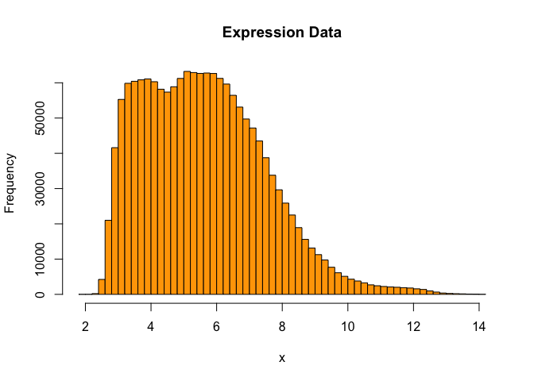
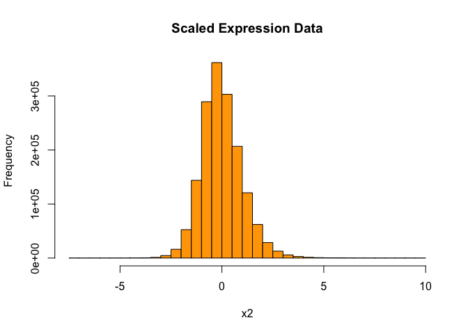

Lecture1
================

- 2025-03-11

### Computing on a data matrix

``` r
gene1 = c(1.00, 1.50, 1.25)
gene1
```

    ## [1] 1.00 1.50 1.25

``` r
gene2 = c(1.35, 1.55, 1.00)
gene3 = c(-1.10, -1.50, -1.25)
gene4 = c(-1.20, -1.30, -1.00)
genes = c(gene1, gene2, gene3, gene4)
genes
```

    ##  [1]  1.00  1.50  1.25  1.35  1.55  1.00 -1.10 -1.50 -1.25 -1.20 -1.30 -1.00

``` r
geneData = matrix(genes, nrow=4, ncol=3, byrow=TRUE) # !byrow!
geneData
```

    ##       [,1]  [,2]  [,3]
    ## [1,]  1.00  1.50  1.25
    ## [2,]  1.35  1.55  1.00
    ## [3,] -1.10 -1.50 -1.25
    ## [4,] -1.20 -1.30 -1.00

``` r
rownames(geneData) = c("gene1", "gene2", "gene3", "gene4")
colnames(geneData) = c("Eric", "Peter", "Anna")
geneData
```

    ##        Eric Peter  Anna
    ## gene1  1.00  1.50  1.25
    ## gene2  1.35  1.55  1.00
    ## gene3 -1.10 -1.50 -1.25
    ## gene4 -1.20 -1.30 -1.00

``` r
# t(geneData)
```

``` r
# data를 받고 제일 처음 해야할 것.
nrow(geneData) # # of gene
```

    ## [1] 4

``` r
ncol(geneData) # # of sample
```

    ## [1] 3

``` r
class(geneData)
```

    ## [1] "matrix" "array"

``` r
geneData[3,] # third row (gene) data
```

    ##  Eric Peter  Anna 
    ## -1.10 -1.50 -1.25

``` r
geneData[c(1,2), ] # first and second row(gene) data
```

    ##       Eric Peter Anna
    ## gene1 1.00  1.50 1.25
    ## gene2 1.35  1.55 1.00

``` r
geneData[c("gene1", "gene2"), ] # can indexing with names
```

    ##       Eric Peter Anna
    ## gene1 1.00  1.50 1.25
    ## gene2 1.35  1.55 1.00

``` r
apply(geneData, 1, mean) # 1 means mean of each row(gene) == row by row
```

    ##     gene1     gene2     gene3     gene4 
    ##  1.250000  1.300000 -1.283333 -1.166667

``` r
apply(geneData, 2, mean) # 2 means mean of each column(sample) == col by col
```

    ##   Eric  Peter   Anna 
    ## 0.0125 0.0625 0.0000

### Constructing a data frame

- Matrix must have same data type init.
- But Data frame do not need it
- 하나의 커럼에서는 똑같은 tpye이 들어가야함.
- 각 행의 열 수 가 같아야함.

``` r
patients.df = data.frame(
  patientID = c("101", "102", "103", "104"),
  treatment = c("drug", "placebo", "drug", "placebo"),
  age = c(20, 30, 24, 22) 
)

patients.df
```

    ##   patientID treatment age
    ## 1       101      drug  20
    ## 2       102   placebo  30
    ## 3       103      drug  24
    ## 4       104   placebo  22

``` r
nrow(patients.df)
```

    ## [1] 4

``` r
ncol(patients.df)
```

    ## [1] 3

``` r
class(patients.df)
```

    ## [1] "data.frame"

### Referencing column vectors in a data frame

``` r
patients.df[, 2]
```

    ## [1] "drug"    "placebo" "drug"    "placebo"

``` r
patients.df[[2]]
```

    ## [1] "drug"    "placebo" "drug"    "placebo"

``` r
patients.df[["treatment"]]
```

    ## [1] "drug"    "placebo" "drug"    "placebo"

``` r
patients.df$treatment # 이걸 제일 많이 사용함
```

    ## [1] "drug"    "placebo" "drug"    "placebo"

``` r
patients.df[, 2]
```

    ## [1] "drug"    "placebo" "drug"    "placebo"

``` r
patients.df[c(1,3), ]
```

    ##   patientID treatment age
    ## 1       101      drug  20
    ## 3       103      drug  24

``` r
patients.df$treatment=="drug"
```

    ## [1]  TRUE FALSE  TRUE FALSE

``` r
patients.df[patients.df$treatment=="drug", ] # [, (모든 열)]
```

    ##   patientID treatment age
    ## 1       101      drug  20
    ## 3       103      drug  24

``` r
subset(patients.df, treatment=="drug")
```

    ##   patientID treatment age
    ## 1       101      drug  20
    ## 3       103      drug  24

``` r
row.names(patients.df) = patients.df$patientID
patients.df[c("101", "103"),]
```

    ##     patientID treatment age
    ## 101       101      drug  20
    ## 103       103      drug  24

``` r
patients.df[2] # series
```

    ##     treatment
    ## 101      drug
    ## 102   placebo
    ## 103      drug
    ## 104   placebo

``` r
patients.df[[2]] # values
```

    ## [1] "drug"    "placebo" "drug"    "placebo"

``` r
patients.df["treatment"]
```

    ##     treatment
    ## 101      drug
    ## 102   placebo
    ## 103      drug
    ## 104   placebo

``` r
patients.df[["treatment"]]
```

    ## [1] "drug"    "placebo" "drug"    "placebo"

### Constructing a list

- list는 매우 자유로움!

``` r
list1 <- list(
  c("p53", "p63", "p73"),
  matrix(rnorm(10), nrow=2),
  c(TRUE, FALSE, TRUE, FALSE, FALSE)
)
list1
```

    ## [[1]]
    ## [1] "p53" "p63" "p73"
    ## 
    ## [[2]]
    ##            [,1]        [,2]         [,3]       [,4]       [,5]
    ## [1,] -1.3387973  0.05390235  0.024540353 -0.8972325  0.4032359
    ## [2,] -0.5221667 -0.27693342 -0.005779396  0.5532961 -1.0253983
    ## 
    ## [[3]]
    ## [1]  TRUE FALSE  TRUE FALSE FALSE

``` r
p53FamilyGenes <- c("p53", "p63", "p73")
list2 <- list(
  genes = p53FamilyGenes,
  geneExpression = matrix(rnorm(10), nrow=2),
  remission = c(TRUE, FALSE, TRUE, FALSE, FALSE)
)
list2
```

    ## $genes
    ## [1] "p53" "p63" "p73"
    ## 
    ## $geneExpression
    ##            [,1]       [,2]       [,3]       [,4]      [,5]
    ## [1,] -0.8249363 -0.1455057  0.0465124 -0.1680225 -0.304108
    ## [2,] -0.7081666 -0.7934742 -1.2374200 -0.6871642  0.844693
    ## 
    ## $remission
    ## [1]  TRUE FALSE  TRUE FALSE FALSE

``` r
list2[1]
```

    ## $genes
    ## [1] "p53" "p63" "p73"

``` r
list2[[1]]
```

    ## [1] "p53" "p63" "p73"

``` r
list2[["genes"]]
```

    ## [1] "p53" "p63" "p73"

``` r
list2$genes
```

    ## [1] "p53" "p63" "p73"

``` r
list2[[1]][1] <- "her2"
list2$genes
```

    ## [1] "her2" "p63"  "p73"

``` r
list2
```

    ## $genes
    ## [1] "her2" "p63"  "p73" 
    ## 
    ## $geneExpression
    ##            [,1]       [,2]       [,3]       [,4]      [,5]
    ## [1,] -0.8249363 -0.1455057  0.0465124 -0.1680225 -0.304108
    ## [2,] -0.7081666 -0.7934742 -1.2374200 -0.6871642  0.844693
    ## 
    ## $remission
    ## [1]  TRUE FALSE  TRUE FALSE FALSE

``` r
list2[[2]]
```

    ##            [,1]       [,2]       [,3]       [,4]      [,5]
    ## [1,] -0.8249363 -0.1455057  0.0465124 -0.1680225 -0.304108
    ## [2,] -0.7081666 -0.7934742 -1.2374200 -0.6871642  0.844693

``` r
list2$geneExpression
```

    ##            [,1]       [,2]       [,3]       [,4]      [,5]
    ## [1,] -0.8249363 -0.1455057  0.0465124 -0.1680225 -0.304108
    ## [2,] -0.7081666 -0.7934742 -1.2374200 -0.6871642  0.844693

``` r
list2[[3]]
```

    ## [1]  TRUE FALSE  TRUE FALSE FALSE

``` r
list2$remission
```

    ## [1]  TRUE FALSE  TRUE FALSE FALSE

### Data path attachment

``` r
# remission # error
attach(list2) # 데이터 이름 생략하기 위해서..!
```

    ## The following object is masked _by_ .GlobalEnv:
    ## 
    ##     genes

``` r
remission
```

    ## [1]  TRUE FALSE  TRUE FALSE FALSE

``` r
detach(list2)
# remission # error
```

``` r
genes <- c("p53", "p63", "p73")
attach(list2)
```

    ## The following object is masked _by_ .GlobalEnv:
    ## 
    ##     genes

``` r
genes # 우선순위는 기존 객체..
```

    ## [1] "p53" "p63" "p73"

``` r
list2$genes
```

    ## [1] "her2" "p63"  "p73"

``` r
patients.df$treatment
```

    ## [1] "drug"    "placebo" "drug"    "placebo"

``` r
attach(patients.df)

treatment
```

    ## [1] "drug"    "placebo" "drug"    "placebo"

``` r
detach(patients.df)
```

### Generating factor

- For plotting and testing of hypo we need to generate a **factor**.

``` r
gl(3, 5) # gl( # of group, # of element of each group) # factor
```

    ##  [1] 1 1 1 1 1 2 2 2 2 2 3 3 3 3 3
    ## Levels: 1 2 3

``` r
rep(1:3, each = 5) # vector
```

    ##  [1] 1 1 1 1 1 2 2 2 2 2 3 3 3 3 3

- factor type은 범주형 자료라 연산 안됨. (확인해보기)

``` r
class(gl(3, 5))
```

    ## [1] "factor"

``` r
class(rep(1:3, each = 5))
```

    ## [1] "integer"

``` r
factor(rep(1:3, each=5)) # same as gl()
```

    ##  [1] 1 1 1 1 1 2 2 2 2 2 3 3 3 3 3
    ## Levels: 1 2 3

``` r
A <- factor(rep(1:3, each = 5))
class(A)
```

    ## [1] "factor"

### Functions

``` r
set.seed(123)

A <- matrix(sample(1:100, 12), nrow=3, ncol=4)

A
```

    ##      [,1] [,2] [,3] [,4]
    ## [1,]   31   14   50   25
    ## [2,]   79   67   43   90
    ## [3,]   51   42   97   69

``` r
apply(A, 2, var)
```

    ## [1]  581.3333  703.0000  862.3333 1100.3333

``` r
fun <- function(x) {
  sum((x-mean(x))^2)/(length(x)-1)
}

apply(A, 2, fun)
```

    ## [1]  581.3333  703.0000  862.3333 1100.3333

``` r
apply(A, 2, function(x) sum((x-mean(x))^2)/(length(x) - 1))
```

    ## [1]  581.3333  703.0000  862.3333 1100.3333

- case : more than one argment

``` r
fun1 <- function(x, a) sum(x-a)^2/(length(x)-1)
apply(A, 2, fun1, a=40)
```

    ## [1]  840.5    4.5 2450.0 2048.0

``` r
fun2 <- function(x, a, b) sum(x - a)^2 / b
apply(A, 2, fun2, a = 40, b = 10)
```

    ## [1] 168.1   0.9 490.0 409.6

``` r
list(a=2, b=3)
```

    ## $a
    ## [1] 2
    ## 
    ## $b
    ## [1] 3

``` r
lapply(list(a=2, b=3), sqrt) # 각각의 원소마다 적용하라..
```

    ## $a
    ## [1] 1.414214
    ## 
    ## $b
    ## [1] 1.732051

``` r
matrix(1:6, 2, 3)
```

    ##      [,1] [,2] [,3]
    ## [1,]    1    3    5
    ## [2,]    2    4    6

``` r
lapply(matrix(1:6, 2, 3), function(x) x^2)
```

    ## [[1]]
    ## [1] 1
    ## 
    ## [[2]]
    ## [1] 4
    ## 
    ## [[3]]
    ## [1] 9
    ## 
    ## [[4]]
    ## [1] 16
    ## 
    ## [[5]]
    ## [1] 25
    ## 
    ## [[6]]
    ## [1] 36

``` r
mylapply <- function(lst, fun) {
  lst <- as.list(lst)
  ans <- vector("list", length(lst))
  names(ans) <- names(lst)
  for(i in 1:length(lst))
    ans[i] <- list(fun(lst[[i]]))
  ans
  }
mylapply(list(a=2, b = 3), sqrt)
```

    ## $a
    ## [1] 1.414214
    ## 
    ## $b
    ## [1] 1.732051

### Introduction to Bioconductor

``` r
#if (!requireNamespace("BiocManager", quietly = TRUE))
#  install.packages("BiocManager")
#BiocManager::install()
```

``` r
#BiocManager::install("ALL")
library(ALL)
```

    ## Loading required package: Biobase

    ## Loading required package: BiocGenerics

    ## 
    ## Attaching package: 'BiocGenerics'

    ## The following objects are masked from 'package:stats':
    ## 
    ##     IQR, mad, sd, var, xtabs

    ## The following objects are masked from 'package:base':
    ## 
    ##     anyDuplicated, aperm, append, as.data.frame, basename, cbind,
    ##     colnames, dirname, do.call, duplicated, eval, evalq, Filter, Find,
    ##     get, grep, grepl, intersect, is.unsorted, lapply, Map, mapply,
    ##     match, mget, order, paste, pmax, pmax.int, pmin, pmin.int,
    ##     Position, rank, rbind, Reduce, rownames, sapply, saveRDS, setdiff,
    ##     table, tapply, union, unique, unsplit, which.max, which.min

    ## Welcome to Bioconductor
    ## 
    ##     Vignettes contain introductory material; view with
    ##     'browseVignettes()'. To cite Bioconductor, see
    ##     'citation("Biobase")', and for packages 'citation("pkgname")'.

``` r
data(ALL)
#?ALL
ALL
```

    ## ExpressionSet (storageMode: lockedEnvironment)
    ## assayData: 12625 features, 128 samples 
    ##   element names: exprs 
    ## protocolData: none
    ## phenoData
    ##   sampleNames: 01005 01010 ... LAL4 (128 total)
    ##   varLabels: cod diagnosis ... date last seen (21 total)
    ##   varMetadata: labelDescription
    ## featureData: none
    ## experimentData: use 'experimentData(object)'
    ##   pubMedIds: 14684422 16243790 
    ## Annotation: hgu95av2

``` r
str(ALL)
```

    ## Formal class 'ExpressionSet' [package "Biobase"] with 7 slots
    ##   ..@ experimentData   :Formal class 'MIAME' [package "Biobase"] with 13 slots
    ##   .. .. ..@ name             : chr "Chiaretti et al."
    ##   .. .. ..@ lab              : chr "Department of Medical Oncology, Dana-Farber Cancer Institute, Department of Medicine, Brigham and Women's Hospi"| __truncated__
    ##   .. .. ..@ contact          : chr ""
    ##   .. .. ..@ title            : chr "Gene expression profile of adult T-cell acute lymphocytic leukemia identifies distinct subsets of patients with"| __truncated__
    ##   .. .. ..@ abstract         : chr "Gene expression profiles were examined in 33 adult patients with T-cell acute lymphocytic leukemia (T-ALL). Non"| __truncated__
    ##   .. .. ..@ url              : chr ""
    ##   .. .. ..@ pubMedIds        : chr [1:2] "14684422" "16243790"
    ##   .. .. ..@ samples          : list()
    ##   .. .. ..@ hybridizations   : list()
    ##   .. .. ..@ normControls     : list()
    ##   .. .. ..@ preprocessing    : list()
    ##   .. .. ..@ other            : list()
    ##   .. .. ..@ .__classVersion__:Formal class 'Versions' [package "Biobase"] with 1 slot
    ##   .. .. .. .. ..@ .Data:List of 1
    ##   .. .. .. .. .. ..$ : int [1:3] 1 0 0
    ##   .. .. .. .. ..$ names: chr "MIAME"
    ##   ..@ assayData        :<environment: 0x125e3bb38> 
    ##   ..@ phenoData        :Formal class 'AnnotatedDataFrame' [package "Biobase"] with 4 slots
    ##   .. .. ..@ varMetadata      :'data.frame':  21 obs. of  1 variable:
    ##   .. .. .. ..$ labelDescription: chr [1:21] " Patient ID" " Date of diagnosis" " Gender of the patient" " Age of the patient at entry" ...
    ##   .. .. ..@ data             :'data.frame':  128 obs. of  21 variables:
    ##   .. .. .. ..$ cod           : chr [1:128] "1005" "1010" "3002" "4006" ...
    ##   .. .. .. ..$ diagnosis     : chr [1:128] "5/21/1997" "3/29/2000" "6/24/1998" "7/17/1997" ...
    ##   .. .. .. ..$ sex           : Factor w/ 2 levels "F","M": 2 2 1 2 2 2 1 2 2 2 ...
    ##   .. .. .. ..$ age           : int [1:128] 53 19 52 38 57 17 18 16 15 40 ...
    ##   .. .. .. ..$ BT            : Factor w/ 10 levels "B","B1","B2",..: 3 3 5 2 3 2 2 2 3 3 ...
    ##   .. .. .. ..$ remission     : Factor w/ 2 levels "CR","REF": 1 1 1 1 1 1 1 1 1 1 ...
    ##   .. .. .. ..$ CR            : chr [1:128] "CR" "CR" "CR" "CR" ...
    ##   .. .. .. ..$ date.cr       : chr [1:128] "8/6/1997" "6/27/2000" "8/17/1998" "9/8/1997" ...
    ##   .. .. .. ..$ t(4;11)       : logi [1:128] FALSE FALSE NA TRUE FALSE FALSE ...
    ##   .. .. .. ..$ t(9;22)       : logi [1:128] TRUE FALSE NA FALSE FALSE FALSE ...
    ##   .. .. .. ..$ cyto.normal   : logi [1:128] FALSE FALSE NA FALSE FALSE FALSE ...
    ##   .. .. .. ..$ citog         : chr [1:128] "t(9;22)" "simple alt." NA "t(4;11)" ...
    ##   .. .. .. ..$ mol.biol      : Factor w/ 6 levels "ALL1/AF4","BCR/ABL",..: 2 4 2 1 4 4 4 4 4 2 ...
    ##   .. .. .. ..$ fusion protein: Factor w/ 3 levels "p190","p190/p210",..: 3 NA 1 NA NA NA NA NA NA 1 ...
    ##   .. .. .. ..$ mdr           : Factor w/ 2 levels "NEG","POS": 1 2 1 1 1 1 2 1 1 1 ...
    ##   .. .. .. ..$ kinet         : Factor w/ 2 levels "dyploid","hyperd.": 1 1 1 1 1 2 2 1 1 NA ...
    ##   .. .. .. ..$ ccr           : logi [1:128] FALSE FALSE FALSE FALSE FALSE FALSE ...
    ##   .. .. .. ..$ relapse       : logi [1:128] FALSE TRUE TRUE TRUE TRUE TRUE ...
    ##   .. .. .. ..$ transplant    : logi [1:128] TRUE FALSE FALSE FALSE FALSE FALSE ...
    ##   .. .. .. ..$ f.u           : chr [1:128] "BMT / DEATH IN CR" "REL" "REL" "REL" ...
    ##   .. .. .. ..$ date last seen: chr [1:128] NA "8/28/2000" "10/15/1999" "1/23/1998" ...
    ##   .. .. ..@ dimLabels        : chr [1:2] "sampleNames" "sampleColumns"
    ##   .. .. ..@ .__classVersion__:Formal class 'Versions' [package "Biobase"] with 1 slot
    ##   .. .. .. .. ..@ .Data:List of 1
    ##   .. .. .. .. .. ..$ : int [1:3] 1 1 0
    ##   .. .. .. .. ..$ names: chr "AnnotatedDataFrame"
    ##   ..@ featureData      :Formal class 'AnnotatedDataFrame' [package "Biobase"] with 4 slots
    ##   .. .. ..@ varMetadata      :'data.frame':  0 obs. of  1 variable:
    ##   .. .. .. ..$ labelDescription: logi(0) 
    ##   .. .. ..@ data             :'data.frame':  12625 obs. of  0 variables
    ##   .. .. ..@ dimLabels        : chr [1:2] "featureNames" "featureColumns"
    ##   .. .. ..@ .__classVersion__:Formal class 'Versions' [package "Biobase"] with 1 slot
    ##   .. .. .. .. ..@ .Data:List of 1
    ##   .. .. .. .. .. ..$ : int [1:3] 1 1 0
    ##   .. .. .. .. ..$ names: chr "AnnotatedDataFrame"
    ##   ..@ annotation       : chr "hgu95av2"
    ##   ..@ protocolData     :Formal class 'AnnotatedDataFrame' [package "Biobase"] with 4 slots
    ##   .. .. ..@ varMetadata      :'data.frame':  0 obs. of  1 variable:
    ##   .. .. .. ..$ labelDescription: chr(0) 
    ##   .. .. ..@ data             :'data.frame':  128 obs. of  0 variables
    ##   .. .. ..@ dimLabels        : chr [1:2] "sampleNames" "sampleColumns"
    ##   .. .. ..@ .__classVersion__:Formal class 'Versions' [package "Biobase"] with 1 slot
    ##   .. .. .. .. ..@ .Data:List of 1
    ##   .. .. .. .. .. ..$ : int [1:3] 1 1 0
    ##   .. .. .. .. ..$ names: chr "AnnotatedDataFrame"
    ##   ..@ .__classVersion__:Formal class 'Versions' [package "Biobase"] with 1 slot
    ##   .. .. ..@ .Data:List of 4
    ##   .. .. .. ..$ : int [1:3] 2 10 0
    ##   .. .. .. ..$ : int [1:3] 2 5 5
    ##   .. .. .. ..$ : int [1:3] 1 3 0
    ##   .. .. .. ..$ : int [1:3] 1 0 0
    ##   .. .. ..$ names: chr [1:4] "R" "Biobase" "eSet" "ExpressionSet"

``` r
class(ALL)
```

    ## [1] "ExpressionSet"
    ## attr(,"package")
    ## [1] "Biobase"

``` r
experimentData(ALL)
```

    ## Experiment data
    ##   Experimenter name: Chiaretti et al. 
    ##   Laboratory: Department of Medical Oncology, Dana-Farber Cancer Institute, Department of Medicine, Brigham and Women's Hospital, Harvard Medical School, Boston, MA 02115, USA. 
    ##   Contact information:  
    ##   Title: Gene expression profile of adult T-cell acute lymphocytic leukemia identifies distinct subsets of patients with different response to therapy and survival. 
    ##   URL:  
    ##   PMIDs: 14684422 16243790 
    ## 
    ##   Abstract: A 187 word abstract is available. Use 'abstract' method.

``` r
#sampleNames(ALL)
#featureNames(ALL)
```

``` r
dim(exprs(ALL))
```

    ## [1] 12625   128

``` r
exprs(ALL)[1:10, 1:5]
```

    ##              01005     01010    03002    04006    04007
    ## 1000_at   7.597323  7.479445 7.567593 7.384684 7.905312
    ## 1001_at   5.046194  4.932537 4.799294 4.922627 4.844565
    ## 1002_f_at 3.900466  4.208155 3.886169 4.206798 3.416923
    ## 1003_s_at 5.903856  6.169024 5.860459 6.116890 5.687997
    ## 1004_at   5.925260  5.912780 5.893209 6.170245 5.615210
    ## 1005_at   8.570990 10.428299 9.616713 9.937155 9.983809
    ## 1006_at   3.656143  3.853979 3.646808 3.874289 3.547361
    ## 1007_s_at 7.623562  7.543604 7.916954 6.816397 7.516981
    ## 1008_f_at 8.903547  9.903953 8.494499 9.533983 8.871669
    ## 1009_at   9.371888  9.322177 9.304982 9.135370 9.627175

``` r
varLabels(ALL)
```

    ##  [1] "cod"            "diagnosis"      "sex"            "age"           
    ##  [5] "BT"             "remission"      "CR"             "date.cr"       
    ##  [9] "t(4;11)"        "t(9;22)"        "cyto.normal"    "citog"         
    ## [13] "mol.biol"       "fusion protein" "mdr"            "kinet"         
    ## [17] "ccr"            "relapse"        "transplant"     "f.u"           
    ## [21] "date last seen"

``` r
ALL$sex
```

    ##   [1] M    M    F    M    M    M    F    M    M    M    M    M    M    M    M   
    ##  [16] F    M    M    M    F    M    M    M    M    M    M    F    F    F    F   
    ##  [31] F    F    M    M    F    F    F    F    F    M    F    M    F    M    <NA>
    ##  [46] M    F    M    F    F    F    M    M    M    M    F    M    F    M    F   
    ##  [61] M    M    F    M    M    M    M    M    M    M    F    M    M    F    F   
    ##  [76] M    M    M    F    M    M    M    F    F    F    M    M    M    M    F   
    ##  [91] M    M    F    M    <NA> M    F    F    M    F    M    M    M    M    M   
    ## [106] M    F    F    M    F    M    M    M    F    M    M    F    M    M    M   
    ## [121] M    M    M    M    M    M    M    <NA>
    ## Levels: F M

``` r
ALL$age
```

    ##   [1] 53 19 52 38 57 17 18 16 15 40 33 55  5 18 41 27 27 46 37 36 53 39 53 20 44
    ##  [26] 28 58 43 48 58 19 26 19 32 17 45 20 16 51 57 29 16 32 15 NA 21 49 38 17 26
    ##  [51] 48 16 18 17 22 47 21 54 26 19 47 18 52 27 52 18 18 23 16 NA 54 25 31 19 24
    ##  [76] 23 NA 41 37 54 18 19 43 53 50 54 53 49 20 26 22 36 27 50 NA 31 16 48 17 40
    ## [101] 22 30 18 22 50 41 40 28 25 16 31 14 24 19 37 23 30 48 22 41 52 32 24 37 19
    ## [126] 30 29 NA

``` r
ALL$mol.biol
```

    ##   [1] BCR/ABL  NEG      BCR/ABL  ALL1/AF4 NEG      NEG      NEG      NEG     
    ##   [9] NEG      BCR/ABL  BCR/ABL  NEG      E2A/PBX1 NEG      BCR/ABL  NEG     
    ##  [17] BCR/ABL  BCR/ABL  BCR/ABL  BCR/ABL  NEG      BCR/ABL  BCR/ABL  NEG     
    ##  [25] ALL1/AF4 BCR/ABL  ALL1/AF4 NEG      ALL1/AF4 BCR/ABL  NEG      BCR/ABL 
    ##  [33] NEG      BCR/ABL  BCR/ABL  ALL1/AF4 NEG      BCR/ABL  BCR/ABL  BCR/ABL 
    ##  [41] NEG      E2A/PBX1 BCR/ABL  NEG      NEG      NEG      BCR/ABL  p15/p16 
    ##  [49] ALL1/AF4 BCR/ABL  BCR/ABL  NEG      E2A/PBX1 NEG      NEG      NEG     
    ##  [57] BCR/ABL  BCR/ABL  NEG      NEG      ALL1/AF4 NEG      ALL1/AF4 NEG     
    ##  [65] BCR/ABL  NEG      NEG      NEG      NEG      NEG      BCR/ABL  ALL1/AF4
    ##  [73] BCR/ABL  NEG      E2A/PBX1 NEG      BCR/ABL  BCR/ABL  NEG      NEG     
    ##  [81] NEG      NEG      BCR/ABL  NEG      BCR/ABL  BCR/ABL  BCR/ABL  ALL1/AF4
    ##  [89] NEG      NEG      BCR/ABL  NEG      BCR/ABL  BCR/ABL  E2A/PBX1 NEG     
    ##  [97] NUP-98   NEG      NEG      NEG      NEG      NEG      NEG      NEG     
    ## [105] NEG      NEG      NEG      NEG      NEG      NEG      NEG      NEG     
    ## [113] NEG      NEG      NEG      NEG      NEG      NEG      NEG      NEG     
    ## [121] NEG      NEG      NEG      NEG      NEG      NEG      NEG      NEG     
    ## Levels: ALL1/AF4 BCR/ABL E2A/PBX1 NEG NUP-98 p15/p16

### ALL Data Example

``` r
ALL$BT
```

    ##   [1] B2 B2 B4 B1 B2 B1 B1 B1 B2 B2 B3 B3 B3 B2 B3 B  B2 B3 B2 B3 B2 B2 B2 B1 B1
    ##  [26] B2 B1 B2 B1 B2 B  B  B2 B2 B2 B1 B2 B2 B2 B2 B2 B4 B4 B2 B2 B2 B4 B2 B1 B2
    ##  [51] B2 B3 B4 B3 B3 B3 B4 B3 B3 B1 B1 B1 B1 B3 B3 B3 B3 B3 B3 B3 B3 B1 B3 B1 B4
    ##  [76] B2 B2 B1 B3 B4 B4 B2 B2 B3 B4 B4 B4 B1 B2 B2 B2 B1 B2 B  B  T  T3 T2 T2 T3
    ## [101] T2 T  T4 T2 T3 T3 T  T2 T3 T2 T2 T2 T1 T4 T  T2 T3 T2 T2 T2 T2 T3 T3 T3 T2
    ## [126] T3 T2 T 
    ## Levels: B B1 B2 B3 B4 T T1 T2 T3 T4

``` r
table(ALL$BT)
```

    ## 
    ##  B B1 B2 B3 B4  T T1 T2 T3 T4 
    ##  5 19 36 23 12  5  1 15 10  2

``` r
BT <- ALL$BT %in% c("T", "T1", "T2", "T3", "T4")
y <- factor(as.numeric(BT), labels=c("B", "T")) # logical로 처리
table(y)
```

    ## y
    ##  B  T 
    ## 95 33

``` r
x <- t(exprs(ALL))
dim(x)
```

    ## [1]   128 12625

``` r
summary(as.numeric(x)) # 이거 체크 vs summary(x)
```

    ##    Min. 1st Qu.  Median    Mean 3rd Qu.    Max. 
    ##   1.985   4.130   5.469   5.625   6.827  14.127

``` r
hist(x, col="orange", nclass=50, main="Expression Data")
```

<!-- -->

- scaling 할 때 행은 sample 열은 variable로 설정하기!!!!!!!

``` r
x2 <- scale(x)
dim(x2)
```

    ## [1]   128 12625

``` r
summary(as.numeric(x2))
```

    ##     Min.  1st Qu.   Median     Mean  3rd Qu.     Max. 
    ## -7.12853 -0.65463 -0.08759  0.00000  0.57845  9.73045

``` r
hist(x2, col="orange", nclass=50, main="Scaled Expression Data")
```

<!-- -->
