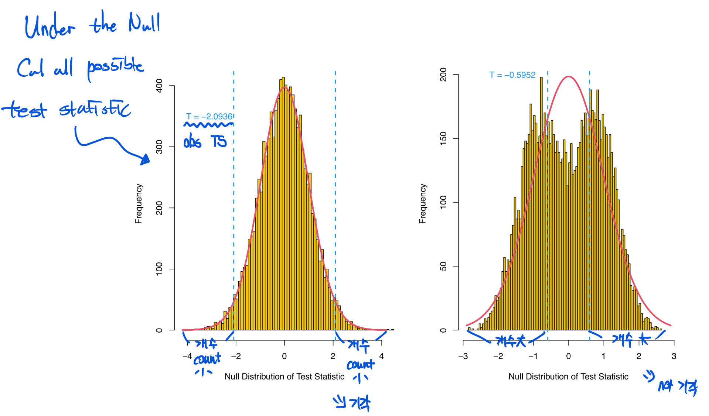
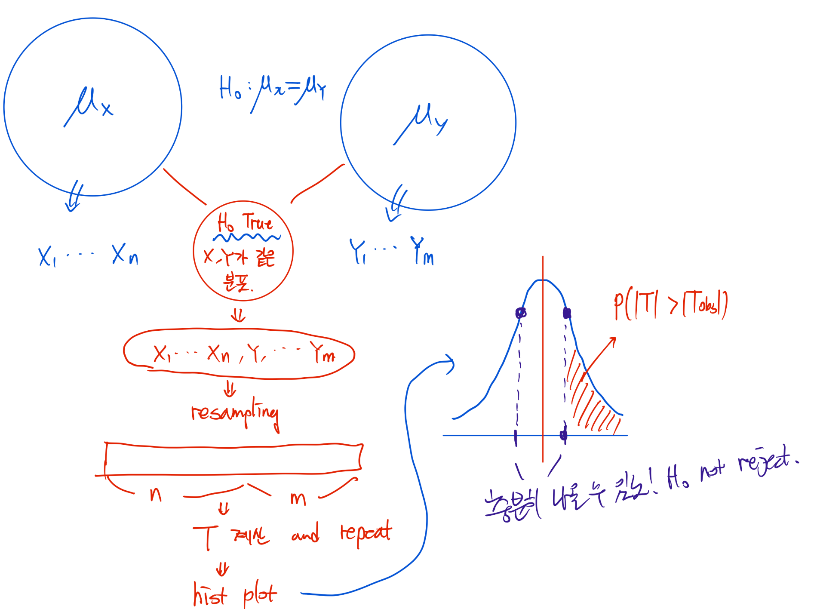

### Required Packages

```{r}
#if (!requireNamespace("BiocManager", quietly = TRUE))
#install.packages("BiocManager")
#BiocManager::install("multtest")
#install.packages("nortest")
#install.packages("car")
#install.packages("outliers")
#install.packages("ape")
#install.packages("SNPassoc")
#install.packages("genetics")
```

### Statistical Hypothesis Testing

-   Sample data 만든 후 그 data에서 **sample statistic** 계산 조진다.
-   그 다음 우리는 **Null huypothesis**가 **true**라 가정한다잉!
-   그 다음 $H_0$의 distribution에서 sample statistic의 위치(?)를 본다.
-   우리는 지금 $H_0$가 true라고 가정을 했기 때문에 sample data에서 나온 ST가 $H_0$의 distribution에 잘 맞아야한다.
-   여기서 잘 맞아야한다라는 뜻은 그 ST가 터무니 없는 확률로 나온다면 안된다는 뜻이다.
-   이때 그 확률을 우리는 **p-value**라고 한다.
-   그리고 우리는 $H_0$가 true일떄 $H_0$를 reject할 허용 오차를 significance level $\alpha$라고 한다.

> p-value가 0.05일 때, 만약 $H_0$가 True일 때 관측된 결과(ST)가 우연히 나타날 확률이 50%이다! 라는 느낌! 즉 $\alpha = 0.05$는 내가 관측한 값이 우연히 나타날 확률이 0.05 보단 작아선 안된다! 라는 threshold를 setting 한 느낌!

-   핵심은 sample statistic의 distribution을 알아야 한다!!!

### The Z-test

-   현실에선 쓸 일 없음 ㅋㅋㅋㅋㅋ

-   왜? 모표준편차를 어케아노..

-   Under the Null

$$
 H_0: \mu = 0 \quad \text{vs} \quad H_1: \mu \neq 0
$$

```{r}
library(multtest)
library(nortest)
library(car)
library(outliers)
library(ape)
library(SNPassoc)
library(genetics)
```

```{r}
library(multtest)

data(golub, package = "multtest")

golubFactor <- factor(golub.cl, levels=0:1, labels=c("ALL","AML"))
  
x <- golub[2058, golubFactor=="ALL"]

n <- length(x)

sigma <- 0.25; mu0 <- 0
z.value <- sqrt(n)*(mean(x) - mu0)/sigma

2*pnorm(-abs(z.value)) # p-value
```

```{r}
f <- function(x) dnorm(x,0,1)
alpha <- 0.05
qz <- qnorm(1-alpha/2)
x1 <- seq(-4, -qz, 0.01); y1 <- dnorm(x1, 0, 1)
x2 <- seq(-qz, qz, 0.01); y2 <- dnorm(x2, 0, 1)
x3 <- seq(qz, 4, 0.01); y3 <- dnorm(x3, 0, 1)
plot(f, -4, 4, cex.lab=1.5, xlab="x", ylab="f(x)",
main="Normal probability density function f(x)")
polygon(c(-4, x1, -qz), c(0, y1, 0), col="red")
polygon(c(-qz, x2, qz), c(0, y2, 0), col="lightblue")
polygon(c(qz, x3, 4), c(0, y3, 0), col="red")
arrows(-3, 0.15, -3, 0.03)
text(-3, 0.23, "Rejection")
text(-3, 0.20, "Region")
text(-3, 0.17, expression(alpha/2))
arrows(3, 0.15, 3, 0.03)
text(3, 0.23, "Rejection")
text(3, 0.20, "Region")
text(3, 0.17, expression(alpha/2))
text(0, 0.23, "Acceptance")
text(0, 0.20, "Region")
```

#### Confidence Interval

-   If we were to repeat the procedure thousands of times, we are 95% certain that the true mean falls in the confidence interval -\> 이게 핵심!

```{r}
mean(x) + qnorm(0.025) * sigma/sqrt(n)
mean(x) + qnorm(0.975) * sigma/sqrt(n)
mean(x) + c(-1, 1) * qnorm(0.975) * sigma / sqrt(n)
```

### One sample T-test

-   모집단의 분산(표준편차)을 모르고, 표본이 **정규성을 만족한다고 가정**할 때 사용한다.
-   이때 검정 통계량은 t 분포를 따르고 t분포는 degree of freedom에 따라 모양이 달라진다.
-   모집단의 분산 대신 표본의 구한 표본분산을 이용하기 때문에 정규분포가 아닌 t 분포를 따르게 된다.(자세한 증명은 수통 때)

```{r}
f <- function(x) dt(x, 5)
alpha <- 0.05
qt5 <- qt(1-alpha/2, 5)
x1 <- seq(-4, -qt5, 0.01)
y1 <- f(x1)
x2 <- seq(-qt5, qt5, 0.01)
y2 <- f(x2)
x3 <- seq(qt5, 4, 0.01)
y3 <- f(x3)
plot(f, -4, 4, xlab="x", ylab="f(x)",
main="T-distribution probability density function f(x)")
polygon(c(-4, x1, -qt5), c(0, y1 , 0), col="red")
polygon(c(-qt5, x2, qt5), c(0, y2, 0), col="lightblue")
polygon(c(qt5, x3, 4), c(0, y3, 0), col = "red")

arrows(-3, 0.15, -3, 0.03)
text(-3, 0.23, "Rejection")
text(-3, 0.20, "Region")
text(-3, 0.17, expression(alpha/2))
arrows(3, 0.15, 3, 0.03)
text(3, 0.23, "Rejection")
text(3, 0.20, "Region")
text(3, 0.17, expression(alpha/2))
text(0, 0.23, "Acceptance")
text(0, 0.20, "Region")
mtext(expression(t[0.025]), side=1, at=-qt5, col="red")
mtext(expression(t[0.975]), side=1, at=qt5, col="red")
```

#### R에서 분포와 관련된 함수 정리

```{r}
#' d : 확률밀도함수
#' 특정 분포의 확률밀도값 또는 확률질량값을 계산
dnorm(0, mean = 0, sd = 1)

#' p : 누적분포함수
#' 특정 분포에서 어떤 값 q 이하가 나올 확률을 계산
pnorm(0, mean = 0, sd = 1)

#' q : 분위수함수
#' 누적분포함수의 반대 개념으로, 누적확률 p에 해당하는 값을 계산
qnorm(0.975, mean = 0, sd = 1)
qnorm(0.5, mean = 0, sd = 1)

#' r : 난수생성
#' 특정 분포를 따르는 난수를 n개 생성하여 벡터로 반환
rnorm(10, mean = 0, sd = 1)

```

```{r}
x <- golub[2058, golubFactor=="ALL"]

mu0 <- 0

n <- 27

t.value <- sqrt(n)*(mean(x) - mu0)/sd(x)

t.value

qt(0.975, 26)

2 * pt(-abs(t.value), 26) # p-value

alpha <- 0.05

mean(x) + c(qt(alpha/2, n-1), qt(1-alpha/2, n-1)) * sd(x)/sqrt(n)
```

#### One Sample T-test를 위한 R function : `t.test(data= , mu= , alternative = )`

```{r}
t.test(x, mu=0) # default two side test
```

$$
H_1: \mu > 0
$$

```{r}
#' mu를 기준으로 p-v는 오른쪽 부분 싸악 
t.test(x, mu=0, alternative = "greater") # one side test
```

$$
H_1: \mu < 0
$$

```{r}
#' mu를 기준으로 p-v는 왼쪽 부분 싸악 
t.test(x, mu=0, alternative = "less") # one side test
```

#### Example of One sample T-test

-   Using a box-and-whiskers plot and a side-by-side plot, we can investigate the range of the ALL and AML gene expression values of CCND3 (CyclinD3), which are collected in row 1042 of the data matrix golub.

> 그니깐 CCND3 gene에서 ALL vs AML을 하자.

```{r}
# gred()으로 CCND3 gene의 index 찾기
ccnd3 <- grep("CCND3", golub.gnames[,2], ignore.case=TRUE) 
ccnd3

par(mfrow=c(1,2)) 
stripchart(golub[ccnd3,] ~ golubFactor, method="jitter", cex.lab=1.5, ylab="", vertical = TRUE, col=c("red", "darkgreen"), xlab="Leukemia subtype")

boxplot(golub[ccnd3,] ~ golubFactor, cex.lab=1.5, main=NULL, xlab="Leukemia subtype", col=c("purple","green"), ylab="CCND3 (Cyclin D3) Expression")
```

```{r}
ALL <- golubFactor=="ALL" 

#' CCND3 gene에서 ALL로 검정을 하자..
#' H_0 = mu에 대한 가설검정 
t.test(golub[ccnd3, ALL], mu=0) 
```

-   t = 20.06 존나 큰 값 -\> 무조건 기각 즉! ALL의 평균 값이 0이 아니다라고 할 수 있다.

```{r}
t.test(golub[ccnd3, !ALL], mu=0)
```

-   0.004이라서 기각이긴한데 살짝 부족함.

```{r}
t.test(golub[ccnd3, ALL], mu=0, alternative="greater")
```

```{r}
t.test(golub[ccnd3, !ALL], mu=0, alternative="greater") # two side랑 p-v만 다르다.
```

```{r}
t.test(golub[ccnd3, !ALL], mu=0, alternative="less")
t.test(golub[ccnd3, ALL], mu=0, alternative="less")
```

### Two Sample T-test with Unequal Variances(welch's t-test)

-   두 그룹의 평균을 비교할 때 사용한다.
-   Two Sample T test를 진행하기 위해선
    1.  각 그룹 샘플에 대한 정규성 검정 실시
    2.  Equal variance에 대한 검정 실시
    3.  분산이 같다면 pooled t-test를 실시
    4.  같지 않다면 welch's t-test를 실시(general version)
    5.  그 다음 상황에 맞는 t test를 진행한다.

```{r}
ccnd3 <- grep("CCND3", golub.gnames[,2], ignore.case=TRUE) 
ccnd3

par(mfrow=c(1,2)) 
stripchart(golub[ccnd3,] ~ golubFactor, method="jitter", cex.lab=1.5, ylab="", vertical = TRUE, col=c("red", "darkgreen"), xlab="Leukemia subtype")

boxplot(golub[ccnd3,] ~ golubFactor, cex.lab=1.5, main=NULL, xlab="Leukemia subtype", col=c("purple","green"), ylab="CCND3 (Cyclin D3) Expression")
```

```{r}
data.frame(golub[ccnd3,], y =golubFactor)
```

#### R Function for Unequal Variances in two sample t-test : t.test(data \~ groupfactor, var.equal = FALSE)

```{r}
t.test(golub[ccnd3,] ~ golubFactor, var.equal=FALSE) # result = > 두 집단은 다르다~
```

-   From the result, we can say that the data provide strong evidence that the population means do differ.

```{r}
t.test(golub[ccnd3,] ~ golubFactor, var.equal=FALSE, alternative="greater")
t.test(golub[ccnd3,] ~ golubFactor, var.equal=FALSE, alternative="less")
```

### Two Sample T-test with Equal Variances

-   두 집단의 분산에 대한 검정 결과로 $H_0$를 기각하지 못하면 즉, 두 집단의 분산이 같으면 **pooled sample variance**를 이용한 **pooled t-test**를 실시.

#### \`t.test(data \~ groupFactor, var.equal=TRUE)

```{r}
t.test(golub[ccnd3,] ~ golubFactor, var.equal=TRUE)
```

### Test for Equal Variances

-   F 분포로 조지는 놈!

```{r}
ccnd3 <- grep("CCND3", golub.gnames[,2], ignore.case=TRUE) 
zyxin <- grep("Zyxin", golub.gnames[,2], ignore.case=TRUE)
```

```{r}
# 각 그룹별 분산의 차이 
#' tapply 안에는 벡터나 배열 자료형이 들어간다.
tapply(golub[ccnd3,], golubFactor, var) 
tapply(golub[zyxin,], golubFactor, var)
```

#### R function for variance test : `var.test(data~groupFactor)`

```{r}
var.test(golub[ccnd3, ] ~ golubFactor) # 두 그룹의 분산이 같다고 할 수 있다->pooled 이용
var.test(golub[zyxin, ] ~ golubFactor) # 두 그룹의 부산이 같다고 할 수 없다->pooled 못 쓴다.. welch's 이용
```

-   분산에 대한 검정은 F검정 말고도 여러 종류가 있다! 참고!!

```{r}
bartlett.test(golub[ccnd3,] ~ golubFactor) 
bartlett.test(golub[zyxin,] ~ golubFactor)
```

```{r}
fligner.test(golub[ccnd3,], golubFactor) 
fligner.test(golub[zyxin,], golubFactor)
```

```{r}
library(car) 
leveneTest(golub[ccnd3,], golubFactor) 
leveneTest(golub[zyxin,], golubFactor)
```

### Histogram and Q-Q plot(정규성 검정)

-   Various procedures are available **to test the hypothesis that a dataset is normally distributed**. Many statistical tests including T-test and F-test require normality assumption.

```{r}
# histogram
par(mfrow=c(1,2)) 
hist(golub[ccnd3, golubFactor=="ALL"], cex.lab=1.5, col="orange",nclass=20, main=NULL, xlab="CCND3 (Cyclin D3) Expression") 
hist(golub[zyxin, golubFactor=="ALL"], cex.lab=1.5, col="orange",nclass=20, main=NULL, xlab="Zyxin Expression")
```

#### R function for q-q ploting : `qqnorm() & qqpline()`

```{r}
# q-q plot
par(mfrow=c(1,2)) 
qqnorm(golub[ccnd3, golubFactor=="ALL"], pch=19, cex.lab=1.5, col="red", main=NULL) 
qqline(golub[ccnd3, golubFactor=="ALL"]) 

qqnorm(golub[zyxin, golubFactor=="ALL"], pch=19, cex.lab=1.5,col="red", main=NULL) 
qqline(golub[zyxin, golubFactor=="ALL"])
```

### Normality Tests

$$
H_0 : \text{정규성을 따른다..!}
$$

-   Normality Tests는 각 집단 별로 다해야한다!!! -\> 베리 중요

#### R function for Normality Test

```{r}
shapiro.test(golub[ccnd3, golubFactor=="ALL"]) 
shapiro.test(golub[ccnd3, golubFactor=="AML"]) 
shapiro.test(golub[zyxin, golubFactor=="ALL"]) # reject H_0
shapiro.test(golub[zyxin, golubFactor=="AML"]) 
```

```{r}
library(nortest) 
ad.test(golub[ccnd3, golubFactor=="ALL"]) 
ad.test(golub[zyxin, golubFactor=="ALL"])
```

### Outliers Test

-   gene expression values가 not normally distributed 할 때 outlier들이 있을 확률이 매우 높다.

$$
H_0 : \text{Does not contain an outlier}
$$

-   이상치 검정을 위해 Grubbs test를 진행!

```{r}
library(outliers)
grubbs.test(golub[ccnd3, golubFactor=="ALL"])
grubbs.test(golub[zyxin, golubFactor=="ALL"])
```

-   이상값이 있거나 분포가 크게 왜곡된 경우, 순위 기반(비모수) 검정, 강건추정(robust estimation) 기법 등이 대안

### Binomial Test

-   **이항분포 기반 가설검정**은 특정 사건이 일어날 확률 $p$가 이론적으로 가정된 값 $p_0$와 같은지를 통계적으로 검정
-   예 : 어떤 microRNA 서열에서 퓨린이 나타날 확률을 $p_0$라고 가정하고, **실제로 관측된** 퓨린 비율이 $p_0$와 다른지 판단.

> 어떤 연구에서 길이 22nt의 microRNA가 있다고 하자. 이 microRNA 서열에서 퓨린이 **실제로 18개** 관측되었다. 나는 "이 microRNA에서 퓨린이 나타날 확률이 $p_0 = 0.7$ 이상일 것이다!" 라는 가설을 세웠다.

$$
H_0 : p = 0.7
$$

$$
H_1 : p \gt 0.7
$$

> 그럼 p-value는 다음과 같이 계산된다.

$$
p\text{-value} \;=\; P(X \ge 18)
\;=\; \sum_{x=18}^{22} \binom{22}{x} \,(0.7)^{x} \,(0.3)^{22 - x}
$$

> 등호 넣는게 매우 중요하다..!

```{r}
sum(dbinom(18:22, 22, 0.7)) # d => pdf value
1 - pbinom(17, 22, 0.7) # p => cdf
```

#### R function for binomtest : `binon.test()`

```{r}
binom.test(18, 22, p=0.7, alternative="greater", conf.level=0.95)
```

### Chi-squared Test

-   카이제곱 검정은 **범주형 자료의 빈도분포**가 특정 이론적 분포와 일치하는지, 혹인 범주형 변수들이 서로 독립적인지를 평가하기 위한 검정 방법이다.

1.  적합도 검정

-   표본에서 관측된 범주별 빈도 분포가, 연구자가 가정한 분포와 같은지를 검정
-   예: A, C, G, T가 동일 확률(각 1/4)로 나타나는지 여부 확인

$$
H_0 : (\pi_1,...,\pi_m) = (p_1,...,p_m)
$$

2.  독립성 검정

-   두 범주형 변수가 서로 독립인지를 검정

-   질병 유전자형과 임상 그룹이 독립인지, 혹은 연관이 있는지

-   기본 아이디어

1.  관측도수(Observed count) : $o_i$

-   범주 $i$에서 **실제로 관측된 빈도**(개수)

2.  기대도수(Expected count) : $e_i$

-   귀무가설이 참일 때, 범주 $i$에서 기대되는 또는 이론적으로 예측되는 빈도
-   예를 들어, 총 표본 크기를 $n$이라 하고, 각 범주에 대한 가정 확률(이론 확률 $p_0$ 느낌)을 $p_1,..,p_m$이라 한다면,

$$
e_i = np_i
$$

3.검정방법

-   카이제곱 검정통계량을 구하고 $q$ 해당하는 p=value가 유의수준보다 작으면 귀무가설을 기각.

```{r}
library(ape) 
obs <- table(read.GenBank(c("X94991.1"),as.character=TRUE)) 
obs
```

```{r}
e <- rep(sum(obs)/4, 4) # n(전체 수) * 1/4 (p_i)
e
```

```{r}
test <- sum((obs-e)^2/e) 
test
```

```{r}
1-pchisq(test, 3) 
qchisq(0.95, 3)
```

```{r}
chisq.test(obs)
```

```{r}
pi <- c(0.75,0.25) 
x <- c(5474, 1850) 
chisq.test(x, p=pi)
```

#### Confusion Matrix (46쪽 필기)

-   가로축(열, True)에는 실제 참값(‘진짜’ 레이블), 세로축(행, Predict)에는 예측한 레이블

-   예: 백혈병 데이터에서 실제 유형(ALL, AML)과 모델이 예측한 유형(ALL, AML)을 2×2 표로 정리

    -   TP (True Positive): 실제가 ALL이고, 예측도 ALL

    -   TN (True Negative): 실제가 AML이고, 예측도 AML

    -   FP (False Positive): 실제가 AML인데 ALL로 잘못 예측

    -   FN (False Negative): 실제가 ALL인데 AML로 잘못 예측

#### Testing Indepnedence

1.  Cutoff 설정: 유전자 발현값이나 어떤 점수 등에 임의의 임계값을 정해, 이를 기준으로 예측
2.  Confusion matrix 구성
3.  독립성 검정 수행

$$
H_0 : \text{cutoff 쓰레기, 실제 레이블과 예측 레이블이 독립이다.}
$$

$$
H_1 : \text{성능 좋노!, 실제 레이블과 예측 레이블이 연관이 있다.}
$$

```{r}
data(golub, package = "multtest") 
golubFactor <- factor(golub.cl, levels=0:1, labels=c("ALL","AML")) 
gdf5 <- grep("Gdf5", golub.gnames[,2], ignore.case=TRUE)
```

```{r}
x <- golub[gdf5, ] 

# cutoff 설정
cutoff <- 0.1 

# cutoff에 따른 예측
pred <- ifelse(x < cutoff, "ALL", "AML") 
data.frame(predicted=pred, true=golubFactor) 
table(predicted=pred, true=golubFactor)
```

```{r}
chisq.test(table(pred, golubFactor))
```

```{r}
cutoff <- sort(x) 
pval <- 0
```

```{r}
for (i in 1:length(cutoff)) { 
  pred <- ifelse(x < cutoff[i], "ALL", "AML") 
  pval[i] <- chisq.test(table(pred, golubFactor))$p.val 
  }
```

```{r}
plot(cutoff, pval, type="p", pch=20, ylab="pvalues") 
cutoff[pval < 0.05]
```

```{r}
pred <- ifelse(x < cutoff[1], "ALL", "AML") 
table(predicted=pred, true=golubFactor)
```

```{r}
boxplot(x ~ golubFactor, cex.lab=1.5, main=NULL, 
        xlab="Leukemia subtype", col=c("lightblue", "orange"))
```

<hr>

```{r}
ccnd3 <- grep("CCND3", golub.gnames[,2], ignore.case=TRUE) 
x2 <- golub[ccnd3, ]
```

```{r}
cutoff <- sort(x2) 
pval2 <- 0 
for (i in 1:length(cutoff)) {
  pred2 <- ifelse(x2 < cutoff[i], "ALL", "AML")
  pval2[i] <- chisq.test(table(pred2, golubFactor))$p.val 
}

plot(cutoff, pval2, type="p", pch=20, ylab="pvalues") 
cutoff[pval2 < 0.05]
```

```{r}
boxplot(x2 ~ golubFactor, cex.lab=1.5, main=NULL, xlab="Leukemia subtype", 
        col=c("lightblue", "orange")) 
abline(h=cutoff[pval2 < 0.05], lty=2, col="gray")
```

### Fisher’s Exact Test

-   Sample이 작을 때 쓰는 Chi-Squared test의 대안.

```{r}
data = matrix(c(100, 1900, 300, 5700), 2, byrow = TRUE)
data
```

```{r}
odr = (100 * 5700) / (1900 * 300)
```

```{r}
fisher.test(data)
```

```{r}
data <- matrix(c(300,500,3000,7000), 2, byrow=TRUE) 
data
```

-   odds ratio -\>\> 1이면 독립이다.

```{r}
odr = (300 * 7000) / (500 * 3000)
odr
```

```{r}
fisher.test(data)
```

### Hardy Weinberg Equilibrium

-   Allele frequencies are **constant** within a popualtion over generations

> Allele 빈도는 세대가 변해도 유지된다..!

-   Test of HWE

    -   Pearson's $\chi^2$ test

    -   Fisher's exact test

-   When HWE exists, genotype freq only depend on **allele freq**.

```{r}
# example
set.seed(202211545)
n <- 10000
F <- runif(1, 0.1, 0.5)
C <- sample(0:1, 2*n, prob=c(F, 1-F), replace=TRUE)
Geno <- apply(matrix(C, ncol=2), 1, sum)

#' Geno denotes the number of major alleles. No major alleles are coded as 0, only 1 major allele as 1 and 2 as 2
#' Minor allele freq(MAF) is F

#' Estimate MAF - > P_a => minor allele freq, P_A => major allele freq
#' a가 몇개 나왔는지 알아야함 -> table()로 알 수 있겠지?
table(Geno)[1] # aa 
table(Geno)[2] # Aa

MAF = (table(Geno)[1] * 2 + table(Geno)[2] * 1) / (n * 2)
round(MAF, 4)

#' Chi-squ test gogo
table(Geno)

# expect count
Exp = c(n * MAF^2, 2 * n * MAF * (1 - MAF), n * (1 -MAF)^2) # Aa => Aa, aA -> 2배

# Chi-sqr test
sum((table(Geno) -  Exp)^2 / Exp )
round(sum((table(Geno) -  Exp)^2 / Exp ), 4)

t = c(MAF^2, 2*MAF*(1-MAF), (1-MAF)^2)
chisq.test(table(Geno), p = t)

pi = c(F^2, 2*F*(1-F), (1-F)^2)
chisq.test(table(Geno), p = pi)

table(Geno)


##############################################################################################

library(genetics)

# Geno 벡터를 유전자형 형태로 바꿔주기
# 0 = aa, 1 = Aa, 2 = AA
geno_vec = rep(NA, length(Geno))
geno_vec[Geno == 0] = "aa"
geno_vec[Geno == 1] = "Aa"
geno_vec[Geno == 2] = "AA"

geno_factor = genotype(geno_vec, sep = "")

# Fisher's exact HWE test (genetics 패키지)
HWE.exact(geno_factor)
HWE.chisq(geno_factor)

```

### Asthma SNP Data

```{r}
library(SNPassoc) 
data(asthma, package = "SNPassoc")
```

```{r}
dim(asthma) 
str(asthma) 
lapply(asthma[,-c(1:6)], table)
```

```{r}
snp1 <- asthma$rs2274276 
class(snp1) 
summary(snp1) 
table(snp1) # c is major and g is minor
```

```{r}
ObsCount <- table(snp1) 
Nobs <- sum(ObsCount) 
FreqG <- (2*ObsCount[3] + ObsCount[2])/(2*Nobs) # P_G
ExpCount <- c(Nobs*(1-FreqG)^2, 2*Nobs*FreqG*(1-FreqG), Nobs*FreqG^2) 
rbind(ObsCount, ExpCount)
```

```{r}
ChiSqStat <- sum((ObsCount - ExpCount)^2/ExpCount) 
ChiSqStat 
pchisq(ChiSqStat, df=2, lower.tail=FALSE) # Lower.tail = FALSE = > 오른쪽 꼬리 확률 계산
```

```{r}
library(genetics) 
Snp1 <- genotype(snp1, sep="") 
summary(Snp1) 
HWE.chisq(Snp1)
```

```{r}
country <- asthma$country 
table(country)
```

```{r}
Snp1bg <- genotype(snp1[country=="Belgium"], sep="") 
summary(Snp1bg) 
HWE.chisq(Snp1bg) 
HWE.exact(Snp1bg)
```

### Permutation Test

-   Permutation tests is a **resampling based test**.

-   We can compute a permu test p-v if

    -   Null hypo $H_0$ or test statistic $T$ is somewhat unusual like median.

    -   각종 가설(정규성 등)이 기각되었을때 사용.

-   Permutation test is popularly used for testion genomic data since population distribution of data is **usually unkown** and **sample size is limited**.

-   Under the Null that $\mu_x = \mu_y$ , compute all possible test statistic $T$.

> 그니깐 뮤 엑스 뮤 와이가 같다는 가정하에 가능한 모든 T를 구해서 그 T로 분포를 만듦





-   resampling된 데이터의 개수는 n+m으로 기존과 같다.

```{r}
set.seed(123) 
x <- c(1, 3, 4) 
y <- c(2, 2, 1, 2) 
sample(c(x, y))
```


```{r}
library(multtest) 
data(golub)

golubFactor <- factor(golub.cl, levels=0:1, labels=c("ALL","AML")) 
golubFactor

sample(golubFactor) 
sample(as.numeric(golubFactor))  # resampling...
sample(as.numeric(golubFactor))

set.seed(12345) 
sample(as.numeric(golubFactor))
```

-   `t.test(data ~ group)` : data를 group이란 그룹 기준으로 비교해 t 검정을 하라.!!

```{r}
y <- as.numeric(golubFactor)  # origin values
K <- 10000 # 10000번 rsampling 하자!
mat.y <- matrix(y, length(y), K) # 행은 y 즉 기존 데이터 수 (n+m), 열은 반복하는 만큼 ㄱㄱ
mat.y[,1:5]

per.y <- apply(mat.y, 2, sample) 
per.y[,1:5]

ccnd3 <- grep("CCND3", golub.gnames[,2], ignore.case=TRUE)
t.test(golub[ccnd3,] ~ per.y[,1], var.equal=FALSE) 
# per.y[,1] -> 첫 번째 resample로 했을때의 검정 통계량임..!
t.test(golub[ccnd3,] ~ per.y[,1], var.equal=FALSE)$stat

tobs <- t.test(golub[ccnd3,] ~ golubFactor, var.equal=FALSE)$stat
tobs
```

```{r}
# 이제 검정 통계량 10000개 구해보자..!
fun <- function(t) t.test(golub[ccnd3,]~t, var.equal=FALSE)$stat 
T <- apply(per.y, 2, fun) 
T[1:100]

mean(abs(T) > abs(tobs))
(sum(abs(T) > abs(tobs))+1)/(K+1) # p-value
1/(K+1)
```

```{r}
hist(T, breaks=100, col="orange", main="", xlim=c(-7, 7), xlab="Null Distribution of Test Statistic")
x0 <- seq(-7, 7, len=1000) 
y0 <- dnorm(seq(-7, 7, len=1000)) 
lines(x0, y0*1000, col=2, lwd=3) 
abline(v=-abs(tobs), col=4, lty=2, lwd=2) 
abline(v=abs(tobs), col=4, lty=2, lwd=2) 
text(abs(tobs)-1, 350, col=4, paste("|T| = ", round(abs(tobs), 4), sep=""))
```

```{r}
gdf5 <- grep("Gdf5", golub.gnames[,2], ignore.case=TRUE) 
fun2 <- function(t) t.test(golub[gdf5,]~t, var.equal=FALSE)$stat 
T2 <- apply(per.y, 2, fun2) 
tobs2 <- t.test(golub[gdf5,] ~ golubFactor, var.equal=FALSE)$stat 
(sum(abs(T2) > abs(tobs2))+1)/(K+1)
```

```{r}
hist(T2, breaks=100, col="orange", main="", xlab="Null Distribution of Test Statistic") 
x0 <- seq(min(T2), max(T2), len=1000) 
y0 <- dnorm(seq(min(T2), max(T2), len=1000)) 
lines(x0, y0*1000, col=2, lwd=3) 
abline(v=-abs(tobs2), col=4, lty=2, lwd=2) 
abline(v=abs(tobs2), col=4, lty=2, lwd=2) 
text(abs(tobs2)+1, 350, col=4, paste("|T| = ", round(abs(tobs2), 4), sep=""))
```

### Confidence Interval

-   The CI is an interval estimate for a population parameter.

-   This interval requires we have a random sample from a **normal population**.

```{r}
t.test(golub[ccnd3,]) 
t.test(golub[ccnd3,])$conf.int

t.test(golub[ccnd3,], mu=1.27)$p.value 
t.test(golub[ccnd3,], mu=1.277)$p.value

t.test(golub[ccnd3,], conf.level=0.90)$conf.int 
t.test(golub[ccnd3,], mu=1.74)$p.val 
t.test(golub[ccnd3,], mu=1.741)$p.val
```

### Bootstrap Confidence Interval

-   정규성을 따르지 않을 때! t 분포 이용 못하니깐! Bootstrap 쓰자!


> Bootstrap으로 만든 분포는 정확히 말하면
>
> "원래 데이터에서 리샘플링(with replacement)한 샘플들의 **표본평균의 분포**" 이다!

```{r}
1:10 
sample(1:10, replace=TRUE) # replace = TRUE !!! => Bootstrap
sample(1:10, replace=TRUE)
```

```{r}
set.seed(1111) 
sample(1:10, replace=TRUE)
```

```{r}
K <- 10000
mat <- matrix(golub[ccnd3,], length(golub[ccnd3,]), K) 
mat[1:5, 1:5]
fun3 <- function(t) sample(t, replace=TRUE) 
boot <- apply(mat, 2, fun3) 
bmean <- apply(boot, 2, mean) 
quantile(bmean, c(0.025, 0.975)) # 95% 신뢰구간! 
```

```{r}
hist(bmean, breaks=100, col="orange", main="", xlab="Distribution of bootstrap sample means") 
abline(v=quantile(bmean, c(0.025, 0.975)), col=4, lty=2, lwd=2)
```

### Wilcoxon Signed Rank Test

-   one sample t-test의 비모수 버전

-   데이터가 정규성을 따르지 않을 때

-   또는 샘플 크기가 작을 때!

```{r}
x <- c(6003, 6304, 6478, 6245, 6134, 6204, 6150) 
wilcox.test(x, mu=6000)
```

```{r}
nkr <- grep("Nkr", golub.gnames[, 2], ignore.case=TRUE) 
shapiro.test(golub[nkr, golubFactor=="ALL"]) # 정규성 안따르노 ㅋㅎ
shapiro.test(golub[nkr, golubFactor=="AML"]) # 정규성 따른다.
```

```{r}
par(mfrow=c(1,2)) 
qqnorm(golub[nkr, golubFactor=="ALL"], col="red") 
qqline(golub[nkr, golubFactor=="ALL"]) 
qqnorm(golub[nkr, golubFactor=="AML"], col="red") 
qqline(golub[nkr, golubFactor=="AML"])
```

```{r}
t.test(golub[nkr, golubFactor=="ALL"], mu=-1.2) 
wilcox.test(golub[nkr, golubFactor=="ALL"], mu=-1.2)
```

#### Bootstra Confidence Interval in nonparametric test.

```{r}
set.seed(12345) 
K <- 100000 
nkr.ALL <- golub[nkr, golubFactor=="ALL"] 
nkr.ALL 
sample(nkr.ALL, replace=TRUE) 
mean(sample(nkr.ALL, replace=TRUE))

mat <- matrix(nkr.ALL, length(nkr.ALL), K) 
fun3 <- function(t) sample(t, replace=TRUE) 
boot <- apply(mat, 2, fun3) 
bmean <- apply(boot, 2, mean) # bootstrap 표본평균 계산
quantile(bmean, c(0.025, 0.975))
```

```{r}
hist(bmean, breaks=100, col="orange", main="", xlab="Distribution of bootstrap sample means")
abline(v=quantile(bmean, c(0.025, 0.975)), col=4, lty=2, lwd=2)
```

### Wilcoxon Rank Sum Test

-   two sample t test의 비모수 검정 방법.

```{r}
igf <- grep("IGFBP5",golub.gnames[,2], ignore.case = TRUE) 
shapiro.test(golub[igf, golubFactor=="ALL"]) 
shapiro.test(golub[igf, golubFactor=="AML"]) 
wilcox.test(golub[igf,] ~ golubFactor)
```

### Applications to Multiple Genes

-   정규성 통과한 유전자 비율 예제

```{r}
dim(golub) 
fun <- function(t) shapiro.test(t)$p.value
```

```{r}
all <- apply(golub[, golubFactor=="ALL"], 1, fun)
aml <- apply(golub[, golubFactor=="AML"], 1, fun)

sum(all > 0.05)/nrow(golub) 
sum(aml > 0.05)/nrow(golub)
```

```{r}
pval.t <- function(t) t.test(t ~ golubFactor)$p.value 
pval.w <- function(t) wilcox.test(t ~ golubFactor)$p.value

pt <- apply(golub, 1, pval.t) 
pw <- apply(golub, 1, pval.w)

pval <- data.frame(cbind(pt, pw)) 

# t-test는 유의(p<0.05)인데 wilcox는 유의하지 않은 유전자 수
nrow(pval[pt < 0.05 & pw >= 0.05, ]) # 서로 반대의 결과를 보여주는..

# wilcox는 유의(p<0.05)인데 t-test는 유의하지 않은 유전자 수
nrow(pval[pw < 0.05 & pt >= 0.05, ]) 

# 각각의 방법에서 p-value가 가장 작은 유전자의 인덱스 찾기
apply(pval, 2, function(x) which(x==min(x))) # 2124이 가장 signal 쌔다..?

# 뭐 나중에는 ranking 순으로 gene별 중요도 확인도 한대.
```

-   통계적으로 p-value가 가장 작다는 건?

-   → 그 유전자는 두 그룹(ALL vs AML) 간의 **발현량 차이가 가장 극명하게 드러나는 유전자**라는 뜻.

chapter 2 end...

<hr>
