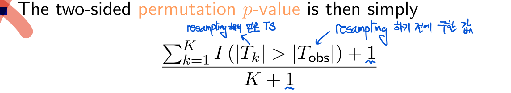
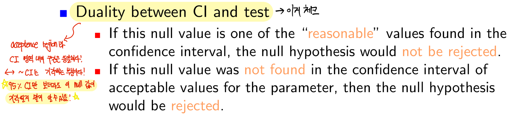

Lecture2 : Statistical Test for Genomic Data
================
2025-03-13

- [Required Packages](#required-packages)
- [Statistical Hypothesis Testing](#statistical-hypothesis-testing)
- [The Z-test](#the-z-test)
- [One sample T-test](#one-sample-t-test)
- [Two Sample T-test with Unequal Variances(welch’s
  t-test)](#two-sample-t-test-with-unequal-varianceswelchs-t-test)
- [Two Sample T-test with Equal
  Variances](#two-sample-t-test-with-equal-variances)
- [Test for Equal Variances](#test-for-equal-variances)
- [Histogram and Q-Q plot(정규성
  검정)](#histogram-and-q-q-plot정규성-검정)
- [Normality Tests](#normality-tests)
- [Outliers Test](#outliers-test)
- [Binomial Test](#binomial-test)
- [Chi-squared Test](#chi-squared-test)
- [Fisher’s Exact Test](#fishers-exact-test)
- [Hardy Weinberg Equilibrium](#hardy-weinberg-equilibrium)
- [Asthma SNP Data](#asthma-snp-data)
- [Permutation Test](#permutation-test)
- [Confidence Interval](#confidence-interval-1)
- [Duality between CI and test](#duality-between-ci-and-test)
- [Bootstrap Confidence Interval](#bootstrap-confidence-interval)
- [Wilcoxon Signed Rank Test](#wilcoxon-signed-rank-test)
- [Wilcoxon Rank Sum Test](#wilcoxon-rank-sum-test)
- [Applications to Multiple Genes](#applications-to-multiple-genes)

### Required Packages

``` r
#if (!requireNamespace("BiocManager", quietly = TRUE))
#install.packages("BiocManager")
#BiocManager::install("multtest")
#install.packages("nortest")
#install.packages("car")
#install.packages("outliers")
#install.packages("ape")
#install.packages("SNPassoc")
#install.packages("genetics")
```

### Statistical Hypothesis Testing

- Sample data 만든 후 그 data에서 **sample statistic** 계산 조진다.
- 그 다음 우리는 **Null huypothesis**가 **true**라 가정한다잉!
- 그 다음 $H_0$의 distribution에서 sample statistic의 위치(?)를 본다.
- 우리는 지금 $H_0$가 true라고 가정을 했기 때문에 sample data에서 나온
  ST가 $H_0$의 distribution에 잘 맞아야한다.
- 여기서 잘 맞아야한다라는 뜻은 그 ST가 터무니 없는 확률로 나온다면
  안된다는 뜻이다.
- 이때 그 확률을 우리는 **p-value**라고 한다.
- 그리고 우리는 $H_0$가 true일떄 $H_0$를 reject할 허용 오차를
  significance level $\alpha$라고 한다.

> p-value가 0.05일 때, 만약 $H_0$가 True일 때 관측된 결과(ST)가 우연히
> 나타날 확률이 50%이다! 라는 느낌! 즉 $\alpha = 0.05$는 내가 관측한
> 값이 우연히 나타날 확률이 0.05 보단 작아선 안된다! 라는 threshold를
> setting 한 느낌!

- 핵심은 sample statistic의 distribution을 알아야 한다!!!

### The Z-test

- 현실에선 쓸 일 없음 ㅋㅋㅋㅋㅋ

- 왜? 모표준편차를 어케아노..

- Under the Null

$$
 H_0: \mu = 0 \quad \text{vs} \quad H_1: \mu \neq 0
$$

``` r
library(multtest)
```

    ## Loading required package: BiocGenerics

    ## 
    ## Attaching package: 'BiocGenerics'

    ## The following objects are masked from 'package:stats':
    ## 
    ##     IQR, mad, sd, var, xtabs

    ## The following objects are masked from 'package:base':
    ## 
    ##     anyDuplicated, aperm, append, as.data.frame, basename, cbind,
    ##     colnames, dirname, do.call, duplicated, eval, evalq, Filter, Find,
    ##     get, grep, grepl, intersect, is.unsorted, lapply, Map, mapply,
    ##     match, mget, order, paste, pmax, pmax.int, pmin, pmin.int,
    ##     Position, rank, rbind, Reduce, rownames, sapply, saveRDS, setdiff,
    ##     table, tapply, union, unique, unsplit, which.max, which.min

    ## Loading required package: Biobase

    ## Welcome to Bioconductor
    ## 
    ##     Vignettes contain introductory material; view with
    ##     'browseVignettes()'. To cite Bioconductor, see
    ##     'citation("Biobase")', and for packages 'citation("pkgname")'.

``` r
library(nortest)
library(car)
```

    ## Loading required package: carData

``` r
library(outliers)
library(ape)
library(SNPassoc)
```

    ## Registered S3 method overwritten by 'SNPassoc':
    ##   method            from       
    ##   summary.haplo.glm haplo.stats

    ## 
    ## Attaching package: 'SNPassoc'

    ## The following object is masked from 'package:ape':
    ## 
    ##     additive

``` r
library(genetics)
```

    ## Loading required package: combinat

    ## 
    ## Attaching package: 'combinat'

    ## The following object is masked from 'package:utils':
    ## 
    ##     combn

    ## Loading required package: gdata

    ## 
    ## Attaching package: 'gdata'

    ## The following object is masked from 'package:Biobase':
    ## 
    ##     combine

    ## The following object is masked from 'package:BiocGenerics':
    ## 
    ##     combine

    ## The following object is masked from 'package:stats':
    ## 
    ##     nobs

    ## The following object is masked from 'package:utils':
    ## 
    ##     object.size

    ## The following object is masked from 'package:base':
    ## 
    ##     startsWith

    ## Loading required package: gtools

    ## 
    ## Attaching package: 'gtools'

    ## The following object is masked from 'package:car':
    ## 
    ##     logit

    ## Loading required package: MASS

    ## Loading required package: mvtnorm

    ## Registered S3 methods overwritten by 'genetics':
    ##   method                      from    
    ##   print.LD                    SNPassoc
    ##   print.LD.data.frame         SNPassoc
    ##   print.summary.LD.data.frame SNPassoc
    ##   summary.LD.data.frame       SNPassoc

    ## 

    ## NOTE: THIS PACKAGE IS NOW OBSOLETE.

    ## 

    ##   The R-Genetics project has developed an set of enhanced genetics

    ##   packages to replace 'genetics'. Please visit the project homepage

    ##   at http://rgenetics.org for informtion.

    ## 

    ## 
    ## Attaching package: 'genetics'

    ## The following objects are masked from 'package:SNPassoc':
    ## 
    ##     LD, LDplot, LDtable

    ## The following objects are masked from 'package:BiocGenerics':
    ## 
    ##     %in%, order

    ## The following objects are masked from 'package:base':
    ## 
    ##     %in%, as.factor, order

``` r
library(multtest)

data(golub, package = "multtest")

golubFactor <- factor(golub.cl, levels=0:1, labels=c("ALL","AML"))
  
x <- golub[2058, golubFactor=="ALL"]

n <- length(x)

sigma <- 0.25; mu0 <- 0
z.value <- sqrt(n)*(mean(x) - mu0)/sigma

2*pnorm(-abs(z.value)) # p-value
```

    ## [1] 0.9991094

``` r
f <- function(x) dnorm(x,0,1)
alpha <- 0.05
qz <- qnorm(1-alpha/2)
x1 <- seq(-4, -qz, 0.01); y1 <- dnorm(x1, 0, 1)
x2 <- seq(-qz, qz, 0.01); y2 <- dnorm(x2, 0, 1)
x3 <- seq(qz, 4, 0.01); y3 <- dnorm(x3, 0, 1)
plot(f, -4, 4, cex.lab=1.5, xlab="x", ylab="f(x)",
main="Normal probability density function f(x)")
polygon(c(-4, x1, -qz), c(0, y1, 0), col="red")
polygon(c(-qz, x2, qz), c(0, y2, 0), col="lightblue")
polygon(c(qz, x3, 4), c(0, y3, 0), col="red")
arrows(-3, 0.15, -3, 0.03)
text(-3, 0.23, "Rejection")
text(-3, 0.20, "Region")
text(-3, 0.17, expression(alpha/2))
arrows(3, 0.15, 3, 0.03)
text(3, 0.23, "Rejection")
text(3, 0.20, "Region")
text(3, 0.17, expression(alpha/2))
text(0, 0.23, "Acceptance")
text(0, 0.20, "Region")
```

<!-- -->

#### Confidence Interval

- If we were to repeat the procedure thousands of times, we are 95%
  certain that the true mean falls in the confidence interval -\> 이게
  핵심!

``` r
mean(x) + qnorm(0.025) * sigma/sqrt(n)
```

    ## [1] -0.09424511

``` r
mean(x) + qnorm(0.975) * sigma/sqrt(n)
```

    ## [1] 0.09435251

``` r
mean(x) + c(-1, 1) * qnorm(0.975) * sigma / sqrt(n)
```

    ## [1] -0.09424511  0.09435251

### One sample T-test

- 모집단의 분산(표준편차)을 모르고, 표본이 **정규성을 만족한다고
  가정**할 때 사용한다.
- 이때 검정 통계량은 t 분포를 따르고 t분포는 degree of freedom에 따라
  모양이 달라진다.
- 모집단의 분산 대신 표본의 구한 표본분산을 이용하기 때문에 정규분포가
  아닌 t 분포를 따르게 된다.(자세한 증명은 수통 때)

``` r
f <- function(x) dt(x, 5)
alpha <- 0.05
qt5 <- qt(1-alpha/2, 5)
x1 <- seq(-4, -qt5, 0.01)
y1 <- f(x1)
x2 <- seq(-qt5, qt5, 0.01)
y2 <- f(x2)
x3 <- seq(qt5, 4, 0.01)
y3 <- f(x3)
plot(f, -4, 4, xlab="x", ylab="f(x)",
main="T-distribution probability density function f(x)")
polygon(c(-4, x1, -qt5), c(0, y1 , 0), col="red")
polygon(c(-qt5, x2, qt5), c(0, y2, 0), col="lightblue")
polygon(c(qt5, x3, 4), c(0, y3, 0), col = "red")

arrows(-3, 0.15, -3, 0.03)
text(-3, 0.23, "Rejection")
text(-3, 0.20, "Region")
text(-3, 0.17, expression(alpha/2))
arrows(3, 0.15, 3, 0.03)
text(3, 0.23, "Rejection")
text(3, 0.20, "Region")
text(3, 0.17, expression(alpha/2))
text(0, 0.23, "Acceptance")
text(0, 0.20, "Region")
mtext(expression(t[0.025]), side=1, at=-qt5, col="red")
mtext(expression(t[0.975]), side=1, at=qt5, col="red")
```

<!-- -->

#### R에서 분포와 관련된 함수 정리

``` r
#' d : 확률밀도함수
#' 특정 분포의 확률밀도값 또는 확률질량값을 계산
dnorm(0, mean = 0, sd = 1)
```

    ## [1] 0.3989423

``` r
#' p : 누적분포함수
#' 특정 분포에서 어떤 값 q 이하가 나올 확률을 계산
pnorm(0, mean = 0, sd = 1)
```

    ## [1] 0.5

``` r
#' q : 분위수함수
#' 누적분포함수의 반대 개념으로, 누적확률 p에 해당하는 값을 계산
qnorm(0.975, mean = 0, sd = 1)
```

    ## [1] 1.959964

``` r
qnorm(0.5, mean = 0, sd = 1)
```

    ## [1] 0

``` r
#' r : 난수생성
#' 특정 분포를 따르는 난수를 n개 생성하여 벡터로 반환
rnorm(10, mean = 0, sd = 1)
```

    ##  [1] -0.43145370 -0.53457612 -1.74880939  0.92186801  0.76043769 -0.43568294
    ##  [7]  2.37831055  0.04514786 -0.54860113 -0.55768308

``` r
x <- golub[2058, golubFactor=="ALL"]

mu0 <- 0

n <- 27

t.value <- sqrt(n)*(mean(x) - mu0)/sd(x)

t.value
```

    ## [1] 0.001076867

``` r
qt(0.975, 26)
```

    ## [1] 2.055529

``` r
2 * pt(-abs(t.value), 26) # p-value
```

    ## [1] 0.999149

``` r
alpha <- 0.05

mean(x) + c(qt(alpha/2, n-1), qt(1-alpha/2, n-1)) * sd(x)/sqrt(n)
```

    ## [1] -0.1024562  0.1025636

#### One Sample T-test를 위한 R function : `t.test(data= , mu= , alternative = )`

``` r
t.test(x, mu=0) # default two side test
```

    ## 
    ##  One Sample t-test
    ## 
    ## data:  x
    ## t = 0.0010769, df = 26, p-value = 0.9991
    ## alternative hypothesis: true mean is not equal to 0
    ## 95 percent confidence interval:
    ##  -0.1024562  0.1025636
    ## sample estimates:
    ##   mean of x 
    ## 5.37037e-05

$$
H_1: \mu > 0
$$

``` r
#' mu를 기준으로 p-v는 오른쪽 부분 싸악 
t.test(x, mu=0, alternative = "greater") # one side test
```

    ## 
    ##  One Sample t-test
    ## 
    ## data:  x
    ## t = 0.0010769, df = 26, p-value = 0.4996
    ## alternative hypothesis: true mean is greater than 0
    ## 95 percent confidence interval:
    ##  -0.085006       Inf
    ## sample estimates:
    ##   mean of x 
    ## 5.37037e-05

$$
H_1: \mu < 0
$$

``` r
#' mu를 기준으로 p-v는 왼쪽 부분 싸악 
t.test(x, mu=0, alternative = "less") # one side test
```

    ## 
    ##  One Sample t-test
    ## 
    ## data:  x
    ## t = 0.0010769, df = 26, p-value = 0.5004
    ## alternative hypothesis: true mean is less than 0
    ## 95 percent confidence interval:
    ##        -Inf 0.08511341
    ## sample estimates:
    ##   mean of x 
    ## 5.37037e-05

#### Example of One sample T-test

- Using a box-and-whiskers plot and a side-by-side plot, we can
  investigate the range of the ALL and AML gene expression values of
  CCND3 (CyclinD3), which are collected in row 1042 of the data matrix
  golub.

> 그니깐 CCND3 gene에서 ALL vs AML을 하자.

``` r
# gred()으로 CCND3 gene의 index 찾기
ccnd3 <- grep("CCND3", golub.gnames[,2], ignore.case=TRUE) 
ccnd3
```

    ## [1] 1042

``` r
par(mfrow=c(1,2)) 
stripchart(golub[ccnd3,] ~ golubFactor, method="jitter", cex.lab=1.5, ylab="", vertical = TRUE, col=c("red", "darkgreen"), xlab="Leukemia subtype")

boxplot(golub[ccnd3,] ~ golubFactor, cex.lab=1.5, main=NULL, xlab="Leukemia subtype", col=c("purple","green"), ylab="CCND3 (Cyclin D3) Expression")
```

<!-- -->

``` r
ALL <- golubFactor=="ALL" 

#' CCND3 gene에서 ALL로 검정을 하자..
#' H_0 = mu에 대한 가설검정 
t.test(golub[ccnd3, ALL], mu=0) 
```

    ## 
    ##  One Sample t-test
    ## 
    ## data:  golub[ccnd3, ALL]
    ## t = 20.06, df = 26, p-value < 2.2e-16
    ## alternative hypothesis: true mean is not equal to 0
    ## 95 percent confidence interval:
    ##  1.699817 2.087948
    ## sample estimates:
    ## mean of x 
    ##  1.893883

- t = 20.06 존나 큰 값 -\> 무조건 기각 즉! ALL의 평균 값이 0이
  아니다라고 할 수 있다.

``` r
t.test(golub[ccnd3, !ALL], mu=0)
```

    ## 
    ##  One Sample t-test
    ## 
    ## data:  golub[ccnd3, !ALL]
    ## t = 3.6249, df = 10, p-value = 0.004651
    ## alternative hypothesis: true mean is not equal to 0
    ## 95 percent confidence interval:
    ##  0.2449118 1.0262701
    ## sample estimates:
    ## mean of x 
    ## 0.6355909

- 0.004이라서 기각이긴한데 살짝 부족함.

``` r
t.test(golub[ccnd3, ALL], mu=0, alternative="greater")
```

    ## 
    ##  One Sample t-test
    ## 
    ## data:  golub[ccnd3, ALL]
    ## t = 20.06, df = 26, p-value < 2.2e-16
    ## alternative hypothesis: true mean is greater than 0
    ## 95 percent confidence interval:
    ##  1.732853      Inf
    ## sample estimates:
    ## mean of x 
    ##  1.893883

``` r
t.test(golub[ccnd3, !ALL], mu=0, alternative="greater") # two side랑 p-v만 다르다.
```

    ## 
    ##  One Sample t-test
    ## 
    ## data:  golub[ccnd3, !ALL]
    ## t = 3.6249, df = 10, p-value = 0.002326
    ## alternative hypothesis: true mean is greater than 0
    ## 95 percent confidence interval:
    ##  0.3177962       Inf
    ## sample estimates:
    ## mean of x 
    ## 0.6355909

``` r
t.test(golub[ccnd3, !ALL], mu=0, alternative="less")
```

    ## 
    ##  One Sample t-test
    ## 
    ## data:  golub[ccnd3, !ALL]
    ## t = 3.6249, df = 10, p-value = 0.9977
    ## alternative hypothesis: true mean is less than 0
    ## 95 percent confidence interval:
    ##       -Inf 0.9533856
    ## sample estimates:
    ## mean of x 
    ## 0.6355909

``` r
t.test(golub[ccnd3, ALL], mu=0, alternative="less")
```

    ## 
    ##  One Sample t-test
    ## 
    ## data:  golub[ccnd3, ALL]
    ## t = 20.06, df = 26, p-value = 1
    ## alternative hypothesis: true mean is less than 0
    ## 95 percent confidence interval:
    ##      -Inf 2.054912
    ## sample estimates:
    ## mean of x 
    ##  1.893883

### Two Sample T-test with Unequal Variances(welch’s t-test)

> 예들 들어 CCND3 gene을 이용해서 Two Sample T-test를 한다고 하자..
>
> 그럼 CCND3 gene에소 ALL vs AML인 그룹의 평균 gene expression을
> 비교할것이다.
>
> 만약 귀무가설이 reject되면 이 CCND3 gene은 ALL, AML를 구별하는데
> 도움을 주는 gene이 될 것이다..!!

- 두그룹의 평균을 비교할 때 사용한다.

- Two Sample T test를 진행하기 위해선

  1.  각 그룹 샘플에 대한 정규성 검정 실시

  > 안 따르면 비모수 검정으로 진행,, two sample t-test할려면 무조건
  > 일단은 각 그룹이 정규성을 따라야한다.

  1.  Equal variance에 대한 검정 실시
  2.  분산이 같다면 pooled t-test를 실시
  3.  같지 않다면 welch’s t-test를 실시(general version)
  4.  그 다음 상황에 맞는 t test를 진행한다.

``` r
ccnd3 <- grep("CCND3", golub.gnames[,2], ignore.case=TRUE) 
ccnd3
```

    ## [1] 1042

``` r
par(mfrow=c(1,2)) 
stripchart(golub[ccnd3,] ~ golubFactor, method="jitter", cex.lab=1.5, ylab="", vertical = TRUE, col=c("red", "darkgreen"), xlab="Leukemia subtype")

boxplot(golub[ccnd3,] ~ golubFactor, cex.lab=1.5, main=NULL, xlab="Leukemia subtype", col=c("purple","green"), ylab="CCND3 (Cyclin D3) Expression")
```

<!-- -->

``` r
data.frame(golub[ccnd3,], y =golubFactor)
```

    ##    golub.ccnd3...   y
    ## 1         2.10892 ALL
    ## 2         1.52405 ALL
    ## 3         1.96403 ALL
    ## 4         2.33597 ALL
    ## 5         1.85111 ALL
    ## 6         1.99391 ALL
    ## 7         2.06597 ALL
    ## 8         1.81649 ALL
    ## 9         2.17622 ALL
    ## 10        1.80861 ALL
    ## 11        2.44562 ALL
    ## 12        1.90496 ALL
    ## 13        2.76610 ALL
    ## 14        1.32551 ALL
    ## 15        2.59385 ALL
    ## 16        1.92776 ALL
    ## 17        1.10546 ALL
    ## 18        1.27645 ALL
    ## 19        1.83051 ALL
    ## 20        1.78352 ALL
    ## 21        0.45827 ALL
    ## 22        2.18119 ALL
    ## 23        2.31428 ALL
    ## 24        1.99927 ALL
    ## 25        1.36844 ALL
    ## 26        2.37351 ALL
    ## 27        1.83485 ALL
    ## 28        0.88941 AML
    ## 29        1.45014 AML
    ## 30        0.42904 AML
    ## 31        0.82667 AML
    ## 32        0.63637 AML
    ## 33        1.02250 AML
    ## 34        0.12758 AML
    ## 35       -0.74333 AML
    ## 36        0.73784 AML
    ## 37        0.49470 AML
    ## 38        1.12058 AML

#### R Function for Unequal Variances in two sample t-test : t.test(data ~ groupfactor, var.equal = FALSE)

``` r
t.test(golub[ccnd3,] ~ golubFactor, var.equal=FALSE) # result = > 두 집단은 다르다~
```

    ## 
    ##  Welch Two Sample t-test
    ## 
    ## data:  golub[ccnd3, ] by golubFactor
    ## t = 6.3186, df = 16.118, p-value = 9.871e-06
    ## alternative hypothesis: true difference in means between group ALL and group AML is not equal to 0
    ## 95 percent confidence interval:
    ##  0.8363826 1.6802008
    ## sample estimates:
    ## mean in group ALL mean in group AML 
    ##         1.8938826         0.6355909

- From the result, we can say that the data provide strong evidence that
  the population means do differ.

``` r
t.test(golub[ccnd3,] ~ golubFactor, var.equal=FALSE, alternative="greater")
```

    ## 
    ##  Welch Two Sample t-test
    ## 
    ## data:  golub[ccnd3, ] by golubFactor
    ## t = 6.3186, df = 16.118, p-value = 4.935e-06
    ## alternative hypothesis: true difference in means between group ALL and group AML is greater than 0
    ## 95 percent confidence interval:
    ##  0.9107706       Inf
    ## sample estimates:
    ## mean in group ALL mean in group AML 
    ##         1.8938826         0.6355909

``` r
t.test(golub[ccnd3,] ~ golubFactor, var.equal=FALSE, alternative="less")
```

    ## 
    ##  Welch Two Sample t-test
    ## 
    ## data:  golub[ccnd3, ] by golubFactor
    ## t = 6.3186, df = 16.118, p-value = 1
    ## alternative hypothesis: true difference in means between group ALL and group AML is less than 0
    ## 95 percent confidence interval:
    ##      -Inf 1.605813
    ## sample estimates:
    ## mean in group ALL mean in group AML 
    ##         1.8938826         0.6355909

### Two Sample T-test with Equal Variances

- 두 집단의 분산에 대한 검정 결과로 $H_0$를 기각하지 못하면 즉, 두
  집단의 분산이 같으면 **pooled sample variance**를 이용한 **pooled
  t-test**를 실시.

#### `t.test(data ~ groupFactor, var.equal=TRUE)`

``` r
t.test(golub[ccnd3,] ~ golubFactor, var.equal=TRUE)
```

    ## 
    ##  Two Sample t-test
    ## 
    ## data:  golub[ccnd3, ] by golubFactor
    ## t = 6.7983, df = 36, p-value = 6.046e-08
    ## alternative hypothesis: true difference in means between group ALL and group AML is not equal to 0
    ## 95 percent confidence interval:
    ##  0.8829143 1.6336690
    ## sample estimates:
    ## mean in group ALL mean in group AML 
    ##         1.8938826         0.6355909

### Test for Equal Variances

- F 분포로 조지는 놈!
- Extremely sensitive to non-normality!

``` r
ccnd3 <- grep("CCND3", golub.gnames[,2], ignore.case=TRUE) 
zyxin <- grep("Zyxin", golub.gnames[,2], ignore.case=TRUE)
```

``` r
# 각 그룹별 분산의 차이 
#' tapply 안에는 벡터나 배열 자료형이 들어간다.
tapply(golub[ccnd3,], golubFactor, var) 
```

    ##       ALL       AML 
    ## 0.2406642 0.3381806

``` r
tapply(golub[zyxin,], golubFactor, var)
```

    ##       ALL       AML 
    ## 0.5224983 0.1351442

#### R function for variance test : `var.test(data~groupFactor)`

``` r
var.test(golub[ccnd3, ] ~ golubFactor) # 두 그룹의 분산이 같다고 할 수 있다->pooled 이용
```

    ## 
    ##  F test to compare two variances
    ## 
    ## data:  golub[ccnd3, ] by golubFactor
    ## F = 0.71164, num df = 26, denom df = 10, p-value = 0.4652
    ## alternative hypothesis: true ratio of variances is not equal to 1
    ## 95 percent confidence interval:
    ##  0.2127735 1.8428387
    ## sample estimates:
    ## ratio of variances 
    ##          0.7116441

``` r
var.test(golub[zyxin, ] ~ golubFactor) # 두 그룹의 부산이 같다고 할 수 없다->pooled 못 쓴다.. welch's 이용
```

    ## 
    ##  F test to compare two variances
    ## 
    ## data:  golub[zyxin, ] by golubFactor
    ## F = 3.8662, num df = 26, denom df = 10, p-value = 0.02968
    ## alternative hypothesis: true ratio of variances is not equal to 1
    ## 95 percent confidence interval:
    ##   1.155958 10.011795
    ## sample estimates:
    ## ratio of variances 
    ##           3.866228

- 분산에 대한 검정은 F검정 말고도 여러 종류가 있다! 참고!!

``` r
bartlett.test(golub[ccnd3,] ~ golubFactor) 
```

    ## 
    ##  Bartlett test of homogeneity of variances
    ## 
    ## data:  golub[ccnd3, ] by golubFactor
    ## Bartlett's K-squared = 0.42236, df = 1, p-value = 0.5158

``` r
bartlett.test(golub[zyxin,] ~ golubFactor)
```

    ## 
    ##  Bartlett test of homogeneity of variances
    ## 
    ## data:  golub[zyxin, ] by golubFactor
    ## Bartlett's K-squared = 5.036, df = 1, p-value = 0.02483

``` r
fligner.test(golub[ccnd3,], golubFactor) 
```

    ## 
    ##  Fligner-Killeen test of homogeneity of variances
    ## 
    ## data:  golub[ccnd3, ] and golubFactor
    ## Fligner-Killeen:med chi-squared = 0.14115, df = 1, p-value = 0.7071

``` r
fligner.test(golub[zyxin,], golubFactor)
```

    ## 
    ##  Fligner-Killeen test of homogeneity of variances
    ## 
    ## data:  golub[zyxin, ] and golubFactor
    ## Fligner-Killeen:med chi-squared = 7.2671, df = 1, p-value = 0.007023

``` r
library(car) 
leveneTest(golub[ccnd3,], golubFactor) 
```

    ## Levene's Test for Homogeneity of Variance (center = median)
    ##       Df F value Pr(>F)
    ## group  1  0.1336 0.7169
    ##       36

``` r
leveneTest(golub[zyxin,], golubFactor)
```

    ## Levene's Test for Homogeneity of Variance (center = median)
    ##       Df F value   Pr(>F)   
    ## group  1  9.2119 0.004448 **
    ##       36                    
    ## ---
    ## Signif. codes:  0 '***' 0.001 '**' 0.01 '*' 0.05 '.' 0.1 ' ' 1

### Histogram and Q-Q plot(정규성 검정)

- Various procedures are available **to test the hypothesis that a
  dataset is normally distributed**. Many statistical tests including
  T-test and F-test require normality assumption.

``` r
# histogram
par(mfrow=c(1,2)) 
hist(golub[ccnd3, golubFactor=="ALL"], cex.lab=1.5, col="orange",nclass=20, main=NULL, xlab="CCND3 (Cyclin D3) Expression") 
hist(golub[zyxin, golubFactor=="ALL"], cex.lab=1.5, col="orange",nclass=20, main=NULL, xlab="Zyxin Expression")
```

<!-- -->

#### R function for q-q ploting : `qqnorm() & qqpline()`

``` r
# q-q plot
par(mfrow=c(1,2)) 
qqnorm(golub[ccnd3, golubFactor=="ALL"], pch=19, cex.lab=1.5, col="red", main=NULL) 
qqline(golub[ccnd3, golubFactor=="ALL"]) 

qqnorm(golub[zyxin, golubFactor=="ALL"], pch=19, cex.lab=1.5,col="red", main=NULL) 
qqline(golub[zyxin, golubFactor=="ALL"])
```

<!-- -->

### Normality Tests

$$
H_0 : \text{정규성을 따른다..!}
$$

- Normality Tests는 각 집단 별로 다해야한다!!! -\> 베리 중요

#### R function for Normality Test

``` r
shapiro.test(golub[ccnd3, golubFactor=="ALL"]) 
```

    ## 
    ##  Shapiro-Wilk normality test
    ## 
    ## data:  golub[ccnd3, golubFactor == "ALL"]
    ## W = 0.94663, p-value = 0.1774

``` r
shapiro.test(golub[ccnd3, golubFactor=="AML"]) 
```

    ## 
    ##  Shapiro-Wilk normality test
    ## 
    ## data:  golub[ccnd3, golubFactor == "AML"]
    ## W = 0.91756, p-value = 0.2989

``` r
shapiro.test(golub[zyxin, golubFactor=="ALL"]) # reject H_0
```

    ## 
    ##  Shapiro-Wilk normality test
    ## 
    ## data:  golub[zyxin, golubFactor == "ALL"]
    ## W = 0.89198, p-value = 0.00881

``` r
shapiro.test(golub[zyxin, golubFactor=="AML"]) 
```

    ## 
    ##  Shapiro-Wilk normality test
    ## 
    ## data:  golub[zyxin, golubFactor == "AML"]
    ## W = 0.96378, p-value = 0.8178

``` r
library(nortest) 
ad.test(golub[ccnd3, golubFactor=="ALL"]) 
```

    ## 
    ##  Anderson-Darling normality test
    ## 
    ## data:  golub[ccnd3, golubFactor == "ALL"]
    ## A = 0.52154, p-value = 0.1683

``` r
ad.test(golub[zyxin, golubFactor=="ALL"])
```

    ## 
    ##  Anderson-Darling normality test
    ## 
    ## data:  golub[zyxin, golubFactor == "ALL"]
    ## A = 1.013, p-value = 0.009583

### Outliers Test

- gene expression values가 not normally distributed 할 때 outlier들이
  있을 확률이 매우 높다.

$$
H_0 : \text{Does not contain an outlier}
$$

- 이상치 검정을 위해 Grubbs test를 진행!

``` r
library(outliers)
grubbs.test(golub[ccnd3, golubFactor=="ALL"])
```

    ## 
    ##  Grubbs test for one outlier
    ## 
    ## data:  golub[ccnd3, golubFactor == "ALL"]
    ## G = 2.92639, U = 0.65796, p-value = 0.0183
    ## alternative hypothesis: lowest value 0.45827 is an outlier

``` r
grubbs.test(golub[zyxin, golubFactor=="ALL"])
```

    ## 
    ##  Grubbs test for one outlier
    ## 
    ## data:  golub[zyxin, golubFactor == "ALL"]
    ## G = 1.63480, U = 0.89326, p-value = 1
    ## alternative hypothesis: lowest value -1.47649 is an outlier

- 이상값이 있거나 분포가 크게 왜곡된 경우, 순위 기반(비모수) 검정,
  강건추정(robust estimation) 기법 등이 대안

### Binomial Test

- **이항분포 기반 가설검정**은 특정 사건이 일어날 확률 $p$가 이론적으로
  가정된 값 $p_0$와 같은지를 통계적으로 검정
- 예 : 어떤 microRNA 서열에서 퓨린이 나타날 확률을 $p_0$라고 가정하고,
  **실제로 관측된** 퓨린 비율이 $p_0$와 다른지 판단.

> 어떤 연구에서 길이 22nt의 microRNA가 있다고 하자. 이 microRNA 서열에서
> 퓨린이 **실제로 18개** 관측되었다. 나는 “이 microRNA에서 퓨린이 나타날
> 확률이 $p_0 = 0.7$ 이상일 것이다!” 라는 가설을 세웠다.

$$
H_0 : p = 0.7
$$

$$
H_1 : p \gt 0.7
$$

> 그럼 p-value는 다음과 같이 계산된다.

$$
p\text{-value} \;=\; P(X \ge 18)
\;=\; \sum_{x=18}^{22} \binom{22}{x} \,(0.7)^{x} \,(0.3)^{22 - x}
$$

> 등호 넣는게 매우 중요하다..!

``` r
sum(dbinom(18:22, 22, 0.7)) # d => pdf value
```

    ## [1] 0.1645488

``` r
1 - pbinom(17, 22, 0.7) # p => cdf
```

    ## [1] 0.1645488

#### R function for binomtest : `binon.test()`

``` r
binom.test(18, 22, p=0.7, alternative="greater", conf.level=0.95)
```

    ## 
    ##  Exact binomial test
    ## 
    ## data:  18 and 22
    ## number of successes = 18, number of trials = 22, p-value = 0.1645
    ## alternative hypothesis: true probability of success is greater than 0.7
    ## 95 percent confidence interval:
    ##  0.6309089 1.0000000
    ## sample estimates:
    ## probability of success 
    ##              0.8181818

### Chi-squared Test

- 카이제곱 검정은 **범주형 자료의 빈도분포**가 특정 이론적 분포와
  일치하는지, 혹인 범주형 변수들이 서로 독립적인지를 평가하기 위한 검정
  방법이다.

1.  적합도 검정

- 표본에서 관측된 범주별 빈도 분포가, 연구자가 가정한 분포와 같은지를
  검정
- 예: A, C, G, T가 동일 확률(각 1/4)로 나타나는지 여부 확인

$$
H_0 : (\pi_1,...,\pi_m) = (p_1,...,p_m)
$$

2.  독립성 검정

- 두 범주형 변수가 서로 독립인지를 검정

- 질병 유전자형과 임상 그룹이 독립인지, 혹은 연관이 있는지

- 기본 아이디어

1.  관측도수(Observed count) : $o_i$

- 범주 $i$에서 **실제로 관측된 빈도**(개수)

2.  기대도수(Expected count) : $e_i$

- 귀무가설이 참일 때, 범주 $i$에서 기대되는 또는 이론적으로 예측되는
  빈도
- 예를 들어, 총 표본 크기를 $n$이라 하고, 각 범주에 대한 가정 확률(이론
  확률 $p_0$ 느낌)을 $p_1,..,p_m$이라 한다면,

$$
e_i = np_i
$$

3.검정방법

- 카이제곱 검정통계량을 구하고 $q$ 해당하는 p=value가 유의수준보다
  작으면 귀무가설을 기각.

``` r
library(ape) 
obs <- table(read.GenBank(c("X94991.1"),as.character=TRUE)) 
obs
```

    ## X94991.1
    ##   a   c   g   t 
    ## 410 789 573 394

``` r
e <- rep(sum(obs)/4, 4) # n(전체 수) * 1/4 (p_i)
e
```

    ## [1] 541.5 541.5 541.5 541.5

``` r
test <- sum((obs-e)^2/e) 
test
```

    ## [1] 187.0674

``` r
1-pchisq(test, 3) 
```

    ## [1] 0

``` r
qchisq(0.95, 3)
```

    ## [1] 7.814728

``` r
chisq.test(obs)
```

    ## 
    ##  Chi-squared test for given probabilities
    ## 
    ## data:  obs
    ## X-squared = 187.07, df = 3, p-value < 2.2e-16

``` r
pi <- c(0.75,0.25) 
x <- c(5474, 1850) 
chisq.test(x, p=pi)
```

    ## 
    ##  Chi-squared test for given probabilities
    ## 
    ## data:  x
    ## X-squared = 0.26288, df = 1, p-value = 0.6081

#### Confusion Matrix (46쪽 필기)

- 가로축(열, True)에는 실제 참값(‘진짜’ 레이블), 세로축(행, Predict)에는
  예측한 레이블

- 예: 백혈병 데이터에서 실제 유형(ALL, AML)과 모델이 예측한 유형(ALL,
  AML)을 2×2 표로 정리

  - TP (True Positive): 실제가 ALL이고, 예측도 ALL

  - TN (True Negative): 실제가 AML이고, 예측도 AML

  - FP (False Positive): 실제가 AML인데 ALL로 잘못 예측

  - FN (False Negative): 실제가 ALL인데 AML로 잘못 예측

#### Testing Indepnedence

1.  Cutoff 설정: 유전자 발현값이나 어떤 점수 등에 임의의 임계값을 정해,
    이를 기준으로 예측
2.  Confusion matrix 구성
3.  독립성 검정 수행

$$
H_0 : \text{cutoff 쓰레기, 실제 레이블과 예측 레이블이 독립이다.}
$$

$$
H_1 : \text{성능 좋노!, 실제 레이블과 예측 레이블이 연관이 있다.}
$$

``` r
data(golub, package = "multtest") 
golubFactor <- factor(golub.cl, levels=0:1, labels=c("ALL","AML")) 
gdf5 <- grep("Gdf5", golub.gnames[,2], ignore.case=TRUE)
```

``` r
x <- golub[gdf5, ] 

# cutoff 설정
cutoff <- 0.1 

# cutoff에 따른 예측
pred <- ifelse(x < cutoff, "ALL", "AML") 
data.frame(predicted=pred, true=golubFactor) 
```

    ##    predicted true
    ## 1        AML  ALL
    ## 2        ALL  ALL
    ## 3        AML  ALL
    ## 4        ALL  ALL
    ## 5        ALL  ALL
    ## 6        ALL  ALL
    ## 7        AML  ALL
    ## 8        AML  ALL
    ## 9        ALL  ALL
    ## 10       ALL  ALL
    ## 11       ALL  ALL
    ## 12       ALL  ALL
    ## 13       ALL  ALL
    ## 14       ALL  ALL
    ## 15       ALL  ALL
    ## 16       AML  ALL
    ## 17       ALL  ALL
    ## 18       AML  ALL
    ## 19       ALL  ALL
    ## 20       ALL  ALL
    ## 21       ALL  ALL
    ## 22       ALL  ALL
    ## 23       AML  ALL
    ## 24       ALL  ALL
    ## 25       AML  ALL
    ## 26       ALL  ALL
    ## 27       AML  ALL
    ## 28       ALL  AML
    ## 29       ALL  AML
    ## 30       AML  AML
    ## 31       ALL  AML
    ## 32       ALL  AML
    ## 33       AML  AML
    ## 34       ALL  AML
    ## 35       AML  AML
    ## 36       ALL  AML
    ## 37       AML  AML
    ## 38       AML  AML

``` r
table(predicted=pred, true=golubFactor)
```

    ##          true
    ## predicted ALL AML
    ##       ALL  18   6
    ##       AML   9   5

``` r
chisq.test(table(pred, golubFactor))
```

    ## Warning in chisq.test(table(pred, golubFactor)): Chi-squared approximation may
    ## be incorrect

    ## 
    ##  Pearson's Chi-squared test with Yates' continuity correction
    ## 
    ## data:  table(pred, golubFactor)
    ## X-squared = 0.11005, df = 1, p-value = 0.7401

``` r
cutoff <- sort(x) 
pval <- 0
```

``` r
for (i in 1:length(cutoff)) { 
  pred <- ifelse(x < cutoff[i], "ALL", "AML") 
  pval[i] <- chisq.test(table(pred, golubFactor))$p.val 
  }
```

    ## Warning in chisq.test(table(pred, golubFactor)): Chi-squared approximation may
    ## be incorrect
    ## Warning in chisq.test(table(pred, golubFactor)): Chi-squared approximation may
    ## be incorrect
    ## Warning in chisq.test(table(pred, golubFactor)): Chi-squared approximation may
    ## be incorrect
    ## Warning in chisq.test(table(pred, golubFactor)): Chi-squared approximation may
    ## be incorrect
    ## Warning in chisq.test(table(pred, golubFactor)): Chi-squared approximation may
    ## be incorrect
    ## Warning in chisq.test(table(pred, golubFactor)): Chi-squared approximation may
    ## be incorrect
    ## Warning in chisq.test(table(pred, golubFactor)): Chi-squared approximation may
    ## be incorrect
    ## Warning in chisq.test(table(pred, golubFactor)): Chi-squared approximation may
    ## be incorrect
    ## Warning in chisq.test(table(pred, golubFactor)): Chi-squared approximation may
    ## be incorrect
    ## Warning in chisq.test(table(pred, golubFactor)): Chi-squared approximation may
    ## be incorrect
    ## Warning in chisq.test(table(pred, golubFactor)): Chi-squared approximation may
    ## be incorrect
    ## Warning in chisq.test(table(pred, golubFactor)): Chi-squared approximation may
    ## be incorrect
    ## Warning in chisq.test(table(pred, golubFactor)): Chi-squared approximation may
    ## be incorrect
    ## Warning in chisq.test(table(pred, golubFactor)): Chi-squared approximation may
    ## be incorrect
    ## Warning in chisq.test(table(pred, golubFactor)): Chi-squared approximation may
    ## be incorrect
    ## Warning in chisq.test(table(pred, golubFactor)): Chi-squared approximation may
    ## be incorrect
    ## Warning in chisq.test(table(pred, golubFactor)): Chi-squared approximation may
    ## be incorrect
    ## Warning in chisq.test(table(pred, golubFactor)): Chi-squared approximation may
    ## be incorrect
    ## Warning in chisq.test(table(pred, golubFactor)): Chi-squared approximation may
    ## be incorrect
    ## Warning in chisq.test(table(pred, golubFactor)): Chi-squared approximation may
    ## be incorrect
    ## Warning in chisq.test(table(pred, golubFactor)): Chi-squared approximation may
    ## be incorrect
    ## Warning in chisq.test(table(pred, golubFactor)): Chi-squared approximation may
    ## be incorrect
    ## Warning in chisq.test(table(pred, golubFactor)): Chi-squared approximation may
    ## be incorrect
    ## Warning in chisq.test(table(pred, golubFactor)): Chi-squared approximation may
    ## be incorrect
    ## Warning in chisq.test(table(pred, golubFactor)): Chi-squared approximation may
    ## be incorrect
    ## Warning in chisq.test(table(pred, golubFactor)): Chi-squared approximation may
    ## be incorrect
    ## Warning in chisq.test(table(pred, golubFactor)): Chi-squared approximation may
    ## be incorrect
    ## Warning in chisq.test(table(pred, golubFactor)): Chi-squared approximation may
    ## be incorrect
    ## Warning in chisq.test(table(pred, golubFactor)): Chi-squared approximation may
    ## be incorrect
    ## Warning in chisq.test(table(pred, golubFactor)): Chi-squared approximation may
    ## be incorrect
    ## Warning in chisq.test(table(pred, golubFactor)): Chi-squared approximation may
    ## be incorrect
    ## Warning in chisq.test(table(pred, golubFactor)): Chi-squared approximation may
    ## be incorrect
    ## Warning in chisq.test(table(pred, golubFactor)): Chi-squared approximation may
    ## be incorrect
    ## Warning in chisq.test(table(pred, golubFactor)): Chi-squared approximation may
    ## be incorrect

``` r
plot(cutoff, pval, type="p", pch=20, ylab="pvalues") 
```

<!-- -->

``` r
cutoff[pval < 0.05]
```

    ## [1] -0.6839

``` r
pred <- ifelse(x < cutoff[1], "ALL", "AML") 
table(predicted=pred, true=golubFactor)
```

    ##          true
    ## predicted ALL AML
    ##       AML  27  11

``` r
boxplot(x ~ golubFactor, cex.lab=1.5, main=NULL, 
        xlab="Leukemia subtype", col=c("lightblue", "orange"))
```

<!-- -->

<hr>

``` r
ccnd3 <- grep("CCND3", golub.gnames[,2], ignore.case=TRUE) 
x2 <- golub[ccnd3, ]
```

``` r
cutoff <- sort(x2) 
pval2 <- 0 
for (i in 1:length(cutoff)) {
  pred2 <- ifelse(x2 < cutoff[i], "ALL", "AML")
  pval2[i] <- chisq.test(table(pred2, golubFactor))$p.val 
}
```

    ## Warning in chisq.test(table(pred2, golubFactor)): Chi-squared approximation may
    ## be incorrect
    ## Warning in chisq.test(table(pred2, golubFactor)): Chi-squared approximation may
    ## be incorrect
    ## Warning in chisq.test(table(pred2, golubFactor)): Chi-squared approximation may
    ## be incorrect
    ## Warning in chisq.test(table(pred2, golubFactor)): Chi-squared approximation may
    ## be incorrect
    ## Warning in chisq.test(table(pred2, golubFactor)): Chi-squared approximation may
    ## be incorrect
    ## Warning in chisq.test(table(pred2, golubFactor)): Chi-squared approximation may
    ## be incorrect
    ## Warning in chisq.test(table(pred2, golubFactor)): Chi-squared approximation may
    ## be incorrect
    ## Warning in chisq.test(table(pred2, golubFactor)): Chi-squared approximation may
    ## be incorrect
    ## Warning in chisq.test(table(pred2, golubFactor)): Chi-squared approximation may
    ## be incorrect
    ## Warning in chisq.test(table(pred2, golubFactor)): Chi-squared approximation may
    ## be incorrect
    ## Warning in chisq.test(table(pred2, golubFactor)): Chi-squared approximation may
    ## be incorrect
    ## Warning in chisq.test(table(pred2, golubFactor)): Chi-squared approximation may
    ## be incorrect
    ## Warning in chisq.test(table(pred2, golubFactor)): Chi-squared approximation may
    ## be incorrect
    ## Warning in chisq.test(table(pred2, golubFactor)): Chi-squared approximation may
    ## be incorrect
    ## Warning in chisq.test(table(pred2, golubFactor)): Chi-squared approximation may
    ## be incorrect
    ## Warning in chisq.test(table(pred2, golubFactor)): Chi-squared approximation may
    ## be incorrect
    ## Warning in chisq.test(table(pred2, golubFactor)): Chi-squared approximation may
    ## be incorrect
    ## Warning in chisq.test(table(pred2, golubFactor)): Chi-squared approximation may
    ## be incorrect
    ## Warning in chisq.test(table(pred2, golubFactor)): Chi-squared approximation may
    ## be incorrect
    ## Warning in chisq.test(table(pred2, golubFactor)): Chi-squared approximation may
    ## be incorrect
    ## Warning in chisq.test(table(pred2, golubFactor)): Chi-squared approximation may
    ## be incorrect
    ## Warning in chisq.test(table(pred2, golubFactor)): Chi-squared approximation may
    ## be incorrect
    ## Warning in chisq.test(table(pred2, golubFactor)): Chi-squared approximation may
    ## be incorrect
    ## Warning in chisq.test(table(pred2, golubFactor)): Chi-squared approximation may
    ## be incorrect
    ## Warning in chisq.test(table(pred2, golubFactor)): Chi-squared approximation may
    ## be incorrect
    ## Warning in chisq.test(table(pred2, golubFactor)): Chi-squared approximation may
    ## be incorrect
    ## Warning in chisq.test(table(pred2, golubFactor)): Chi-squared approximation may
    ## be incorrect
    ## Warning in chisq.test(table(pred2, golubFactor)): Chi-squared approximation may
    ## be incorrect
    ## Warning in chisq.test(table(pred2, golubFactor)): Chi-squared approximation may
    ## be incorrect
    ## Warning in chisq.test(table(pred2, golubFactor)): Chi-squared approximation may
    ## be incorrect
    ## Warning in chisq.test(table(pred2, golubFactor)): Chi-squared approximation may
    ## be incorrect
    ## Warning in chisq.test(table(pred2, golubFactor)): Chi-squared approximation may
    ## be incorrect
    ## Warning in chisq.test(table(pred2, golubFactor)): Chi-squared approximation may
    ## be incorrect
    ## Warning in chisq.test(table(pred2, golubFactor)): Chi-squared approximation may
    ## be incorrect

``` r
plot(cutoff, pval2, type="p", pch=20, ylab="pvalues") 
```

<!-- -->

``` r
cutoff[pval2 < 0.05]
```

    ##  [1] -0.74333  0.45827  0.63637  0.73784  0.82667  0.88941  1.02250  1.10546
    ##  [9]  1.12058  1.27645  1.32551  1.36844  1.45014  1.52405  1.78352  1.80861
    ## [17]  1.81649  1.83051  1.83485  1.85111  1.90496  1.92776  1.96403  1.99391
    ## [25]  1.99927

``` r
boxplot(x2 ~ golubFactor, cex.lab=1.5, main=NULL, xlab="Leukemia subtype", 
        col=c("lightblue", "orange")) 
abline(h=cutoff[pval2 < 0.05], lty=2, col="gray")
```

<!-- -->

### Fisher’s Exact Test

- Sample이 작을 때 쓰는 Chi-Squared test의 대안.

``` r
data = matrix(c(100, 1900, 300, 5700), 2, byrow = TRUE)
data
```

    ##      [,1] [,2]
    ## [1,]  100 1900
    ## [2,]  300 5700

``` r
odr = (100 * 5700) / (1900 * 300)
```

``` r
fisher.test(data)
```

    ## 
    ##  Fisher's Exact Test for Count Data
    ## 
    ## data:  data
    ## p-value = 1
    ## alternative hypothesis: true odds ratio is not equal to 1
    ## 95 percent confidence interval:
    ##  0.7845883 1.2660152
    ## sample estimates:
    ## odds ratio 
    ##          1

``` r
data <- matrix(c(300,500,3000,7000), 2, byrow=TRUE) 
data
```

    ##      [,1] [,2]
    ## [1,]  300  500
    ## [2,] 3000 7000

- odds ratio -\>\> 1이면 독립이다.

``` r
odr = (300 * 7000) / (500 * 3000)
odr
```

    ## [1] 1.4

``` r
fisher.test(data)
```

    ## 
    ##  Fisher's Exact Test for Count Data
    ## 
    ## data:  data
    ## p-value = 1.336e-05
    ## alternative hypothesis: true odds ratio is not equal to 1
    ## 95 percent confidence interval:
    ##  1.201492 1.629240
    ## sample estimates:
    ## odds ratio 
    ##   1.399977


### Hardy Weinberg Equilibrium

- Allele frequencies are **constant** within a popualtion over
  generations

> Allele 빈도는 세대가 변해도 유지된다..!

- Test of HWE

  - Pearson’s $\chi^2$ test

  - Fisher’s exact test

- When HWE exists, genotype freq only depend on **allele freq**.


``` r
# example
set.seed(202211545)
n <- 10000
F <- runif(1, 0.1, 0.5)
C <- sample(0:1, 2*n, prob=c(F, 1-F), replace=TRUE)
Geno <- apply(matrix(C, ncol=2), 1, sum)

#' Geno denotes the number of major alleles. No major alleles are coded as 0, only 1 major allele as 1 and 2 as 2
#' Minor allele freq(MAF) is F

#' Estimate MAF - > P_a => minor allele freq, P_A => major allele freq
#' a가 몇개 나왔는지 알아야함 -> table()로 알 수 있겠지?
table(Geno)[1] # aa 
```

    ##   0 
    ## 648

``` r
table(Geno)[2] # Aa
```

    ##    1 
    ## 3839

``` r
MAF = (table(Geno)[1] * 2 + table(Geno)[2] * 1) / (n * 2)
round(MAF, 4)
```

    ##      0 
    ## 0.2568

``` r
#' Chi-squ test gogo
table(Geno)
```

    ## Geno
    ##    0    1    2 
    ##  648 3839 5513

``` r
# expect count
Exp = c(n * MAF^2, 2 * n * MAF * (1 - MAF), n * (1 -MAF)^2) # Aa => Aa, aA -> 2배

# Chi-sqr test
sum((table(Geno) -  Exp)^2 / Exp )
```

    ## [1] 0.3448113

``` r
round(sum((table(Geno) -  Exp)^2 / Exp ), 4)
```

    ## [1] 0.3448

``` r
t = c(MAF^2, 2*MAF*(1-MAF), (1-MAF)^2)
chisq.test(table(Geno), p = t)
```

    ## 
    ##  Chi-squared test for given probabilities
    ## 
    ## data:  table(Geno)
    ## X-squared = 0.34481, df = 2, p-value = 0.8416

``` r
pi = c(F^2, 2*F*(1-F), (1-F)^2)
chisq.test(table(Geno), p = pi)
```

    ## 
    ##  Chi-squared test for given probabilities
    ## 
    ## data:  table(Geno)
    ## X-squared = 1.4844, df = 2, p-value = 0.4761

``` r
table(Geno)
```

    ## Geno
    ##    0    1    2 
    ##  648 3839 5513

``` r
##############################################################################################

library(genetics)

# Geno 벡터를 유전자형 형태로 바꿔주기
# 0 = aa, 1 = Aa, 2 = AA
geno_vec = rep(NA, length(Geno))
geno_vec[Geno == 0] = "aa"
geno_vec[Geno == 1] = "Aa"
geno_vec[Geno == 2] = "AA"

geno_factor = genotype(geno_vec, sep = "")

# Fisher's exact HWE test (genetics 패키지)
HWE.exact(geno_factor)
```

    ## 
    ##  Exact Test for Hardy-Weinberg Equilibrium
    ## 
    ## data:  geno_factor
    ## N11 = 5513, N12 = 3839, N22 = 648, N1 = 14865, N2 = 5135, p-value =
    ## 0.5644

``` r
HWE.chisq(geno_factor)
```

    ## 
    ##  Pearson's Chi-squared test with simulated p-value (based on 10000
    ##  replicates)
    ## 
    ## data:  tab
    ## X-squared = 0.34481, df = NA, p-value = 0.5529

### Asthma SNP Data

``` r
library(SNPassoc) 
data(asthma, package = "SNPassoc")
```

``` r
dim(asthma) 
```

    ## [1] 1578   57

``` r
str(asthma) 
```

    ## 'data.frame':    1578 obs. of  57 variables:
    ##  $ country    : Factor w/ 10 levels "Australia","Belgium",..: 5 5 5 5 5 5 5 5 5 5 ...
    ##  $ gender     : Factor w/ 2 levels "Females","Males": 2 2 2 1 1 1 1 2 1 1 ...
    ##  $ age        : num  42.8 50.2 46.7 47.9 48.4 ...
    ##  $ bmi        : num  20.1 24.7 27.7 33.3 25.2 ...
    ##  $ smoke      : int  1 0 0 0 0 1 0 0 0 0 ...
    ##  $ casecontrol: int  0 0 0 0 1 0 0 0 0 0 ...
    ##  $ rs4490198  : Factor w/ 3 levels "AA","AG","GG": 3 3 3 2 2 2 3 2 2 2 ...
    ##  $ rs4849332  : Factor w/ 3 levels "GG","GT","TT": 3 2 3 2 1 2 3 3 2 1 ...
    ##  $ rs1367179  : Factor w/ 3 levels "CC","GC","GG": 2 2 2 3 3 3 2 3 3 3 ...
    ##  $ rs11123242 : Factor w/ 3 levels "CC","CT","TT": 2 2 2 1 1 1 2 1 1 1 ...
    ##  $ rs13014858 : Factor w/ 3 levels "AA","GA","GG": 1 2 1 2 3 2 2 2 2 3 ...
    ##  $ rs1430094  : Factor w/ 3 levels "AA","GA","GG": 1 2 1 2 3 2 2 2 2 3 ...
    ##  $ rs1430093  : Factor w/ 3 levels "AA","CA","CC": 1 2 1 2 3 2 2 2 2 3 ...
    ##  $ rs746710   : Factor w/ 3 levels "CC","GC","GG": 1 1 1 2 2 2 2 2 2 2 ...
    ##  $ rs1430090  : Factor w/ 3 levels "GG","TG","TT": 2 1 3 3 3 3 3 3 3 2 ...
    ##  $ rs6737251  : Factor w/ 3 levels "CC","CT","TT": 1 1 3 2 3 1 1 1 2 2 ...
    ##  $ rs11685217 : Factor w/ 3 levels "CC","CT","TT": 1 1 2 2 2 1 1 1 1 2 ...
    ##  $ rs1430097  : Factor w/ 3 levels "AA","CA","CC": 3 3 1 2 1 2 3 3 2 2 ...
    ##  $ rs10496465 : Factor w/ 3 levels "AA","AG","GG": 2 2 1 1 1 1 1 1 1 1 ...
    ##  $ rs3756688  : Factor w/ 3 levels "CC","TC","TT": 3 2 2 1 2 2 3 2 1 2 ...
    ##  $ rs2303063  : Factor w/ 3 levels "AA","AG","GG": 1 2 2 3 2 2 1 2 3 2 ...
    ##  $ rs1422993  : Factor w/ 3 levels "GG","GT","TT": 1 2 1 2 2 1 1 1 3 1 ...
    ##  $ rs2400478  : Factor w/ 3 levels "AA","GA","GG": 3 2 3 2 2 3 3 3 1 3 ...
    ##  $ rs714588   : Factor w/ 3 levels "AA","AG","GG": 2 1 2 2 1 2 2 2 2 2 ...
    ##  $ rs1023555  : Factor w/ 3 levels "AA","TA","TT": 1 3 2 3 3 2 3 3 3 3 ...
    ##  $ rs898070   : Factor w/ 3 levels "AA","GA","GG": 2 3 3 2 3 3 3 2 2 2 ...
    ##  $ rs963218   : Factor w/ 3 levels "CC","CT","TT": 1 1 2 2 1 2 1 2 2 2 ...
    ##  $ rs1419835  : Factor w/ 3 levels "CC","CT","TT": 2 1 2 1 1 2 1 1 1 2 ...
    ##  $ rs765023   : Factor w/ 3 levels "CC","TC","TT": 3 3 1 2 2 1 2 3 3 2 ...
    ##  $ rs1345267  : Factor w/ 3 levels "AA","AG","GG": 2 1 3 2 3 3 3 1 1 2 ...
    ##  $ rs324381   : Factor w/ 3 levels "AA","GA","GG": 2 3 2 2 2 2 2 3 2 2 ...
    ##  $ hopo546333 : Factor w/ 3 levels "AA","GA","GG": 3 3 2 3 3 3 3 3 3 3 ...
    ##  $ rs184448   : Factor w/ 3 levels "GG","TG","TT": 3 1 3 2 3 3 3 1 2 2 ...
    ##  $ rs324396   : Factor w/ 3 levels "CC","CT","TT": 1 3 1 1 1 1 1 2 2 1 ...
    ##  $ rs324957   : Factor w/ 3 levels "AA","GA","GG": 3 1 3 2 3 3 3 1 2 2 ...
    ##  $ rs324960   : Factor w/ 3 levels "CC","CT","TT": 2 1 2 1 1 2 1 1 2 1 ...
    ##  $ rs10486657 : Factor w/ 3 levels "CC","CT","TT": 1 1 2 2 2 2 2 1 1 2 ...
    ##  $ rs324981   : Factor w/ 3 levels "AA","AT","TT": 2 1 3 2 2 2 2 1 2 2 ...
    ##  $ rs1419780  : Factor w/ 3 levels "CC","CG","GG": 1 1 2 2 2 2 2 1 1 2 ...
    ##  $ rs325462   : Factor w/ 3 levels "AA","AT","TT": 3 1 3 2 3 2 3 1 2 2 ...
    ##  $ rs727162   : Factor w/ 3 levels "CC","GC","GG": 3 3 2 3 3 2 3 2 3 3 ...
    ##  $ rs10250709 : Factor w/ 3 levels "AA","GA","GG": 1 3 1 3 2 3 2 2 2 3 ...
    ##  $ rs6958905  : Factor w/ 3 levels "CC","TC","TT": 1 3 1 3 2 3 2 2 2 3 ...
    ##  $ rs10238983 : Factor w/ 3 levels "CC","TC","TT": 2 3 1 3 2 3 2 3 2 3 ...
    ##  $ rs4941643  : Factor w/ 3 levels "AA","AG","GG": 2 2 1 2 1 3 2 2 2 3 ...
    ##  $ rs3794381  : Factor w/ 3 levels "CC","CG","GG": 1 2 1 2 1 2 1 2 2 3 ...
    ##  $ rs2031532  : Factor w/ 3 levels "AA","GA","GG": 2 2 3 2 3 1 2 2 2 2 ...
    ##  $ rs2247119  : Factor w/ 3 levels "CC","TC","TT": 2 3 3 2 3 3 2 3 2 3 ...
    ##  $ rs8000149  : Factor w/ 3 levels "CC","TC","TT": 2 2 3 2 3 1 2 2 2 2 ...
    ##  $ rs2274276  : Factor w/ 3 levels "CC","GC","GG": 2 2 3 2 3 1 2 2 2 1 ...
    ##  $ rs7332573  : Factor w/ 3 levels "GG","GT","TT": 1 1 1 1 1 1 1 1 1 2 ...
    ##  $ rs3829366  : Factor w/ 3 levels "AA","TA","TT": 2 2 3 2 3 1 2 2 2 1 ...
    ##  $ rs6084432  : Factor w/ 3 levels "AA","GA","GG": 3 3 2 3 3 3 3 3 3 3 ...
    ##  $ rs512625   : Factor w/ 3 levels "AA","GA","GG": 3 2 2 2 2 1 2 2 3 2 ...
    ##  $ rs3918395  : Factor w/ 3 levels "GG","GT","TT": 1 1 2 1 1 1 1 1 1 1 ...
    ##  $ rs2787095  : Factor w/ 3 levels "CC","GC","GG": 2 2 1 2 2 2 2 1 3 3 ...
    ##  $ rs2853215  : Factor w/ 3 levels "AA","GA","GG": 3 1 3 3 2 3 2 3 2 3 ...

``` r
lapply(asthma[,-c(1:6)], table)
```

    ## $rs4490198
    ## 
    ##  AA  AG  GG 
    ## 562 731 275 
    ## 
    ## $rs4849332
    ## 
    ##  GG  GT  TT 
    ## 609 732 236 
    ## 
    ## $rs1367179
    ## 
    ##   CC   GC   GG 
    ##   56  469 1038 
    ## 
    ## $rs11123242
    ## 
    ##   CC   CT   TT 
    ## 1047  469   53 
    ## 
    ## $rs13014858
    ## 
    ##  AA  GA  GG 
    ## 283 748 545 
    ## 
    ## $rs1430094
    ## 
    ##  AA  GA  GG 
    ## 182 678 712 
    ## 
    ## $rs1430093
    ## 
    ##  AA  CA  CC 
    ## 167 682 674 
    ## 
    ## $rs746710
    ## 
    ##  CC  GC  GG 
    ## 377 778 423 
    ## 
    ## $rs1430090
    ## 
    ##  GG  TG  TT 
    ## 158 614 780 
    ## 
    ## $rs6737251
    ## 
    ##  CC  CT  TT 
    ## 766 649 158 
    ## 
    ## $rs11685217
    ## 
    ##  CC  CT  TT 
    ## 984 447  76 
    ## 
    ## $rs1430097
    ## 
    ##  AA  CA  CC 
    ## 193 703 666 
    ## 
    ## $rs10496465
    ## 
    ##   AA   AG   GG 
    ## 1153  385   31 
    ## 
    ## $rs3756688
    ## 
    ##  CC  TC  TT 
    ## 217 697 654 
    ## 
    ## $rs2303063
    ## 
    ##  AA  AG  GG 
    ## 443 770 348 
    ## 
    ## $rs1422993
    ## 
    ##  GG  GT  TT 
    ## 903 570 105 
    ## 
    ## $rs2400478
    ## 
    ##  AA  GA  GG 
    ## 229 711 624 
    ## 
    ## $rs714588
    ## 
    ##  AA  AG  GG 
    ## 470 780 316 
    ## 
    ## $rs1023555
    ## 
    ##  AA  TA  TT 
    ##  83 561 926 
    ## 
    ## $rs898070
    ## 
    ##  AA  GA  GG 
    ## 219 735 615 
    ## 
    ## $rs963218
    ## 
    ##  CC  CT  TT 
    ## 455 766 353 
    ## 
    ## $rs1419835
    ## 
    ##  CC  CT  TT 
    ## 964 526  79 
    ## 
    ## $rs765023
    ## 
    ##  CC  TC  TT 
    ## 166 711 592 
    ## 
    ## $rs1345267
    ## 
    ##  AA  AG  GG 
    ## 572 781 224 
    ## 
    ## $rs324381
    ## 
    ##  AA  GA  GG 
    ## 165 659 571 
    ## 
    ## $hopo546333
    ## 
    ##   AA   GA   GG 
    ##    4  202 1361 
    ## 
    ## $rs184448
    ## 
    ##  GG  TG  TT 
    ## 274 813 457 
    ## 
    ## $rs324396
    ## 
    ##  CC  CT  TT 
    ## 786 667 120 
    ## 
    ## $rs324957
    ## 
    ##  AA  GA  GG 
    ## 264 823 484 
    ## 
    ## $rs324960
    ## 
    ##  CC  CT  TT 
    ## 677 725 158 
    ## 
    ## $rs10486657
    ## 
    ##  CC  CT  TT 
    ## 994 466  50 
    ## 
    ## $rs324981
    ## 
    ##  AA  AT  TT 
    ## 426 824 325 
    ## 
    ## $rs1419780
    ## 
    ##   CC   CG   GG 
    ## 1025  496   54 
    ## 
    ## $rs325462
    ## 
    ##  AA  AT  TT 
    ## 368 806 399 
    ## 
    ## $rs727162
    ## 
    ##  CC  GC  GG 
    ##  75 529 974 
    ## 
    ## $rs10250709
    ## 
    ##  AA  GA  GG 
    ## 179 735 664 
    ## 
    ## $rs6958905
    ## 
    ##  CC  TC  TT 
    ## 188 735 649 
    ## 
    ## $rs10238983
    ## 
    ##  CC  TC  TT 
    ##  83 596 892 
    ## 
    ## $rs4941643
    ## 
    ##  AA  AG  GG 
    ## 433 718 314 
    ## 
    ## $rs3794381
    ## 
    ##  CC  CG  GG 
    ## 758 587 121 
    ## 
    ## $rs2031532
    ## 
    ##  AA  GA  GG 
    ## 192 721 665 
    ## 
    ## $rs2247119
    ## 
    ##  CC  TC  TT 
    ## 134 628 808 
    ## 
    ## $rs8000149
    ## 
    ##  CC  TC  TT 
    ## 208 742 622 
    ## 
    ## $rs2274276
    ## 
    ##  CC  GC  GG 
    ## 296 758 514 
    ## 
    ## $rs7332573
    ## 
    ##   GG   GT   TT 
    ## 1301  244   10 
    ## 
    ## $rs3829366
    ## 
    ##  AA  TA  TT 
    ## 368 771 419 
    ## 
    ## $rs6084432
    ## 
    ##   AA   GA   GG 
    ##   48  416 1104 
    ## 
    ## $rs512625
    ## 
    ##  AA  GA  GG 
    ## 145 669 758 
    ## 
    ## $rs3918395
    ## 
    ##   GG   GT   TT 
    ## 1177  352   30 
    ## 
    ## $rs2787095
    ## 
    ##  CC  GC  GG 
    ## 263 719 584 
    ## 
    ## $rs2853215
    ## 
    ##  AA  GA  GG 
    ## 124 602 849

``` r
snp1 <- asthma$rs2274276 
class(snp1) 
```

    ## [1] "factor"

``` r
summary(snp1) 
```

    ##   CC   GC   GG NA's 
    ##  296  758  514   10

``` r
table(snp1) # c is major and g is minor
```

    ## snp1
    ##  CC  GC  GG 
    ## 296 758 514

``` r
ObsCount <- table(snp1) 
Nobs <- sum(ObsCount) 
FreqG <- (2*ObsCount[3] + ObsCount[2])/(2*Nobs) # P_G
ExpCount <- c(Nobs*(1-FreqG)^2, 2*Nobs*FreqG*(1-FreqG), Nobs*FreqG^2) 
rbind(ObsCount, ExpCount)
```

    ##                CC       GC       GG
    ## ObsCount 296.0000 758.0000 514.0000
    ## ExpCount 290.5772 768.8457 508.5772

``` r
ChiSqStat <- sum((ObsCount - ExpCount)^2/ExpCount) 
ChiSqStat 
```

    ## [1] 0.3120182

``` r
pchisq(ChiSqStat, df=2, lower.tail=FALSE) # Lower.tail = FALSE = > 오른쪽 꼬리 확률 계산
```

    ## [1] 0.8555514

``` r
library(genetics) 
Snp1 <- genotype(snp1, sep="") 
summary(Snp1) 
```

    ## 
    ## Number of samples typed: 1568 (99.4%)
    ## 
    ## Allele Frequency: (2 alleles)
    ##    Count Proportion
    ## G   1786       0.57
    ## C   1350       0.43
    ## NA    20         NA
    ## 
    ## 
    ## Genotype Frequency:
    ##     Count Proportion
    ## G/G   514       0.33
    ## G/C   758       0.48
    ## C/C   296       0.19
    ## NA     10         NA
    ## 
    ## Heterozygosity (Hu)  = 0.4904917
    ## Poly. Inf. Content   = 0.3701209

``` r
HWE.chisq(Snp1)
```

    ## 
    ##  Pearson's Chi-squared test with simulated p-value (based on 10000
    ##  replicates)
    ## 
    ## data:  tab
    ## X-squared = 0.31202, df = NA, p-value = 0.5998

``` r
country <- asthma$country 
table(country)
```

    ## country
    ##   Australia     Belgium     Estonia      France     Germany      Norway 
    ##         127          14           6         219         154         177 
    ##       Spain      Sweden Switzerland          UK 
    ##         377         281         100         123

``` r
Snp1bg <- genotype(snp1[country=="Belgium"], sep="") 
summary(Snp1bg) 
```

    ## 
    ## Number of samples typed: 14 (100%)
    ## 
    ## Allele Frequency: (2 alleles)
    ##   Count Proportion
    ## C    17       0.61
    ## G    11       0.39
    ## 
    ## 
    ## Genotype Frequency:
    ##     Count Proportion
    ## C/C     4       0.29
    ## C/G     9       0.64
    ## G/G     1       0.07
    ## 
    ## Heterozygosity (Hu)  = 0.494709
    ## Poly. Inf. Content   = 0.3632568

``` r
HWE.chisq(Snp1bg) 
```

    ## 
    ##  Pearson's Chi-squared test with simulated p-value (based on 10000
    ##  replicates)
    ## 
    ## data:  tab
    ## X-squared = 1.6915, df = NA, p-value = 0.07109

``` r
HWE.exact(Snp1bg)
```

    ## 
    ##  Exact Test for Hardy-Weinberg Equilibrium
    ## 
    ## data:  Snp1bg
    ## N11 = 4, N12 = 9, N22 = 1, N1 = 17, N2 = 11, p-value = 0.3198

### Permutation Test

> Two sample t test를 못 쓸때 대안!

- Permutation tests is a **resampling based test**.

- We can compute a permu test p-v if

  - Null hypo $H_0$ or test statistic $T$ is somewhat unusual like
    median.

  - 각종 가설(정규성 등)이 기각되었을때 사용.

- Permutation test is popularly used for testion genomic data since
  population distribution of data is **usually unkown** and **sample
  size is limited**.

- Under the Null that $\mu_x = \mu_y$ , compute all possible test
  statistic $T$.

> 그니깐 뮤 엑스 뮤 와이가 같다는 가정하에 가능한 모든 T를 구해서 그 T로
> 분포를 만듦


> 저 위의 그림에서 보면
>
> 우리는 일단 under the H_0이므로 x ,y가 같은 분포를 지닌다는 가정을
> 두고 있음..
>
> 왜? -\> H_0가 x와 y의 평균이 같으니깐 같은 분포에서 나온다!
>
> 이제 x, y의 표본들을 다 묶어서 새로 랜덤하게 뽑는다…
>
> 그리고 뽑힌 데이터에서 TS 구하고 반복해서 under the Null에서 나올 수
> 있는 통계량에 대한 분포를 만들어서 p value 계산.

- resampling된 데이터의 개수는 n+m으로 기존과 같다.

``` r
set.seed(123) 
x <- c(1, 3, 4) 
y <- c(2, 2, 1, 2) 
sample(c(x, y))
```

    ## [1] 2 4 1 3 2 2 1


``` r
library(multtest) 
data(golub)

golubFactor <- factor(golub.cl, levels=0:1, labels=c("ALL","AML")) 
golubFactor
```

    ##  [1] ALL ALL ALL ALL ALL ALL ALL ALL ALL ALL ALL ALL ALL ALL ALL ALL ALL ALL ALL
    ## [20] ALL ALL ALL ALL ALL ALL ALL ALL AML AML AML AML AML AML AML AML AML AML AML
    ## Levels: ALL AML

``` r
sample(golubFactor) 
```

    ##  [1] AML ALL ALL ALL ALL ALL ALL AML AML AML AML ALL ALL ALL ALL ALL AML AML ALL
    ## [20] AML ALL ALL ALL AML ALL ALL ALL ALL ALL ALL AML ALL ALL ALL AML ALL ALL ALL
    ## Levels: ALL AML

``` r
sample(as.numeric(golubFactor))  # resampling...
```

    ##  [1] 2 1 1 1 1 1 1 1 1 2 1 1 1 1 1 1 1 2 1 2 1 1 2 2 1 1 1 1 2 1 2 1 2 1 2 2 1 1

``` r
sample(as.numeric(golubFactor))
```

    ##  [1] 1 1 2 2 1 2 2 1 2 1 2 1 2 2 1 1 1 1 1 1 1 1 2 1 1 1 1 1 1 1 1 1 1 2 1 1 1 2

``` r
set.seed(12345) 
sample(as.numeric(golubFactor))
```

    ##  [1] 1 1 1 2 1 2 1 2 1 1 2 1 1 1 1 1 2 1 1 1 1 1 1 1 2 1 1 1 2 2 2 2 1 1 1 1 1 2

- `t.test(data ~ group)` : data를 group이란 그룹 기준으로 비교해 t
  검정을 하라.!!

``` r
y <- as.numeric(golubFactor)  # origin values
K <- 10000 # 10000번 rsampling 하자!
mat.y <- matrix(y, length(y), K) # 행은 y 즉 기존 데이터 수 (n+m), 열은 반복하는 만큼 ㄱㄱ
mat.y[,1:5]
```

    ##       [,1] [,2] [,3] [,4] [,5]
    ##  [1,]    1    1    1    1    1
    ##  [2,]    1    1    1    1    1
    ##  [3,]    1    1    1    1    1
    ##  [4,]    1    1    1    1    1
    ##  [5,]    1    1    1    1    1
    ##  [6,]    1    1    1    1    1
    ##  [7,]    1    1    1    1    1
    ##  [8,]    1    1    1    1    1
    ##  [9,]    1    1    1    1    1
    ## [10,]    1    1    1    1    1
    ## [11,]    1    1    1    1    1
    ## [12,]    1    1    1    1    1
    ## [13,]    1    1    1    1    1
    ## [14,]    1    1    1    1    1
    ## [15,]    1    1    1    1    1
    ## [16,]    1    1    1    1    1
    ## [17,]    1    1    1    1    1
    ## [18,]    1    1    1    1    1
    ## [19,]    1    1    1    1    1
    ## [20,]    1    1    1    1    1
    ## [21,]    1    1    1    1    1
    ## [22,]    1    1    1    1    1
    ## [23,]    1    1    1    1    1
    ## [24,]    1    1    1    1    1
    ## [25,]    1    1    1    1    1
    ## [26,]    1    1    1    1    1
    ## [27,]    1    1    1    1    1
    ## [28,]    2    2    2    2    2
    ## [29,]    2    2    2    2    2
    ## [30,]    2    2    2    2    2
    ## [31,]    2    2    2    2    2
    ## [32,]    2    2    2    2    2
    ## [33,]    2    2    2    2    2
    ## [34,]    2    2    2    2    2
    ## [35,]    2    2    2    2    2
    ## [36,]    2    2    2    2    2
    ## [37,]    2    2    2    2    2
    ## [38,]    2    2    2    2    2

``` r
per.y <- apply(mat.y, 2, sample) 
per.y[,1:5]
```

    ##       [,1] [,2] [,3] [,4] [,5]
    ##  [1,]    1    1    2    1    2
    ##  [2,]    1    2    2    2    1
    ##  [3,]    1    1    2    1    1
    ##  [4,]    1    1    2    1    2
    ##  [5,]    1    1    1    2    1
    ##  [6,]    1    1    2    2    2
    ##  [7,]    2    1    2    2    1
    ##  [8,]    2    1    1    1    1
    ##  [9,]    2    1    2    2    2
    ## [10,]    1    2    1    1    1
    ## [11,]    1    1    1    2    1
    ## [12,]    1    1    1    2    1
    ## [13,]    2    2    1    1    1
    ## [14,]    1    2    1    1    1
    ## [15,]    1    2    1    2    2
    ## [16,]    2    1    1    1    1
    ## [17,]    2    1    1    2    1
    ## [18,]    2    1    1    1    2
    ## [19,]    1    1    1    1    1
    ## [20,]    1    1    1    1    1
    ## [21,]    1    1    1    1    1
    ## [22,]    1    1    2    1    1
    ## [23,]    1    2    2    1    1
    ## [24,]    1    1    1    1    1
    ## [25,]    1    2    1    1    2
    ## [26,]    1    1    2    1    1
    ## [27,]    1    1    1    1    1
    ## [28,]    1    2    1    1    1
    ## [29,]    1    1    2    1    2
    ## [30,]    1    2    1    1    1
    ## [31,]    2    1    1    2    2
    ## [32,]    1    2    1    1    1
    ## [33,]    2    1    1    1    2
    ## [34,]    1    1    1    2    2
    ## [35,]    2    2    1    1    1
    ## [36,]    2    1    1    1    1
    ## [37,]    1    1    1    1    1
    ## [38,]    1    1    1    1    1

``` r
ccnd3 <- grep("CCND3", golub.gnames[,2], ignore.case=TRUE)
t.test(golub[ccnd3,] ~ per.y[,1], var.equal=FALSE) 
```

    ## 
    ##  Welch Two Sample t-test
    ## 
    ## data:  golub[ccnd3, ] by per.y[, 1]
    ## t = 0.75, df = 14.632, p-value = 0.4651
    ## alternative hypothesis: true difference in means between group 1 and group 2 is not equal to 0
    ## 95 percent confidence interval:
    ##  -0.4369684  0.9098350
    ## sample estimates:
    ## mean in group 1 mean in group 2 
    ##        1.598081        1.361648

``` r
# per.y[,1] -> 첫 번째 resample로 했을때의 검정 통계량임..!
t.test(golub[ccnd3,] ~ per.y[,1], var.equal=FALSE)$stat
```

    ##         t 
    ## 0.7500021

``` r
tobs <- t.test(golub[ccnd3,] ~ golubFactor, var.equal=FALSE)$stat
tobs
```

    ##        t 
    ## 6.318594

``` r
# 이제 검정 통계량 10000개 구해보자..!
fun <- function(t) t.test(golub[ccnd3,]~t, var.equal=FALSE)$stat 
T <- apply(per.y, 2, fun) 
T[1:100]
```

    ##   [1]  0.750002075  0.729906717 -4.004972335 -0.848326811 -0.214045573
    ##   [6] -0.893949582  1.469308283  1.495298270 -0.205403873  0.163761153
    ##  [11] -1.184941862  0.432700190 -0.853352558  0.374686129 -0.707562241
    ##  [16]  0.632076881  0.090351758  1.023466276 -1.181556552  0.110726131
    ##  [21]  0.072785884 -0.018831018  1.180760691  0.851041514 -0.141666430
    ##  [26] -0.537026868 -1.524128422 -1.092022884 -0.707460317 -0.134482229
    ##  [31] -0.462554138 -0.884919543  0.309273874 -0.624451996 -1.752288461
    ##  [36] -1.194563758 -0.173032656  1.549104769 -0.158274988 -0.345184704
    ##  [41] -0.842889320 -1.515486314 -1.142508699  2.347815023  0.179727292
    ##  [46] -0.158495995 -0.863011078 -3.297320259 -1.074057289  0.498187397
    ##  [51] -1.181457977  0.715956073  0.674322785  1.926432263  0.245915984
    ##  [56] -1.398733482 -0.895901941  1.142328504  1.082408554  1.001011080
    ##  [61]  0.578050440 -0.498469520  1.223193589 -0.048090449 -0.015820531
    ##  [66] -0.271203483 -0.219226289 -0.667576824 -2.492837922  1.387870782
    ##  [71] -1.042095057  0.096681079 -0.326446181  1.357015108  0.269007176
    ##  [76] -0.453810572  1.402884288 -0.128311274 -2.161289400 -0.423506961
    ##  [81] -0.483567506 -0.006770731  0.539084479 -0.901801043 -0.825543403
    ##  [86] -0.154296784  0.352466127 -0.212858357  0.670559329  1.952371758
    ##  [91] -1.547960482 -0.302994752  0.863762077  1.326009555 -0.414317196
    ##  [96] -1.326142167  0.824951776  0.833046077 -0.204141118 -0.153654648

``` r
mean(abs(T) > abs(tobs))
```

    ## [1] 0

``` r
(sum(abs(T) > abs(tobs))+1)/(K+1) # p-value
```

    ## [1] 9.999e-05

``` r
1/(K+1)
```

    ## [1] 9.999e-05



``` r
hist(T, breaks=100, col="orange", main="", xlim=c(-7, 7), xlab="Null Distribution of Test Statistic")
x0 <- seq(-7, 7, len=1000) 
y0 <- dnorm(seq(-7, 7, len=1000)) 
lines(x0, y0*1000, col=2, lwd=3) 
abline(v=-abs(tobs), col=4, lty=2, lwd=2) 
abline(v=abs(tobs), col=4, lty=2, lwd=2) 
text(abs(tobs)-1, 350, col=4, paste("|T| = ", round(abs(tobs), 4), sep=""))
```

<!-- -->

``` r
gdf5 <- grep("Gdf5", golub.gnames[,2], ignore.case=TRUE) 
fun2 <- function(t) t.test(golub[gdf5,]~t, var.equal=FALSE)$stat 
T2 <- apply(per.y, 2, fun2) 
tobs2 <- t.test(golub[gdf5,] ~ golubFactor, var.equal=FALSE)$stat 
(sum(abs(T2) > abs(tobs2))+1)/(K+1)
```

    ## [1] 0.339566

``` r
hist(T2, breaks=100, col="orange", main="", xlab="Null Distribution of Test Statistic") 
x0 <- seq(min(T2), max(T2), len=1000) 
y0 <- dnorm(seq(min(T2), max(T2), len=1000)) 
lines(x0, y0*1000, col=2, lwd=3) 
abline(v=-abs(tobs2), col=4, lty=2, lwd=2) 
abline(v=abs(tobs2), col=4, lty=2, lwd=2) 
text(abs(tobs2)+1, 350, col=4, paste("|T| = ", round(abs(tobs2), 4), sep=""))
```

<!-- -->

### Confidence Interval

- The CI is an interval estimate for a population parameter.

- This interval requires we have a random sample from a **normal
  population**.

``` r
t.test(golub[ccnd3,]) # default mu=0
```

    ## 
    ##  One Sample t-test
    ## 
    ## data:  golub[ccnd3, ]
    ## t = 12.225, df = 37, p-value = 1.469e-14
    ## alternative hypothesis: true mean is not equal to 0
    ## 95 percent confidence interval:
    ##  1.276107 1.783174
    ## sample estimates:
    ## mean of x 
    ##   1.52964

``` r
# pv 존나 작다-> H_0기각 -> mu가 신뢰구간에 당연히 포함 x
t.test(golub[ccnd3,])$conf.int
```

    ## [1] 1.276107 1.783174
    ## attr(,"conf.level")
    ## [1] 0.95

``` r
t.test(golub[ccnd3,], mu=1.27)$p.value 
```

    ## [1] 0.04499534

``` r
t.test(golub[ccnd3,], mu=1.277)$p.value
```

    ## [1] 0.05077146

``` r
t.test(golub[ccnd3,], conf.level=0.90)$conf.int 
```

    ## [1] 1.318537 1.740743
    ## attr(,"conf.level")
    ## [1] 0.9

``` r
t.test(golub[ccnd3,], mu=1.74)$p.val 
```

    ## [1] 0.1011567

``` r
t.test(golub[ccnd3,], mu=1.741)$p.val
```

    ## [1] 0.09960262

### Duality between CI and test



### Bootstrap Confidence Interval

- 정규성을 따르지 않을 때! t 분포 이용 못하니깐! Bootstrap 쓰자!

> One sample t test에선 이중성때문에 CI만 알아도 기각할지말지 알 수
> 있다.


> Bootstrap으로 만든 분포는 정확히 말하면
>
> “원래 데이터에서 리샘플링(with replacement)한 샘플들의 **표본평균의
> 분포**” 이다!

``` r
1:10 
```

    ##  [1]  1  2  3  4  5  6  7  8  9 10

``` r
sample(1:10, replace=TRUE) # replace = TRUE !!! => Bootstrap
```

    ##  [1] 2 5 7 1 7 2 8 3 4 5

``` r
sample(1:10, replace=TRUE)
```

    ##  [1]  4 10  9  8 10  1  9  5  2  4

``` r
set.seed(1111) 
sample(1:10, replace=TRUE)
```

    ##  [1]  6  2 10  4  1  6  6 10  7  1

``` r
K <- 10000
mat <- matrix(golub[ccnd3,], length(golub[ccnd3,]), K) 
mat[1:5, 1:5]
```

    ##         [,1]    [,2]    [,3]    [,4]    [,5]
    ## [1,] 2.10892 2.10892 2.10892 2.10892 2.10892
    ## [2,] 1.52405 1.52405 1.52405 1.52405 1.52405
    ## [3,] 1.96403 1.96403 1.96403 1.96403 1.96403
    ## [4,] 2.33597 2.33597 2.33597 2.33597 2.33597
    ## [5,] 1.85111 1.85111 1.85111 1.85111 1.85111

``` r
fun3 <- function(t) sample(t, replace=TRUE) 
boot <- apply(mat, 2, fun3) 
bmean <- apply(boot, 2, mean) 
quantile(bmean, c(0.025, 0.975)) # 95% 신뢰구간! 
```

    ##     2.5%    97.5% 
    ## 1.275149 1.769409

``` r
hist(bmean, breaks=100, col="orange", main="", xlab="Distribution of bootstrap sample means") 
abline(v=quantile(bmean, c(0.025, 0.975)), col=4, lty=2, lwd=2)
```

<!-- -->

### Wilcoxon Signed Rank Test

- one sample t-test의 비모수 버전

- 데이터가 정규성을 따르지 않을 때

- 또는 샘플 크기가 작을 때!

``` r
x <- c(6003, 6304, 6478, 6245, 6134, 6204, 6150) 
wilcox.test(x, mu=6000)
```

    ## 
    ##  Wilcoxon signed rank exact test
    ## 
    ## data:  x
    ## V = 28, p-value = 0.01563
    ## alternative hypothesis: true location is not equal to 6000

``` r
nkr <- grep("Nkr", golub.gnames[, 2], ignore.case=TRUE) 
shapiro.test(golub[nkr, golubFactor=="ALL"]) # 정규성 안따르노 ㅋㅎ
```

    ## 
    ##  Shapiro-Wilk normality test
    ## 
    ## data:  golub[nkr, golubFactor == "ALL"]
    ## W = 0.38118, p-value = 1.268e-09

``` r
shapiro.test(golub[nkr, golubFactor=="AML"]) # 정규성 따른다.
```

    ## 
    ##  Shapiro-Wilk normality test
    ## 
    ## data:  golub[nkr, golubFactor == "AML"]
    ## W = 0.94277, p-value = 0.5535

``` r
par(mfrow=c(1,2)) 
qqnorm(golub[nkr, golubFactor=="ALL"], col="red") 
qqline(golub[nkr, golubFactor=="ALL"]) 
qqnorm(golub[nkr, golubFactor=="AML"], col="red") 
qqline(golub[nkr, golubFactor=="AML"])
```

<!-- -->

``` r
t.test(golub[nkr, golubFactor=="ALL"], mu=-1.2) 
```

    ## 
    ##  One Sample t-test
    ## 
    ## data:  golub[nkr, golubFactor == "ALL"]
    ## t = -0.016947, df = 26, p-value = 0.9866
    ## alternative hypothesis: true mean is not equal to -1.2
    ## 95 percent confidence interval:
    ##  -1.4675900 -0.9367863
    ## sample estimates:
    ## mean of x 
    ## -1.202188

``` r
wilcox.test(golub[nkr, golubFactor=="ALL"], mu=-1.2)
```

    ## 
    ##  Wilcoxon signed rank exact test
    ## 
    ## data:  golub[nkr, golubFactor == "ALL"]
    ## V = 59, p-value = 0.001132
    ## alternative hypothesis: true location is not equal to -1.2

#### Bootstra Confidence Interval in nonparametric test.

``` r
set.seed(12345) 
K <- 100000 
nkr.ALL <- golub[nkr, golubFactor=="ALL"] 
nkr.ALL 
```

    ##  [1] -1.45769 -1.39420 -1.46227 -1.40715 -1.42668 -1.21719 -1.37386 -1.36832
    ##  [9] -1.47649 -1.21583 -1.28137 -1.03209 -1.36149  2.07770 -1.39503 -1.40095
    ## [17] -1.56783 -1.20466 -1.24482 -1.60767 -1.06221 -1.12665 -1.20963 -1.48332
    ## [25] -1.25268 -1.27619 -1.23051

``` r
sample(nkr.ALL, replace=TRUE) 
```

    ##  [1]  2.07770 -1.24482 -1.40095 -1.27619 -1.48332 -1.27619 -1.28137 -1.48332
    ##  [9] -1.39420 -1.12665 -1.28137 -1.21719 -1.37386 -1.21583 -1.56783 -1.36832
    ## [17] -1.37386 -1.21719 -1.45769 -1.03209 -1.60767 -1.36832 -1.27619 -1.03209
    ## [25] -1.46227 -1.47649  2.07770

``` r
mean(sample(nkr.ALL, replace=TRUE))
```

    ## [1] -1.374002

``` r
mat <- matrix(nkr.ALL, length(nkr.ALL), K) 
fun3 <- function(t) sample(t, replace=TRUE) 
boot <- apply(mat, 2, fun3) 
bmean <- apply(boot, 2, mean) # bootstrap 표본평균 계산
quantile(bmean, c(0.025, 0.975))
```

    ##       2.5%      97.5% 
    ## -1.3692449 -0.9217678

``` r
hist(bmean, breaks=100, col="orange", main="", xlab="Distribution of bootstrap sample means")
abline(v=quantile(bmean, c(0.025, 0.975)), col=4, lty=2, lwd=2)
```

<!-- -->

### Wilcoxon Rank Sum Test

- two sample t test의 비모수 검정 방법.

``` r
igf <- grep("IGFBP5",golub.gnames[,2], ignore.case = TRUE) 
shapiro.test(golub[igf, golubFactor=="ALL"]) 
```

    ## 
    ##  Shapiro-Wilk normality test
    ## 
    ## data:  golub[igf, golubFactor == "ALL"]
    ## W = 0.58386, p-value = 1.344e-07

``` r
shapiro.test(golub[igf, golubFactor=="AML"]) 
```

    ## 
    ##  Shapiro-Wilk normality test
    ## 
    ## data:  golub[igf, golubFactor == "AML"]
    ## W = 0.66507, p-value = 0.0001673

``` r
wilcox.test(golub[igf,] ~ golubFactor)
```

    ## 
    ##  Wilcoxon rank sum exact test
    ## 
    ## data:  golub[igf, ] by golubFactor
    ## W = 151, p-value = 0.9495
    ## alternative hypothesis: true location shift is not equal to 0

### Applications to Multiple Genes

- 정규성 통과한 유전자 비율 예제

``` r
dim(golub) 
```

    ## [1] 3051   38

``` r
fun <- function(t) shapiro.test(t)$p.value
```

``` r
all <- apply(golub[, golubFactor=="ALL"], 1, fun)
aml <- apply(golub[, golubFactor=="AML"], 1, fun)

sum(all > 0.05)/nrow(golub) 
```

    ## [1] 0.5827598

``` r
sum(aml > 0.05)/nrow(golub)
```

    ## [1] 0.7856441

``` r
pval.t <- function(t) t.test(t ~ golubFactor)$p.value 
pval.w <- function(t) wilcox.test(t ~ golubFactor)$p.value

pt <- apply(golub, 1, pval.t) 
pw <- apply(golub, 1, pval.w)
```

    ## Warning in wilcox.test.default(x = DATA[[1L]], y = DATA[[2L]], ...): cannot
    ## compute exact p-value with ties
    ## Warning in wilcox.test.default(x = DATA[[1L]], y = DATA[[2L]], ...): cannot
    ## compute exact p-value with ties
    ## Warning in wilcox.test.default(x = DATA[[1L]], y = DATA[[2L]], ...): cannot
    ## compute exact p-value with ties
    ## Warning in wilcox.test.default(x = DATA[[1L]], y = DATA[[2L]], ...): cannot
    ## compute exact p-value with ties
    ## Warning in wilcox.test.default(x = DATA[[1L]], y = DATA[[2L]], ...): cannot
    ## compute exact p-value with ties
    ## Warning in wilcox.test.default(x = DATA[[1L]], y = DATA[[2L]], ...): cannot
    ## compute exact p-value with ties
    ## Warning in wilcox.test.default(x = DATA[[1L]], y = DATA[[2L]], ...): cannot
    ## compute exact p-value with ties
    ## Warning in wilcox.test.default(x = DATA[[1L]], y = DATA[[2L]], ...): cannot
    ## compute exact p-value with ties
    ## Warning in wilcox.test.default(x = DATA[[1L]], y = DATA[[2L]], ...): cannot
    ## compute exact p-value with ties
    ## Warning in wilcox.test.default(x = DATA[[1L]], y = DATA[[2L]], ...): cannot
    ## compute exact p-value with ties
    ## Warning in wilcox.test.default(x = DATA[[1L]], y = DATA[[2L]], ...): cannot
    ## compute exact p-value with ties
    ## Warning in wilcox.test.default(x = DATA[[1L]], y = DATA[[2L]], ...): cannot
    ## compute exact p-value with ties

``` r
pval <- data.frame(cbind(pt, pw)) 

# t-test는 유의(p<0.05)인데 wilcox는 유의하지 않은 유전자 수
nrow(pval[pt < 0.05 & pw >= 0.05, ]) # 서로 반대의 결과를 보여주는..
```

    ## [1] 114

``` r
# wilcox는 유의(p<0.05)인데 t-test는 유의하지 않은 유전자 수
nrow(pval[pw < 0.05 & pt >= 0.05, ]) 
```

    ## [1] 91

``` r
# 각각의 방법에서 p-value가 가장 작은 유전자의 인덱스 찾기
apply(pval, 2, function(x) which(x==min(x))) # 2124이 가장 signal 쌔다..?
```

    ## $pt
    ## [1] 2124
    ## 
    ## $pw
    ## [1]  896 2124

``` r
# 뭐 나중에는 ranking 순으로 gene별 중요도 확인도 한대.
```

- 통계적으로 p-value가 가장 작다는 건?

- → 그 유전자는 두 그룹(ALL vs AML) 간의 **발현량 차이가 가장 극명하게
  드러나는 유전자**라는 뜻.

chapter 2 end…

<hr>
