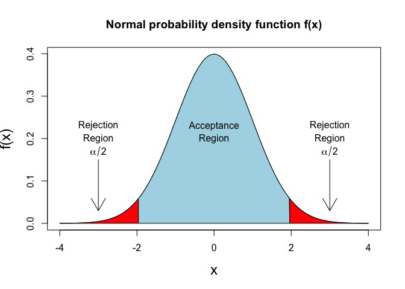
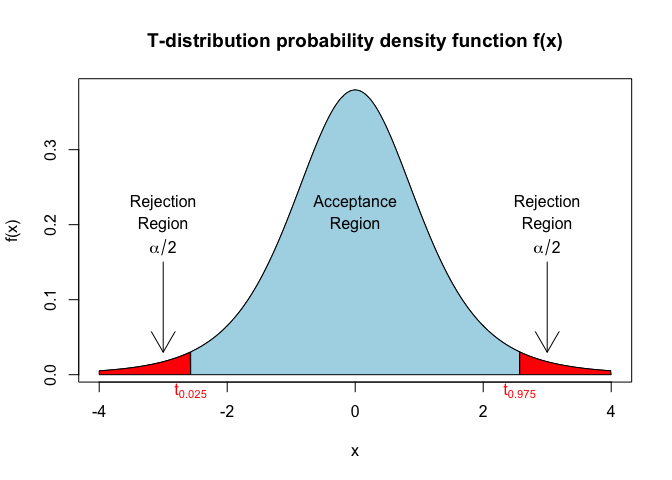
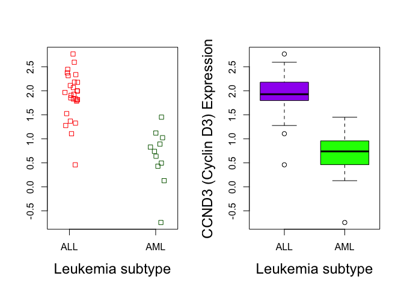
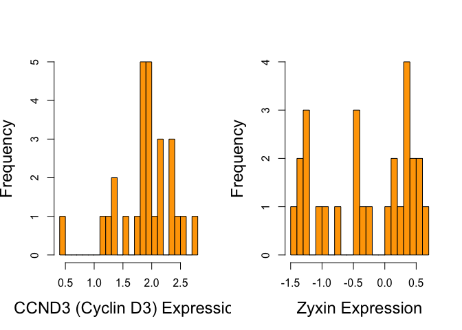
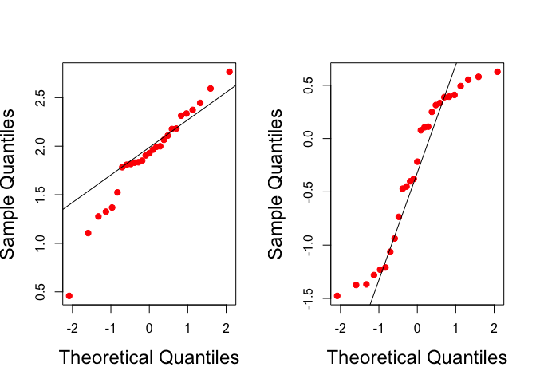

Lecture2. Statistical Test for Genomic Data
================
2025-03-13

### Required Packages

``` r
#if (!requireNamespace("BiocManager", quietly = TRUE))
#install.packages("BiocManager")
#BiocManager::install("multtest")
#install.packages("nortest")
#install.packages("car")
#install.packages("outliers")
#install.packages("ape")
#install.packages("SNPassoc")
#install.packages("genetics")
```

``` r
library(multtest)
```

    ## Loading required package: BiocGenerics

    ## 
    ## Attaching package: 'BiocGenerics'

    ## The following objects are masked from 'package:stats':
    ## 
    ##     IQR, mad, sd, var, xtabs

    ## The following objects are masked from 'package:base':
    ## 
    ##     anyDuplicated, aperm, append, as.data.frame, basename, cbind,
    ##     colnames, dirname, do.call, duplicated, eval, evalq, Filter, Find,
    ##     get, grep, grepl, intersect, is.unsorted, lapply, Map, mapply,
    ##     match, mget, order, paste, pmax, pmax.int, pmin, pmin.int,
    ##     Position, rank, rbind, Reduce, rownames, sapply, saveRDS, setdiff,
    ##     table, tapply, union, unique, unsplit, which.max, which.min

    ## Loading required package: Biobase

    ## Welcome to Bioconductor
    ## 
    ##     Vignettes contain introductory material; view with
    ##     'browseVignettes()'. To cite Bioconductor, see
    ##     'citation("Biobase")', and for packages 'citation("pkgname")'.

``` r
library(nortest)
library(car)
```

    ## Loading required package: carData

``` r
library(outliers)
library(ape)
library(SNPassoc)
```

    ## Registered S3 method overwritten by 'SNPassoc':
    ##   method            from       
    ##   summary.haplo.glm haplo.stats

    ## 
    ## Attaching package: 'SNPassoc'

    ## The following object is masked from 'package:ape':
    ## 
    ##     additive

``` r
library(genetics)
```

    ## Loading required package: combinat

    ## 
    ## Attaching package: 'combinat'

    ## The following object is masked from 'package:utils':
    ## 
    ##     combn

    ## Loading required package: gdata

    ## 
    ## Attaching package: 'gdata'

    ## The following object is masked from 'package:Biobase':
    ## 
    ##     combine

    ## The following object is masked from 'package:BiocGenerics':
    ## 
    ##     combine

    ## The following object is masked from 'package:stats':
    ## 
    ##     nobs

    ## The following object is masked from 'package:utils':
    ## 
    ##     object.size

    ## The following object is masked from 'package:base':
    ## 
    ##     startsWith

    ## Loading required package: gtools

    ## 
    ## Attaching package: 'gtools'

    ## The following object is masked from 'package:car':
    ## 
    ##     logit

    ## Loading required package: MASS

    ## Loading required package: mvtnorm

    ## Registered S3 methods overwritten by 'genetics':
    ##   method                      from    
    ##   print.LD                    SNPassoc
    ##   print.LD.data.frame         SNPassoc
    ##   print.summary.LD.data.frame SNPassoc
    ##   summary.LD.data.frame       SNPassoc

    ## 

    ## NOTE: THIS PACKAGE IS NOW OBSOLETE.

    ## 

    ##   The R-Genetics project has developed an set of enhanced genetics

    ##   packages to replace 'genetics'. Please visit the project homepage

    ##   at http://rgenetics.org for informtion.

    ## 

    ## 
    ## Attaching package: 'genetics'

    ## The following objects are masked from 'package:SNPassoc':
    ## 
    ##     LD, LDplot, LDtable

    ## The following objects are masked from 'package:BiocGenerics':
    ## 
    ##     %in%, order

    ## The following objects are masked from 'package:base':
    ## 
    ##     %in%, as.factor, order

``` r
library(multtest)

data(golub, package = "multtest")
  golubFactor <- factor(golub.cl, levels=0:1, labels=c("ALL","AML"))
  
x <- golub[2058, golubFactor=="ALL"]

n <- length(x)

sigma <- 0.25; mu0 <- 0

z.value <- sqrt(n)*(mean(x) - mu0)/sigma

2*pnorm(-abs(z.value)) # p-value
```

    ## [1] 0.9991094

``` r
f <- function(x) dnorm(x,0,1)
alpha <- 0.05
qz <- qnorm(1-alpha/2)
x1 <- seq(-4, -qz, 0.01); y1 <- dnorm(x1, 0, 1)
x2 <- seq(-qz, qz, 0.01); y2 <- dnorm(x2, 0, 1)
x3 <- seq(qz, 4, 0.01); y3 <- dnorm(x3, 0, 1)
plot(f, -4, 4, cex.lab=1.5, xlab="x", ylab="f(x)",
main="Normal probability density function f(x)")
polygon(c(-4, x1, -qz), c(0, y1, 0), col="red")
polygon(c(-qz, x2, qz), c(0, y2, 0), col="lightblue")
polygon(c(qz, x3, 4), c(0, y3, 0), col="red")
arrows(-3, 0.15, -3, 0.03)
text(-3, 0.23, "Rejection")
text(-3, 0.20, "Region")
text(-3, 0.17, expression(alpha/2))
arrows(3, 0.15, 3, 0.03)
text(3, 0.23, "Rejection")
text(3, 0.20, "Region")
text(3, 0.17, expression(alpha/2))
text(0, 0.23, "Acceptance")
text(0, 0.20, "Region")
```

<!-- -->

### Confidence Interval

``` r
mean(x) + qnorm(0.025) * sigma/sqrt(n)
```

    ## [1] -0.09424511

``` r
mean(x) + qnorm(0.975) * sigma/sqrt(n)
```

    ## [1] 0.09435251

``` r
mean(x) + c(-1, 1) * qnorm(0.975) * sigma / sqrt(n)
```

    ## [1] -0.09424511  0.09435251

### One sample T-test

``` r
f <- function(x) dt(x, 5)
alpha <- 0.05
qt5 <- qt(1-alpha/2, 5)
x1 <- seq(-4, -qt5, 0.01)
y1 <- f(x1)
x2 <- seq(-qt5, qt5, 0.01)
y2 <- f(x2)
x3 <- seq(qt5, 4, 0.01)
y3 <- f(x3)
plot(f, -4, 4, xlab="x", ylab="f(x)",
main="T-distribution probability density function f(x)")
polygon(c(-4, x1, -qt5), c(0, y1 , 0), col="red")
polygon(c(-qt5, x2, qt5), c(0, y2, 0), col="lightblue")
polygon(c(qt5, x3, 4), c(0, y3, 0), col = "red")

arrows(-3, 0.15, -3, 0.03)
text(-3, 0.23, "Rejection")
text(-3, 0.20, "Region")
text(-3, 0.17, expression(alpha/2))
arrows(3, 0.15, 3, 0.03)
text(3, 0.23, "Rejection")
text(3, 0.20, "Region")
text(3, 0.17, expression(alpha/2))
text(0, 0.23, "Acceptance")
text(0, 0.20, "Region")
mtext(expression(t[0.025]), side=1, at=-qt5, col="red")
mtext(expression(t[0.975]), side=1, at=qt5, col="red")
```

<!-- -->

``` r
qt(0.975, 5)
```

    ## [1] 2.570582

``` r
x <- golub[2058, golubFactor=="ALL"]

mu0 <- 0

n <- 27

t.value <- sqrt(n)*(mean(x) - mu0)/sd(x)

t.value
```

    ## [1] 0.001076867

``` r
qt(0.975, 26)
```

    ## [1] 2.055529

``` r
2 * pt(-abs(t.value), 26) # p-value
```

    ## [1] 0.999149

``` r
alpha <- 0.05

mean(x) + c(qt(alpha/2, n-1), qt(1-alpha/2, n-1)) * sd(x)/sqrt(n)
```

    ## [1] -0.1024562  0.1025636

``` r
t.test(x, mu=0) # default two side test
```

    ## 
    ##  One Sample t-test
    ## 
    ## data:  x
    ## t = 0.0010769, df = 26, p-value = 0.9991
    ## alternative hypothesis: true mean is not equal to 0
    ## 95 percent confidence interval:
    ##  -0.1024562  0.1025636
    ## sample estimates:
    ##   mean of x 
    ## 5.37037e-05

``` r
t.test(x, mu=0, alternative = "greater") # one side test
```

    ## 
    ##  One Sample t-test
    ## 
    ## data:  x
    ## t = 0.0010769, df = 26, p-value = 0.4996
    ## alternative hypothesis: true mean is greater than 0
    ## 95 percent confidence interval:
    ##  -0.085006       Inf
    ## sample estimates:
    ##   mean of x 
    ## 5.37037e-05

``` r
t.test(x, mu=0, alternative = "less") # one side test
```

    ## 
    ##  One Sample t-test
    ## 
    ## data:  x
    ## t = 0.0010769, df = 26, p-value = 0.5004
    ## alternative hypothesis: true mean is less than 0
    ## 95 percent confidence interval:
    ##        -Inf 0.08511341
    ## sample estimates:
    ##   mean of x 
    ## 5.37037e-05

``` r
ccnd3 <- grep("CCND3", golub.gnames[,2], ignore.case=TRUE) 
ccnd3
```

    ## [1] 1042

``` r
par(mfrow=c(1,2)) 
stripchart(golub[ccnd3,] ~ golubFactor, method="jitter", cex.lab=1.5, ylab="", vertical = TRUE, col=c("red", "darkgreen"), xlab="Leukemia subtype")

boxplot(golub[ccnd3,] ~ golubFactor, cex.lab=1.5, main=NULL, xlab="Leukemia subtype", col=c("purple","green"), ylab="CCND3 (Cyclin D3) Expression")
```

<!-- -->

``` r
ALL <- golubFactor=="ALL" 
t.test(golub[ccnd3, ALL], mu=0) 
```

    ## 
    ##  One Sample t-test
    ## 
    ## data:  golub[ccnd3, ALL]
    ## t = 20.06, df = 26, p-value < 2.2e-16
    ## alternative hypothesis: true mean is not equal to 0
    ## 95 percent confidence interval:
    ##  1.699817 2.087948
    ## sample estimates:
    ## mean of x 
    ##  1.893883

- t = 20.06 존나 큰 값 -\> 무조건 기각

``` r
t.test(golub[ccnd3, !ALL], mu=0)
```

    ## 
    ##  One Sample t-test
    ## 
    ## data:  golub[ccnd3, !ALL]
    ## t = 3.6249, df = 10, p-value = 0.004651
    ## alternative hypothesis: true mean is not equal to 0
    ## 95 percent confidence interval:
    ##  0.2449118 1.0262701
    ## sample estimates:
    ## mean of x 
    ## 0.6355909

- 0.004이라서 기각이긴한데 살짝 부족함.

``` r
t.test(golub[ccnd3, ALL], mu=0, alternative="greater")
```

    ## 
    ##  One Sample t-test
    ## 
    ## data:  golub[ccnd3, ALL]
    ## t = 20.06, df = 26, p-value < 2.2e-16
    ## alternative hypothesis: true mean is greater than 0
    ## 95 percent confidence interval:
    ##  1.732853      Inf
    ## sample estimates:
    ## mean of x 
    ##  1.893883

``` r
t.test(golub[ccnd3, !ALL], mu=0, alternative="greater") # two side랑 p-v만 다르다.
```

    ## 
    ##  One Sample t-test
    ## 
    ## data:  golub[ccnd3, !ALL]
    ## t = 3.6249, df = 10, p-value = 0.002326
    ## alternative hypothesis: true mean is greater than 0
    ## 95 percent confidence interval:
    ##  0.3177962       Inf
    ## sample estimates:
    ## mean of x 
    ## 0.6355909

``` r
t.test(golub[ccnd3, !ALL], mu=0, alternative="less")
```

    ## 
    ##  One Sample t-test
    ## 
    ## data:  golub[ccnd3, !ALL]
    ## t = 3.6249, df = 10, p-value = 0.9977
    ## alternative hypothesis: true mean is less than 0
    ## 95 percent confidence interval:
    ##       -Inf 0.9533856
    ## sample estimates:
    ## mean of x 
    ## 0.6355909

``` r
t.test(golub[ccnd3, ALL], mu=0, alternative="less")
```

    ## 
    ##  One Sample t-test
    ## 
    ## data:  golub[ccnd3, ALL]
    ## t = 20.06, df = 26, p-value = 1
    ## alternative hypothesis: true mean is less than 0
    ## 95 percent confidence interval:
    ##      -Inf 2.054912
    ## sample estimates:
    ## mean of x 
    ##  1.893883

### Two Sample T-test with Unequal Variances

``` r
ccnd3 <- grep("CCND3", golub.gnames[,2], ignore.case=TRUE) 
ccnd3
```

    ## [1] 1042

``` r
par(mfrow=c(1,2)) 
stripchart(golub[ccnd3,] ~ golubFactor, method="jitter", cex.lab=1.5, ylab="", vertical = TRUE, col=c("red", "darkgreen"), xlab="Leukemia subtype")

boxplot(golub[ccnd3,] ~ golubFactor, cex.lab=1.5, main=NULL, xlab="Leukemia subtype", col=c("purple","green"), ylab="CCND3 (Cyclin D3) Expression")
```

<!-- -->

``` r
data.frame(golub[ccnd3,], y =golubFactor)
```

    ##    golub.ccnd3...   y
    ## 1         2.10892 ALL
    ## 2         1.52405 ALL
    ## 3         1.96403 ALL
    ## 4         2.33597 ALL
    ## 5         1.85111 ALL
    ## 6         1.99391 ALL
    ## 7         2.06597 ALL
    ## 8         1.81649 ALL
    ## 9         2.17622 ALL
    ## 10        1.80861 ALL
    ## 11        2.44562 ALL
    ## 12        1.90496 ALL
    ## 13        2.76610 ALL
    ## 14        1.32551 ALL
    ## 15        2.59385 ALL
    ## 16        1.92776 ALL
    ## 17        1.10546 ALL
    ## 18        1.27645 ALL
    ## 19        1.83051 ALL
    ## 20        1.78352 ALL
    ## 21        0.45827 ALL
    ## 22        2.18119 ALL
    ## 23        2.31428 ALL
    ## 24        1.99927 ALL
    ## 25        1.36844 ALL
    ## 26        2.37351 ALL
    ## 27        1.83485 ALL
    ## 28        0.88941 AML
    ## 29        1.45014 AML
    ## 30        0.42904 AML
    ## 31        0.82667 AML
    ## 32        0.63637 AML
    ## 33        1.02250 AML
    ## 34        0.12758 AML
    ## 35       -0.74333 AML
    ## 36        0.73784 AML
    ## 37        0.49470 AML
    ## 38        1.12058 AML

``` r
t.test(golub[ccnd3,] ~ golubFactor, var.equal=FALSE) # result = > 두 집단은 다르다~
```

    ## 
    ##  Welch Two Sample t-test
    ## 
    ## data:  golub[ccnd3, ] by golubFactor
    ## t = 6.3186, df = 16.118, p-value = 9.871e-06
    ## alternative hypothesis: true difference in means between group ALL and group AML is not equal to 0
    ## 95 percent confidence interval:
    ##  0.8363826 1.6802008
    ## sample estimates:
    ## mean in group ALL mean in group AML 
    ##         1.8938826         0.6355909

``` r
t.test(golub[ccnd3,] ~ golubFactor, var.equal=FALSE, alternative="greater")
```

    ## 
    ##  Welch Two Sample t-test
    ## 
    ## data:  golub[ccnd3, ] by golubFactor
    ## t = 6.3186, df = 16.118, p-value = 4.935e-06
    ## alternative hypothesis: true difference in means between group ALL and group AML is greater than 0
    ## 95 percent confidence interval:
    ##  0.9107706       Inf
    ## sample estimates:
    ## mean in group ALL mean in group AML 
    ##         1.8938826         0.6355909

``` r
t.test(golub[ccnd3,] ~ golubFactor, var.equal=FALSE, alternative="less")
```

    ## 
    ##  Welch Two Sample t-test
    ## 
    ## data:  golub[ccnd3, ] by golubFactor
    ## t = 6.3186, df = 16.118, p-value = 1
    ## alternative hypothesis: true difference in means between group ALL and group AML is less than 0
    ## 95 percent confidence interval:
    ##      -Inf 1.605813
    ## sample estimates:
    ## mean in group ALL mean in group AML 
    ##         1.8938826         0.6355909

### Two Sample T-test with Equal Variances

``` r
t.test(golub[ccnd3,] ~ golubFactor, var.equal=TRUE)
```

    ## 
    ##  Two Sample t-test
    ## 
    ## data:  golub[ccnd3, ] by golubFactor
    ## t = 6.7983, df = 36, p-value = 6.046e-08
    ## alternative hypothesis: true difference in means between group ALL and group AML is not equal to 0
    ## 95 percent confidence interval:
    ##  0.8829143 1.6336690
    ## sample estimates:
    ## mean in group ALL mean in group AML 
    ##         1.8938826         0.6355909

### Test for Equal Variances

``` r
ccnd3 <- grep("CCND3", golub.gnames[,2], ignore.case=TRUE) 
zyxin <- grep("Zyxin", golub.gnames[,2], ignore.case=TRUE)
```

``` r
# 각 그룹별 분산의 차이 
tapply(golub[ccnd3,], golubFactor, var) 
```

    ##       ALL       AML 
    ## 0.2406642 0.3381806

``` r
tapply(golub[zyxin,], golubFactor, var)
```

    ##       ALL       AML 
    ## 0.5224983 0.1351442

``` r
var.test(golub[ccnd3, ] ~ golubFactor) 
```

    ## 
    ##  F test to compare two variances
    ## 
    ## data:  golub[ccnd3, ] by golubFactor
    ## F = 0.71164, num df = 26, denom df = 10, p-value = 0.4652
    ## alternative hypothesis: true ratio of variances is not equal to 1
    ## 95 percent confidence interval:
    ##  0.2127735 1.8428387
    ## sample estimates:
    ## ratio of variances 
    ##          0.7116441

``` r
var.test(golub[zyxin, ] ~ golubFactor) # pooled 못 쓴다..
```

    ## 
    ##  F test to compare two variances
    ## 
    ## data:  golub[zyxin, ] by golubFactor
    ## F = 3.8662, num df = 26, denom df = 10, p-value = 0.02968
    ## alternative hypothesis: true ratio of variances is not equal to 1
    ## 95 percent confidence interval:
    ##   1.155958 10.011795
    ## sample estimates:
    ## ratio of variances 
    ##           3.866228

``` r
bartlett.test(golub[ccnd3,] ~ golubFactor) 
```

    ## 
    ##  Bartlett test of homogeneity of variances
    ## 
    ## data:  golub[ccnd3, ] by golubFactor
    ## Bartlett's K-squared = 0.42236, df = 1, p-value = 0.5158

``` r
bartlett.test(golub[zyxin,] ~ golubFactor)
```

    ## 
    ##  Bartlett test of homogeneity of variances
    ## 
    ## data:  golub[zyxin, ] by golubFactor
    ## Bartlett's K-squared = 5.036, df = 1, p-value = 0.02483

``` r
fligner.test(golub[ccnd3,], golubFactor) 
```

    ## 
    ##  Fligner-Killeen test of homogeneity of variances
    ## 
    ## data:  golub[ccnd3, ] and golubFactor
    ## Fligner-Killeen:med chi-squared = 0.14115, df = 1, p-value = 0.7071

``` r
fligner.test(golub[zyxin,], golubFactor)
```

    ## 
    ##  Fligner-Killeen test of homogeneity of variances
    ## 
    ## data:  golub[zyxin, ] and golubFactor
    ## Fligner-Killeen:med chi-squared = 7.2671, df = 1, p-value = 0.007023

``` r
library(car) 
leveneTest(golub[ccnd3,], golubFactor) 
```

    ## Levene's Test for Homogeneity of Variance (center = median)
    ##       Df F value Pr(>F)
    ## group  1  0.1336 0.7169
    ##       36

``` r
leveneTest(golub[zyxin,], golubFactor)
```

    ## Levene's Test for Homogeneity of Variance (center = median)
    ##       Df F value   Pr(>F)   
    ## group  1  9.2119 0.004448 **
    ##       36                    
    ## ---
    ## Signif. codes:  0 '***' 0.001 '**' 0.01 '*' 0.05 '.' 0.1 ' ' 1

### Histogram and Q-Q plot(정규성 검정)

``` r
# histogram
par(mfrow=c(1,2)) 
hist(golub[ccnd3, golubFactor=="ALL"], cex.lab=1.5, col="orange",nclass=20, main=NULL, xlab="CCND3 (Cyclin D3) Expression") 
hist(golub[zyxin, golubFactor=="ALL"], cex.lab=1.5, col="orange",nclass=20, main=NULL, xlab="Zyxin Expression")
```

<!-- -->

``` r
# q-q plot
par(mfrow=c(1,2)) 
qqnorm(golub[ccnd3, golubFactor=="ALL"], pch=19, cex.lab=1.5, col="red", main=NULL) 
qqline(golub[ccnd3, golubFactor=="ALL"]) 

qqnorm(golub[zyxin, golubFactor=="ALL"], pch=19, cex.lab=1.5,col="red", main=NULL) 
qqline(golub[zyxin, golubFactor=="ALL"])
```

<!-- -->

### Normality Tests

``` r
shapiro.test(golub[ccnd3, golubFactor=="ALL"]) 
```

    ## 
    ##  Shapiro-Wilk normality test
    ## 
    ## data:  golub[ccnd3, golubFactor == "ALL"]
    ## W = 0.94663, p-value = 0.1774

``` r
shapiro.test(golub[ccnd3, golubFactor=="AML"]) 
```

    ## 
    ##  Shapiro-Wilk normality test
    ## 
    ## data:  golub[ccnd3, golubFactor == "AML"]
    ## W = 0.91756, p-value = 0.2989

``` r
shapiro.test(golub[zyxin, golubFactor=="ALL"]) # reject H_0
```

    ## 
    ##  Shapiro-Wilk normality test
    ## 
    ## data:  golub[zyxin, golubFactor == "ALL"]
    ## W = 0.89198, p-value = 0.00881

``` r
shapiro.test(golub[zyxin, golubFactor=="AML"]) 
```

    ## 
    ##  Shapiro-Wilk normality test
    ## 
    ## data:  golub[zyxin, golubFactor == "AML"]
    ## W = 0.96378, p-value = 0.8178

``` r
library(nortest) 
ad.test(golub[ccnd3, golubFactor=="ALL"]) 
```

    ## 
    ##  Anderson-Darling normality test
    ## 
    ## data:  golub[ccnd3, golubFactor == "ALL"]
    ## A = 0.52154, p-value = 0.1683

``` r
ad.test(golub[zyxin, golubFactor=="ALL"])
```

    ## 
    ##  Anderson-Darling normality test
    ## 
    ## data:  golub[zyxin, golubFactor == "ALL"]
    ## A = 1.013, p-value = 0.009583
