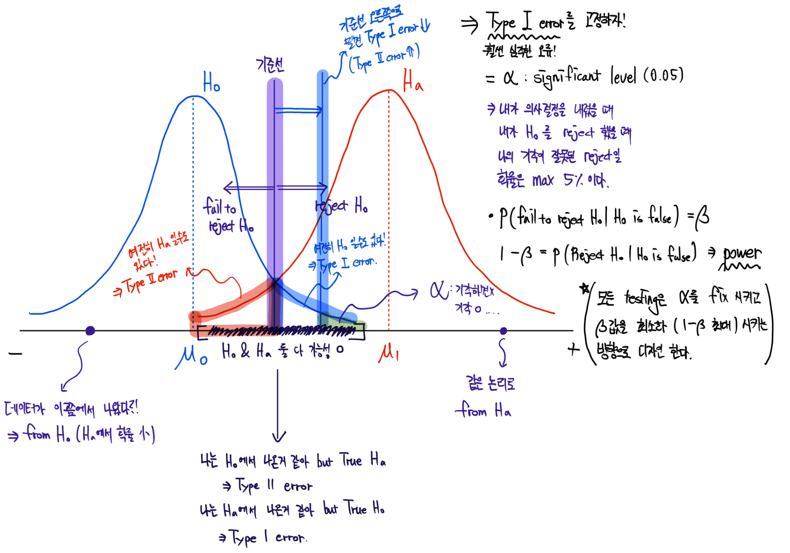
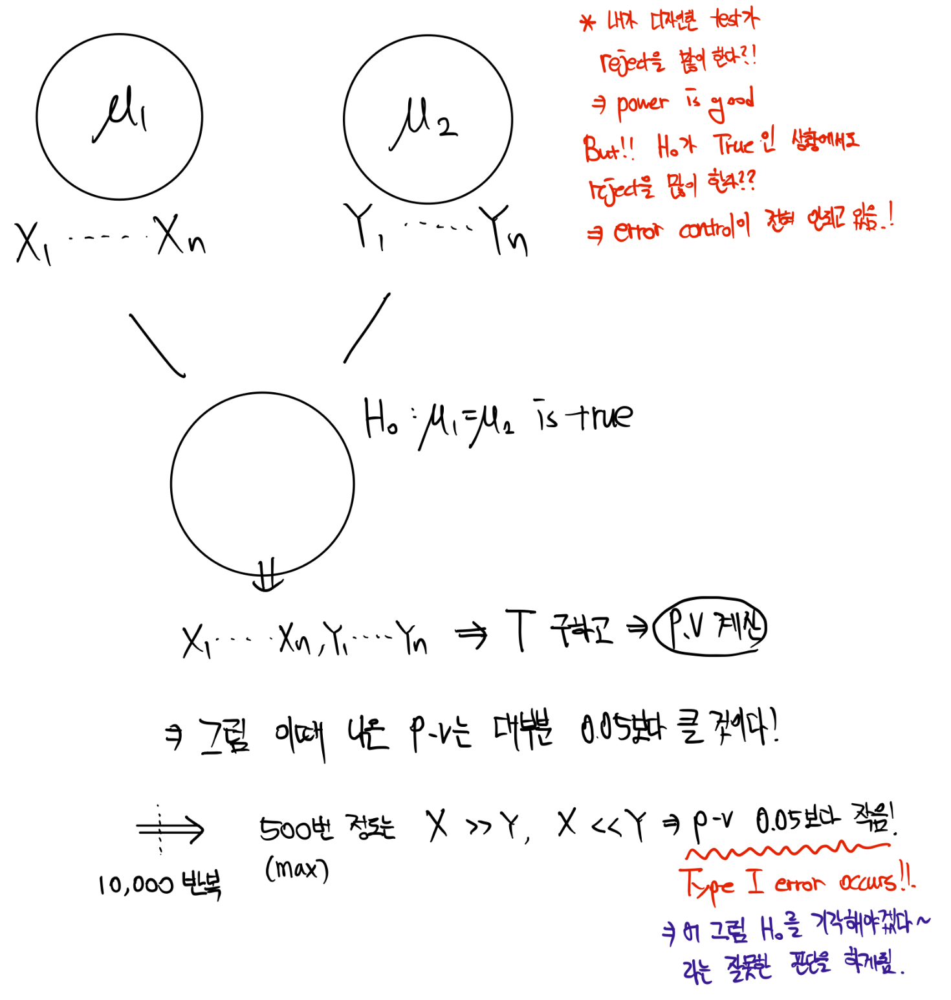
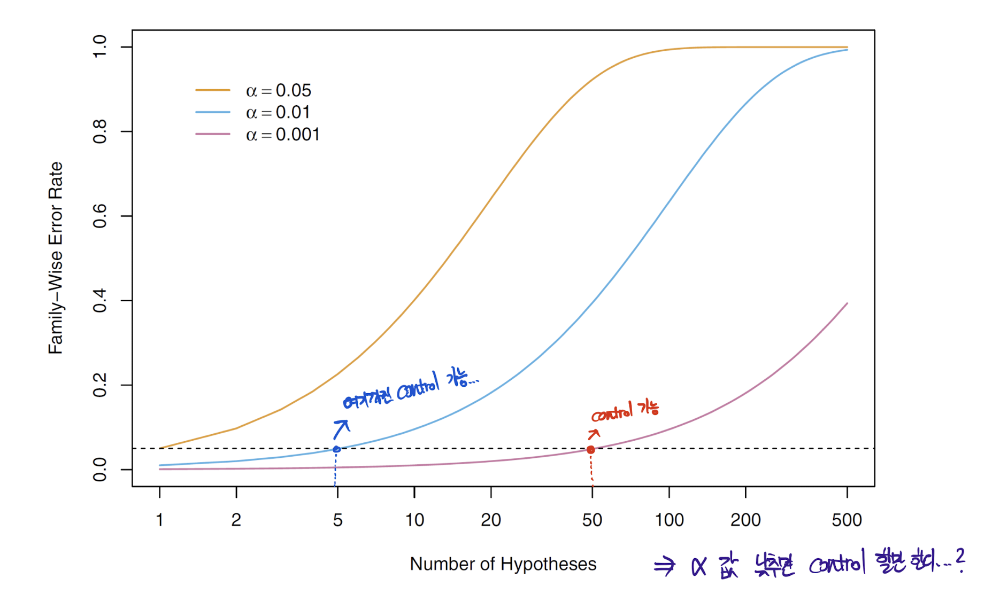
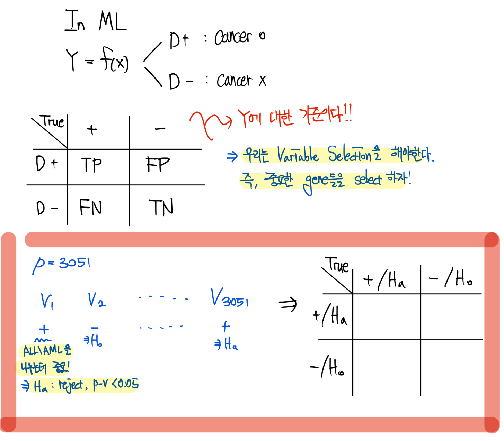
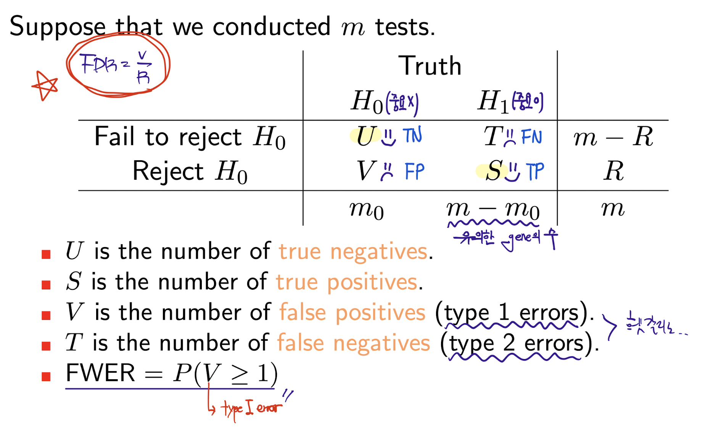
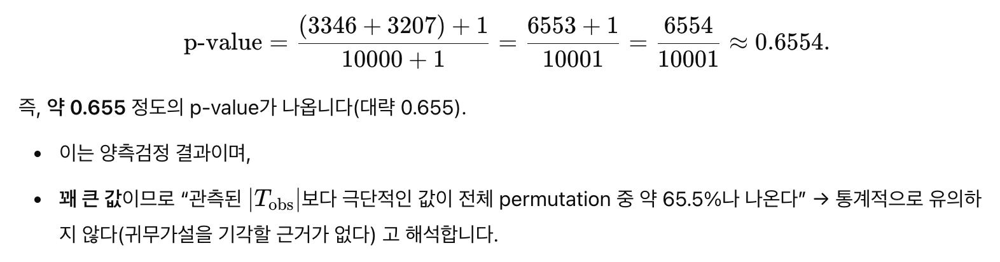
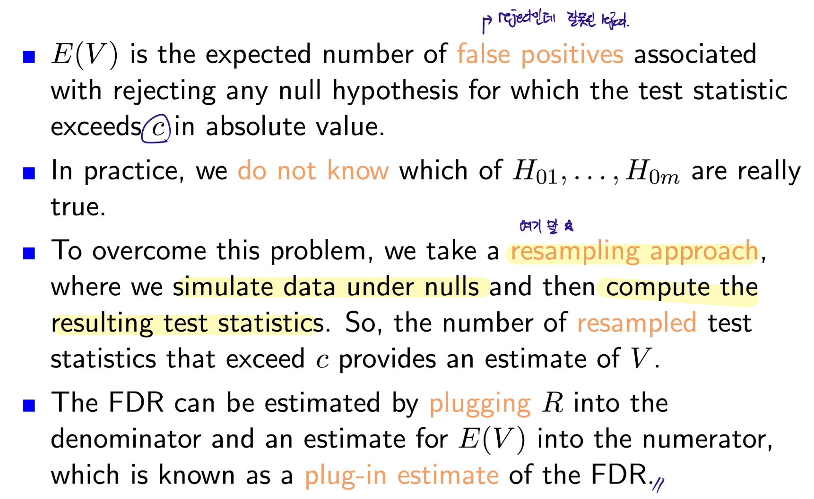

```{r}
library(multtest)
library(ISLR2)
library(qqman)
library(RColorBrewer)
```

## Introduction to Multiple Testing

-   기존의 검정은 single null hypothesis를 testing을 하였다.

-   이번에는 huge amounts of data에서 **great many null hypotheses** test를 진행한다.

-   We might want to test $m$ null hypotheses.

$$
H_{01}, H_{02},H_{03},H_{04},...,H_{0m}
$$

-   $H_{01}$ -\> 1 번째 gene에 대해서 ALL, AML 두 집단의 평균이 같을 것이다...

-   이런 검정을 모든 Gene에 대해서 다 진행을 한다.

-   여기서 문제를 우리가 이런 multiple testing에 대한 해석을 어떻게 할 것인가 이다! (즉, error control를 어떻게 할까?)

-   **False Discovery Rate (FDR)**로 조지자!

-   FDR를 공부하기전에 빌드업 조지자...

## Type l and Type ll Errors

In single test...

-   True 값은 우리가 알 수 없다.

|                         | **Truth(우리가 알 수 없는 값)** |                   |
|-----------------------|-------------------------------|------------------|
| **Decision(판단 결과)** | **H₀ (True Null)**              | **H₁ (True Alt)** |
| Accept H₀               | ✅ (Correct)                    | ❌ Type II Error  |
| Reject H₀               | ❌ Type I Error                 | ✅ (Correct)      |

-   오류가 발생하는 Case

    -   $H_0$가 참인데 우리의 데이터를 기반으론 P-value가 0.05보다 낮은 상황이 나와서 $H_0$를 기각을 한다면 우리는 그것을 **Type I error** 라고 한다.

        > $H_0$ is in fact true -\> reject $H_0$ -\> Type I error.

    -   $H_0$가 거짓이고 이때는 무조건 기각을 해야하는데 못했어 엉엉 ㅠㅠ -\> **Type II error**

    -   Ideally we would like both the Type I and Type II error rates to be small..

        > 하지만 이놈들은 Trade-off 관계쥬,,



-   α = 0.05는 **1종 오류의 허용 수준**.

-   다시 말해, H₀가 참일 때에도 **5% 확률로 H₀를 잘못 기각할 수 있음**을 감수하겠다는 의미.

-   **p-value = 0.03**은 **"귀무가설이 참일 때 이 정도 극단적인 데이터가 나올 확률이 3%"** 라는 뜻이지,

-   **"내가 틀릴 확률이 3%"는 아니다!**

-   α는 null hypothesis가 참이라는 가정 하에서, 검정 통계량이 우연히 극단적인 값으로 나올 확률의 기준선(상한)"이다.



## Multiple Testing Problems

-   Suppose that we investigate 3,051 genes, carrying out a t-test for each gene to see if the expression level of the gene differed between ALL and AML patients.

> 하나의 testing이 아닌 이젠 3051개의 genes의 두 그룹의 testing을 해야함. 즉, 3051번의 testing...

-   그럼 what is the probaility that we would reject **at least one null hypothesis** even if all null hypotheses are true????

> 3051의 genes들을 0.05 기준에서 3051번 테스팅하면... 적어도 하나의 type I error가 3051개 중에서 나올 확률?

\$\$ \begin{align*}P(\text{At least one error}) &= 1 - P(\text{No errors}) \\&= 1 - (1 - \alpha)^{3051} \\&= 1 - (0.95)^{3051} \\&\approx 1\end{align*}

\$\$

-   즉, 적어도 type I error (False positive)가 나올 확률은 100%이다..

-   위의 내용을 m개로 일반화하여 정리하면

| P(·)   | m   | P(·)   | m   |
|--------|-----|--------|-----|
| 0.05   | 1   | 0.4013 | 10  |
| 0.0975 | 2   | 0.6415 | 20  |
| 0.1426 | 3   | 0.9941 | 100 |

-   testing의 수 m이 커질수록 적어도 하나 이상의 type I error가 발생할 확률이 1에 가까워짐

-   원래는 0.05 수준에서 실험의 오류를 통제하고 싶었음..

-   즉, m이 커지며서 error control이 안되고 있다..! -\> 이 문제를 해결해야겠농!!

-   m이 커지면서 우리는 True null을 계속 reject하고 있다....(can make a large number of Type I errors)

## Family-Wise Error Rate

-   Family-Wise Error Rate (FWER)은 다중검정 상황에서 "적어도 하나의 Type I error가 발생할 확률"을 의미한다.

$$
\text{FWER} = 1 - (1 - \alpha)^m
$$

-   우리가 원하는 것은 $\text{FWER}$이 $0.05$가 되는 것이다..!

-   자 이제 다음의 방법들로 $\text{FWER}$을 Control해보자..!



> $\alpha$ 값 낮추면 control이 되는 것 처럼 보이지만 그 만큼 $\beta$의 값이 커서 power가 떨어진다... ㅠ

## Bonferroni Adjustment

-   원래는 각 testing에서 유의수준 $\alpha = 0.05$로 판단하지만

-   testing 개수가 $m$개이면, 각 검정에 대해 더 작은 기준을 적용해야 전체 오류가 $\alpha$를 넘지 않음!!

$$
\alpha^* = {\alpha\over m}
$$

-   즉, 각각의 testing에 대해 a/m을 새로운 기준으로 사용!!

-   Suppose that we performed $m$ tests and obtained $m$ $p$-values such as

$$
p_1, p_2,...,p_{m-1},p_m
$$

-   The i-th gene is statisticall significant (reject) if

$$
p_i < {\alpha \over m} => mp_i < \alpha
$$

> 근데 이러면 reject를 잘못해서 power가 너무 떨어지지 않나..?
>
> 위의 예제로 보면... 알파 스타가 0.0000163인데... 이것보다 작아야 reject인데

-   The $i$ -th adjusted $p$-value can be computed such that

$$
P_i^* = \text{min}(mp_i, 1)
$$

-   Then, the $i$-th gene is statistically significant if

$$
p_i^* < \alpha
$$

```{r}
data(golub, package = "multtest")
golubFactor = factor(golub.cl, levels = 0:1, labels = c("ALL", "AML"))

```

```{r}
pval = NULL
m = nrow(golub)

for (i in 1 : m){
  # 총 3051개의 pvalue 계산
  
  pval[i] = t.test(golub[i, ] ~ golubFactor)$p.val
}

```

```{r}
sum(pval < 0.05) # 3051 중 reject한 갯수 1078
3051 * 0.05 # 152.55
```

-   유의수준 0.05를 기준으로 각각 따로 판단했기 때문에,

-   전부 H_0가 참이어도 5% 정도는 우연히 기각될 수 있음..

-   즉, 1078개 중 일부는 실제로 차이가 없는데도 (H_0가 true) 유의하다(reject H_0)고 잘못 판단했을 가능성 있음

```{r}
# adjusted pvalue
sum(pval < 0.05 / m) # 103개


```

```{r}
top = 20
oo = order(pval)
oot = oo[1:top]
data.frame(gene = golub.gnames[oot, 3],
           pvalue = pval[oot])
```

-   p-value가 작으면 작을수록 signal이 쌔다!! -\> ALL, AML을 구별하는데 좋은 gene이다!

```{r}
oot = oo[1:104]
data.frame(gene = golub.gnames[oot, 3],
           pvalue = pval[oot])
```

```{r}
pj = p.adjust(pval, method = "bonferroni")
sum(pj < 0.05)
```

```{r}
top <- sum(pj < 0.05)
oo <- order(pval)
oot <- oo[1:top]
data.frame(gene=golub.gnames[oot, 3], pvalue=pval[oot],
            adj.pvalue=pj[oot])
```

```{r}
oot <- oo[1:104]
data.frame(gene=golub.gnames[oot, 3], pvalue=pval[oot],
            adj.pvalue=pj[oot])
```

```{r}
par(mfrow=c(1,2))
hist(pval, col="orange", xlab="", main="Un-adjusted p-values")
hist(pj, col="purple", xlab="", main="Adjusted p-values")

```

```{r}
par(mfrow=c(1,1))
plot(-log10(pval), type="p", pch=20, col="red", xlab="Gene")
abline(h=-log10(0.05/m), lty=2)
```

-   The Bonferroni correction is by far the best - known and most commonly use multiplicity correction

-   However, the Bonferroni correction can be quite conservative since the true FWER is often lower than the nominal FWER.

> reject가 잘 안됨... signal이 진짜 강해야지 reject가 됨..

-   이제 FWER을 control하면서 power를 높이는 방법을 배워보자...

## Holm's Step-Down Procedure

-   The threshold of Holm's method depends on the values of all $m$ of the $p$-values

-   while Bon reject any null hypo for which $p$-values is below $\alpha/m$

> Holm는 m에 따라 p-value의 threshold가 변한다...!

### Algorithm 13.1: *Holm’s Step-Down Procedure to Control the FWER*

1.  Specify **α**, the level at which to control the FWER.

2.  Compute *p*-values, $p_1, \ldots, p_m$, for the *m* null hypotheses\
    $H_{01}, \ldots, H_{0m}$.

3.  Order the *m* *p*-values so that\
    $$
    p_{(1)} \leq p_{(2)} \leq \cdots \leq p_{(m)}.
    $$

4.  Define\
    $$
    L = \min \left\{ j : p_{(j)} > \frac{\alpha}{m + 1 - j} \right\}.
    \tag{13.7}
    $$

5.  Reject all null hypotheses $H_{0j}$ for which $p_j < p_{(L)}$.

```{r}
ph = p.adjust(pval, method = "holm")
sum(ph < 0.05)
```

```{r}
top = sum(ph < 0.05)
oo  = order(pval)
oot = oo[1:top]
data.frame(gene=golub.gnames[oot, 3], pvalue=pval[oot],
Bonferroni=pj[oot], Holm=ph[oot])
```

```{r}
oot = oo[1:104]
data.frame(gene=golub.gnames[oot, 3], pvalue=pval[oot],
Bonferroni=pj[oot], Holm=ph[oot])
```

> adjusted pvalue 구하는 과정..-\>orignal p-value 구하고 그걸 변환을 조진다..!

```{r, warning=FALSE}
pval2 = NULL

for (i in 1:m){
  pval2[i] = wilcox.test(golub[i,] ~ golubFactor)$p.val
}

pj2 = p.adjust(pval2, method = "bonferroni")
ph2 = p.adjust(pval2, method = "holm")

c(3051 * 0.05, sum(pval2 < 0.05), sum(pj2 < 0.05), sum(ph2< 0.05))
# FWER CONTROL 가능하다.
```

```{r}
top <- sum(pj2 < 0.05)
oo <- order(pval2)
oot <- oo[1:top]
data.frame(gene=golub.gnames[oot, 3], pvalue=pval2[oot],
            Bonferroni=pj2[oot], Holm=ph2[oot])
```

```{r}
p2 <- sort(-log10(pval2), decreasing=TRUE)
p3 <- sort(p2[1:92])
plot(p3, type="p", xlab="ordered p-value", ylab="p-value")
w2 <- which(pj2 < 0.05)
thb <- -log10(max(pval2[w2]))
w3 <- which(ph2 < 0.05)
thh <- -log10(max(pval2[w3]))
abline(h=thb, col="red", lty=3)
abline(h=thh, col="blue", lty=3)
```

```{r}
p2 <- sort(-log10(pval2), decreasing=TRUE)
p3 <- sort(p2[80:92])
plot(p3, type="p", xlab="ordered p-value", ylab="p-value")
w2 <- which(pj2 < 0.05)
thb <- -log10(max(pval2[w2]))
w3 <- which(ph2 < 0.05)
thh <- -log10(max(pval2[w3]))
abline(h=thb, col="red", lty=3) # Bonferroni
abline(h=thh, col="blue", lty=3) # Holm
```

-   -log p-value이므로 y가 클수록 p-value는 작은거임

-   그래프를 보면 Bon보다 Holm이 더 많이 reject를 하고 있는 걸 알 수 있음.

### 

## Trade - Off Between the FEWR and Power

-   Controlling the FWER at level $\alpha$ guarantees that the data analyst is very unlikely to reject any true null hypo

-   So, **the power will be extemely low.**

-   When $m$ is large, we may be willing to tolerate a few false positives, in the interest of making more discoveries.

> 에러 좀 나오면 어때 슈바... 좀 의미 있는 걸 찾아보자! -\> power를 좀 높여보자 (당연히 error control이 가능한 선에서..)

## False Discovery Rate (FDR)

-   Instead of trying to control the overall probability of a type I error,

-   The FDR estimates the proportion of significant findings that are type I errors.

> 우리가 유의해! significant해! 라고 말한것들 중에서... 잘못판단한 비율은 얼마일가..?

$$
\text{FDR} = E({V\over R})
$$

-   $V$ is the number of type I error(\# of false positive)

-   $R$ is the number of rejections among $m$ tests.

### Interpretation of FDR

-   If a cutoff of $\alpha$ for the individual hypo tests results in $R$ significant findings

-   the FDR is approximately

$$
\text{FDR} \approx {m\alpha \over R}
$$

-   For example, 663 tests among 3051 are statistically significant at $\alpha = 0.01$.

-   We would have expected 3051 \* 0.01 = 30.51 false positives(type I errors).

-   Thus, the FDR for the $p$-value cutoff is

$$
\text{FDR} = {30.51 \over 663} = 0.046 (\text{내가 reject 한거에서 잘못된 놈의 비율})
$$

-   We can expect rough;y 4.6% of thes 663 genes to be **spurious results**.

## False Discovery Rate



-   Statistical Decision

    -   Fail to reject $H_0$ : Not significant (negative, favor to $H_0$)

    -   **Reject** $H_0$ **: Statistically significant (positive, favor to** $H_1$**)**



## FDR vs FWER

-   Note that we might not have any rejections ($R$ = 0), if all tests are not statistically significant.

-   Since $R$ = 0 with positive probability, we must define the FDR to be when $R$ = 0, hence we find that

$$
\text{FDR} = E({V \over R}|R>0)P(R>0) + E({V \over R} | R = 0)P(R = 0) \newline 
= E({V \over R}|R >0)P(R>0)
$$

> $R$ =0, 즉, 하나도 reject가 안된 경우 FDR을 구하기 힘들다.

-   If we assume that nulls $H_0$ are tre then $V = R$, hence

$$
FDR = P(P \ge 1) => \text{FDR = FWER}
$$

-   With FWER, we want to limit the probability of making even a 'single' mistake.

-   On the other hand, FDR explicitly allows us to make some mistakes.

## How to Control FDR

-   우리는 BH procedure만 수행한다..!

## Benjamini-Hochberg procedure

### ■ Benjamini and Hochberg (BH) Adjustment

① Let $p_{(1)}, \ldots, p_{(m)}$ denote the ordered observed *p*-values such that: $$
p_{(1)} \leq p_{(2)} \leq \cdots \leq p_{(m)} -> \text{어디서 cut 할까?}
$$ and let the corresponding null hypotheses be given by\
$$
H_0^{(1)}, H_0^{(2)}, \ldots, H_0^{(m)}.
$$

② Define\
$$
k = \max \left\{ i : p_{(i)} \leq \frac{i}{m} q \right\}
$$

$$
P_{(i)} {m \over i} < q
$$

> FDR은 모든 p-value p(i)가 Null이라고 생각한거임.

where $q$ is the level at which we want to control the FDR. ($q = 0.1, 0.05, 0.2....$)

③ Reject\
$$
H_0^{(1)}, H_0^{(2)}, \ldots, H_0^{(k)}.
$$

-   We can also get adjusted $p$-values for the $i$-th test by letting

$$
p_i^* = p_i{m \over i}
$$

-   However after this adjustment the adjusted $p$-values may on longer be strictly increasing, hence you would go through and fix that up with

$$
p_i^{**} = min_{j \ge i} p_j^*
$$

> 나는 FDR를 10% 이내로 control하고 싶어 -\> $p_i^{**}$가 0.1보다 작은 거 다 reject ㄱㄱ

```{r}
data(golub, package = "multtest")
golubFactor <- factor(golub.cl,levels=0:1,labels= c("ALL","AML"))
```

```{r}
pval <- NULL
m <- nrow(golub)
for (i in 1:m) {
  pval[i] <- t.test(golub[i, ] ~ golubFactor)$p.val
}
```

```{r}
pj <- p.adjust(pval, method="bonferroni")
pBH <- p.adjust(pval, method="BH")
c(sum(pj < 0.05), sum(pBH < 0.05)) # 여기서 0.05는 q?
```

-   `sum(pBH < 0.05)` : FDR을 5% 이내로 유지하겠다 라난 뜻..

```{r}
695 * 0.05 # FP의 수는 34.75개 정도가 나올 것이다. 그 이상 나오면 안됨.
```

```{r}
q <- 0.05
poo <- sort(pval)
wh <- which(poo < q*(1:m)/m)
whh <- 1:max(wh)
```

```{r}
plot(poo, pch=20, ylab="P-values", xlab="Genes", main="")
points(whh, poo[whh], col=4, pch=20)
abline(a=0, b=q/m, col=2)
abline(h=q/m, col="darkgreen")
```

```{r}
top <- 1000
poot <- poo[1:top]
plot(poot, pch=20, ylab="P-values", xlab="Genes", main="")
points(whh, poot[whh], col=4, pch=20)
abline(a=0, b=q/m, col=2)
abline(h=q/m, col="darkgreen")
```

## Resampling Approach to Compute $p$ -value

-   One representative resampling approach to compute an empirical $p$-value is permutation.

-   검정 통계량이 t-분포를 따른다는 보장이 없고 데이터가 정규성을 안따르거나 그러한 상황일때 $p$-value를 계산하기 위해..

```{r}
library(ISLR2)
data(Khan)
?Khan
str(Khan)
```

```{r}
attach(Khan)
x <- rbind(xtrain , xtest)
y <- c(as.numeric(ytrain), as.numeric(ytest))
dim(x)
table(y)
```

```{r}
x <- as.matrix(x)
x1 <- x[which(y == 2), ]
x2 <- x[which(y == 4), ]
n1 <- nrow(x1)
n2 <- nrow(x2)
```

```{r}
k <- 11 # 11번째 gene 선택

# 정규성 검정
shapiro.test(x1[, k])
shapiro.test(x2[, k])

# 등분산성 검정
bartlett.test(c(x1[,k], x2[,k]) ~ rep(1:2, c(n1, n2)))
```

```{r}
t.out <- t.test(x1[, k], x2[, k], var.equal=TRUE)
t.out$statistic
t.out$p.value
```

```{r}
# resampling
set.seed(1)
B = 10000
T = rep(NA, B)
for (j in 1:B){
  dat = sample(c(x1[, k], x2[, k]))
  T[j] = t.test(dat[1:n1], dat[(n1 + 1) : (n1 + n2)], var.equal = TRUE)$statistic
}
(sum(abs(T) >= abs(t.out$statistic))+1)/(B+1)
```

```{r}
hist(T, breaks=100, xlim=c(-4.2, 4.2), main="",
xlab="Null Distribution of Test Statistic", col=7)
x0 <- seq(-4.2, 4.2, len=1000)
y0 <- dt(seq(-4.2, 4.2, len=1000), df=(n1 + n2 - 2))
lines(x0, y0*1000, col=2, lwd=3)
TT <- t.out$statistic
abline(v=-TT, col=4, lty=2, lwd=2)
abline(v=TT, col=4, lty=2, lwd=2)
text(TT-1, 350, paste("T = ", round(TT, 4), sep=""), col=4)
```

```{r}
sum(T <= - abs(t.out$statistic))
sum(T >= abs(t.out$statistic))
```

```{r}
k <- 877
shapiro.test(x1[, k])
shapiro.test(x2[, k])
bartlett.test(c(x1[,k], x2[,k]) ~ rep(1:2, c(n1, n2)))
```

```{r}
T <- rep(NA, B)
set.seed(2)
for (j in 1:B) {
    dat <- sample(c(x1[, k], x2[, k]))
    T[j] <- t.test(dat[1:n1], dat[(n1 + 1):(n1 + n2)],
        var.equal=FALSE)$statistic
}
```

```{r}
t.out <- t.test(x1[, k], x2[, k], var.equal=FALSE)
t.out$p.value
(sum(abs(T) >= abs(t.out$statistic))+1)/(B+1)
```

```{r}
hist(T, breaks=100, xlim=c(-2.9, 2.9), main="",
xlab="Null Distribution of Test Statistic", col=7)
x0 <- seq(-2.9, 2.9, len=1000)
y0 <- dt(seq(-2.9, 2.9, len=1000), df=(n1 + n2 - 2))
lines(x0, y0*500, col=2, lwd=3)
TT <- t.out$statistic
abline(v=-TT, col=4, lty=2, lwd=2)
abline(v=TT, col=4, lty=2, lwd=2)
text(TT-1, 200, paste("T = ", round(TT, 4), sep=""), col=4)
```

```{r}
sum(T <= - abs(t.out$statistic))
sum(T >= abs(t.out$statistic))
```



## Resampling Approach to control FDR

-   In order to estimate the FDR via resampling, we make the follow approx

$$
\text{FDR} = E({V \over R}) \approx {E(V) \over R}
$$

-   where the total number of rejections $R$

$$
R = \sum^m_{j=1}{I}(|T_j| \gt c)
$$

-   with a threshold $c$.



1.  $V$: 실제로는 귀무가설이 참인 가설들 중, 우리가 잘못 기각해 버린 것들의 총수 (FP)
2.  $E(V)$: 그 "거짓 기각된 것들"의 기댓값..

-   하지만 문제는 우리가 실제로는 어떤 H_0가 참인지 모른다는 점..

-   그래서 Resampling을 통한 귀무가설이 참일 때 데이터를 만들어보자..!

### Plug-In FDR for a two-sided test

1.  **Select a threshold** $c > 0$.

2.  **For** $j = 1, \ldots, m$ (i.e., for each test):

    1.  Compute the observed test statistic $T_j$ based on **original data**.
    2.  For $b = 1, \ldots, B$, compute the test statistic $T_{j,b}^*$ based on the $b$-th permuted data.

3.  **Compute** $$
    R \;=\; \sum_{j=1}^{m} \mathbf{I}\bigl(\lvert T_j\rvert \;\ge\; c\bigr).
    $$ (i.e., the number of rejected hypotheses under threshold $c$.)

4.  **Compute** $$
    \hat{V}
    \;=\;
    \frac{1}{B}
    \sum_{b=1}^{B}
    \sum_{j=1}^{m}
    \mathbf{I}\bigl(\lvert T_{j,b}^*\rvert \;\ge\; c\bigr).
    $$ (i.e., the average number of “extreme” cases from permuted data.)

5.  **The estimated FDR** associated with the threshold $c$ is $$
    \widehat{\text{FDR}}(c)
    \;=\;
    \frac{\hat{V}}{R}.
    $$

```{r}
m <- 200
B <- 1000
```

```{r}
set.seed(111)
index <- sample(2308, m)
T <- rep(NA, m)
T.star <- matrix(NA, nrow=m, ncol=B)
```

```{r}
for (j in 1:m){
  k = index[j]
  T[j] = t.test(x1[, k], x2[, k], var.equal = TRUE)$statistic
  for (b in 1:B){
    dat = sample(c(x1[, k], x2[, k]))
    T.star[j, b] = t.test(dat[1:n1], dat[(n1+1) : (n1+n2)], var.equal = TRUE)$statistic
  }
}
```

```{r}
c <- sort(abs(T))
FDR <- R <- V <- rep(NA, m)
for (j in 1:m) {
R[j] <- sum(abs(T) >= c[j])
V[j] <- sum(abs(T.star) >= c[j])/B
FDR[j] <- V[j]/R[j]
}
plot(R, FDR, xlab="Number of Rejections", type="l",
ylab="False Discovery Rate", col=4, lwd=3)
```

```{r}
oo <- order(abs(T))
R[oo] <- R
FDR[oo] <- FDR
alpha <- 0.1
max(R[FDR <= alpha])
sort(index[FDR <= alpha])
```

```{r}
pval <- NULL
for (j in 1:m) {
  k <- index[j]
  pval[j] <- t.test(x1[, k], x2[, k], var.equal=TRUE)$p.value
}
pBH <- p.adjust(pval, method="BH")
data.frame(Reampling=round(FDR, 6), BH=round(pBH, 6))

oo <- order(pBH)
plot(FDR[oo], pBH[oo], pch=20, xlab="Reampling FDR",
  ylab="BH procedure")
abline(0, 1, col="red", lty=2)
```

## Manhanttan Plot

셤 끝나고 ㄱㄱ
