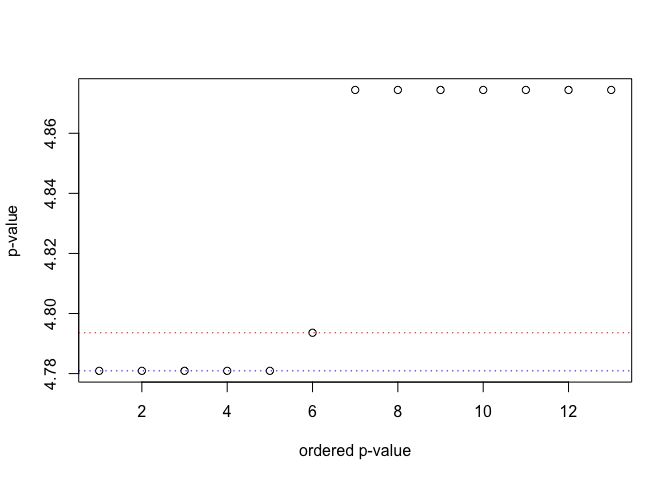
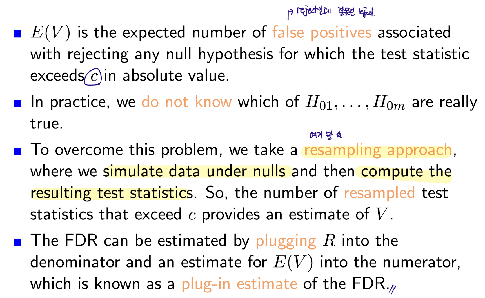

Lecture3 : Multiple Testing Procedure
================
KIM SANG HYUN(202211545)
2025-04-01

- [Introduction to Multiple Testing](#introduction-to-multiple-testing)
- [Type l and Type ll Errors](#type-l-and-type-ll-errors)
- [Multiple Testing Problems](#multiple-testing-problems)
- [Family-Wise Error Rate](#family-wise-error-rate)
- [Bonferroni Adjustment](#bonferroni-adjustment)
- [Holm’s Step-Down Procedure](#holms-step-down-procedure)
  - [Algorithm 13.1: *Holm’s Step-Down Procedure to Control the
    FWER*](#algorithm-131-holms-step-down-procedure-to-control-the-fwer)
  - [](#section)
- [Trade - Off Between the FEWR and
  Power](#trade---off-between-the-fewr-and-power)
- [False Discovery Rate (FDR)](#false-discovery-rate-fdr)
  - [Interpretation of FDR](#interpretation-of-fdr)
- [False Discovery Rate](#false-discovery-rate)
- [FDR vs FWER](#fdr-vs-fwer)
- [How to Control FDR](#how-to-control-fdr)
- [Benjamini-Hochberg procedure](#benjamini-hochberg-procedure)
  - [■ Benjamini and Hochberg (BH)
    Adjustment](#-benjamini-and-hochberg-bh-adjustment)
- [Resampling Approach to Compute $p$
  -value](#resampling-approach-to-compute-p--value)
- [Resampling Approach to control
  FDR](#resampling-approach-to-control-fdr)
  - [Plug-In FDR for a two-sided
    test](#plug-in-fdr-for-a-two-sided-test)
- [Manhanttan Plot](#manhanttan-plot)

``` r
library(multtest)
```

    ## Loading required package: BiocGenerics

    ## 
    ## Attaching package: 'BiocGenerics'

    ## The following objects are masked from 'package:stats':
    ## 
    ##     IQR, mad, sd, var, xtabs

    ## The following objects are masked from 'package:base':
    ## 
    ##     anyDuplicated, aperm, append, as.data.frame, basename, cbind,
    ##     colnames, dirname, do.call, duplicated, eval, evalq, Filter, Find,
    ##     get, grep, grepl, intersect, is.unsorted, lapply, Map, mapply,
    ##     match, mget, order, paste, pmax, pmax.int, pmin, pmin.int,
    ##     Position, rank, rbind, Reduce, rownames, sapply, saveRDS, setdiff,
    ##     table, tapply, union, unique, unsplit, which.max, which.min

    ## Loading required package: Biobase

    ## Welcome to Bioconductor
    ## 
    ##     Vignettes contain introductory material; view with
    ##     'browseVignettes()'. To cite Bioconductor, see
    ##     'citation("Biobase")', and for packages 'citation("pkgname")'.

``` r
library(ISLR2)
library(qqman)
```

    ## 

    ## For example usage please run: vignette('qqman')

    ## 

    ## Citation appreciated but not required:

    ## Turner, (2018). qqman: an R package for visualizing GWAS results using Q-Q and manhattan plots. Journal of Open Source Software, 3(25), 731, https://doi.org/10.21105/joss.00731.

    ## 

``` r
library(RColorBrewer)
```

## Introduction to Multiple Testing

- 기존의 검정은 single null hypothesis를 testing을 하였다.

- 이번에는 huge amounts of data에서 **great many null hypotheses**
  test를 진행한다.

- We might want to test $m$ null hypotheses.

$$
H_{01}, H_{02},H_{03},H_{04},...,H_{0m}
$$

- $H_{01}$ -\> 1 번째 gene에 대해서 ALL, AML 두 집단의 평균이 같을
  것이다…

- 이런 검정을 모든 Gene에 대해서 다 진행을 한다.

- 여기서 문제를 우리가 이런 multiple testing에 대한 해석을 어떻게 할
  것인가 이다! (즉, error control를 어떻게 할까?)

- **False Discovery Rate (FDR)**로 조지자!

- FDR를 공부하기전에 빌드업 조지자…

## Type l and Type ll Errors

In single test…

- True 값은 우리가 알 수 없다.

|                         | **Truth(우리가 알 수 없는 값)** |                   |
|-------------------------|---------------------------------|-------------------|
| **Decision(판단 결과)** | **H₀ (True Null)**              | **H₁ (True Alt)** |
| Accept H₀               | ✅ (Correct)                    | ❌ Type II Error  |
| Reject H₀               | ❌ Type I Error                 | ✅ (Correct)      |

- 오류가 발생하는 Case

  - $H_0$가 참인데 우리의 데이터를 기반으론 P-value가 0.05보다 낮은
    상황이 나와서 $H_0$를 기각을 한다면 우리는 그것을 **Type I error**
    라고 한다.

    > $H_0$ is in fact true -\> reject $H_0$ -\> Type I error.

  - $H_0$가 거짓이고 이때는 무조건 기각을 해야하는데 못했어 엉엉 ㅠㅠ
    -\> **Type II error**

  - Ideally we would like both the Type I and Type II error rates to be
    small..

    > 하지만 이놈들은 Trade-off 관계쥬,,


- α = 0.05는 **1종 오류의 허용 수준**.

- 다시 말해, H₀가 참일 때에도 **5% 확률로 H₀를 잘못 기각할 수 있음**을
  감수하겠다는 의미.

- **p-value = 0.03**은 **“귀무가설이 참일 때 이 정도 극단적인 데이터가
  나올 확률이 3%”** 라는 뜻이지,

- **“내가 틀릴 확률이 3%”는 아니다!**

- α는 null hypothesis가 참이라는 가정 하에서, 검정 통계량이 우연히
  극단적인 값으로 나올 확률의 기준선(상한)“이다.


## Multiple Testing Problems

- Suppose that we investigate 3,051 genes, carrying out a t-test for
  each gene to see if the expression level of the gene differed between
  ALL and AML patients.

> 하나의 testing이 아닌 이젠 3051개의 genes의 두 그룹의 testing을
> 해야함. 즉, 3051번의 testing…

- 그럼 what is the probaility that we would reject **at least one null
  hypothesis** even if all null hypotheses are true????

> 3051의 genes들을 0.05 기준에서 3051번 테스팅하면… 적어도 하나의 type I
> error가 3051개 중에서 나올 확률?

\$\$

\$\$

- 즉, 적어도 type I error (False positive)가 나올 확률은 100%이다..

- 위의 내용을 m개로 일반화하여 정리하면

| P(·)   | m   | P(·)   | m   |
|--------|-----|--------|-----|
| 0.05   | 1   | 0.4013 | 10  |
| 0.0975 | 2   | 0.6415 | 20  |
| 0.1426 | 3   | 0.9941 | 100 |

- testing의 수 m이 커질수록 적어도 하나 이상의 type I error가 발생할
  확률이 1에 가까워짐

- 원래는 0.05 수준에서 실험의 오류를 통제하고 싶었음..

- 즉, m이 커지며서 error control이 안되고 있다..! -\> 이 문제를
  해결해야겠농!!

- m이 커지면서 우리는 True null을 계속 reject하고 있다….(can make a
  large number of Type I errors)

## Family-Wise Error Rate

- Family-Wise Error Rate (FWER)은 다중검정 상황에서 “적어도 하나의 Type
  I error가 발생할 확률”을 의미한다.

$$
\text{FWER} = 1 - (1 - \alpha)^m
$$

- 우리가 원하는 것은 $\text{FWER}$이 $0.05$가 되는 것이다..!

- 자 이제 다음의 방법들로 $\text{FWER}$을 Control해보자..!


> $\alpha$ 값 낮추면 control이 되는 것 처럼 보이지만 그 만큼 $\beta$의
> 값이 커서 power가 떨어진다… ㅠ

## Bonferroni Adjustment

- 원래는 각 testing에서 유의수준 $\alpha = 0.05$로 판단하지만

- testing 개수가 $m$개이면, 각 검정에 대해 더 작은 기준을 적용해야 전체
  오류가 $\alpha$를 넘지 않음!!

$$
\alpha^* = {\alpha\over m}
$$

- 즉, 각각의 testing에 대해 a/m을 새로운 기준으로 사용!!

- Suppose that we performed $m$ tests and obtained $m$ $p$-values such
  as

$$
p_1, p_2,...,p_{m-1},p_m
$$

- The i-th gene is statisticall significant (reject) if

$$
p_i < {\alpha \over m} => mp_i < \alpha
$$

> 근데 이러면 reject를 잘못해서 power가 너무 떨어지지 않나..?
>
> 위의 예제로 보면… 알파 스타가 0.0000163인데… 이것보다 작아야
> reject인데

- The $i$ -th adjusted $p$-value can be computed such that

$$
P_i^* = \text{min}(mp_i, 1)
$$

- Then, the $i$-th gene is statistically significant if

$$
p_i^* < \alpha
$$

``` r
data(golub, package = "multtest")
golubFactor = factor(golub.cl, levels = 0:1, labels = c("ALL", "AML"))
```

``` r
pval = NULL
m = nrow(golub)

for (i in 1 : m){
  # 총 3051개의 pvalue 계산
  
  pval[i] = t.test(golub[i, ] ~ golubFactor)$p.val
}
```

``` r
sum(pval < 0.05) # 3051 중 reject한 갯수 1078
```

    ## [1] 1078

``` r
3051 * 0.05 # 152.55
```

    ## [1] 152.55

- 유의수준 0.05를 기준으로 각각 따로 판단했기 때문에,

- 전부 H_0가 참이어도 5% 정도는 우연히 기각될 수 있음..

- 즉, 1078개 중 일부는 실제로 차이가 없는데도 (H_0가 true)
  유의하다(reject H_0)고 잘못 판단했을 가능성 있음

``` r
# adjusted pvalue
sum(pval < 0.05 / m) # 103개
```

    ## [1] 103

``` r
top = 20
oo = order(pval)
oot = oo[1:top]
data.frame(gene = golub.gnames[oot, 3],
           pvalue = pval[oot])
```

    ##           gene       pvalue
    ## 1    X95735_at 2.780971e-12
    ## 2    M55150_at 1.536819e-09
    ## 3  L09209_s_at 8.423679e-09
    ## 4    M16038_at 1.577363e-08
    ## 5    M27891_at 2.279314e-08
    ## 6  U72936_s_at 4.068619e-08
    ## 7    L41870_at 5.667239e-08
    ## 8    Z15115_at 5.923831e-08
    ## 9  M12959_s_at 6.804829e-08
    ## 10   X74801_at 7.230339e-08
    ## 11 U26266_s_at 1.038174e-07
    ## 12   X51521_at 1.248587e-07
    ## 13   U82759_at 1.576777e-07
    ## 14   U32944_at 1.594811e-07
    ## 15   M31523_at 1.707946e-07
    ## 16   M91432_at 2.414839e-07
    ## 17   X15949_at 2.521401e-07
    ## 18   L47738_at 2.896491e-07
    ## 19   S50223_at 3.700335e-07
    ## 20   U29175_at 3.740314e-07

- p-value가 작으면 작을수록 signal이 쌔다!! -\> ALL, AML을 구별하는데
  좋은 gene이다!

``` r
oot = oo[1:104]
data.frame(gene = golub.gnames[oot, 3],
           pvalue = pval[oot])
```

    ##                 gene       pvalue
    ## 1          X95735_at 2.780971e-12
    ## 2          M55150_at 1.536819e-09
    ## 3        L09209_s_at 8.423679e-09
    ## 4          M16038_at 1.577363e-08
    ## 5          M27891_at 2.279314e-08
    ## 6        U72936_s_at 4.068619e-08
    ## 7          L41870_at 5.667239e-08
    ## 8          Z15115_at 5.923831e-08
    ## 9        M12959_s_at 6.804829e-08
    ## 10         X74801_at 7.230339e-08
    ## 11       U26266_s_at 1.038174e-07
    ## 12         X51521_at 1.248587e-07
    ## 13         U82759_at 1.576777e-07
    ## 14         U32944_at 1.594811e-07
    ## 15         M31523_at 1.707946e-07
    ## 16         M91432_at 2.414839e-07
    ## 17         X15949_at 2.521401e-07
    ## 18         L47738_at 2.896491e-07
    ## 19         S50223_at 3.700335e-07
    ## 20         U29175_at 3.740314e-07
    ## 21       M19045_f_at 3.933312e-07
    ## 22         M29696_at 4.214462e-07
    ## 23    X62654_rna1_at 5.268689e-07
    ## 24  U49020_cds2_s_at 5.342313e-07
    ## 25         U62136_at 5.905311e-07
    ## 26         U73737_at 6.196262e-07
    ## 27         U27460_at 6.798031e-07
    ## 28    M21551_rna1_at 7.560920e-07
    ## 29         M77142_at 8.097590e-07
    ## 30         X74262_at 8.349273e-07
    ## 31         L08246_at 8.356291e-07
    ## 32         U79285_at 8.760320e-07
    ## 33         X63753_at 8.789299e-07
    ## 34         X59350_at 8.842237e-07
    ## 35       Y00787_s_at 8.911910e-07
    ## 36         Y12670_at 8.962655e-07
    ## 37         M29536_at 9.175272e-07
    ## 38         M94633_at 9.664858e-07
    ## 39         M83233_at 9.732742e-07
    ## 40         Y08612_at 9.892604e-07
    ## 41         M89957_at 1.098275e-06
    ## 42       J03801_f_at 1.146981e-06
    ## 43         U47077_at 1.175044e-06
    ## 44    X04085_rna1_at 1.227271e-06
    ## 45         X17042_at 1.264822e-06
    ## 46         J05243_at 1.276762e-06
    ## 47         U67963_at 1.412856e-06
    ## 48    U05259_rna1_at 1.432062e-06
    ## 49         M62762_at 1.533380e-06
    ## 50    U50136_rna1_at 1.654034e-06
    ## 51         M60527_at 1.662951e-06
    ## 52         L05148_at 1.671520e-06
    ## 53  U22376_cds2_s_at 1.838976e-06
    ## 54         X62535_at 1.913269e-06
    ## 55         M11722_at 1.970952e-06
    ## 56    X82240_rna1_at 1.981968e-06
    ## 57         D14874_at 2.077285e-06
    ## 58         X63469_at 2.139305e-06
    ## 59         L07758_at 2.140007e-06
    ## 60         X56468_at 2.258330e-06
    ## 61       M31211_s_at 2.389657e-06
    ## 62         X07743_at 2.521374e-06
    ## 63         U49844_at 2.692824e-06
    ## 64         U72342_at 2.793707e-06
    ## 65         D87078_at 2.801747e-06
    ## 66  HG1612-HT1612_at 3.049817e-06
    ## 67         D88270_at 3.067306e-06
    ## 68         M63138_at 3.394088e-06
    ## 69         D86967_at 3.663120e-06
    ## 70         Z69881_at 3.882922e-06
    ## 71         U31556_at 3.963619e-06
    ## 72         L28010_at 4.146599e-06
    ## 73         U50928_at 4.234368e-06
    ## 74  X14008_rna1_f_at 4.330439e-06
    ## 75         X61587_at 4.561232e-06
    ## 76         D14658_at 4.612365e-06
    ## 77       M81695_s_at 5.360726e-06
    ## 78         L10413_at 5.690508e-06
    ## 79    X66401_cds1_at 5.983687e-06
    ## 80         M69043_at 6.605445e-06
    ## 81         X68560_at 6.700122e-06
    ## 82         L42572_at 6.701117e-06
    ## 83         U65928_at 6.857447e-06
    ## 84         D38073_at 7.007890e-06
    ## 85         U20998_at 7.515826e-06
    ## 86         M11147_at 7.553601e-06
    ## 87  M84371_rna1_s_at 7.671041e-06
    ## 88         D86479_at 8.101296e-06
    ## 89  X85116_rna1_s_at 8.266637e-06
    ## 90         U79291_at 8.709867e-06
    ## 91         U79274_at 8.855120e-06
    ## 92         M23197_at 9.047873e-06
    ## 93       M63438_s_at 9.516773e-06
    ## 94         Z68747_at 9.583629e-06
    ## 95         M92287_at 9.870821e-06
    ## 96       L33930_s_at 1.039155e-05
    ## 97  U18271_cds3_s_at 1.112577e-05
    ## 98  M28130_rna1_s_at 1.122473e-05
    ## 99       D26156_s_at 1.305256e-05
    ## 100        M22960_at 1.360547e-05
    ## 101        U02493_at 1.405053e-05
    ## 102        U46499_at 1.576518e-05
    ## 103   L41887_rna1_at 1.637130e-05
    ## 104 HG4582-HT4987_at 1.724012e-05

``` r
pj = p.adjust(pval, method = "bonferroni")
sum(pj < 0.05)
```

    ## [1] 103

``` r
top <- sum(pj < 0.05)
oo <- order(pval)
oot <- oo[1:top]
data.frame(gene=golub.gnames[oot, 3], pvalue=pval[oot],
            adj.pvalue=pj[oot])
```

    ##                 gene       pvalue   adj.pvalue
    ## 1          X95735_at 2.780971e-12 8.484743e-09
    ## 2          M55150_at 1.536819e-09 4.688833e-06
    ## 3        L09209_s_at 8.423679e-09 2.570064e-05
    ## 4          M16038_at 1.577363e-08 4.812533e-05
    ## 5          M27891_at 2.279314e-08 6.954188e-05
    ## 6        U72936_s_at 4.068619e-08 1.241336e-04
    ## 7          L41870_at 5.667239e-08 1.729075e-04
    ## 8          Z15115_at 5.923831e-08 1.807361e-04
    ## 9        M12959_s_at 6.804829e-08 2.076153e-04
    ## 10         X74801_at 7.230339e-08 2.205976e-04
    ## 11       U26266_s_at 1.038174e-07 3.167469e-04
    ## 12         X51521_at 1.248587e-07 3.809440e-04
    ## 13         U82759_at 1.576777e-07 4.810745e-04
    ## 14         U32944_at 1.594811e-07 4.865769e-04
    ## 15         M31523_at 1.707946e-07 5.210944e-04
    ## 16         M91432_at 2.414839e-07 7.367675e-04
    ## 17         X15949_at 2.521401e-07 7.692794e-04
    ## 18         L47738_at 2.896491e-07 8.837193e-04
    ## 19         S50223_at 3.700335e-07 1.128972e-03
    ## 20         U29175_at 3.740314e-07 1.141170e-03
    ## 21       M19045_f_at 3.933312e-07 1.200053e-03
    ## 22         M29696_at 4.214462e-07 1.285832e-03
    ## 23    X62654_rna1_at 5.268689e-07 1.607477e-03
    ## 24  U49020_cds2_s_at 5.342313e-07 1.629940e-03
    ## 25         U62136_at 5.905311e-07 1.801710e-03
    ## 26         U73737_at 6.196262e-07 1.890480e-03
    ## 27         U27460_at 6.798031e-07 2.074079e-03
    ## 28    M21551_rna1_at 7.560920e-07 2.306837e-03
    ## 29         M77142_at 8.097590e-07 2.470575e-03
    ## 30         X74262_at 8.349273e-07 2.547363e-03
    ## 31         L08246_at 8.356291e-07 2.549504e-03
    ## 32         U79285_at 8.760320e-07 2.672774e-03
    ## 33         X63753_at 8.789299e-07 2.681615e-03
    ## 34         X59350_at 8.842237e-07 2.697766e-03
    ## 35       Y00787_s_at 8.911910e-07 2.719024e-03
    ## 36         Y12670_at 8.962655e-07 2.734506e-03
    ## 37         M29536_at 9.175272e-07 2.799376e-03
    ## 38         M94633_at 9.664858e-07 2.948748e-03
    ## 39         M83233_at 9.732742e-07 2.969460e-03
    ## 40         Y08612_at 9.892604e-07 3.018233e-03
    ## 41         M89957_at 1.098275e-06 3.350838e-03
    ## 42       J03801_f_at 1.146981e-06 3.499439e-03
    ## 43         U47077_at 1.175044e-06 3.585061e-03
    ## 44    X04085_rna1_at 1.227271e-06 3.744405e-03
    ## 45         X17042_at 1.264822e-06 3.858973e-03
    ## 46         J05243_at 1.276762e-06 3.895399e-03
    ## 47         U67963_at 1.412856e-06 4.310624e-03
    ## 48    U05259_rna1_at 1.432062e-06 4.369221e-03
    ## 49         M62762_at 1.533380e-06 4.678343e-03
    ## 50    U50136_rna1_at 1.654034e-06 5.046456e-03
    ## 51         M60527_at 1.662951e-06 5.073662e-03
    ## 52         L05148_at 1.671520e-06 5.099807e-03
    ## 53  U22376_cds2_s_at 1.838976e-06 5.610716e-03
    ## 54         X62535_at 1.913269e-06 5.837383e-03
    ## 55         M11722_at 1.970952e-06 6.013376e-03
    ## 56    X82240_rna1_at 1.981968e-06 6.046984e-03
    ## 57         D14874_at 2.077285e-06 6.337797e-03
    ## 58         X63469_at 2.139305e-06 6.527021e-03
    ## 59         L07758_at 2.140007e-06 6.529163e-03
    ## 60         X56468_at 2.258330e-06 6.890164e-03
    ## 61       M31211_s_at 2.389657e-06 7.290842e-03
    ## 62         X07743_at 2.521374e-06 7.692713e-03
    ## 63         U49844_at 2.692824e-06 8.215807e-03
    ## 64         U72342_at 2.793707e-06 8.523600e-03
    ## 65         D87078_at 2.801747e-06 8.548131e-03
    ## 66  HG1612-HT1612_at 3.049817e-06 9.304993e-03
    ## 67         D88270_at 3.067306e-06 9.358351e-03
    ## 68         M63138_at 3.394088e-06 1.035536e-02
    ## 69         D86967_at 3.663120e-06 1.117618e-02
    ## 70         Z69881_at 3.882922e-06 1.184680e-02
    ## 71         U31556_at 3.963619e-06 1.209300e-02
    ## 72         L28010_at 4.146599e-06 1.265127e-02
    ## 73         U50928_at 4.234368e-06 1.291906e-02
    ## 74  X14008_rna1_f_at 4.330439e-06 1.321217e-02
    ## 75         X61587_at 4.561232e-06 1.391632e-02
    ## 76         D14658_at 4.612365e-06 1.407233e-02
    ## 77       M81695_s_at 5.360726e-06 1.635557e-02
    ## 78         L10413_at 5.690508e-06 1.736174e-02
    ## 79    X66401_cds1_at 5.983687e-06 1.825623e-02
    ## 80         M69043_at 6.605445e-06 2.015321e-02
    ## 81         X68560_at 6.700122e-06 2.044207e-02
    ## 82         L42572_at 6.701117e-06 2.044511e-02
    ## 83         U65928_at 6.857447e-06 2.092207e-02
    ## 84         D38073_at 7.007890e-06 2.138107e-02
    ## 85         U20998_at 7.515826e-06 2.293079e-02
    ## 86         M11147_at 7.553601e-06 2.304604e-02
    ## 87  M84371_rna1_s_at 7.671041e-06 2.340435e-02
    ## 88         D86479_at 8.101296e-06 2.471706e-02
    ## 89  X85116_rna1_s_at 8.266637e-06 2.522151e-02
    ## 90         U79291_at 8.709867e-06 2.657380e-02
    ## 91         U79274_at 8.855120e-06 2.701697e-02
    ## 92         M23197_at 9.047873e-06 2.760506e-02
    ## 93       M63438_s_at 9.516773e-06 2.903567e-02
    ## 94         Z68747_at 9.583629e-06 2.923965e-02
    ## 95         M92287_at 9.870821e-06 3.011587e-02
    ## 96       L33930_s_at 1.039155e-05 3.170462e-02
    ## 97  U18271_cds3_s_at 1.112577e-05 3.394473e-02
    ## 98  M28130_rna1_s_at 1.122473e-05 3.424666e-02
    ## 99       D26156_s_at 1.305256e-05 3.982336e-02
    ## 100        M22960_at 1.360547e-05 4.151030e-02
    ## 101        U02493_at 1.405053e-05 4.286816e-02
    ## 102        U46499_at 1.576518e-05 4.809955e-02
    ## 103   L41887_rna1_at 1.637130e-05 4.994884e-02

``` r
oot <- oo[1:104]
data.frame(gene=golub.gnames[oot, 3], pvalue=pval[oot],
            adj.pvalue=pj[oot])
```

    ##                 gene       pvalue   adj.pvalue
    ## 1          X95735_at 2.780971e-12 8.484743e-09
    ## 2          M55150_at 1.536819e-09 4.688833e-06
    ## 3        L09209_s_at 8.423679e-09 2.570064e-05
    ## 4          M16038_at 1.577363e-08 4.812533e-05
    ## 5          M27891_at 2.279314e-08 6.954188e-05
    ## 6        U72936_s_at 4.068619e-08 1.241336e-04
    ## 7          L41870_at 5.667239e-08 1.729075e-04
    ## 8          Z15115_at 5.923831e-08 1.807361e-04
    ## 9        M12959_s_at 6.804829e-08 2.076153e-04
    ## 10         X74801_at 7.230339e-08 2.205976e-04
    ## 11       U26266_s_at 1.038174e-07 3.167469e-04
    ## 12         X51521_at 1.248587e-07 3.809440e-04
    ## 13         U82759_at 1.576777e-07 4.810745e-04
    ## 14         U32944_at 1.594811e-07 4.865769e-04
    ## 15         M31523_at 1.707946e-07 5.210944e-04
    ## 16         M91432_at 2.414839e-07 7.367675e-04
    ## 17         X15949_at 2.521401e-07 7.692794e-04
    ## 18         L47738_at 2.896491e-07 8.837193e-04
    ## 19         S50223_at 3.700335e-07 1.128972e-03
    ## 20         U29175_at 3.740314e-07 1.141170e-03
    ## 21       M19045_f_at 3.933312e-07 1.200053e-03
    ## 22         M29696_at 4.214462e-07 1.285832e-03
    ## 23    X62654_rna1_at 5.268689e-07 1.607477e-03
    ## 24  U49020_cds2_s_at 5.342313e-07 1.629940e-03
    ## 25         U62136_at 5.905311e-07 1.801710e-03
    ## 26         U73737_at 6.196262e-07 1.890480e-03
    ## 27         U27460_at 6.798031e-07 2.074079e-03
    ## 28    M21551_rna1_at 7.560920e-07 2.306837e-03
    ## 29         M77142_at 8.097590e-07 2.470575e-03
    ## 30         X74262_at 8.349273e-07 2.547363e-03
    ## 31         L08246_at 8.356291e-07 2.549504e-03
    ## 32         U79285_at 8.760320e-07 2.672774e-03
    ## 33         X63753_at 8.789299e-07 2.681615e-03
    ## 34         X59350_at 8.842237e-07 2.697766e-03
    ## 35       Y00787_s_at 8.911910e-07 2.719024e-03
    ## 36         Y12670_at 8.962655e-07 2.734506e-03
    ## 37         M29536_at 9.175272e-07 2.799376e-03
    ## 38         M94633_at 9.664858e-07 2.948748e-03
    ## 39         M83233_at 9.732742e-07 2.969460e-03
    ## 40         Y08612_at 9.892604e-07 3.018233e-03
    ## 41         M89957_at 1.098275e-06 3.350838e-03
    ## 42       J03801_f_at 1.146981e-06 3.499439e-03
    ## 43         U47077_at 1.175044e-06 3.585061e-03
    ## 44    X04085_rna1_at 1.227271e-06 3.744405e-03
    ## 45         X17042_at 1.264822e-06 3.858973e-03
    ## 46         J05243_at 1.276762e-06 3.895399e-03
    ## 47         U67963_at 1.412856e-06 4.310624e-03
    ## 48    U05259_rna1_at 1.432062e-06 4.369221e-03
    ## 49         M62762_at 1.533380e-06 4.678343e-03
    ## 50    U50136_rna1_at 1.654034e-06 5.046456e-03
    ## 51         M60527_at 1.662951e-06 5.073662e-03
    ## 52         L05148_at 1.671520e-06 5.099807e-03
    ## 53  U22376_cds2_s_at 1.838976e-06 5.610716e-03
    ## 54         X62535_at 1.913269e-06 5.837383e-03
    ## 55         M11722_at 1.970952e-06 6.013376e-03
    ## 56    X82240_rna1_at 1.981968e-06 6.046984e-03
    ## 57         D14874_at 2.077285e-06 6.337797e-03
    ## 58         X63469_at 2.139305e-06 6.527021e-03
    ## 59         L07758_at 2.140007e-06 6.529163e-03
    ## 60         X56468_at 2.258330e-06 6.890164e-03
    ## 61       M31211_s_at 2.389657e-06 7.290842e-03
    ## 62         X07743_at 2.521374e-06 7.692713e-03
    ## 63         U49844_at 2.692824e-06 8.215807e-03
    ## 64         U72342_at 2.793707e-06 8.523600e-03
    ## 65         D87078_at 2.801747e-06 8.548131e-03
    ## 66  HG1612-HT1612_at 3.049817e-06 9.304993e-03
    ## 67         D88270_at 3.067306e-06 9.358351e-03
    ## 68         M63138_at 3.394088e-06 1.035536e-02
    ## 69         D86967_at 3.663120e-06 1.117618e-02
    ## 70         Z69881_at 3.882922e-06 1.184680e-02
    ## 71         U31556_at 3.963619e-06 1.209300e-02
    ## 72         L28010_at 4.146599e-06 1.265127e-02
    ## 73         U50928_at 4.234368e-06 1.291906e-02
    ## 74  X14008_rna1_f_at 4.330439e-06 1.321217e-02
    ## 75         X61587_at 4.561232e-06 1.391632e-02
    ## 76         D14658_at 4.612365e-06 1.407233e-02
    ## 77       M81695_s_at 5.360726e-06 1.635557e-02
    ## 78         L10413_at 5.690508e-06 1.736174e-02
    ## 79    X66401_cds1_at 5.983687e-06 1.825623e-02
    ## 80         M69043_at 6.605445e-06 2.015321e-02
    ## 81         X68560_at 6.700122e-06 2.044207e-02
    ## 82         L42572_at 6.701117e-06 2.044511e-02
    ## 83         U65928_at 6.857447e-06 2.092207e-02
    ## 84         D38073_at 7.007890e-06 2.138107e-02
    ## 85         U20998_at 7.515826e-06 2.293079e-02
    ## 86         M11147_at 7.553601e-06 2.304604e-02
    ## 87  M84371_rna1_s_at 7.671041e-06 2.340435e-02
    ## 88         D86479_at 8.101296e-06 2.471706e-02
    ## 89  X85116_rna1_s_at 8.266637e-06 2.522151e-02
    ## 90         U79291_at 8.709867e-06 2.657380e-02
    ## 91         U79274_at 8.855120e-06 2.701697e-02
    ## 92         M23197_at 9.047873e-06 2.760506e-02
    ## 93       M63438_s_at 9.516773e-06 2.903567e-02
    ## 94         Z68747_at 9.583629e-06 2.923965e-02
    ## 95         M92287_at 9.870821e-06 3.011587e-02
    ## 96       L33930_s_at 1.039155e-05 3.170462e-02
    ## 97  U18271_cds3_s_at 1.112577e-05 3.394473e-02
    ## 98  M28130_rna1_s_at 1.122473e-05 3.424666e-02
    ## 99       D26156_s_at 1.305256e-05 3.982336e-02
    ## 100        M22960_at 1.360547e-05 4.151030e-02
    ## 101        U02493_at 1.405053e-05 4.286816e-02
    ## 102        U46499_at 1.576518e-05 4.809955e-02
    ## 103   L41887_rna1_at 1.637130e-05 4.994884e-02
    ## 104 HG4582-HT4987_at 1.724012e-05 5.259962e-02

``` r
par(mfrow=c(1,2))
hist(pval, col="orange", xlab="", main="Un-adjusted p-values")
hist(pj, col="purple", xlab="", main="Adjusted p-values")
```

<!-- -->

``` r
par(mfrow=c(1,1))
plot(-log10(pval), type="p", pch=20, col="red", xlab="Gene")
abline(h=-log10(0.05/m), lty=2)
```

<!-- -->

- The Bonferroni correction is by far the best - known and most commonly
  use multiplicity correction

- However, the Bonferroni correction can be quite conservative since the
  true FWER is often lower than the nominal FWER.

> reject가 잘 안됨… signal이 진짜 강해야지 reject가 됨..

- 이제 FWER을 control하면서 power를 높이는 방법을 배워보자…

## Holm’s Step-Down Procedure

- The threshold of Holm’s method depends on the values of all $m$ of the
  $p$-values

- while Bon reject any null hypo for which $p$-values is below
  $\alpha/m$

> Holm는 m에 따라 p-value의 threshold가 변한다…!

### Algorithm 13.1: *Holm’s Step-Down Procedure to Control the FWER*

1.  Specify **α**, the level at which to control the FWER.

2.  Compute *p*-values, $p_1, \ldots, p_m$, for the *m* null
    hypotheses  
    $H_{01}, \ldots, H_{0m}$.

3.  Order the *m* *p*-values so that  
    $$
    p_{(1)} \leq p_{(2)} \leq \cdots \leq p_{(m)}.
    $$

4.  Define  
    $$
    L = \min \left\{ j : p_{(j)} > \frac{\alpha}{m + 1 - j} \right\}.
    \tag{13.7}
    $$

5.  Reject all null hypotheses $H_{0j}$ for which $p_j < p_{(L)}$.

``` r
ph = p.adjust(pval, method = "holm")
sum(ph < 0.05)
```

    ## [1] 103

``` r
top = sum(ph < 0.05)
oo  = order(pval)
oot = oo[1:top]
data.frame(gene=golub.gnames[oot, 3], pvalue=pval[oot],
Bonferroni=pj[oot], Holm=ph[oot])
```

    ##                 gene       pvalue   Bonferroni         Holm
    ## 1          X95735_at 2.780971e-12 8.484743e-09 8.484743e-09
    ## 2          M55150_at 1.536819e-09 4.688833e-06 4.687297e-06
    ## 3        L09209_s_at 8.423679e-09 2.570064e-05 2.568380e-05
    ## 4          M16038_at 1.577363e-08 4.812533e-05 4.807801e-05
    ## 5          M27891_at 2.279314e-08 6.954188e-05 6.945071e-05
    ## 6        U72936_s_at 4.068619e-08 1.241336e-04 1.239301e-04
    ## 7          L41870_at 5.667239e-08 1.729075e-04 1.725674e-04
    ## 8          Z15115_at 5.923831e-08 1.807361e-04 1.803214e-04
    ## 9        M12959_s_at 6.804829e-08 2.076153e-04 2.070710e-04
    ## 10         X74801_at 7.230339e-08 2.205976e-04 2.199469e-04
    ## 11       U26266_s_at 1.038174e-07 3.167469e-04 3.157087e-04
    ## 12         X51521_at 1.248587e-07 3.809440e-04 3.795706e-04
    ## 13         U82759_at 1.576777e-07 4.810745e-04 4.791824e-04
    ## 14         U32944_at 1.594811e-07 4.865769e-04 4.845037e-04
    ## 15         M31523_at 1.707946e-07 5.210944e-04 5.187033e-04
    ## 16         M91432_at 2.414839e-07 7.367675e-04 7.331453e-04
    ## 17         X15949_at 2.521401e-07 7.692794e-04 7.652452e-04
    ## 18         L47738_at 2.896491e-07 8.837193e-04 8.787953e-04
    ## 19         S50223_at 3.700335e-07 1.128972e-03 1.122312e-03
    ## 20         U29175_at 3.740314e-07 1.141170e-03 1.134063e-03
    ## 21       M19045_f_at 3.933312e-07 1.200053e-03 1.192187e-03
    ## 22         M29696_at 4.214462e-07 1.285832e-03 1.276982e-03
    ## 23    X62654_rna1_at 5.268689e-07 1.607477e-03 1.595886e-03
    ## 24  U49020_cds2_s_at 5.342313e-07 1.629940e-03 1.617652e-03
    ## 25         U62136_at 5.905311e-07 1.801710e-03 1.787538e-03
    ## 26         U73737_at 6.196262e-07 1.890480e-03 1.874989e-03
    ## 27         U27460_at 6.798031e-07 2.074079e-03 2.056404e-03
    ## 28    M21551_rna1_at 7.560920e-07 2.306837e-03 2.286422e-03
    ## 29         M77142_at 8.097590e-07 2.470575e-03 2.447902e-03
    ## 30         X74262_at 8.349273e-07 2.547363e-03 2.523150e-03
    ## 31         L08246_at 8.356291e-07 2.549504e-03 2.524435e-03
    ## 32         U79285_at 8.760320e-07 2.672774e-03 2.645617e-03
    ## 33         X63753_at 8.789299e-07 2.681615e-03 2.653489e-03
    ## 34         X59350_at 8.842237e-07 2.697766e-03 2.668587e-03
    ## 35       Y00787_s_at 8.911910e-07 2.719024e-03 2.688723e-03
    ## 36         Y12670_at 8.962655e-07 2.734506e-03 2.703137e-03
    ## 37         M29536_at 9.175272e-07 2.799376e-03 2.766345e-03
    ## 38         M94633_at 9.664858e-07 2.948748e-03 2.912988e-03
    ## 39         M83233_at 9.732742e-07 2.969460e-03 2.932475e-03
    ## 40         Y08612_at 9.892604e-07 3.018233e-03 2.979652e-03
    ## 41         M89957_at 1.098275e-06 3.350838e-03 3.306907e-03
    ## 42       J03801_f_at 1.146981e-06 3.499439e-03 3.452413e-03
    ## 43         U47077_at 1.175044e-06 3.585061e-03 3.535709e-03
    ## 44    X04085_rna1_at 1.227271e-06 3.744405e-03 3.691633e-03
    ## 45         X17042_at 1.264822e-06 3.858973e-03 3.803321e-03
    ## 46         J05243_at 1.276762e-06 3.895399e-03 3.837945e-03
    ## 47         U67963_at 1.412856e-06 4.310624e-03 4.245632e-03
    ## 48    U05259_rna1_at 1.432062e-06 4.369221e-03 4.301914e-03
    ## 49         M62762_at 1.533380e-06 4.678343e-03 4.604740e-03
    ## 50    U50136_rna1_at 1.654034e-06 5.046456e-03 4.965409e-03
    ## 51         M60527_at 1.662951e-06 5.073662e-03 4.990515e-03
    ## 52         L05148_at 1.671520e-06 5.099807e-03 5.014559e-03
    ## 53  U22376_cds2_s_at 1.838976e-06 5.610716e-03 5.515090e-03
    ## 54         X62535_at 1.913269e-06 5.837383e-03 5.735980e-03
    ## 55         M11722_at 1.970952e-06 6.013376e-03 5.906944e-03
    ## 56    X82240_rna1_at 1.981968e-06 6.046984e-03 5.937976e-03
    ## 57         D14874_at 2.077285e-06 6.337797e-03 6.221469e-03
    ## 58         X63469_at 2.139305e-06 6.527021e-03 6.405080e-03
    ## 59         L07758_at 2.140007e-06 6.529163e-03 6.405080e-03
    ## 60         X56468_at 2.258330e-06 6.890164e-03 6.756922e-03
    ## 61       M31211_s_at 2.389657e-06 7.290842e-03 7.147463e-03
    ## 62         X07743_at 2.521374e-06 7.692713e-03 7.538909e-03
    ## 63         U49844_at 2.692824e-06 8.215807e-03 8.048852e-03
    ## 64         U72342_at 2.793707e-06 8.523600e-03 8.347597e-03
    ## 65         D87078_at 2.801747e-06 8.548131e-03 8.368820e-03
    ## 66  HG1612-HT1612_at 3.049817e-06 9.304993e-03 9.106755e-03
    ## 67         D88270_at 3.067306e-06 9.358351e-03 9.155909e-03
    ## 68         M63138_at 3.394088e-06 1.035536e-02 1.012796e-02
    ## 69         D86967_at 3.663120e-06 1.117618e-02 1.092709e-02
    ## 70         Z69881_at 3.882922e-06 1.184680e-02 1.157887e-02
    ## 71         U31556_at 3.963619e-06 1.209300e-02 1.181555e-02
    ## 72         L28010_at 4.146599e-06 1.265127e-02 1.235686e-02
    ## 73         U50928_at 4.234368e-06 1.291906e-02 1.261418e-02
    ## 74  X14008_rna1_f_at 4.330439e-06 1.321217e-02 1.289605e-02
    ## 75         X61587_at 4.561232e-06 1.391632e-02 1.357879e-02
    ## 76         D14658_at 4.612365e-06 1.407233e-02 1.372640e-02
    ## 77       M81695_s_at 5.360726e-06 1.635557e-02 1.594816e-02
    ## 78         L10413_at 5.690508e-06 1.736174e-02 1.692357e-02
    ## 79    X66401_cds1_at 5.983687e-06 1.825623e-02 1.778950e-02
    ## 80         M69043_at 6.605445e-06 2.015321e-02 1.963138e-02
    ## 81         X68560_at 6.700122e-06 2.044207e-02 1.990606e-02
    ## 82         L42572_at 6.701117e-06 2.044511e-02 1.990606e-02
    ## 83         U65928_at 6.857447e-06 2.092207e-02 2.035976e-02
    ## 84         D38073_at 7.007890e-06 2.138107e-02 2.079942e-02
    ## 85         U20998_at 7.515826e-06 2.293079e-02 2.229946e-02
    ## 86         M11147_at 7.553601e-06 2.304604e-02 2.240398e-02
    ## 87  M84371_rna1_s_at 7.671041e-06 2.340435e-02 2.274464e-02
    ## 88         D86479_at 8.101296e-06 2.471706e-02 2.401224e-02
    ## 89  X85116_rna1_s_at 8.266637e-06 2.522151e-02 2.449405e-02
    ## 90         U79291_at 8.709867e-06 2.657380e-02 2.579863e-02
    ## 91         U79274_at 8.855120e-06 2.701697e-02 2.622001e-02
    ## 92         M23197_at 9.047873e-06 2.760506e-02 2.678171e-02
    ## 93       M63438_s_at 9.516773e-06 2.903567e-02 2.816013e-02
    ## 94         Z68747_at 9.583629e-06 2.923965e-02 2.834837e-02
    ## 95         M92287_at 9.870821e-06 3.011587e-02 2.918802e-02
    ## 96       L33930_s_at 1.039155e-05 3.170462e-02 3.071742e-02
    ## 97  U18271_cds3_s_at 1.112577e-05 3.394473e-02 3.287666e-02
    ## 98  M28130_rna1_s_at 1.122473e-05 3.424666e-02 3.315786e-02
    ## 99       D26156_s_at 1.305256e-05 3.982336e-02 3.854421e-02
    ## 100        M22960_at 1.360547e-05 4.151030e-02 4.016336e-02
    ## 101        U02493_at 1.405053e-05 4.286816e-02 4.146311e-02
    ## 102        U46499_at 1.576518e-05 4.809955e-02 4.650727e-02
    ## 103   L41887_rna1_at 1.637130e-05 4.994884e-02 4.827896e-02

``` r
oot = oo[1:104]
data.frame(gene=golub.gnames[oot, 3], pvalue=pval[oot],
Bonferroni=pj[oot], Holm=ph[oot])
```

    ##                 gene       pvalue   Bonferroni         Holm
    ## 1          X95735_at 2.780971e-12 8.484743e-09 8.484743e-09
    ## 2          M55150_at 1.536819e-09 4.688833e-06 4.687297e-06
    ## 3        L09209_s_at 8.423679e-09 2.570064e-05 2.568380e-05
    ## 4          M16038_at 1.577363e-08 4.812533e-05 4.807801e-05
    ## 5          M27891_at 2.279314e-08 6.954188e-05 6.945071e-05
    ## 6        U72936_s_at 4.068619e-08 1.241336e-04 1.239301e-04
    ## 7          L41870_at 5.667239e-08 1.729075e-04 1.725674e-04
    ## 8          Z15115_at 5.923831e-08 1.807361e-04 1.803214e-04
    ## 9        M12959_s_at 6.804829e-08 2.076153e-04 2.070710e-04
    ## 10         X74801_at 7.230339e-08 2.205976e-04 2.199469e-04
    ## 11       U26266_s_at 1.038174e-07 3.167469e-04 3.157087e-04
    ## 12         X51521_at 1.248587e-07 3.809440e-04 3.795706e-04
    ## 13         U82759_at 1.576777e-07 4.810745e-04 4.791824e-04
    ## 14         U32944_at 1.594811e-07 4.865769e-04 4.845037e-04
    ## 15         M31523_at 1.707946e-07 5.210944e-04 5.187033e-04
    ## 16         M91432_at 2.414839e-07 7.367675e-04 7.331453e-04
    ## 17         X15949_at 2.521401e-07 7.692794e-04 7.652452e-04
    ## 18         L47738_at 2.896491e-07 8.837193e-04 8.787953e-04
    ## 19         S50223_at 3.700335e-07 1.128972e-03 1.122312e-03
    ## 20         U29175_at 3.740314e-07 1.141170e-03 1.134063e-03
    ## 21       M19045_f_at 3.933312e-07 1.200053e-03 1.192187e-03
    ## 22         M29696_at 4.214462e-07 1.285832e-03 1.276982e-03
    ## 23    X62654_rna1_at 5.268689e-07 1.607477e-03 1.595886e-03
    ## 24  U49020_cds2_s_at 5.342313e-07 1.629940e-03 1.617652e-03
    ## 25         U62136_at 5.905311e-07 1.801710e-03 1.787538e-03
    ## 26         U73737_at 6.196262e-07 1.890480e-03 1.874989e-03
    ## 27         U27460_at 6.798031e-07 2.074079e-03 2.056404e-03
    ## 28    M21551_rna1_at 7.560920e-07 2.306837e-03 2.286422e-03
    ## 29         M77142_at 8.097590e-07 2.470575e-03 2.447902e-03
    ## 30         X74262_at 8.349273e-07 2.547363e-03 2.523150e-03
    ## 31         L08246_at 8.356291e-07 2.549504e-03 2.524435e-03
    ## 32         U79285_at 8.760320e-07 2.672774e-03 2.645617e-03
    ## 33         X63753_at 8.789299e-07 2.681615e-03 2.653489e-03
    ## 34         X59350_at 8.842237e-07 2.697766e-03 2.668587e-03
    ## 35       Y00787_s_at 8.911910e-07 2.719024e-03 2.688723e-03
    ## 36         Y12670_at 8.962655e-07 2.734506e-03 2.703137e-03
    ## 37         M29536_at 9.175272e-07 2.799376e-03 2.766345e-03
    ## 38         M94633_at 9.664858e-07 2.948748e-03 2.912988e-03
    ## 39         M83233_at 9.732742e-07 2.969460e-03 2.932475e-03
    ## 40         Y08612_at 9.892604e-07 3.018233e-03 2.979652e-03
    ## 41         M89957_at 1.098275e-06 3.350838e-03 3.306907e-03
    ## 42       J03801_f_at 1.146981e-06 3.499439e-03 3.452413e-03
    ## 43         U47077_at 1.175044e-06 3.585061e-03 3.535709e-03
    ## 44    X04085_rna1_at 1.227271e-06 3.744405e-03 3.691633e-03
    ## 45         X17042_at 1.264822e-06 3.858973e-03 3.803321e-03
    ## 46         J05243_at 1.276762e-06 3.895399e-03 3.837945e-03
    ## 47         U67963_at 1.412856e-06 4.310624e-03 4.245632e-03
    ## 48    U05259_rna1_at 1.432062e-06 4.369221e-03 4.301914e-03
    ## 49         M62762_at 1.533380e-06 4.678343e-03 4.604740e-03
    ## 50    U50136_rna1_at 1.654034e-06 5.046456e-03 4.965409e-03
    ## 51         M60527_at 1.662951e-06 5.073662e-03 4.990515e-03
    ## 52         L05148_at 1.671520e-06 5.099807e-03 5.014559e-03
    ## 53  U22376_cds2_s_at 1.838976e-06 5.610716e-03 5.515090e-03
    ## 54         X62535_at 1.913269e-06 5.837383e-03 5.735980e-03
    ## 55         M11722_at 1.970952e-06 6.013376e-03 5.906944e-03
    ## 56    X82240_rna1_at 1.981968e-06 6.046984e-03 5.937976e-03
    ## 57         D14874_at 2.077285e-06 6.337797e-03 6.221469e-03
    ## 58         X63469_at 2.139305e-06 6.527021e-03 6.405080e-03
    ## 59         L07758_at 2.140007e-06 6.529163e-03 6.405080e-03
    ## 60         X56468_at 2.258330e-06 6.890164e-03 6.756922e-03
    ## 61       M31211_s_at 2.389657e-06 7.290842e-03 7.147463e-03
    ## 62         X07743_at 2.521374e-06 7.692713e-03 7.538909e-03
    ## 63         U49844_at 2.692824e-06 8.215807e-03 8.048852e-03
    ## 64         U72342_at 2.793707e-06 8.523600e-03 8.347597e-03
    ## 65         D87078_at 2.801747e-06 8.548131e-03 8.368820e-03
    ## 66  HG1612-HT1612_at 3.049817e-06 9.304993e-03 9.106755e-03
    ## 67         D88270_at 3.067306e-06 9.358351e-03 9.155909e-03
    ## 68         M63138_at 3.394088e-06 1.035536e-02 1.012796e-02
    ## 69         D86967_at 3.663120e-06 1.117618e-02 1.092709e-02
    ## 70         Z69881_at 3.882922e-06 1.184680e-02 1.157887e-02
    ## 71         U31556_at 3.963619e-06 1.209300e-02 1.181555e-02
    ## 72         L28010_at 4.146599e-06 1.265127e-02 1.235686e-02
    ## 73         U50928_at 4.234368e-06 1.291906e-02 1.261418e-02
    ## 74  X14008_rna1_f_at 4.330439e-06 1.321217e-02 1.289605e-02
    ## 75         X61587_at 4.561232e-06 1.391632e-02 1.357879e-02
    ## 76         D14658_at 4.612365e-06 1.407233e-02 1.372640e-02
    ## 77       M81695_s_at 5.360726e-06 1.635557e-02 1.594816e-02
    ## 78         L10413_at 5.690508e-06 1.736174e-02 1.692357e-02
    ## 79    X66401_cds1_at 5.983687e-06 1.825623e-02 1.778950e-02
    ## 80         M69043_at 6.605445e-06 2.015321e-02 1.963138e-02
    ## 81         X68560_at 6.700122e-06 2.044207e-02 1.990606e-02
    ## 82         L42572_at 6.701117e-06 2.044511e-02 1.990606e-02
    ## 83         U65928_at 6.857447e-06 2.092207e-02 2.035976e-02
    ## 84         D38073_at 7.007890e-06 2.138107e-02 2.079942e-02
    ## 85         U20998_at 7.515826e-06 2.293079e-02 2.229946e-02
    ## 86         M11147_at 7.553601e-06 2.304604e-02 2.240398e-02
    ## 87  M84371_rna1_s_at 7.671041e-06 2.340435e-02 2.274464e-02
    ## 88         D86479_at 8.101296e-06 2.471706e-02 2.401224e-02
    ## 89  X85116_rna1_s_at 8.266637e-06 2.522151e-02 2.449405e-02
    ## 90         U79291_at 8.709867e-06 2.657380e-02 2.579863e-02
    ## 91         U79274_at 8.855120e-06 2.701697e-02 2.622001e-02
    ## 92         M23197_at 9.047873e-06 2.760506e-02 2.678171e-02
    ## 93       M63438_s_at 9.516773e-06 2.903567e-02 2.816013e-02
    ## 94         Z68747_at 9.583629e-06 2.923965e-02 2.834837e-02
    ## 95         M92287_at 9.870821e-06 3.011587e-02 2.918802e-02
    ## 96       L33930_s_at 1.039155e-05 3.170462e-02 3.071742e-02
    ## 97  U18271_cds3_s_at 1.112577e-05 3.394473e-02 3.287666e-02
    ## 98  M28130_rna1_s_at 1.122473e-05 3.424666e-02 3.315786e-02
    ## 99       D26156_s_at 1.305256e-05 3.982336e-02 3.854421e-02
    ## 100        M22960_at 1.360547e-05 4.151030e-02 4.016336e-02
    ## 101        U02493_at 1.405053e-05 4.286816e-02 4.146311e-02
    ## 102        U46499_at 1.576518e-05 4.809955e-02 4.650727e-02
    ## 103   L41887_rna1_at 1.637130e-05 4.994884e-02 4.827896e-02
    ## 104 HG4582-HT4987_at 1.724012e-05 5.259962e-02 5.082389e-02

> adjusted pvalue 구하는 과정..-\>orignal p-value 구하고 그걸 변환을
> 조진다..!

``` r
pval2 = NULL

for (i in 1:m){
  pval2[i] = wilcox.test(golub[i,] ~ golubFactor)$p.val
}

pj2 = p.adjust(pval2, method = "bonferroni")
ph2 = p.adjust(pval2, method = "holm")

c(3051 * 0.05, sum(pval2 < 0.05), sum(pj2 < 0.05), sum(ph2< 0.05))
```

    ## [1]  152.55 1055.00   87.00   92.00

``` r
# FWER CONTROL 가능하다.
```

``` r
top <- sum(pj2 < 0.05)
oo <- order(pval2)
oot <- oo[1:top]
data.frame(gene=golub.gnames[oot, 3], pvalue=pval2[oot],
            Bonferroni=pj2[oot], Holm=ph2[oot])
```

    ##                gene       pvalue   Bonferroni         Holm
    ## 1         M55150_at 1.662065e-09 5.070961e-06 5.070961e-06
    ## 2         X95735_at 1.662065e-09 5.070961e-06 5.070961e-06
    ## 3         M27891_at 6.648260e-09 2.028384e-05 2.027055e-05
    ## 4       M27783_s_at 4.986195e-08 1.521288e-04 1.519792e-04
    ## 5         M31523_at 4.986195e-08 1.521288e-04 1.519792e-04
    ## 6  HG1612-HT1612_at 7.479293e-08 2.281932e-04 2.278193e-04
    ## 7         M16038_at 7.479293e-08 2.281932e-04 2.278193e-04
    ## 8         M23197_at 7.479293e-08 2.281932e-04 2.278193e-04
    ## 9         X51521_at 7.479293e-08 2.281932e-04 2.278193e-04
    ## 10      L09209_s_at 1.113584e-07 3.397544e-04 3.387521e-04
    ## 11        Y12670_at 1.612203e-07 4.918832e-04 4.902710e-04
    ## 12        Z15115_at 1.612203e-07 4.918832e-04 4.902710e-04
    ## 13 U22376_cds2_s_at 1.612203e-07 4.918832e-04 4.902710e-04
    ## 14        D88422_at 2.310271e-07 7.048635e-04 7.018602e-04
    ## 15   X62654_rna1_at 2.310271e-07 7.048635e-04 7.018602e-04
    ## 16        X74262_at 2.310271e-07 7.048635e-04 7.018602e-04
    ## 17        L41870_at 4.504196e-07 1.374230e-03 1.367024e-03
    ## 18   M21551_rna1_at 6.149641e-07 1.876255e-03 1.865801e-03
    ## 19        M54995_at 6.149641e-07 1.876255e-03 1.865801e-03
    ## 20        M92287_at 6.149641e-07 1.876255e-03 1.865801e-03
    ## 21        U46499_at 6.149641e-07 1.876255e-03 1.865801e-03
    ## 22        X15414_at 6.149641e-07 1.876255e-03 1.865801e-03
    ## 23        L47738_at 8.326946e-07 2.540551e-03 2.522232e-03
    ## 24        M29536_at 8.326946e-07 2.540551e-03 2.522232e-03
    ## 25        M77142_at 8.326946e-07 2.540551e-03 2.522232e-03
    ## 26   U50136_rna1_at 8.326946e-07 2.540551e-03 2.522232e-03
    ## 27        X62320_at 8.326946e-07 2.540551e-03 2.522232e-03
    ## 28        X74801_at 8.326946e-07 2.540551e-03 2.522232e-03
    ## 29        U62136_at 1.113584e-06 3.397544e-03 3.366363e-03
    ## 30        L07758_at 1.477576e-06 4.508084e-03 4.465234e-03
    ## 31        M63138_at 1.477576e-06 4.508084e-03 4.465234e-03
    ## 32        M91432_at 1.477576e-06 4.508084e-03 4.465234e-03
    ## 33        X59417_at 1.477576e-06 4.508084e-03 4.465234e-03
    ## 34        X70297_at 1.477576e-06 4.508084e-03 4.465234e-03
    ## 35      U72936_s_at 1.477576e-06 4.508084e-03 4.465234e-03
    ## 36        M31166_at 1.939630e-06 5.917811e-03 5.849924e-03
    ## 37        D14874_at 2.529663e-06 7.718002e-03 7.626934e-03
    ## 38        U38846_at 2.529663e-06 7.718002e-03 7.626934e-03
    ## 39        X90858_at 2.529663e-06 7.718002e-03 7.626934e-03
    ## 40      D26156_s_at 2.529663e-06 7.718002e-03 7.626934e-03
    ## 41      M31211_s_at 2.529663e-06 7.718002e-03 7.626934e-03
    ## 42        M62762_at 3.269282e-06 9.974580e-03 9.840539e-03
    ## 43        S50223_at 3.269282e-06 9.974580e-03 9.840539e-03
    ## 44        U67963_at 3.269282e-06 9.974580e-03 9.840539e-03
    ## 45        U82759_at 3.269282e-06 9.974580e-03 9.840539e-03
    ## 46 X85116_rna1_s_at 3.269282e-06 9.974580e-03 9.840539e-03
    ## 47      J03801_f_at 3.269282e-06 9.974580e-03 9.840539e-03
    ## 48        M13792_at 4.200039e-06 1.281432e-02 1.261692e-02
    ## 49        X07743_at 4.200039e-06 1.281432e-02 1.261692e-02
    ## 50        L08246_at 5.355174e-06 1.633864e-02 1.607623e-02
    ## 51   X04085_rna1_at 5.355174e-06 1.633864e-02 1.607623e-02
    ## 52 M28130_rna1_s_at 5.355174e-06 1.633864e-02 1.607623e-02
    ## 53      M81695_s_at 5.355174e-06 1.633864e-02 1.607623e-02
    ## 54      M19045_f_at 5.355174e-06 1.633864e-02 1.607623e-02
    ## 55        U29175_at 5.355174e-06 1.633864e-02 1.607623e-02
    ## 56        D86967_at 6.789536e-06 2.071487e-02 2.034145e-02
    ## 57        M83233_at 6.789536e-06 2.071487e-02 2.034145e-02
    ## 58        U73737_at 6.789536e-06 2.071487e-02 2.034145e-02
    ## 59        X62535_at 6.789536e-06 2.071487e-02 2.034145e-02
    ## 60      Y00787_s_at 6.789536e-06 2.071487e-02 2.034145e-02
    ## 61        D14658_at 8.551325e-06 2.609009e-02 2.557701e-02
    ## 62        D87078_at 8.551325e-06 2.609009e-02 2.557701e-02
    ## 63        L05148_at 8.551325e-06 2.609009e-02 2.557701e-02
    ## 64        U73960_at 8.551325e-06 2.609009e-02 2.557701e-02
    ## 65        X63753_at 8.551325e-06 2.609009e-02 2.557701e-02
    ## 66        D38073_at 8.551325e-06 2.609009e-02 2.557701e-02
    ## 67      U26266_s_at 8.551325e-06 2.609009e-02 2.557701e-02
    ## 68   L41887_rna1_at 1.071700e-05 3.269755e-02 3.197952e-02
    ## 69        X63469_at 1.071700e-05 3.269755e-02 3.197952e-02
    ## 70 U49020_cds2_s_at 1.071700e-05 3.269755e-02 3.197952e-02
    ## 71        M29064_at 1.335303e-05 4.074010e-02 3.980539e-02
    ## 72        M29696_at 1.335303e-05 4.074010e-02 3.980539e-02
    ## 73   M31303_rna1_at 1.335303e-05 4.074010e-02 3.980539e-02
    ## 74        M60527_at 1.335303e-05 4.074010e-02 3.980539e-02
    ## 75        U85767_at 1.335303e-05 4.074010e-02 3.980539e-02
    ## 76        X15949_at 1.335303e-05 4.074010e-02 3.980539e-02
    ## 77        X56468_at 1.335303e-05 4.074010e-02 3.980539e-02
    ## 78        X64364_at 1.335303e-05 4.074010e-02 3.980539e-02
    ## 79        X68560_at 1.335303e-05 4.074010e-02 3.980539e-02
    ## 80        Z69881_at 1.335303e-05 4.074010e-02 3.980539e-02
    ## 81      M12959_s_at 1.335303e-05 4.074010e-02 3.980539e-02
    ## 82      M57731_s_at 1.335303e-05 4.074010e-02 3.980539e-02
    ## 83      U90552_s_at 1.335303e-05 4.074010e-02 3.980539e-02
    ## 84 X58431_rna2_s_at 1.335303e-05 4.074010e-02 3.980539e-02
    ## 85 X97267_rna1_s_at 1.335303e-05 4.074010e-02 3.980539e-02
    ## 86 X14008_rna1_f_at 1.335303e-05 4.074010e-02 3.980539e-02
    ## 87        J05243_at 1.608429e-05 4.907318e-02 4.768993e-02

``` r
p2 <- sort(-log10(pval2), decreasing=TRUE)
p3 <- sort(p2[1:92])
plot(p3, type="p", xlab="ordered p-value", ylab="p-value")
w2 <- which(pj2 < 0.05)
thb <- -log10(max(pval2[w2]))
w3 <- which(ph2 < 0.05)
thh <- -log10(max(pval2[w3]))
abline(h=thb, col="red", lty=3)
abline(h=thh, col="blue", lty=3)
```

<!-- -->

``` r
p2 <- sort(-log10(pval2), decreasing=TRUE)
p3 <- sort(p2[80:92])
plot(p3, type="p", xlab="ordered p-value", ylab="p-value")
w2 <- which(pj2 < 0.05)
thb <- -log10(max(pval2[w2]))
w3 <- which(ph2 < 0.05)
thh <- -log10(max(pval2[w3]))
abline(h=thb, col="red", lty=3) # Bonferroni
abline(h=thh, col="blue", lty=3) # Holm
```

<!-- -->

- -log p-value이므로 y가 클수록 p-value는 작은거임

- 그래프를 보면 Bon보다 Holm이 더 많이 reject를 하고 있는 걸 알 수 있음.

### 

## Trade - Off Between the FEWR and Power

- Controlling the FWER at level $\alpha$ guarantees that the data
  analyst is very unlikely to reject any true null hypo

- So, **the power will be extemely low.**

- When $m$ is large, we may be willing to tolerate a few false
  positives, in the interest of making more discoveries.

> 에러 좀 나오면 어때 슈바… 좀 의미 있는 걸 찾아보자! -\> power를 좀
> 높여보자 (당연히 error control이 가능한 선에서..)

## False Discovery Rate (FDR)

- Instead of trying to control the overall probability of a type I
  error,

- The FDR estimates the proportion of significant findings that are type
  I errors.

> 우리가 유의해! significant해! 라고 말한것들 중에서… 잘못판단한 비율은
> 얼마일가..?

$$
\text{FDR} = E({V\over R})
$$

- $V$ is the number of type I error(# of false positive)

- $R$ is the number of rejections among $m$ tests.

### Interpretation of FDR

- If a cutoff of $\alpha$ for the individual hypo tests results in $R$
  significant findings

- the FDR is approximately

$$
\text{FDR} \approx {m\alpha \over R}
$$

- For example, 663 tests among 3051 are statistically significant at
  $\alpha = 0.01$.

- We would have expected 3051 \* 0.01 = 30.51 false positives(type I
  errors).

- Thus, the FDR for the $p$-value cutoff is

$$
\text{FDR} = {30.51 \over 663} = 0.046 (\text{내가 reject 한거에서 잘못된 놈의 비율})
$$

- We can expect rough;y 4.6% of thes 663 genes to be **spurious
  results**.

## False Discovery Rate


- Statistical Decision

  - Fail to reject $H_0$ : Not significant (negative, favor to $H_0$)

  - **Reject** $H_0$ **: Statistically significant (positive, favor to**
    $H_1$**)**


## FDR vs FWER

- Note that we might not have any rejections ($R$ = 0), if all tests are
  not statistically significant.

- Since $R$ = 0 with positive probability, we must define the FDR to be
  when $R$ = 0, hence we find that

$$
\text{FDR} = E({V \over R}|R>0)P(R>0) + E({V \over R} | R = 0)P(R = 0) \newline 
= E({V \over R}|R >0)P(R>0)
$$

> $R$ =0, 즉, 하나도 reject가 안된 경우 FDR을 구하기 힘들다.

- If we assume that nulls $H_0$ are tre then $V = R$, hence

$$
FDR = P(P \ge 1) => \text{FDR = FWER}
$$

- With FWER, we want to limit the probability of making even a ‘single’
  mistake.

- On the other hand, FDR explicitly allows us to make some mistakes.

## How to Control FDR

- 우리는 BH procedure만 수행한다..!

## Benjamini-Hochberg procedure

### ■ Benjamini and Hochberg (BH) Adjustment

① Let $p_{(1)}, \ldots, p_{(m)}$ denote the ordered observed *p*-values
such that: $$
p_{(1)} \leq p_{(2)} \leq \cdots \leq p_{(m)} -> \text{어디서 cut 할까?}
$$ and let the corresponding null hypotheses be given by  
$$
H_0^{(1)}, H_0^{(2)}, \ldots, H_0^{(m)}.
$$

② Define  
$$
k = \max \left\{ i : p_{(i)} \leq \frac{i}{m} q \right\}
$$

$$
P_{(i)} {m \over i} < q
$$

> FDR은 모든 p-value p(i)가 Null이라고 생각한거임.

where $q$ is the level at which we want to control the FDR.
($q = 0.1, 0.05, 0.2....$)

③ Reject  
$$
H_0^{(1)}, H_0^{(2)}, \ldots, H_0^{(k)}.
$$

- We can also get adjusted $p$-values for the $i$-th test by letting

$$
p_i^* = p_i{m \over i}
$$

- However after this adjustment the adjusted $p$-values may on longer be
  strictly increasing, hence you would go through and fix that up with

$$
p_i^{**} = min_{j \ge i} p_j^*
$$

> 나는 FDR를 10% 이내로 control하고 싶어 -\> $p_i^{**}$가 0.1보다 작은
> 거 다 reject ㄱㄱ

``` r
data(golub, package = "multtest")
golubFactor <- factor(golub.cl,levels=0:1,labels= c("ALL","AML"))
```

``` r
pval <- NULL
m <- nrow(golub)
for (i in 1:m) {
  pval[i] <- t.test(golub[i, ] ~ golubFactor)$p.val
}
```

``` r
pj <- p.adjust(pval, method="bonferroni")
pBH <- p.adjust(pval, method="BH")
c(sum(pj < 0.05), sum(pBH < 0.05)) # 여기서 0.05는 q?
```

    ## [1] 103 695

- `sum(pBH < 0.05)` : FDR을 5% 이내로 유지하겠다 라난 뜻..

``` r
695 * 0.05 # FP의 수는 34.75개 정도가 나올 것이다. 그 이상 나오면 안됨.
```

    ## [1] 34.75

``` r
q <- 0.05
poo <- sort(pval)
wh <- which(poo < q*(1:m)/m)
whh <- 1:max(wh)
```

``` r
plot(poo, pch=20, ylab="P-values", xlab="Genes", main="")
points(whh, poo[whh], col=4, pch=20)
abline(a=0, b=q/m, col=2)
abline(h=q/m, col="darkgreen")
```

<!-- -->

``` r
top <- 1000
poot <- poo[1:top]
plot(poot, pch=20, ylab="P-values", xlab="Genes", main="")
points(whh, poot[whh], col=4, pch=20)
abline(a=0, b=q/m, col=2)
abline(h=q/m, col="darkgreen")
```

<!-- -->

## Resampling Approach to Compute $p$ -value

- One representative resampling approach to compute an empirical
  $p$-value is permutation.

- 검정 통계량이 t-분포를 따른다는 보장이 없고 데이터가 정규성을
  안따르거나 그러한 상황일때 $p$-value를 계산하기 위해..

``` r
library(ISLR2)
data(Khan)
?Khan
str(Khan)
```

    ## List of 4
    ##  $ xtrain: num [1:63, 1:2308] 0.7733 -0.0782 -0.0845 0.9656 0.0757 ...
    ##   ..- attr(*, "dimnames")=List of 2
    ##   .. ..$ : chr [1:63] "V1" "V2" "V3" "V4" ...
    ##   .. ..$ : NULL
    ##  $ xtest : num [1:20, 1:2308] 0.14 1.164 0.841 0.685 -1.956 ...
    ##   ..- attr(*, "dimnames")=List of 2
    ##   .. ..$ : chr [1:20] "V1" "V2" "V4" "V6" ...
    ##   .. ..$ : NULL
    ##  $ ytrain: num [1:63] 2 2 2 2 2 2 2 2 2 2 ...
    ##  $ ytest : num [1:20] 3 2 4 2 1 3 4 2 3 1 ...

``` r
attach(Khan)
x <- rbind(xtrain , xtest)
y <- c(as.numeric(ytrain), as.numeric(ytest))
dim(x)
```

    ## [1]   83 2308

``` r
table(y)
```

    ## y
    ##  1  2  3  4 
    ## 11 29 18 25

``` r
x <- as.matrix(x)
x1 <- x[which(y == 2), ]
x2 <- x[which(y == 4), ]
n1 <- nrow(x1)
n2 <- nrow(x2)
```

``` r
k <- 11 # 11번째 gene 선택

# 정규성 검정
shapiro.test(x1[, k])
```

    ## 
    ##  Shapiro-Wilk normality test
    ## 
    ## data:  x1[, k]
    ## W = 0.97512, p-value = 0.7041

``` r
shapiro.test(x2[, k])
```

    ## 
    ##  Shapiro-Wilk normality test
    ## 
    ## data:  x2[, k]
    ## W = 0.96258, p-value = 0.4681

``` r
# 등분산성 검정
bartlett.test(c(x1[,k], x2[,k]) ~ rep(1:2, c(n1, n2)))
```

    ## 
    ##  Bartlett test of homogeneity of variances
    ## 
    ## data:  c(x1[, k], x2[, k]) by rep(1:2, c(n1, n2))
    ## Bartlett's K-squared = 0.56415, df = 1, p-value = 0.4526

``` r
t.out <- t.test(x1[, k], x2[, k], var.equal=TRUE)
t.out$statistic
```

    ##         t 
    ## -2.093633

``` r
t.out$p.value
```

    ## [1] 0.04118644

``` r
# resampling
set.seed(1)
B = 10000
T = rep(NA, B)
for (j in 1:B){
  dat = sample(c(x1[, k], x2[, k]))
  T[j] = t.test(dat[1:n1], dat[(n1 + 1) : (n1 + n2)], var.equal = TRUE)$statistic
}
(sum(abs(T) >= abs(t.out$statistic))+1)/(B+1)
```

    ## [1] 0.04169583

``` r
hist(T, breaks=100, xlim=c(-4.2, 4.2), main="",
xlab="Null Distribution of Test Statistic", col=7)
x0 <- seq(-4.2, 4.2, len=1000)
y0 <- dt(seq(-4.2, 4.2, len=1000), df=(n1 + n2 - 2))
lines(x0, y0*1000, col=2, lwd=3)
TT <- t.out$statistic
abline(v=-TT, col=4, lty=2, lwd=2)
abline(v=TT, col=4, lty=2, lwd=2)
text(TT-1, 350, paste("T = ", round(TT, 4), sep=""), col=4)
```

<!-- -->

``` r
sum(T <= - abs(t.out$statistic))
```

    ## [1] 205

``` r
sum(T >= abs(t.out$statistic))
```

    ## [1] 211

``` r
k <- 877
shapiro.test(x1[, k])
```

    ## 
    ##  Shapiro-Wilk normality test
    ## 
    ## data:  x1[, k]
    ## W = 0.55227, p-value = 2.864e-08

``` r
shapiro.test(x2[, k])
```

    ## 
    ##  Shapiro-Wilk normality test
    ## 
    ## data:  x2[, k]
    ## W = 0.86905, p-value = 0.00414

``` r
bartlett.test(c(x1[,k], x2[,k]) ~ rep(1:2, c(n1, n2)))
```

    ## 
    ##  Bartlett test of homogeneity of variances
    ## 
    ## data:  c(x1[, k], x2[, k]) by rep(1:2, c(n1, n2))
    ## Bartlett's K-squared = 10.228, df = 1, p-value = 0.001383

``` r
T <- rep(NA, B)
set.seed(2)
for (j in 1:B) {
    dat <- sample(c(x1[, k], x2[, k]))
    T[j] <- t.test(dat[1:n1], dat[(n1 + 1):(n1 + n2)],
        var.equal=FALSE)$statistic
}
```

``` r
t.out <- t.test(x1[, k], x2[, k], var.equal=FALSE)
t.out$p.value
```

    ## [1] 0.5548013

``` r
(sum(abs(T) >= abs(t.out$statistic))+1)/(B+1)
```

    ## [1] 0.6553345

``` r
hist(T, breaks=100, xlim=c(-2.9, 2.9), main="",
xlab="Null Distribution of Test Statistic", col=7)
x0 <- seq(-2.9, 2.9, len=1000)
y0 <- dt(seq(-2.9, 2.9, len=1000), df=(n1 + n2 - 2))
lines(x0, y0*500, col=2, lwd=3)
TT <- t.out$statistic
abline(v=-TT, col=4, lty=2, lwd=2)
abline(v=TT, col=4, lty=2, lwd=2)
text(TT-1, 200, paste("T = ", round(TT, 4), sep=""), col=4)
```

<!-- -->

``` r
sum(T <= - abs(t.out$statistic))
```

    ## [1] 3346

``` r
sum(T >= abs(t.out$statistic))
```

    ## [1] 3207


## Resampling Approach to control FDR

- In order to estimate the FDR via resampling, we make the follow approx

$$
\text{FDR} = E({V \over R}) \approx {E(V) \over R}
$$

- where the total number of rejections $R$

$$
R = \sum^m_{j=1}{I}(|T_j| \gt c)
$$

- with a threshold $c$.



1.  $V$: 실제로는 귀무가설이 참인 가설들 중, 우리가 잘못 기각해 버린
    것들의 총수 (FP)
2.  $E(V)$: 그 “거짓 기각된 것들”의 기댓값..

- 하지만 문제는 우리가 실제로는 어떤 H_0가 참인지 모른다는 점..

- 그래서 Resampling을 통한 귀무가설이 참일 때 데이터를 만들어보자..!

### Plug-In FDR for a two-sided test

1.  **Select a threshold** $c > 0$.

2.  **For** $j = 1, \ldots, m$ (i.e., for each test):

    1.  Compute the observed test statistic $T_j$ based on **original
        data**.
    2.  For $b = 1, \ldots, B$, compute the test statistic $T_{j,b}^*$
        based on the $b$-th permuted data.

3.  **Compute** $$
    R \;=\; \sum_{j=1}^{m} \mathbf{I}\bigl(\lvert T_j\rvert \;\ge\; c\bigr).
    $$ (i.e., the number of rejected hypotheses under threshold $c$.)

4.  **Compute** $$
    \hat{V}
    \;=\;
    \frac{1}{B}
    \sum_{b=1}^{B}
    \sum_{j=1}^{m}
    \mathbf{I}\bigl(\lvert T_{j,b}^*\rvert \;\ge\; c\bigr).
    $$ (i.e., the average number of “extreme” cases from permuted data.)

5.  **The estimated FDR** associated with the threshold $c$ is $$
    \widehat{\text{FDR}}(c)
    \;=\;
    \frac{\hat{V}}{R}.
    $$

``` r
m <- 200
B <- 1000
```

``` r
set.seed(111)
index <- sample(2308, m)
T <- rep(NA, m)
T.star <- matrix(NA, nrow=m, ncol=B)
```

``` r
for (j in 1:m){
  k = index[j]
  T[j] = t.test(x1[, k], x2[, k], var.equal = TRUE)$statistic
  for (b in 1:B){
    dat = sample(c(x1[, k], x2[, k]))
    T.star[j, b] = t.test(dat[1:n1], dat[(n1+1) : (n1+n2)], var.equal = TRUE)$statistic
  }
}
```

``` r
c <- sort(abs(T))
FDR <- R <- V <- rep(NA, m)
for (j in 1:m) {
R[j] <- sum(abs(T) >= c[j])
V[j] <- sum(abs(T.star) >= c[j])/B
FDR[j] <- V[j]/R[j]
}
plot(R, FDR, xlab="Number of Rejections", type="l",
ylab="False Discovery Rate", col=4, lwd=3)
```

<!-- -->

``` r
oo <- order(abs(T))
R[oo] <- R
FDR[oo] <- FDR
alpha <- 0.1
max(R[FDR <= alpha])
```

    ## [1] 41

``` r
sort(index[FDR <= alpha])
```

    ##  [1]   50  246  268  336  388  408  415  518  554  696  713  795  797  979 1021
    ## [16] 1030 1049 1094 1158 1187 1481 1542 1640 1734 1738 1740 1772 1855 1917 1929
    ## [31] 1980 1994 2060 2088 2115 2117 2143 2148 2168 2228 2234

``` r
pval <- NULL
for (j in 1:m) {
  k <- index[j]
  pval[j] <- t.test(x1[, k], x2[, k], var.equal=TRUE)$p.value
}
pBH <- p.adjust(pval, method="BH")
data.frame(Reampling=round(FDR, 6), BH=round(pBH, 6))
```

    ##     Reampling       BH
    ## 1    0.506800 0.502794
    ## 2    0.004286 0.004715
    ## 3    0.802458 0.791428
    ## 4    0.962562 0.959705
    ## 5    0.005684 0.005969
    ## 6    0.849848 0.847996
    ## 7    0.763126 0.761600
    ## 8    0.724054 0.717167
    ## 9    0.850124 0.847867
    ## 10   0.751799 0.750335
    ## 11   0.961668 0.959705
    ## 12   0.888747 0.882321
    ## 13   0.878613 0.877319
    ## 14   0.234017 0.234032
    ## 15   0.500237 0.500152
    ## 16   0.484244 0.483880
    ## 17   0.329338 0.330997
    ## 18   0.723955 0.722609
    ## 19   0.905989 0.902521
    ## 20   0.027864 0.030689
    ## 21   0.005533 0.005620
    ## 22   0.312097 0.313698
    ## 23   0.064444 0.067991
    ## 24   0.820338 0.813374
    ## 25   0.798039 0.791428
    ## 26   0.060212 0.064043
    ## 27   0.197193 0.196828
    ## 28   0.848941 0.846569
    ## 29   0.627108 0.622280
    ## 30   0.653333 0.643875
    ## 31   0.014900 0.016308
    ## 32   0.806054 0.791428
    ## 33   0.824845 0.823061
    ## 34   0.782799 0.770836
    ## 35   0.084474 0.087202
    ## 36   0.407198 0.408487
    ## 37   0.005812 0.005620
    ## 38   0.329699 0.330997
    ## 39   0.112545 0.113586
    ## 40   0.829403 0.813374
    ## 41   0.717496 0.715764
    ## 42   0.041458 0.045094
    ## 43   0.250984 0.251209
    ## 44   0.515376 0.515461
    ## 45   0.112349 0.113586
    ## 46   0.078595 0.082185
    ## 47   0.293364 0.295084
    ## 48   0.798671 0.791428
    ## 49   0.806121 0.791428
    ## 50   0.452271 0.453335
    ## 51   0.918299 0.911916
    ## 52   0.200414 0.200412
    ## 53   0.918495 0.911916
    ## 54   0.889625 0.886325
    ## 55   0.085795 0.088082
    ## 56   0.177958 0.173076
    ## 57   0.731031 0.717167
    ## 58   0.373788 0.375476
    ## 59   0.125511 0.126927
    ## 60   0.723595 0.717167
    ## 61   0.713455 0.711994
    ## 62   0.000571 0.001113
    ## 63   0.920599 0.918805
    ## 64   0.777809 0.770836
    ## 65   0.260794 0.261074
    ## 66   0.367662 0.369018
    ## 67   0.507691 0.502794
    ## 68   0.651769 0.645570
    ## 69   0.065029 0.067891
    ## 70   0.801359 0.791428
    ## 71   0.001600 0.001770
    ## 72   0.047643 0.050797
    ## 73   0.725750 0.717167
    ## 74   0.047385 0.050797
    ## 75   0.645783 0.645570
    ## 76   0.921828 0.918805
    ## 77   0.085950 0.088082
    ## 78   0.005588 0.005620
    ## 79   0.001750 0.001626
    ## 80   0.966010 0.959705
    ## 81   0.200264 0.196828
    ## 82   0.822264 0.813374
    ## 83   0.821235 0.819506
    ## 84   0.568565 0.567955
    ## 85   0.904718 0.902521
    ## 86   0.048560 0.050797
    ## 87   0.063886 0.067891
    ## 88   0.500946 0.500152
    ## 89   0.369795 0.370992
    ## 90   0.173431 0.173076
    ## 91   0.106238 0.108205
    ## 92   0.485614 0.481146
    ## 93   0.090659 0.092625
    ## 94   0.489563 0.481146
    ## 95   0.162978 0.162682
    ## 96   0.002182 0.002349
    ## 97   0.560028 0.559587
    ## 98   0.311000 0.312190
    ## 99   0.958549 0.956882
    ## 100  0.000200 0.000017
    ## 101  0.575064 0.574741
    ## 102  0.200618 0.196828
    ## 103  0.000167 0.000129
    ## 104  0.176320 0.173076
    ## 105  0.570138 0.569328
    ## 106  0.201148 0.196828
    ## 107  0.462116 0.462534
    ## 108  0.005389 0.005620
    ## 109  0.409723 0.411097
    ## 110  0.650445 0.645570
    ## 111  0.000250 0.000011
    ## 112  0.308353 0.307867
    ## 113  0.506170 0.506859
    ## 114  0.051310 0.053927
    ## 115  0.888831 0.886325
    ## 116  0.053867 0.056062
    ## 117  0.004083 0.004342
    ## 118  0.004231 0.004342
    ## 119  0.481315 0.481146
    ## 120  0.798523 0.796349
    ## 121  0.537943 0.537521
    ## 122  0.876262 0.875055
    ## 123  0.308687 0.307867
    ## 124  0.801305 0.791428
    ## 125  0.053226 0.056062
    ## 126  0.652876 0.652510
    ## 127  0.047741 0.050797
    ## 128  0.278477 0.279558
    ## 129  0.992265 0.991964
    ## 130  0.777876 0.770836
    ## 131  0.564916 0.564629
    ## 132  0.913703 0.911916
    ## 133  0.884011 0.882321
    ## 134  0.371105 0.369018
    ## 135  0.633389 0.633302
    ## 136  0.510104 0.502794
    ## 137  0.718923 0.717167
    ## 138  0.000000 0.000000
    ## 139  0.001556 0.001626
    ## 140  0.523549 0.523207
    ## 141  0.643802 0.643875
    ## 142  0.782471 0.770836
    ## 143  0.951635 0.950074
    ## 144  0.306529 0.307867
    ## 145  0.652795 0.652510
    ## 146  0.914601 0.911916
    ## 147  0.307841 0.307867
    ## 148  0.502663 0.502794
    ## 149  0.038087 0.041623
    ## 150  0.953826 0.950074
    ## 151  0.781210 0.770836
    ## 152  0.369709 0.371204
    ## 153  0.802973 0.791428
    ## 154  0.727763 0.722609
    ## 155  0.014190 0.016308
    ## 156  0.737008 0.735720
    ## 157  0.953288 0.950074
    ## 158  0.820299 0.813374
    ## 159  0.777654 0.770836
    ## 160  0.945111 0.943323
    ## 161  0.000000 0.000000
    ## 162  0.177265 0.173076
    ## 163  0.411159 0.411097
    ## 164  0.825451 0.813374
    ## 165  0.533553 0.530655
    ## 166  0.199786 0.196828
    ## 167  0.165319 0.165167
    ## 168  0.789727 0.787602
    ## 169  0.360520 0.361637
    ## 170  0.247852 0.248015
    ## 171  0.806260 0.791428
    ## 172  0.000000 0.000001
    ## 173  0.622830 0.622280
    ## 174  0.817316 0.813374
    ## 175  0.715218 0.713356
    ## 176  0.772577 0.770836
    ## 177  0.504223 0.502794
    ## 178  0.961264 0.959705
    ## 179  0.939516 0.937462
    ## 180  0.173923 0.173597
    ## 181  0.967487 0.966491
    ## 182  0.652576 0.645570
    ## 183  0.793438 0.791428
    ## 184  0.261609 0.261921
    ## 185  0.961843 0.960583
    ## 186  0.057531 0.060160
    ## 187  0.815400 0.813374
    ## 188  0.799269 0.797223
    ## 189  0.649365 0.643875
    ## 190  0.490011 0.490177
    ## 191  0.422464 0.423933
    ## 192  0.235550 0.235286
    ## 193  0.824512 0.813374
    ## 194  0.822611 0.820960
    ## 195  0.511030 0.506859
    ## 196  0.801727 0.796349
    ## 197  0.531423 0.530655
    ## 198  0.822845 0.813374
    ## 199  0.890911 0.888282
    ## 200  0.891056 0.886325

``` r
oo <- order(pBH)
plot(FDR[oo], pBH[oo], pch=20, xlab="Reampling FDR",
  ylab="BH procedure")
abline(0, 1, col="red", lty=2)
```

<!-- -->

## Manhanttan Plot

셤 끝나고 ㄱㄱ
