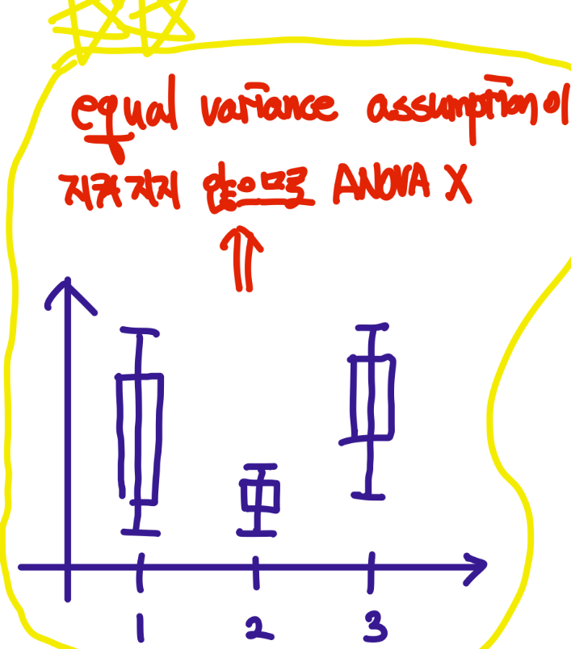
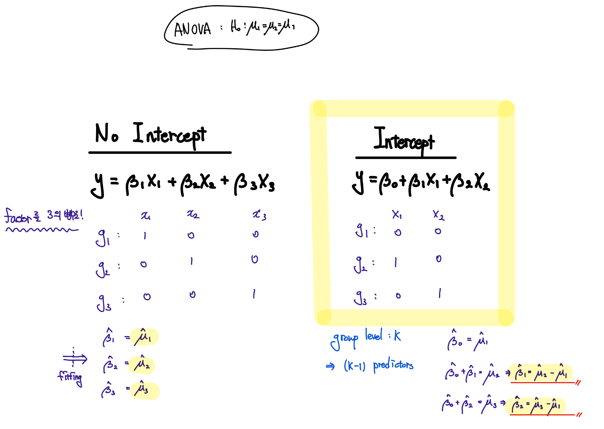

```{r}
library(multtest)
library(ALL)
library(lmtest)
```

## 01. Introduction to linear Models

-   We learned how statistical tests can be used to discover genes with different means with respect to **two groups**.

-   We'll learn how to perform similar tests between **three or more groups**.

-   A technique is called **analysis of variance (ANOVA)**

> 다중집단 비교해보자!! by ANOVA

-   ANOVA is based on the assumption that gene expression values are

    -   Normally distributed

    -   Have Equal variance (homogeneity)

        > 집단 간의 분산이 같아야 한다..

-   across the groups of patients, samples, or experiments.

### Definition of Linear Models

-   Given a continuous value of $y_i$, a basic form of the linear model is :

$$
y_i = \beta_0 + x_i\beta_1 + e_i, \text{for i = 1,...,n}
$$

$$
e \text{~} N(0,\sigma^2)
$$

-   It's commonly assumed that the error variables $e_1,...,e_n$ are **independent and normally distributed** with zero mean!!

$$
y_i \text{~}N(\beta_0 + x_i\beta_1,\sigma^2)
$$

### Least Square Regression Fit

-   The LS regression line provides the best fit of the data points.

> RSS, 즉 residual의 합을 가\~\~장 작게 만들어주는 그 선의 기울기와 절편!


### Residual Sum of Squares (RSS, SSE)

-   Let $\hat{y_i} = \hat{\beta_0} + \hat{\beta_1x_i}$ be the prediction for $Y$ based on the $i$th value of $X$. Then,

$$
e_i = y_i - \hat{y_i}
$$

-   represents the $i$th **residual**.

-   We define the RSS as

$$
\text{RSS} = \sum_{i=1}^{n} e_i^2 = \sum_{i=1}^{n}(y_i - \hat{y_i})^2
$$

### Least Square Estimation

-   위에서 언급한 RSS를 가장 작게 만들어주는 $\beta_1, \beta_2$를 구하자..!

$$
(\hat{\beta_0}, \hat{\beta^1}) = \text{argmin}_{\beta_0,\beta_1} RSS
$$

### Hypothesis Testing

-   If one wish to ony estimate $\beta_0, \beta_1$ , it is \*\*not essential to assume any distirbutional form\*\* for the errors!

> 회귀계수만 추정할때는 에러가 정규성 가성 따를 필요없음!! 걍 미분 박는거니깐..

-   For confidence intervals or hypothesis tests, one need to assume that the errors are \*\*normally distributed\*\*.

> 하지만 회귀계수의 검정이나 신뢰구간을 구할 때는 T 분포 등을 이용하므로 정규성 검정을 꼭해야한다..!

-   Mathematically, this corresponds to testing

$$
H_0 : \beta_1 = 0  \quad \text{VS}\quad H_1 : \beta_1 \neq 0
$$

-   since if $\beta_1 = 0$ (귀무가설 기각 못함.. t-stat이 작음 -\> pv가 0.05보다 큼) then the model reduces to

$$
Y = \beta_0 + e
$$

-   and $X$ is not associated with $Y$.

-   To test the null hypo, we compute a t-statistic.


> MSE = $\hat{\sigma^2}$ !!

### Confidence Intervals

-   이거 모르면 자퇴해야겠지?


### Sum of Squares

-   Sum of squares total (SST) : $y_i$가 평균을 중심으로 얼마나 펴져 있는가? (**Total variation**)

$$
\text{SST} = \sum_{i=1}^n (y_i - \bar{y_i})^2
$$

> 이 Total variation 즉, 전체적인 변동을 두 가지 regression과 error로 설명이 가능하다.

-   Sum of squares regression (SSR) : fitted된 model이 평균을 중심으로 얼마나 펴져 있는가? (Regression)

$$
\text{RSS} = \sum_{i = 1}^{n}(\hat{y_i}-\bar{y_i})^2
$$

-   SST = SSR + SSE 가 된다.

> 간단하게 생각해보면 SSE가 크면 SSR이 작겠지? -\> fitted model이 별로다..!

### ANOVA Table

-   $F$ test for $H_0 : \beta_1 \quad\text{VS}\quad H_1:\beta_1 \neq  0$

> t test와 다르게 f test 즉 아노바는 모든 애들이 동시에 0으로 가는지 체크
>
> 즉, F-test는 Regression Model이 의미가 있는 지 없는 지 testing!!

$$
F = {\text{MSR}\over \text{MSE}}
$$

> 식을 보면 일단 기각 시킬려면 MSR이 MSE보다 커야함!
>
> MSR이 크다!?! -\> Regression Model is gooood\~ -\> Reject H_0


### Least Square Estimation

```{r}
data(golub, package="multtest") 
zyxin <- grep("Zyxin", golub.gnames[,2], ignore.case=TRUE) 
cmyb <- grep("c-myb", golub.gnames[,2], ignore.case=TRUE) 
x <- golub[zyxin, ] 
y <- golub[cmyb, ] 
```

```{r}
g <- lm(y ~ x) 
g$coef
coef(g)
summary(g)
```

```{r}
plot(x, y, pch=19, xlab="Relative Zyxin gene expression",
ylab="Relative c-MYB gene expression", cex.lab=1.5, col="blue")
abline(g$coef, lwd=3, lty=2, col="red")
```

```{r}
sum(g$res^2) # SSE (RSS)
sum(residuals(g)^2)
deviance(g)
```

```{r}
plot(fitted(g), residuals(g), pch=19, xlab="Fitted values",
ylab="Residuals")
abline(h=0, lty=2, col="grey")
```

```{r}
summary(g)$coef
print("====================================================")
g$coef
print("====================================================")
g$coef - qt(0.975, g$df)* summary(g)$coef[,2]
g$coef + qt(0.975, g$df)* summary(g)$coef[,2]
print("====================================================")
confint(g)
print("====================================================")
confint(g, level=0.90) # confidence intervals
```

```{r}
n <- length(x)
p <- 1
df1 <- n - p - 1
df2 <- g$df
df3 <- df.residual(g)
c(df1, df2, df3)
print("====================================================")
summary(g)$sigma^2 # MSE, summary(g)$sigma -> sqrt(mse)
print("====================================================")
sum(g$res^2)/g$df
print("====================================================")
deviance(g)/df.residual(g) # deviance -> SSE
print("====================================================")
anova(g)
print("====================================================")
anova(g)$Sum # SSR, SSE 각각 
print("====================================================")
sum(anova(g)$Sum) # SST
print("====================================================")

print("====================================================")
names(summary(g))

```

### R Squared

-   The coefficient of determination $R^2$ is number between 0 and 1 that indicates

-   How well the data points fit the statistical model.

> 그니깐 나의 모델이 주어진 데이터에 얼마나 적합한지...를 나타내는 측도..

$$
R^2 = 1 - {\text{SSE}\over\text{SST}}
$$

> 1에 가까울수록 나의 모델이 데이터에 잘 맞다는 뜻... -\> 즉 뺴지는 텀의 분자가 작을 수록
>
> 즉, SSE가 작을수록 -\> 회귀 모델로 설명하지 못하는 부분이 작을수록..

-   In gneneral, as we keep adding predictor variables to our model,

-   the $R^2$ will impove

> feature가 늘어나면 늘어날 수록 R 값은 무조건 1에 가까워짐!
>
> 이걸 방지하기 위해서 feature의 수가 늘어나면 패널티를 주는 adjusted $R^2$을 쓰자..!

```{r}
summary(g)$r.squared
summary(g)$adj.r.squared # adj-r^2
```

### F test Statistic

```{r}
names(summary(g))
summary(g)$fstat
```

### Multiple linear Regression


-   We interpret $\beta_j$ as the average effect on $y$ of one unit increase in $x_j$ , **holding all other predictors fixed**.

-   여기서 feature들 간의 상관관계가 없는게 가장 이상적이다..

-   상관관계가 있으면 회귀계수를 추정할때 상관이 있는 변수의 유무에 따라 계수의 값이 변할 수 있기 때문이다.

-   변수들간의 상관관계가 있으면..

    -   The variance of all coefficients tends to increase..

    -   Interpertations become hazardous..


-   RSS는 simple linear regression에서 단순히 추정할 회귀계수가 늘어날 뿐이다..

-   The unbiased estiamte of $\sigma^2$ is

$$
\hat{\sigma^2} = {\text{RSS}\over{n-p-1}} = \text{MSE}
$$

-   이때 p는 number of parameter이다.

### Overall F-test in ANOVA table

-   Hypothesis

    -   $H_0 : \beta_1 = ... = \beta_p = 0$

    -   $H_1:$ At least one $\beta_j$ is not equal to 0.

> 당연이 귀무가설 기각하지 못하면 $y= \beta_0 + e$


```{r}
x1 <- golub[grep("Gdf5", golub.gnames[,2], ignore.case=TRUE),]
x2 <- golub[grep("CCND3", golub.gnames[,2], ignore.case=TRUE),]
x3 <- golub[grep("Nkr", golub.gnames[, 2], ignore.case=TRUE),]
x4 <- golub[grep("IGFBP5",golub.gnames[,2], ignore.case = TRUE),]
data <- data.frame(Gdf5=x1, CCND3=x2, Nkr=x3, IGFBP5=x4, cmyb=y)
data
```

-   `lm(cmyb ~ . , data)`

    -   data라는 df 안에서 cmyb는 y(target)으로 \~ . (df 안에 있는 나머지)는 feature로..

```{r}
g2 <- lm(cmyb ~ ., data) 
print("=====================================")
summary(g2)
print("=====================================")
summary(g2)$coef
print("=====================================")
confint(g2) # confidence interval of coefficients
```

```{r}
n <- length(x)
p <- 4
df1 <- n - p - 1
df2 <- g2$df
df3 <- df.residual(g2) # degree of freedom of residuals
c(df1, df2, df3)
```

```{r}
summary(g)$sigma
summary(g)$sigma^2
```

```{r}
g0 <- lm(cmyb ~ 1, data) # intercept model (udner H_0)
summary(g0)
```

```{r}
anova(g0, g2) # compare intercept model and full model
# > if H_0 is not rejected => intercept model is goood
```

```{r}
summary(g2)$fstat
```

```{r}
anova(g2)
```

```{r}
sum(anova(g2)$F, na.rm = TRUE)/4
```

```{r}
cor(data)
SLR <- vector("list", length=3)
names(SLR) <- c("bhat", "rsq", "sigma")
for (k in 1:(ncol(data)-1)) {
  g0 <- lm(data$cmyb ~ data[,k])
  SLR$bhat[k] <- coef(g0)[2] # \hat\beta_1
  SLR$rsq[k] <- summary(g0)$r.squared
  SLR$sigma[k] <- summary(g0)$sigma
}
SLR
```

```{r}
SLR

data.frame(MLR=coef(g2)[-1], SLR=SLR$bhat)
data.frame(MLR=summary(g2)$r.squared, SLR=SLR$rsq)
data.frame(MLR=summary(g2)$sigma, SLR=SLR$sigma)
```

```{r}
x0 <- data.frame(Gdf5=median(x1), CCND3=median(x2),
Nkr=median(x3), IGFBP5=median(x4))
x0
predict(g2, x0)
```

```{r}
# 각 simple model에서의 예측값..
pred <- NULL
for (k in 1:length(x0)) {
  g0 <- lm(data$cmyb ~ data[,k])
  pred[k] <- sum(coef(g0)[1] + x0[k]*coef(g0)[2])
}
pred
```

## 2. Linear model with a factor

> $y$는 연속형이지만 , $X$가 범주형일 때.. -\> factor 처리 ㄱㄱㅎ!

-   Example : Modeling 3 groups of genes..

    -   Suppose we have the following artificial gene expression values : 2, 3, 1, 2 in group 1

    -   8, 7, 9, 8 in Group 2, and 11, 12, 13, 12 in group 3

```{r}
y <- c(2, 3, 1, 2, 8, 7, 9, 8, 11, 12, 13, 12)
factor <- gl(3, 4) # 4개 씩 3 그룹?
factor
```

```{r}
data.frame(x = factor, y = y)
model.matrix(y ~ factor - 1) # no intercept term
```

```{r}
lm(y ~ factor - 1)$coef # 평균...
```

```{r}
summary(lm(y ~ factor - 1))$coef
```

$$
\hat{y} = 2x_1 + 8x_2 + 12x_3
$$

-   여기에 (1, 0, 0) 대입해보자... -\> group의 평균이 나온다.

## 3. One-way ANOVA

-   A frequent problem is that of testing the null hypo that three or more population means are equal to each other.

-   ANOVA can perform this test by comparing **within group variance** to **between group variances**.

-   Null hypothesis

$$
H_0 : \mu_1 = \mu_2 = ... = \mu_k
$$

> 여기서 주의!! = 0 인 term이 없다!! 즉 F 검정과 다르다..!!
>
> 0인지 아닌지는 신경 안쓰고 단순히 그룹 간의 평균이 같냐 아니냐만 판단....

-   The three sample means per patient group $\bar{y_j}$ and the overall mean $\bar{y}$ can be calculated by :

$$
\bar{y_j} = {1\over n}\sum_{i=1}^{n}y_{ij} \quad \text{for}\quad j = 1, 2, 3 
$$

> 각 집단 별 평균

$$
\bar{y} = {1\over n}(\sum_{j=1}^3\sum_{i=1}^ny_{ij})
$$

> 전체 평균

-   Sum of squares within (SSW) : 그룹 안에서의 변동

$$
\text{SSW} = \sum_{j=1}^{g}\sum_{i=1}^{n}(y_{ij}-\bar{y_j})^2
$$

> g : is number of groups

-   Sum of squares between (SSB) : 그룹 간의 변동

$$
\text{SSB} = \sum_{j=1}^{g}\sum_{i=1}^n(\bar{y_j}-\bar{y})^2
$$

-   F-statististic

$$
f = {\text{SSB}/(g-1)\over\text{SSW} / (N-g)}
$$

> 자자 식을 보면 SSB 즉 그룹 간의 변동이 작으면 F 값이 작아져서 귀무가설을 기각 못하고 그럼 그룹들의 평균은 같다라는 결론..


{width="50%"}

> 아노바는 반드시 동분산 가정이 성립 되어야지만 사용 할 수 있다...!



```{r}
set.seed(123)
y <- c(rnorm(10, -1, 1), rnorm(10, 0, 1), rnorm(10, 1, 1))
y
factor <- gl(3, 10)
factor
```

```{r}
model.matrix(y ~ factor - 1)
model.matrix(y ~ factor)
```

```{r}
g1 <- lm(y ~ factor - 1)
g2 <- lm(y ~ factor)
```

```{r}
summary(g1)$coef
print("======================================================")
summary(g2)$coef
```

```{r}
g1$coef[2] - g1$coef[1]
g1$coef[3] - g1$coef[1]
```

```{r}
anova(g1)
print("======================================================")
anova(g2)
```


```{r}
c(summary(g1)$sigma, summary(g2)$sigma)
cbind(residuals(g1), residuals(g2))
```

> 그래 이제 mu_2 - mu1 = beta_1인건 알겠어.. 그럼 다른건??? 예를 들어 mu_3 - mu_2 같은 거....

```{r}
factor <- relevel(factor, ref=2)
model.matrix(y ~ factor)
g3 <- lm(y ~ factor)
```

```{r}
summary(g3)$coef
```

```{r}
factor <- relevel(factor, ref=3)
g_tmp <- lm(y ~ factor)
summary(g_tmp)$coef
```

```{r}
summary(g2)$coef
summary(g3)$coef
anova(g2)
anova(g3)
```

> F-value는 똑같다,,

```{r}
factor = gl(3, 10)
summary(lm(y ~ factor))
anova(lm(y ~ factor))
```

### All Pairwise Test

-   모든 가능한 그룹 쌍에 대해 가설을 각각 검정

$$
H_0 : \mu_i = \mu_j
$$

```{r}
pairwise.t.test(y, factor, p.adjust.method="bonferroni")
pairwise.t.test(y, factor, p.adjust.method="holm")
```

```{r}
TukeyHSD(aov(y ~ factor))
plot(TukeyHSD(aov(y ~ factor)))
```

-   Example: No difference between the means

```{r}
set.seed(1234)
y <- rnorm(30, 1.9, 1)
y
factor <- gl(3, 10)
g <- lm(y ~ factor)
anova(g)
pairwise.t.test(y, factor, p.adjust.method="bonferroni")
TukeyHSD(aov(g))
plot(TukeyHSD(aov(g)))
```

### Example of One-way ANOVA

```{r}
library(ALL)
data(ALL)
dim(ALL)
ALL[1:10, 1:5]
str(ALL)
exprs(ALL)[1:10, 1:5]
dim(exprs(ALL))
```

```{r}
table(ALL$BT)
B1B2B3 <- ALL$BT %in% c("B1","B2","B3")
ex <- exprs(ALL)
y <- as.numeric(ex[row.names(ex)=="1866_g_at", B1B2B3])
factor <- factor(ALL$BT[B1B2B3], labels=c("B1","B2","B3"))
```

```{r}
col <- c("orange","darkgreen","blue")
xlab <- "B-cell ALL stage"
ylab <- "SKI-like oncogene expression"
par(mfrow=c(1, 2))
stripchart(y ~ factor, method="jitter", cex.lab=1.5, xlab=xlab,
pch=19, col=col, vertical=TRUE, ylab=ylab)
boxplot(y ~ factor, cex.lab=1.5, main=NULL, boxwex=0.3, col=col,
xlab=xlab, ylab=ylab)
```

```{r}
g <- lm(y ~ factor)
summary(g)
anova(g)
summary(aov(g))
```

```{r}
pairwise.t.test(y, factor, p.adjust.method="bonferroni")
TukeyHSD(aov(g))
plot(TukeyHSD(aov(g)))
```

```{r}
y2 <- as.numeric(ex[row.names(ex)=="1242_at", B1B2B3])
ylab <- "Ets2 expression"

par(mfrow=c(1, 2))
stripchart(y2 ~ factor, method="jitter", cex.lab=1.5, pch=19,
vertical=TRUE, xlab=xlab, ylab=ylab, col=col)
boxplot(y2 ~ factor, cex.lab=1.5, main=NULL, xlab=xlab,
boxwex=0.3, ylab=ylab, col=col)
```

```{r}
g <- lm(y2 ~ factor)
summary(g)
anova(g)
```

```{r}
pairwise.t.test(y2, factor, p.adjust.method="bonferroni")
TukeyHSD(aov(g))
plot(TukeyHSD(aov(g)))
```

```{r}
y3 <- as.numeric(ex[row.names(ex)=="1242_at", ])
g <- lm(y3 ~ ALL$BT)
anova(g)
```

```{r}
xlab <- "B-cell and T-cell stage"
par(mfrow=c(2, 1))
stripchart(y3 ~ ALL$BT, method="jitter", cex.lab=1.5, pch=19,
vertical=TRUE, xlab=xlab, ylab=ylab, col=1:10)
boxplot(y3 ~ ALL$BT, cex.lab=1.5, main=NULL, xlab=xlab,
boxwex=0.3, ylab=ylab, col=1:10)
```

## 4. Multiple testing for ANOVA

```{r}
dim(ex[, B1B2B3])
fun <- function(t) anova(lm(t ~ factor))$Pr[1]
anova.pValues <- apply(ex[, B1B2B3], 1, fun)
```

```{r}
pBF <- p.adjust(anova.pValues, method="bonferroni")
pHO <- p.adjust(anova.pValues, method="holm")
pBH <- p.adjust(anova.pValues, method="BH")
```

```{r}
alpha <- 0.05
c(sum(pBF < alpha), sum(pHO < alpha), sum(pBH < alpha))
```

## 5. Checking assumptions

-   정규성 검정

```{r}
library(ALL)
data(ALL)
```

```{r}
B1B2B3 <- ALL$BT %in% c("B1","B2","B3")
ex <- exprs(ALL)
y <- as.numeric(ex[row.names(ex)=="1866_g_at", B1B2B3])
factor <- factor(ALL$BT[B1B2B3], labels=c("B1","B2","B3"))
```

```{r}
# 정규성 검정
# H_0 is normality okay
res <- residuals(lm(y ~ factor))
shapiro.test(res) # pv < 0.05 이므로 아노바 ㄴㄴ
```

```{r}
par(mfrow=c(1, 2))
qqnorm(res, pch=19, cex.lab=1.5, col="red", main=NULL)
qqline(res)
hist(res, nclass=20, col="orange", xlab="residuals", main="")
```

-   등분산 검정

-   H_0 : 등분산이노

```{r}
library(lmtest)
bptest(lm(y ~ factor), studentize=FALSE)
```

```{r}
bartlett.test(y ~ factor)
fligner.test(y, factor)
library(car)
leveneTest(y, factor)
```

```{r}
g <- lm(y ~ factor)
plot(fitted(g), res, pch=19, col="red",
xlab="Fitted values", ylab = "Residuals")
abline(h=c(max(res), 0, min(res)), lty=2, col="grey")
```

## 6. Robust tests

-   잔차가 가정을 따르지 않을 때...

-   When only homoscedasticity is violated, **Welch's ANOVA** -\> 정규성은 만족해야함!!!

-   When normality is violated, the **Kruskal-Wallis rank sum test** -\> 정규성 x 일 때!!!

#### Example : Unequal variances 

```{r}
# Welch's ANOVA -> Games Howell test
oneway.test(y ~ factor, var.equal = FALSE)
```

#### Example : Non-normallay distributed residuals

```{r}
kruskal.test(y~factor)
```

```{r}
f2 <- function(t) kruskal.test(t ~ factor)$p.value
kruskal.pValues <- apply(ex[, B1B2B3], 1, f2)
```

```{r}
pBF <- p.adjust(kruskal.pValues, method="bonferroni")
pHO <- p.adjust(kruskal.pValues, method="holm")
pBH <- p.adjust(kruskal.pValues, method="BH")
alpha <- 0.05
c(sum(pBF < alpha), sum(pHO < alpha), sum(pBH < alpha))
```

## 7. Two-way ANOVA

```{r}
library(ALL)
data(ALL)
```

```{r}
ex <- exprs(ALL)
dim(ex)
```

```{r}
table(ALL$BT)
table(ALL$mol.biol)
```

```{r}
w1 <- ALL$BT %in% c("B", "B1", "B2", "B3", "B4")
w2 <- ALL$mol.biol %in% c("BCR/ABL", "NEG")
ex12 <- ex["32069_at", w1 & w2]
length(ex12)
facB <- ceiling(as.integer(ALL$BT[w1 & w2])/3)
facB
data.frame(B.type=ALL$BT[w1 & w2], facB=facB)
fac1 <- factor(facB, levels=1:2, labels=c("B012", "B34"))
fac2 <- factor(ALL$mol.biol[w1 & w2])
table(fac1)
table(fac2)
tapply(ex12, fac1, mean)
tapply(ex12, fac2, mean)
```

```{r}
col <- c("orange","blue")
xlab1 <- "B-cell ALL stage"
xlab2 <- "Molecular biology"
ylab <- "NEDD4 expression"
par(mfrow=c(1,2))
stripchart(ex12 ~ fac1, method="jitter", cex.lab=1.5, pch=19,
vertical=TRUE, xlab=xlab1, ylab=ylab, col=col)
stripchart(ex12 ~ fac2, method="jitter", cex.lab=1.5, pch=19,
vertical=TRUE, xlab=xlab2, ylab=ylab, col=col)
boxplot(ex12 ~ fac1, cex.lab=1.5, main=NULL, boxwex=0.3,
ylab=ylab, col=col, xlab=xlab1)
boxplot(ex12 ~ fac2, cex.lab=1.5, main=NULL, xlab=xlab2, ylab=ylab, col=col,boxwex=0.3)
```

```{r}
interaction.plot(fac1, fac2, ex12, type="b", col=col, xlab=xlab1,
pch=c(16, 17), lty=1, lwd=2, legend=F, ylab=ylab)
legend("topright", c("BCR/ABL","NEG"), bty="n", lty=1, lwd=2,
pch=c(16,17), col=col, inset=0.02)
interaction.plot(fac2, fac1, ex12, type="b", col=col, xlab=xlab2,
pch=c(16, 17), lty=1, lwd=2, legend=F, ylab=ylab)
legend("topright", c("B012","B34"), bty="n", lty=1, lwd=2,
pch=c(16,17), col=col, inset=0.02)
tapply(ex12[fac2=="BCR/ABL"], fac1[fac2=="BCR/ABL"], mean)
tapply(ex12[fac2=="NEG"], fac1[fac2=="NEG"], mean)
tapply(ex12[fac1=="B012"], fac2[fac1=="B012"], mean)
tapply(ex12[fac1=="B34"], fac2[fac1=="B34"], mean)
```

```{r}
anova(lm(ex12 ~ fac1 * fac2))
summary(lm(ex12 ~ fac1 * fac2))
```

```{r}
data.frame(fac1, fac2)
nfac <- rep(1, length(fac1))
nfac[fac1=="B012" & fac2=="NEG"] <- 2
nfac[fac1=="B34" & fac2=="BCR/ABL"] <- 3
nfac[fac1=="B34" & fac2=="NEG"] <- 4
nfac <- factor(nfac, labels=c("f11", "f12", "f21", "f22"))
table(nfac)
table(fac1, fac2)
res <- residuals(lm(ex12 ~ nfac))
shapiro.test(res)
library(lmtest)
bptest(lm(ex12 ~ nfac), studentize=FALSE)
anova(lm(ex12 ~ nfac))
TukeyHSD(aov(lm(ex12 ~ nfac)))
plot(TukeyHSD(aov(lm(ex12 ~ nfac))))
```
