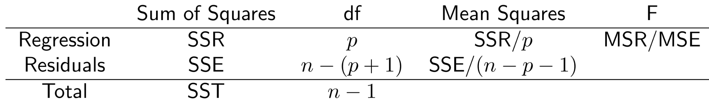

Lecture4 : Linear Models
================
KIM SANG HYUN(202211545)
2025-05-06

- [01. Introduction to linear Models](#01-introduction-to-linear-models)
  - [Definition of Linear Models](#definition-of-linear-models)
  - [Least Square Regression Fit](#least-square-regression-fit)
  - [Residual Sum of Squares (RSS,
    SSE)](#residual-sum-of-squares-rss-sse)
  - [Least Square Estimation](#least-square-estimation)
  - [Hypothesis Testing](#hypothesis-testing)
  - [Confidence Intervals](#confidence-intervals)
  - [Sum of Squares](#sum-of-squares)
  - [ANOVA Table](#anova-table)
  - [Least Square Estimation](#least-square-estimation-1)
  - [R Squared](#r-squared)
  - [F test Statistic](#f-test-statistic)
  - [Multiple linear Regression](#multiple-linear-regression)
  - [Overall F-test in ANOVA table](#overall-f-test-in-anova-table)
- [2. Linear model with a factor](#2-linear-model-with-a-factor)
- [3. One-way ANOVA](#3-one-way-anova)
  - [All Pairwise Test](#all-pairwise-test)
  - [Example of One-way ANOVA](#example-of-one-way-anova)
- [4. Multiple testing for ANOVA](#4-multiple-testing-for-anova)
- [5. Checking assumptions](#5-checking-assumptions)
- [6. Robust tests](#6-robust-tests)
- [7. Two-way ANOVA](#7-two-way-anova)

``` r
library(multtest)
```

    ## Loading required package: BiocGenerics

    ## 
    ## Attaching package: 'BiocGenerics'

    ## The following objects are masked from 'package:stats':
    ## 
    ##     IQR, mad, sd, var, xtabs

    ## The following objects are masked from 'package:base':
    ## 
    ##     anyDuplicated, aperm, append, as.data.frame, basename, cbind,
    ##     colnames, dirname, do.call, duplicated, eval, evalq, Filter, Find,
    ##     get, grep, grepl, intersect, is.unsorted, lapply, Map, mapply,
    ##     match, mget, order, paste, pmax, pmax.int, pmin, pmin.int,
    ##     Position, rank, rbind, Reduce, rownames, sapply, saveRDS, setdiff,
    ##     table, tapply, union, unique, unsplit, which.max, which.min

    ## Loading required package: Biobase

    ## Welcome to Bioconductor
    ## 
    ##     Vignettes contain introductory material; view with
    ##     'browseVignettes()'. To cite Bioconductor, see
    ##     'citation("Biobase")', and for packages 'citation("pkgname")'.

``` r
library(ALL)
library(lmtest)
```

    ## Loading required package: zoo

    ## 
    ## Attaching package: 'zoo'

    ## The following objects are masked from 'package:base':
    ## 
    ##     as.Date, as.Date.numeric

## 01. Introduction to linear Models

- We learned how statistical tests can be used to discover genes with
  different means with respect to **two groups**.

- We’ll learn how to perform similar tests between **three or more
  groups**.

- A technique is called **analysis of variance (ANOVA)**

> 다중집단 비교해보자!! by ANOVA

- ANOVA is based on the assumption that gene expression values are

  - Normally distributed

  - Have Equal variance (homogeneity)

    > 집단 간의 분산이 같아야 한다..

- across the groups of patients, samples, or experiments.

### Definition of Linear Models

- Given a continuous value of $y_i$, a basic form of the linear model is
  :

$$
y_i = \beta_0 + x_i\beta_1 + e_i, \text{for i = 1,...,n}
$$

$$
e \text{~} N(0,\sigma^2)
$$

- It’s commonly assumed that the error variables $e_1,...,e_n$ are
  **independent and normally distributed** with zero mean!!

$$
y_i \text{~}N(\beta_0 + x_i\beta_1,\sigma^2)
$$

### Least Square Regression Fit

- The LS regression line provides the best fit of the data points.

> RSS, 즉 residual의 합을 가\~~장 작게 만들어주는 그 선의 기울기와 절편!


### Residual Sum of Squares (RSS, SSE)

- Let $\hat{y_i} = \hat{\beta_0} + \hat{\beta_1x_i}$ be the prediction
  for $Y$ based on the $i$th value of $X$. Then,

$$
e_i = y_i - \hat{y_i}
$$

- represents the $i$th **residual**.

- We define the RSS as

$$
\text{RSS} = \sum_{i=1}^{n} e_i^2 = \sum_{i=1}^{n}(y_i - \hat{y_i})^2
$$

### Least Square Estimation

- 위에서 언급한 RSS를 가장 작게 만들어주는 $\beta_1, \beta_2$를
  구하자..!

$$
(\hat{\beta_0}, \hat{\beta^1}) = \text{argmin}_{\beta_0,\beta_1} RSS
$$

### Hypothesis Testing

- If one wish to ony estimate $\beta_0, \beta_1$ , it is \*\*not
  essential to assume any distirbutional form\*\* for the errors!

> 회귀계수만 추정할때는 에러가 정규성 가성 따를 필요없음!! 걍 미분
> 박는거니깐..

- For confidence intervals or hypothesis tests, one need to assume that
  the errors are \*\*normally distributed\*\*.

> 하지만 회귀계수의 검정이나 신뢰구간을 구할 때는 T 분포 등을 이용하므로
> 정규성 검정을 꼭해야한다..!

- Mathematically, this corresponds to testing

$$
H_0 : \beta_1 = 0  \quad \text{VS}\quad H_1 : \beta_1 \neq 0
$$

- since if $\beta_1 = 0$ (귀무가설 기각 못함.. t-stat이 작음 -\> pv가
  0.05보다 큼) then the model reduces to

$$
Y = \beta_0 + e
$$

- and $X$ is not associated with $Y$.

- To test the null hypo, we compute a t-statistic.


> MSE = $\hat{\sigma^2}$ !!

### Confidence Intervals

- 이거 모르면 자퇴해야겠지?


### Sum of Squares

- Sum of squares total (SST) : $y_i$가 평균을 중심으로 얼마나 펴져
  있는가? (**Total variation**)

$$
\text{SST} = \sum_{i=1}^n (y_i - \bar{y_i})^2
$$

> 이 Total variation 즉, 전체적인 변동을 두 가지 regression과 error로
> 설명이 가능하다.

- Sum of squares regression (SSR) : fitted된 model이 평균을 중심으로
  얼마나 펴져 있는가? (Regression)

$$
\text{RSS} = \sum_{i = 1}^{n}(\hat{y_i}-\bar{y_i})^2
$$

- SST = SSR + SSE 가 된다.

> 간단하게 생각해보면 SSE가 크면 SSR이 작겠지? -\> fitted model이
> 별로다..!

### ANOVA Table

- $F$ test for $H_0 : \beta_1 \quad\text{VS}\quad H_1:\beta_1 \neq  0$

> t test와 다르게 f test 즉 아노바는 모든 애들이 동시에 0으로 가는지
> 체크
>
> 즉, F-test는 Regression Model이 의미가 있는 지 없는 지 testing!!

$$
F = {\text{MSR}\over \text{MSE}}
$$

> 식을 보면 일단 기각 시킬려면 MSR이 MSE보다 커야함!
>
> MSR이 크다!?! -\> Regression Model is gooood~ -\> Reject H_0


### Least Square Estimation

``` r
data(golub, package="multtest") 
zyxin <- grep("Zyxin", golub.gnames[,2], ignore.case=TRUE) 
cmyb <- grep("c-myb", golub.gnames[,2], ignore.case=TRUE) 
x <- golub[zyxin, ] 
y <- golub[cmyb, ] 
```

``` r
g <- lm(y ~ x) 
g$coef
```

    ## (Intercept)           x 
    ##   1.5552103  -0.5881673

``` r
coef(g)
```

    ## (Intercept)           x 
    ##   1.5552103  -0.5881673

``` r
summary(g)
```

    ## 
    ## Call:
    ## lm(formula = y ~ x)
    ## 
    ## Residuals:
    ##      Min       1Q   Median       3Q      Max 
    ## -1.51086 -0.40011 -0.04658  0.44662  1.03868 
    ## 
    ## Coefficients:
    ##             Estimate Std. Error t value Pr(>|t|)    
    ## (Intercept)   1.5552     0.1100  14.132 2.92e-16 ***
    ## x            -0.5882     0.1012  -5.814 1.23e-06 ***
    ## ---
    ## Signif. codes:  0 '***' 0.001 '**' 0.01 '*' 0.05 '.' 0.1 ' ' 1
    ## 
    ## Residual standard error: 0.6603 on 36 degrees of freedom
    ## Multiple R-squared:  0.4843, Adjusted R-squared:   0.47 
    ## F-statistic: 33.81 on 1 and 36 DF,  p-value: 1.23e-06

``` r
plot(x, y, pch=19, xlab="Relative Zyxin gene expression",
ylab="Relative c-MYB gene expression", cex.lab=1.5, col="blue")
abline(g$coef, lwd=3, lty=2, col="red")
```

<!-- -->

``` r
sum(g$res^2) # SSE (RSS)
```

    ## [1] 15.6939

``` r
sum(residuals(g)^2)
```

    ## [1] 15.6939

``` r
deviance(g)
```

    ## [1] 15.6939

``` r
plot(fitted(g), residuals(g), pch=19, xlab="Fitted values",
ylab="Residuals")
abline(h=0, lty=2, col="grey")
```

<!-- -->

``` r
summary(g)$coef
```

    ##               Estimate Std. Error   t value     Pr(>|t|)
    ## (Intercept)  1.5552103  0.1100494 14.131930 2.919560e-16
    ## x           -0.5881673  0.1011560 -5.814457 1.230053e-06

``` r
print("====================================================")
```

    ## [1] "===================================================="

``` r
g$coef
```

    ## (Intercept)           x 
    ##   1.5552103  -0.5881673

``` r
print("====================================================")
```

    ## [1] "===================================================="

``` r
g$coef - qt(0.975, g$df)* summary(g)$coef[,2]
```

    ## (Intercept)           x 
    ##   1.3320198  -0.7933212

``` r
g$coef + qt(0.975, g$df)* summary(g)$coef[,2]
```

    ## (Intercept)           x 
    ##   1.7784008  -0.3830134

``` r
print("====================================================")
```

    ## [1] "===================================================="

``` r
confint(g)
```

    ##                  2.5 %     97.5 %
    ## (Intercept)  1.3320198  1.7784008
    ## x           -0.7933212 -0.3830134

``` r
print("====================================================")
```

    ## [1] "===================================================="

``` r
confint(g, level=0.90) # confidence intervals
```

    ##                    5 %       95 %
    ## (Intercept)  1.3694142  1.7410064
    ## x           -0.7589488 -0.4173859

``` r
n <- length(x)
p <- 1
df1 <- n - p - 1
df2 <- g$df
df3 <- df.residual(g)
c(df1, df2, df3)
```

    ## [1] 36 36 36

``` r
print("====================================================")
```

    ## [1] "===================================================="

``` r
summary(g)$sigma^2 # MSE, summary(g)$sigma -> sqrt(mse)
```

    ## [1] 0.4359417

``` r
print("====================================================")
```

    ## [1] "===================================================="

``` r
sum(g$res^2)/g$df
```

    ## [1] 0.4359417

``` r
print("====================================================")
```

    ## [1] "===================================================="

``` r
deviance(g)/df.residual(g) # deviance -> SSE
```

    ## [1] 0.4359417

``` r
print("====================================================")
```

    ## [1] "===================================================="

``` r
anova(g)
```

    ## Analysis of Variance Table
    ## 
    ## Response: y
    ##           Df Sum Sq Mean Sq F value   Pr(>F)    
    ## x          1 14.738 14.7383  33.808 1.23e-06 ***
    ## Residuals 36 15.694  0.4359                     
    ## ---
    ## Signif. codes:  0 '***' 0.001 '**' 0.01 '*' 0.05 '.' 0.1 ' ' 1

``` r
print("====================================================")
```

    ## [1] "===================================================="

``` r
anova(g)$Sum # SSR, SSE 각각 
```

    ## [1] 14.73828 15.69390

``` r
print("====================================================")
```

    ## [1] "===================================================="

``` r
sum(anova(g)$Sum) # SST
```

    ## [1] 30.43218

``` r
print("====================================================")
```

    ## [1] "===================================================="

``` r
print("====================================================")
```

    ## [1] "===================================================="

``` r
names(summary(g))
```

    ##  [1] "call"          "terms"         "residuals"     "coefficients" 
    ##  [5] "aliased"       "sigma"         "df"            "r.squared"    
    ##  [9] "adj.r.squared" "fstatistic"    "cov.unscaled"

### R Squared

- The coefficient of determination $R^2$ is number between 0 and 1 that
  indicates

- How well the data points fit the statistical model.

> 그니깐 나의 모델이 주어진 데이터에 얼마나 적합한지…를 나타내는 측도..

$$
R^2 = 1 - {\text{SSE}\over\text{SST}}
$$

> 1에 가까울수록 나의 모델이 데이터에 잘 맞다는 뜻… -\> 즉 뺴지는 텀의
> 분자가 작을 수록
>
> 즉, SSE가 작을수록 -\> 회귀 모델로 설명하지 못하는 부분이 작을수록..

- In gneneral, as we keep adding predictor variables to our model,

- the $R^2$ will impove

> feature가 늘어나면 늘어날 수록 R 값은 무조건 1에 가까워짐!
>
> 이걸 방지하기 위해서 feature의 수가 늘어나면 패널티를 주는 adjusted
> $R^2$을 쓰자..!

``` r
summary(g)$r.squared
```

    ## [1] 0.4842992

``` r
summary(g)$adj.r.squared # adj-r^2
```

    ## [1] 0.4699741

### F test Statistic

``` r
names(summary(g))
```

    ##  [1] "call"          "terms"         "residuals"     "coefficients" 
    ##  [5] "aliased"       "sigma"         "df"            "r.squared"    
    ##  [9] "adj.r.squared" "fstatistic"    "cov.unscaled"

``` r
summary(g)$fstat
```

    ##    value    numdf    dendf 
    ## 33.80792  1.00000 36.00000

### Multiple linear Regression


- We interpret $\beta_j$ as the average effect on $y$ of one unit
  increase in $x_j$ , **holding all other predictors fixed**.

- 여기서 feature들 간의 상관관계가 없는게 가장 이상적이다..

- 상관관계가 있으면 회귀계수를 추정할때 상관이 있는 변수의 유무에 따라
  계수의 값이 변할 수 있기 때문이다.

- 변수들간의 상관관계가 있으면..

  - The variance of all coefficients tends to increase..

  - Interpertations become hazardous..


- RSS는 simple linear regression에서 단순히 추정할 회귀계수가 늘어날
  뿐이다..

- The unbiased estiamte of $\sigma^2$ is

$$
\hat{\sigma^2} = {\text{RSS}\over{n-p-1}} = \text{MSE}
$$

- 이때 p는 number of parameter이다.

### Overall F-test in ANOVA table

- Hypothesis

  - $H_0 : \beta_1 = ... = \beta_p = 0$

  - $H_1:$ At least one $\beta_j$ is not equal to 0.

> 당연이 귀무가설 기각하지 못하면 $y= \beta_0 + e$



``` r
x1 <- golub[grep("Gdf5", golub.gnames[,2], ignore.case=TRUE),]
x2 <- golub[grep("CCND3", golub.gnames[,2], ignore.case=TRUE),]
x3 <- golub[grep("Nkr", golub.gnames[, 2], ignore.case=TRUE),]
x4 <- golub[grep("IGFBP5",golub.gnames[,2], ignore.case = TRUE),]
data <- data.frame(Gdf5=x1, CCND3=x2, Nkr=x3, IGFBP5=x4, cmyb=y)
data
```

    ##        Gdf5    CCND3      Nkr   IGFBP5     cmyb
    ## 1   0.24735  2.10892 -1.45769 -1.45769  1.71135
    ## 2  -0.26002  1.52405 -1.39420 -1.39420  0.74335
    ## 3   0.23335  1.96403 -1.46227 -1.46227  1.89287
    ## 4   0.01026  2.33597 -1.40715 -1.40715  2.34702
    ## 5   0.04565  1.85111 -1.42668 -1.42668  1.85889
    ## 6  -0.14913  1.99391 -1.21719 -1.21719  2.03111
    ## 7   0.16400  2.06597 -1.37386 -1.37386  2.05606
    ## 8   0.54271  1.81649 -1.36832 -1.36832  2.14942
    ## 9   0.01893  2.17622 -1.47649 -1.07665  1.67872
    ## 10 -0.10892  1.80861 -1.21583 -1.21583  1.36812
    ## 11 -0.30807  2.44562 -1.28137  0.38217  1.75256
    ## 12  0.06702  1.90496 -1.03209 -1.03209  0.62576
    ## 13 -0.04994  2.76610 -1.36149 -1.36149  2.05013
    ## 14 -0.20145  1.32551  2.07770 -1.39979  1.12207
    ## 15 -0.12313  2.59385 -1.39503 -1.39503  2.10825
    ## 16  0.16253  1.92776 -1.40095 -1.40095  2.17166
    ## 17 -0.04562  1.10546 -1.56783 -1.56783  2.04341
    ## 18  0.23475  1.27645 -1.20466 -1.20466  1.16980
    ## 19 -0.32004  1.83051 -1.24482 -1.24482  2.13521
    ## 20 -0.18194  1.78352 -1.60767 -1.60767  1.83307
    ## 21 -0.68390  0.45827 -1.06221 -1.06221  3.08642
    ## 22  0.08487  2.18119 -1.12665 -1.12665  2.55785
    ## 23  0.12644  2.31428 -1.20963 -1.20963  2.11331
    ## 24 -0.13465  1.99927 -1.48332 -1.48332  2.32874
    ## 25  0.10843  1.36844 -1.25268 -1.25268  1.46383
    ## 26 -0.03124  2.37351 -1.27619 -1.27619  1.94300
    ## 27  0.55321  1.83485 -1.23051 -1.23051  1.93723
    ## 28  0.06908  0.88941 -1.43337 -1.43337  0.45261
    ## 29 -0.44772  1.45014 -1.08902 -1.08902  1.30993
    ## 30  0.29207  0.42904 -1.29865 -0.36744  0.00467
    ## 31 -0.07202  0.82667 -1.26183 -1.26183 -0.00368
    ## 32 -0.03390  0.63637 -1.44434 -1.44434  0.65624
    ## 33  0.19627  1.02250 -1.47218 -1.47218 -0.43408
    ## 34  0.04091  0.12758 -1.34158 -1.34158  0.87417
    ## 35  0.27934 -0.74333 -1.22961 -1.22961  0.88220
    ## 36  0.08552  0.73784 -1.39906 -1.39906 -0.10793
    ## 37  0.26222  0.49470 -1.34579 -1.34579 -0.81267
    ## 38  0.21272  1.12058 -1.32403 -1.32403  0.41329

- `lm(cmyb ~ . , data)`

  - data라는 df 안에서 cmyb는 y(target)으로 ~ . (df 안에 있는 나머지)는
    feature로..

``` r
g2 <- lm(cmyb ~ ., data) 
print("=====================================")
```

    ## [1] "====================================="

``` r
summary(g2)
```

    ## 
    ## Call:
    ## lm(formula = cmyb ~ ., data = data)
    ## 
    ## Residuals:
    ##      Min       1Q   Median       3Q      Max 
    ## -1.41378 -0.32811 -0.00134  0.35798  1.83861 
    ## 
    ## Coefficients:
    ##              Estimate Std. Error t value Pr(>|t|)    
    ## (Intercept) -0.009281   0.583479  -0.016 0.987405    
    ## Gdf5        -0.889039   0.506074  -1.757 0.088239 .  
    ## CCND3        0.681214   0.157580   4.323 0.000133 ***
    ## Nkr         -0.069515   0.216890  -0.321 0.750602    
    ## IGFBP5      -0.247653   0.357863  -0.692 0.493757    
    ## ---
    ## Signif. codes:  0 '***' 0.001 '**' 0.01 '*' 0.05 '.' 0.1 ' ' 1
    ## 
    ## Residual standard error: 0.7337 on 33 degrees of freedom
    ## Multiple R-squared:  0.4162, Adjusted R-squared:  0.3455 
    ## F-statistic: 5.883 on 4 and 33 DF,  p-value: 0.001093

``` r
print("=====================================")
```

    ## [1] "====================================="

``` r
summary(g2)$coef
```

    ##                 Estimate Std. Error     t value    Pr(>|t|)
    ## (Intercept) -0.009280741  0.5834787 -0.01590588 0.987405260
    ## Gdf5        -0.889038700  0.5060739 -1.75673695 0.088239293
    ## CCND3        0.681214185  0.1575804  4.32296159 0.000133379
    ## Nkr         -0.069515384  0.2168898 -0.32051017 0.750602433
    ## IGFBP5      -0.247653487  0.3578633 -0.69203382 0.493756938

``` r
print("=====================================")
```

    ## [1] "====================================="

``` r
confint(g2) # confidence interval of coefficients
```

    ##                  2.5 %    97.5 %
    ## (Intercept) -1.1963772 1.1778157
    ## Gdf5        -1.9186538 0.1405764
    ## CCND3        0.3606144 1.0018140
    ## Nkr         -0.5107810 0.3717502
    ## IGFBP5      -0.9757318 0.4804248

``` r
n <- length(x)
p <- 4
df1 <- n - p - 1
df2 <- g2$df
df3 <- df.residual(g2) # degree of freedom of residuals
c(df1, df2, df3)
```

    ## [1] 33 33 33

``` r
summary(g)$sigma
```

    ## [1] 0.6602588

``` r
summary(g)$sigma^2
```

    ## [1] 0.4359417

``` r
g0 <- lm(cmyb ~ 1, data) # intercept model (udner H_0)
summary(g0)
```

    ## 
    ## Call:
    ## lm(formula = cmyb ~ 1, data = data)
    ## 
    ## Residuals:
    ##     Min      1Q  Median      3Q     Max 
    ## -2.2209 -0.6322  0.3237  0.6463  1.6782 
    ## 
    ## Coefficients:
    ##             Estimate Std. Error t value Pr(>|t|)    
    ## (Intercept)   1.4083     0.1471   9.572 1.49e-11 ***
    ## ---
    ## Signif. codes:  0 '***' 0.001 '**' 0.01 '*' 0.05 '.' 0.1 ' ' 1
    ## 
    ## Residual standard error: 0.9069 on 37 degrees of freedom

``` r
anova(g0, g2) # compare intercept model and full model
```

    ## Analysis of Variance Table
    ## 
    ## Model 1: cmyb ~ 1
    ## Model 2: cmyb ~ Gdf5 + CCND3 + Nkr + IGFBP5
    ##   Res.Df    RSS Df Sum of Sq      F   Pr(>F)   
    ## 1     37 30.432                                
    ## 2     33 17.765  4    12.667 5.8827 0.001093 **
    ## ---
    ## Signif. codes:  0 '***' 0.001 '**' 0.01 '*' 0.05 '.' 0.1 ' ' 1

``` r
# > if H_0 is not rejected => intercept model is goood
```

``` r
summary(g2)$fstat
```

    ##     value     numdf     dendf 
    ##  5.882707  4.000000 33.000000

``` r
anova(g2)
```

    ## Analysis of Variance Table
    ## 
    ## Response: cmyb
    ##           Df  Sum Sq Mean Sq F value    Pr(>F)    
    ## Gdf5       1  2.2097  2.2097  4.1047 0.0509121 .  
    ## CCND3      1 10.1448 10.1448 18.8450 0.0001266 ***
    ## Nkr        1  0.0550  0.0550  0.1022 0.7511839    
    ## IGFBP5     1  0.2578  0.2578  0.4789 0.4937569    
    ## Residuals 33 17.7649  0.5383                      
    ## ---
    ## Signif. codes:  0 '***' 0.001 '**' 0.01 '*' 0.05 '.' 0.1 ' ' 1

``` r
sum(anova(g2)$F, na.rm = TRUE)/4
```

    ## [1] 5.882707

``` r
cor(data)
```

    ##               Gdf5       CCND3         Nkr      IGFBP5        cmyb
    ## Gdf5    1.00000000 -0.08778002 -0.19143305 -0.16513812 -0.26946109
    ## CCND3  -0.08778002  1.00000000 -0.06126599  0.04850305  0.59879652
    ## Nkr    -0.19143305 -0.06126599  1.00000000  0.02785847 -0.03527205
    ## IGFBP5 -0.16513812  0.04850305  0.02785847  1.00000000 -0.02646746
    ## cmyb   -0.26946109  0.59879652 -0.03527205 -0.02646746  1.00000000

``` r
SLR <- vector("list", length=3)
names(SLR) <- c("bhat", "rsq", "sigma")
for (k in 1:(ncol(data)-1)) {
  g0 <- lm(data$cmyb ~ data[,k])
  SLR$bhat[k] <- coef(g0)[2] # \hat\beta_1
  SLR$rsq[k] <- summary(g0)$r.squared
  SLR$sigma[k] <- summary(g0)$sigma
}
SLR
```

    ## $bhat
    ## [1] -0.98843495  0.70404156 -0.05627507 -0.07019522
    ## 
    ## $rsq
    ## [1] 0.0726092764 0.3585572699 0.0012441173 0.0007005266
    ## 
    ## $sigma
    ## [1] 0.8854145 0.7363668 0.9188507 0.9191007

``` r
SLR
```

    ## $bhat
    ## [1] -0.98843495  0.70404156 -0.05627507 -0.07019522
    ## 
    ## $rsq
    ## [1] 0.0726092764 0.3585572699 0.0012441173 0.0007005266
    ## 
    ## $sigma
    ## [1] 0.8854145 0.7363668 0.9188507 0.9191007

``` r
data.frame(MLR=coef(g2)[-1], SLR=SLR$bhat)
```

    ##                MLR         SLR
    ## Gdf5   -0.88903870 -0.98843495
    ## CCND3   0.68121418  0.70404156
    ## Nkr    -0.06951538 -0.05627507
    ## IGFBP5 -0.24765349 -0.07019522

``` r
data.frame(MLR=summary(g2)$r.squared, SLR=SLR$rsq)
```

    ##         MLR          SLR
    ## 1 0.4162477 0.0726092764
    ## 2 0.4162477 0.3585572699
    ## 3 0.4162477 0.0012441173
    ## 4 0.4162477 0.0007005266

``` r
data.frame(MLR=summary(g2)$sigma, SLR=SLR$sigma)
```

    ##        MLR       SLR
    ## 1 0.733709 0.8854145
    ## 2 0.733709 0.7363668
    ## 3 0.733709 0.9188507
    ## 4 0.733709 0.9191007

``` r
x0 <- data.frame(Gdf5=median(x1), CCND3=median(x2),
Nkr=median(x3), IGFBP5=median(x4))
x0
```

    ##      Gdf5   CCND3       Nkr    IGFBP5
    ## 1 0.04328 1.81255 -1.343685 -1.343685

``` r
predict(g2, x0)
```

    ##        1 
    ## 1.613151

``` r
# 각 simple model에서의 예측값..
pred <- NULL
for (k in 1:length(x0)) {
  g0 <- lm(data$cmyb ~ data[,k])
  pred[k] <- sum(coef(g0)[1] + x0[k]*coef(g0)[2])
}
pred
```

    ## [1] 1.388527 1.607442 1.414129 1.414688

## 2. Linear model with a factor

> $y$는 연속형이지만 , $X$가 범주형일 때.. -\> factor 처리 ㄱㄱㅎ!

- Example : Modeling 3 groups of genes..

  - Suppose we have the following artificial gene expression values : 2,
    3, 1, 2 in group 1

  - 8, 7, 9, 8 in Group 2, and 11, 12, 13, 12 in group 3

``` r
y <- c(2, 3, 1, 2, 8, 7, 9, 8, 11, 12, 13, 12)
factor <- gl(3, 4) # 4개 씩 3 그룹?
factor
```

    ##  [1] 1 1 1 1 2 2 2 2 3 3 3 3
    ## Levels: 1 2 3

``` r
data.frame(x = factor, y = y)
```

    ##    x  y
    ## 1  1  2
    ## 2  1  3
    ## 3  1  1
    ## 4  1  2
    ## 5  2  8
    ## 6  2  7
    ## 7  2  9
    ## 8  2  8
    ## 9  3 11
    ## 10 3 12
    ## 11 3 13
    ## 12 3 12

``` r
model.matrix(y ~ factor - 1) # no intercept term
```

    ##    factor1 factor2 factor3
    ## 1        1       0       0
    ## 2        1       0       0
    ## 3        1       0       0
    ## 4        1       0       0
    ## 5        0       1       0
    ## 6        0       1       0
    ## 7        0       1       0
    ## 8        0       1       0
    ## 9        0       0       1
    ## 10       0       0       1
    ## 11       0       0       1
    ## 12       0       0       1
    ## attr(,"assign")
    ## [1] 1 1 1
    ## attr(,"contrasts")
    ## attr(,"contrasts")$factor
    ## [1] "contr.treatment"

``` r
lm(y ~ factor - 1)$coef # 평균...
```

    ## factor1 factor2 factor3 
    ##       2       8      12

``` r
summary(lm(y ~ factor - 1))$coef
```

    ##         Estimate Std. Error   t value     Pr(>|t|)
    ## factor1        2  0.4082483  4.898979 8.488414e-04
    ## factor2        8  0.4082483 19.595918 1.086960e-08
    ## factor3       12  0.4082483 29.393877 2.979521e-10

$$
\hat{y} = 2x_1 + 8x_2 + 12x_3
$$

- 여기에 (1, 0, 0) 대입해보자… -\> group의 평균이 나온다.

## 3. One-way ANOVA

- A frequent problem is that of testing the null hypo that three or more
  population means are equal to each other.

- ANOVA can perform this test by comparing **within group variance** to
  **between group variances**.

- Null hypothesis

$$
H_0 : \mu_1 = \mu_2 = ... = \mu_k
$$

> 여기서 주의!! = 0 인 term이 없다!! 즉 F 검정과 다르다..!!
>
> 0인지 아닌지는 신경 안쓰고 단순히 그룹 간의 평균이 같냐 아니냐만
> 판단….

- The three sample means per patient group $\bar{y_j}$ and the overall
  mean $\bar{y}$ can be calculated by :

$$
\bar{y_j} = {1\over n}\sum_{i=1}^{n}y_{ij} \quad \text{for}\quad j = 1, 2, 3 
$$

> 각 집단 별 평균

$$
\bar{y} = {1\over n}(\sum_{j=1}^3\sum_{i=1}^ny_{ij})
$$

> 전체 평균

- Sum of squares within (SSW) : 그룹 안에서의 변동

$$
\text{SSW} = \sum_{j=1}^{g}\sum_{i=1}^{n}(y_{ij}-\bar{y_j})^2
$$

> g : is number of groups

- Sum of squares between (SSB) : 그룹 간의 변동

$$
\text{SSB} = \sum_{j=1}^{g}\sum_{i=1}^n(\bar{y_j}-\bar{y})^2
$$

- F-statististic

$$
f = {\text{SSB}/(g-1)\over\text{SSW} / (N-g)}
$$

> 자자 식을 보면 SSB 즉 그룹 간의 변동이 작으면 F 값이 작아져서
> 귀무가설을 기각 못하고 그럼 그룹들의 평균은 같다라는 결론..


> 아노바는 반드시 동분산 가정이 성립 되어야지만 사용 할 수 있다…!


``` r
set.seed(123)
y <- c(rnorm(10, -1, 1), rnorm(10, 0, 1), rnorm(10, 1, 1))
y
```

    ##  [1] -1.56047565 -1.23017749  0.55870831 -0.92949161 -0.87071226  0.71506499
    ##  [7] -0.53908379 -2.26506123 -1.68685285 -1.44566197  1.22408180  0.35981383
    ## [13]  0.40077145  0.11068272 -0.55584113  1.78691314  0.49785048 -1.96661716
    ## [19]  0.70135590 -0.47279141 -0.06782371  0.78202509 -0.02600445  0.27110877
    ## [25]  0.37496073 -0.68669331  1.83778704  1.15337312 -0.13813694  2.25381492

``` r
factor <- gl(3, 10)
factor
```

    ##  [1] 1 1 1 1 1 1 1 1 1 1 2 2 2 2 2 2 2 2 2 2 3 3 3 3 3 3 3 3 3 3
    ## Levels: 1 2 3

``` r
model.matrix(y ~ factor - 1)
```

    ##    factor1 factor2 factor3
    ## 1        1       0       0
    ## 2        1       0       0
    ## 3        1       0       0
    ## 4        1       0       0
    ## 5        1       0       0
    ## 6        1       0       0
    ## 7        1       0       0
    ## 8        1       0       0
    ## 9        1       0       0
    ## 10       1       0       0
    ## 11       0       1       0
    ## 12       0       1       0
    ## 13       0       1       0
    ## 14       0       1       0
    ## 15       0       1       0
    ## 16       0       1       0
    ## 17       0       1       0
    ## 18       0       1       0
    ## 19       0       1       0
    ## 20       0       1       0
    ## 21       0       0       1
    ## 22       0       0       1
    ## 23       0       0       1
    ## 24       0       0       1
    ## 25       0       0       1
    ## 26       0       0       1
    ## 27       0       0       1
    ## 28       0       0       1
    ## 29       0       0       1
    ## 30       0       0       1
    ## attr(,"assign")
    ## [1] 1 1 1
    ## attr(,"contrasts")
    ## attr(,"contrasts")$factor
    ## [1] "contr.treatment"

``` r
model.matrix(y ~ factor)
```

    ##    (Intercept) factor2 factor3
    ## 1            1       0       0
    ## 2            1       0       0
    ## 3            1       0       0
    ## 4            1       0       0
    ## 5            1       0       0
    ## 6            1       0       0
    ## 7            1       0       0
    ## 8            1       0       0
    ## 9            1       0       0
    ## 10           1       0       0
    ## 11           1       1       0
    ## 12           1       1       0
    ## 13           1       1       0
    ## 14           1       1       0
    ## 15           1       1       0
    ## 16           1       1       0
    ## 17           1       1       0
    ## 18           1       1       0
    ## 19           1       1       0
    ## 20           1       1       0
    ## 21           1       0       1
    ## 22           1       0       1
    ## 23           1       0       1
    ## 24           1       0       1
    ## 25           1       0       1
    ## 26           1       0       1
    ## 27           1       0       1
    ## 28           1       0       1
    ## 29           1       0       1
    ## 30           1       0       1
    ## attr(,"assign")
    ## [1] 0 1 1
    ## attr(,"contrasts")
    ## attr(,"contrasts")$factor
    ## [1] "contr.treatment"

``` r
g1 <- lm(y ~ factor - 1)
g2 <- lm(y ~ factor)
```

``` r
summary(g1)$coef
```

    ##           Estimate Std. Error    t value    Pr(>|t|)
    ## factor1 -0.9253744   0.308421 -3.0003606 0.005740635
    ## factor2  0.2086220   0.308421  0.6764194 0.504528252
    ## factor3  0.5754411   0.308421  1.8657648 0.072974278

``` r
print("======================================================")
```

    ## [1] "======================================================"

``` r
summary(g2)$coef
```

    ##               Estimate Std. Error   t value    Pr(>|t|)
    ## (Intercept) -0.9253744  0.3084210 -3.000361 0.005740635
    ## factor2      1.1339963  0.4361732  2.599876 0.014937889
    ## factor3      1.5008155  0.4361732  3.440870 0.001901063

``` r
g1$coef[2] - g1$coef[1]
```

    ##  factor2 
    ## 1.133996

``` r
g1$coef[3] - g1$coef[1]
```

    ##  factor3 
    ## 1.500815

``` r
anova(g1)
```

    ## Analysis of Variance Table
    ## 
    ## Response: y
    ##           Df Sum Sq Mean Sq F value  Pr(>F)  
    ## factor     3 12.310  4.1032  4.3136 0.01311 *
    ## Residuals 27 25.683  0.9512                  
    ## ---
    ## Signif. codes:  0 '***' 0.001 '**' 0.01 '*' 0.05 '.' 0.1 ' ' 1

``` r
print("======================================================")
```

    ## [1] "======================================================"

``` r
anova(g2)
```

    ## Analysis of Variance Table
    ## 
    ## Response: y
    ##           Df Sum Sq Mean Sq F value   Pr(>F)   
    ## factor     2 12.243  6.1216  6.4354 0.005183 **
    ## Residuals 27 25.683  0.9512                    
    ## ---
    ## Signif. codes:  0 '***' 0.001 '**' 0.01 '*' 0.05 '.' 0.1 ' ' 1


``` r
c(summary(g1)$sigma, summary(g2)$sigma)
```

    ## [1] 0.975313 0.975313

``` r
cbind(residuals(g1), residuals(g2))
```

    ##            [,1]         [,2]
    ## 1  -0.635101291 -0.635101291
    ## 2  -0.304803134 -0.304803134
    ## 3   1.484082670  1.484082670
    ## 4  -0.004117253 -0.004117253
    ## 5   0.054662091  0.054662091
    ## 6   1.640439343  1.640439343
    ## 7   0.386290562  0.386290562
    ## 8  -1.339686879 -1.339686879
    ## 9  -0.761478496 -0.761478496
    ## 10 -0.520287614 -0.520287614
    ## 11  1.015459837  1.015459837
    ## 12  0.151191866  0.151191866
    ## 13  0.192149490  0.192149490
    ## 14 -0.097939245 -0.097939245
    ## 15 -0.764463096 -0.764463096
    ## 16  1.578291176  1.578291176
    ## 17  0.289228517  0.289228517
    ## 18 -2.175239117 -2.175239117
    ## 19  0.492733941  0.492733941
    ## 20 -0.681413369 -0.681413369
    ## 21 -0.643264833 -0.643264833
    ## 22  0.206583958  0.206583958
    ## 23 -0.601445575 -0.601445575
    ## 24 -0.304332356 -0.304332356
    ## 25 -0.200480395 -0.200480395
    ## 26 -1.262134438 -1.262134438
    ## 27  1.262345918  1.262345918
    ## 28  0.577931991  0.577931991
    ## 29 -0.713578064 -0.713578064
    ## 30  1.678373794  1.678373794

> 그래 이제 mu_2 - mu1 = beta_1인건 알겠어.. 그럼 다른건??? 예를 들어
> mu_3 - mu_2 같은 거….

``` r
factor <- relevel(factor, ref=2)
model.matrix(y ~ factor)
```

    ##    (Intercept) factor1 factor3
    ## 1            1       1       0
    ## 2            1       1       0
    ## 3            1       1       0
    ## 4            1       1       0
    ## 5            1       1       0
    ## 6            1       1       0
    ## 7            1       1       0
    ## 8            1       1       0
    ## 9            1       1       0
    ## 10           1       1       0
    ## 11           1       0       0
    ## 12           1       0       0
    ## 13           1       0       0
    ## 14           1       0       0
    ## 15           1       0       0
    ## 16           1       0       0
    ## 17           1       0       0
    ## 18           1       0       0
    ## 19           1       0       0
    ## 20           1       0       0
    ## 21           1       0       1
    ## 22           1       0       1
    ## 23           1       0       1
    ## 24           1       0       1
    ## 25           1       0       1
    ## 26           1       0       1
    ## 27           1       0       1
    ## 28           1       0       1
    ## 29           1       0       1
    ## 30           1       0       1
    ## attr(,"assign")
    ## [1] 0 1 1
    ## attr(,"contrasts")
    ## attr(,"contrasts")$factor
    ## [1] "contr.treatment"

``` r
g3 <- lm(y ~ factor)
```

``` r
summary(g3)$coef
```

    ##               Estimate Std. Error    t value   Pr(>|t|)
    ## (Intercept)  0.2086220  0.3084210  0.6764194 0.50452825
    ## factor1     -1.1339963  0.4361732 -2.5998761 0.01493789
    ## factor3      0.3668192  0.4361732  0.8409942 0.40773784

``` r
factor <- relevel(factor, ref=3)
g_tmp <- lm(y ~ factor)
summary(g_tmp)$coef
```

    ##               Estimate Std. Error    t value    Pr(>|t|)
    ## (Intercept)  0.5754411  0.3084210  1.8657648 0.072974278
    ## factor2     -0.3668192  0.4361732 -0.8409942 0.407737841
    ## factor1     -1.5008155  0.4361732 -3.4408703 0.001901063

``` r
summary(g2)$coef
```

    ##               Estimate Std. Error   t value    Pr(>|t|)
    ## (Intercept) -0.9253744  0.3084210 -3.000361 0.005740635
    ## factor2      1.1339963  0.4361732  2.599876 0.014937889
    ## factor3      1.5008155  0.4361732  3.440870 0.001901063

``` r
summary(g3)$coef
```

    ##               Estimate Std. Error    t value   Pr(>|t|)
    ## (Intercept)  0.2086220  0.3084210  0.6764194 0.50452825
    ## factor1     -1.1339963  0.4361732 -2.5998761 0.01493789
    ## factor3      0.3668192  0.4361732  0.8409942 0.40773784

``` r
anova(g2)
```

    ## Analysis of Variance Table
    ## 
    ## Response: y
    ##           Df Sum Sq Mean Sq F value   Pr(>F)   
    ## factor     2 12.243  6.1216  6.4354 0.005183 **
    ## Residuals 27 25.683  0.9512                    
    ## ---
    ## Signif. codes:  0 '***' 0.001 '**' 0.01 '*' 0.05 '.' 0.1 ' ' 1

``` r
anova(g3)
```

    ## Analysis of Variance Table
    ## 
    ## Response: y
    ##           Df Sum Sq Mean Sq F value   Pr(>F)   
    ## factor     2 12.243  6.1216  6.4354 0.005183 **
    ## Residuals 27 25.683  0.9512                    
    ## ---
    ## Signif. codes:  0 '***' 0.001 '**' 0.01 '*' 0.05 '.' 0.1 ' ' 1

> F-value는 똑같다,,

``` r
factor = gl(3, 10)
summary(lm(y ~ factor))
```

    ## 
    ## Call:
    ## lm(formula = y ~ factor)
    ## 
    ## Residuals:
    ##      Min       1Q   Median       3Q      Max 
    ## -2.17524 -0.64122 -0.05103  0.46612  1.67837 
    ## 
    ## Coefficients:
    ##             Estimate Std. Error t value Pr(>|t|)   
    ## (Intercept)  -0.9254     0.3084  -3.000  0.00574 **
    ## factor2       1.1340     0.4362   2.600  0.01494 * 
    ## factor3       1.5008     0.4362   3.441  0.00190 **
    ## ---
    ## Signif. codes:  0 '***' 0.001 '**' 0.01 '*' 0.05 '.' 0.1 ' ' 1
    ## 
    ## Residual standard error: 0.9753 on 27 degrees of freedom
    ## Multiple R-squared:  0.3228, Adjusted R-squared:  0.2727 
    ## F-statistic: 6.435 on 2 and 27 DF,  p-value: 0.005183

``` r
anova(lm(y ~ factor))
```

    ## Analysis of Variance Table
    ## 
    ## Response: y
    ##           Df Sum Sq Mean Sq F value   Pr(>F)   
    ## factor     2 12.243  6.1216  6.4354 0.005183 **
    ## Residuals 27 25.683  0.9512                    
    ## ---
    ## Signif. codes:  0 '***' 0.001 '**' 0.01 '*' 0.05 '.' 0.1 ' ' 1

### All Pairwise Test

- 모든 가능한 그룹 쌍에 대해 가설을 각각 검정

$$
H_0 : \mu_i = \mu_j
$$

``` r
pairwise.t.test(y, factor, p.adjust.method="bonferroni")
```

    ## 
    ##  Pairwise comparisons using t tests with pooled SD 
    ## 
    ## data:  y and factor 
    ## 
    ##   1      2     
    ## 2 0.0448 -     
    ## 3 0.0057 1.0000
    ## 
    ## P value adjustment method: bonferroni

``` r
pairwise.t.test(y, factor, p.adjust.method="holm")
```

    ## 
    ##  Pairwise comparisons using t tests with pooled SD 
    ## 
    ## data:  y and factor 
    ## 
    ##   1      2     
    ## 2 0.0299 -     
    ## 3 0.0057 0.4077
    ## 
    ## P value adjustment method: holm

``` r
TukeyHSD(aov(y ~ factor))
```

    ##   Tukey multiple comparisons of means
    ##     95% family-wise confidence level
    ## 
    ## Fit: aov(formula = y ~ factor)
    ## 
    ## $factor
    ##          diff         lwr      upr     p adj
    ## 2-1 1.1339963  0.05254072 2.215452 0.0384525
    ## 3-1 1.5008155  0.41935988 2.582271 0.0052283
    ## 3-2 0.3668192 -0.71463643 1.448275 0.6812485

``` r
plot(TukeyHSD(aov(y ~ factor)))
```

<!-- -->

- Example: No difference between the means

``` r
set.seed(1234)
y <- rnorm(30, 1.9, 1)
y
```

    ##  [1]  0.6929343  2.1774292  2.9844412 -0.4456977  2.3291247  2.4060559
    ##  [7]  1.3252600  1.3533681  1.3355480  1.0099622  1.4228073  0.9016136
    ## [13]  1.1237461  1.9644588  2.8594941  1.7897145  1.3889905  0.9888046
    ## [19]  1.0628283  4.3158352  2.0340882  1.4093141  1.4594521  2.3595894
    ## [25]  1.2062798  0.4517951  2.4747557  0.8763443  1.8848617  0.9640514

``` r
factor <- gl(3, 10)
g <- lm(y ~ factor)
anova(g)
```

    ## Analysis of Variance Table
    ## 
    ## Response: y
    ##           Df  Sum Sq Mean Sq F value Pr(>F)
    ## factor     2  0.4767 0.23837  0.2778 0.7596
    ## Residuals 27 23.1692 0.85812

``` r
pairwise.t.test(y, factor, p.adjust.method="bonferroni")
```

    ## 
    ##  Pairwise comparisons using t tests with pooled SD 
    ## 
    ## data:  y and factor 
    ## 
    ##   1 2
    ## 2 1 -
    ## 3 1 1
    ## 
    ## P value adjustment method: bonferroni

``` r
TukeyHSD(aov(g))
```

    ##   Tukey multiple comparisons of means
    ##     95% family-wise confidence level
    ## 
    ## Fit: aov(formula = g)
    ## 
    ## $factor
    ##             diff        lwr       upr     p adj
    ## 2-1  0.264986701 -0.7621747 1.2921481 0.7997113
    ## 3-1 -0.004789407 -1.0319509 1.0223720 0.9999263
    ## 3-2 -0.269776109 -1.2969376 0.7573853 0.7932794

``` r
plot(TukeyHSD(aov(g)))
```

<!-- -->

### Example of One-way ANOVA

## 4. Multiple testing for ANOVA

## 5. Checking assumptions

## 6. Robust tests

## 7. Two-way ANOVA
